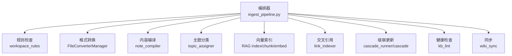
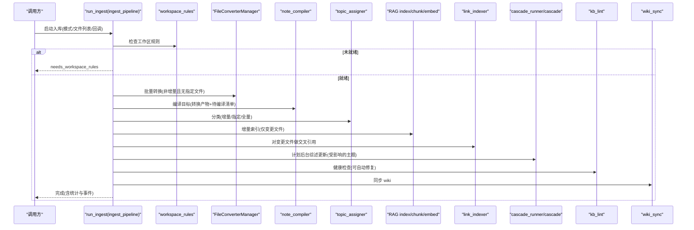
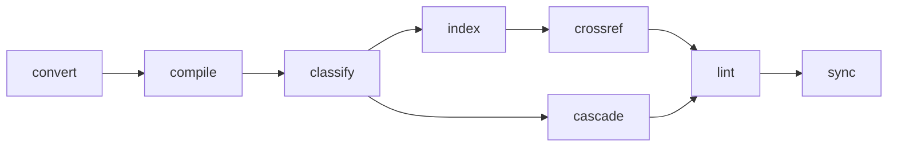

# 流水线处理阶段

<cite>
**本文引用的文件**   
- [ingest_pipeline.py](file://python/sidecar/ingest_pipeline.py)
- [file_converter.py](file://modules/file_converter.py)
- [note_compiler.py](file://utils/note_compiler.py)
- [topic_assigner.py](file://utils/topic_assigner.py)
- [link_indexer.py](file://utils/link_indexer.py)
- [cascade_runner.py](file://python/sidecar/cascade_runner.py)
- [cascade.py](file://python/sidecar/cascade.py)
- [kb_lint.py](file://python/sidecar/kb_lint.py)
</cite>

## 目录
1. [简介](#简介)
2. [项目结构](#项目结构)
3. [核心组件](#核心组件)
4. [架构总览](#架构总览)
5. [详细阶段分析](#详细阶段分析)
6. [依赖关系分析](#依赖关系分析)
7. [性能考虑](#性能考虑)
8. [故障排查指南](#故障排查指南)
9. [结论](#结论)
10. [附录：扩展新阶段的示例](#附录扩展新阶段的示例)

## 简介
本技术文档聚焦于入库流水线的九个核心处理阶段：rules（规则检查）、convert（格式转换）、compile（内容编译）、classify（主题分类）、index（向量索引）、crossref（交叉引用）、cascade（级联更新）、lint（健康检查）、sync（同步）。文档将系统阐述每个阶段的输入输出、处理逻辑、错误处理与性能优化策略，并给出阶段间的数据流转与依赖图。同时提供如何扩展新阶段的实践指引。

## 项目结构
入库流水线由编排器与多个领域模块协作完成：
- 编排器负责阶段调度、状态持久化、取消控制、进度上报与统计汇总。
- 各阶段通过独立模块实现具体业务逻辑，并在需要时调用 RAG、LLM、文件系统与索引子系统。

图表来源
- [ingest_pipeline.py:480-947](file://python/sidecar/ingest_pipeline.py#L480-L947)
- [file_converter.py:407-770](file://modules/file_converter.py#L407-L770)
- [note_compiler.py:105-238](file://utils/note_compiler.py#L105-L238)
- [topic_assigner.py:318-328](file://utils/topic_assigner.py#L318-L328)
- [link_indexer.py:430-560](file://utils/link_indexer.py#L430-L560)
- [cascade_runner.py:74-184](file://python/sidecar/cascade_runner.py#L74-L184)
- [kb_lint.py:414-484](file://python/sidecar/kb_lint.py#L414-L484)

章节来源
- [ingest_pipeline.py:480-947](file://python/sidecar/ingest_pipeline.py#L480-L947)

## 核心组件
- 编排器（run_ingest）：定义阶段顺序、增量/全量模式、断点续跑、取消机制、进度回调与事件通知；维护工作区指纹与阶段完成集合，避免重复计算。
- 转换器（FileConverterManager）：多格式到 Markdown 的批量转换，支持质量评估、去重归档、可选 LLM 重写与自动主题分配。
- 编译器（note_compiler）：对已转换或导入笔记进行规则清理与可选 LLM 重写，保留 frontmatter，记录编译状态。
- 分类器（topic_assigner）：基于文件夹路径、标题、标签、LLM 建议等策略自动分配主题，必要时进入待确认队列。
- 索引器（RAG index/chunk/embedder）：按文件粒度分块、向量化与替换写入，支持完整性修复与增量更新。
- 交叉引用（link_indexer）：两阶段发现（本地启发 + LLM 精判），持久化 .links.json，支持冷却与缓存。
- 级联更新（cascade_runner/cascade）：为受影响主题生成/更新综述，带重试、失败持久化与流式事件。
- 健康检查（kb_lint）：扫描断链、孤儿页、过时综述、重复与错位问题，支持自动修复与报告持久化。
- 同步（wiki_sync）：在流程末尾同步 wiki 元数据。

章节来源
- [ingest_pipeline.py:480-947](file://python/sidecar/ingest_pipeline.py#L480-L947)
- [file_converter.py:407-770](file://modules/file_converter.py#L407-L770)
- [note_compiler.py:105-238](file://utils/note_compiler.py#L105-L238)
- [topic_assigner.py:318-328](file://utils/topic_assigner.py#L318-L328)
- [link_indexer.py:430-560](file://utils/link_indexer.py#L430-L560)
- [cascade_runner.py:74-184](file://python/sidecar/cascade_runner.py#L74-L184)
- [kb_lint.py:414-484](file://python/sidecar/kb_lint.py#L414-L484)

## 架构总览
下图展示了从入口到各阶段的完整调用链与关键交互。

图表来源
- [ingest_pipeline.py:480-947](file://python/sidecar/ingest_pipeline.py#L480-L947)
- [file_converter.py:407-770](file://modules/file_converter.py#L407-L770)
- [note_compiler.py:105-238](file://utils/note_compiler.py#L105-L238)
- [topic_assigner.py:318-328](file://utils/topic_assigner.py#L318-L328)
- [link_indexer.py:430-560](file://utils/link_indexer.py#L430-L560)
- [cascade_runner.py:74-184](file://python/sidecar/cascade_runner.py#L74-L184)
- [kb_lint.py:414-484](file://python/sidecar/kb_lint.py#L414-L484)

## 详细阶段分析

### 1. rules（规则检查）
- 输入
  - 工作区路径（来自配置）
- 处理逻辑
  - 检查工作区是否已完成必要规则配置；若未完成则提前终止并返回提示。
- 输出
  - 成功：继续后续阶段
  - 失败：返回 needs_workspace_rules 标志与消息
- 错误处理
  - 通过事件上报与状态保存，前端可感知“需配置规则”的状态。
- 性能优化
  - 快速短路，避免后续昂贵操作。

章节来源
- [ingest_pipeline.py:597-617](file://python/sidecar/ingest_pipeline.py#L597-L617)

### 2. convert（格式转换）
- 输入
  - 工作区中待转换的非 Markdown 文件（增量模式下扫描）
- 处理逻辑
  - 使用 FileConverterManager.convert_batch 批量转换，支持 PDF/DOCX/PPTX/TXT/HTML 等。
  - 质量评估：过滤过短、乱码、疑似扫描 PDF 等低质量结果。
  - 可选 LLM 重写以提升可读性（长度阈值内）。
  - 自动归档原文件至 Raw 并更新 source 字段。
  - 可选自动主题分配（assign_topic）。
- 输出
  - 转换结果列表（包含 success/output_path/error/quality/tags/source_sha256/archived_source 等）
  - 统计 converted 计数与产出相对路径集合
- 错误处理
  - 任一转换失败即抛出运行时异常，中断流水线；失败详情记录在日志与转换结果中。
- 性能优化
  - 增量扫描仅处理新增/未转换文件；已有相同源哈希的输出直接跳过；批量回调推进进度。

章节来源
- [ingest_pipeline.py:627-654](file://python/sidecar/ingest_pipeline.py#L627-L654)
- [file_converter.py:407-770](file://modules/file_converter.py#L407-L770)

### 3. compile（内容编译）
- 输入
  - 转换产出的 Markdown 文件集合
  - 扫描得到的待编译清单（如来自 PDF/Word 源）
- 处理逻辑
  - 规则清理：去除页眉页脚、重复行、版权信息等噪声。
  - 可选 LLM 重写：在 API 可用且文本长度满足条件时进行整篇改写。
  - 保留 frontmatter，写回文件并记录编译状态。
- 输出
  - 统计 compiled 计数与变更文件列表
- 错误处理
  - 单文件异常被捕获并记录，不影响其他文件；正文过短会标记失败但不中断批次。
- 性能优化
  - 增量判断：仅对需要编译的文件执行；长文跳过整篇 LLM 改写以降低耗时。

章节来源
- [ingest_pipeline.py:658-686](file://python/sidecar/ingest_pipeline.py#L658-L686)
- [note_compiler.py:105-238](file://utils/note_compiler.py#L105-L238)

### 4. classify（主题分类）
- 输入
  - 增量：扫描到的待分类 Markdown 文件
  - 指定：传入的文件路径集合
  - 全量：默认不触发（除非首次或强制）
- 处理逻辑
  - 对每个文件调用 auto_assign_topic_for_file，尝试自动分配主题。
  - 根据结果累计 classified/pending_topics 统计，收集受影响主题集合 affected_topics。
  - 运行 misplaced notes 自动移动，更新 affected_topics。
- 输出
  - 统计 classified/pending_topics/auto_topic_moves
  - 受影响主题列表（用于后续 cascade）
- 错误处理
  - 单个文件分类异常被捕获并记录；若存在错误列表，抛出运行时异常中断流水线。
- 性能优化
  - 增量扫描仅处理 inbox/orphan 且缺少有效 topic 的文件；避免重复处理。

章节来源
- [ingest_pipeline.py:690-746](file://python/sidecar/ingest_pipeline.py#L690-L746)
- [topic_assigner.py:318-328](file://utils/topic_assigner.py#L318-L328)

### 5. index（向量索引）
- 输入
  - 增量：mtime 变化的 Notes 下 Markdown 文件
  - 指定：传入的 Markdown 文件集合
  - 全量：Notes 下所有符合条件的 Markdown
- 处理逻辑
  - 删除已不存在文件的索引条目，保持索引一致性。
  - 对需要更新的文件进行分块、嵌入、替换写入，并记录 mtime/size。
  - 完整性校验：当实际分块数与清单不一致时，触发全量修复。
- 输出
  - indexed_files 计数与本次更新的相对路径列表
- 错误处理
  - 准备阶段异常会被聚合，达到阈值后抛出运行时异常；取消信号会在写入前检查，避免部分写入。
- 性能优化
  - 增量更新：仅处理有改动的文件；并发访问保护（索引互斥）；失败降级与冷却。

章节来源
- [ingest_pipeline.py:747-786](file://python/sidecar/ingest_pipeline.py#L747-L786)

### 6. crossref（交叉引用）
- 输入
  - 本次索引更新的相对路径集合（若无变更则跳过）
- 处理逻辑
  - 对每个变更文件调用 discover_cross_refs_for_file，采用本地启发 + 向量检索 + LLM 精判的两阶段策略。
  - 小批量时使用 LLM，大批量时跳过以节省时间。
  - 结果写入 .links.json，自动去重与自引用过滤。
- 输出
  - 统计 cross_refs 新增条数
- 错误处理
  - 单个文件异常被捕获并记录；若存在错误列表，抛出运行时异常中断流水线。
- 性能优化
  - 文件数量阈值控制 LLM 使用；向量搜索具备冷却期；元数据缓存按 mtime 增量加载。

章节来源
- [ingest_pipeline.py:790-832](file://python/sidecar/ingest_pipeline.py#L790-L832)
- [link_indexer.py:430-560](file://utils/link_indexer.py#L430-L560)

### 7. cascade（级联更新）
- 输入
  - 受影响主题集合（来自 classify 与自动移动）
- 处理逻辑
  - 读取工作区规则决定是否启用自动综述更新；解析 survey_at_level 得到最终主题列表。
  - 将任务登记为后台作业，避免阻塞主流程。
- 输出
  - 统计 cascade_topics 列表
- 错误处理
  - 后台任务内部具备重试与失败持久化，可在后续手动重试。
- 性能优化
  - 异步执行，不阻塞主流水线；仅在需要时触发。

章节来源
- [ingest_pipeline.py:836-858](file://python/sidecar/ingest_pipeline.py#L836-L858)
- [cascade_runner.py:74-184](file://python/sidecar/cascade_runner.py#L74-L184)
- [cascade.py:312-386](file://python/sidecar/cascade.py#L312-L386)

### 8. lint（健康检查）
- 输入
  - 工作区 Notes 下的 Markdown 文件集合
- 处理逻辑
  - 可选自动修复：断链清理、过时综述刷新、错位笔记移动。
  - 扫描问题：断链、孤儿主题、过时综述、重复/近似重复、错位笔记、待确认主题等。
  - 生成报告并持久化，同时写入工作区日志摘要。
- 输出
  - 统计 summary（各类问题计数）与 issues 列表
- 错误处理
  - 扫描过程容错，单文件异常不影响整体；报告持久化失败不影响主流程。
- 性能优化
  - 增量与缓存策略（如重复检测、元数据缓存）；按需触发 LLM 与组织审计。

章节来源
- [ingest_pipeline.py:862-876](file://python/sidecar/ingest_pipeline.py#L862-L876)
- [kb_lint.py:414-484](file://python/sidecar/kb_lint.py#L414-L484)

### 9. sync（同步）
- 输入
  - 工作区
- 处理逻辑
  - 同步 wiki 元数据，确保外部视图与文件一致。
- 输出
  - 完成状态与最终统计
- 错误处理
  - 同步失败通常记录日志，不影响主流程完成态。
- 性能优化
  - 作为收尾步骤，轻量且幂等。

章节来源
- [ingest_pipeline.py:879-886](file://python/sidecar/ingest_pipeline.py#L879-L886)

## 依赖关系分析
- 阶段耦合
  - convert → compile：编译依赖转换产物
  - compile/classify → index：索引依赖最终 Markdown 内容与位置
  - index → crossref：交叉引用仅对变更文件执行
  - classify/move → cascade：受影响主题驱动综述更新
  - 全部完成后 → lint/sync：健康检查与同步作为收尾
- 外部依赖
  - RAG 索引（分块/嵌入/混合检索）
  - LLM（可选，用于编译重写、交叉引用、综述生成）
  - 文件系统（Notes/wiki/Raw 目录）
  - 工作区规则与元数据

图表来源
- [ingest_pipeline.py:480-947](file://python/sidecar/ingest_pipeline.py#L480-L947)

章节来源
- [ingest_pipeline.py:480-947](file://python/sidecar/ingest_pipeline.py#L480-L947)

## 性能考虑
- 增量优先：指纹对比、mtime 变化、编译/索引/分类的增量扫描，避免全量开销。
- 并发与互斥：索引更新加锁，防止多实例竞争；线程池承载 RPC 请求。
- 成本敏感：大文件跳过整篇 LLM 改写；交叉引用在小批量时使用 LLM；向量检索失败冷却。
- 幂等与断点续跑：阶段完成集合与中间状态持久化，支持中断恢复与重复安全。
- 缓存与去重：链接元数据按 mtime 缓存；转换结果按源哈希去重。

[本节为通用指导，无需代码来源]

## 故障排查指南
- 常见错误定位
  - 规则未配置：检查 workspace_rules 初始化与设置界面。
  - 转换失败：查看转换结果 error 字段与工作区日志；确认外部工具可用性（PDF/DOCX/PPT 解析器）。
  - 索引不可用：确认 RAG 索引服务可访问，避免多实例冲突。
  - 交叉引用失败：检查 LLM 配置与向量检索冷却；查看 .links.json 是否损坏。
  - 综述更新失败：查看 cascade_failures.json 与日志，支持手动重试。
  - 健康检查问题：查看 lint_report.json 与工作区日志，逐项修复。
- 恢复与重试
  - 中断后可自动续跑；失败项可通过专用接口重试（如级联失败）。
  - 强制全量：设置 force_full_next 标志后下次自动全量。

章节来源
- [ingest_pipeline.py:915-942](file://python/sidecar/ingest_pipeline.py#L915-L942)
- [cascade_runner.py:187-194](file://python/sidecar/cascade_runner.py#L187-L194)
- [kb_lint.py:680-700](file://python/sidecar/kb_lint.py#L680-L700)

## 结论
入库流水线以强幂等、增量优先与可观测性为核心设计原则，覆盖从原始文件到知识图谱的关键环节。通过阶段解耦、状态持久化与失败重试机制，系统在大规模知识库场景下具备良好的稳定性与可扩展性。

[本节为总结，无需代码来源]

## 附录：扩展新阶段的示例
以下示例展示如何在现有流水线中插入一个新阶段（例如“合规审查”），并保持与既有阶段一致的输入输出与错误处理风格。

- 在 STAGES 中添加新阶段名
  - 参考：STAGES 常量定义处
- 在 run_ingest 中增加阶段分支
  - 参考：各阶段分支结构与 mark_stage_done 的使用方式
- 实现阶段函数
  - 输入：工作区路径、当前阶段上下文（如 affected_topics/indexed_paths）
  - 输出：统计信息字典（合并入 stats）
  - 错误：抛出运行时异常或记录错误列表后统一处理
  - 进度：通过 prog(stage, progress, message) 上报
- 集成事件与持久化
  - 使用 save_ingest_state 保存阶段完成集合与统计
  - 如需对外事件，使用 send_event 发送结构化事件

章节来源
- [ingest_pipeline.py:23-23](file://python/sidecar/ingest_pipeline.py#L23-L23)
- [ingest_pipeline.py:575-583](file://python/sidecar/ingest_pipeline.py#L575-L583)
- [ingest_pipeline.py:584-591](file://python/sidecar/ingest_pipeline.py#L584-L591)
- [ingest_pipeline.py:887-913](file://python/sidecar/ingest_pipeline.py#L887-L913)