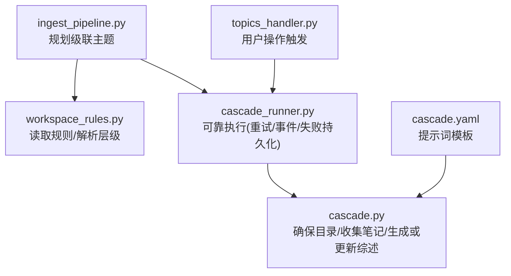
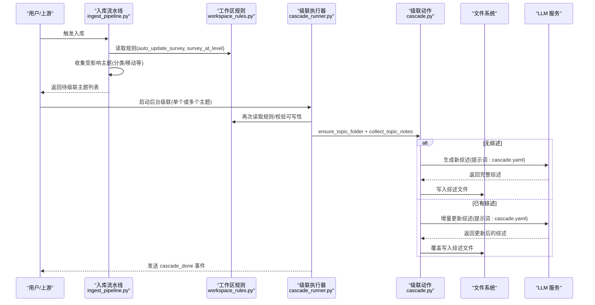
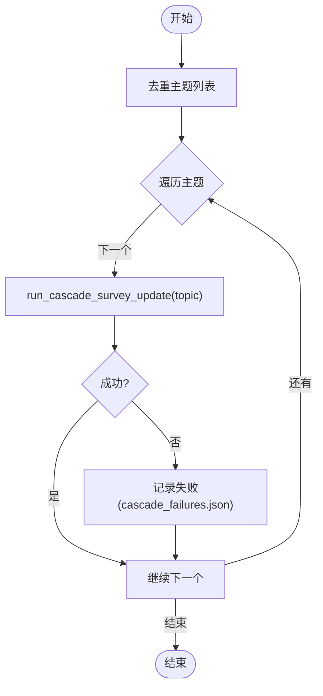
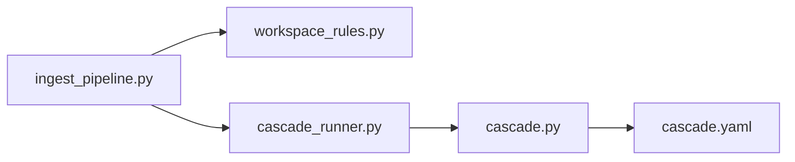

# 级联更新阶段

<cite>
**本文引用的文件**   
- [cascade.py](file://python/sidecar/cascade.py)
- [cascade_runner.py](file://python/sidecar/cascade_runner.py)
- [workspace_rules.py](file://python/sidecar/workspace_rules.py)
- [ingest_pipeline.py](file://python/sidecar/ingest_pipeline.py)
- [topics_handler.py](file://python/sidecar/handlers/topics_handler.py)
- [cascade.yaml](file://prompts/yaml/cascade.yaml)
</cite>

## 目录
1. [简介](#简介)
2. [项目结构](#项目结构)
3. [核心组件](#核心组件)
4. [架构总览](#架构总览)
5. [详细组件分析](#详细组件分析)
6. [依赖关系分析](#依赖关系分析)
7. [性能考量](#性能考量)
8. [故障排查指南](#故障排查指南)
9. [结论](#结论)
10. [附录：配置与示例](#附录配置与示例)

## 简介
本技术文档聚焦入库流水线的“级联更新阶段”，围绕以下目标展开：
- 解释依赖传播机制、影响范围计算与批量更新策略
- 说明级联规则配置、更新顺序控制与回滚机制
- 提供级联配置示例与异常处理策略
- 通过代码片段路径展示如何定义新的级联规则（以综述更新为例）

该阶段在入库流水线中负责将受影响的笔记主题映射到需要更新的“综述”集合，并在后台可靠地执行生成或增量更新。

## 项目结构
级联更新相关的关键模块与职责如下：
- sidecar/cascade.py：级联动作实现（创建/移动文件、收集主题笔记、生成或更新综述、日志记录等）
- sidecar/cascade_runner.py：可靠的级联执行器（重试、事件推送、失败持久化）
- sidecar/workspace_rules.py：工作区规则加载与解析（是否自动更新、综述层级等）
- sidecar/ingest_pipeline.py：入库流水线编排，负责识别受影响主题并安排后台综述更新
- handlers/topics_handler.py：触发级联的入口（如确认主题、移动文件后触发）
- prompts/yaml/cascade.yaml：综述生成的提示词模板（新综述/更新综述/对话沉淀）

图示来源
- [ingest_pipeline.py:836-858](file://python/sidecar/ingest_pipeline.py#L836-L858)
- [workspace_rules.py:163-168](file://python/sidecar/workspace_rules.py#L163-L168)
- [cascade_runner.py:74-153](file://python/sidecar/cascade_runner.py#L74-L153)
- [cascade.py:388-426](file://python/sidecar/cascade.py#L388-L426)
- [cascade.yaml:1-72](file://prompts/yaml/cascade.yaml#L1-L72)

章节来源
- [ingest_pipeline.py:836-858](file://python/sidecar/ingest_pipeline.py#L836-L858)
- [workspace_rules.py:15-22](file://python/sidecar/workspace_rules.py#L15-L22)
- [cascade_runner.py:74-153](file://python/sidecar/cascade_runner.py#L74-L153)
- [cascade.py:388-426](file://python/sidecar/cascade.py#L388-L426)
- [topics_handler.py:428-431](file://python/sidecar/handlers/topics_handler.py#L428-L431)
- [cascade.yaml:1-72](file://prompts/yaml/cascade.yaml#L1-L72)

## 核心组件
- 级联执行器 cascade_runner.run_cascade_survey_update
  - 作用：对指定主题执行“新建/更新综述”，具备重试、事件推送、失败持久化能力
  - 关键流程：检查规则 → 校验可写性 → 确保目录 → 收集笔记 → 判断是否存在综述 → 调用生成/更新 → 记录日志/清除失败项 → 发送完成事件
- 级联动作 cascade.cascade_on_topic_resolved / generate_new_survey / update_existing_survey
  - 作用：组织主题目录、移动文件、收集主题下笔记、压缩长文本、调用 LLM 生成或增量更新综述
- 规则与影响范围 workspace_rules.load_workspace_rules / resolve_survey_topic
  - 作用：加载 auto_update_survey、survey_at_level 等规则；将具体主题按层级归一到“综述级别”的主题
- 流水线集成 ingest_pipeline.run_ingest（cascade 阶段）
  - 作用：汇总受影响主题，按规则去重/归一化，输出待级联主题列表，交由后台任务执行

章节来源
- [cascade_runner.py:74-153](file://python/sidecar/cascade_runner.py#L74-L153)
- [cascade.py:388-426](file://python/sidecar/cascade.py#L388-L426)
- [workspace_rules.py:15-22](file://python/sidecar/workspace_rules.py#L15-L22)
- [workspace_rules.py:163-168](file://python/sidecar/workspace_rules.py#L163-L168)
- [ingest_pipeline.py:836-858](file://python/sidecar/ingest_pipeline.py#L836-L858)

## 架构总览
下图展示了从入库流水线到后台级联执行的端到端流程，包括依赖传播、影响范围计算与批量更新策略。

图示来源
- [ingest_pipeline.py:836-858](file://python/sidecar/ingest_pipeline.py#L836-L858)
- [workspace_rules.py:163-168](file://python/sidecar/workspace_rules.py#L163-L168)
- [cascade_runner.py:74-153](file://python/sidecar/cascade_runner.py#L74-L153)
- [cascade.py:388-426](file://python/sidecar/cascade.py#L388-L426)
- [cascade.yaml:1-72](file://prompts/yaml/cascade.yaml#L1-L72)

## 详细组件分析

### 依赖传播机制
- 触发点
  - 入库流水线 classify 阶段会收集“受影响主题”集合 affected_topics
  - 当自动主题迁移生效时，也会将当前主题与建议主题加入受影响集合
- 传播路径
  - 受影响主题集合由分类与自动迁移共同贡献
  - 在 cascade 阶段，依据规则将每个主题归一到“综述级别”（例如二级），得到最终待级联主题集
- 关键点
  - 去重与排序：使用集合去重，最后排序输出，保证幂等与稳定顺序
  - 条件开关：auto_update_survey 为 False 时，不产生任何级联任务

章节来源
- [ingest_pipeline.py:716-746](file://python/sidecar/ingest_pipeline.py#L716-L746)
- [ingest_pipeline.py:836-858](file://python/sidecar/ingest_pipeline.py#L836-L858)

### 影响范围计算
- 规则参数
  - auto_update_survey：是否启用自动综述更新
  - survey_at_level：综述所在层级（默认 2，限制最大为 2）
- 计算方法
  - 对每个受影响主题，按 TOPIC_SEP 拆分，截取前 survey_at_level 段作为“综述主题”
  - 若主题层级不足，则取实际可用层级
- 结果
  - 得到一组稳定的“综述主题”集合，用于后续批量更新

章节来源
- [workspace_rules.py:15-22](file://python/sidecar/workspace_rules.py#L15-L22)
- [workspace_rules.py:163-168](file://python/sidecar/workspace_rules.py#L163-L168)
- [ingest_pipeline.py:846-851](file://python/sidecar/ingest_pipeline.py#L846-L851)

### 批量更新策略
- 串行执行与去重
  - 接收到的主题列表先做去重，再逐个执行
- 重试与退避
  - 单次主题更新最多重试 MAX_RETRIES 次，间隔 RETRY_DELAY_SEC
- 失败持久化
  - 失败项写入 cascade_failures.json，支持手动重试
- 事件驱动
  - 流式 token 回调与最终 cascade_done 事件，便于前端进度反馈

图示来源
- [cascade_runner.py:156-184](file://python/sidecar/cascade_runner.py#L156-L184)
- [cascade_runner.py:55-71](file://python/sidecar/cascade_runner.py#L55-L71)
- [cascade_runner.py:74-153](file://python/sidecar/cascade_runner.py#L74-L153)

章节来源
- [cascade_runner.py:156-184](file://python/sidecar/cascade_runner.py#L156-L184)
- [cascade_runner.py:55-71](file://python/sidecar/cascade_runner.py#L55-L71)
- [cascade_runner.py:74-153](file://python/sidecar/cascade_runner.py#L74-L153)

### 更新顺序控制
- 顺序原则
  - 先确保主题目录存在
  - 再收集主题下所有笔记
  - 根据是否存在综述决定“新建”或“更新”
- 并发与取消
  - 单个主题的更新内部串行；外部可通过事件取消（入库流水线层）
- 幂等性
  - 重复执行同一主题不会产生额外副作用（目录/文件存在即跳过创建）

章节来源
- [cascade_runner.py:112-153](file://python/sidecar/cascade_runner.py#L112-L153)
- [cascade.py:388-426](file://python/sidecar/cascade.py#L388-L426)

### 回滚机制
- 现状
  - 当前实现未提供原子事务或自动回滚
- 建议策略
  - 在写入综述前备份旧内容，失败时恢复
  - 使用临时文件写入后再原子替换（参考指纹保存的原子写入模式）
  - 结合失败清单进行人工干预与重试

章节来源
- [ingest_pipeline.py:126-144](file://python/sidecar/ingest_pipeline.py#L126-L144)
- [cascade_runner.py:55-71](file://python/sidecar/cascade_runner.py#L55-L71)

### 级联规则配置
- 配置文件位置
  - 工作区应用目录下的 workspace_rules.json
- 关键字段
  - max_topic_depth：主题最大层级
  - auto_update_survey：是否自动更新综述
  - survey_at_level：综述所在层级（1~2）
  - ai_may_edit_wiki / ai_may_edit_notes：AI 编辑权限
- 默认值与迁移
  - 不存在时采用默认值；可从旧 schema.md 迁移

章节来源
- [workspace_rules.py:15-22](file://python/sidecar/workspace_rules.py#L15-L22)
- [workspace_rules.py:32-56](file://python/sidecar/workspace_rules.py#L32-L56)
- [workspace_rules.py:79-92](file://python/sidecar/workspace_rules.py#L79-L92)

### 异常处理策略
- 常见错误
  - 未设置工作区、主题非法、API 配置错误、文件不可写
- 处理要点
  - 前置校验：工作区、可写性、API 配置
  - 中间容错：捕获异常并记录日志，必要时重试
  - 失败持久化：记录 topic 与错误信息，支持后续重试
  - 事件上报：向调用方发送 cascade_done 事件，包含 success/message/data

章节来源
- [cascade_runner.py:74-153](file://python/sidecar/cascade_runner.py#L74-L153)
- [cascade.py:312-386](file://python/sidecar/cascade.py#L312-L386)

### 新增级联规则示例（以“综述更新”为例）
- 步骤概览
  - 在工作区规则中启用 auto_update_survey 并设置 survey_at_level
  - 在入库流水线 cascade 阶段收集受影响主题并按规则归一化
  - 后台执行器对每个主题执行“新建/更新综述”
  - 失败项持久化，支持重试
- 代码片段路径（不含具体代码）
  - 规则加载与默认值：[workspace_rules.py:15-22](file://python/sidecar/workspace_rules.py#L15-L22)
  - 规则保存与校验：[workspace_rules.py:79-92](file://python/sidecar/workspace_rules.py#L79-L92)
  - 影响范围归一化：[workspace_rules.py:163-168](file://python/sidecar/workspace_rules.py#L163-L168)
  - 流水线级联计划：[ingest_pipeline.py:836-858](file://python/sidecar/ingest_pipeline.py#L836-L858)
  - 可靠执行与重试：[cascade_runner.py:74-153](file://python/sidecar/cascade_runner.py#L74-L153)
  - 级联动作（目录/笔记/生成或更新）：[cascade.py:388-426](file://python/sidecar/cascade.py#L388-L426)
  - 提示词模板（新/更新）：[cascade.yaml:1-72](file://prompts/yaml/cascade.yaml#L1-L72)

章节来源
- [workspace_rules.py:15-22](file://python/sidecar/workspace_rules.py#L15-L22)
- [workspace_rules.py:79-92](file://python/sidecar/workspace_rules.py#L79-L92)
- [workspace_rules.py:163-168](file://python/sidecar/workspace_rules.py#L163-L168)
- [ingest_pipeline.py:836-858](file://python/sidecar/ingest_pipeline.py#L836-L858)
- [cascade_runner.py:74-153](file://python/sidecar/cascade_runner.py#L74-L153)
- [cascade.py:388-426](file://python/sidecar/cascade.py#L388-L426)
- [cascade.yaml:1-72](file://prompts/yaml/cascade.yaml#L1-L72)

## 依赖关系分析
- 组件耦合
  - ingest_pipeline 仅依赖 workspace_rules 获取规则与归一化主题，不直接调用 LLM
  - cascade_runner 封装了重试、事件与失败持久化，屏蔽底层细节
  - cascade 专注业务逻辑（目录/笔记/生成或更新）
- 外部依赖
  - LLM 服务（通过提示词模板注入上下文）
  - 文件系统（Notes/Wiki 目录与综述文件）
  - 工作区规则 JSON 与失败清单 JSON

图示来源
- [ingest_pipeline.py:836-858](file://python/sidecar/ingest_pipeline.py#L836-L858)
- [workspace_rules.py:163-168](file://python/sidecar/workspace_rules.py#L163-L168)
- [cascade_runner.py:74-153](file://python/sidecar/cascade_runner.py#L74-L153)
- [cascade.py:388-426](file://python/sidecar/cascade.py#L388-L426)
- [cascade.yaml:1-72](file://prompts/yaml/cascade.yaml#L1-L72)

章节来源
- [ingest_pipeline.py:836-858](file://python/sidecar/ingest_pipeline.py#L836-L858)
- [workspace_rules.py:163-168](file://python/sidecar/workspace_rules.py#L163-L168)
- [cascade_runner.py:74-153](file://python/sidecar/cascade_runner.py#L74-L153)
- [cascade.py:388-426](file://python/sidecar/cascade.py#L388-L426)
- [cascade.yaml:1-72](file://prompts/yaml/cascade.yaml#L1-L72)

## 性能考量
- 文本压缩
  - 长笔记在进入 LLM 前进行压缩，降低输入长度与成本
- 增量更新
  - 已有综述时仅传入新增/修改笔记，减少不必要的全量重写
- 批量与去重
  - 批量主题去重后串行执行，避免重复工作
- 重试与退避
  - 有限次数重试与固定延迟，提高鲁棒性
- 索引与级联解耦
  - 流水线在 cascade 阶段仅计划任务，实际 LLM 工作在后台执行，避免阻塞

章节来源
- [cascade.py:232-264](file://python/sidecar/cascade.py#L232-L264)
- [cascade.py:348-386](file://python/sidecar/cascade.py#L348-L386)
- [cascade_runner.py:156-184](file://python/sidecar/cascade_runner.py#L156-L184)
- [ingest_pipeline.py:836-858](file://python/sidecar/ingest_pipeline.py#L836-L858)

## 故障排查指南
- 常见问题定位
  - 未设置工作区：检查 config.workspace_path
  - 主题名称非法：检查主题分隔符与命名规范
  - API 配置错误：检查 LLM 配置与网络连通性
  - 文件不可写：检查 Wiki 目录权限与 ai_may_edit_wiki 规则
- 失败重试
  - 查看 cascade_failures.json，使用 retry_failed_cascades 接口重新执行
- 日志与事件
  - 查看工作区日志（append_changelog）
  - 监听 cascade_done 事件，关注 success/message/data

章节来源
- [cascade_runner.py:55-71](file://python/sidecar/cascade_runner.py#L55-L71)
- [cascade_runner.py:187-194](file://python/sidecar/cascade_runner.py#L187-L194)
- [cascade.py:429-446](file://python/sidecar/cascade.py#L429-L446)

## 结论
级联更新阶段通过“规则驱动 + 影响范围归一化 + 可靠执行器”的组合，实现了高内聚、低耦合且可扩展的综述自动生成与增量更新能力。其设计兼顾了幂等性、可观测性与健壮性，适合在生产环境中持续演进。

## 附录：配置与示例
- 工作区规则示例键位
  - auto_update_survey: true/false
  - survey_at_level: 1 或 2
  - ai_may_edit_wiki: true/false
  - ai_may_edit_notes: true/false
  - max_topic_depth: 1~3
- 典型场景
  - 首次启用：开启 auto_update_survey，设置 survey_at_level=2
  - 增量维护：保持默认，仅在分类/迁移后自动触发
  - 失败恢复：查看失败清单并执行重试

章节来源
- [workspace_rules.py:15-22](file://python/sidecar/workspace_rules.py#L15-L22)
- [workspace_rules.py:79-92](file://python/sidecar/workspace_rules.py#L79-L92)
- [cascade_runner.py:187-194](file://python/sidecar/cascade_runner.py#L187-L194)