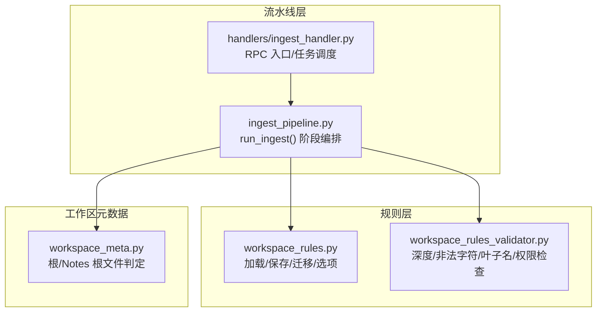
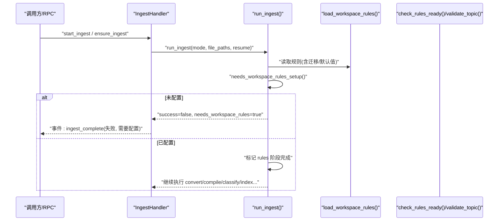
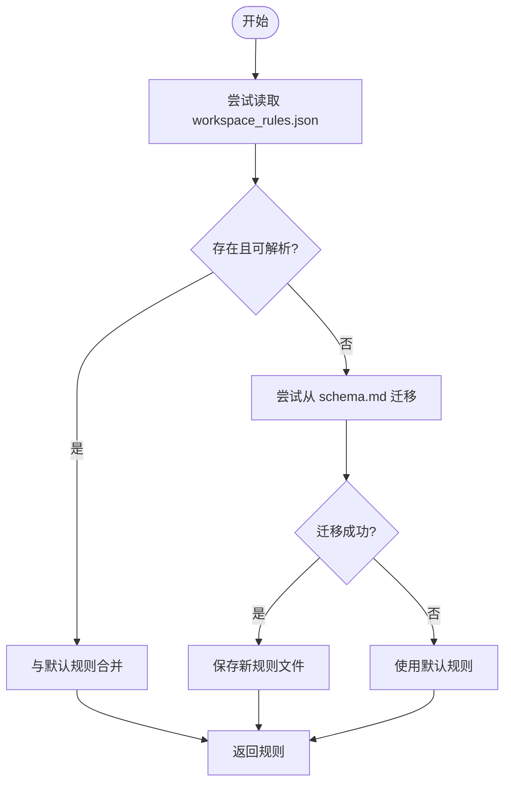
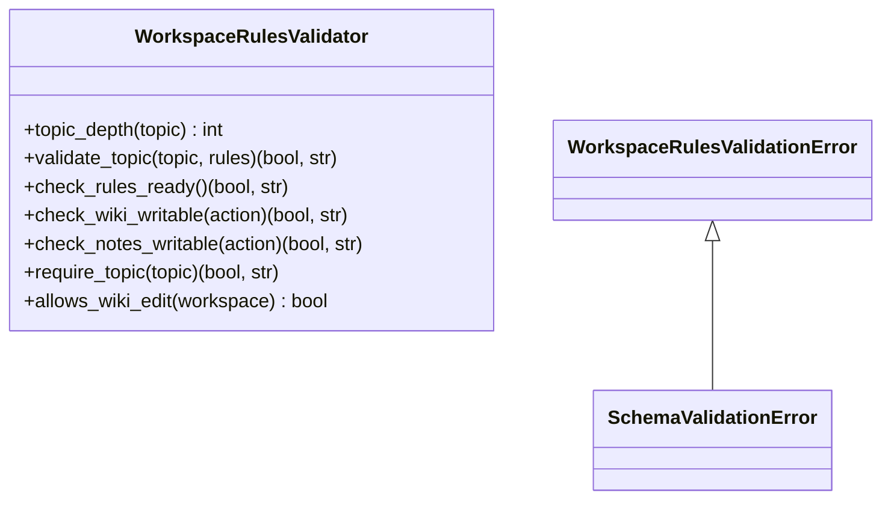
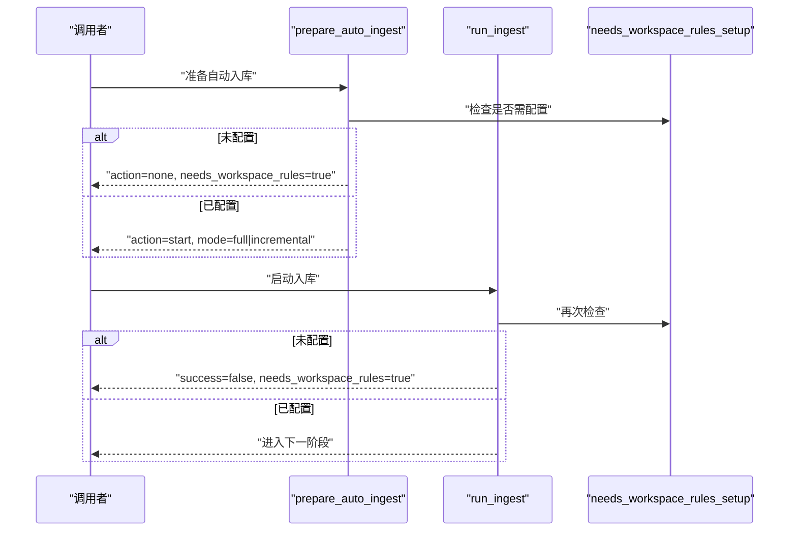
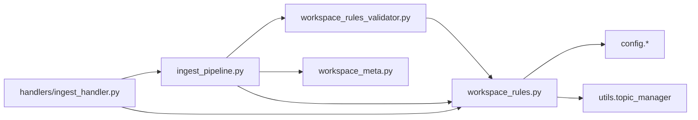

# 规则检查阶段

<cite>
**本文引用的文件**   
- [python/sidecar/workspace_rules.py](file://python/sidecar/workspace_rules.py)
- [python/sidecar/workspace_rules_validator.py](file://python/sidecar/workspace_rules_validator.py)
- [python/sidecar/ingest_pipeline.py](file://python/sidecar/ingest_pipeline.py)
- [python/sidecar/handlers/ingest_handler.py](file://python/sidecar/handlers/ingest_handler.py)
- [python/sidecar/workspace_meta.py](file://python/sidecar/workspace_meta.py)
- [tests/unit/test_workspace_rules.py](file://tests/unit/test_workspace_rules.py)
</cite>

## 目录
1. [简介](#简介)
2. [项目结构](#项目结构)
3. [核心组件](#核心组件)
4. [架构总览](#架构总览)
5. [详细组件分析](#详细组件分析)
6. [依赖关系分析](#依赖关系分析)
7. [性能考量](#性能考量)
8. [故障排查指南](#故障排查指南)
9. [结论](#结论)
10. [附录](#附录)

## 简介
本章节聚焦入库流水线中的“规则检查阶段”，系统化阐述工作区规则验证机制，包括：
- 配置完整性检查（是否完成初始化、字段合法性与取值范围）
- 目录结构验证（Notes 层级与主题路径约束）
- 权限设置（AI 对 Wiki/Notes 的写入控制）
- 触发条件（何时进入规则检查、如何影响后续流程）
- 验证流程与错误处理策略
- 规则配置的完整示例与常见问题解决方案
- 自定义工作区规则的代码级指引

## 项目结构
规则检查相关能力由以下模块协同实现：
- 规则定义与持久化：workspace_rules.py
- 运行时校验器：workspace_rules_validator.py
- 流水线编排与阶段调度：ingest_pipeline.py
- RPC 入口与状态上报：handlers/ingest_handler.py
- 工作区元数据辅助：workspace_meta.py
- 单元测试覆盖：tests/unit/test_workspace_rules.py

图示来源
- [python/sidecar/workspace_rules.py:1-200](file://python/sidecar/workspace_rules.py#L1-L200)
- [python/sidecar/workspace_rules_validator.py:1-94](file://python/sidecar/workspace_rules_validator.py#L1-L94)
- [python/sidecar/ingest_pipeline.py:480-620](file://python/sidecar/ingest_pipeline.py#L480-L620)
- [python/sidecar/handlers/ingest_handler.py:152-215](file://python/sidecar/handlers/ingest_handler.py#L152-L215)
- [python/sidecar/workspace_meta.py:101-121](file://python/sidecar/workspace_meta.py#L101-L121)

章节来源
- [python/sidecar/workspace_rules.py:1-200](file://python/sidecar/workspace_rules.py#L1-L200)
- [python/sidecar/workspace_rules_validator.py:1-94](file://python/sidecar/workspace_rules_validator.py#L1-L94)
- [python/sidecar/ingest_pipeline.py:480-620](file://python/sidecar/ingest_pipeline.py#L480-L620)
- [python/sidecar/handlers/ingest_handler.py:152-215](file://python/sidecar/handlers/ingest_handler.py#L152-L215)
- [python/sidecar/workspace_meta.py:101-121](file://python/sidecar/workspace_meta.py#L101-L121)

## 核心组件
- 规则定义与持久化
  - 默认规则集与字段含义
  - 从旧 schema.md 的一次性迁移
  - 读取/合并/保存规则并规范化取值范围
  - 提供工作区选项视图（如一级主题列表、最大深度等）
- 运行时校验器
  - 主题深度限制、非法路径字符检测、禁止的叶子节点名
  - 规则就绪性检查（是否已完成初始化）
  - AI 写权限检查（Wiki/Notes）
- 流水线集成
  - 在 run_ingest 的 rules 阶段进行前置检查
  - 未配置时中断并返回明确事件
  - 通过 prepare_auto_ingest 在自动入库前拦截
- RPC 接口
  - 获取/保存规则与选项
  - 判断是否需要初始化
  - 启动/重试/取消入库任务

章节来源
- [python/sidecar/workspace_rules.py:15-92](file://python/sidecar/workspace_rules.py#L15-L92)
- [python/sidecar/workspace_rules_validator.py:21-94](file://python/sidecar/workspace_rules_validator.py#L21-L94)
- [python/sidecar/ingest_pipeline.py:202-267](file://python/sidecar/ingest_pipeline.py#L202-L267)
- [python/sidecar/ingest_pipeline.py:597-620](file://python/sidecar/ingest_pipeline.py#L597-L620)
- [python/sidecar/handlers/ingest_handler.py:115-131](file://python/sidecar/handlers/ingest_handler.py#L115-L131)

## 架构总览
规则检查阶段位于入库流水线的第一个阶段。其职责是确保工作区已正确配置且满足运行约束，否则提前终止并通知上层。

图示来源
- [python/sidecar/handlers/ingest_handler.py:152-215](file://python/sidecar/handlers/ingest_handler.py#L152-L215)
- [python/sidecar/ingest_pipeline.py:480-620](file://python/sidecar/ingest_pipeline.py#L480-L620)
- [python/sidecar/workspace_rules.py:59-96](file://python/sidecar/workspace_rules.py#L59-L96)
- [python/sidecar/workspace_rules_validator.py:55-58](file://python/sidecar/workspace_rules_validator.py#L55-L58)

## 详细组件分析

### 组件一：工作区规则定义与持久化（workspace_rules.py）
- 默认规则字段
  - max_topic_depth：主题最大层级（被规范化到 1..3）
  - auto_update_survey：是否自动更新综述
  - survey_at_level：综述生成所在层级（被规范化到 1..2）
  - ai_may_edit_wiki：允许 AI 编辑 wiki
  - ai_may_edit_notes：允许 AI 编辑 Notes 正文
  - configured：是否已完成初始化
- 规则文件位置
  - 位于工作区应用目录下的 workspace_rules.json
- 迁移逻辑
  - 若存在旧的 schema.md，则一次性解析并生成新的 JSON 规则文件，同时标记 configured
- 读取与合并
  - 优先读取 JSON；不存在或解析失败时尝试迁移；均失败则回退到默认值
- 保存与规范化
  - 保存前对数值型字段做边界钳制，布尔字段强制类型转换
- 选项视图
  - get_workspace_rules_options 聚合当前规则与 Notes 目录的一级主题列表
- 主题结构摘要
  - format_wiki_topic_structure_for_llm 基于 Notes 目录生成供 LLM 分类的结构文本

图示来源
- [python/sidecar/workspace_rules.py:59-92](file://python/sidecar/workspace_rules.py#L59-L92)
- [python/sidecar/workspace_rules.py:32-56](file://python/sidecar/workspace_rules.py#L32-L56)

章节来源
- [python/sidecar/workspace_rules.py:15-92](file://python/sidecar/workspace_rules.py#L15-L92)
- [python/sidecar/workspace_rules.py:95-100](file://python/sidecar/workspace_rules.py#L95-L100)
- [python/sidecar/workspace_rules.py:143-161](file://python/sidecar/workspace_rules.py#L143-L161)
- [python/sidecar/workspace_rules.py:171-200](file://python/sidecar/workspace_rules.py#L171-L200)

### 组件二：运行时规则校验器（workspace_rules_validator.py）
- 主题校验 validate_topic
  - 非空检查
  - 非法路径字符检测（包含 .、..、/、\ 及不可见字符）
  - 层级深度不超过 max_topic_depth
  - 叶子节点名禁止为“其他/杂项/未分类”等兜底词
- 规则就绪 check_rules_ready
  - 基于 configured 标志判断是否完成初始化
- 权限检查
  - check_wiki_writable：当 ai_may_edit_wiki 为 False 时拒绝 Wiki 修改
  - check_notes_writable：当 ai_may_edit_notes 为 False 时拒绝 Notes 正文修改
- 便捷方法 require_topic/allows_wiki_edit

图示来源
- [python/sidecar/workspace_rules_validator.py:21-94](file://python/sidecar/workspace_rules_validator.py#L21-L94)

章节来源
- [python/sidecar/workspace_rules_validator.py:29-52](file://python/sidecar/workspace_rules_validator.py#L29-L52)
- [python/sidecar/workspace_rules_validator.py:55-82](file://python/sidecar/workspace_rules_validator.py#L55-L82)
- [python/sidecar/workspace_rules_validator.py:85-94](file://python/sidecar/workspace_rules_validator.py#L85-L94)

### 组件三：流水线集成与触发条件（ingest_pipeline.py）
- 阶段常量 STAGES 包含 rules 作为首阶段
- prepare_auto_ingest
  - 在未设置工作区、自动入库关闭、或未完成规则配置时，直接返回不启动
  - 根据上次完成状态与指纹变化决定 full/incremental/resume
- run_ingest
  - 在 rules 阶段立即检查 needs_workspace_rules_setup
  - 未配置：设置状态为 needs_workspace_rules，发送事件并返回失败结果
  - 已配置：标记 rules 阶段完成，继续后续步骤

图示来源
- [python/sidecar/ingest_pipeline.py:202-267](file://python/sidecar/ingest_pipeline.py#L202-L267)
- [python/sidecar/ingest_pipeline.py:597-620](file://python/sidecar/ingest_pipeline.py#L597-L620)
- [python/sidecar/workspace_rules.py:95-96](file://python/sidecar/workspace_rules.py#L95-L96)

章节来源
- [python/sidecar/ingest_pipeline.py:23-24](file://python/sidecar/ingest_pipeline.py#L23-L24)
- [python/sidecar/ingest_pipeline.py:202-267](file://python/sidecar/ingest_pipeline.py#L202-L267)
- [python/sidecar/ingest_pipeline.py:597-620](file://python/sidecar/ingest_pipeline.py#L597-L620)

### 组件四：RPC 入口与交互（handlers/ingest_handler.py）
- 暴露规则相关接口
  - get_schema_rules：返回当前规则
  - get_schema_options：返回规则选项（含 l1_topics）
  - save_schema_options：保存规则选项并标记 configured
  - needs_schema_setup：返回是否需要初始化
- 入库任务
  - start_ingest/ensure_ingest：根据 prepare_auto_ingest 决策是否启动
  - _do_ingest：包装 run_ingest，统一进度与事件上报

章节来源
- [python/sidecar/handlers/ingest_handler.py:115-131](file://python/sidecar/handlers/ingest_handler.py#L115-L131)
- [python/sidecar/handlers/ingest_handler.py:152-215](file://python/sidecar/handlers/ingest_handler.py#L152-L215)

### 组件五：工作区元数据辅助（workspace_meta.py）
- is_inbox_orphan_path：用于识别工作区根或 Notes 根下无文件夹派生主题的孤立 Markdown 文件
- 该函数参与入库的分类扫描逻辑，间接影响规则检查后的分类阶段

章节来源
- [python/sidecar/workspace_meta.py:101-121](file://python/sidecar/workspace_meta.py#L101-L121)

## 依赖关系分析
- 耦合与内聚
  - workspace_rules.py 负责规则 I/O 与默认值管理，内聚度高
  - workspace_rules_validator.py 仅依赖规则加载与常量，职责清晰
  - ingest_pipeline.py 将规则检查作为前置阶段，低耦合地组合各子功能
- 外部依赖
  - config.settings.WORKSPACE_APP_FOLDER、config.NOTES_FOLDER 等路径常量
  - utils.topic_manager 用于构建文件系统主题树（当 Notes 为空时）
- 潜在循环依赖
  - 当前未见循环导入；validator 仅读规则，pipeline 调用 validator 与 rules 模块

图示来源
- [python/sidecar/workspace_rules.py:1-12](file://python/sidecar/workspace_rules.py#L1-L12)
- [python/sidecar/workspace_rules_validator.py:1-7](file://python/sidecar/workspace_rules_validator.py#L1-L7)
- [python/sidecar/ingest_pipeline.py:14-22](file://python/sidecar/ingest_pipeline.py#L14-L22)
- [python/sidecar/handlers/ingest_handler.py:23-28](file://python/sidecar/handlers/ingest_handler.py#L23-L28)

章节来源
- [python/sidecar/workspace_rules.py:1-12](file://python/sidecar/workspace_rules.py#L1-L12)
- [python/sidecar/workspace_rules_validator.py:1-7](file://python/sidecar/workspace_rules_validator.py#L1-L7)
- [python/sidecar/ingest_pipeline.py:14-22](file://python/sidecar/ingest_pipeline.py#L14-L22)
- [python/sidecar/handlers/ingest_handler.py:23-28](file://python/sidecar/handlers/ingest_handler.py#L23-L28)

## 性能考量
- 规则加载与保存为轻量 IO，开销极低
- 规则检查在流水线早期短路，避免不必要的转换/索引成本
- 首次迁移 schema.md 会读取文本并进行正则匹配，但仅一次
- 建议保持 workspace_rules.json 小而稳定，避免频繁变更导致全量重跑

[本节为通用指导，无需源码引用]

## 故障排查指南
- 现象：入库提示“请先在设置 → 整理规则中完成工作区配置”
  - 原因：configured 为 False 或规则文件缺失/损坏
  - 解决：通过 RPC 保存规则选项或手动创建 workspace_rules.json 并设置 configured=true
- 现象：主题校验失败，提示“主题名称包含非法路径字符”
  - 原因：主题中包含 .、..、/、\ 或不可见字符
  - 解决：清理主题命名，仅保留合法字符
- 现象：主题校验失败，提示“主题层级不能超过 N 级”
  - 原因：max_topic_depth 限制被突破
  - 解决：调整 max_topic_depth 或缩短主题路径
- 现象：主题校验失败，提示“禁止将内容归入「其他/杂项/未分类」类主题”
  - 原因：叶子节点命中禁用集合
  - 解决：使用更具体的主题命名
- 现象：AI 无法修改 Wiki/Notes
  - 原因：ai_may_edit_wiki 或 ai_may_edit_notes 为 False
  - 解决：在规则选项中开启相应权限

章节来源
- [python/sidecar/workspace_rules_validator.py:34-52](file://python/sidecar/workspace_rules_validator.py#L34-L52)
- [python/sidecar/workspace_rules_validator.py:65-82](file://python/sidecar/workspace_rules_validator.py#L65-L82)
- [python/sidecar/ingest_pipeline.py:597-620](file://python/sidecar/ingest_pipeline.py#L597-L620)

## 结论
规则检查阶段通过“配置就绪性 + 主题合法性 + 权限控制”三重保障，确保入库流水线在安全、一致的上下文中运行。建议在首次使用时通过 RPC 或前端向导完成规则配置，并在后续使用中遵循主题命名规范与层级限制，以获得稳定的自动化体验。

[本节为总结性内容，无需源码引用]

## 附录

### A. 规则配置项说明
- max_topic_depth：主题最大层级，取值范围 1..3
- auto_update_survey：是否自动更新综述
- survey_at_level：综述生成所在层级，取值范围 1..2
- ai_may_edit_wiki：允许 AI 编辑 wiki
- ai_may_edit_notes：允许 AI 编辑 Notes 正文
- configured：是否已完成初始化（保存选项后自动置为 True）

章节来源
- [python/sidecar/workspace_rules.py:15-22](file://python/sidecar/workspace_rules.py#L15-L22)
- [python/sidecar/workspace_rules.py:79-92](file://python/sidecar/workspace_rules.py#L79-L92)
- [python/sidecar/workspace_rules.py:143-161](file://python/sidecar/workspace_rules.py#L143-L161)

### B. 常见错误码与消息
- “主题不能为空”
- “主题名称包含非法路径字符”
- “主题层级不能超过 N 级（当前 M 级）”
- “禁止将内容归入「其他/杂项/未分类」类主题”
- “请先在设置 → 整理规则中完成工作区配置”
- “工作区规则禁止 AI 修改 wiki/Notes 正文”

章节来源
- [python/sidecar/workspace_rules_validator.py:34-52](file://python/sidecar/workspace_rules_validator.py#L34-L52)
- [python/sidecar/workspace_rules_validator.py:55-82](file://python/sidecar/workspace_rules_validator.py#L55-L82)

### C. 规则文件示例（JSON）
以下为 workspace_rules.json 的典型结构（字段含义参见上节）：
{
  "max_topic_depth": 3,
  "auto_update_survey": true,
  "survey_at_level": 2,
  "ai_may_edit_wiki": true,
  "ai_may_edit_notes": false,
  "configured": true
}

章节来源
- [python/sidecar/workspace_rules.py:15-22](file://python/sidecar/workspace_rules.py#L15-L22)
- [python/sidecar/workspace_rules.py:79-92](file://python/sidecar/workspace_rules.py#L79-L92)

### D. 单元测试要点
- 未配置时 needs_workspace_rules_setup 返回 True
- 保存选项后 marked configured=True，并可读取最新规则
- 一级主题来源于 Notes 目录结构
- 主题结构摘要以 Notes 为准，忽略 wiki 中的废弃内容
- 从旧 schema.md 迁移成功并生成新规则文件

章节来源
- [tests/unit/test_workspace_rules.py:44-90](file://tests/unit/test_workspace_rules.py#L44-L90)

### E. 自定义工作区规则（代码级指引）
- 读取当前规则
  - 参考路径：[python/sidecar/workspace_rules.py:59-76](file://python/sidecar/workspace_rules.py#L59-L76)
- 保存并规范化规则
  - 参考路径：[python/sidecar/workspace_rules.py:79-92](file://python/sidecar/workspace_rules.py#L79-L92)
- 校验主题合法性
  - 参考路径：[python/sidecar/workspace_rules_validator.py:34-52](file://python/sidecar/workspace_rules_validator.py#L34-L52)
- 在流水线中集成自定义检查
  - 可在 run_ingest 的 rules 阶段前后插入额外校验逻辑
  - 参考路径：[python/sidecar/ingest_pipeline.py:597-620](file://python/sidecar/ingest_pipeline.py#L597-L620)
- 通过 RPC 暴露自定义规则接口
  - 参考路径：[python/sidecar/handlers/ingest_handler.py:115-131](file://python/sidecar/handlers/ingest_handler.py#L115-L131)