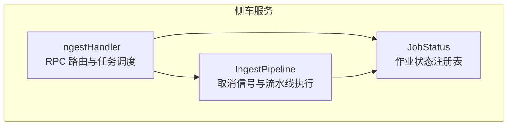
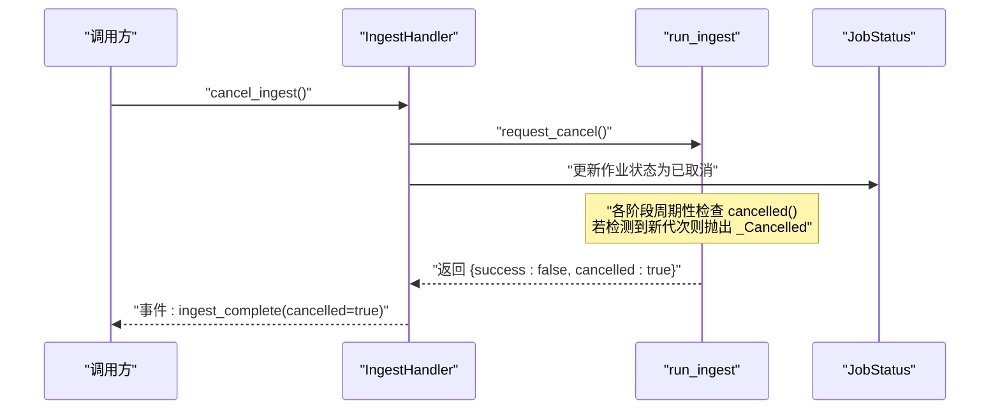
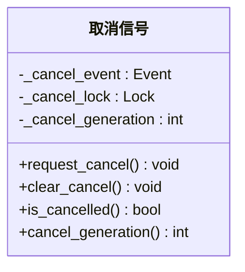
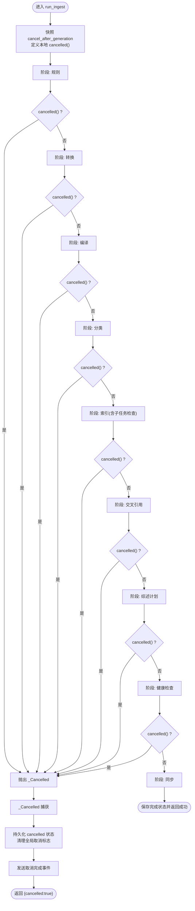
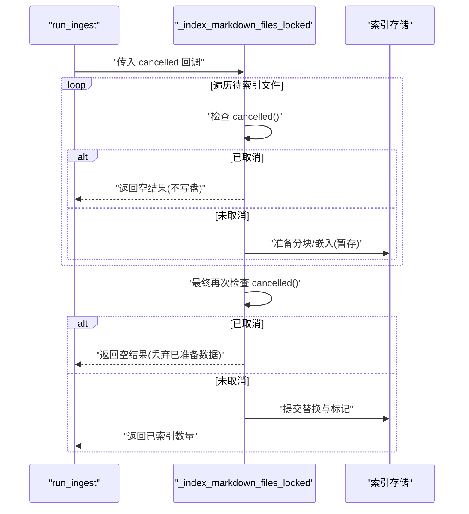
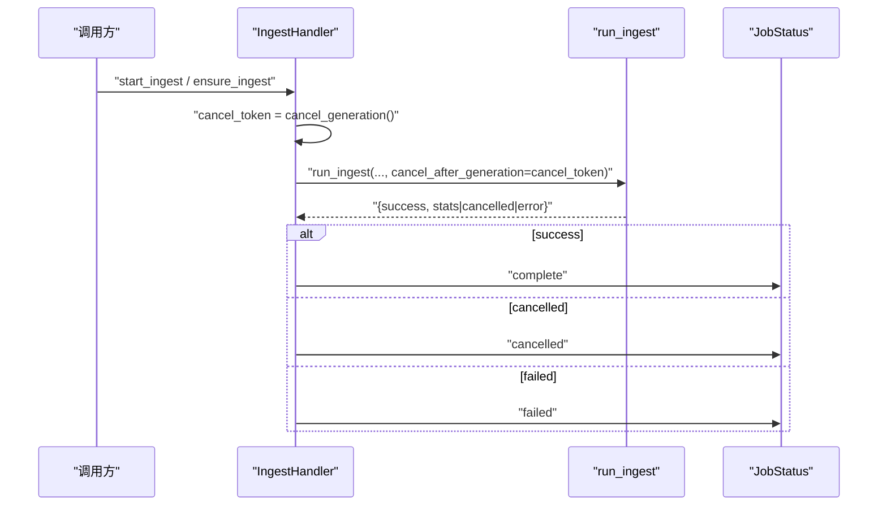
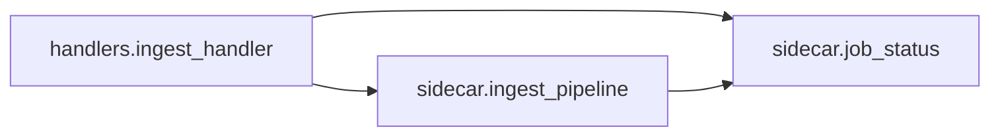

# 取消控制机制

<cite>
**本文引用的文件**
- [ingest_pipeline.py](file://python/sidecar/ingest_pipeline.py)
- [ingest_handler.py](file://python/sidecar/handlers/ingest_handler.py)
- [job_status.py](file://python/sidecar/job_status.py)
- [test_ingest_pipeline.py](file://tests/integration/test_ingest_pipeline.py)
</cite>

## 目录
1. [简介](#简介)
2. [项目结构](#项目结构)
3. [核心组件](#核心组件)
4. [架构总览](#架构总览)
5. [详细组件分析](#详细组件分析)
6. [依赖关系分析](#依赖关系分析)
7. [性能考量](#性能考量)
8. [故障排查指南](#故障排查指南)
9. [结论](#结论)
10. [附录](#附录)

## 简介
本技术文档聚焦于“取消控制机制”，围绕线程安全的取消信号实现、生成号管理与并发访问控制，系统性地说明取消请求的处理流程（全局取消标志、局部取消检查与优雅退出策略）、取消状态的传播机制（确保所有子任务及时响应），并提供 API 接口、使用模式与最佳实践。同时涵盖取消后的资源清理、状态恢复与错误处理方案，并展示如何在自定义处理器中正确实现取消支持。

## 项目结构
与取消控制相关的关键代码位于 sidecar 模块：
- 取消信号与流水线编排：sidecar.ingest_pipeline
- RPC 入口与任务调度：sidecar.handlers.ingest_handler
- 作业状态注册表（用于 UI 反馈与生命周期管理）：sidecar.job_status
- 集成测试验证取消语义：tests.integration.test_ingest_pipeline

图表来源
- [ingest_handler.py:32-49](file://python/sidecar/handlers/ingest_handler.py#L32-L49)
- [ingest_pipeline.py:146-165](file://python/sidecar/ingest_pipeline.py#L146-L165)
- [job_status.py:35-64](file://python/sidecar/job_status.py#L35-L64)

章节来源
- [ingest_handler.py:32-49](file://python/sidecar/handlers/ingest_handler.py#L32-L49)
- [ingest_pipeline.py:146-165](file://python/sidecar/ingest_pipeline.py#L146-L165)
- [job_status.py:35-64](file://python/sidecar/job_status.py#L35-L64)

## 核心组件
- 取消信号与生成号
  - 使用 threading.Event 作为全局取消标志位，配合互斥锁保护生成号递增与读取，避免竞态条件。
  - 提供 request_cancel/clear_cancel/is_cancelled/cancel_generation 等原子化 API。
- 流水线取消感知
  - run_ingest 在启动时捕获 cancel_after_generation，并在各阶段边界进行 cancelled() 检查，触发 _Cancelled 异常以优雅退出。
- 任务与作业状态
  - IngestHandler 负责将取消请求下发到流水线，并通过 job_status 更新作业状态，向客户端广播事件。
- 可插拔的取消回调
  - 内部子任务（如索引）接受 cancelled 回调参数，便于在长循环或批量操作中快速响应取消。

章节来源
- [ingest_pipeline.py:24-28](file://python/sidecar/ingest_pipeline.py#L24-L28)
- [ingest_pipeline.py:146-165](file://python/sidecar/ingest_pipeline.py#L146-L165)
- [ingest_pipeline.py:480-505](file://python/sidecar/ingest_pipeline.py#L480-L505)
- [ingest_pipeline.py:350-362](file://python/sidecar/ingest_pipeline.py#L350-L362)
- [ingest_handler.py:301-304](file://python/sidecar/handlers/ingest_handler.py#L301-L304)
- [job_status.py:147-165](file://python/sidecar/job_status.py#L147-L165)

## 架构总览
下图展示了从用户发起取消到流水线优雅退出的完整时序。

图表来源
- [ingest_handler.py:301-304](file://python/sidecar/handlers/ingest_handler.py#L301-L304)
- [ingest_pipeline.py:146-165](file://python/sidecar/ingest_pipeline.py#L146-L165)
- [ingest_pipeline.py:915-927](file://python/sidecar/ingest_pipeline.py#L915-L927)
- [job_status.py:147-165](file://python/sidecar/job_status.py#L147-L165)

## 详细组件分析

### 取消信号与并发安全
- 数据结构
  - 全局 Event：表示“是否已发出取消”。
  - 互斥锁：保护生成号的递增与读取。
  - 生成号：单调递增整数，用于区分不同轮次的取消请求。
- 关键 API
  - request_cancel：加锁后递增生成号并设置 Event。
  - clear_cancel：清除 Event。
  - is_cancelled：查询 Event 状态。
  - cancel_generation：加锁后返回当前生成号。
- 并发模型
  - 通过锁保证生成号一致性；Event 提供跨线程可见性。
  - 流水线在入口处快照 cancel_after_generation，仅对“晚于该代次”的取消生效，避免误杀正在运行的实例。

图表来源
- [ingest_pipeline.py:24-28](file://python/sidecar/ingest_pipeline.py#L24-L28)
- [ingest_pipeline.py:146-165](file://python/sidecar/ingest_pipeline.py#L146-L165)

章节来源
- [ingest_pipeline.py:24-28](file://python/sidecar/ingest_pipeline.py#L24-L28)
- [ingest_pipeline.py:146-165](file://python/sidecar/ingest_pipeline.py#L146-L165)

### 流水线中的取消感知与优雅退出
- 启动期快照
  - run_ingest 在进入时计算 cancel_after_generation，并定义本地 cancelled() 闭包：当当前生成号大于快照值时视为“本次运行应被取消”。
- 阶段级检查点
  - 每个主要阶段（规则、转换、编译、分类、索引、交叉引用、综述计划、健康检查、同步）结束处均检查 cancelled()，若为真则抛出 _Cancelled。
- 子任务内嵌取消
  - 索引阶段接收外部传入的 cancelled 回调，在文件遍历与嵌入准备过程中频繁检查，必要时提前返回空结果，避免写入部分数据。
- 统一异常处理
  - 捕获 _Cancelled 后，持久化状态为“cancelled”，清理全局取消标志，并向客户端发送完成事件。

图表来源
- [ingest_pipeline.py:480-505](file://python/sidecar/ingest_pipeline.py#L480-L505)
- [ingest_pipeline.py:621-622](file://python/sidecar/ingest_pipeline.py#L621-L622)
- [ingest_pipeline.py:655-656](file://python/sidecar/ingest_pipeline.py#L655-L656)
- [ingest_pipeline.py:687-688](file://python/sidecar/ingest_pipeline.py#L687-L688)
- [ingest_pipeline.py:709-710](file://python/sidecar/ingest_pipeline.py#L709-L710)
- [ingest_pipeline.py:732-733](file://python/sidecar/ingest_pipeline.py#L732-L733)
- [ingest_pipeline.py:787-788](file://python/sidecar/ingest_pipeline.py#L787-L788)
- [ingest_pipeline.py:812-813](file://python/sidecar/ingest_pipeline.py#L812-L813)
- [ingest_pipeline.py:833-834](file://python/sidecar/ingest_pipeline.py#L833-L834)
- [ingest_pipeline.py:859-860](file://python/sidecar/ingest_pipeline.py#L859-L860)
- [ingest_pipeline.py:876-877](file://python/sidecar/ingest_pipeline.py#L876-L877)
- [ingest_pipeline.py:915-927](file://python/sidecar/ingest_pipeline.py#L915-L927)

章节来源
- [ingest_pipeline.py:480-505](file://python/sidecar/ingest_pipeline.py#L480-L505)
- [ingest_pipeline.py:915-927](file://python/sidecar/ingest_pipeline.py#L915-L927)

### 子任务的取消传播（以索引为例）
- 外层 run_ingest 将本地 cancelled 闭包传递给索引函数。
- 索引函数在文件遍历与嵌入准备循环中多次调用 cancelled()，一旦为真立即中止后续写入，避免产生不一致的索引片段。

图表来源
- [ingest_pipeline.py:350-362](file://python/sidecar/ingest_pipeline.py#L350-L362)
- [ingest_pipeline.py:364-462](file://python/sidecar/ingest_pipeline.py#L364-L462)

章节来源
- [ingest_pipeline.py:350-362](file://python/sidecar/ingest_pipeline.py#L350-L362)
- [ingest_pipeline.py:364-462](file://python/sidecar/ingest_pipeline.py#L364-L462)

### RPC 层与作业状态联动
- 取消请求
  - 调用方通过 RPC 触发 _cancel_ingest，内部调用 request_cancel 并更新作业状态为“已取消”。
- 任务启动
  - 启动入库任务时，记录 cancel_token（当前生成号），传给 run_ingest 作为 cancel_after_generation，确保本次任务只响应“之后”的取消。
- 结果回传
  - 根据 run_ingest 返回值，更新作业状态并广播事件（成功/失败/取消）。

图表来源
- [ingest_handler.py:132-150](file://python/sidecar/handlers/ingest_handler.py#L132-L150)
- [ingest_handler.py:152-214](file://python/sidecar/handlers/ingest_handler.py#L152-L214)
- [ingest_pipeline.py:480-505](file://python/sidecar/ingest_pipeline.py#L480-L505)
- [job_status.py:95-118](file://python/sidecar/job_status.py#L95-L118)
- [job_status.py:147-165](file://python/sidecar/job_status.py#L147-L165)

章节来源
- [ingest_handler.py:132-150](file://python/sidecar/handlers/ingest_handler.py#L132-L150)
- [ingest_handler.py:152-214](file://python/sidecar/handlers/ingest_handler.py#L152-L214)
- [job_status.py:95-118](file://python/sidecar/job_status.py#L95-L118)
- [job_status.py:147-165](file://python/sidecar/job_status.py#L147-L165)

### 取消后的资源清理与状态恢复
- 状态持久化
  - 取消后，流水线将状态写入“cancelled”，并记录时间戳；同时清理全局取消标志，以便下一次运行不受影响。
- 指纹与进度
  - 正常完成时会保存工作区指纹，加速下次自检；取消路径不改变指纹，保持“有未完成工作”的语义，便于重试。
- 错误与重试
  - 非取消异常会记录错误信息并标记可重试；取消路径返回特定字段，供上层区分处理。

章节来源
- [ingest_pipeline.py:915-927](file://python/sidecar/ingest_pipeline.py#L915-L927)
- [ingest_pipeline.py:929-942](file://python/sidecar/ingest_pipeline.py#L929-L942)
- [ingest_pipeline.py:896-898](file://python/sidecar/ingest_pipeline.py#L896-L898)

### API 接口、使用模式与最佳实践
- 取消控制 API
  - request_cancel：请求取消（建议由 RPC 层调用）。
  - clear_cancel：清理取消标志（通常在取消处理完成后调用）。
  - is_cancelled：查询当前是否处于取消状态。
  - cancel_generation：获取当前生成号（用于创建隔离的任务上下文）。
- 推荐用法
  - 在任务启动前获取 cancel_token，并将其作为 cancel_after_generation 传入 run_ingest。
  - 在长时间循环或批处理中，定期调用传入的 cancelled 回调，尽早退出。
  - 在取消分支中，避免写入中间状态，确保幂等与可恢复。
- 最佳实践
  - 使用“生成号+快照”的方式避免取消风暴与误杀。
  - 在关键阶段边界做取消检查，兼顾响应性与开销。
  - 对 I/O 密集的子任务，采用“先准备、后提交”的策略，取消时直接丢弃准备数据。

章节来源
- [ingest_pipeline.py:146-165](file://python/sidecar/ingest_pipeline.py#L146-L165)
- [ingest_pipeline.py:480-505](file://python/sidecar/ingest_pipeline.py#L480-L505)
- [ingest_pipeline.py:350-362](file://python/sidecar/ingest_pipeline.py#L350-L362)

### 在自定义处理器中实现取消支持
- 步骤
  - 在 RPC 处理器中暴露取消接口，调用 request_cancel 并更新作业状态。
  - 在后台任务入口处记录 cancel_token，并传递给底层执行函数。
  - 在执行函数中，定义本地 cancelled() 并在关键位置检查。
  - 捕获 _Cancelled 异常，持久化“cancelled”状态并清理全局标志。
- 示例参考
  - 参考 IngestHandler 的 _cancel_ingest 与 _do_ingest 的实现模式。

章节来源
- [ingest_handler.py:301-304](file://python/sidecar/handlers/ingest_handler.py#L301-L304)
- [ingest_handler.py:152-214](file://python/sidecar/handlers/ingest_handler.py#L152-L214)
- [ingest_pipeline.py:915-927](file://python/sidecar/ingest_pipeline.py#L915-L927)

## 依赖关系分析
- 模块耦合
  - IngestHandler 依赖 ingest_pipeline 的取消与执行 API，以及 job_status 的状态广播。
  - ingest_pipeline 内部通过 threading.Event/Lock 实现无外部依赖的轻量并发控制。
- 外部交互
  - 通过 send_progress/send_event 回调向上层报告进度与事件，便于 UI 与日志系统消费。

图表来源
- [ingest_handler.py:32-49](file://python/sidecar/handlers/ingest_handler.py#L32-L49)
- [ingest_pipeline.py:146-165](file://python/sidecar/ingest_pipeline.py#L146-L165)
- [job_status.py:35-64](file://python/sidecar/job_status.py#L35-L64)

章节来源
- [ingest_handler.py:32-49](file://python/sidecar/handlers/ingest_handler.py#L32-L49)
- [ingest_pipeline.py:146-165](file://python/sidecar/ingest_pipeline.py#L146-L165)
- [job_status.py:35-64](file://python/sidecar/job_status.py#L35-L64)

## 性能考量
- 取消检查频率
  - 在热点循环（如索引）中高频检查 cancelled()，但应避免过度频繁导致额外开销；建议在每批次或每 N 个元素后检查。
- 生成号操作
  - 生成号读写受锁保护，但调用频率低（仅在取消与任务启动时），对整体性能影响可忽略。
- 子任务策略
  - “先准备、后提交”的模式能显著降低取消时的 I/O 浪费，提升吞吐与一致性。

## 故障排查指南
- 常见问题
  - 取消无效：确认是否在任务启动前记录了 cancel_token，并正确传入 run_ingest。
  - 误取消：检查是否存在多个任务共享同一 cancel_token 的情况；应为每个任务独立快照。
  - 状态不一致：查看持久化的 ingest_state.json，确认 status 是否为 cancelled 或 complete。
- 定位手段
  - 观察事件流：关注 ingest_complete 事件的 cancelled 字段。
  - 检查作业状态：通过 job_status 列表接口查看最近作业状态。
- 复现与验证
  - 使用集成测试用例验证基本取消语义（设置、清除、查询）。

章节来源
- [test_ingest_pipeline.py:56-66](file://tests/integration/test_ingest_pipeline.py#L56-L66)
- [ingest_handler.py:337-350](file://python/sidecar/handlers/ingest_handler.py#L337-L350)
- [job_status.py:174-183](file://python/sidecar/job_status.py#L174-L183)

## 结论
本取消控制机制通过“Event + 生成号 + 阶段检查点”的组合，实现了线程安全、可组合且可追溯的取消能力。配合 RPC 层与作业状态系统，既保证了响应性，又确保了优雅退出与状态一致性。遵循本文的使用模式与最佳实践，可在自定义处理器中可靠地集成取消支持。

## 附录
- 术语
  - 生成号：单调递增的整数，用于区分不同轮次的取消请求。
  - 快照：任务启动时记录的 cancel_after_generation，用于限定本次任务可响应的取消范围。
  - 子任务：流水线中的具体步骤（如索引、交叉引用等），需支持外部传入的取消回调。