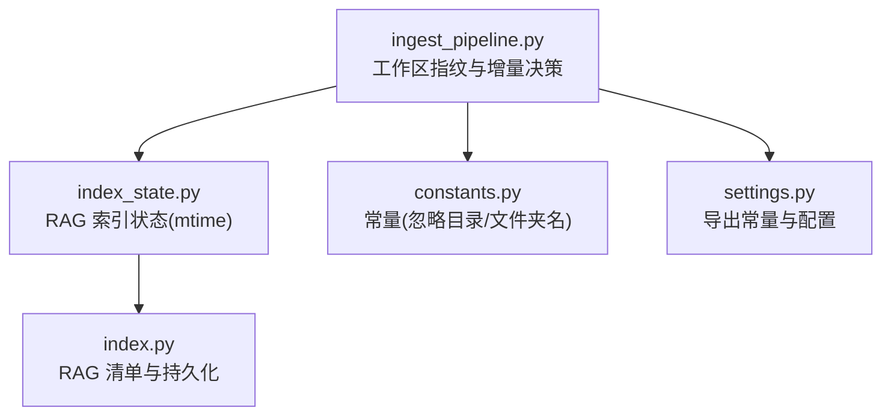
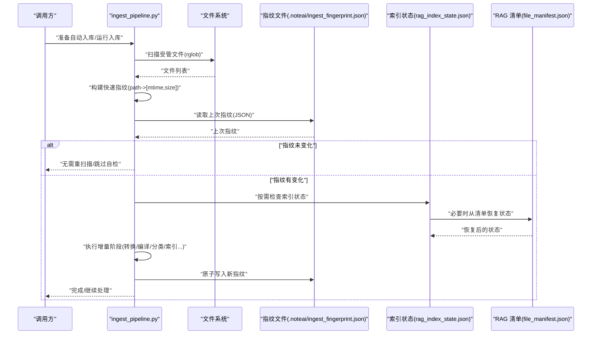
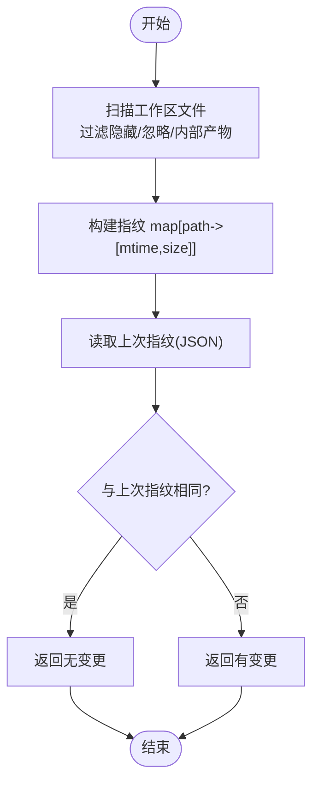
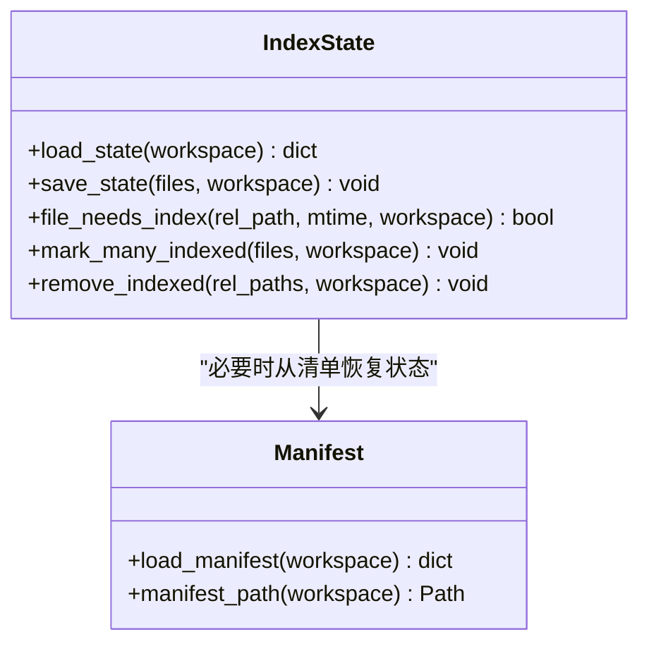
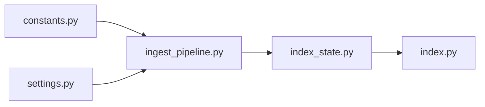

# 工作区指纹系统

<cite>
**本文引用的文件**   
- [ingest_pipeline.py](file://python/sidecar/ingest_pipeline.py)
- [index_state.py](file://python/sidecar/rag/index_state.py)
- [index.py](file://python/sidecar/rag/index.py)
- [constants.py](file://config/constants.py)
- [settings.py](file://config/settings.py)
</cite>

## 目录
1. [简介](#简介)
2. [项目结构](#项目结构)
3. [核心组件](#核心组件)
4. [架构总览](#架构总览)
5. [详细组件分析](#详细组件分析)
6. [依赖关系分析](#依赖关系分析)
7. [性能考量](#性能考量)
8. [故障排除指南](#故障排除指南)
9. [结论](#结论)
10. [附录：使用示例与最佳实践](#附录使用示例与最佳实践)

## 简介
本技术文档聚焦于工作区“指纹系统”，用于高效检测工作区内受管文件的变更，驱动增量式处理流水线（转换、编译、分类、索引等）。该系统采用两层策略：
- 快速检测层：基于 mtime + size 的轻量级指纹，用于在启动或调度时快速判断是否需要进入重扫描流程。
- 安全检查层：针对具体子任务（如 RAG 索引）使用更细粒度的状态记录与完整性校验，确保在极端情况下也能正确识别变更并恢复一致性。

此外，指纹文件采用原子写入与损坏恢复机制，保证持久化安全；并提供可观测的状态保存与进度上报接口，便于监控与排障。

## 项目结构
与指纹系统直接相关的代码主要分布在以下模块：
- 工作区扫描与指纹计算：位于 ingestion 流水线中，负责遍历受管文件、生成 mtime+size 指纹、比较上次指纹并返回是否变更。
- 索引状态管理：为 RAG 索引维护 per-file 的 mtime 状态，支持缺失状态从持久化清单恢复。
- 常量与路径配置：定义工作区应用目录、忽略目录集合等关键常量。

图表来源
- [ingest_pipeline.py:40-104](file://python/sidecar/ingest_pipeline.py#L40-L104)
- [index_state.py:13-50](file://python/sidecar/rag/index_state.py#L13-L50)
- [constants.py:26-52](file://config/constants.py#L26-L52)
- [settings.py:1-41](file://config/settings.py#L1-L41)
- [index.py:1060-1072](file://python/sidecar/rag/index.py#L1060-L1072)

章节来源
- [ingest_pipeline.py:40-104](file://python/sidecar/ingest_pipeline.py#L40-L104)
- [index_state.py:13-50](file://python/sidecar/rag/index_state.py#L13-L50)
- [constants.py:26-52](file://config/constants.py#L26-L52)
- [settings.py:1-41](file://config/settings.py#L1-L41)
- [index.py:1060-1072](file://python/sidecar/rag/index.py#L1060-L1072)

## 核心组件
- 工作区文件指纹
  - 作用：对受管文件生成 path -> [mtime, size] 的快速指纹，用于快速判定工作区是否有变更。
  - 关键点：过滤隐藏文件、忽略目录、以及工作区内部产物目录（如 .noteai、wiki、Raw），仅关注 Markdown 与可转换格式。
- 指纹持久化
  - 作用：将当前指纹以 JSON 形式持久化到工作区应用目录，供下次启动快速比对。
  - 关键点：原子写入（临时文件 + replace），异常回滚，避免部分写入导致损坏。
- 增量检测入口
  - 作用：对比当前与上次指纹，若相等则跳过后续重扫描；否则触发各阶段增量扫描。
- 索引状态管理
  - 作用：为 RAG 索引维护 per-file 的 mtime 状态，支持缺失状态从 file_manifest.json 恢复，避免误判全量重建。
  - 关键点：容错加载、批量标记已索引、删除清理后移除状态项。

章节来源
- [ingest_pipeline.py:65-104](file://python/sidecar/ingest_pipeline.py#L65-L104)
- [ingest_pipeline.py:126-145](file://python/sidecar/ingest_pipeline.py#L126-L145)
- [index_state.py:13-50](file://python/sidecar/rag/index_state.py#L13-L50)
- [index_state.py:74-102](file://python/sidecar/rag/index_state.py#L74-L102)

## 架构总览
下图展示了工作区指纹系统在启动与运行时的整体交互：

图表来源
- [ingest_pipeline.py:40-104](file://python/sidecar/ingest_pipeline.py#L40-L104)
- [index_state.py:13-50](file://python/sidecar/rag/index_state.py#L13-L50)
- [index.py:1060-1072](file://python/sidecar/rag/index.py#L1060-L1072)

## 详细组件分析

### 组件一：工作区文件指纹与增量决策
- 快速指纹生成
  - 遍历工作区所有文件，过滤隐藏文件、忽略目录与工作区内部产物目录，仅保留 Markdown 与可转换格式。
  - 对每个文件记录相对路径与 [mtime, size]。
- 指纹持久化
  - 使用原子写入：先写临时文件，再替换目标文件，失败时清理临时文件并抛出异常。
- 增量决策
  - 比较当前指纹与上次指纹，完全一致则返回“无变更”；否则返回“有变更”。

图表来源
- [ingest_pipeline.py:65-104](file://python/sidecar/ingest_pipeline.py#L65-L104)
- [ingest_pipeline.py:126-145](file://python/sidecar/ingest_pipeline.py#L126-L145)

章节来源
- [ingest_pipeline.py:65-104](file://python/sidecar/ingest_pipeline.py#L65-L104)
- [ingest_pipeline.py:126-145](file://python/sidecar/ingest_pipeline.py#L126-L145)

### 组件二：RAG 索引状态与完整性恢复
- 状态存储
  - 维护 rag_index_state.json，键为相对路径，值为 mtime。
- 缺失状态恢复
  - 当状态文件缺失或损坏时，尝试从 file_manifest.json 中的 files 条目恢复 mtime，避免误判全量重建。
- 变更判定
  - 通过 file_needs_index 比较上次 mtime 与当前 mtime，允许一定时间精度误差（阈值约 0.5 秒）。
- 批量更新与清理
  - 成功索引后批量标记已索引；删除文件后同步移除状态项。

图表来源
- [index_state.py:13-50](file://python/sidecar/rag/index_state.py#L13-L50)
- [index_state.py:74-102](file://python/sidecar/rag/index_state.py#L74-L102)
- [index.py:1060-1072](file://python/sidecar/rag/index.py#L1060-L1072)

章节来源
- [index_state.py:13-50](file://python/sidecar/rag/index_state.py#L13-L50)
- [index_state.py:74-102](file://python/sidecar/rag/index_state.py#L74-L102)
- [index.py:1060-1072](file://python/sidecar/rag/index.py#L1060-L1072)

### 组件三：常量与路径约定
- 工作区应用目录：.noteai
- 忽略目录集合：包含 .noteai、wiki 等
- Notes/Raw 等目录名常量：用于过滤与定位

这些常量被指纹与索引状态模块共同引用，确保路径与过滤规则一致。

章节来源
- [constants.py:26-52](file://config/constants.py#L26-L52)
- [settings.py:1-41](file://config/settings.py#L1-L41)

## 依赖关系分析
- ingest_pipeline.py 依赖 constants.py 与 settings.py 提供的常量与过滤函数，用于确定受管文件范围与忽略规则。
- index_state.py 依赖 constants.py 的路径常量，并在缺失状态下依赖 index.py 的清单文件进行恢复。
- 整体耦合度低、内聚性高：指纹逻辑集中在 ingestion 管线，索引状态独立封装，便于测试与维护。

图表来源
- [constants.py:26-52](file://config/constants.py#L26-L52)
- [settings.py:1-41](file://config/settings.py#L1-L41)
- [ingest_pipeline.py:40-104](file://python/sidecar/ingest_pipeline.py#L40-L104)
- [index_state.py:13-50](file://python/sidecar/rag/index_state.py#L13-L50)
- [index.py:1060-1072](file://python/sidecar/rag/index.py#L1060-L1072)

章节来源
- [constants.py:26-52](file://config/constants.py#L26-L52)
- [settings.py:1-41](file://config/settings.py#L1-L41)
- [ingest_pipeline.py:40-104](file://python/sidecar/ingest_pipeline.py#L40-L104)
- [index_state.py:13-50](file://python/sidecar/rag/index_state.py#L13-L50)
- [index.py:1060-1072](file://python/sidecar/rag/index.py#L1060-L1072)

## 性能考量
- 快速路径优先
  - 首次启动或定时任务时，优先使用 mtime+size 指纹进行快速判断，避免不必要的深度扫描。
- 选择性扫描
  - 仅在指纹变化时触发各阶段的增量扫描；对于 RAG 索引，进一步按 per-file mtime 决定是否重新分块与编码。
- 原子写入与错误隔离
  - 指纹与状态文件均使用原子写入，降低并发写入导致的竞争与损坏风险。
- 缓存与批处理
  - 索引阶段对嵌入向量与分块结果进行批处理，减少 I/O 与模型调用开销。

[本节为通用性能建议，不直接分析具体文件]

## 故障排除指南
- 指纹文件损坏或无法读取
  - 现象：启动后频繁触发全量扫描或报错。
  - 排查：确认 .noteai/ingest_fingerprint.json 是否存在且可读；若损坏，删除后由下一次运行重建。
  - 依据：加载指纹时对 OSError 与 JSON 解析异常进行容错，返回空字典作为降级策略。
- 索引状态缺失导致误判
  - 现象：大量笔记被重复索引。
  - 排查：检查 rag_index_state.json 是否存在；若缺失，系统将尝试从 file_manifest.json 恢复 mtime 状态。
  - 依据：load_state 在缺失或解析失败时回退到清单恢复。
- 原子写入失败
  - 现象：保存指纹或状态时报错。
  - 排查：检查磁盘空间与权限；系统会在失败时记录警告并尝试回滚临时文件。
  - 依据：_write_json_atomic 与 save_state 的异常处理与回滚逻辑。

章节来源
- [ingest_pipeline.py:46-63](file://python/sidecar/ingest_pipeline.py#L46-L63)
- [index_state.py:13-50](file://python/sidecar/rag/index_state.py#L13-L50)
- [index_state.py:52-73](file://python/sidecar/rag/index_state.py#L52-L73)
- [ingest_pipeline.py:126-145](file://python/sidecar/ingest_pipeline.py#L126-L145)

## 结论
工作区指纹系统通过“快速检测 + 安全检查”的双层策略，在保证一致性的前提下显著降低了启动与调度开销。配合原子写入与损坏恢复机制，系统在复杂环境下具备较强的鲁棒性与可观测性。建议在大规模工作区场景下结合增量模式与批处理优化，以获得更佳的性能表现。

[本节为总结性内容，不直接分析具体文件]

## 附录：使用示例与最佳实践
- 如何触发自动入库并启用增量模式
  - 调用准备函数获取决策结果，根据返回的 action 与 mode 决定下一步。
  - 参考路径：prepare_auto_ingest 的实现与返回值说明。
- 如何在流水线中保存指纹
  - 在流水线完成或跳过自检时，保存当前指纹以确保下次启动快速判断。
  - 参考路径：run_ingest 中保存指纹的逻辑。
- 如何检查某篇笔记是否需要索引
  - 使用 file_needs_index 传入相对路径与当前 mtime，结合工作区上下文进行判断。
  - 参考路径：index_state.py 中的 file_needs_index 实现。
- 如何批量更新索引状态
  - 使用 mark_many_indexed 一次性提交多个文件的已索引状态，减少 I/O 次数。
  - 参考路径：index_state.py 中的 mark_many_indexed 实现。

章节来源
- [ingest_pipeline.py:202-267](file://python/sidecar/ingest_pipeline.py#L202-L267)
- [ingest_pipeline.py:544-548](file://python/sidecar/ingest_pipeline.py#L544-L548)
- [index_state.py:74-92](file://python/sidecar/rag/index_state.py#L74-L92)