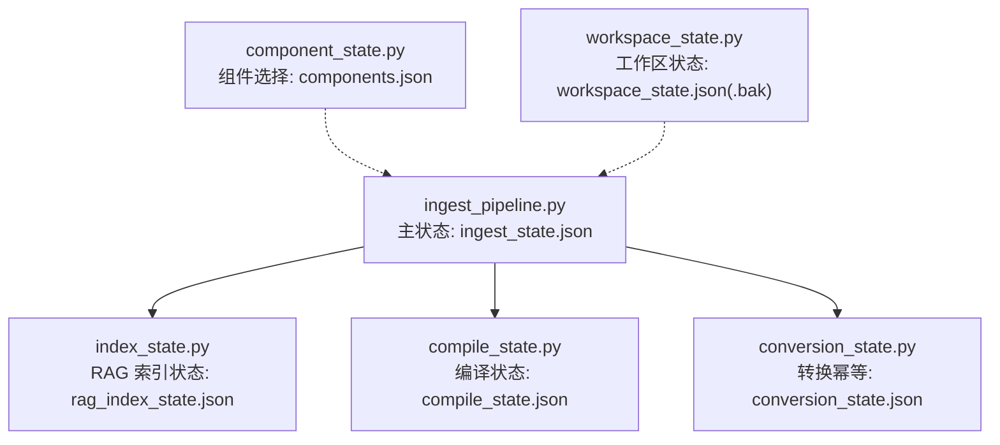
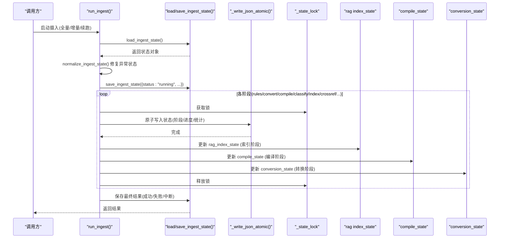
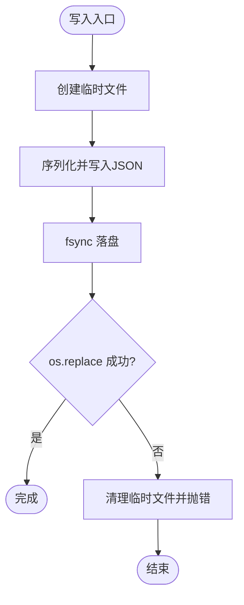
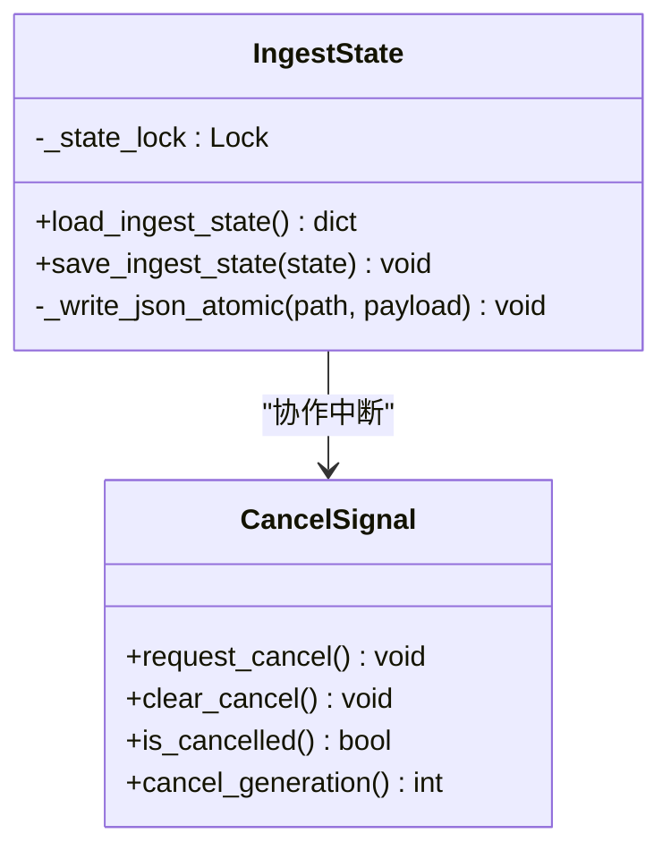
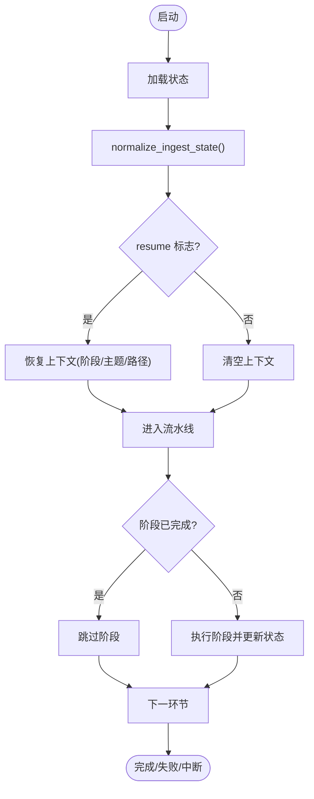
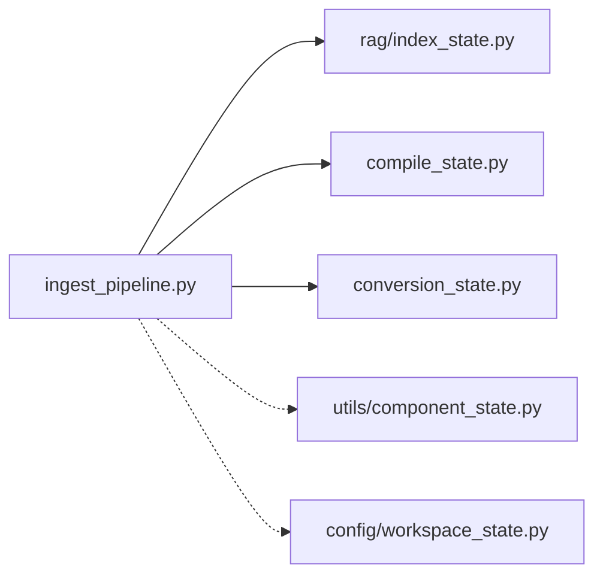

# 状态持久化机制

<cite>
**本文引用的文件**   
- [ingest_pipeline.py](file://python/sidecar/ingest_pipeline.py)
- [index_state.py](file://python/sidecar/rag/index_state.py)
- [compile_state.py](file://python/sidecar/compile_state.py)
- [conversion_state.py](file://python/sidecar/conversion_state.py)
- [component_state.py](file://utils/component_state.py)
- [workspace_state.py](file://config/workspace_state.py)
- [test_ingest_pipeline.py](file://tests/unit/test_ingest_pipeline.py)
</cite>

## 目录
1. [简介](#简介)
2. [项目结构](#项目结构)
3. [核心组件](#核心组件)
4. [架构总览](#架构总览)
5. [详细组件分析](#详细组件分析)
6. [依赖关系分析](#依赖关系分析)
7. [性能考量](#性能考量)
8. [故障诊断指南](#故障诊断指南)
9. [结论](#结论)
10. [附录](#附录)

## 简介
本技术文档聚焦于 NoteAI 的状态持久化机制，围绕 ingest_state.json 的结构与字段、原子写入与崩溃恢复、并发安全控制（锁）、版本迁移策略、以及断点续跑与异常处理最佳实践展开。该机制贯穿“转换→编译→分类→索引→交叉引用→级联→检查→同步”的整条摄入流水线，确保在进程中断或系统崩溃后仍能可靠恢复并继续执行。

## 项目结构
与状态持久化相关的代码主要分布在 sidecar 与 utils/config 模块中：
- 摄入流水线与主状态文件：python/sidecar/ingest_pipeline.py
- RAG 索引增量状态：python/sidecar/rag/index_state.py
- 笔记编译增量状态：python/sidecar/compile_state.py
- 源文件到 Markdown 转换幂等状态：python/sidecar/conversion_state.py
- 可选组件用户选择状态：utils/component_state.py
- 工作区元数据状态（含备份恢复）：config/workspace_state.py
- 相关单元测试：tests/unit/test_ingest_pipeline.py

图表来源
- [ingest_pipeline.py:107-144](file://python/sidecar/ingest_pipeline.py#L107-L144)
- [index_state.py:13-73](file://python/sidecar/rag/index_state.py#L13-L73)
- [compile_state.py:12-55](file://python/sidecar/compile_state.py#L12-L55)
- [conversion_state.py:26-109](file://python/sidecar/conversion_state.py#L26-L109)
- [component_state.py:12-64](file://utils/component_state.py#L12-L64)
- [workspace_state.py:26-126](file://config/workspace_state.py#L26-L126)

章节来源
- [ingest_pipeline.py:107-144](file://python/sidecar/ingest_pipeline.py#L107-L144)
- [index_state.py:13-73](file://python/sidecar/rag/index_state.py#L13-L73)
- [compile_state.py:12-55](file://python/sidecar/compile_state.py#L12-L55)
- [conversion_state.py:26-109](file://python/sidecar/conversion_state.py#L26-L109)
- [component_state.py:12-64](file://utils/component_state.py#L12-L64)
- [workspace_state.py:26-126](file://config/workspace_state.py#L26-L126)

## 核心组件
- 主状态文件 ingest_state.json
  - 位置：工作区应用目录 .noteai/ingest_state.json
  - 作用：记录运行状态、阶段进度、统计信息、错误摘要、断点续跑所需上下文
- 原子写入工具 _write_json_atomic
  - 通过临时文件 + fsync + os.replace 实现事务性更新
- 状态锁 _state_lock
  - 保证多线程并发写的安全性与一致性
- 辅助状态文件
  - rag_index_state.json：记录已索引文件的 mtime，用于增量索引
  - compile_state.json：记录已编译文件的 mtime，用于跳过未变更笔记
  - conversion_state.json：记录源文件哈希与输出路径，避免重复转换
  - components.json：记录用户移除的可选组件
  - workspace_state.json(.bak)：工作区元数据与备份恢复

章节来源
- [ingest_pipeline.py:31-37](file://python/sidecar/ingest_pipeline.py#L31-L37)
- [ingest_pipeline.py:125-144](file://python/sidecar/ingest_pipeline.py#L125-L144)
- [index_state.py:13-73](file://python/sidecar/rag/index_state.py#L13-L73)
- [compile_state.py:12-55](file://python/sidecar/compile_state.py#L12-L55)
- [conversion_state.py:26-109](file://python/sidecar/conversion_state.py#L26-L109)
- [component_state.py:12-64](file://utils/component_state.py#L12-L64)
- [workspace_state.py:26-126](file://config/workspace_state.py#L26-L126)

## 架构总览
下图展示了状态持久化在主流程中的关键交互：读取/归一化状态、原子写入、阶段标记、进度上报、以及跨阶段的断点续跑。

图表来源
- [ingest_pipeline.py:480-588](file://python/sidecar/ingest_pipeline.py#L480-L588)
- [ingest_pipeline.py:107-144](file://python/sidecar/ingest_pipeline.py#L107-L144)
- [index_state.py:52-92](file://python/sidecar/rag/index_state.py#L52-L92)
- [compile_state.py:35-55](file://python/sidecar/compile_state.py#L35-L55)
- [conversion_state.py:89-109](file://python/sidecar/conversion_state.py#L89-L109)

## 详细组件分析

### ingest_state.json 结构与字段定义
- 基本运行字段
  - status: 当前状态，如 idle、running、complete、failed、interrupted、needs_workspace_rules
  - mode: 模式 full/incremental
  - stage: 当前阶段名称（rules/convert/compile/classify/index/crossref/cascade/lint/sync）
  - progress: 0~1 的进度值
  - message: 人类可读消息
  - started_at: 开始时间戳
  - last_complete_at: 上次完成时间戳
  - resume: 是否处于续跑模式
  - file_paths: 本次处理的文件列表
  - completed_stages: 已完成阶段集合
  - stats: 统计数据（converted/compiled/classified/pending_topics/indexed_files/cascade_updated/cascade_failed/cascade_topics 等）
  - affected_topics: 受影响的主题集合
  - pending_crossref_paths: 待进行交叉引用的文件路径
  - interrupted_at: 中断时间戳
  - force_full_next: 下一次自动摄入强制全量
- 错误与异常
  - failed 状态下保留最近错误上下文（例如 pending_crossref_paths），以便后续重试
- 健壮性
  - 非对象 JSON 会被拒绝并回退为默认空闲状态

章节来源
- [ingest_pipeline.py:107-116](file://python/sidecar/ingest_pipeline.py#L107-L116)
- [ingest_pipeline.py:167-177](file://python/sidecar/ingest_pipeline.py#L167-L177)
- [ingest_pipeline.py:550-588](file://python/sidecar/ingest_pipeline.py#L550-L588)
- [test_ingest_pipeline.py:288-294](file://tests/unit/test_ingest_pipeline.py#L288-L294)

### 原子写入机制与崩溃恢复
- 原子写入原理
  - 使用临时文件写入完整 JSON，fsync 落盘，再 os.replace 原子替换目标文件
  - 异常时清理临时文件并抛出异常，避免产生半写状态
- 崩溃恢复策略
  - 启动时 normalize_ingest_state：若检测到 running 状态，将其修正为 interrupted，并追加提示以支持自动续跑
  - 续跑时恢复 completed_stages、affected_topics、pending_crossref_paths 等上下文
- 指纹与快速判断
  - ingest_fingerprint.json 记录工作区文件 mtime+size 指纹，加速“是否需要重新扫描”的判断

图表来源
- [ingest_pipeline.py:125-144](file://python/sidecar/ingest_pipeline.py#L125-L144)
- [ingest_pipeline.py:167-177](file://python/sidecar/ingest_pipeline.py#L167-L177)
- [ingest_pipeline.py:46-63](file://python/sidecar/ingest_pipeline.py#L46-L63)

章节来源
- [ingest_pipeline.py:125-144](file://python/sidecar/ingest_pipeline.py#L125-L144)
- [ingest_pipeline.py:167-177](file://python/sidecar/ingest_pipeline.py#L167-L177)
- [ingest_pipeline.py:46-63](file://python/sidecar/ingest_pipeline.py#L46-L63)

### 状态锁与并发安全
- 线程锁
  - _state_lock 保护对 ingest_state.json 的读写，避免多写竞争
- 取消信号
  - 基于 Event 与生成号的双层取消模型，确保在长时间任务中可被及时中断
- 死锁预防
  - 锁粒度最小化，仅在保存状态时加锁；外部长耗时操作不在锁内执行
- 性能优化
  - 批量更新完成后一次性原子写入
  - 使用指纹文件减少不必要的重扫描

图表来源
- [ingest_pipeline.py:25-28](file://python/sidecar/ingest_pipeline.py#L25-L28)
- [ingest_pipeline.py:147-165](file://python/sidecar/ingest_pipeline.py#L147-L165)
- [ingest_pipeline.py:118-144](file://python/sidecar/ingest_pipeline.py#L118-L144)

章节来源
- [ingest_pipeline.py:25-28](file://python/sidecar/ingest_pipeline.py#L25-L28)
- [ingest_pipeline.py:147-165](file://python/sidecar/ingest_pipeline.py#L147-L165)
- [ingest_pipeline.py:118-144](file://python/sidecar/ingest_pipeline.py#L118-L144)

### 其他状态文件与幂等设计
- rag_index_state.json
  - 记录每个 Notes 文件的 mtime，用于增量索引；缺失时从 RAG manifest 恢复
  - 提供 mark_many_indexed 批量提交，减少频繁 IO
- compile_state.json
  - 记录已编译文件的 mtime，跳过未变更笔记
- conversion_state.json
  - 记录源文件 SHA256 与输出路径，避免重复转换；支持按哈希反查已有输出
- component_state.py
  - 记录用户移除的可选组件，采用临时文件 + replace 的轻量原子写入
- workspace_state.py
  - 工作区元数据持久化，包含备份文件 .json.bak 的恢复逻辑

章节来源
- [index_state.py:13-102](file://python/sidecar/rag/index_state.py#L13-L102)
- [compile_state.py:12-55](file://python/sidecar/compile_state.py#L12-L55)
- [conversion_state.py:18-109](file://python/sidecar/conversion_state.py#L18-L109)
- [component_state.py:12-64](file://utils/component_state.py#L12-L64)
- [workspace_state.py:26-126](file://config/workspace_state.py#L26-L126)

### 状态文件格式规范与版本迁移
- 格式规范
  - 所有状态文件均为 UTF-8 编码的 JSON，缩进友好，便于人工查看与调试
  - 关键字段类型严格校验（如 files 映射值为浮点数 mtime）
- 容错与降级
  - 解析失败或非对象 JSON 时回退为默认空结构或空闲状态
  - 原子写入失败时，部分模块有直接写入的降级策略（如 rag index_state）
- 版本迁移建议
  - 在加载时进行字段兼容处理（新增字段带默认值，废弃字段忽略）
  - 对历史状态做一次性迁移脚本，并在迁移成功后更新版本号或迁移标记

章节来源
- [ingest_pipeline.py:107-116](file://python/sidecar/ingest_pipeline.py#L107-L116)
- [index_state.py:22-49](file://python/sidecar/rag/index_state.py#L22-L49)
- [index_state.py:52-73](file://python/sidecar/rag/index_state.py#L52-L73)
- [test_ingest_pipeline.py:288-294](file://tests/unit/test_ingest_pipeline.py#L288-L294)

### 状态恢复流程与断点续跑
- 启动恢复
  - normalize_ingest_state 将异常 running 修正为 interrupted，并注入续跑提示
- 续跑参数
  - resume=True 时恢复 completed_stages、affected_topics、pending_crossref_paths
  - 若存在 force_full_next，则强制全量并关闭续跑
- 阶段跳过
  - 通过 completed_stages 集合判断是否跳过已完成阶段，提升续跑效率

图表来源
- [ingest_pipeline.py:167-177](file://python/sidecar/ingest_pipeline.py#L167-L177)
- [ingest_pipeline.py:550-588](file://python/sidecar/ingest_pipeline.py#L550-L588)

章节来源
- [ingest_pipeline.py:167-177](file://python/sidecar/ingest_pipeline.py#L167-L177)
- [ingest_pipeline.py:550-588](file://python/sidecar/ingest_pipeline.py#L550-L588)

### 异常处理最佳实践
- 统一捕获与上报
  - 各阶段异常收集为列表，必要时聚合抛出，保留前几条错误信息
- 中间状态保护
  - 索引准备阶段在取消后不修改索引，保证下次重试可安全重试
- 失败态语义
  - failed 状态保留必要上下文（如 pending_crossref_paths），便于定位问题与重试

章节来源
- [ingest_pipeline.py:442-448](file://python/sidecar/ingest_pipeline.py#L442-L448)
- [ingest_pipeline.py:450-453](file://python/sidecar/ingest_pipeline.py#L450-L453)
- [test_ingest_pipeline.py:280-285](file://tests/unit/test_ingest_pipeline.py#L280-L285)

## 依赖关系分析
- 模块耦合
  - ingest_pipeline 依赖多个子状态模块（index_state、compile_state、conversion_state）
  - 组件选择与工作区状态作为外围配置，间接影响摄入行为
- 外部依赖
  - 文件系统原子操作（tempfile、os.replace、fsync）
  - JSON 序列化与解析
- 潜在循环依赖
  - 当前未见循环导入；各状态模块职责清晰，单向依赖主流程

图表来源
- [ingest_pipeline.py:480-588](file://python/sidecar/ingest_pipeline.py#L480-L588)
- [index_state.py:13-73](file://python/sidecar/rag/index_state.py#L13-L73)
- [compile_state.py:12-55](file://python/sidecar/compile_state.py#L12-L55)
- [conversion_state.py:26-109](file://python/sidecar/conversion_state.py#L26-L109)
- [component_state.py:12-64](file://utils/component_state.py#L12-L64)
- [workspace_state.py:26-126](file://config/workspace_state.py#L26-L126)

章节来源
- [ingest_pipeline.py:480-588](file://python/sidecar/ingest_pipeline.py#L480-L588)
- [index_state.py:13-73](file://python/sidecar/rag/index_state.py#L13-L73)
- [compile_state.py:12-55](file://python/sidecar/compile_state.py#L12-L55)
- [conversion_state.py:26-109](file://python/sidecar/conversion_state.py#L26-L109)
- [component_state.py:12-64](file://utils/component_state.py#L12-L64)
- [workspace_state.py:26-126](file://config/workspace_state.py#L26-L126)

## 性能考量
- 原子写入开销
  - 每次状态更新都会触发一次磁盘落盘与替换，建议在批量更新后合并写入
- 锁竞争
  - 锁仅包裹保存操作，避免长耗时阻塞；尽量降低保存频率
- 增量与指纹
  - 使用指纹文件与 mtime 比较，避免全量扫描；索引阶段批量提交减少 IO
- 取消与重试
  - 取消后丢弃已准备但未提交的中间结果，保证下次重试安全且高效

[本节为通用指导，无需特定文件来源]

## 故障诊断指南
- 常见症状
  - 状态卡在 running：可能被进程杀死，需等待 normalize 修正为 interrupted
  - 非对象 JSON：加载失败回退为空闲状态，检查文件内容是否为数组或字符串
  - 索引不一致：实际分片数与清单不符会触发全量修复
- 定位步骤
  - 检查 ingest_state.json 的 status、stage、message、stats
  - 核对 rag_index_state.json 与 RAG manifest 的一致性
  - 查看 convert/compile/classify 阶段的错误聚合信息
- 恢复手段
  - 删除损坏的临时文件（以 .tmp 或隐藏前缀命名）
  - 利用 workspace_state.json.bak 恢复工作区元数据
  - 手动设置 force_full_next 触发一次全量重建

章节来源
- [ingest_pipeline.py:107-116](file://python/sidecar/ingest_pipeline.py#L107-L116)
- [ingest_pipeline.py:167-177](file://python/sidecar/ingest_pipeline.py#L167-L177)
- [index_state.py:22-49](file://python/sidecar/rag/index_state.py#L22-L49)
- [workspace_state.py:108-126](file://config/workspace_state.py#L108-L126)

## 结论
NoteAI 的状态持久化机制以 ingest_state.json 为核心，结合原子写入、细粒度锁与完善的崩溃恢复策略，实现了高可靠的摄入流水线。配合增量状态文件（索引、编译、转换）与指纹机制，系统在大规模数据场景下仍保持良好性能与可恢复性。遵循本文档的规范与实践，可在复杂环境中稳定运行并快速定位问题。

[本节为总结性内容，无需特定文件来源]

## 附录
- 术语
  - 原子写入：通过临时文件 + fsync + 原子替换实现的不可分割写入
  - 断点续跑：从上次未完成处恢复执行的能力
  - 幂等：多次执行同一操作不会产生副作用或重复结果
- 相关文件清单
  - 主状态：ingest_state.json
  - 索引状态：rag_index_state.json
  - 编译状态：compile_state.json
  - 转换状态：conversion_state.json
  - 组件选择：components.json
  - 工作区状态：workspace_state.json(.bak)

[本节为补充说明，无需特定文件来源]