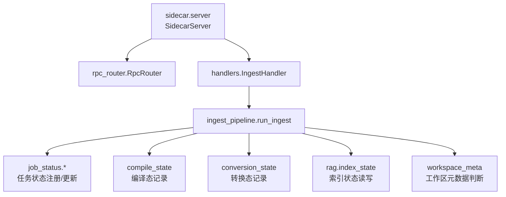
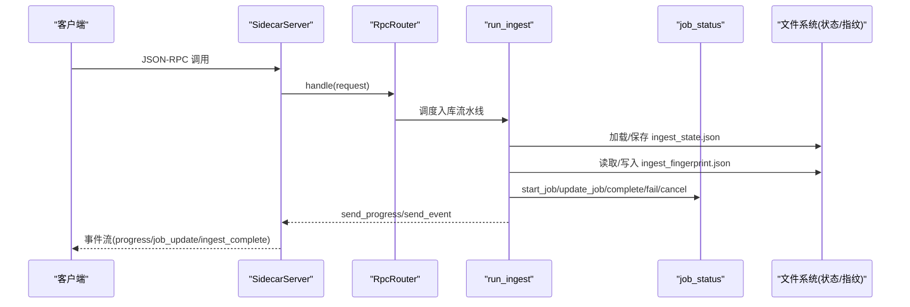
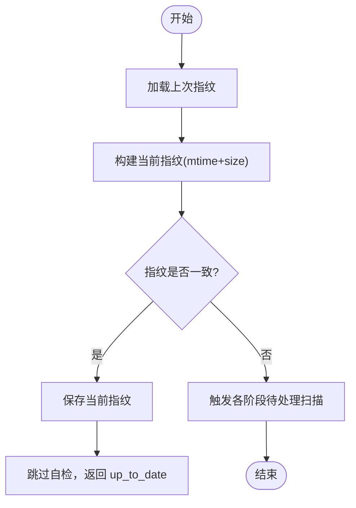
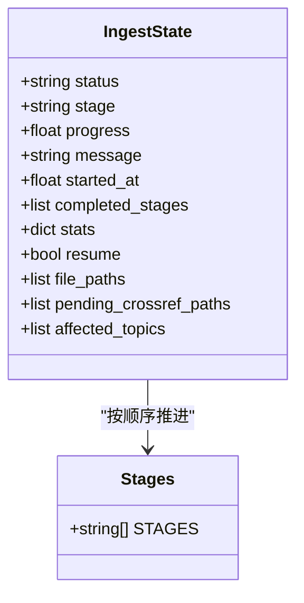
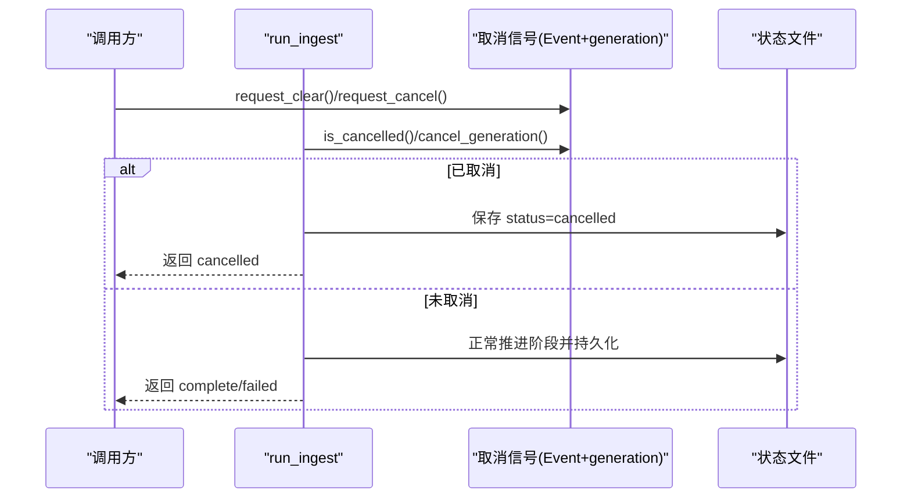
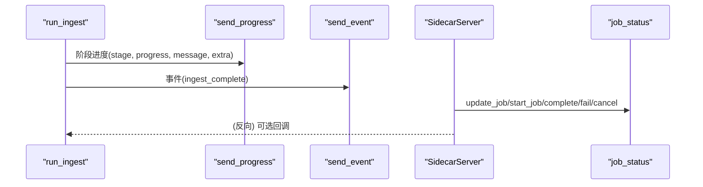
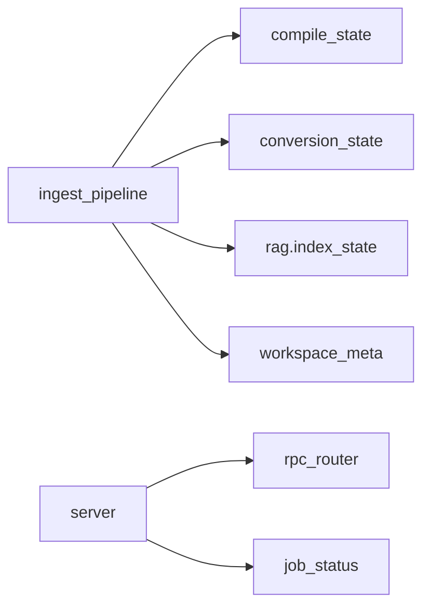

# 状态管理与进度跟踪

<cite>
**本文引用的文件**
- [ingest_pipeline.py](file://python/sidecar/ingest_pipeline.py)
- [job_status.py](file://python/sidecar/job_status.py)
- [compile_state.py](file://python/sidecar/compile_state.py)
- [conversion_state.py](file://python/sidecar/conversion_state.py)
- [index_state.py](file://python/sidecar/rag/index_state.py)
- [server.py](file://python/sidecar/server.py)
- [rpc_router.py](file://python/sidecar/rpc_router.py)
- [workspace_meta.py](file://python/sidecar/workspace_meta.py)
</cite>

## 目录
1. [简介](#简介)
2. [项目结构](#项目结构)
3. [核心组件](#核心组件)
4. [架构总览](#架构总览)
5. [详细组件分析](#详细组件分析)
6. [依赖关系分析](#依赖关系分析)
7. [性能考量](#性能考量)
8. [故障排查指南](#故障排查指南)
9. [结论](#结论)
10. [附录：状态文件结构与版本兼容](#附录状态文件结构与版本兼容)

## 简介
本技术文档聚焦入库流水线（Ingest Pipeline）的状态管理系统，围绕以下目标展开：
- 工作区指纹机制与增量检测算法
- 断点续跑实现原理
- 状态持久化策略、并发安全控制与取消机制
- 进度回调系统、事件通知机制与统计信息收集
- 状态恢复、故障诊断与性能监控操作指南
- 状态文件结构定义与版本兼容性处理方案

## 项目结构
入库流水线状态管理涉及多个模块的协作：
- 流水线编排与阶段推进：ingest_pipeline.py
- 任务状态注册与事件推送：job_status.py
- 编译态与转换态去重：compile_state.py、conversion_state.py
- RAG 索引状态：index_state.py
- 服务进程与事件总线：server.py、rpc_router.py
- 工作区元数据辅助：workspace_meta.py

图示来源
- [server.py:107-124](file://python/sidecar/server.py#L107-L124)
- [rpc_router.py:43-82](file://python/sidecar/rpc_router.py#L43-L82)
- [ingest_pipeline.py:480-947](file://python/sidecar/ingest_pipeline.py#L480-L947)
- [job_status.py:35-189](file://python/sidecar/job_status.py#L35-L189)
- [compile_state.py:1-55](file://python/sidecar/compile_state.py#L1-L55)
- [conversion_state.py:1-109](file://python/sidecar/conversion_state.py#L1-L109)
- [index_state.py](file://python/sidecar/rag/index_state.py)
- [workspace_meta.py:101-121](file://python/sidecar/workspace_meta.py#L101-L121)

章节来源
- [server.py:54-124](file://python/sidecar/server.py#L54-L124)
- [rpc_router.py:43-106](file://python/sidecar/rpc_router.py#L43-L106)

## 核心组件
- 流水线状态机与阶段推进
  - 阶段集合：rules、convert、compile、classify、index、crossref、cascade、lint、sync
  - 运行中状态字段：status、stage、progress、message、started_at、completed_stages、stats、resume、file_paths
  - 完成/失败/取消后清理：清空临时中间状态，保存指纹
- 工作区指纹与增量检测
  - 指纹文件：ingest_fingerprint.json（路径 mtime+size）
  - 变更判定：比较上次指纹与当前指纹，快速跳过无变更场景
- 断点续跑
  - 支持从 completed_stages 恢复；在 resume=True 时恢复受影响的中间集合（如 affected_topics、pending_crossref_paths）
  - 启动时 normalize 将“异常中断”的 running 修正为 interrupted，并提示自动续跑
- 原子持久化与并发安全
  - 使用临时文件 + fsync + replace 的原子写入
  - 全局锁保护关键状态写（_state_lock），取消信号使用 Event + generation 避免竞态
- 进度回调与事件通知
  - run_ingest 接收 send_progress(stage, progress, message, extra) 与 send_event(event_dict)
  - server 层统一封装 job_status 事件推送，供前端订阅
- 统计信息收集
  - stats 包含 converted、compiled、classified、indexed_files、cascade_updated、cascade_failed、cascade_topics、purged_index_files、auto_topic_moves、cross_refs、lint 等

章节来源
- [ingest_pipeline.py:23-28](file://python/sidecar/ingest_pipeline.py#L23-L28)
- [ingest_pipeline.py:107-145](file://python/sidecar/ingest_pipeline.py#L107-L145)
- [ingest_pipeline.py:167-178](file://python/sidecar/ingest_pipeline.py#L167-L178)
- [ingest_pipeline.py:480-566](file://python/sidecar/ingest_pipeline.py#L480-L566)
- [ingest_pipeline.py:575-591](file://python/sidecar/ingest_pipeline.py#L575-L591)
- [ingest_pipeline.py:887-913](file://python/sidecar/ingest_pipeline.py#L887-L913)
- [job_status.py:35-189](file://python/sidecar/job_status.py#L35-L189)
- [server.py:145-182](file://python/sidecar/server.py#L145-L182)

## 架构总览
下图展示从 RPC 请求到流水线执行、状态持久化与事件回传的完整链路。

图示来源
- [server.py:107-124](file://python/sidecar/server.py#L107-L124)
- [rpc_router.py:54-82](file://python/sidecar/rpc_router.py#L54-L82)
- [ingest_pipeline.py:480-566](file://python/sidecar/ingest_pipeline.py#L480-L566)
- [job_status.py:35-189](file://python/sidecar/job_status.py#L35-L189)

## 详细组件分析

### 工作区指纹与增量检测
- 指纹生成
  - 遍历工作区文件，过滤隐藏/忽略目录与产物目录，仅对 .md 与可转换格式计算 [mtime, size]
  - 结果缓存于 ingest_fingerprint.json
- 变更判定
  - 对比上次指纹与当前指纹，相等则直接返回“无需自检”，并保存最新指纹
  - 不相等则进入后续扫描流程（转换/分类/索引/编译）
- 典型路径
  - _workspace_file_fingerprint / _load_fingerprint / _save_fingerprint / _workspace_files_changed

图示来源
- [ingest_pipeline.py:65-105](file://python/sidecar/ingest_pipeline.py#L65-L105)
- [ingest_pipeline.py:180-200](file://python/sidecar/ingest_pipeline.py#L180-L200)
- [ingest_pipeline.py:896-898](file://python/sidecar/ingest_pipeline.py#L896-L898)

章节来源
- [ingest_pipeline.py:65-105](file://python/sidecar/ingest_pipeline.py#L65-L105)
- [ingest_pipeline.py:180-200](file://python/sidecar/ingest_pipeline.py#L180-L200)

### 断点续跑与阶段推进
- 阶段集合 STAGES 定义了顺序与范围
- 运行前根据 resume 与 completed_stages 决定跳过已完成阶段
- 每完成一个阶段即持久化 completed_stages 与 stats，确保崩溃后可恢复
- 特殊中间状态：
  - pending_crossref_paths：索引完成后用于交叉引用阶段
  - affected_topics：分类阶段收集的受影响主题，供 cascade 使用

图示来源
- [ingest_pipeline.py:23-28](file://python/sidecar/ingest_pipeline.py#L23-L28)
- [ingest_pipeline.py:550-583](file://python/sidecar/ingest_pipeline.py#L550-L583)
- [ingest_pipeline.py:592-596](file://python/sidecar/ingest_pipeline.py#L592-L596)
- [ingest_pipeline.py:784-786](file://python/sidecar/ingest_pipeline.py#L784-L786)

章节来源
- [ingest_pipeline.py:550-583](file://python/sidecar/ingest_pipeline.py#L550-L583)
- [ingest_pipeline.py:592-596](file://python/sidecar/ingest_pipeline.py#L592-L596)
- [ingest_pipeline.py:784-786](file://python/sidecar/ingest_pipeline.py#L784-L786)

### 取消机制与并发安全
- 取消信号
  - 线程级 Event + generation 计数，避免新请求被旧取消影响
  - run_ingest 内部通过 cancel_generation() 与 is_cancelled() 组合判断
- 并发安全
  - 状态文件写入使用 _state_lock 串行化
  - 原子写入：临时文件 + fsync + os.replace
  - RAG 索引阶段通过 index_operation 互斥，防止多实例同时修改索引

图示来源
- [ingest_pipeline.py:147-165](file://python/sidecar/ingest_pipeline.py#L147-L165)
- [ingest_pipeline.py:496-505](file://python/sidecar/ingest_pipeline.py#L496-L505)
- [ingest_pipeline.py:118-145](file://python/sidecar/ingest_pipeline.py#L118-L145)
- [ingest_pipeline.py:350-362](file://python/sidecar/ingest_pipeline.py#L350-L362)

章节来源
- [ingest_pipeline.py:147-165](file://python/sidecar/ingest_pipeline.py#L147-L165)
- [ingest_pipeline.py:496-505](file://python/sidecar/ingest_pipeline.py#L496-L505)
- [ingest_pipeline.py:118-145](file://python/sidecar/ingest_pipeline.py#L118-L145)
- [ingest_pipeline.py:350-362](file://python/sidecar/ingest_pipeline.py#L350-L362)

### 进度回调系统与事件通知
- 进度回调
  - run_ingest 内定义 prog(stage, p, msg, **extra)，同步写入状态并调用外部 send_progress
- 事件通知
  - 成功/失败/取消均通过 send_event 发送 ingest_complete 事件
  - server 层将 job_status 更新与通用 event 合并输出，便于前端统一消费

图示来源
- [ingest_pipeline.py:584-591](file://python/sidecar/ingest_pipeline.py#L584-L591)
- [ingest_pipeline.py:901-913](file://python/sidecar/ingest_pipeline.py#L901-L913)
- [server.py:145-182](file://python/sidecar/server.py#L145-L182)

章节来源
- [ingest_pipeline.py:584-591](file://python/sidecar/ingest_pipeline.py#L584-L591)
- [ingest_pipeline.py:901-913](file://python/sidecar/ingest_pipeline.py#L901-L913)
- [server.py:145-182](file://python/sidecar/server.py#L145-L182)

### 统计信息收集
- 统计项示例：converted、compiled、classified、indexed_files、cascade_topics、purged_index_files、auto_topic_moves、cross_refs、lint
- 统计在阶段推进过程中累计，并在每个阶段结束时持久化
- 完成时汇总至 state.stats，并随事件返回

章节来源
- [ingest_pipeline.py:509-521](file://python/sidecar/ingest_pipeline.py#L509-L521)
- [ingest_pipeline.py:887-913](file://python/sidecar/ingest_pipeline.py#L887-L913)

### 索引与交叉引用阶段的增量逻辑
- 索引
  - 基于 index_state.file_needs_index 与 manifest 一致性检查，必要时全量修复
  - 批量替换 chunks/embeddings 并标记已索引
- 交叉引用
  - 仅对当次实际更新的文件进行 LLM 或启发式关联，数量阈值控制是否启用 LLM

章节来源
- [ingest_pipeline.py:364-462](file://python/sidecar/ingest_pipeline.py#L364-L462)
- [ingest_pipeline.py:801-832](file://python/sidecar/ingest_pipeline.py#L801-L832)

## 依赖关系分析
- 组件耦合
  - ingest_pipeline 依赖 compile_state、conversion_state、rag.index_state、workspace_meta
  - server 通过 RpcRouter 分发请求，统一封装 job_status 事件
- 外部依赖
  - watchdog 监听工作区变更，驱动自动处理与 WIKI 同步
  - RAG 索引库提供 index_operation 互斥与集合操作

图示来源
- [ingest_pipeline.py:1-22](file://python/sidecar/ingest_pipeline.py#L1-L22)
- [server.py:107-124](file://python/sidecar/server.py#L107-L124)
- [rpc_router.py:43-82](file://python/sidecar/rpc_router.py#L43-L82)
- [job_status.py:35-189](file://python/sidecar/job_status.py#L35-L189)

章节来源
- [ingest_pipeline.py:1-22](file://python/sidecar/ingest_pipeline.py#L1-L22)
- [server.py:107-124](file://python/sidecar/server.py#L107-L124)
- [rpc_router.py:43-82](file://python/sidecar/rpc_router.py#L43-L82)
- [job_status.py:35-189](file://python/sidecar/job_status.py#L35-L189)

## 性能考量
- 指纹快速路径：mtime+size 比对，避免全量哈希
- 阶段跳过：resume 模式下跳过已完成阶段，减少重复工作
- 索引批处理：批量替换 chunks 与标记，降低 IO 次数
- 交叉引用阈值：小批量启用 LLM，大批量走启发式，节省时间
- 缓存失效：工作区变更时清理 RPC/全文检索/RAG 查询缓存，保证一致性

[本节为通用指导，不直接分析具体文件]

## 故障排查指南
- 常见状态码与含义
  - idle：空闲
  - running：运行中
  - interrupted：上次未跑完，将自动续跑
  - needs_workspace_rules：未完成工作区规则配置
  - complete：完成
  - failed：失败（含错误消息）
  - cancelled：已取消
- 定位步骤
  - 查看 ingest_state.json 的 status、stage、message、error、stats
  - 核对 fingerprint 是否最新，必要时删除以强制全量重建
  - 检查 job_status 列表，确认后台任务生命周期
  - 观察服务端日志，关注 RAG 索引互斥与模型预热相关警告
- 恢复建议
  - 若状态为 interrupted/failed，再次触发即可续跑
  - 若需强制全量，设置 force_full_next 标志后重启

章节来源
- [ingest_pipeline.py:167-178](file://python/sidecar/ingest_pipeline.py#L167-L178)
- [ingest_pipeline.py:550-566](file://python/sidecar/ingest_pipeline.py#L550-L566)
- [ingest_pipeline.py:915-942](file://python/sidecar/ingest_pipeline.py#L915-L942)
- [job_status.py:174-189](file://python/sidecar/job_status.py#L174-L189)

## 结论
该状态管理系统通过“指纹+阶段推进+原子持久化+取消信号”的组合，实现了高可靠、可恢复、可观测的入库流水线。配合 server 层的统一事件通道与 job_status 的任务视图，既保证了正确性，也提供了良好的用户体验与运维能力。

[本节为总结性内容，不直接分析具体文件]

## 附录：状态文件结构与版本兼容

### 状态文件清单
- ingest_state.json：流水线运行状态、阶段、统计、中间集合
- ingest_fingerprint.json：工作区文件指纹（path -> [mtime, size]）
- compile_state.json：编译态记录（files: {rel_path: mtime}）
- conversion_state.json：转换态记录（sources: {sha256: {output, source_name}}）
- rag/index_state.*：RAG 索引元数据与文件索引状态

### 关键字段说明（节选）
- ingest_state.json
  - status：idle/running/interrupted/needs_workspace_rules/complete/failed/cancelled
  - stage：当前阶段名
  - progress：0~1 进度
  - message：当前消息
  - started_at/finished_at/last_complete_at：时间戳
  - completed_stages：已完成阶段列表
  - stats：统计字典
  - resume：是否续跑
  - file_paths：本次处理的文件列表
  - pending_crossref_paths：待交叉引用文件
  - affected_topics：受影响主题集合
- compile_state.json
  - files：{相对路径: mtime}
- conversion_state.json
  - sources：{源文件sha256: {output, source_name}}

### 版本兼容与迁移
- 读取容错：JSON 解析失败或类型不符时回退默认值
- 原子写入：临时文件 + fsync + replace，避免损坏
- 备份恢复：工作区状态类提供 .bak 恢复（适用于工作区状态管理器）
- 字段演进：新增字段采用 get(key, default) 模式，兼容旧版本

章节来源
- [ingest_pipeline.py:107-145](file://python/sidecar/ingest_pipeline.py#L107-L145)
- [compile_state.py:21-55](file://python/sidecar/compile_state.py#L21-L55)
- [conversion_state.py:32-109](file://python/sidecar/conversion_state.py#L32-L109)
- [config/workspace_state.py:26-126](file://config/workspace_state.py#L26-L126)