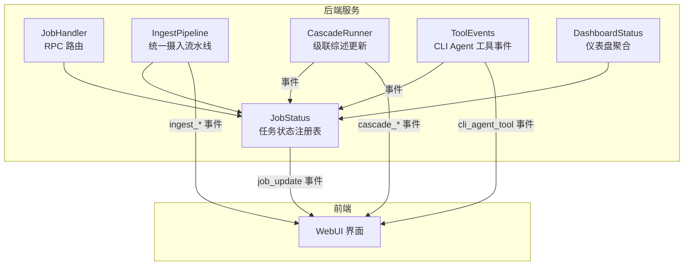
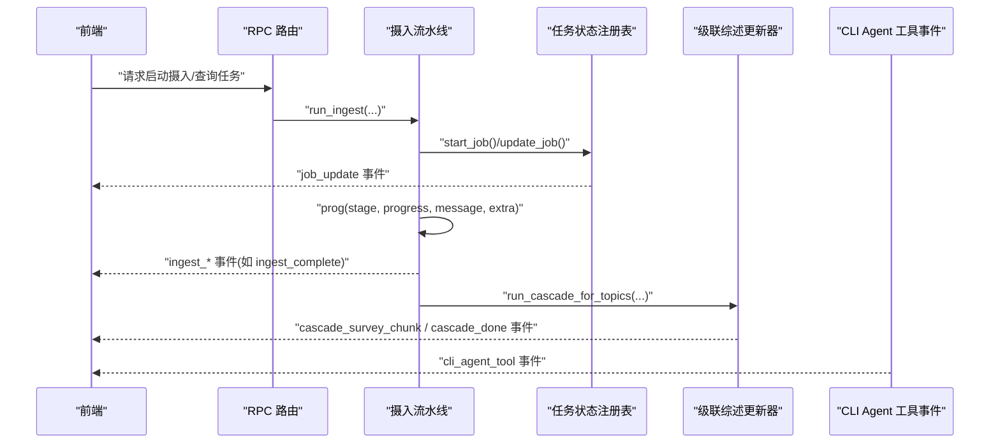
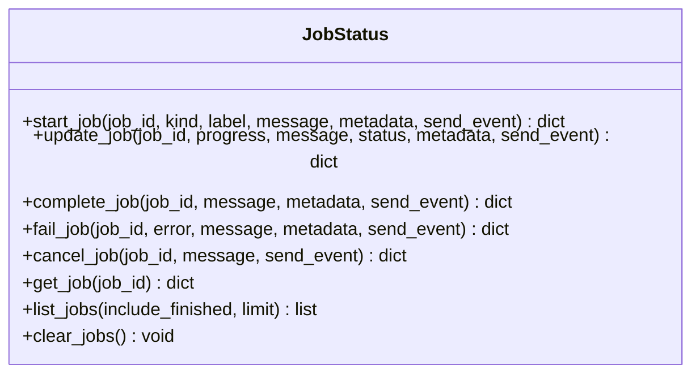
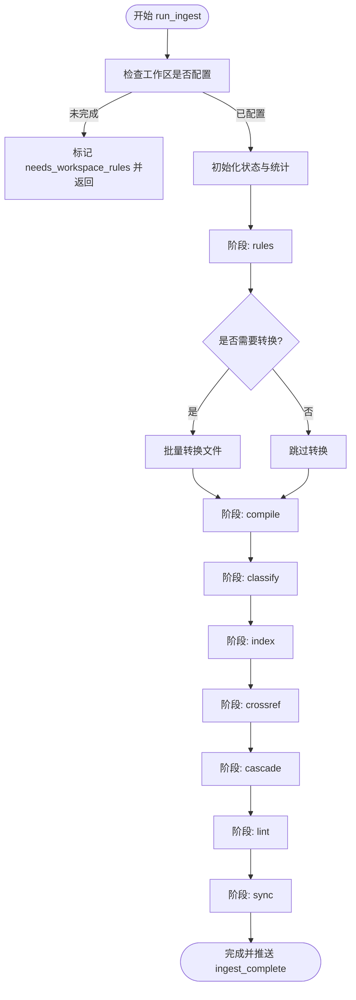
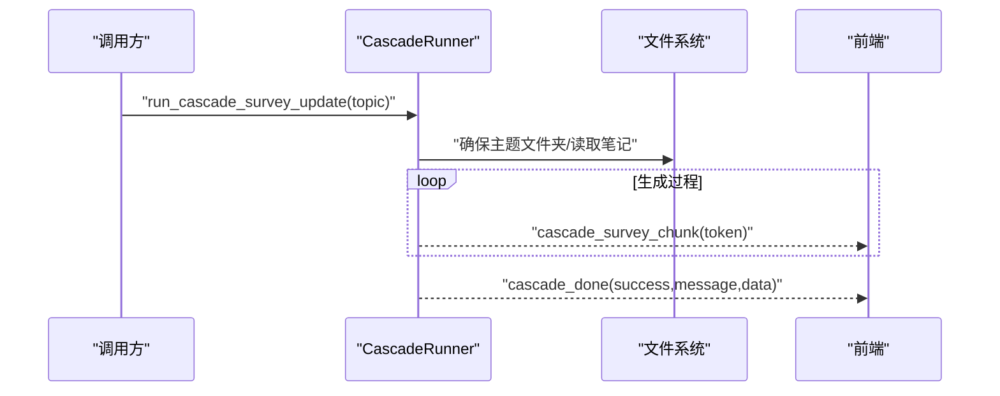
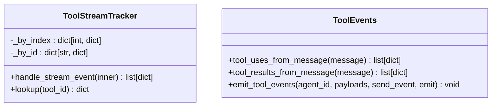
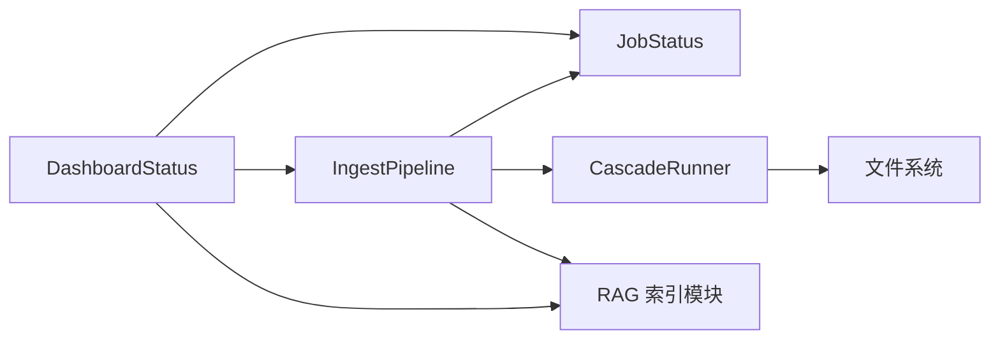

# 进度跟踪与回调系统

<cite>
**本文引用的文件**   
- [job_status.py](file://python/sidecar/job_status.py)
- [dashboard_status.py](file://python/sidecar/dashboard_status.py)
- [tool_events.py](file://python/sidecar/cli_agent/tool_events.py)
- [job_handler.py](file://python/sidecar/handlers/job_handler.py)
- [cascade_runner.py](file://python/sidecar/cascade_runner.py)
- [ingest_pipeline.py](file://python/sidecar/ingest_pipeline.py)
</cite>

## 目录
1. [简介](#简介)
2. [项目结构](#项目结构)
3. [核心组件](#核心组件)
4. [架构总览](#架构总览)
5. [详细组件分析](#详细组件分析)
6. [依赖关系分析](#依赖关系分析)
7. [性能考虑](#性能考虑)
8. [故障排查指南](#故障排查指南)
9. [结论](#结论)
10. [附录](#附录)

## 简介
本技术文档聚焦于“进度跟踪与回调系统”，覆盖以下关键能力：
- 进度回调函数的调用时机、数据格式（阶段进度、百分比计算、消息传递）
- 事件通知系统的实现（实时状态更新、前端同步、错误事件处理）
- 统计信息收集系统（各阶段处理数量、错误计数、性能指标）
- 进度显示最佳实践、用户体验优化与性能监控方案
- 实际回调函数实现示例与事件监听器的使用方法

该系统由后台任务状态注册表、统一摄入流水线、级联综述更新器、CLI Agent 工具事件解析以及仪表盘聚合等模块组成，通过统一的 send_event/send_progress 回调机制向前端推送结构化事件。

## 项目结构
与进度跟踪与回调相关的核心文件及职责如下：
- python/sidecar/job_status.py：内存中的任务状态注册表，提供任务的创建、更新、完成、失败、取消、查询与列表接口，并通过回调发送 job_update 事件。
- python/sidecar/ingest_pipeline.py：统一摄入流水线，定义阶段常量、进度回调、持久化状态、取消控制、统计汇总与事件推送。
- python/sidecar/cascade_runner.py：级联综述更新流程，支持重试、失败记录、分块事件与完成事件。
- python/sidecar/cli_agent/tool_events.py：从流式 JSON 中解析 tool_use/tool_result，生成 cli_agent_tool 事件。
- python/sidecar/handlers/job_handler.py：暴露获取任务列表与单个任务的 RPC 路由。
- python/sidecar/dashboard_status.py：聚合工作区统计、待处理项、RAG 索引状态、摄入状态与任务列表，供首页仪表盘使用。

图表来源
- [job_status.py:26-33](file://python/sidecar/job_status.py#L26-L33)
- [ingest_pipeline.py:584-591](file://python/sidecar/ingest_pipeline.py#L584-L591)
- [cascade_runner.py:94-108](file://python/sidecar/cascade_runner.py#L94-L108)
- [tool_events.py:136-151](file://python/sidecar/cli_agent/tool_events.py#L136-L151)
- [dashboard_status.py:112-124](file://python/sidecar/dashboard_status.py#L112-L124)

章节来源
- [job_status.py:1-189](file://python/sidecar/job_status.py#L1-L189)
- [ingest_pipeline.py:1-800](file://python/sidecar/ingest_pipeline.py#L1-L800)
- [cascade_runner.py:1-219](file://python/sidecar/cascade_runner.py#L1-L219)
- [tool_events.py:1-151](file://python/sidecar/cli_agent/tool_events.py#L1-L151)
- [job_handler.py:1-30](file://python/sidecar/handlers/job_handler.py#L1-L30)
- [dashboard_status.py:1-124](file://python/sidecar/dashboard_status.py#L1-L124)

## 核心组件
- 任务状态注册表（JobStatus）
  - 提供 start_job/update_job/complete_job/fail_job/cancel_job/get_job/list_jobs/clear_jobs 等接口
  - 内部维护有序字典与互斥锁，保证并发安全
  - 每次变更都会通过 send_event 回调推送 {"type":"job_update","job":...} 事件
- 统一摄入流水线（IngestPipeline）
  - 定义阶段常量 STAGES，按顺序执行 rules/convert/compile/classify/index/crossref/cascade/lint/sync
  - 通过 prog(stage, progress, message, **extra) 回调推进进度并持久化状态
  - 支持 resume 续跑、取消检测、统计汇总 stats、事件推送 ingest_complete 等
- 级联综述更新器（CascadeRunner）
  - 对主题进行自动综述更新，支持重试、失败记录、分块事件 cascade_survey_chunk 与完成事件 cascade_done
- CLI Agent 工具事件（ToolEvents）
  - 解析 stream-json 的 content_block_start/delta/stop 与 tool_use/tool_result，生成 cli_agent_tool 事件
- 仪表盘聚合（DashboardStatus）
  - 聚合工作区统计、待处理项、RAG 索引状态、摄入状态与任务列表，返回给前端

章节来源
- [job_status.py:35-189](file://python/sidecar/job_status.py#L35-L189)
- [ingest_pipeline.py:23-24](file://python/sidecar/ingest_pipeline.py#L23-L24)
- [ingest_pipeline.py:584-591](file://python/sidecar/ingest_pipeline.py#L584-L591)
- [ingest_pipeline.py:480-548](file://python/sidecar/ingest_pipeline.py#L480-L548)
- [cascade_runner.py:74-153](file://python/sidecar/cascade_runner.py#L74-L153)
- [tool_events.py:28-95](file://python/sidecar/cli_agent/tool_events.py#L28-L95)
- [dashboard_status.py:20-124](file://python/sidecar/dashboard_status.py#L20-L124)

## 架构总览
下图展示了端到端的进度与事件流转：后端任务在运行过程中通过回调向外部发送事件；前端订阅这些事件以实时更新 UI。

图表来源
- [job_status.py:26-33](file://python/sidecar/job_status.py#L26-L33)
- [ingest_pipeline.py:584-591](file://python/sidecar/ingest_pipeline.py#L584-L591)
- [cascade_runner.py:94-108](file://python/sidecar/cascade_runner.py#L94-L108)
- [tool_events.py:136-151](file://python/sidecar/cli_agent/tool_events.py#L136-L151)

## 详细组件分析

### 任务状态注册表（JobStatus）
- 设计要点
  - 线程安全：使用全局锁保护 OrderedDict 读写
  - 容量限制：最多保留 MAX_JOBS 条记录，超出时移除最旧条目
  - 事件驱动：所有状态变更均通过 send_event 推送 job_update 事件
- 关键接口
  - start_job(job_id, kind, label, message, metadata, send_event) -> 初始化任务快照并推送事件
  - update_job(job_id, progress, message, status, metadata, send_event) -> 更新字段并推送事件
  - complete_job/fail_job/cancel_job -> 设置结束状态与时间戳，推送事件
  - get_job/list_jobs/clear_jobs -> 查询与清理
- 数据结构
  - 任务对象包含 id/kind/label/status/progress/message/metadata/created_at/updated_at/finished_at/error 等字段
  - progress 被规范化到 [0.0, 1.0] 区间

图表来源
- [job_status.py:35-189](file://python/sidecar/job_status.py#L35-L189)

章节来源
- [job_status.py:1-189](file://python/sidecar/job_status.py#L1-L189)

### 统一摄入流水线（IngestPipeline）
- 阶段与进度
  - 阶段常量 STAGES = ("rules", "convert", "compile", "classify", "index", "crossref", "cascade", "lint", "sync")
  - 每个阶段内通过 prog(stage, p, msg, **extra) 更新状态与推送进度
  - 百分比计算策略：
    - 规则检查：约 0.02
    - 转换：0.05→0.16
    - 编译：0.17→0.28
    - 分类：0.28→0.45
    - 索引：0.50→0.65
    - 交叉引用/级联/校验/同步：后续阶段逐步推进至 1.0
- 状态持久化
  - 写入 ingest_state.json，包含 status/mode/stage/progress/message/stats/file_paths/resume/completed_stages 等
  - 原子写入避免损坏
- 取消与续跑
  - 基于 cancel_generation 与 _cancel_event 实现跨线程取消
  - resume 模式可恢复已完成阶段与部分中间状态
- 统计信息
  - stats 包含 converted/compiled/classified/pending_topics/indexed_files/cascade_updated/cascade_failed/cascade_topics 等
- 事件
  - 成功或提前完成时推送 ingest_complete 事件，携带 success/up_to_date/needs_workspace_rules 等字段

图表来源
- [ingest_pipeline.py:23-24](file://python/sidecar/ingest_pipeline.py#L23-L24)
- [ingest_pipeline.py:584-591](file://python/sidecar/ingest_pipeline.py#L584-L591)
- [ingest_pipeline.py:480-548](file://python/sidecar/ingest_pipeline.py#L480-L548)

章节来源
- [ingest_pipeline.py:1-800](file://python/sidecar/ingest_pipeline.py#L1-L800)

### 级联综述更新器（CascadeRunner）
- 功能概述
  - 为指定主题自动生成或更新综述，支持重试与失败记录
  - 在生成过程中通过 on_chunk 回调推送 cascade_survey_chunk 事件
  - 完成后推送 cascade_done 事件，包含 success/message/data
- 重试与失败
  - 最大重试次数与延迟固定，失败项持久化到 cascade_failures.json
  - 支持 retry_failed_cascades 批量重试

图表来源
- [cascade_runner.py:74-153](file://python/sidecar/cascade_runner.py#L74-L153)
- [cascade_runner.py:94-108](file://python/sidecar/cascade_runner.py#L94-L108)
- [cascade_runner.py:197-219](file://python/sidecar/cascade_runner.py#L197-L219)

章节来源
- [cascade_runner.py:1-219](file://python/sidecar/cascade_runner.py#L1-L219)

### CLI Agent 工具事件（ToolEvents）
- 功能概述
  - 从 Claude NDJSON 流中解析 tool_use 与 tool_result，生成结构化 cli_agent_tool 事件
  - ToolStreamTracker 跟踪 content_block_start/delta/stop，拼接输入 JSON 片段
- 事件类型
  - phase=start 表示工具开始，包含 tool_id/tool/input
  - phase=done 表示工具完成，包含 success/result

图表来源
- [tool_events.py:28-95](file://python/sidecar/cli_agent/tool_events.py#L28-L95)
- [tool_events.py:101-151](file://python/sidecar/cli_agent/tool_events.py#L101-L151)

章节来源
- [tool_events.py:1-151](file://python/sidecar/cli_agent/tool_events.py#L1-L151)

### 仪表盘聚合（DashboardStatus）
- 功能概述
  - 聚合工作区统计（notes/topics）、待处理项摘要、RAG 索引状态、摄入状态与任务列表
  - 将多源数据整合为单一响应，便于前端一次性渲染

章节来源
- [dashboard_status.py:1-124](file://python/sidecar/dashboard_status.py#L1-L124)

### RPC 路由（JobHandler）
- 功能概述
  - 暴露 get_jobs/get_job 两个 RPC 方法，用于前端拉取任务列表与单个任务详情
  - 参数校验与默认值处理，返回标准 success/job 结构

章节来源
- [job_handler.py:1-30](file://python/sidecar/handlers/job_handler.py#L1-L30)

## 依赖关系分析
- 组件耦合
  - IngestPipeline 依赖 JobStatus 进行任务状态管理与事件推送
  - CascadeRunner 独立运行，但可通过 send_response 推送事件
  - ToolEvents 独立解析事件，通过通用 emit 接口推送
  - DashboardStatus 聚合 JobStatus 与其他子系统状态
- 外部依赖
  - 文件系统：ingest_state.json、cascade_failures.json、fingerprint.json
  - RAG 索引：count_indexed_chunks/load_manifest/replace_file_chunks 等
  - 工作区规则：workspace_rules、schema_validator

图表来源
- [ingest_pipeline.py:480-548](file://python/sidecar/ingest_pipeline.py#L480-L548)
- [dashboard_status.py:112-124](file://python/sidecar/dashboard_status.py#L112-L124)

章节来源
- [ingest_pipeline.py:1-800](file://python/sidecar/ingest_pipeline.py#L1-L800)
- [dashboard_status.py:1-124](file://python/sidecar/dashboard_status.py#L1-L124)

## 性能考虑
- 进度推送频率
  - 建议在前端侧对高频事件进行节流（例如每 100-200ms 合并一次），避免 UI 抖动
- 阶段粒度
  - 大阶段内再细分子步骤，减少频繁状态切换带来的开销
- 取消与续跑
  - 利用 cancel_generation 与 completed_stages 快速跳过已完成阶段，提升重启效率
- 索引修复
  - 当 chunk_count 与 expected_chunks 不一致时触发全量修复，注意在大库场景下耗时较长

## 故障排查指南
- 常见问题
  - 未设置工作区：run_ingest 会直接返回 needs_workspace_rules 并推送相应事件
  - 索引不可用：RAG 索引被其他实例占用时会抛出异常，提示关闭其他实例后重试
  - 分类失败：收集错误列表并在阶段结束时抛出异常，需查看日志定位具体文件
- 定位手段
  - 通过 get_job/list_jobs 拉取任务快照，检查 status/progress/message/error
  - 查看 ingest_state.json 与 cascade_failures.json 了解历史状态与失败原因
  - 关注前端接收到的事件类型：ingest_complete、cascade_survey_chunk、cascade_done、cli_agent_tool、job_update

章节来源
- [ingest_pipeline.py:480-548](file://python/sidecar/ingest_pipeline.py#L480-L548)
- [cascade_runner.py:187-195](file://python/sidecar/cascade_runner.py#L187-L195)
- [job_handler.py:10-29](file://python/sidecar/handlers/job_handler.py#L10-L29)

## 结论
本系统通过统一的回调与事件机制，实现了跨模块的进度跟踪与状态同步。JobStatus 提供可靠的任务状态管理，IngestPipeline 负责复杂流水线的阶段推进与统计汇总，CascadeRunner 与 ToolEvents 分别扩展了领域事件与工具事件。配合 DashboardStatus 的聚合能力，前端可以高效地展示实时进度与结果。

## 附录

### 进度回调函数调用时机与数据格式
- 调用时机
  - 任务生命周期：start_job/update_job/complete_job/fail_job/cancel_job 均会推送 job_update
  - 流水线阶段：每个阶段开始时与进行中通过 prog(stage, progress, message, extra) 推送
  - 级联综述：生成过程中推送 cascade_survey_chunk，完成后推送 cascade_done
  - CLI Agent：解析 tool_use/tool_result 后推送 cli_agent_tool
- 数据格式
  - job_update: {"id":"event","result":{"type":"job_update","job":{...}}}
  - ingest_complete: {"id":"event","result":{"type":"ingest_complete","success":bool,...}}
  - cascade_survey_chunk: {"id":"event","result":{"type":"cascade_survey_chunk","topic":str,"token":str}}
  - cascade_done: {"id":"event","result":{"type":"cascade_done","topic":str,"data":{...}}}
  - cli_agent_tool: {"type":"cli_agent_tool","agent":str,...}

章节来源
- [job_status.py:26-33](file://python/sidecar/job_status.py#L26-L33)
- [ingest_pipeline.py:584-591](file://python/sidecar/ingest_pipeline.py#L584-L591)
- [cascade_runner.py:94-108](file://python/sidecar/cascade_runner.py#L94-L108)
- [tool_events.py:136-151](file://python/sidecar/cli_agent/tool_events.py#L136-L151)

### 事件监听器使用方法（前端）
- 监听 job_update
  - 根据 job.id 匹配任务，更新对应进度条与消息
- 监听 ingest_complete
  - 若 up_to_date=true，提示“已是最新”；否则根据 success 与 message 展示结果
- 监听 cascade_survey_chunk
  - 将 token 追加到当前主题的综述预览区域
- 监听 cascade_done
  - 根据 success 与 data.message 提示用户综述更新结果
- 监听 cli_agent_tool
  - 根据 phase 与 tool 名称，展示工具调用开始与结果摘要

章节来源
- [job_status.py:26-33](file://python/sidecar/job_status.py#L26-L33)
- [ingest_pipeline.py:539-548](file://python/sidecar/ingest_pipeline.py#L539-L548)
- [cascade_runner.py:94-108](file://python/sidecar/cascade_runner.py#L94-L108)
- [tool_events.py:136-151](file://python/sidecar/cli_agent/tool_events.py#L136-L151)

### 统计信息收集系统
- 统计字段（stats）
  - converted/compiled/classified/pending_topics/indexed_files/cascade_updated/cascade_failed/cascade_topics/auto_topic_moves/purged_index_files
- 用途
  - 前端展示各阶段处理数量与错误计数
  - 后端用于决策下一步动作（如是否需要重新索引）

章节来源
- [ingest_pipeline.py:509-521](file://python/sidecar/ingest_pipeline.py#L509-L521)
- [ingest_pipeline.py:739-746](file://python/sidecar/ingest_pipeline.py#L739-L746)

### 进度显示最佳实践与用户体验优化
- 进度条
  - 使用阶段进度与百分比结合，显示“阶段名 + 百分比 + 消息”
- 防抖与合并
  - 前端对高频事件进行节流，降低渲染压力
- 错误提示
  - 对失败事件弹出 Toast，并提供重试入口
- 可访问性
  - 为进度文本提供 aria-label，便于屏幕阅读器朗读

### 性能监控方案
- 指标采集
  - 记录各阶段耗时、文件数量、错误率、索引大小变化
- 告警阈值
  - 当连续多次失败或长时间无进度推进时触发告警
- 可视化
  - 在仪表盘展示趋势图与热点文件列表