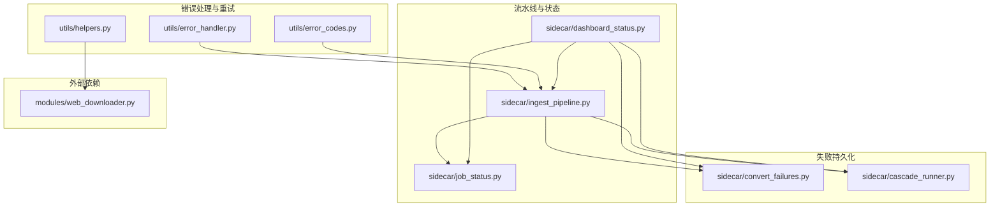
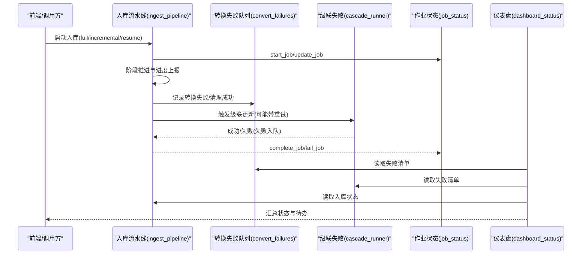
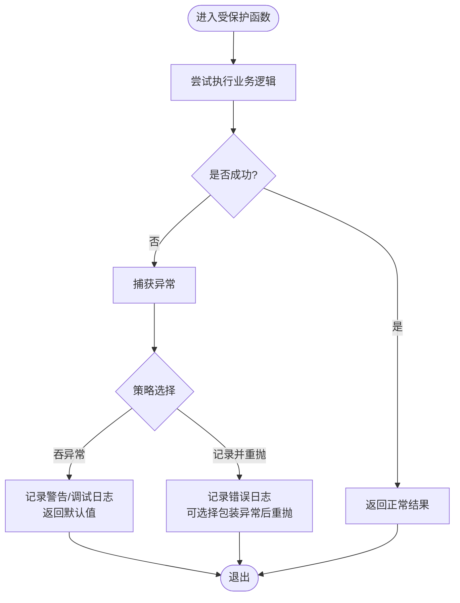
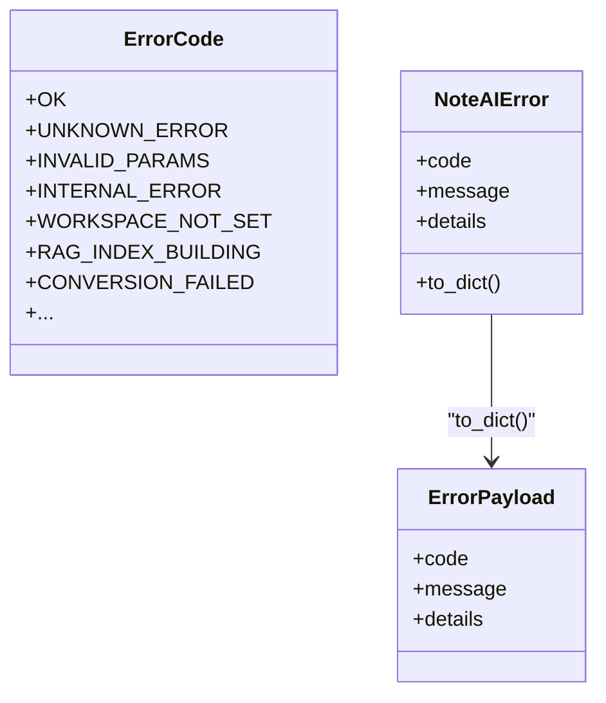
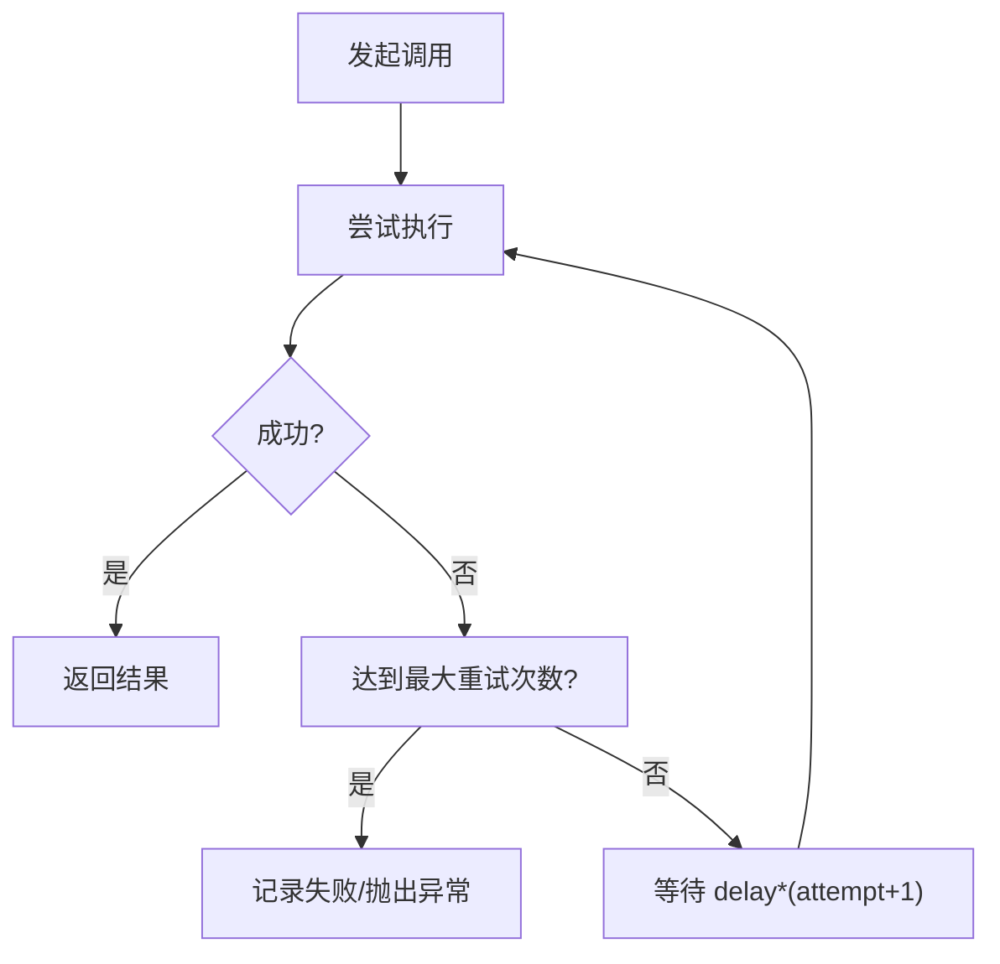
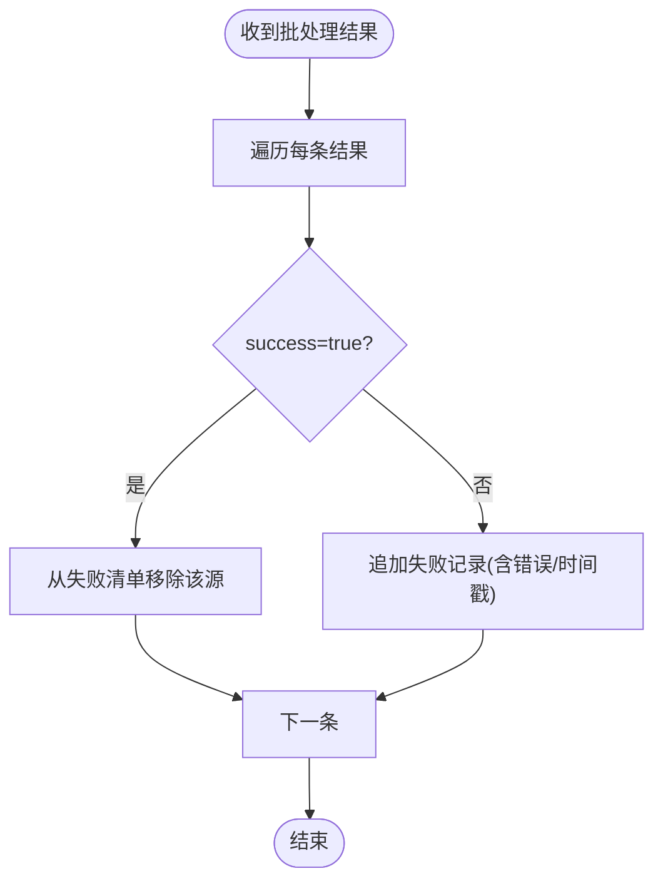
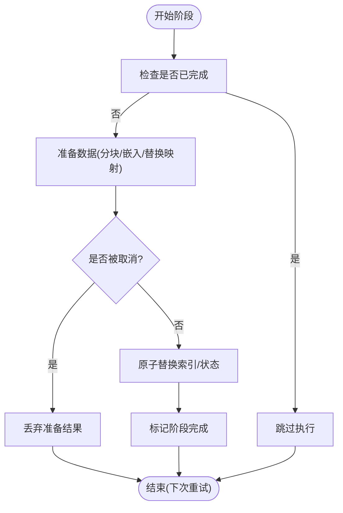
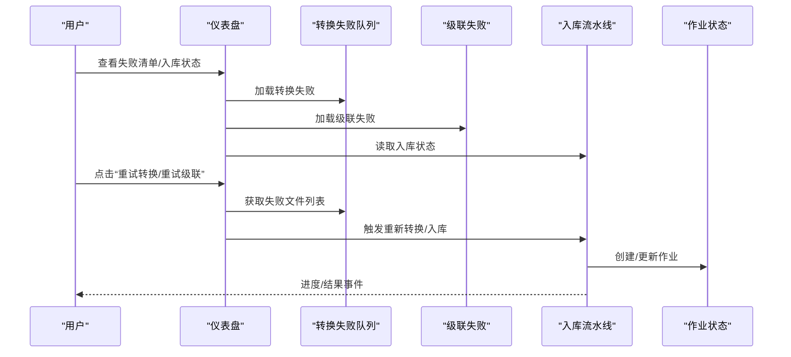
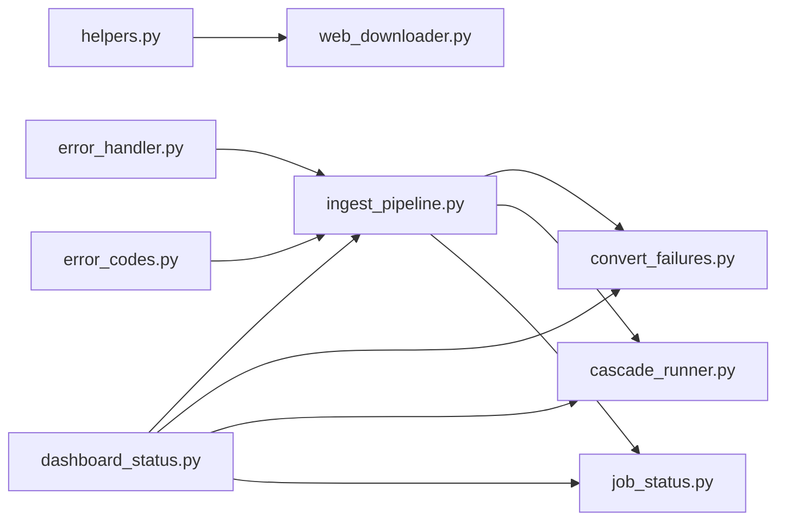

# 错误处理与重试机制

<cite>
**本文引用的文件**
- [ingest_pipeline.py](file://python/sidecar/ingest_pipeline.py)
- [error_handler.py](file://utils/error_handler.py)
- [convert_failures.py](file://python/sidecar/convert_failures.py)
- [cascade_runner.py](file://python/sidecar/cascade_runner.py)
- [job_status.py](file://python/sidecar/job_status.py)
- [error_codes.py](file://utils/error_codes.py)
- [web_downloader.py](file://modules/web_downloader.py)
- [helpers.py](file://utils/helpers.py)
- [dashboard_status.py](file://python/sidecar/dashboard_status.py)
</cite>

## 目录
1. [简介](#简介)
2. [项目结构](#项目结构)
3. [核心组件](#核心组件)
4. [架构总览](#架构总览)
5. [详细组件分析](#详细组件分析)
6. [依赖关系分析](#依赖关系分析)
7. [性能考虑](#性能考虑)
8. [故障排查指南](#故障排查指南)
9. [结论](#结论)
10. [附录](#附录)

## 简介
本技术文档聚焦入库流水线的错误处理系统，系统性阐述异常捕获策略、错误分类机制、重试算法实现；说明失败任务记录、错误日志分析、自动修复功能；描述幂等性保证、事务回滚、数据一致性维护策略；并提供错误恢复流程、人工干预接口、监控告警配置的操作指南，以及常见错误场景解决方案与性能调优建议。

## 项目结构
围绕入库流水线（转换→编译→分类→索引→交叉引用→级联综述→校验→同步）的错误处理由以下模块协同完成：
- 通用错误工具：统一日志、装饰器、结构化错误码
- 持久化失败队列：转换失败、级联失败
- 流水线状态与取消：原子写入、断点续跑、取消传播
- 作业状态注册表：后台任务生命周期与事件推送
- 仪表盘聚合：汇总待办、失败项、索引健康度

图表来源
- [ingest_pipeline.py:1-120](file://python/sidecar/ingest_pipeline.py#L1-L120)
- [error_handler.py:1-120](file://utils/error_handler.py#L1-L120)
- [error_codes.py:1-120](file://utils/error_codes.py#L1-L120)
- [helpers.py:330-360](file://utils/helpers.py#L330-L360)
- [convert_failures.py:1-100](file://python/sidecar/convert_failures.py#L1-L100)
- [cascade_runner.py:1-219](file://python/sidecar/cascade_runner.py#L1-L219)
- [job_status.py:1-189](file://python/sidecar/job_status.py#L1-L189)
- [dashboard_status.py:1-124](file://python/sidecar/dashboard_status.py#L1-L124)
- [web_downloader.py:430-538](file://modules/web_downloader.py#L430-L538)

章节来源
- [ingest_pipeline.py:1-120](file://python/sidecar/ingest_pipeline.py#L1-L120)
- [error_handler.py:1-120](file://utils/error_handler.py#L1-L120)
- [error_codes.py:1-120](file://utils/error_codes.py#L1-L120)
- [helpers.py:330-360](file://utils/helpers.py#L330-L360)
- [convert_failures.py:1-100](file://python/sidecar/convert_failures.py#L1-L100)
- [cascade_runner.py:1-219](file://python/sidecar/cascade_runner.py#L1-L219)
- [job_status.py:1-189](file://python/sidecar/job_status.py#L1-L189)
- [dashboard_status.py:1-124](file://python/sidecar/dashboard_status.py#L1-L124)
- [web_downloader.py:430-538](file://modules/web_downloader.py#L430-L538)

## 核心组件
- 统一错误工具
  - 异常日志封装：提供上下文化日志输出与级别控制
  - 吞异常装饰器：在指定上下文中捕获异常并返回默认值，支持选择性重抛
  - 记录并重抛装饰器：记录错误后向上抛出，可选包装为领域异常
  - 紧凑错误摘要：提取类型、消息与最后堆栈帧
- 结构化错误码
  - 枚举化的错误码集合，覆盖通用、路径/工作区、认证、RAG/索引、特性可用性、模式/入库、验证、云同步、UI 等域
  - 统一的错误载荷构造方法与领域异常类，便于 RPC 层标准化返回
- 失败持久化
  - 转换失败队列：按文件维度记录错误信息、时间戳，支持清理与批量结果回填
  - 级联失败队列：按主题维度记录错误、剩余重试次数，支持重试与清理
- 流水线状态与取消
  - 原子写入的 JSON 状态文件，记录阶段、进度、统计、已完成阶段、受影响主题、待处理交叉引用路径等
  - 取消信号与生成号机制，确保跨线程/进程边界可观测
  - 断点续跑：根据已完成的阶段与中间状态恢复执行
- 作业状态注册表
  - 内存中维护最近 N 个作业的状态快照，支持开始、更新、完成、失败、取消、查询与列表
  - 通过事件回调推送 job_update 事件
- 仪表盘聚合
  - 汇总待办项、级联失败、转换失败、校验报告、入库状态、作业列表、索引健康度等

章节来源
- [error_handler.py:1-120](file://utils/error_handler.py#L1-L120)
- [error_codes.py:1-120](file://utils/error_codes.py#L1-L120)
- [convert_failures.py:1-100](file://python/sidecar/convert_failures.py#L1-L100)
- [cascade_runner.py:1-219](file://python/sidecar/cascade_runner.py#L1-L219)
- [ingest_pipeline.py:107-178](file://python/sidecar/ingest_pipeline.py#L107-L178)
- [job_status.py:1-189](file://python/sidecar/job_status.py#L1-L189)
- [dashboard_status.py:1-124](file://python/sidecar/dashboard_status.py#L1-L124)

## 架构总览
入库流水线在多个阶段内嵌错误处理与重试策略，并通过持久化失败队列与作业状态进行可视化与人工干预。

图表来源
- [ingest_pipeline.py:480-800](file://python/sidecar/ingest_pipeline.py#L480-L800)
- [convert_failures.py:1-100](file://python/sidecar/convert_failures.py#L1-L100)
- [cascade_runner.py:74-195](file://python/sidecar/cascade_runner.py#L74-L195)
- [job_status.py:35-144](file://python/sidecar/job_status.py#L35-L144)
- [dashboard_status.py:97-124](file://python/sidecar/dashboard_status.py#L97-L124)

## 详细组件分析

### 异常捕获与日志策略
- 非关键异常：使用“吞异常”装饰器在特定上下文内捕获并记录，返回默认值，避免中断主流程
- 关键异常：使用“记录并重抛”装饰器，将错误以 error 级别记录，并可包装为领域异常继续上抛
- 统一日志格式：提供紧凑错误摘要，便于快速定位问题位置

图表来源
- [error_handler.py:53-112](file://utils/error_handler.py#L53-L112)

章节来源
- [error_handler.py:1-120](file://utils/error_handler.py#L1-L120)

### 错误分类与结构化错误码
- 错误码枚举：按域划分，涵盖通用、路径/工作区、认证、RAG/索引、特性可用性、模式/入库、验证、云同步、UI 等
- 错误载荷：统一包含 code、message，可选 details，便于前端 i18n 与交互决策
- 领域异常：携带 code/message/details，RPC 层可直接转换为标准错误响应

图表来源
- [error_codes.py:14-120](file://utils/error_codes.py#L14-L120)

章节来源
- [error_codes.py:1-120](file://utils/error_codes.py#L1-L120)

### 重试算法实现
- 网络请求重试：基于装饰器的固定延迟重试，适用于 HTTP GET 等易失败操作
- 级联综述重试：固定最大重试次数与间隔，失败时入队，支持手动或自动重试
- 索引构建重试：在索引操作中采用指数退避式短暂等待，降低瞬时拥塞影响

图表来源
- [helpers.py:330-360](file://utils/helpers.py#L330-L360)
- [web_downloader.py:440-444](file://modules/web_downloader.py#L440-L444)
- [cascade_runner.py:112-153](file://python/sidecar/cascade_runner.py#L112-L153)

章节来源
- [helpers.py:330-360](file://utils/helpers.py#L330-L360)
- [web_downloader.py:430-538](file://modules/web_downloader.py#L430-L538)
- [cascade_runner.py:1-219](file://python/sidecar/cascade_runner.py#L1-L219)

### 失败任务记录与清理
- 转换失败队列：按文件维度去重记录，保留错误信息与时间戳；批量结果回填时可清理成功项
- 级联失败队列：按主题维度记录，保留剩余重试次数；支持全量重试与单主题重试
- 脏数据清理：定期清理失效条目（如文件已被删除），保持失败清单准确

图表来源
- [convert_failures.py:83-100](file://python/sidecar/convert_failures.py#L83-L100)

章节来源
- [convert_failures.py:1-100](file://python/sidecar/convert_failures.py#L1-L100)
- [cascade_runner.py:55-72](file://python/sidecar/cascade_runner.py#L55-L72)

### 幂等性与事务回滚
- 幂等性保障
  - 指纹与增量扫描：通过 mtime+size 指纹判断变更，避免重复处理
  - 索引替换原子性：先准备替换映射，再一次性替换分块与元数据，减少中间态
  - 阶段标记：completed_stages 记录已完成阶段，支持断点续跑
- 事务回滚
  - 原子写入：JSON 状态文件采用临时文件写入后原子替换，避免部分写入导致损坏
  - 取消安全：在索引准备阶段若检测到取消，直接丢弃已准备嵌入，不修改索引状态，下次运行自然重试

图表来源
- [ingest_pipeline.py:126-145](file://python/sidecar/ingest_pipeline.py#L126-L145)
- [ingest_pipeline.py:364-462](file://python/sidecar/ingest_pipeline.py#L364-L462)
- [ingest_pipeline.py:575-583](file://python/sidecar/ingest_pipeline.py#L575-L583)

章节来源
- [ingest_pipeline.py:93-105](file://python/sidecar/ingest_pipeline.py#L93-L105)
- [ingest_pipeline.py:126-145](file://python/sidecar/ingest_pipeline.py#L126-L145)
- [ingest_pipeline.py:364-462](file://python/sidecar/ingest_pipeline.py#L364-L462)
- [ingest_pipeline.py:575-583](file://python/sidecar/ingest_pipeline.py#L575-L583)

### 数据一致性维护
- 索引完整性自检：对比 manifest 期望分块数与实际分块数，不一致时触发全量修复
- 删除文件清理：对磁盘已删除但索引仍存在的条目进行清理，保持索引与文件系统一致
- 受影响主题追踪：分类与自动移动笔记后，收集受影响主题用于后续级联更新

章节来源
- [ingest_pipeline.py:378-403](file://python/sidecar/ingest_pipeline.py#L378-L403)
- [ingest_pipeline.py:464-477](file://python/sidecar/ingest_pipeline.py#L464-L477)
- [ingest_pipeline.py:735-746](file://python/sidecar/ingest_pipeline.py#L735-L746)

### 错误恢复流程与人工干预接口
- 自动恢复
  - 断点续跑：根据 completed_stages 与 pending_crossref_paths/affected_topics 恢复
  - 自动重试：级联失败队列支持批量重试
- 人工干预
  - 仪表盘展示失败清单与入库状态，支持一键重试转换失败、级联失败
  - 作业状态列表可查看历史作业详情与错误信息

图表来源
- [dashboard_status.py:38-59](file://python/sidecar/dashboard_status.py#L38-L59)
- [dashboard_status.py:97-124](file://python/sidecar/dashboard_status.py#L97-L124)
- [convert_failures.py:1-100](file://python/sidecar/convert_failures.py#L1-L100)
- [cascade_runner.py:186-195](file://python/sidecar/cascade_runner.py#L186-L195)
- [job_status.py:35-144](file://python/sidecar/job_status.py#L35-L144)

章节来源
- [dashboard_status.py:1-124](file://python/sidecar/dashboard_status.py#L1-L124)
- [convert_failures.py:1-100](file://python/sidecar/convert_failures.py#L1-L100)
- [cascade_runner.py:186-195](file://python/sidecar/cascade_runner.py#L186-L195)
- [job_status.py:1-189](file://python/sidecar/job_status.py#L1-L189)

### 监控告警配置建议
- 指标采集
  - 作业状态：running/complete/failed/cancelled 计数与耗时
  - 失败清单：转换失败数量、级联失败数量、最近失败时间
  - 入库状态：阶段、进度、统计、是否需要续跑
  - 索引健康度：chunk_count vs expected_chunks、busy/needs_rebuild
- 告警规则
  - 连续失败阈值：例如转换失败超过 N 条持续 M 分钟
  - 长时间运行：作业运行超过阈值未结束
  - 索引不一致：expected_chunks != chunk_count 且持续存在
- 可视化面板
  - 仪表盘聚合视图：pending_summary、ingest_status、jobs、index

章节来源
- [job_status.py:1-189](file://python/sidecar/job_status.py#L1-L189)
- [dashboard_status.py:38-124](file://python/sidecar/dashboard_status.py#L38-L124)

## 依赖关系分析
- 低耦合高内聚
  - 错误工具与错误码独立于具体业务，供各模块复用
  - 失败队列仅负责持久化与基础 CRUD，业务侧按需消费
- 直接依赖
  - 入库流水线依赖失败队列、作业状态、仪表盘聚合
  - 仪表盘聚合依赖失败队列、入库状态、作业状态
- 潜在循环依赖
  - 当前未发现循环导入；仪表盘与流水线之间通过状态文件与事件解耦

图表来源
- [ingest_pipeline.py:1-120](file://python/sidecar/ingest_pipeline.py#L1-L120)
- [error_handler.py:1-120](file://utils/error_handler.py#L1-L120)
- [error_codes.py:1-120](file://utils/error_codes.py#L1-L120)
- [helpers.py:330-360](file://utils/helpers.py#L330-L360)
- [web_downloader.py:430-538](file://modules/web_downloader.py#L430-L538)
- [convert_failures.py:1-100](file://python/sidecar/convert_failures.py#L1-L100)
- [cascade_runner.py:1-219](file://python/sidecar/cascade_runner.py#L1-L219)
- [job_status.py:1-189](file://python/sidecar/job_status.py#L1-L189)
- [dashboard_status.py:1-124](file://python/sidecar/dashboard_status.py#L1-L124)

章节来源
- [ingest_pipeline.py:1-120](file://python/sidecar/ingest_pipeline.py#L1-L120)
- [error_handler.py:1-120](file://utils/error_handler.py#L1-L120)
- [error_codes.py:1-120](file://utils/error_codes.py#L1-L120)
- [helpers.py:330-360](file://utils/helpers.py#L330-L360)
- [web_downloader.py:430-538](file://modules/web_downloader.py#L430-L538)
- [convert_failures.py:1-100](file://python/sidecar/convert_failures.py#L1-L100)
- [cascade_runner.py:1-219](file://python/sidecar/cascade_runner.py#L1-L219)
- [job_status.py:1-189](file://python/sidecar/job_status.py#L1-L189)
- [dashboard_status.py:1-124](file://python/sidecar/dashboard_status.py#L1-L124)

## 性能考虑
- 增量与指纹优化
  - 使用 mtime+size 快速判定变更，避免全量扫描带来的开销
  - 仅在必要时计算内容哈希，提升整体吞吐
- 并发与锁
  - RAG 索引操作加锁，防止多实例竞争导致的索引损坏
  - 原子写入状态文件，避免并发写冲突
- 重试参数调优
  - 网络请求重试延迟适中，避免雪崩
  - 级联重试间隔合理，兼顾恢复速度与资源占用
- 批量处理与进度反馈
  - 批量转换/索引过程中及时上报进度，缩短用户感知延迟

[本节为通用指导，无需列出具体文件来源]

## 故障排查指南
- 常见问题与定位
  - 工作区未设置：检查工作区路径配置，确认入口参数有效
  - 索引不可用/忙：等待其他实例释放索引锁或关闭多余实例
  - 权限不足：确认应用数据目录与 Notes/Raw 目录读写权限
  - 网络不稳定：观察下载重试次数与失败原因，必要时调整超时与重试参数
- 日志分析要点
  - 关注 warning/error 级别日志中的上下文标签（如 ingest/index、cascade_runner）
  - 结合紧凑错误摘要快速定位最后堆栈帧
- 恢复步骤
  - 转换失败：在仪表盘查看失败清单，逐条或批量重试
  - 级联失败：查看失败主题列表，触发重试
  - 入库中断：根据状态提示选择续跑或全量重建

章节来源
- [error_handler.py:1-120](file://utils/error_handler.py#L1-L120)
- [dashboard_status.py:38-124](file://python/sidecar/dashboard_status.py#L38-L124)
- [convert_failures.py:1-100](file://python/sidecar/convert_failures.py#L1-L100)
- [cascade_runner.py:186-195](file://python/sidecar/cascade_runner.py#L186-L195)

## 结论
本错误处理与重试体系通过统一工具、结构化错误码、持久化失败队列、原子状态与断点续跑、作业状态与仪表盘聚合，构建了稳健的入库流水线容错能力。配合合理的重试策略与监控告警，可在复杂环境下保持稳定运行与快速恢复。

[本节为总结性内容，无需列出具体文件来源]

## 附录
- 术语
  - 指纹：用于快速检测文件变更的轻量标识（mtime+size）
  - 断点续跑：从上次未完成阶段继续执行
  - 级联综述：基于主题下笔记自动生成/更新的综述文档
- 参考实现路径
  - 统一错误工具：[error_handler.py](file://utils/error_handler.py)
  - 结构化错误码：[error_codes.py](file://utils/error_codes.py)
  - 重试装饰器：[helpers.py](file://utils/helpers.py)
  - 转换失败队列：[convert_failures.py](file://python/sidecar/convert_failures.py)
  - 级联失败与重试：[cascade_runner.py](file://python/sidecar/cascade_runner.py)
  - 作业状态：[job_status.py](file://python/sidecar/job_status.py)
  - 仪表盘聚合：[dashboard_status.py](file://python/sidecar/dashboard_status.py)
  - 入库流水线：[ingest_pipeline.py](file://python/sidecar/ingest_pipeline.py)
  - 网络重试示例：[web_downloader.py](file://modules/web_downloader.py)