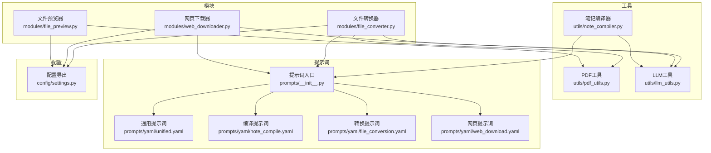
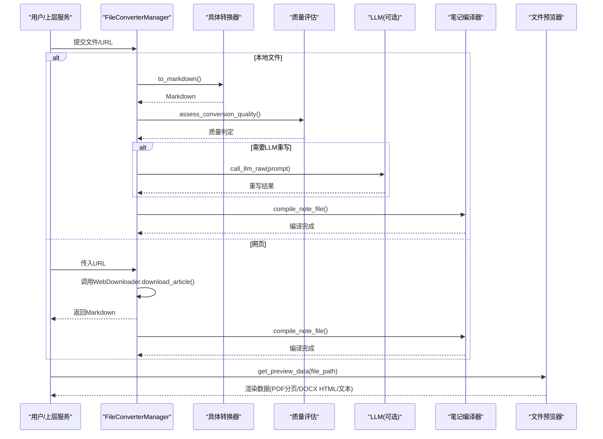
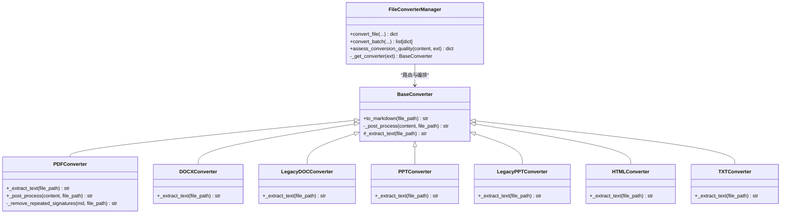
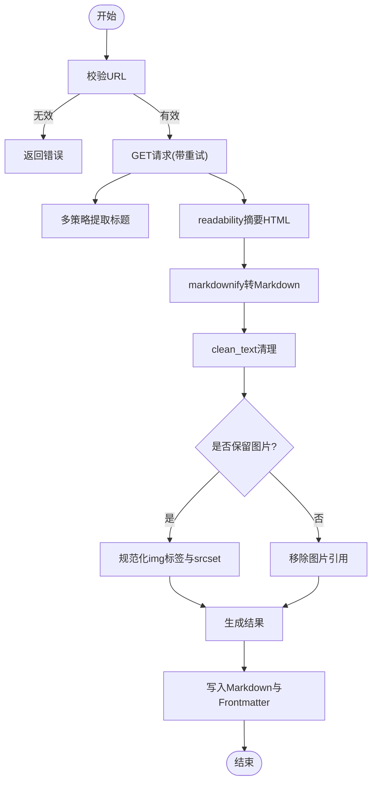
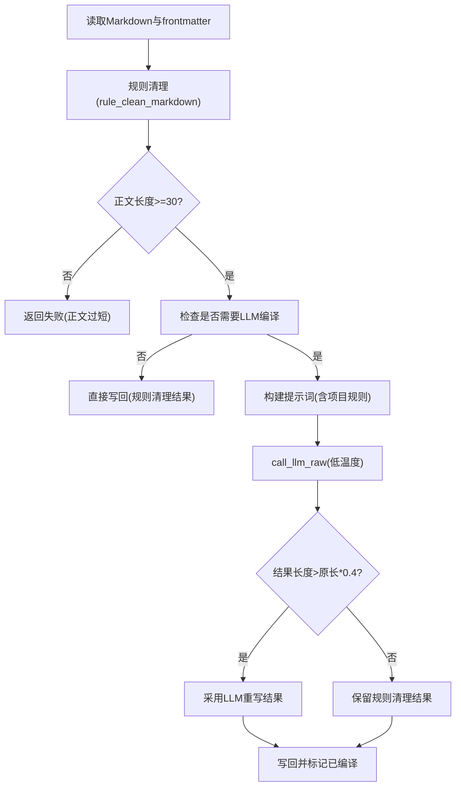
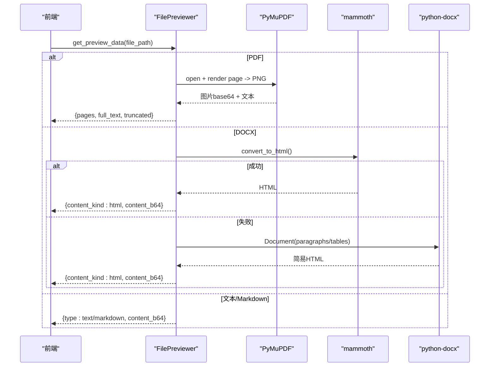
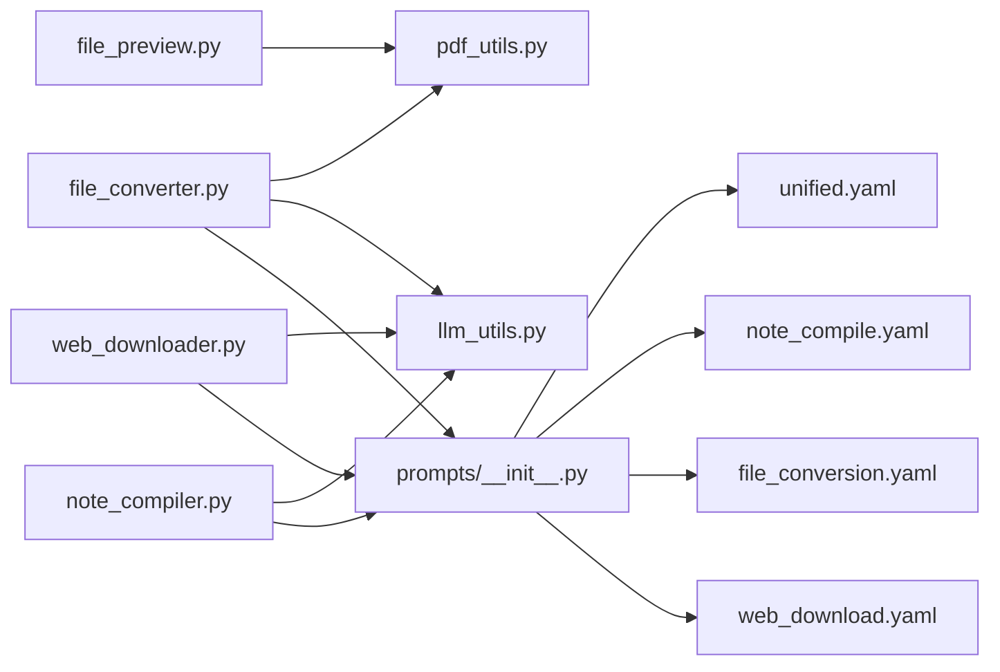

# 内容处理引擎

<cite>
**本文引用的文件**
- [modules/file_converter.py](file://modules/file_converter.py)
- [modules/web_downloader.py](file://modules/web_downloader.py)
- [modules/file_preview.py](file://modules/file_preview.py)
- [utils/note_compiler.py](file://utils/note_compiler.py)
- [utils/pdf_utils.py](file://utils/pdf_utils.py)
- [utils/llm_utils.py](file://utils/llm_utils.py)
- [prompts/__init__.py](file://prompts/__init__.py)
- [prompts/yaml/unified.yaml](file://prompts/yaml/unified.yaml)
- [prompts/yaml/note_compile.yaml](file://prompts/yaml/note_compile.yaml)
- [prompts/yaml/file_conversion.yaml](file://prompts/yaml/file_conversion.yaml)
- [prompts/yaml/web_download.yaml](file://prompts/yaml/web_download.yaml)
- [config/settings.py](file://config/settings.py)
</cite>

## 目录
1. [简介](#简介)
2. [项目结构](#项目结构)
3. [核心组件](#核心组件)
4. [架构总览](#架构总览)
5. [详细组件分析](#详细组件分析)
6. [依赖关系分析](#依赖关系分析)
7. [性能与质量评估](#性能与质量评估)
8. [故障排查指南](#故障排查指南)
9. [结论](#结论)
10. [附录：配置与示例](#附录配置与示例)

## 简介
本技术文档面向“内容处理引擎”，聚焦多格式文件转换、网页抓取与清洗、笔记编译（去噪、统一语气、提取核心）、预览生成等关键能力。系统以模块化设计实现，支持 PDF、DOCX、PPTX、HTML、TXT 等格式的解析与 Markdown 转换；在必要时通过 LLM 进行内容重写与结构化整理；并提供 PDF 分页渲染与 DOCX 排版预览能力。

## 项目结构
- 模块层
  - modules/file_converter.py：多格式到 Markdown 的转换器与管理器
  - modules/web_downloader.py：网页下载与内容提取
  - modules/file_preview.py：文件预览（Markdown/文本/PDF/Word）
- 工具层
  - utils/note_compiler.py：规则清理 + LLM 编译
  - utils/pdf_utils.py：PDF 文本提取
  - utils/llm_utils.py：LLM 调用封装（重试、限流、超时控制）
- 提示词层
  - prompts/__init__.py：提示词加载入口（YAML 优先）
  - prompts/yaml/*.yaml：具体提示词模板
- 配置层
  - config/settings.py：工作区与常量导出

图表来源
- [modules/file_converter.py:1-120](file://modules/file_converter.py#L1-L120)
- [modules/web_downloader.py:1-120](file://modules/web_downloader.py#L1-L120)
- [modules/file_preview.py:1-120](file://modules/file_preview.py#L1-L120)
- [utils/note_compiler.py:1-120](file://utils/note_compiler.py#L1-L120)
- [utils/pdf_utils.py:1-40](file://utils/pdf_utils.py#L1-L40)
- [utils/llm_utils.py:1-120](file://utils/llm_utils.py#L1-L120)
- [prompts/__init__.py:1-80](file://prompts/__init__.py#L1-L80)
- [prompts/yaml/unified.yaml:1-76](file://prompts/yaml/unified.yaml#L1-L76)
- [prompts/yaml/note_compile.yaml:1-21](file://prompts/yaml/note_compile.yaml#L1-L21)
- [prompts/yaml/file_conversion.yaml:1-105](file://prompts/yaml/file_conversion.yaml#L1-L105)
- [prompts/yaml/web_download.yaml:1-16](file://prompts/yaml/web_download.yaml#L1-L16)
- [config/settings.py:1-41](file://config/settings.py#L1-L41)

章节来源
- [modules/file_converter.py:1-120](file://modules/file_converter.py#L1-L120)
- [modules/web_downloader.py:1-120](file://modules/web_downloader.py#L1-L120)
- [modules/file_preview.py:1-120](file://modules/file_preview.py#L1-L120)
- [utils/note_compiler.py:1-120](file://utils/note_compiler.py#L1-L120)
- [utils/pdf_utils.py:1-40](file://utils/pdf_utils.py#L1-L40)
- [utils/llm_utils.py:1-120](file://utils/llm_utils.py#L1-L120)
- [prompts/__init__.py:1-80](file://prompts/__init__.py#L1-L80)
- [prompts/yaml/unified.yaml:1-76](file://prompts/yaml/unified.yaml#L1-L76)
- [prompts/yaml/note_compile.yaml:1-21](file://prompts/yaml/note_compile.yaml#L1-L21)
- [prompts/yaml/file_conversion.yaml:1-105](file://prompts/yaml/file_conversion.yaml#L1-L105)
- [prompts/yaml/web_download.yaml:1-16](file://prompts/yaml/web_download.yaml#L1-L16)
- [config/settings.py:1-41](file://config/settings.py#L1-L41)

## 核心组件
- 文件转换器（FileConverterManager）
  - 基于模板方法模式，提供 PDF、DOCX、旧版 .doc、PPTX、旧版 .ppt、HTML、TXT 到 Markdown 的统一接口
  - 内置质量评估、重复签名/页眉页脚检测与移除、可选 LLM 重写、自动主题分配、原始文件归档与来源记录
- 网页下载器（WebDownloader）
  - 使用 requests + BeautifulSoup + readability + markdownify 进行页面抓取与正文提取
  - 标题多策略抽取、图片懒加载属性规范化、相对路径转绝对 URL、可选保留图片链接或移除
- 文件预览器（FilePreviewer）
  - 支持 Markdown/文本/PDF/Word 预览
  - PDF 分页渲染（PyMuPDF），限制单页像素与总图大小；DOCX 优先 mammoth HTML 预览，回退 python-docx
- 笔记编译器（note_compiler）
  - 规则级清理（页码、版权、重复行）+ 可选 LLM 编译，保持 frontmatter 不变
- LLM 工具（llm_utils）
  - 统一调用入口，指数退避重试、并发信号量、超时控制、错误分类与网络错误识别

章节来源
- [modules/file_converter.py:27-120](file://modules/file_converter.py#L27-L120)
- [modules/web_downloader.py:29-120](file://modules/web_downloader.py#L29-L120)
- [modules/file_preview.py:9-120](file://modules/file_preview.py#L9-L120)
- [utils/note_compiler.py:43-120](file://utils/note_compiler.py#L43-L120)
- [utils/llm_utils.py:150-230](file://utils/llm_utils.py#L150-L230)

## 架构总览
整体流程分为“采集 → 转换 → 编译 → 预览”四个阶段：
- 采集：本地文件由 FileConverterManager 解析；网页由 WebDownloader 抓取并转为 Markdown
- 转换：各格式专用转换器输出 Markdown，并进行基础后处理（清理、去图、签名检测）
- 编译：对来自 PDF/Word 等源文件的笔记执行规则清理与可选 LLM 重写，提升可读性与一致性
- 预览：根据文件类型选择合适渲染方式（PDF 分页图像、DOCX HTML 排版）

图表来源
- [modules/file_converter.py:569-730](file://modules/file_converter.py#L569-L730)
- [modules/web_downloader.py:356-425](file://modules/web_downloader.py#L356-L425)
- [utils/note_compiler.py:128-210](file://utils/note_compiler.py#L128-L210)
- [modules/file_preview.py:19-120](file://modules/file_preview.py#L19-L120)

## 详细组件分析

### 文件转换器（多格式到 Markdown）
- 设计模式
  - BaseConverter 定义模板方法 to_markdown，子类仅实现 _extract_text
  - FileConverterManager 负责扩展名路由、质量评估、LLM 重写、frontmatter 写入、主题分配、原始文件归档与来源更新
- 支持的格式
  - PDF(.pdf)、DOCX(.docx)、旧版 Word(.doc)、PPTX(.pptx)、旧版 PPT(.ppt)、HTML(.html/.htm)、TXT(.txt)
- 关键特性
  - PDF 签名/页眉页脚检测：跨页重复行识别与移除
  - 质量评估：统计非空白字符、替换符、控制符比例，识别扫描型 PDF
  - LLM 重写：当内容结构不完整或过短时触发，使用 GENERAL_CONTENT_TO_MARKDOWN_PROMPT
  - 输出：带 YAML frontmatter 的 Markdown，含 source、source_sha256、tags 等字段
  - 幂等：基于 source_digest 与 conversion_state 避免重复转换

图表来源
- [modules/file_converter.py:27-120](file://modules/file_converter.py#L27-L120)
- [modules/file_converter.py:72-158](file://modules/file_converter.py#L72-L158)
- [modules/file_converter.py:168-287](file://modules/file_converter.py#L168-L287)
- [modules/file_converter.py:289-388](file://modules/file_converter.py#L289-L388)
- [modules/file_converter.py:390-405](file://modules/file_converter.py#L390-L405)
- [modules/file_converter.py:407-508](file://modules/file_converter.py#L407-L508)
- [modules/file_converter.py:509-534](file://modules/file_converter.py#L509-L534)
- [modules/file_converter.py:569-730](file://modules/file_converter.py#L569-L730)

章节来源
- [modules/file_converter.py:27-120](file://modules/file_converter.py#L27-L120)
- [modules/file_converter.py:72-158](file://modules/file_converter.py#L72-L158)
- [modules/file_converter.py:168-287](file://modules/file_converter.py#L168-L287)
- [modules/file_converter.py:289-388](file://modules/file_converter.py#L289-L388)
- [modules/file_converter.py:390-405](file://modules/file_converter.py#L390-L405)
- [modules/file_converter.py:407-508](file://modules/file_converter.py#L407-L508)
- [modules/file_converter.py:509-534](file://modules/file_converter.py#L509-L534)
- [modules/file_converter.py:569-730](file://modules/file_converter.py#L569-L730)

### 网页下载器（反爬、内容提取、格式优化）
- 反爬虫策略
  - 设置标准浏览器 User-Agent
  - 请求失败指数退避重试（装饰器 retry_on_failure）
  - 合理延时与重定向允许
- 内容提取算法
  - 标题多策略：OpenGraph/Twitter meta、平台特定元信息、h1/h2/h3、文章容器(article/main)、通用类名、URL 片段兜底
  - 正文提取：readability.Document.summary 获取主体 HTML，再经 markdownify 转换为 Markdown
  - 图片处理：预处理 HTML img 标签，解析 data-src/data-original/srcset 等懒加载属性，统一为绝对 URL；最终可选择保留或移除图片
- 格式优化
  - clean_text 清理不可见字符与多余空白
  - 若缺失标题则自动添加一级标题
  - 批量下载时保存原始 HTML 至 Raw 目录，便于回溯

图表来源
- [modules/web_downloader.py:29-120](file://modules/web_downloader.py#L29-L120)
- [modules/web_downloader.py:356-425](file://modules/web_downloader.py#L356-L425)
- [modules/web_downloader.py:427-439](file://modules/web_downloader.py#L427-L439)
- [modules/web_downloader.py:441-444](file://modules/web_downloader.py#L441-L444)
- [modules/web_downloader.py:446-533](file://modules/web_downloader.py#L446-L533)

章节来源
- [modules/web_downloader.py:29-120](file://modules/web_downloader.py#L29-L120)
- [modules/web_downloader.py:356-425](file://modules/web_downloader.py#L356-L425)
- [modules/web_downloader.py:427-439](file://modules/web_downloader.py#L427-L439)
- [modules/web_downloader.py:441-444](file://modules/web_downloader.py#L441-L444)
- [modules/web_downloader.py:446-533](file://modules/web_downloader.py#L446-L533)

### 笔记编译（规则清理 + LLM 统一语气）
- 规则清理
  - 去除页码、版权声明、重复分隔线
  - 过滤高频短行（典型运行页眉/页脚）
  - 合并多余空行
- LLM 编译
  - 仅在满足条件时触发（长度阈值、API 可用）
  - 注入工作区补充规则（project_rules.md/GUIDE.md）
  - 使用 INGEST_NOTE_COMPILE_PROMPT 进行去噪、客观化、完整性补全、结构组织
- 状态管理
  - 基于 mtime 与 file_needs_compile 判断是否需要重新编译
  - 写回时保留 frontmatter

图表来源
- [utils/note_compiler.py:43-80](file://utils/note_compiler.py#L43-L80)
- [utils/note_compiler.py:128-210](file://utils/note_compiler.py#L128-L210)
- [prompts/yaml/note_compile.yaml:1-21](file://prompts/yaml/note_compile.yaml#L1-L21)

章节来源
- [utils/note_compiler.py:43-80](file://utils/note_compiler.py#L43-L80)
- [utils/note_compiler.py:128-210](file://utils/note_compiler.py#L128-L210)
- [prompts/yaml/note_compile.yaml:1-21](file://prompts/yaml/note_compile.yaml#L1-L21)

### 预览生成系统（PDF 分页渲染、DOCX 排版预览）
- PDF 预览
  - 使用 PyMuPDF 逐页渲染为 PNG，限制单页最大像素与总图片大小，防止内存溢出
  - 同时提取每页文本，返回 full_text 与 pages 列表
  - 回退路径：无法使用 PyMuPDF 时退回纯文本分页
- DOCX 预览
  - 优先使用 mammoth 将 DOCX 转为 HTML，供前端排版预览
  - 回退方案：python-docx 遍历段落与表格，生成最小可用 HTML
- 传输编码
  - 统一使用 base64_utf8 语义传输，确保 JSON-RPC 安全

图表来源
- [modules/file_preview.py:79-169](file://modules/file_preview.py#L79-L169)
- [modules/file_preview.py:171-242](file://modules/file_preview.py#L171-L242)
- [modules/file_preview.py:244-264](file://modules/file_preview.py#L244-L264)
- [utils/pdf_utils.py:1-40](file://utils/pdf_utils.py#L1-L40)

章节来源
- [modules/file_preview.py:79-169](file://modules/file_preview.py#L79-L169)
- [modules/file_preview.py:171-242](file://modules/file_preview.py#L171-L242)
- [modules/file_preview.py:244-264](file://modules/file_preview.py#L244-L264)
- [utils/pdf_utils.py:1-40](file://utils/pdf_utils.py#L1-L40)

## 依赖关系分析
- 内部依赖
  - 转换器依赖 pdf_utils（PDF 文本/分页）、helpers（文本清理、文件名处理）、tag_extractor（frontmatter 与标签）
  - 网页下载器依赖 helpers、tag_extractor、requests、BeautifulSoup、readability、markdownify
  - 预览器依赖 pdf_utils、mammoth/python-docx
  - 编译器依赖 llm_utils、sidecar.textutils、sidecar.compile_state
  - 所有 LLM 相关逻辑通过 llm_utils 统一封装
- 外部依赖
  - PyMuPDF(fitz)、mammoth、python-pptx、olefile、html2text、readability、markdownify、requests、BeautifulSoup、langchain_openai、tiktoken

图表来源
- [modules/file_converter.py:1-120](file://modules/file_converter.py#L1-L120)
- [modules/web_downloader.py:1-120](file://modules/web_downloader.py#L1-L120)
- [modules/file_preview.py:1-120](file://modules/file_preview.py#L1-L120)
- [utils/note_compiler.py:1-120](file://utils/note_compiler.py#L1-L120)
- [utils/pdf_utils.py:1-40](file://utils/pdf_utils.py#L1-L40)
- [utils/llm_utils.py:1-120](file://utils/llm_utils.py#L1-L120)
- [prompts/__init__.py:1-80](file://prompts/__init__.py#L1-L80)
- [prompts/yaml/unified.yaml:1-76](file://prompts/yaml/unified.yaml#L1-L76)
- [prompts/yaml/note_compile.yaml:1-21](file://prompts/yaml/note_compile.yaml#L1-L21)
- [prompts/yaml/file_conversion.yaml:1-105](file://prompts/yaml/file_conversion.yaml#L1-L105)
- [prompts/yaml/web_download.yaml:1-16](file://prompts/yaml/web_download.yaml#L1-L16)

章节来源
- [modules/file_converter.py:1-120](file://modules/file_converter.py#L1-L120)
- [modules/web_downloader.py:1-120](file://modules/web_downloader.py#L1-L120)
- [modules/file_preview.py:1-120](file://modules/file_preview.py#L1-L120)
- [utils/note_compiler.py:1-120](file://utils/note_compiler.py#L1-L120)
- [utils/pdf_utils.py:1-40](file://utils/pdf_utils.py#L1-L40)
- [utils/llm_utils.py:1-120](file://utils/llm_utils.py#L1-L120)
- [prompts/__init__.py:1-80](file://prompts/__init__.py#L1-L80)
- [prompts/yaml/unified.yaml:1-76](file://prompts/yaml/unified.yaml#L1-L76)
- [prompts/yaml/note_compile.yaml:1-21](file://prompts/yaml/note_compile.yaml#L1-L21)
- [prompts/yaml/file_conversion.yaml:1-105](file://prompts/yaml/file_conversion.yaml#L1-L105)
- [prompts/yaml/web_download.yaml:1-16](file://prompts/yaml/web_download.yaml#L1-L16)

## 性能与质量评估
- 性能要点
  - LLM 并发控制：全局信号量限制并发数，线程池执行，超时保护
  - 指数退避重试：针对网络抖动与限流场景
  - PDF 渲染限制：单页像素上限与总图片大小上限，避免 OOM
  - 增量编译：基于 mtime 与状态文件避免重复工作
- 质量评估
  - 转换质量：统计非空白字符、替换符、控制符比例，识别扫描 PDF
  - 内容长度阈值：过短内容拒绝或触发 LLM 重写
  - 编译质量：规则清理后再交由 LLM 统一语气与结构，保证可长期查阅性

章节来源
- [utils/llm_utils.py:56-83](file://utils/llm_utils.py#L56-L83)
- [utils/llm_utils.py:197-229](file://utils/llm_utils.py#L197-L229)
- [modules/file_preview.py:88-148](file://modules/file_preview.py#L88-L148)
- [modules/file_converter.py:509-534](file://modules/file_converter.py#L509-L534)
- [utils/note_compiler.py:128-210](file://utils/note_compiler.py#L128-L210)

## 故障排查指南
- LLM 调用失败
  - 检查 API Key/Base/模型名称配置
  - 查看错误分类信息（认证、配额、DNS、SSL、代理、上下文长度等）
  - 关注重试次数与超时日志
- 网页下载失败
  - 确认 URL 合法性与网络连通性
  - 观察重试与延时策略是否生效
  - 检查目标站点是否启用严格反爬
- PDF 预览失败
  - 确认 PyMuPDF 可用；否则回退到文本分页
  - 检查超大页面是否被缩放或截断
- DOCX 预览失败
  - 确认 mammoth 可用；否则回退 python-docx
  - 检查文档是否包含复杂样式导致解析异常
- 转换质量不达标
  - 查看质量评估报告（issues 列表）
  - 考虑开启 LLM 重写或调整输入源

章节来源
- [utils/llm_utils.py:298-364](file://utils/llm_utils.py#L298-L364)
- [modules/web_downloader.py:418-425](file://modules/web_downloader.py#L418-L425)
- [modules/file_preview.py:143-169](file://modules/file_preview.py#L143-L169)
- [modules/file_preview.py:198-242](file://modules/file_preview.py#L198-L242)
- [modules/file_converter.py:509-534](file://modules/file_converter.py#L509-L534)

## 结论
本内容处理引擎以模块化与可扩展为核心，实现了从多格式文件与网页到高质量 Markdown 的端到端流水线。通过规则清理与 LLM 协同，显著提升内容的可读性与一致性；预览子系统兼顾性能与兼容性，保障用户体验。建议在生产环境中结合工作区规则与提示词模板持续优化，以获得更稳定的转换与编译效果。

## 附录：配置与示例
- 配置项（与工作区相关）
  - workspace_path：工作区根路径（用于 Notes/Raw 等目录定位）
  - timeout：HTTP 请求超时时间
  - api_key/api_base/model_name/max_tokens/max_context_tokens：LLM 相关配置
- 转换示例（概念流程）
  - 本地文件：调用 convert_file(file_path, output_path, assign_topic=True, raw_path=...)
  - 网页：调用 download_article(url)，随后保存 Markdown 与 Frontmatter
- 质量评估示例（概念流程）
  - 调用 assess_conversion_quality(content, ext)，根据 issues 决定是否继续或回退
- 编译示例（概念流程）
  - 调用 compile_note_file(file_path, use_llm=True, force=False)
- 预览示例（概念流程）
  - 调用 get_preview_data(file_path)，根据 type 渲染 PDF 分页或 DOCX HTML

章节来源
- [config/settings.py:1-41](file://config/settings.py#L1-L41)
- [modules/file_converter.py:569-730](file://modules/file_converter.py#L569-L730)
- [modules/web_downloader.py:356-425](file://modules/web_downloader.py#L356-L425)
- [utils/note_compiler.py:128-210](file://utils/note_compiler.py#L128-L210)
- [modules/file_preview.py:19-120](file://modules/file_preview.py#L19-L120)