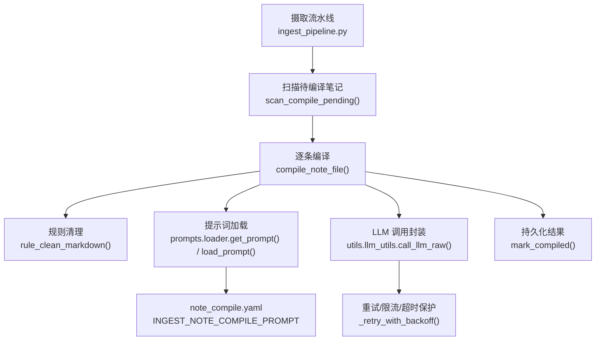
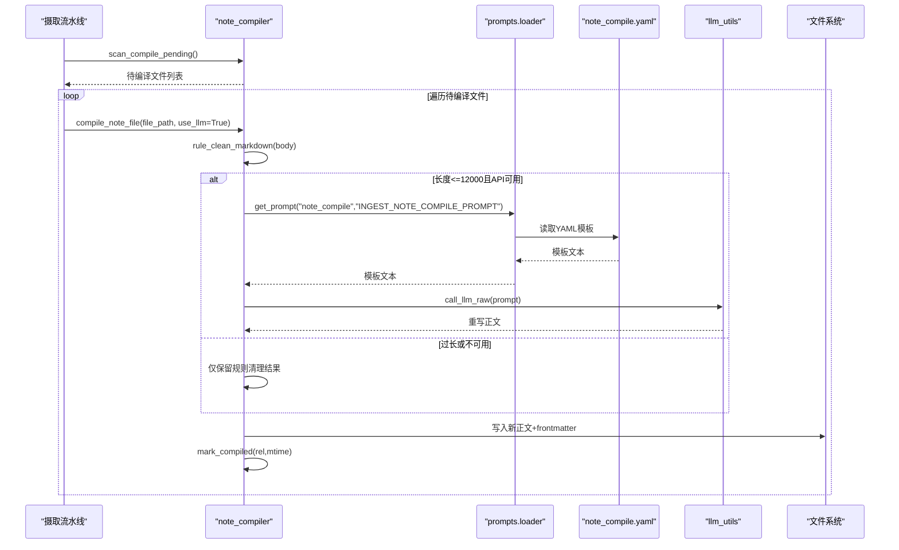
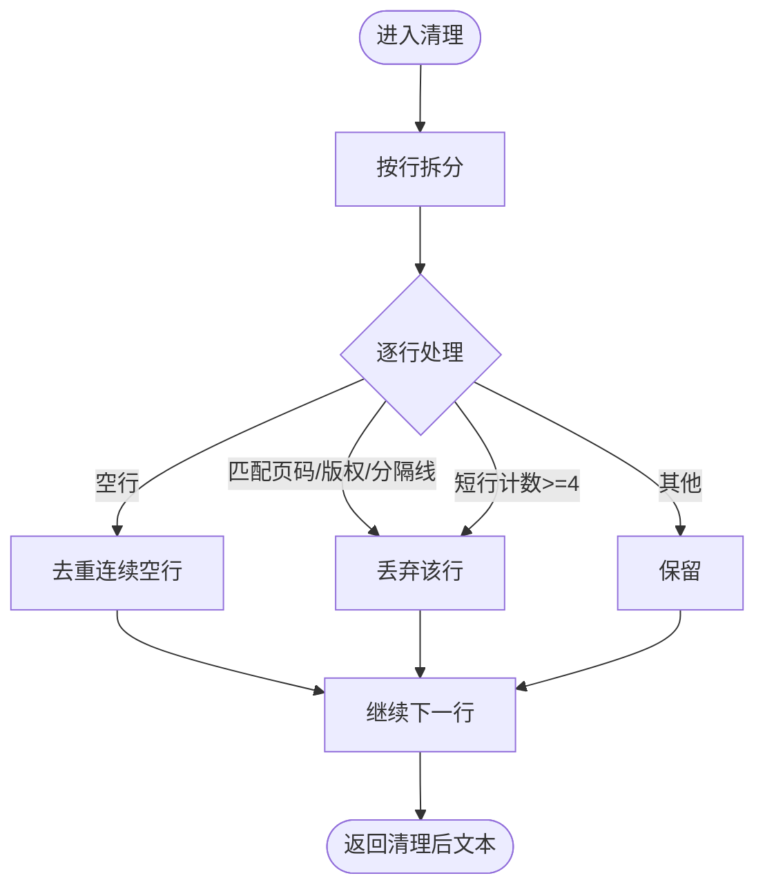
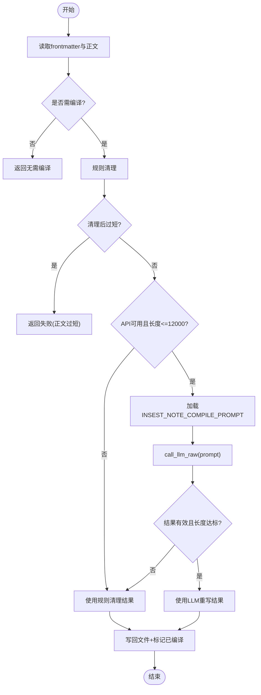
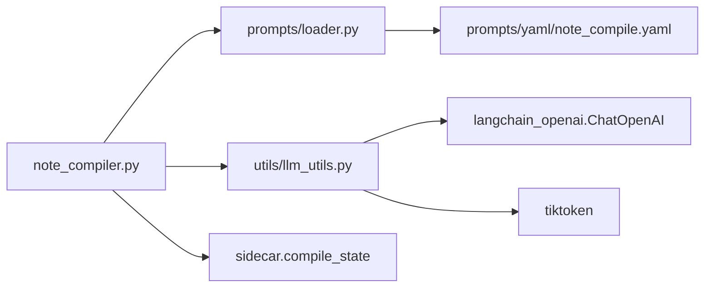
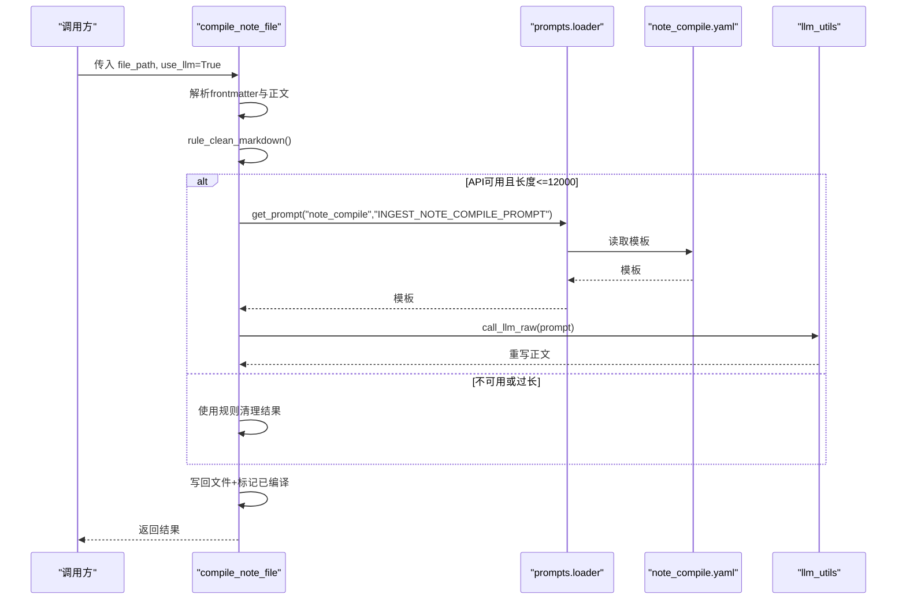

# 内容编译器

<cite>
**本文引用的文件**
- [utils/note_compiler.py](file://utils/note_compiler.py)
- [prompts/loader.py](file://prompts/loader.py)
- [prompts/__init__.py](file://prompts/__init__.py)
- [prompts/yaml/note_compile.yaml](file://prompts/yaml/note_compile.yaml)
- [prompts/unified.py](file://prompts/unified.py)
- [prompts/yaml/unified.yaml](file://prompts/yaml/unified.yaml)
- [prompts/cascade.py](file://prompts/cascade.py)
- [prompts/yaml/cascade.yaml](file://prompts/yaml/cascade.yaml)
- [prompts/abstract.py](file://prompts/abstract.py)
- [prompts/yaml/abstract.yaml](file://prompts/yaml/abstract.yaml)
- [utils/llm_utils.py](file://utils/llm_utils.py)
- [python/sidecar/ingest_pipeline.py](file://python/sidecar/ingest_pipeline.py)
- [tests/unit/test_note_compile.py](file://tests/unit/test_note_compile.py)
</cite>

## 目录
1. [简介](#简介)
2. [项目结构](#项目结构)
3. [核心组件](#核心组件)
4. [架构总览](#架构总览)
5. [详细组件分析](#详细组件分析)
6. [依赖关系分析](#依赖关系分析)
7. [性能与容量控制](#性能与容量控制)
8. [提示词工程与策略配置](#提示词工程与策略配置)
9. [质量评估与效果对比](#质量评估与效果对比)
10. [参数调优指南](#参数调优指南)
11. [故障排查](#故障排查)
12. [结论](#结论)
13. [附录：关键流程时序图](#附录关键流程时序图)

## 简介
本技术文档聚焦“内容编译器”模块，系统性阐述 LLM 如何去除页眉页脚、统一语气、提取核心内容的编译流程；并深入说明提示词工程实现（包括 abstract.yaml、cascade.yaml、unified.yaml 等策略）以及内容质量评估、上下文理解与语义重组的技术路径。文档同时提供编译效果对比方法、参数调优指南与最佳实践，帮助读者在生产环境中稳定高效地使用该能力。

## 项目结构
内容编译器由“规则清理 + LLM 重写 + 提示词模板加载 + 调用封装”四部分组成，并与摄取流水线集成，形成从原始文档到高质量笔记的端到端处理链路。

图示来源
- [python/sidecar/ingest_pipeline.py](file://python/sidecar/ingest_pipeline.py)
- [utils/note_compiler.py](file://utils/note_compiler.py)
- [prompts/loader.py](file://prompts/loader.py)
- [prompts/yaml/note_compile.yaml](file://prompts/yaml/note_compile.yaml)
- [utils/llm_utils.py](file://utils/llm_utils.py)

章节来源
- [utils/note_compiler.py:105-126](file://utils/note_compiler.py#L105-L126)
- [utils/note_compiler.py:128-210](file://utils/note_compiler.py#L128-L210)
- [prompts/loader.py:34-46](file://prompts/loader.py#L34-L46)
- [prompts/loader.py:49-89](file://prompts/loader.py#L49-L89)
- [prompts/__init__.py:24](file://prompts/__init__.py#L24)
- [prompts/yaml/note_compile.yaml:1-21](file://prompts/yaml/note_compile.yaml#L1-L21)
- [utils/llm_utils.py:197-229](file://utils/llm_utils.py#L197-L229)
- [utils/llm_utils.py:56-82](file://utils/llm_utils.py#L56-L82)

## 核心组件
- 规则清理器：基于正则与重复行检测，快速剔除页码、版权、分隔线、运行头尾等噪声，保障后续 LLM 输入更干净。
- 编译调度器：根据 frontmatter 的 source 字段判断是否需要编译，结合增量状态避免重复工作。
- LLM 重写器：在长度阈值内调用 LLM 进行去噪、客观化、结构化与完整性补全。
- 提示词加载器：优先从 YAML 模板加载，回退至 Python 常量，支持 system/user 模板选择与变量格式化。
- LLM 调用封装：统一的并发控制、指数退避重试、超时保护、错误分类与 API 配置校验。

章节来源
- [utils/note_compiler.py:43-80](file://utils/note_compiler.py#L43-L80)
- [utils/note_compiler.py:90-103](file://utils/note_compiler.py#L90-L103)
- [utils/note_compiler.py:128-210](file://utils/note_compiler.py#L128-L210)
- [prompts/loader.py:34-46](file://prompts/loader.py#L34-L46)
- [prompts/loader.py:49-89](file://prompts/loader.py#L49-L89)
- [utils/llm_utils.py:298-315](file://utils/llm_utils.py#L298-L315)
- [utils/llm_utils.py:56-82](file://utils/llm_utils.py#L56-L82)

## 架构总览
内容编译器在摄取流水线中被触发，对来自 PDF/Word/HTML 等转换后的 Markdown 笔记执行“规则清理 + LLM 重写”，最终输出可直接查阅的高质量笔记。

图示来源
- [python/sidecar/ingest_pipeline.py](file://python/sidecar/ingest_pipeline.py)
- [utils/note_compiler.py:128-210](file://utils/note_compiler.py#L128-L210)
- [prompts/loader.py:34-46](file://prompts/loader.py#L34-L46)
- [prompts/yaml/note_compile.yaml:1-21](file://prompts/yaml/note_compile.yaml#L1-L21)
- [utils/llm_utils.py:197-229](file://utils/llm_utils.py#L197-L229)

## 详细组件分析

### 规则清理器（rule_clean_markdown）
- 功能要点
  - 删除页码行（如“第 X 页”、“Page X of Y”）、版权声明行、重复分隔线。
  - 统计短行出现频次，过滤高频重复行（典型运行头/尾）。
  - 合并多余空行，保证段落完整。
- 复杂度
  - 时间 O(n)，空间 O(n)，n 为行数。
- 适用场景
  - 作为 LLM 前置清洗，显著降低噪声，提升重写质量与稳定性。

图示来源
- [utils/note_compiler.py:43-80](file://utils/note_compiler.py#L43-L80)

章节来源
- [utils/note_compiler.py:43-80](file://utils/note_compiler.py#L43-L80)

### 编译调度器（should_compile_file / scan_compile_pending / compile_notes_batch）
- 决策逻辑
  - 若 frontmatter 中 source 后缀属于 .pdf/.doc/.docx/.ppt/.pptx/.html/.htm/.txt，则标记需要编译。
  - 通过增量状态（mtime + 标记）避免重复编译。
- 批量处理
  - 支持进度回调，异常隔离，统计变更数量。

章节来源
- [utils/note_compiler.py:90-103](file://utils/note_compiler.py#L90-L103)
- [utils/note_compiler.py:105-126](file://utils/note_compiler.py#L105-L126)
- [utils/note_compiler.py:213-238](file://utils/note_compiler.py#L213-L238)

### LLM 重写器（compile_note_file）
- 流程要点
  - 解析 frontmatter 与正文，应用规则清理。
  - 当正文长度不超过阈值且 API 可用时，加载 INGEST_NOTE_COMPILE_PROMPT 并调用 LLM 重写。
  - 重写结果需满足最小长度比例，否则回退到规则清理结果。
  - 写回文件并更新编译标记。
- 容错策略
  - API 未配置/失败：记录警告，保留规则清理结果。
  - 超长文档：跳过整篇重写，避免截断导致信息丢失。

图示来源
- [utils/note_compiler.py:128-210](file://utils/note_compiler.py#L128-L210)
- [prompts/__init__.py:24](file://prompts/__init__.py#L24)
- [prompts/yaml/note_compile.yaml:1-21](file://prompts/yaml/note_compile.yaml#L1-L21)
- [utils/llm_utils.py:197-229](file://utils/llm_utils.py#L197-L229)

章节来源
- [utils/note_compiler.py:128-210](file://utils/note_compiler.py#L128-L210)

### 提示词加载器（prompts.loader）
- 优先级
  - 优先从 prompts/yaml/{name}.yaml 加载键值模板；不存在则回退到 prompts/{name}.py 中的常量。
- 模板选择
  - 支持 system/user 模板选择与 kwargs 格式化。
- 缓存
  - 对 YAML 模块级字典进行缓存，减少 IO 开销。

章节来源
- [prompts/loader.py:34-46](file://prompts/loader.py#L34-L46)
- [prompts/loader.py:49-89](file://prompts/loader.py#L49-L89)

### LLM 调用封装（utils.llm_utils）
- 并发与限流
  - 全局信号量限制并发数，线程池执行，避免阻塞。
- 重试与超时
  - 指数退避重试，区分可重试错误类型；调用带超时保护。
- 配置校验
  - 检查 API Key/Base/模型名有效性，给出明确错误信息。
- 内容压缩
  - 当提示过长时，自动摘要/压缩/截断，确保不超出上下文预算。

章节来源
- [utils/llm_utils.py:56-82](file://utils/llm_utils.py#L56-L82)
- [utils/llm_utils.py:197-229](file://utils/llm_utils.py#L197-L229)
- [utils/llm_utils.py:298-315](file://utils/llm_utils.py#L298-L315)
- [utils/llm_utils.py:506-542](file://utils/llm_utils.py#L506-L542)

## 依赖关系分析
- 模块耦合
  - note_compiler 依赖 prompts.loader 获取模板，依赖 llm_utils 进行 LLM 调用，依赖 sidecar.compile_state 管理增量状态。
- 外部依赖
  - LangChain OpenAI 客户端、tiktoken（估算 token）、PyYAML（模板解析）。
- 潜在循环
  - 当前无直接循环依赖；注意在扩展时避免引入跨层反向引用。

图示来源
- [utils/note_compiler.py:128-210](file://utils/note_compiler.py#L128-L210)
- [prompts/loader.py:34-46](file://prompts/loader.py#L34-L46)
- [utils/llm_utils.py:143-165](file://utils/llm_utils.py#L143-L165)
- [utils/llm_utils.py:453-461](file://utils/llm_utils.py#L453-L461)

章节来源
- [utils/note_compiler.py:128-210](file://utils/note_compiler.py#L128-L210)
- [prompts/loader.py:34-46](file://prompts/loader.py#L34-L46)
- [utils/llm_utils.py:143-165](file://utils/llm_utils.py#L143-L165)
- [utils/llm_utils.py:453-461](file://utils/llm_utils.py#L453-L461)

## 性能与容量控制
- 并发上限
  - 默认并发 4，可通过信号量与线程池调整。
- 超时保护
  - 非流式调用 90 秒，流式 120 秒，防止长时间挂起。
- 上下文预算
  - 自动估算 token，必要时摘要/压缩/截断，确保不超限。
- 长文优化
  - 超过阈值（例如 12000 字符）的整篇重写被跳过，避免截断导致信息丢失。

章节来源
- [utils/llm_utils.py:56-82](file://utils/llm_utils.py#L56-L82)
- [utils/llm_utils.py:197-229](file://utils/llm_utils.py#L197-L229)
- [utils/llm_utils.py:506-542](file://utils/llm_utils.py#L506-L542)
- [utils/note_compiler.py:165-194](file://utils/note_compiler.py#L165-L194)

## 提示词工程与策略配置

### 笔记编译策略（note_compile.yaml）
- 目标
  - 去噪（页眉页脚、水印、目录重复）、客观化、完整性补全、结构组织、精简冗余、语言一致、只输出正文。
- 工作区补充规则
  - 动态注入项目规则，增强领域一致性。
- 使用方式
  - 通过 prompts/__init__.py 暴露 INGEST_NOTE_COMPILE_PROMPT，供编译器加载。

章节来源
- [prompts/yaml/note_compile.yaml:1-21](file://prompts/yaml/note_compile.yaml#L1-L21)
- [prompts/__init__.py:24](file://prompts/__init__.py#L24)

### 统一内容处理策略（unified.yaml / unified.py）
- 通用转 Markdown（GENERAL_CONTENT_TO_MARKDOWN_PROMPT）
  - 去除导航/广告/页眉页脚/页码，保留标题/段落/列表/表格，图片语法转换，层级结构保持，乱码清理，排版优化，标点规范。
- 清理 Markdown（CLEAN_MARKDOWN_PROMPT）
  - 删除乱码/不可见字符/图片引用，规范化标题层级，修复格式错误，移除 HTML 标签，删除元数据，规范化空白，修复断行，删除重复。
- 排版优化（FORMAT_OPTIMIZATION_PROMPT）
  - 添加标题层级、统一列表、代码块标识、目录、表格对齐、分隔线、中英文空格、标点规范。
- 结构化重排（MARKDOWN_REFORMAT_PROMPT）
  - 语义分析加合理的一二级标题，严格递进，保留原文，规范化列表/代码/表格，删除乱码/重复/多余空行，中英文空格与标点规范。

章节来源
- [prompts/yaml/unified.yaml:1-76](file://prompts/yaml/unified.yaml#L1-L76)
- [prompts/unified.py:1-79](file://prompts/unified.py#L1-L79)

### 主题综述策略（cascade.yaml / cascade.py）
- 新建综述（CASCADE_SURVEY_NEW_PROMPT）
  - 全面性、提炼升华、结构清晰、学术风格、引用标注、篇幅匹配。
- 更新综述（CASCADE_SURVEY_UPDATE_PROMPT）
  - 保留有效内容、有机整合新增/修改、提炼升华、结构一致、风格一致、引用标注。
- 对话洞见整合（SURVEY_CHAT_APPEND_PROMPT）
  - 保留已有综述、整合对话洞见、标注来源、风格一致、直接输出完整正文。

章节来源
- [prompts/yaml/cascade.yaml:1-72](file://prompts/yaml/cascade.yaml#L1-L72)
- [prompts/cascade.py:1-70](file://prompts/cascade.py#L1-L70)

### 摘要与抽象策略（abstract.yaml / abstract.py）
- 摘要生成（ABSTRACT_PROMPT）
  - 200-500 字，包含核心主题概述、关键概念、知识点关联，Markdown 格式，提炼共性主题而非逐篇总结。

章节来源
- [prompts/yaml/abstract.yaml:1-14](file://prompts/yaml/abstract.yaml#L1-L14)
- [prompts/abstract.py:1-14](file://prompts/abstract.py#L1-L14)

## 质量评估与效果对比
- 自动化指标
  - 长度变化率：重写前后字数比，用于衡量精简程度与信息密度。
  - 噪声残留率：页码/版权/分隔线等噪声行占比，评估去噪效果。
  - 结构合规度：标题层级是否严格递进，列表/代码/表格是否规范。
  - 重复度：相邻段落相似度，评估去重效果。
- 人工抽检
  - 随机抽样 5%-10%，对照原始源文件，评估事实准确性、完整性与可读性。
- 回归测试
  - 使用单元测试覆盖关键路径（如长文不被截断替换、规则清理生效、frontmatter 保留）。

章节来源
- [tests/unit/test_note_compile.py:26-48](file://tests/unit/test_note_compile.py#L26-L48)
- [tests/unit/test_note_compile.py:51-67](file://tests/unit/test_note_compile.py#L51-L67)

## 参数调优指南
- 温度与最大令牌
  - 重写任务建议低温度（如 0.2-0.3），提高稳定性；max_tokens 依据模型与预算设置。
- 并发与超时
  - 并发上限建议 4-8，视后端配额与网络状况调整；超时保护避免长时间阻塞。
- 长度阈值
  - 整篇重写阈值（如 12000 字符）可根据模型上下文与成本权衡；过长文档优先规则清理。
- 提示词模板
  - 针对特定领域在工作区注入补充规则，提升术语一致性与风格统一。
- 重试与退避
  - 指数退避适用于限流/网络抖动场景；可根据业务容忍度调整重试次数与延迟。

章节来源
- [utils/llm_utils.py:56-82](file://utils/llm_utils.py#L56-L82)
- [utils/llm_utils.py:197-229](file://utils/llm_utils.py#L197-L229)
- [utils/note_compiler.py:165-194](file://utils/note_compiler.py#L165-L194)

## 故障排查
- API 未配置或无效
  - 现象：LLM 调用被跳过或报错。
  - 处理：检查 API Key/Base/模型名，使用连接测试工具验证。
- 限流/网络错误
  - 现象：429/5xx/超时/连接重置。
  - 处理：启用重试与退避，适当降低并发，检查代理与 DNS。
- 内容过长
  - 现象：整篇重写被跳过或提示被截断。
  - 处理：增大上下文预算或采用分段处理；确认阈值设置合理。
- 重写结果过短或不达标
  - 现象：LLM 返回长度不足或不符合要求。
  - 处理：调整提示词约束与温度，增加示例或补充规则。

章节来源
- [utils/llm_utils.py:298-315](file://utils/llm_utils.py#L298-L315)
- [utils/llm_utils.py:318-364](file://utils/llm_utils.py#L318-L364)
- [utils/note_compiler.py:165-194](file://utils/note_compiler.py#L165-L194)

## 结论
内容编译器以“规则清理 + LLM 重写”为核心，配合灵活的提示词工程与稳健的调用封装，实现了从多源文档到高质量笔记的稳定转化。通过合理的参数调优与质量评估机制，可在不同规模与领域场景中取得一致的编译效果。

## 附录：关键流程时序图

### 单文件编译时序

图示来源
- [utils/note_compiler.py:128-210](file://utils/note_compiler.py#L128-L210)
- [prompts/loader.py:34-46](file://prompts/loader.py#L34-L46)
- [prompts/yaml/note_compile.yaml:1-21](file://prompts/yaml/note_compile.yaml#L1-L21)
- [utils/llm_utils.py:197-229](file://utils/llm_utils.py#L197-L229)