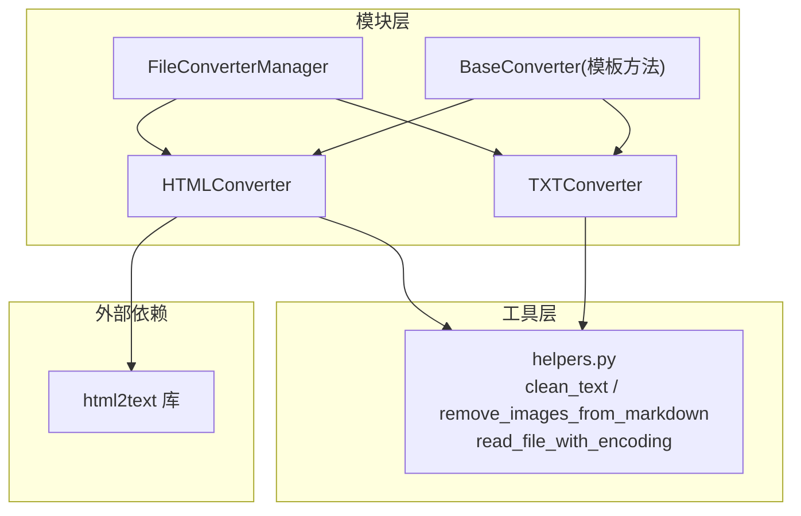
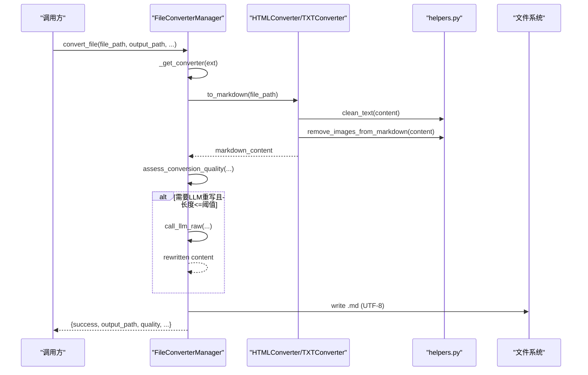
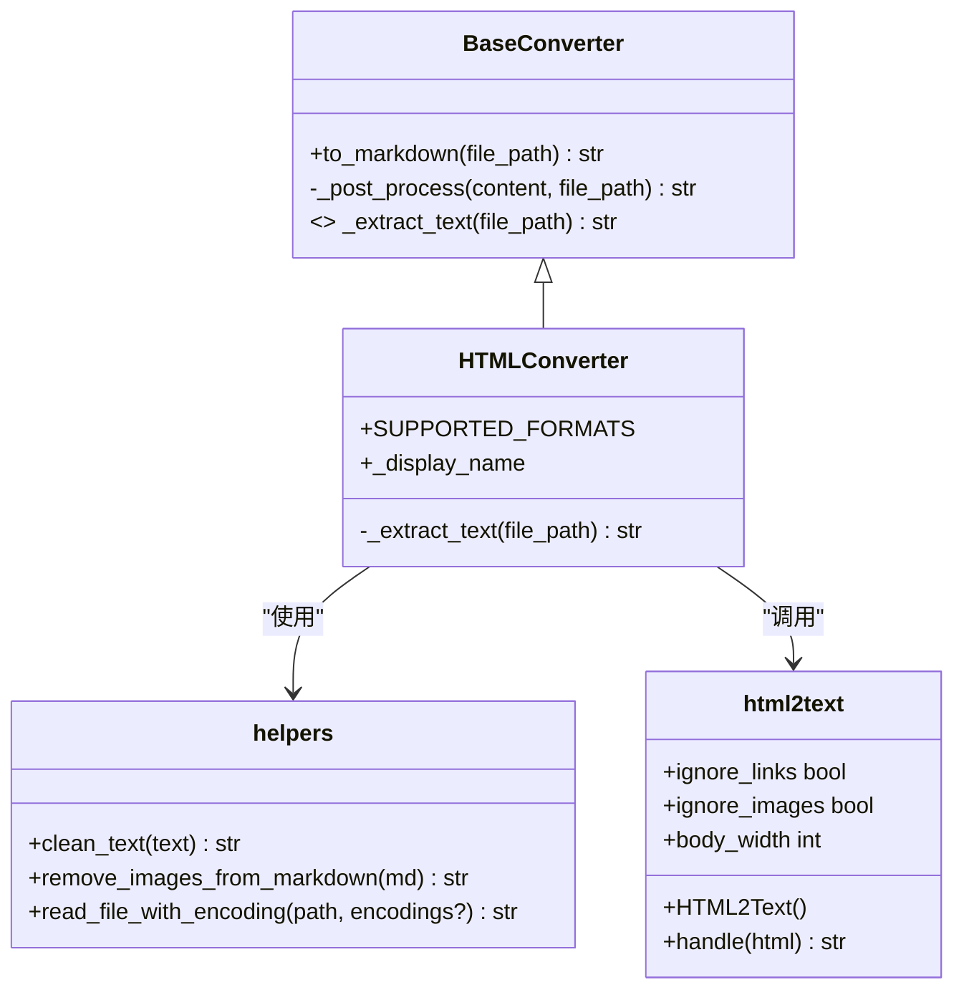
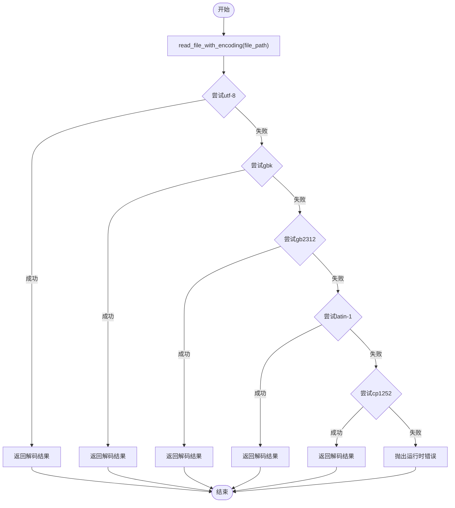
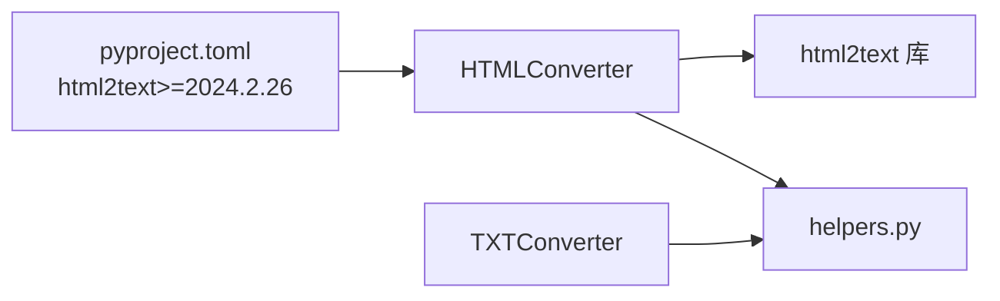

# HTML和TXT转换器

<cite>
**本文引用的文件**   
- [modules/file_converter.py](file://modules/file_converter.py)
- [utils/helpers.py](file://utils/helpers.py)
- [pyproject.toml](file://pyproject.toml)
- [tests/unit/test_file_converter.py](file://tests/unit/test_file_converter.py)
</cite>

## 目录
1. [简介](#简介)
2. [项目结构](#项目结构)
3. [核心组件](#核心组件)
4. [架构总览](#架构总览)
5. [详细组件分析](#详细组件分析)
6. [依赖关系分析](#依赖关系分析)
7. [性能与兼容性考量](#性能与兼容性考量)
8. [故障排查指南](#故障排查指南)
9. [结论](#结论)

## 简介
本技术文档聚焦于HTML与TXT两种格式到Markdown的转换实现，重点覆盖：
- HTMLConverter 基于 html2text 库的配置项与渲染策略
- TXTConverter 的自动编码探测机制与文本读取逻辑
- 链接与图片的处理策略（如 ignore_links、ignore_images）
- 字符编码自动检测与错误处理
- HTML结构保留与TXT编码兼容的最佳实践

## 项目结构
与HTML/TXT转换相关的代码主要位于模块层与工具层：
- 模块层：定义各类转换器（含HTMLConverter、TXTConverter）及统一的管理器 FileConverterManager
- 工具层：提供通用能力，包括文本清理、图片移除、编码探测读取等
- 测试层：对转换流程、并发安全、质量评估等进行验证

图表来源
- [modules/file_converter.py:26-70](file://modules/file_converter.py#L26-L70)
- [modules/file_converter.py:390-405](file://modules/file_converter.py#L390-L405)
- [modules/file_converter.py:160-166](file://modules/file_converter.py#L160-L166)
- [utils/helpers.py:26-48](file://utils/helpers.py#L26-L48)
- [utils/helpers.py:292-304](file://utils/helpers.py#L292-L304)

章节来源
- [modules/file_converter.py:26-70](file://modules/file_converter.py#L26-L70)
- [modules/file_converter.py:390-405](file://modules/file_converter.py#L390-L405)
- [modules/file_converter.py:160-166](file://modules/file_converter.py#L160-L166)
- [utils/helpers.py:26-48](file://utils/helpers.py#L26-L48)
- [utils/helpers.py:292-304](file://utils/helpers.py#L292-L304)

## 核心组件
- BaseConverter：定义统一的 to_markdown 模板方法，负责日志记录、异常处理与后处理流程；子类仅实现 _extract_text。
- HTMLConverter：使用 html2text 将HTML转为Markdown，并配置链接/图片保留策略与行宽控制。
- TXTConverter：通过 read_file_with_encoding 自动探测编码读取纯文本内容。
- FileConverterManager：根据扩展名选择具体转换器，执行转换、质量评估、可选LLM重写、添加YAML front matter、保存输出、归档原始文件、主题分配等。

章节来源
- [modules/file_converter.py:26-70](file://modules/file_converter.py#L26-L70)
- [modules/file_converter.py:390-405](file://modules/file_converter.py#L390-L405)
- [modules/file_converter.py:160-166](file://modules/file_converter.py#L160-L166)
- [modules/file_converter.py:407-507](file://modules/file_converter.py#L407-L507)

## 架构总览
下图展示了从入口到具体转换器的调用链，以及关键的后处理步骤。

图表来源
- [modules/file_converter.py:407-507](file://modules/file_converter.py#L407-L507)
- [modules/file_converter.py:569-730](file://modules/file_converter.py#L569-L730)
- [utils/helpers.py:26-48](file://utils/helpers.py#L26-L48)

## 详细组件分析

### HTMLConverter：基于 html2text 的HTML转Markdown
- 渲染策略与配置
  - 链接保留：忽略开关设置为“不忽略”，即默认保留链接。
  - 图片保留：忽略开关设置为“不忽略”，即默认保留图片引用。
  - 行宽控制：body_width 设为 0，表示不进行强制换行，保持原段落宽度。
- 输入读取：通过 read_file_with_encoding 自动探测编码，避免乱码。
- 输出处理：由基类统一进行 clean_text 与 remove_images_from_markdown 后处理。

图表来源
- [modules/file_converter.py:26-70](file://modules/file_converter.py#L26-L70)
- [modules/file_converter.py:390-405](file://modules/file_converter.py#L390-L405)
- [utils/helpers.py:26-48](file://utils/helpers.py#L26-L48)
- [utils/helpers.py:292-304](file://utils/helpers.py#L292-L304)

章节来源
- [modules/file_converter.py:390-405](file://modules/file_converter.py#L390-L405)
- [utils/helpers.py:26-48](file://utils/helpers.py#L26-L48)
- [utils/helpers.py:292-304](file://utils/helpers.py#L292-L304)

#### 链接与图片处理策略
- 当前实现中，HTMLConverter 显式设置 ignore_links=False、ignore_images=False，意味着链接与图片在Markdown中会被保留为相应语法。
- 随后由基类的 _post_process 统一调用 remove_images_from_markdown，会移除Markdown中的图片标记与相关引用，最终输出不包含图片。
- 若需保留图片，可在子类覆盖 _post_process 或调整 remove_images_from_markdown 的使用位置。

章节来源
- [modules/file_converter.py:390-405](file://modules/file_converter.py#L390-L405)
- [modules/file_converter.py:60-64](file://modules/file_converter.py#L60-L64)
- [utils/helpers.py:41-48](file://utils/helpers.py#L41-L48)

#### HTML结构保留建议
- 如需更精细的结构保留（如表格、列表层级），可考虑在 HTMLConverter 中进一步配置 html2text 的其他选项（例如表格处理、链接目标等）。当前实现未显式设置这些选项，采用默认行为。
- 若希望完全自定义渲染策略，可在 _extract_text 中创建独立的 HTML2Text 实例并传入所需参数。

章节来源
- [modules/file_converter.py:390-405](file://modules/file_converter.py#L390-L405)

### TXTConverter：自动编码探测与文本读取
- 编码探测机制
  - 使用 read_file_with_encoding，按顺序尝试多种编码（默认包含 utf-8、gbk、gb2312、latin-1、cp1252），直到成功解码。
  - 若所有编码均失败，抛出运行时错误，提示无法读取。
- 文本读取逻辑
  - 直接返回解码后的字符串，交由基类进行后续清理与图片移除（尽管TXT通常不含图片）。

图表来源
- [utils/helpers.py:292-304](file://utils/helpers.py#L292-L304)

章节来源
- [modules/file_converter.py:160-166](file://modules/file_converter.py#L160-L166)
- [utils/helpers.py:292-304](file://utils/helpers.py#L292-L304)

### 后处理与质量评估
- 文本清理：clean_text 去除不可见字符、多余空白与重复空行。
- 图片移除：remove_images_from_markdown 移除Markdown中的图片语法与关联引用。
- 质量评估：assess_conversion_quality 统计非空白字符、替换字符、控制字符比例，识别疑似扫描PDF等低质量情况。

章节来源
- [utils/helpers.py:26-48](file://utils/helpers.py#L26-L48)
- [modules/file_converter.py:60-64](file://modules/file_converter.py#L60-L64)
- [modules/file_converter.py:509-534](file://modules/file_converter.py#L509-L534)

## 依赖关系分析
- 外部依赖
  - html2text：用于HTML到Markdown的转换，版本要求 >= 2024.2.26。
- 内部依赖
  - utils.helpers：提供编码探测、文本清理、图片移除等基础能力。
  - modules.file_converter：统一管理各格式转换器与转换流程。

图表来源
- [pyproject.toml:28-30](file://pyproject.toml#L28-L30)
- [modules/file_converter.py:390-405](file://modules/file_converter.py#L390-L405)
- [utils/helpers.py:292-304](file://utils/helpers.py#L292-L304)

章节来源
- [pyproject.toml:28-30](file://pyproject.toml#L28-L30)
- [modules/file_converter.py:390-405](file://modules/file_converter.py#L390-L405)
- [utils/helpers.py:292-304](file://utils/helpers.py#L292-L304)

## 性能与兼容性考量
- 编码探测开销
  - read_file_with_encoding 会依次尝试多个编码，遇到大文件或复杂编码时可能带来额外I/O与CPU开销。建议在批量转换前尽量保证源文件编码规范（如UTF-8）。
- HTML渲染性能
  - html2text 的 body_width=0 可减少行内重排，但长段落可能导致输出较长。可根据需求调整以平衡可读性与体积。
- 图片处理
  - 当前实现会在后处理阶段移除图片，避免存储冗余资源；若业务需要保留图片，应调整 _post_process 策略。
- 并发安全
  - 管理器在保存输出时使用互斥写入策略（文件名冲突时追加序号），确保并发场景下不会覆盖已有文件。

章节来源
- [utils/helpers.py:292-304](file://utils/helpers.py#L292-L304)
- [modules/file_converter.py:390-405](file://modules/file_converter.py#L390-L405)
- [modules/file_converter.py:680-691](file://modules/file_converter.py#L680-L691)
- [tests/unit/test_file_converter.py:65-97](file://tests/unit/test_file_converter.py#L65-L97)

## 故障排查指南
- 常见错误
  - 编码读取失败：当所有预设编码均无法解码时会抛出运行时错误。检查源文件是否损坏或使用了非常规编码。
  - 低质量转换：质量评估检测到正文过短或疑似乱码时会拒绝输出。可尝试优化源文件或调整质量阈值。
  - 链接/图片不符合预期：确认 HTMLConverter 的 ignore_links/ignore_images 设置与 _post_process 的图片移除逻辑。
- 定位方法
  - 查看转换日志与质量评估结果，关注 issues 字段与 suspicious_ratio。
  - 对于HTML，检查 html2text 的版本与默认行为是否符合预期。
  - 对于TXT，优先将源文件转换为UTF-8以提升稳定性。

章节来源
- [utils/helpers.py:292-304](file://utils/helpers.py#L292-L304)
- [modules/file_converter.py:509-534](file://modules/file_converter.py#L509-L534)
- [modules/file_converter.py:390-405](file://modules/file_converter.py#L390-L405)
- [tests/unit/test_file_converter.py:135-151](file://tests/unit/test_file_converter.py#L135-L151)

## 结论
- HTMLConverter 通过 html2text 完成HTML到Markdown的转换，默认保留链接与图片，并在后处理阶段移除图片；可通过调整 html2text 配置与 _post_process 策略满足更多场景。
- TXTConverter 借助 read_file_with_encoding 实现多编码探测，提升跨平台与历史文件的兼容性。
- 整体流程在模板方法模式下统一了日志、异常与后处理，便于扩展与维护。
- 最佳实践：优先使用UTF-8编码的源文件；按需调整HTML渲染选项；谨慎处理图片与链接；利用质量评估过滤低质量内容。