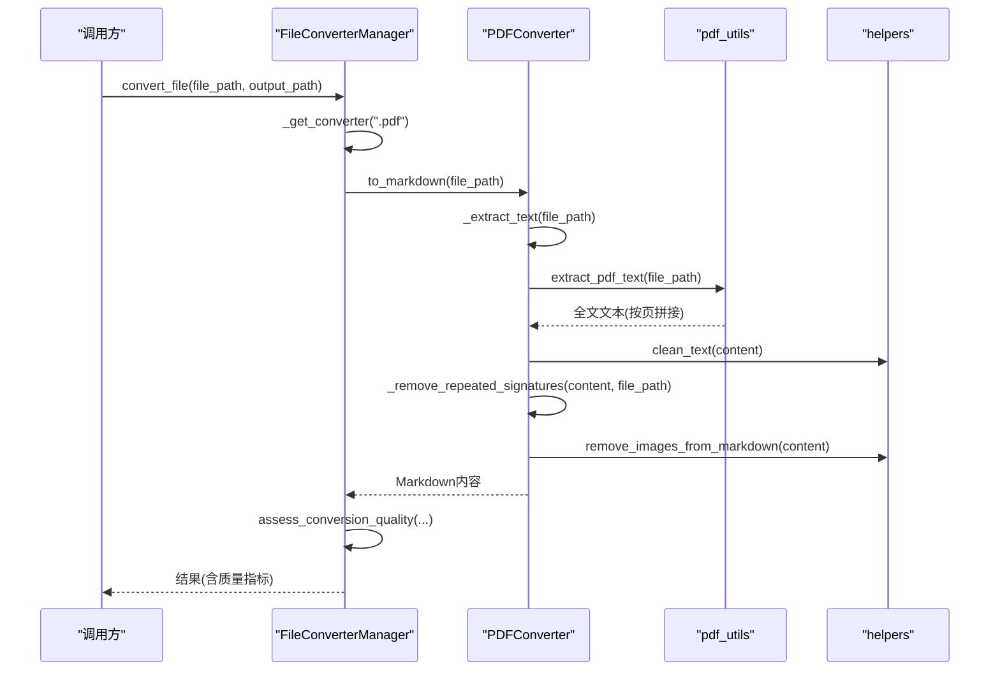
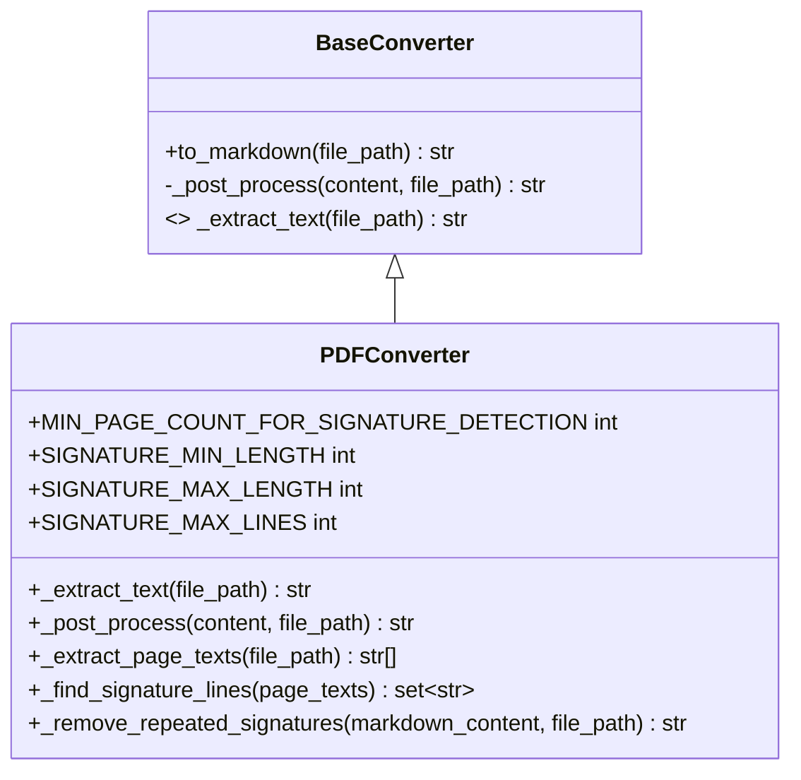
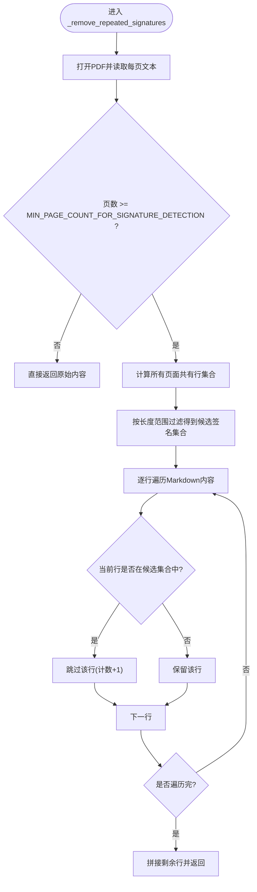
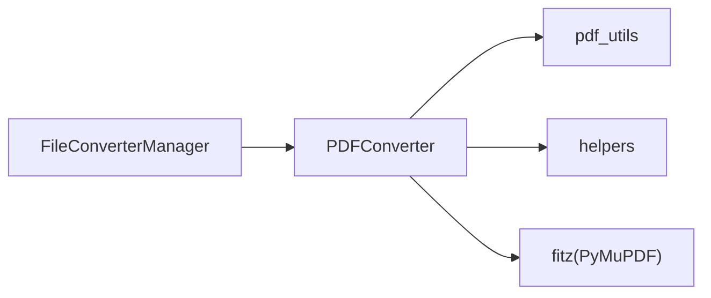

# PDF转换器

<cite>
**本文引用的文件**   
- [modules/file_converter.py](file://modules/file_converter.py)
- [utils/pdf_utils.py](file://utils/pdf_utils.py)
- [utils/helpers.py](file://utils/helpers.py)
- [tests/unit/test_file_converter.py](file://tests/unit/test_file_converter.py)
</cite>

## 目录
1. [简介](#简介)
2. [项目结构](#项目结构)
3. [核心组件](#核心组件)
4. [架构总览](#架构总览)
5. [详细组件分析](#详细组件分析)
6. [依赖关系分析](#依赖关系分析)
7. [性能考虑](#性能考虑)
8. [故障排查指南](#故障排查指南)
9. [结论](#结论)
10. [附录](#附录)

## 简介
本技术文档聚焦于PDF转换器的实现，重点解析基于PyMuPDF（fitz）的文本提取算法、签名/页眉页脚检测与后处理逻辑，以及质量评估与性能优化建议。文档面向具备一定工程背景的读者，同时力求以循序渐进的方式帮助非专业用户理解系统行为与调优方法。

## 项目结构
与PDF转换相关的代码主要分布在以下模块：
- 转换器实现与流程编排：modules/file_converter.py
- PDF文本提取工具：utils/pdf_utils.py
- 通用文本处理工具：utils/helpers.py
- 单元测试覆盖：tests/unit/test_file_converter.py

```mermaid
graph TB
subgraph "转换层"
A["BaseConverter<br/>模板方法"] --> B["PDFConverter<br/>PDF转Markdown"]
A --> C["TXTConverter"]
A --> D["DOCXConverter"]
A --> E["PPTConverter"]
A --> F["LegacyDOCConverter"]
A --> G["LegacyPPTConverter"]
A --> H["HTMLConverter"]
end
subgraph "工具层"
I["pdf_utils<br/>extract_pdf_text / extract_pdf_pages"]
J["helpers<br/>clean_text / remove_images_from_markdown"]
end
B --> I
B --> J
```

图表来源
- [modules/file_converter.py:27-92](file://modules/file_converter.py#L27-L92)
- [utils/pdf_utils.py:4-39](file://utils/pdf_utils.py#L4-L39)
- [utils/helpers.py:26-48](file://utils/helpers.py#L26-L48)

章节来源
- [modules/file_converter.py:27-92](file://modules/file_converter.py#L27-L92)
- [utils/pdf_utils.py:4-39](file://utils/pdf_utils.py#L4-L39)
- [utils/helpers.py:26-48](file://utils/helpers.py#L26-L48)

## 核心组件
- BaseConverter：定义统一的转换模板方法 to_markdown，封装日志、异常、基础后处理（clean_text + 图片移除），子类仅需实现 _extract_text。
- PDFConverter：继承自BaseConverter，使用PyMuPDF进行文本提取，并实现PDF特有的后处理（重复签名/页眉页脚识别与移除）。
- FileConverterManager：负责选择具体转换器、批量转换、质量评估、主题分配、原始文件归档等流程编排。

章节来源
- [modules/file_converter.py:27-92](file://modules/file_converter.py#L27-L92)
- [modules/file_converter.py:407-534](file://modules/file_converter.py#L407-L534)

## 架构总览
PDF转换的整体流程如下：
- 入口：FileConverterManager.convert_file 或 convert_batch
- 选择转换器：根据扩展名选择PDFConverter
- 文本提取：PDFConverter._extract_text 调用 utils.pdf_utils.extract_pdf_text
- 后处理：clean_text → 重复签名/页眉页脚移除 → 移除图片
- 质量评估：assess_conversion_quality 判定是否可接受
- 可选LLM重写：对低结构化内容尝试改写
- 输出：写入Markdown，记录来源哈希，必要时归档原文件

图表来源
- [modules/file_converter.py:445-534](file://modules/file_converter.py#L445-L534)
- [modules/file_converter.py:83-92](file://modules/file_converter.py#L83-L92)
- [utils/pdf_utils.py:4-22](file://utils/pdf_utils.py#L4-L22)
- [utils/helpers.py:26-48](file://utils/helpers.py#L26-L48)

## 详细组件分析

### PDFConverter 类
职责与关键点：
- 使用 PyMuPDF 快速路径提取文本
- 自定义后处理：clean_text → 重复签名/页眉页脚移除 → 移除图片
- 提供逐页文本提取接口用于签名检测

关键属性（配置参数）：
- MIN_PAGE_COUNT_FOR_SIGNATURE_DETECTION：触发签名检测的最小页数阈值
- SIGNATURE_MIN_LENGTH：候选签名行的最小长度
- SIGNATURE_MAX_LENGTH：候选签名行的最大长度
- SIGNATURE_MAX_LINES：当前预留字段，未在现有逻辑中使用

核心方法：
- _extract_page_texts：逐页提取文本，返回每页字符串列表
- _find_signature_lines：在满足最小页数的前提下，计算所有页面共有的行集合，并按长度过滤得到“重复签名/页眉/页脚”候选集
- _remove_repeated_signatures：打开PDF一次，获取每页文本，执行上述检测，然后从最终Markdown中剔除这些行

图表来源
- [modules/file_converter.py:27-92](file://modules/file_converter.py#L27-L92)

章节来源
- [modules/file_converter.py:72-157](file://modules/file_converter.py#L72-L157)

#### 文本提取算法（PyMuPDF）
- 使用 fitz.open 打开PDF，遍历每一页调用 page.get_text("text") 提取纯文本
- 默认对每页文本执行 strip()，并以双换行拼接为完整文本
- 提供 extract_pdf_pages 返回逐页文本列表，便于后续签名检测

复杂度与特性：
- 时间复杂度 O(N)，N为PDF总字符数；空间复杂度取决于单页文本大小
- 适合常规扫描型PDF以外的文本型PDF；对于纯图像扫描PDF，提取结果为空或极少字符

章节来源
- [utils/pdf_utils.py:4-22](file://utils/pdf_utils.py#L4-L22)
- [utils/pdf_utils.py:25-39](file://utils/pdf_utils.py#L25-L39)

#### 签名检测与后处理逻辑
- 触发条件：当PDF页数小于 MIN_PAGE_COUNT_FOR_SIGNATURE_DETECTION 时跳过检测
- 候选生成：将每页文本按行拆分、去空白，取所有页面的交集，得到在所有页面都出现的行集合
- 长度过滤：仅保留长度在 [SIGNATURE_MIN_LENGTH, SIGNATURE_MAX_LENGTH] 范围内的行作为有效候选
- 移除策略：在最终Markdown中按行匹配，若某行属于候选集合则丢弃该行，并统计移除行数

图表来源
- [modules/file_converter.py:126-157](file://modules/file_converter.py#L126-L157)
- [modules/file_converter.py:98-124](file://modules/file_converter.py#L98-L124)

章节来源
- [modules/file_converter.py:94-157](file://modules/file_converter.py#L94-L157)

#### 配置参数说明
- MIN_PAGE_COUNT_FOR_SIGNATURE_DETECTION：控制是否启用签名检测。过小的值可能导致误删正文，过大则可能漏检常见页眉页脚。
- SIGNATURE_MIN_LENGTH：避免将极短的行（如分隔线、页码）误判为签名。
- SIGNATURE_MAX_LENGTH：避免将长段落误判为签名。
- SIGNATURE_MAX_LINES：当前未参与实际逻辑，可作为未来扩展点（例如限制候选行数或窗口大小）。

章节来源
- [modules/file_converter.py:77-81](file://modules/file_converter.py#L77-L81)
- [modules/file_converter.py:104-124](file://modules/file_converter.py#L104-L124)

#### 质量评估
FileConverterManager.assess_conversion_quality 对转换结果进行保守评估，关注：
- 非空白字符数量
- 替换字符（\ufffd）与控制字符比例
- 针对PDF的特殊判断：非空白字符过少视为疑似扫描PDF，不可靠提取正文

该评估在转换前后各执行一次，不通过则拒绝写入输出文件。

章节来源
- [modules/file_converter.py:509-534](file://modules/file_converter.py#L509-L534)
- [tests/unit/test_file_converter.py:135-151](file://tests/unit/test_file_converter.py#L135-L151)

## 依赖关系分析
- PDFConverter 依赖：
  - utils.pdf_utils：提供 extract_pdf_text 与 extract_pdf_pages
  - utils.helpers：提供 clean_text 与 remove_images_from_markdown
  - fitz（PyMuPDF）：底层PDF解析库
- FileConverterManager 依赖：
  - 各具体转换器实例（懒加载）
  - 主题分配、前端元数据写入、原始文件归档等辅助功能

图表来源
- [modules/file_converter.py:83-92](file://modules/file_converter.py#L83-L92)
- [utils/pdf_utils.py:4-39](file://utils/pdf_utils.py#L4-L39)
- [utils/helpers.py:26-48](file://utils/helpers.py#L26-L48)

章节来源
- [modules/file_converter.py:83-92](file://modules/file_converter.py#L83-L92)
- [utils/pdf_utils.py:4-39](file://utils/pdf_utils.py#L4-L39)
- [utils/helpers.py:26-48](file://utils/helpers.py#L26-L48)

## 性能考虑
- 文本提取阶段
  - 使用 fitz 的 page.get_text("text") 直接提取纯文本，避免昂贵的渲染开销
  - 对大PDF建议分批处理，避免一次性加载过多内存
- 签名检测阶段
  - 仅在页数达到阈值时启用，减少不必要的计算
  - 行级集合交集操作的时间复杂度与行数线性相关，建议合理设置长度阈值以减少候选规模
- 后处理阶段
  - clean_text 与 remove_images_from_markdown 均为正则表达式处理，注意输入规模
- 质量评估
  - 在写入前进行两次评估，有助于尽早失败，避免无效IO
- 并发与幂等
  - 支持并行转换且通过文件名冲突处理避免覆盖
  - 基于源文件哈希的去重机制，避免重复转换

[本节为通用指导，无需特定文件引用]

## 故障排查指南
- 转换结果为空或极少字符
  - 检查是否为扫描型PDF（图像为主），assess_conversion_quality 会标记 suspected_scanned_pdf
  - 确认PyMuPDF版本与PDF兼容性
- 误删正文
  - 调整 MIN_PAGE_COUNT_FOR_SIGNATURE_DETECTION、SIGNATURE_MIN_LENGTH、SIGNATURE_MAX_LENGTH
  - 观察日志中的“检测到重复签名/页眉/页脚”和“已移除 X 行”信息
- 并发写冲突
  - 系统会自动追加后缀（same.md、same_1.md...），确保不会覆盖已有输出
- 主题分配失败
  - 查看日志警告信息，必要时关闭自动分配（assign_topic=False）

章节来源
- [modules/file_converter.py:509-534](file://modules/file_converter.py#L509-L534)
- [modules/file_converter.py:126-157](file://modules/file_converter.py#L126-L157)
- [tests/unit/test_file_converter.py:135-151](file://tests/unit/test_file_converter.py#L135-L151)

## 结论
PDFConverter 以简洁清晰的模板方法模式组织，结合PyMuPDF的高效文本提取与轻量级的重复行检测，实现了可靠的PDF到Markdown转换流程。通过可调节的签名检测阈值与严格的质量评估，系统在多数场景下能产出高质量结果，并对扫描型PDF给出明确拒绝提示。建议在大规模批处理场景中结合分页与缓存策略进一步优化性能。

[本节为总结性内容，无需特定文件引用]

## 附录

### 关键方法参考路径
- PDF文本提取：[utils/pdf_utils.py:4-22](file://utils/pdf_utils.py#L4-L22)、[utils/pdf_utils.py:25-39](file://utils/pdf_utils.py#L25-L39)
- PDF转换器主流程：[modules/file_converter.py:83-92](file://modules/file_converter.py#L83-L92)
- 逐页文本提取：[modules/file_converter.py:94-96](file://modules/file_converter.py#L94-L96)
- 签名行查找：[modules/file_converter.py:98-124](file://modules/file_converter.py#L98-L124)
- 重复签名移除：[modules/file_converter.py:126-157](file://modules/file_converter.py#L126-L157)
- 文本清理与图片移除：[utils/helpers.py:26-48](file://utils/helpers.py#L26-L48)
- 质量评估：[modules/file_converter.py:509-534](file://modules/file_converter.py#L509-L534)

章节来源
- [modules/file_converter.py:83-157](file://modules/file_converter.py#L83-L157)
- [utils/pdf_utils.py:4-39](file://utils/pdf_utils.py#L4-L39)
- [utils/helpers.py:26-48](file://utils/helpers.py#L26-L48)
- [modules/file_converter.py:509-534](file://modules/file_converter.py#L509-L534)