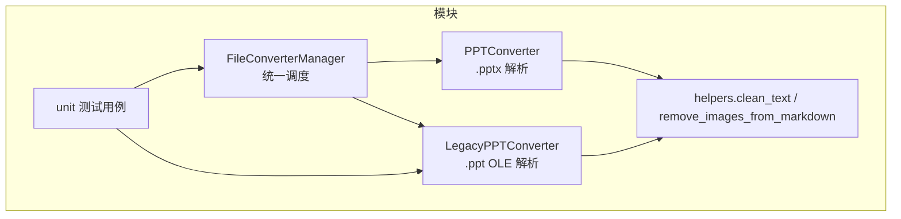
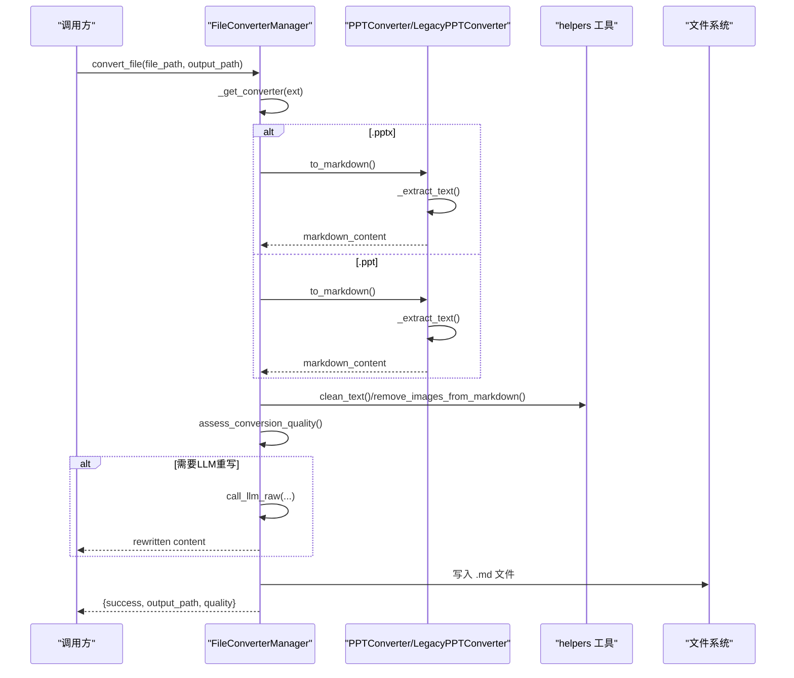
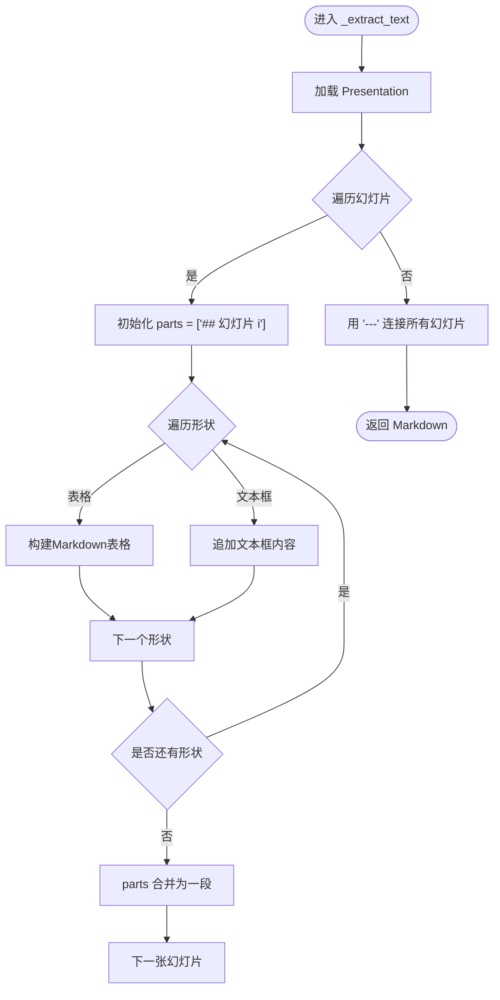
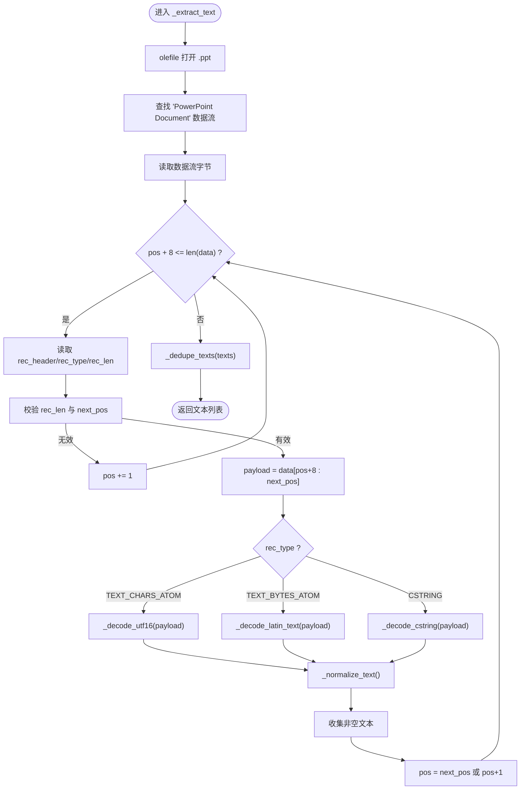
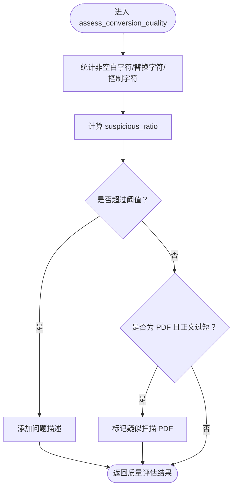
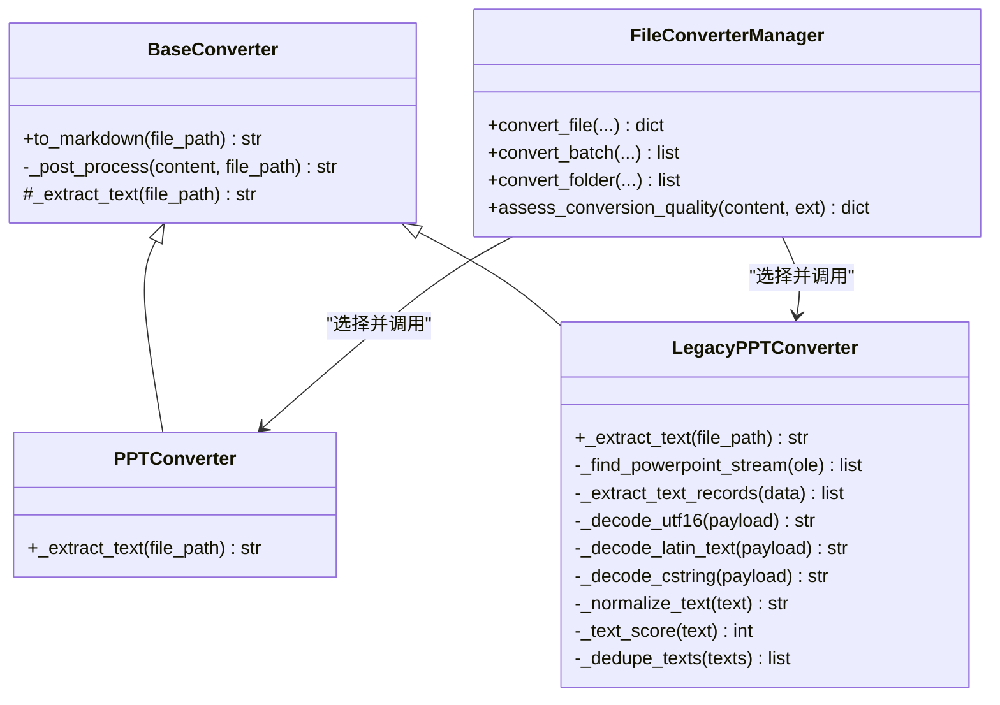

# PPT演示文稿转换器

<cite>
**本文引用的文件**
- [modules/file_converter.py](file://modules/file_converter.py)
- [utils/helpers.py](file://utils/helpers.py)
- [tests/unit/test_file_converter.py](file://tests/unit/test_file_converter.py)
</cite>

## 目录
1. [简介](#简介)
2. [项目结构](#项目结构)
3. [核心组件](#核心组件)
4. [架构总览](#架构总览)
5. [详细组件分析](#详细组件分析)
6. [依赖关系分析](#依赖关系分析)
7. [性能与质量评估](#性能与质量评估)
8. [故障排查指南](#故障排查指南)
9. [结论](#结论)

## 简介
本技术文档聚焦于PPT演示文稿转换器的实现，涵盖两类场景：
- 新版 .pptx 文件：基于 python-pptx 的幻灯片结构解析、文本框内容提取、表格转 Markdown 表格。
- 旧版 .ppt 文件：基于 OLE/Compound File Binary Format 的 PowerPoint Document 数据流读取，识别 TEXT_CHARS_ATOM、TEXT_BYTES_ATOM、CSTRING 等记录类型，进行 UTF-16LE/Latin-1 编码处理与文本去重。

同时说明整体转换流程中的结构保持策略与质量评估机制，帮助读者理解从原始演示文稿到结构化 Markdown 的完整链路。

## 项目结构
与PPT转换相关的核心代码位于 modules/file_converter.py，其中定义了 BaseConverter 抽象基类以及多种格式转换器（包括 PPTConverter 和 LegacyPPTConverter），并由 FileConverterManager 统一调度。辅助工具函数（如 clean_text、remove_images_from_markdown）位于 utils/helpers.py。单元测试覆盖关键路径与边界情况，位于 tests/unit/test_file_converter.py。

图表来源
- [modules/file_converter.py:254-387](file://modules/file_converter.py#L254-L387)
- [utils/helpers.py:26-48](file://utils/helpers.py#L26-L48)
- [tests/unit/test_file_converter.py:20-32](file://tests/unit/test_file_converter.py#L20-L32)

章节来源
- [modules/file_converter.py:254-387](file://modules/file_converter.py#L254-L387)
- [utils/helpers.py:26-48](file://utils/helpers.py#L26-L48)
- [tests/unit/test_file_converter.py:20-32](file://tests/unit/test_file_converter.py#L20-L32)

## 核心组件
- BaseConverter：模板方法模式，封装日志、异常、后处理（clean_text、移除图片）等通用逻辑，子类仅实现 _extract_text。
- PPTConverter：使用 python-pptx 解析 .pptx，遍历幻灯片与形状，提取文本框与表格并生成 Markdown。
- LegacyPPTConverter：使用 olefile 打开 .ppt，定位“PowerPoint Document”数据流，按记录头扫描并解码文本记录，执行文本规范化与去重。
- FileConverterManager：根据扩展名选择具体转换器，提供 convert_file/convert_batch/convert_folder 接口，并在转换前后进行质量评估与可选 LLM 重写。

章节来源
- [modules/file_converter.py:27-69](file://modules/file_converter.py#L27-L69)
- [modules/file_converter.py:254-287](file://modules/file_converter.py#L254-L287)
- [modules/file_converter.py:289-387](file://modules/file_converter.py#L289-L387)
- [modules/file_converter.py:407-534](file://modules/file_converter.py#L407-L534)

## 架构总览
下图展示了从输入文件到输出 Markdown 的整体流程，包括格式路由、转换、后处理、质量评估与可选重写。

图表来源
- [modules/file_converter.py:569-730](file://modules/file_converter.py#L569-L730)
- [modules/file_converter.py:254-287](file://modules/file_converter.py#L254-L287)
- [modules/file_converter.py:289-387](file://modules/file_converter.py#L289-L387)
- [utils/helpers.py:26-48](file://utils/helpers.py#L26-L48)

## 详细组件分析

### PPTConverter（.pptx 解析）
- 目标：将 .pptx 转换为结构化的 Markdown，尽量保留幻灯片结构与表格。
- 主要步骤：
  - 加载 Presentation，逐页遍历 slides。
  - 对每页构建“## 幻灯片 i”标题。
  - 遍历 slide.shapes：
    - 若 shape.has_text_frame，则提取 text_frame.text 并追加。
    - 若 shape.has_table，则将行单元格拼接为 Markdown 表格（首行为表头，第二行为分隔线）。
  - 以“---”分隔各幻灯片，最终合并为完整 Markdown。
- 复杂度与特性：
  - 时间复杂度近似 O(S + ΣN_i)，S 为幻灯片数，N_i 为第 i 页形状数；表格转换与字符串拼接线性开销。
  - 结构保持：通过“## 幻灯片 i”与表格语法维持层级与结构。
  - 兼容性：依赖 python-pptx，仅支持 .pptx。

图表来源
- [modules/file_converter.py:260-286](file://modules/file_converter.py#L260-L286)

章节来源
- [modules/file_converter.py:254-287](file://modules/file_converter.py#L254-L287)

### LegacyPPTConverter（.ppt OLE 解析）
- 目标：在无法使用外部工具的情况下，直接解析旧版 .ppt 的 OLE Compound File，提取文本。
- 关键流程：
  - 使用 olefile 打开 .ppt，查找名为“PowerPoint Document”的数据流。
  - 读取该流的字节序列，按固定头部（rec_header、rec_type、rec_len）迭代解析记录。
  - 针对三种文本记录类型分别解码：
    - TEXT_CHARS_ATOM：UTF-16LE 编码。
    - TEXT_BYTES_ATOM：Latin-1 编码。
    - CSTRING：优先尝试 UTF-16LE，回退 Latin-1，依据 _text_score 评分择优。
  - 文本规范化：去除空字符、多余空白与换行，合并有效行。
  - 文本去重：归一化空白后基于集合去重，过滤长度小于2的片段。
- 编码与评分：
  - UTF-16LE 与 Latin-1 均允许 errors="ignore" 容错。
  - _text_score 综合长度、控制字符惩罚、中文字符加分、字母数字加分，用于在 CSTRING 情况下选择更合理的解码结果。
- 复杂度与鲁棒性：
  - 线性扫描 O(N)，N 为数据流长度；对非法 rec_len 或越界采用步进保护，避免崩溃。
  - 去重算法降低重复噪声，提升可读性。

图表来源
- [modules/file_converter.py:298-387](file://modules/file_converter.py#L298-L387)

章节来源
- [modules/file_converter.py:289-387](file://modules/file_converter.py#L289-L387)
- [tests/unit/test_file_converter.py:20-32](file://tests/unit/test_file_converter.py#L20-L32)

### 文本后处理与质量评估
- 后处理：
  - clean_text：清理不可见与控制字符、合并多余空白与换行。
  - remove_images_from_markdown：移除 Markdown 中的图片引用与 HTML img 标签。
- 质量评估（assess_conversion_quality）：
  - 统计非空白字符数、替换字符（\ufffd）、控制字符比例，判定“疑似乱码”。
  - 针对 PDF 特殊判断“疑似扫描 PDF”，当正文过短则拒绝。
  - 返回包含 acceptable、characters、suspicious_ratio、suspected_scanned_pdf、issues 的结构化指标。
- 可选 LLM 重写：
  - 当内容较短或缺乏段落/标点时，可触发 LLM 重写以提升可读性与完整性（受配置与长度限制）。

图表来源
- [modules/file_converter.py:509-534](file://modules/file_converter.py#L509-L534)
- [utils/helpers.py:26-48](file://utils/helpers.py#L26-L48)

章节来源
- [modules/file_converter.py:509-534](file://modules/file_converter.py#L509-L534)
- [utils/helpers.py:26-48](file://utils/helpers.py#L26-L48)

## 依赖关系分析
- 运行时依赖：
  - python-pptx：用于 .pptx 解析。
  - olefile：用于 .ppt OLE 复合文件解析。
- 内部依赖：
  - helpers.clean_text、remove_images_from_markdown：文本清洗与图片移除。
  - FileConverterManager：统一入口，负责格式路由、质量评估、输出与归档。
- 耦合与内聚：
  - BaseConverter 将通用流程与异常处理下沉，提高内聚性；PPTConverter 与 LegacyPPTConverter 各自专注特定格式，降低耦合。
  - FileConverterManager 通过属性懒加载实例，减少启动开销。

图表来源
- [modules/file_converter.py:27-69](file://modules/file_converter.py#L27-L69)
- [modules/file_converter.py:254-287](file://modules/file_converter.py#L254-L287)
- [modules/file_converter.py:289-387](file://modules/file_converter.py#L289-L387)
- [modules/file_converter.py:407-534](file://modules/file_converter.py#L407-L534)

章节来源
- [modules/file_converter.py:27-69](file://modules/file_converter.py#L27-L69)
- [modules/file_converter.py:254-287](file://modules/file_converter.py#L254-L287)
- [modules/file_converter.py:289-387](file://modules/file_converter.py#L289-L387)
- [modules/file_converter.py:407-534](file://modules/file_converter.py#L407-L534)

## 性能与质量评估
- 性能特征：
  - PPTConverter：线性遍历幻灯片与形状，表格转换与字符串拼接开销可控；适合中等规模演示文稿。
  - LegacyPPTConverter：单遍扫描 OLE 数据流，解码与正则操作开销较小；去重使用集合，空间与时间均为线性。
- 质量评估要点：
  - 非空白字符计数、替换字符与控制字符比例作为“疑似乱码”指标。
  - PDF 扫描检测：当正文过短且为 PDF 时，直接拒绝以避免低质量入库。
  - 可选 LLM 重写：在内容不完整或结构较差时提升可读性，但需考虑 API 成本与超时风险。
- 优化建议：
  - 对于超大 .pptx，可考虑分片处理与增量写入，降低内存峰值。
  - 对 LegacyPPTConverter，可在解码失败时增加更多回退策略（如尝试其他编码或字节序）。
  - 质量评估阈值可根据业务需求调整，平衡召回率与准确率。

[本节为通用指导，不直接分析具体文件]

## 故障排查指南
- 常见错误与定位：
  - “未找到 PowerPoint Document 数据流”：检查 .ppt 是否为有效的 OLE 复合文件，确认 olefile 可用。
  - “未能从旧版 .ppt 文件中提取文本”：可能因记录类型缺失或编码异常，查看 _extract_text_records 的日志与边界条件。
  - “不支持的文件格式”：确认扩展名匹配（.pptx/.ppt），必要时修正文件名后缀。
  - “转换成功，但原文件归档到 Raw 失败”：检查 raw_path 权限与磁盘空间。
- 调试建议：
  - 启用日志输出，关注转换开始/结束与失败信息。
  - 对 LegacyPPTConverter，打印 rec_type 与 payload 前若干字节，辅助定位编码问题。
  - 使用单元测试构造最小数据集验证解码与去重逻辑。

章节来源
- [modules/file_converter.py:298-310](file://modules/file_converter.py#L298-L310)
- [modules/file_converter.py:569-730](file://modules/file_converter.py#L569-L730)
- [tests/unit/test_file_converter.py:154-175](file://tests/unit/test_file_converter.py#L154-L175)

## 结论
本转换器通过分层设计与模板方法模式，将 .pptx 与 .ppt 的差异化解析逻辑解耦，并以统一的 to_markdown 接口对外暴露。PPTConverter 利用 python-pptx 高效提取文本与表格，LegacyPPTConverter 深入 OLE 数据流，结合多编码解码与文本评分，确保旧版文件的可用性。配合质量评估与可选 LLM 重写，系统在结构保持与内容质量之间取得良好平衡。后续可在大规模场景下进一步优化内存占用与并发能力，并扩展更多编码回退策略以提升鲁棒性。