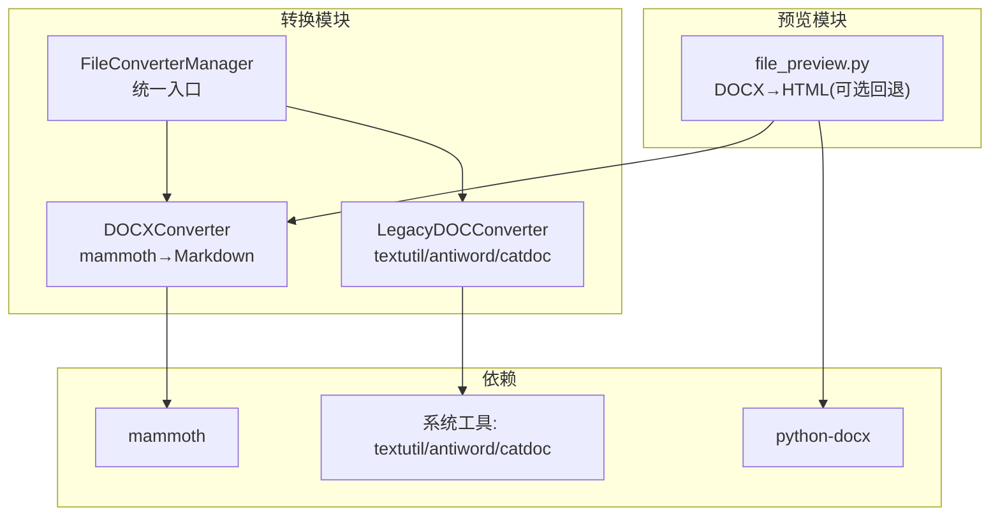
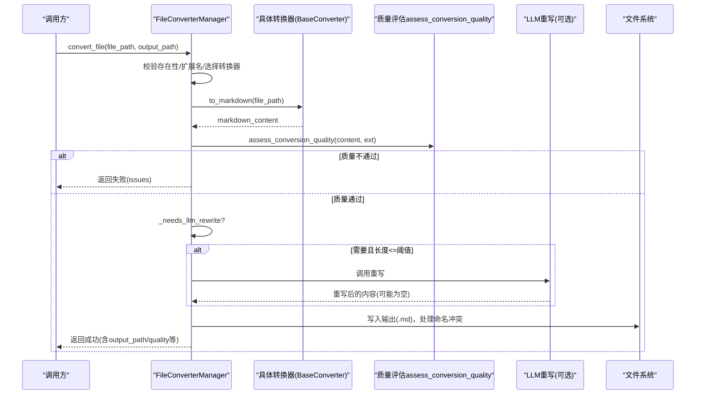
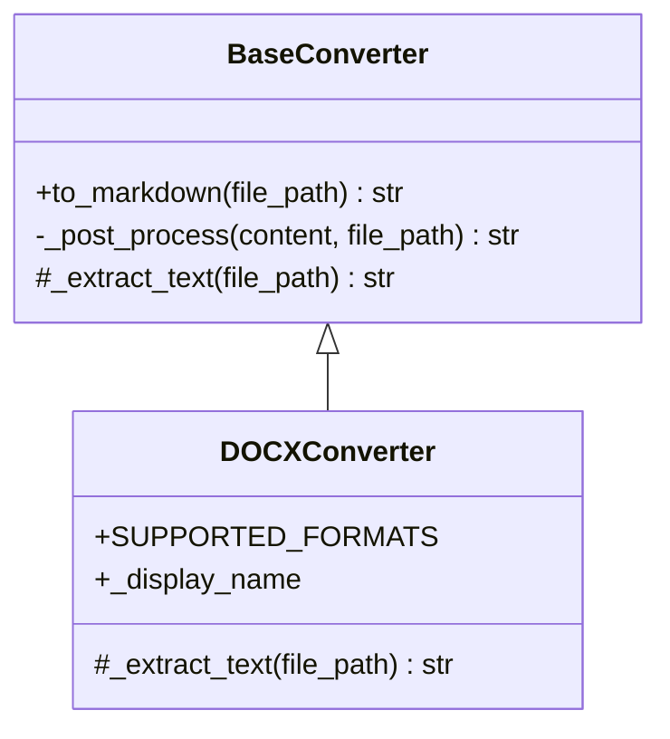
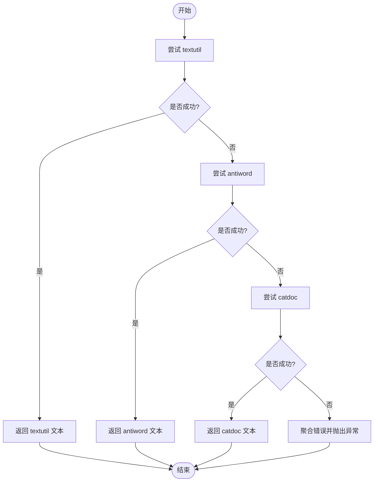
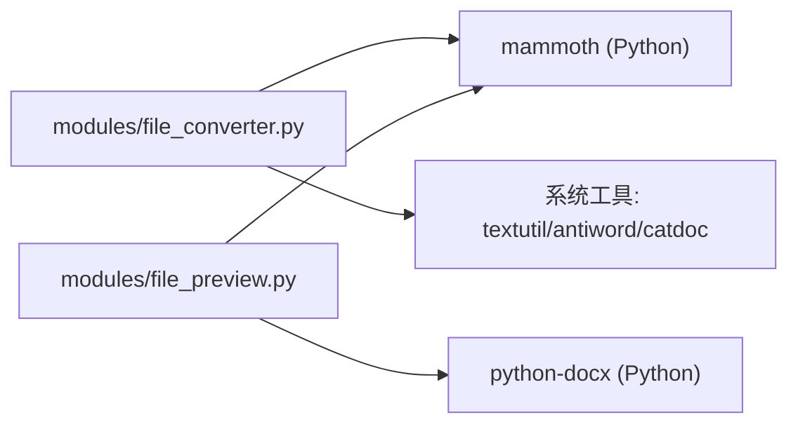

# Word文档转换器

<cite>
**本文引用的文件**   
- [modules/file_converter.py](file://modules/file_converter.py)
- [modules/file_preview.py](file://modules/file_preview.py)
- [pyproject.toml](file://pyproject.toml)
- [tests/unit/test_file_converter.py](file://tests/unit/test_file_converter.py)
</cite>

## 目录
1. [简介](#简介)
2. [项目结构](#项目结构)
3. [核心组件](#核心组件)
4. [架构总览](#架构总览)
5. [详细组件分析](#详细组件分析)
6. [依赖分析](#依赖分析)
7. [性能考虑](#性能考虑)
8. [故障排除指南](#故障排除指南)
9. [结论](#结论)

## 简介
本技术文档聚焦于Word文档转换子系统，重点说明：
- DOCXConverter 使用 mammoth 库将 .docx 转换为 Markdown 的实现原理与流程。
- LegacyDOCConverter 对旧版 .doc 文件的处理逻辑，包括 textutil、antiword、catdoc 三种工具链的降级策略。
- 系统依赖检测与错误处理机制。
- 格式兼容性处理与文本提取质量保障策略。
- 不同Word版本的转换效果对比与常见问题排查建议。

## 项目结构
与Word转换相关的关键代码位于模块层与预览层：
- modules/file_converter.py：定义各类转换器（含 DOCXConverter、LegacyDOCConverter）以及统一的管理器 FileConverterManager，负责调度、质量评估、输出落盘与主题分配等。
- modules/file_preview.py：提供 DOCX/DOC 的HTML/Markdown 预览能力，内部也调用 mammoth 或 python-docx 进行解析。
- pyproject.toml：声明 Python 依赖，包含 mammoth 等关键库。
- tests/unit/test_file_converter.py：覆盖支持格式、并发写冲突、低质量扫描PDF拒绝、重复源哈希去重等场景。

图表来源
- [modules/file_converter.py:168-203](file://modules/file_converter.py#L168-L203)
- [modules/file_converter.py:204-251](file://modules/file_converter.py#L204-L251)
- [modules/file_preview.py:171-200](file://modules/file_preview.py#L171-L200)
- [pyproject.toml:20-26](file://pyproject.toml#L20-L26)

章节来源
- [modules/file_converter.py:168-251](file://modules/file_converter.py#L168-L251)
- [modules/file_preview.py:171-200](file://modules/file_preview.py#L171-L200)
- [pyproject.toml:20-26](file://pyproject.toml#L20-L26)

## 核心组件
- BaseConverter：模板方法基类，封装日志、异常、通用后处理（清理、图片移除），子类仅实现 _extract_text。
- DOCXConverter：基于 mammoth.convert_to_markdown 将 .docx 转为 Markdown。
- LegacyDOCConverter：依次尝试 textutil → antiword → catdoc，任一成功即返回原始文本；失败则汇总错误并抛出运行时异常。
- FileConverterManager：根据扩展名选择具体转换器，执行转换、质量评估、可选LLM重写、写入输出、归档原文件、记录转换结果等。

章节来源
- [modules/file_converter.py:27-69](file://modules/file_converter.py#L27-L69)
- [modules/file_converter.py:168-181](file://modules/file_converter.py#L168-L181)
- [modules/file_converter.py:183-251](file://modules/file_converter.py#L183-L251)
- [modules/file_converter.py:407-507](file://modules/file_converter.py#L407-L507)

## 架构总览
下图展示从输入到输出的端到端流程，包括质量评估与可选LLM重写环节。

图表来源
- [modules/file_converter.py:569-730](file://modules/file_converter.py#L569-L730)
- [modules/file_converter.py:509-534](file://modules/file_converter.py#L509-L534)
- [modules/file_converter.py:428-443](file://modules/file_converter.py#L428-L443)

## 详细组件分析

### DOCXConverter（mammoth 驱动）
- 目标：将 .docx 转换为 Markdown。
- 关键点：
  - 使用 mammoth.convert_to_markdown 直接生成 Markdown。
  - 作为 BaseConverter 的子类，自动获得日志、异常捕获与通用后处理（clean_text、移除图片）。
  - 依赖在运行时导入，避免启动期强耦合。
- 典型路径参考：
  - 转换入口与后处理：[modules/file_converter.py:44-64](file://modules/file_converter.py#L44-L64)
  - DOCX 转换实现：[modules/file_converter.py:168-181](file://modules/file_converter.py#L168-L181)
  - 依赖声明：[pyproject.toml:20-26](file://pyproject.toml#L20-L26)

图表来源
- [modules/file_converter.py:27-69](file://modules/file_converter.py#L27-L69)
- [modules/file_converter.py:168-181](file://modules/file_converter.py#L168-L181)

章节来源
- [modules/file_converter.py:44-64](file://modules/file_converter.py#L44-L64)
- [modules/file_converter.py:168-181](file://modules/file_converter.py#L168-L181)
- [pyproject.toml:20-26](file://pyproject.toml#L20-L26)

### LegacyDOCConverter（旧版 .doc 多工具链降级）
- 目标：在不具备原生解析能力的情况下，借助系统工具提取 .doc 文本。
- 降级策略顺序：
  1) textutil（macOS 自带）
  2) antiword（需安装）
  3) catdoc（需安装）
- 行为特征：
  - 按序尝试，首个成功且非空即返回。
  - 全部失败时聚合最近两条错误信息，抛出 RuntimeError 并提示所需工具。
  - 每个子步骤均检查命令是否存在、设置超时、捕获返回码与标准错误。
- 典型路径参考：
  - 主流程与降级循环：[modules/file_converter.py:189-203](file://modules/file_converter.py#L189-L203)
  - textutil 分支：[modules/file_converter.py:204-221](file://modules/file_converter.py#L204-L221)
  - antiword 分支：[modules/file_converter.py:222-236](file://modules/file_converter.py#L222-L236)
  - catdoc 分支：[modules/file_converter.py:237-251](file://modules/file_converter.py#L237-L251)

图表来源
- [modules/file_converter.py:189-203](file://modules/file_converter.py#L189-L203)
- [modules/file_converter.py:204-221](file://modules/file_converter.py#L204-L221)
- [modules/file_converter.py:222-236](file://modules/file_converter.py#L222-L236)
- [modules/file_converter.py:237-251](file://modules/file_converter.py#L237-L251)

章节来源
- [modules/file_converter.py:189-251](file://modules/file_converter.py#L189-L251)

### 预览侧 DOCX/DOC 处理（辅助）
- DOCX 预览优先使用 mammoth 转 HTML；若不可用或结果为空，回退至 python-docx 构造简易 HTML。
- 旧版 .doc 预览通过 LegacyDOCConverter 转为 Markdown 再呈现。
- 典型路径参考：
  - DOCX→HTML（mammoth）及回退：[modules/file_preview.py:171-200](file://modules/file_preview.py#L171-L200)
  - python-docx 回退实现：[modules/file_preview.py:202-242](file://modules/file_preview.py#L202-L242)
  - 旧版 .doc 预览：[modules/file_preview.py:244-264](file://modules/file_preview.py#L244-L264)

章节来源
- [modules/file_preview.py:171-200](file://modules/file_preview.py#L171-L200)
- [modules/file_preview.py:202-242](file://modules/file_preview.py#L202-L242)
- [modules/file_preview.py:244-264](file://modules/file_preview.py#L244-L264)

## 依赖分析
- Python 依赖：
  - mammoth：用于 .docx 转 Markdown/HTML。
  - python-docx：作为 DOCX 预览的回退方案。
  - olefile：用于旧版 PPT 解析（与本 Word 文档无关，但同属 Office 兼容范畴）。
- 系统外部依赖（仅 LegacyDOCConverter）：
  - macOS textutil：无需额外安装。
  - antiword / catdoc：需在系统 PATH 中可用。

图表来源
- [pyproject.toml:20-26](file://pyproject.toml#L20-L26)
- [modules/file_converter.py:168-181](file://modules/file_converter.py#L168-L181)
- [modules/file_converter.py:204-251](file://modules/file_converter.py#L204-L251)
- [modules/file_preview.py:171-200](file://modules/file_preview.py#L171-L200)

章节来源
- [pyproject.toml:20-26](file://pyproject.toml#L20-L26)

## 性能考虑
- 延迟导入：mammoth、python-docx 等在函数内导入，降低启动开销。
- 短路径优化：DOCX 转换走纯 Python 库，无外部进程开销；旧版 .doc 会触发子进程调用，注意超时控制。
- 批量转换：convert_batch 支持进度回调，便于前端反馈。
- 输出防覆盖：同名文件自动追加序号，避免并发写入冲突（见测试用例）。

章节来源
- [modules/file_converter.py:569-730](file://modules/file_converter.py#L569-L730)
- [tests/unit/test_file_converter.py:65-97](file://tests/unit/test_file_converter.py#L65-L97)

## 故障排除指南
- 无法转换旧版 .doc
  - 现象：抛出运行时异常，提示缺少 textutil/antiword/catdoc。
  - 排查：确认系统已安装对应工具且在 PATH 中；macOS 优先使用 textutil；Linux/Windows 需安装 antiword 或 catdoc。
  - 参考路径：[modules/file_converter.py:189-203](file://modules/file_converter.py#L189-L203)
- 转换结果过短或疑似乱码
  - 现象：质量评估返回“提取正文过短”“疑似乱码”，或直接拒绝（如扫描 PDF）。
  - 处理：检查源文件格式与编码；必要时启用 LLM 重写提升可读性（受长度限制）。
  - 参考路径：[modules/file_converter.py:509-534](file://modules/file_converter.py#L509-L534)、[modules/file_converter.py:428-443](file://modules/file_converter.py#L428-L443)
- 预览失败
  - 现象：mammoth 预览失败，自动回退 python-docx；仍失败则返回错误信息。
  - 处理：检查 mammoth 是否可用；查看 warnings 列表定位问题。
  - 参考路径：[modules/file_preview.py:171-200](file://modules/file_preview.py#L171-L200)、[modules/file_preview.py:202-242](file://modules/file_preview.py#L202-L242)
- 并发写入冲突
  - 现象：相同文件名被多次写入。
  - 处理：系统会自动为后续文件追加序号，确保不覆盖。
  - 参考路径：[tests/unit/test_file_converter.py:65-97](file://tests/unit/test_file_converter.py#L65-L97)
- 重复源哈希去重
  - 现象：同一源文件再次转换会被跳过，并保留首次输出。
  - 处理：确认 raw_path 配置正确，以便归档原文件。
  - 参考路径：[tests/unit/test_file_converter.py:154-175](file://tests/unit/test_file_converter.py#L154-L175)

章节来源
- [modules/file_converter.py:189-203](file://modules/file_converter.py#L189-L203)
- [modules/file_converter.py:509-534](file://modules/file_converter.py#L509-L534)
- [modules/file_converter.py:428-443](file://modules/file_converter.py#L428-L443)
- [modules/file_preview.py:171-200](file://modules/file_preview.py#L171-L200)
- [modules/file_preview.py:202-242](file://modules/file_preview.py#L202-L242)
- [tests/unit/test_file_converter.py:65-97](file://tests/unit/test_file_converter.py#L65-L97)
- [tests/unit/test_file_converter.py:154-175](file://tests/unit/test_file_converter.py#L154-L175)

## 结论
- DOCX 转换以 mammoth 为核心，稳定高效，适合现代 .docx 文档。
- 旧版 .doc 通过 textutil/antiword/catdoc 三级降级，兼顾跨平台可用性；建议在部署环境预装至少一种工具。
- 统一的 BaseConverter 模板方法与 FileConverterManager 编排，使新增格式支持更便捷。
- 质量评估与可选 LLM 重写共同保障最终文本的可读性与可用性。
- 预览模块对 DOCX/DOC 提供友好回退策略，增强用户体验。