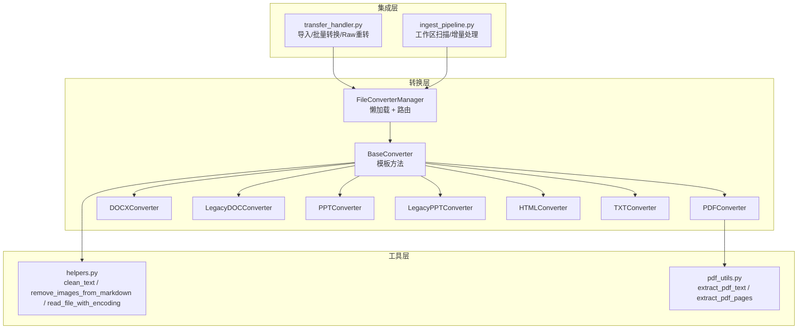
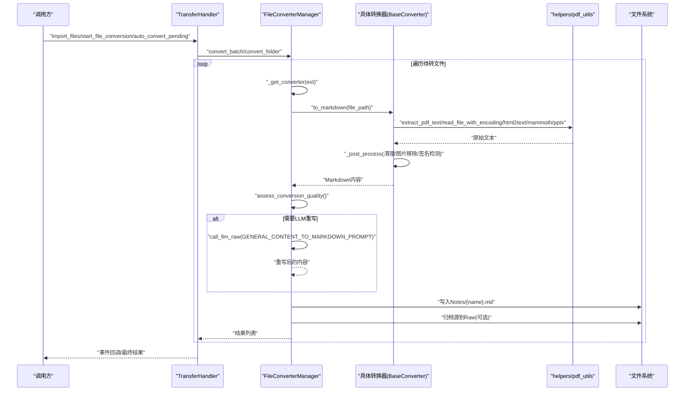
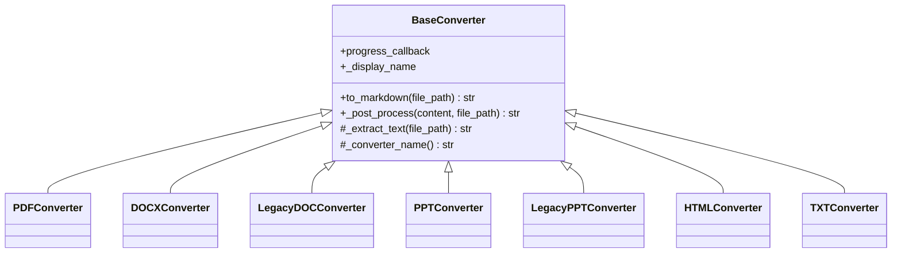
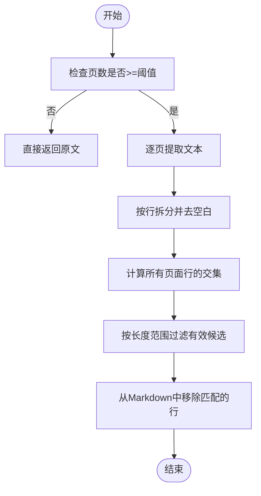
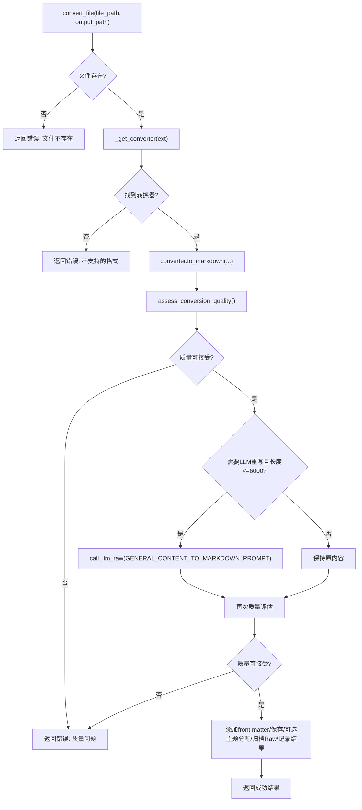
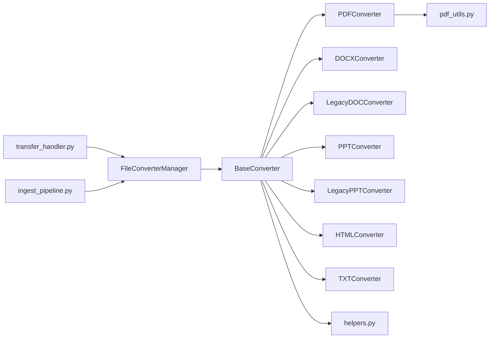

# 文件转换器

<cite>
**本文引用的文件**
- [modules/file_converter.py](file://modules/file_converter.py)
- [utils/pdf_utils.py](file://utils/pdf_utils.py)
- [utils/helpers.py](file://utils/helpers.py)
- [python/sidecar/ingest_pipeline.py](file://python/sidecar/ingest_pipeline.py)
- [python/sidecar/handlers/transfer_handler.py](file://python/sidecar/handlers/transfer_handler.py)
- [tests/unit/test_file_converter.py](file://tests/unit/test_file_converter.py)
</cite>

## 目录
1. [简介](#简介)
2. [项目结构](#项目结构)
3. [核心组件](#核心组件)
4. [架构总览](#架构总览)
5. [详细组件分析](#详细组件分析)
6. [依赖关系分析](#依赖关系分析)
7. [性能考量](#性能考量)
8. [故障排查指南](#故障排查指南)
9. [结论](#结论)
10. [附录](#附录)

## 简介
本模块提供统一的多格式文件到 Markdown 的转换能力，采用模板方法模式抽象通用流程，并通过管理器实现懒加载与路由。支持 PDF、DOCX、旧版 .doc、PPT/PPTX、HTML、TXT 等格式，内置质量评估、签名/页眉页脚检测与移除、可选 LLM 重写、自动主题分配与原始文件归档等功能。

## 项目结构
- 转换器基类与具体实现位于 modules/file_converter.py
- PDF 文本提取工具位于 utils/pdf_utils.py
- 文本清理、图片移除、编码探测等通用工具位于 utils/helpers.py
- 导入与批量转换入口在 python/sidecar/handlers/transfer_handler.py
- 工作区扫描与流水线集成在 python/sidecar/ingest_pipeline.py
- 单元测试覆盖关键路径与边界条件在 tests/unit/test_file_converter.py

图示来源
- [modules/file_converter.py:27-405](file://modules/file_converter.py#L27-L405)
- [utils/pdf_utils.py:1-40](file://utils/pdf_utils.py#L1-L40)
- [utils/helpers.py:26-48](file://utils/helpers.py#L26-L48)
- [python/sidecar/handlers/transfer_handler.py:121-232](file://python/sidecar/handlers/transfer_handler.py#L121-L232)
- [python/sidecar/ingest_pipeline.py:277-291](file://python/sidecar/ingest_pipeline.py#L277-L291)

章节来源
- [modules/file_converter.py:27-405](file://modules/file_converter.py#L27-L405)
- [utils/pdf_utils.py:1-40](file://utils/pdf_utils.py#L1-L40)
- [utils/helpers.py:26-48](file://utils/helpers.py#L26-L48)
- [python/sidecar/handlers/transfer_handler.py:121-232](file://python/sidecar/handlers/transfer_handler.py#L121-L232)
- [python/sidecar/ingest_pipeline.py:277-291](file://python/sidecar/ingest_pipeline.py#L277-L291)

## 核心组件
- BaseConverter（模板方法）
  - to_markdown：统一日志、异常处理；调用 _extract_text 与 _post_process
  - _post_process：默认执行 clean_text 与 remove_images_from_markdown，子类可覆盖扩展
  - _extract_text：由子类实现具体格式解析
- 具体转换器
  - PDFConverter：基于 PyMuPDF 快速路径；自定义后处理包含签名/页眉页脚检测与移除
  - DOCXConverter：使用 mammoth 将 .docx 转为 Markdown
  - LegacyDOCConverter：依次尝试 textutil / antiword / catdoc 提取 .doc 文本
  - PPTConverter：使用 python-pptx 读取 .pptx 文本与表格并生成 Markdown
  - LegacyPPTConverter：解析 OLE PowerPoint Document 记录，解码 UTF-16/Latin-1/CString，去重输出
  - HTMLConverter：使用 html2text 将 HTML 转为 Markdown
  - TXTConverter：按多编码策略读取文本
- FileConverterManager
  - 懒加载各转换器实例
  - 根据扩展名路由到对应转换器
  - 质量评估 assess_conversion_quality
  - convert_file/convert_batch/convert_folder 主流程：查重、LLM 重写、front matter、落盘、主题分配、Raw 归档、结果记录

章节来源
- [modules/file_converter.py:27-158](file://modules/file_converter.py#L27-L158)
- [modules/file_converter.py:160-405](file://modules/file_converter.py#L160-L405)
- [modules/file_converter.py:407-862](file://modules/file_converter.py#L407-L862)

## 架构总览
下图展示从外部调用到具体转换器的完整调用链与数据流。

图示来源
- [python/sidecar/handlers/transfer_handler.py:121-232](file://python/sidecar/handlers/transfer_handler.py#L121-L232)
- [modules/file_converter.py:407-862](file://modules/file_converter.py#L407-L862)
- [utils/pdf_utils.py:1-40](file://utils/pdf_utils.py#L1-L40)
- [utils/helpers.py:26-48](file://utils/helpers.py#L26-L48)

## 详细组件分析

### BaseConverter 与模板方法
- 设计要点
  - 模板方法 to_markdown 固定流程：日志 → 提取 → 后处理 → 返回
  - 后处理钩子 _post_process 允许子类插入额外步骤（如 PDF 的签名/页眉页脚移除）
  - 抽象方法 _extract_text 强制子类实现具体解析逻辑
- 复杂度
  - 时间复杂度：O(N) 文本长度线性处理
  - 空间复杂度：O(N) 存储中间文本
- 错误处理
  - 捕获异常并记录日志，向上抛出，便于上层统一处理

图示来源
- [modules/file_converter.py:27-158](file://modules/file_converter.py#L27-L158)

章节来源
- [modules/file_converter.py:27-158](file://modules/file_converter.py#L27-L158)

### PDFConverter：签名/页眉页脚检测与移除
- 功能
  - 使用 PyMuPDF 逐页提取文本，识别每页都出现的重复行作为候选签名/页眉/页脚
  - 过滤掉这些重复行，降低噪声
- 算法流程

图示来源
- [modules/file_converter.py:126-157](file://modules/file_converter.py#L126-L157)
- [utils/pdf_utils.py:25-39](file://utils/pdf_utils.py#L25-L39)

章节来源
- [modules/file_converter.py:72-158](file://modules/file_converter.py#L72-L158)
- [utils/pdf_utils.py:1-40](file://utils/pdf_utils.py#L1-L40)

### DOCXConverter：mammoth 转换
- 使用 mammoth.convert_to_markdown 将 .docx 转换为 Markdown
- 适用于现代 Word 文档，保留基本结构与样式语义

章节来源
- [modules/file_converter.py:168-181](file://modules/file_converter.py#L168-L181)

### LegacyDOCConverter：旧版 .doc 兼容
- 依次尝试系统工具 textutil（macOS）、antiword、catdoc
- 任一成功即返回文本；全部失败则抛出运行时错误
- 适合遗留环境或无 Python 库支持的场景

章节来源
- [modules/file_converter.py:183-252](file://modules/file_converter.py#L183-L252)

### PPTConverter：.pptx 文本与表格
- 使用 python-pptx 遍历幻灯片与形状
- 文本框内容直接拼接；表格以 Markdown 表格形式输出
- 幻灯片间以分隔线区分，便于后续阅读与索引

章节来源
- [modules/file_converter.py:254-287](file://modules/file_converter.py#L254-L287)

### LegacyPPTConverter：OLE PowerPoint Document 解析
- 解析 OLE 流中的文本记录类型（UTF-16、Latin-1、C-string）
- 文本评分函数用于选择更可读的编码结果
- 去重逻辑避免重复片段污染输出

章节来源
- [modules/file_converter.py:289-388](file://modules/file_converter.py#L289-L388)

### HTMLConverter：html2text 转换
- 使用 html2text 将 HTML 转为 Markdown
- 保留链接与图片占位，后续可由后处理移除图片

章节来源
- [modules/file_converter.py:390-405](file://modules/file_converter.py#L390-L405)

### TXTConverter：多编码读取
- 使用 helpers.read_file_with_encoding 尝试多种编码
- 适用于纯文本文件

章节来源
- [modules/file_converter.py:160-166](file://modules/file_converter.py#L160-L166)
- [utils/helpers.py:292-304](file://utils/helpers.py#L292-L304)

### FileConverterManager：懒加载与路由
- 懒加载：通过属性访问器按需创建转换器实例，减少启动开销
- 路由：根据扩展名映射到对应转换器
- 质量评估：统计非空白字符、替换符与控制符比例，识别疑似扫描 PDF
- 主流程：查重（相同源哈希跳过）、可选 LLM 重写、添加 front matter、落盘、主题分配、归档 Raw、记录结果

图示来源
- [modules/file_converter.py:569-730](file://modules/file_converter.py#L569-L730)
- [modules/file_converter.py:428-443](file://modules/file_converter.py#L428-L443)
- [modules/file_converter.py:509-534](file://modules/file_converter.py#L509-L534)

章节来源
- [modules/file_converter.py:407-862](file://modules/file_converter.py#L407-L862)

## 依赖关系分析
- 内部依赖
  - FileConverterManager 依赖各具体转换器
  - 具体转换器依赖第三方库（PyMuPDF、mammoth、python-pptx、olefile、html2text）
  - 通用工具 helpers 与 pdf_utils 被广泛复用
- 外部集成
  - transfer_handler 暴露 API 触发导入与批量转换
  - ingest_pipeline 在工作区扫描阶段调用 get_supported_formats 进行增量判断

图示来源
- [python/sidecar/handlers/transfer_handler.py:121-232](file://python/sidecar/handlers/transfer_handler.py#L121-L232)
- [python/sidecar/ingest_pipeline.py:277-291](file://python/sidecar/ingest_pipeline.py#L277-L291)
- [modules/file_converter.py:407-862](file://modules/file_converter.py#L407-L862)

章节来源
- [python/sidecar/handlers/transfer_handler.py:121-232](file://python/sidecar/handlers/transfer_handler.py#L121-L232)
- [python/sidecar/ingest_pipeline.py:277-291](file://python/sidecar/ingest_pipeline.py#L277-L291)
- [modules/file_converter.py:407-862](file://modules/file_converter.py#L407-L862)

## 性能考量
- 懒加载：仅在首次使用时创建转换器实例，降低冷启动成本
- 增量与去重：
  - 基于 source_sha256 的去重机制避免重复转换
  - ingest_pipeline 使用 mtime+size 指纹快速判断是否需要转换/索引
- 文本处理优化：
  - 清理与图片移除为线性操作，避免不必要的正则回溯
  - PDF 签名检测仅对页数达到阈值的文档执行，减少开销
- 并发安全：
  - 输出文件名冲突时自动追加序号，避免并发覆盖
- 建议
  - 大批量转换优先使用 convert_folder/convert_batch，配合进度回调
  - 对大文档启用 LLM 重写前限制长度（已内置 <=6000 字节阈值）
  - 合理配置 Raw 归档路径，避免频繁移动大文件

章节来源
- [modules/file_converter.py:445-507](file://modules/file_converter.py#L445-L507)
- [modules/file_converter.py:609-630](file://modules/file_converter.py#L609-L630)
- [modules/file_converter.py:680-691](file://modules/file_converter.py#L680-L691)
- [python/sidecar/ingest_pipeline.py:65-104](file://python/sidecar/ingest_pipeline.py#L65-L104)

## 故障排查指南
- 常见错误与定位
  - 不支持的格式：检查扩展名是否在支持列表中
  - 文件不存在：确认输入路径与工作区设置
  - 质量不达标：查看 quality 字段 issues，必要时调整输入或关闭 LLM 重写
  - 旧版 .doc/.ppt 转换失败：确保系统工具可用（textutil/antiword/catdoc），或安装 olefile
- 调试建议
  - 开启日志观察转换过程与异常堆栈
  - 使用测试用例验证关键路径（并行写、同哈希去重、低质量扫描 PDF 拒绝）
- 重试与恢复
  - 支持单文件重试与批量重试失败项
  - 转换完成后自动记录结果，便于 UI 展示与人工干预

章节来源
- [modules/file_converter.py:569-730](file://modules/file_converter.py#L569-L730)
- [tests/unit/test_file_converter.py:135-175](file://tests/unit/test_file_converter.py#L135-L175)
- [python/sidecar/handlers/transfer_handler.py:296-358](file://python/sidecar/handlers/transfer_handler.py#L296-L358)

## 结论
该文件转换器模块以模板方法为核心，结合懒加载与路由管理，提供了稳定、可扩展的多格式转换能力。内置质量评估、签名/页眉页脚清理、可选 LLM 重写与自动主题分配，满足知识库入库前的清洗与结构化需求。通过完善的错误处理与重试机制，以及并发安全的落盘策略，保障了大规模转换的可靠性与效率。

## 附录

### 支持格式列表
- PDF：.pdf
- Word：.docx、.doc（旧版）
- PPT：.pptx、.ppt（旧版）
- HTML：.html、.htm
- 文本：.txt

章节来源
- [modules/file_converter.py:410-416](file://modules/file_converter.py#L410-L416)
- [modules/file_converter.py:850-862](file://modules/file_converter.py#L850-L862)

### 转换质量评估算法
- 指标
  - 非空白字符数
  - 替换字符（\ufffd）与控制字符计数
  - 可疑字符比例 = (替换字符 + 控制字符) / max(非空白字符, 1)
  - 疑似扫描 PDF：扩展名为 .pdf 且非空白字符较少
- 判定
  - 若存在任何 issue，则标记为不可接受
- 用途
  - 在转换前后两次评估，决定是否进入 LLM 重写或直接拒绝

章节来源
- [modules/file_converter.py:509-534](file://modules/file_converter.py#L509-L534)

### 实际转换示例（路径引用）
- 单个文件转换
  - 参考：[convert_file:569-730](file://modules/file_converter.py#L569-L730)
- 批量转换
  - 参考：[convert_batch:732-770](file://modules/file_converter.py#L732-L770)
- 文件夹转换
  - 参考：[convert_folder:812-848](file://modules/file_converter.py#L812-L848)
- 导入与自动转换入口
  - 参考：[_do_file_import:172-202](file://python/sidecar/handlers/transfer_handler.py#L172-L202)、[_do_auto_convert:269-294](file://python/sidecar/handlers/transfer_handler.py#L269-L294)

### 配置选项与行为说明
- assign_topic：是否自动分配主题（默认 True）
- raw_path：是否归档原始文件到 Raw 目录
- output_format：当前仅支持 markdown
- progress_callback：进度回调，用于 UI 反馈

章节来源
- [modules/file_converter.py:569-585](file://modules/file_converter.py#L569-L585)
- [modules/file_converter.py:732-770](file://modules/file_converter.py#L732-L770)
- [python/sidecar/handlers/transfer_handler.py:172-202](file://python/sidecar/handlers/transfer_handler.py#L172-L202)

### 高级功能说明
- 签名检测与页眉页脚移除
  - 基于逐页文本交集与长度过滤，去除重复行
  - 参考：[PDFConverter._remove_repeated_signatures:126-157](file://modules/file_converter.py#L126-L157)
- 图片处理
  - 默认在后处理中移除 Markdown 图片与图注
  - 参考：[remove_images_from_markdown:41-48](file://utils/helpers.py#L41-L48)
- 旧版 Office 兼容
  - .doc：textutil/antiword/catdoc 回退策略
  - .ppt：OLE 记录解析与编码选择
  - 参考：[LegacyDOCConverter:183-252](file://modules/file_converter.py#L183-L252)、[LegacyPPTConverter:289-388](file://modules/file_converter.py#L289-L388)

章节来源
- [modules/file_converter.py:126-157](file://modules/file_converter.py#L126-L157)
- [utils/helpers.py:41-48](file://utils/helpers.py#L41-L48)
- [modules/file_converter.py:183-252](file://modules/file_converter.py#L183-L252)
- [modules/file_converter.py:289-388](file://modules/file_converter.py#L289-L388)