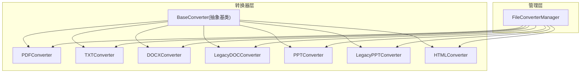
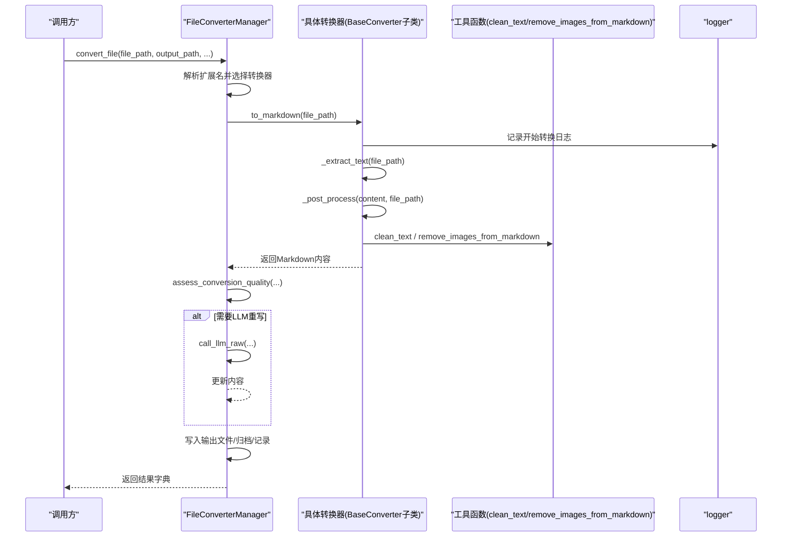
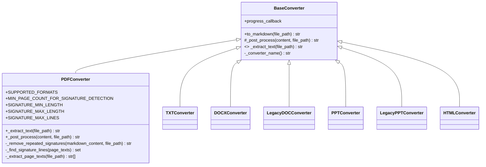
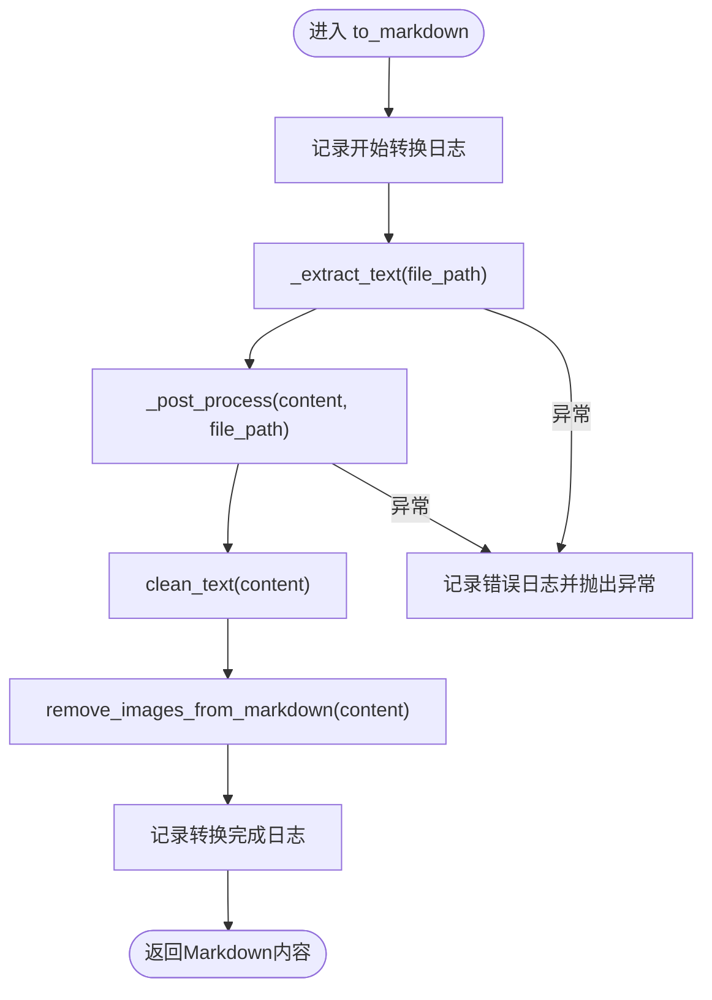
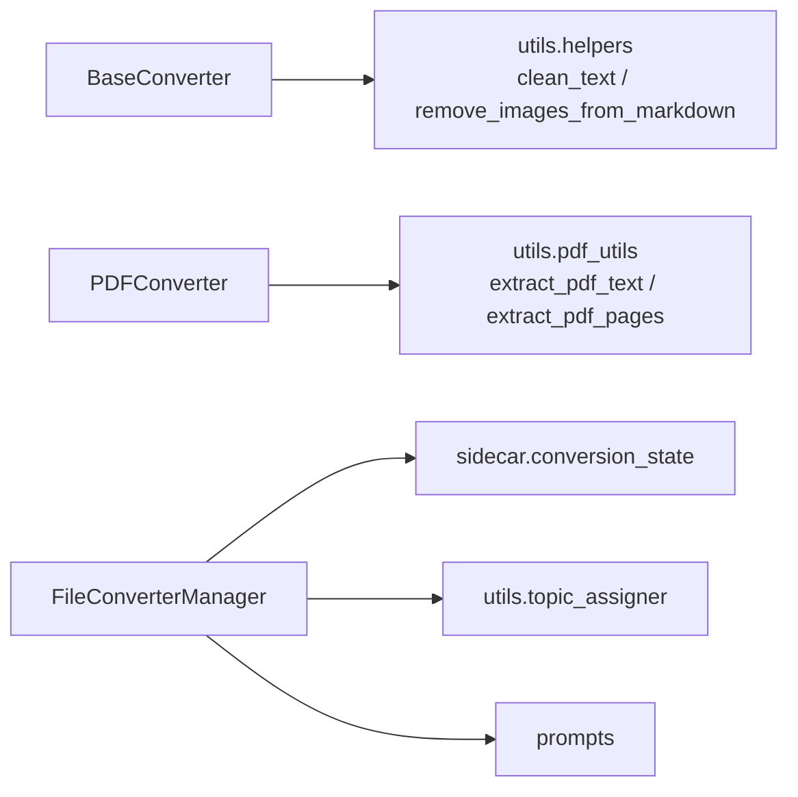

# 转换器基类设计

<cite>
**本文引用的文件**   
- [modules/file_converter.py](file://modules/file_converter.py)
- [tests/unit/test_file_converter.py](file://tests/unit/test_file_converter.py)
</cite>

## 目录
1. [简介](#简介)
2. [项目结构](#项目结构)
3. [核心组件](#核心组件)
4. [架构总览](#架构总览)
5. [详细组件分析](#详细组件分析)
6. [依赖关系分析](#依赖关系分析)
7. [性能考量](#性能考量)
8. [故障排查指南](#故障排查指南)
9. [结论](#结论)
10. [附录：自定义转换器开发指南](#附录自定义转换器开发指南)

## 简介
本文件围绕“转换器基类”的设计与实现，系统性阐述 BaseConverter 抽象基类的模板方法模式、to_markdown 的统一处理流程（日志记录、异常处理、文本清理）、_post_process 钩子机制、进度回调机制的使用方式，以及错误处理策略与日志规范。同时提供子类继承示例与自定义转换器的开发指南，帮助读者快速扩展新的文件格式支持。

## 项目结构
与转换器相关的代码集中在模块 file_converter.py 中，包含：
- BaseConverter 抽象基类：定义统一转换流程与可覆盖的后处理钩子
- 多种具体转换器：PDFConverter、TXTConverter、DOCXConverter、LegacyDOCConverter、PPTConverter、LegacyPPTConverter、HTMLConverter
- FileConverterManager：负责按扩展名选择转换器、批量/文件夹转换、质量评估、主题分配、原始文件归档等

图表来源
- [modules/file_converter.py:27-405](file://modules/file_converter.py#L27-L405)
- [modules/file_converter.py:407-862](file://modules/file_converter.py#L407-L862)

章节来源
- [modules/file_converter.py:27-405](file://modules/file_converter.py#L27-L405)
- [modules/file_converter.py:407-862](file://modules/file_converter.py#L407-L862)

## 核心组件
- BaseConverter：定义 to_markdown 模板方法与 _post_process 钩子；统一日志与异常处理；可选 progress_callback 用于进度上报。
- 具体转换器：通过实现 _extract_text 完成特定格式的文本提取；可按需覆盖 _post_process 插入格式特定的后处理步骤。
- FileConverterManager：根据扩展名选择具体转换器，组织批量/文件夹转换流程，进行质量评估、LLM 重写、YAML front matter 注入、主题自动分配、原始文件归档等。

章节来源
- [modules/file_converter.py:27-69](file://modules/file_converter.py#L27-L69)
- [modules/file_converter.py:72-405](file://modules/file_converter.py#L72-L405)
- [modules/file_converter.py:407-862](file://modules/file_converter.py#L407-L862)

## 架构总览
下图展示了从调用方到具体转换器的完整调用链，包括日志、异常、后处理与质量评估等关键节点。

图表来源
- [modules/file_converter.py:44-69](file://modules/file_converter.py#L44-L69)
- [modules/file_converter.py:569-730](file://modules/file_converter.py#L569-L730)

## 详细组件分析

### BaseConverter 抽象基类
- 设计模式：模板方法模式。to_markdown 固定了整体流程，将可变部分下沉为 _extract_text 和 _post_process。
- 统一处理流程（to_markdown）：
  - 日志记录：在转换开始前与完成后分别记录信息日志；发生异常时记录错误日志并向上抛出。
  - 文本提取：调用 _extract_text 获取原始 Markdown 文本。
  - 后处理：调用 _post_process 执行通用清理与图片移除，子类可覆盖以插入额外步骤。
  - 异常处理：捕获所有异常，记录错误日志并重新抛出，确保上层能感知失败。
- 进度回调机制：
  - 构造函数接受 progress_callback，但 BaseConverter.to_markdown 本身不直接调用它。
  - 实际进度上报由 FileConverterManager.convert_batch 在循环中调用，传入当前索引与总数，以及描述性消息。
- 可扩展点：
  - _extract_text：必须实现，负责具体格式的文本提取。
  - _post_process：可选覆盖，用于插入格式特定的后处理逻辑（例如 PDF 的签名/页眉页脚去除）。

图表来源
- [modules/file_converter.py:27-69](file://modules/file_converter.py#L27-L69)
- [modules/file_converter.py:72-158](file://modules/file_converter.py#L72-L158)
- [modules/file_converter.py:160-405](file://modules/file_converter.py#L160-L405)

章节来源
- [modules/file_converter.py:27-69](file://modules/file_converter.py#L27-L69)
- [modules/file_converter.py:72-158](file://modules/file_converter.py#L72-L158)
- [modules/file_converter.py:160-405](file://modules/file_converter.py#L160-L405)

### 统一处理流程：to_markdown
- 日志记录：
  - 开始转换：记录转换器名称与输入路径。
  - 转换完成：记录成功信息。
  - 异常：记录错误信息与异常详情，并向上抛出。
- 文本清理与图片移除：
  - 默认 _post_process 会先执行 clean_text，再执行 remove_images_from_markdown。
  - PDFConverter 覆盖了 _post_process，在清理之后增加重复签名/页眉页脚的检测与移除。
- 异常处理：
  - 任何阶段抛出的异常都会被捕获并记录，然后继续向上抛出，保证调用方能感知失败并进行后续处理。

图表来源
- [modules/file_converter.py:44-69](file://modules/file_converter.py#L44-L69)
- [modules/file_converter.py:60-64](file://modules/file_converter.py#L60-L64)
- [modules/file_converter.py:87-92](file://modules/file_converter.py#L87-L92)

章节来源
- [modules/file_converter.py:44-69](file://modules/file_converter.py#L44-L69)
- [modules/file_converter.py:60-64](file://modules/file_converter.py#L60-L64)
- [modules/file_converter.py:87-92](file://modules/file_converter.py#L87-L92)

### _post_process 钩子与扩展机制
- 作用：
  - 提供统一的文本清理与图片移除入口。
  - 允许子类插入额外的后处理步骤（如 PDF 的签名/页眉页脚去重）。
- 扩展机制：
  - 子类覆盖 _post_process，在调用父类通用逻辑之前或之后插入自定义步骤。
  - PDFConverter 展示了如何在清理后、图片移除前加入签名检测与移除逻辑。

章节来源
- [modules/file_converter.py:60-64](file://modules/file_converter.py#L60-L64)
- [modules/file_converter.py:87-92](file://modules/file_converter.py#L87-L92)

### 进度回调机制
- 原理：
  - BaseConverter 接收 progress_callback，但不在 to_markdown 内部使用。
  - FileConverterManager.convert_batch 在遍历文件列表时，对每个文件调用 progress_callback(i+1, total, message)，并在全部完成后再次调用一次汇总消息。
- 使用建议：
  - 上层在构造 FileConverterManager 时传入进度回调函数，即可在批量转换过程中获得实时进度。

章节来源
- [modules/file_converter.py:37-38](file://modules/file_converter.py#L37-38)
- [modules/file_converter.py:732-770](file://modules/file_converter.py#L732-L770)

### 错误处理策略与日志记录规范
- 错误处理策略：
  - 具体转换器的 _extract_text 可能抛出异常（如外部工具不可用、文件损坏），会被 to_markdown 捕获并记录错误日志后向上抛出。
  - FileConverterManager.convert_file 捕获异常并将错误信息写入结果字典，同时记录错误日志。
- 日志记录规范：
  - 使用 logger.info 记录开始与完成信息。
  - 使用 logger.error 记录失败信息，包含转换器名称与异常详情。
  - 对于非致命问题（如 LLM 重写失败、主题分配失败），使用 logger.warning 记录，不影响主流程。

章节来源
- [modules/file_converter.py:44-58](file://modules/file_converter.py#L44-L58)
- [modules/file_converter.py:726-729](file://modules/file_converter.py#L726-L729)

## 依赖关系分析
- 内部依赖：
  - BaseConverter 依赖 utils.helpers.clean_text 与 remove_images_from_markdown 进行文本清理与图片移除。
  - PDFConverter 依赖 utils.pdf_utils.extract_pdf_text 与 extract_pdf_pages 进行 PDF 文本与页面提取。
  - FileConverterManager 依赖 sidecar.conversion_state 进行转换记录，依赖 utils.topic_assigner 进行主题分配，依赖 prompts 中的提示词进行 LLM 重写。
- 外部依赖：
  - mammoth（DOCX 转 Markdown）
  - python-pptx（PPTX 文本与表格提取）
  - html2text（HTML 转 Markdown）
  - olefile（旧版 .ppt 二进制解析）
  - fitz（PyMuPDF，PDF 打开与页面文本读取）

图表来源
- [modules/file_converter.py:11-24](file://modules/file_converter.py#L11-L24)
- [modules/file_converter.py:83-96](file://modules/file_converter.py#L83-L96)
- [modules/file_converter.py:609-610](file://modules/file_converter.py#L609-L610)
- [modules/file_converter.py:694-696](file://modules/file_converter.py#L694-L696)
- [modules/file_converter.py:647-652](file://modules/file_converter.py#L647-L652)

章节来源
- [modules/file_converter.py:11-24](file://modules/file_converter.py#L11-L24)
- [modules/file_converter.py:83-96](file://modules/file_converter.py#L83-L96)
- [modules/file_converter.py:609-610](file://modules/file_converter.py#L609-L610)
- [modules/file_converter.py:694-696](file://modules/file_converter.py#L694-L696)
- [modules/file_converter.py:647-652](file://modules/file_converter.py#L647-L652)

## 性能考量
- 懒加载转换器：FileConverterManager 的属性访问采用懒加载，避免不必要的实例化开销。
- 重复转换规避：基于源文件摘要与已有输出路径判断是否跳过转换，减少重复计算。
- 质量评估前置：在保存前进行质量评估，低质量内容直接拒绝，避免无效 I/O。
- 可选 LLM 重写：仅在内容较短且结构不完整时尝试，降低不必要的外部调用成本。

[本节为一般性指导，不涉及具体文件分析]

## 故障排查指南
- 常见错误与定位：
  - 外部工具缺失：LegacyDOCConverter 依赖 textutil/antiword/catdoc，LegacyPPTConverter 依赖 olefile。若报错找不到工具，请安装对应系统工具或 Python 包。
  - 扫描型 PDF 无法提取正文：assess_conversion_quality 会识别疑似扫描 PDF 并拒绝，建议改用 OCR 方案或更换源文件。
  - 并发冲突导致输出覆盖：convert_file 已实现文件名自增以避免覆盖；测试用例验证了并发场景下的正确行为。
- 日志定位：
  - 查看 logger.error 与 logger.warning 的输出，确认失败原因与上下文。
  - 关注“转换失败”、“移动文件到Raw失败”、“自动分配主题失败”等关键字。

章节来源
- [modules/file_converter.py:183-251](file://modules/file_converter.py#L183-L251)
- [modules/file_converter.py:289-387](file://modules/file_converter.py#L289-L387)
- [modules/file_converter.py:509-534](file://modules/file_converter.py#L509-L534)
- [modules/file_converter.py:726-729](file://modules/file_converter.py#L726-L729)
- [tests/unit/test_file_converter.py:65-97](file://tests/unit/test_file_converter.py#L65-L97)

## 结论
BaseConverter 通过模板方法模式提供了统一的转换流程与可扩展的后处理钩子，结合 FileConverterManager 的管理能力，实现了多格式文件的稳定转换、质量控制与自动化归档。开发者只需实现 _extract_text 并可按需覆盖 _post_process，即可快速扩展新的转换器。

[本节为总结性内容，不涉及具体文件分析]

## 附录：自定义转换器开发指南
- 基本步骤：
  - 新建一个类继承 BaseConverter。
  - 实现 _extract_text(file_path) -> str，返回目标格式的 Markdown 文本。
  - 如需格式特定的后处理，覆盖 _post_process(content, file_path) -> str，在调用通用清理与图片移除前后插入自定义逻辑。
  - 可选：设置 _display_name 以便日志显示更友好的名称。
- 集成到管理器：
  - 在 FileConverterManager 中添加新格式常量与映射，或在 _get_converter 中增加分支。
  - 更新 get_supported_formats 以包含新扩展名。
- 测试建议：
  - 编写单元测试模拟 _extract_text 的行为，验证 to_markdown 的日志与异常处理。
  - 针对并发场景，验证输出文件不会相互覆盖。
  - 针对低质量内容，验证质量评估与拒绝逻辑。

章节来源
- [modules/file_converter.py:27-69](file://modules/file_converter.py#L27-L69)
- [modules/file_converter.py:407-507](file://modules/file_converter.py#L407-L507)
- [tests/unit/test_file_converter.py:35-63](file://tests/unit/test_file_converter.py#L35-L63)
- [tests/unit/test_file_converter.py:65-97](file://tests/unit/test_file_converter.py#L65-L97)
- [tests/unit/test_file_converter.py:135-151](file://tests/unit/test_file_converter.py#L135-L151)