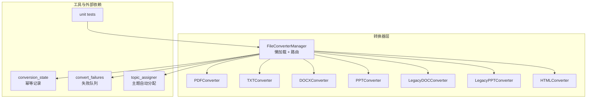
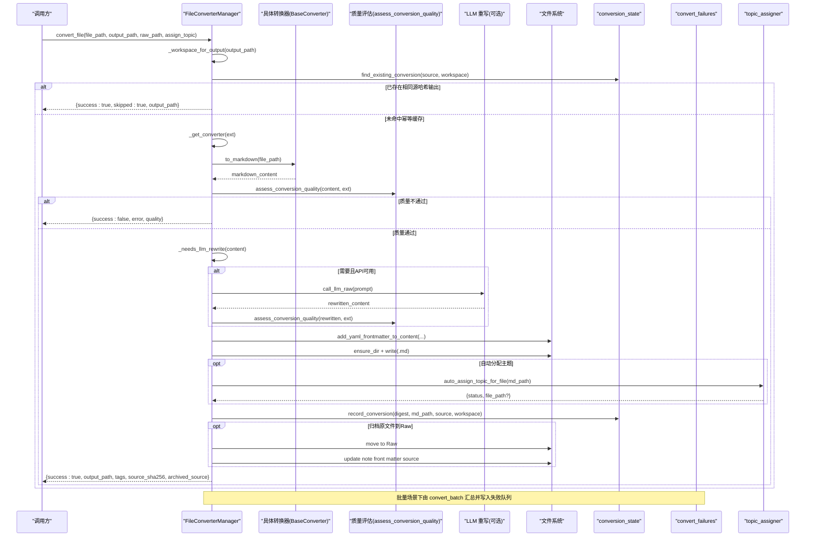
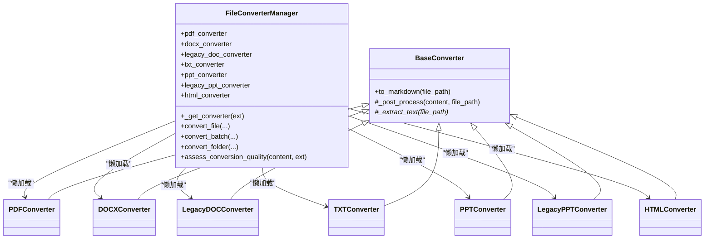
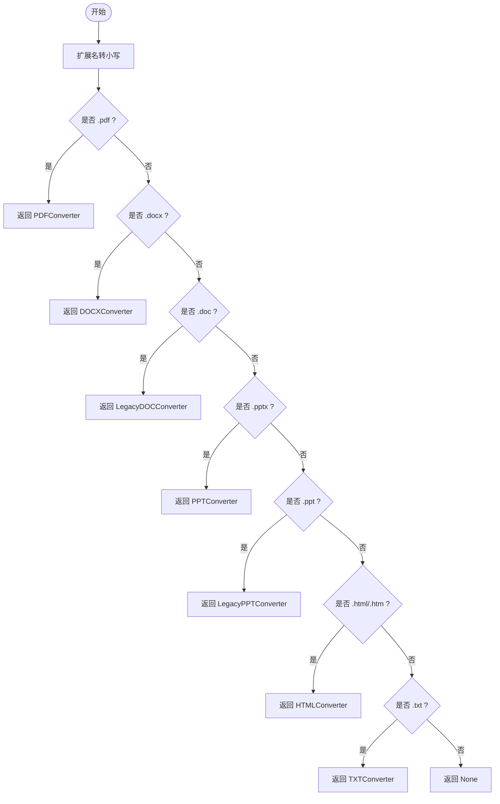
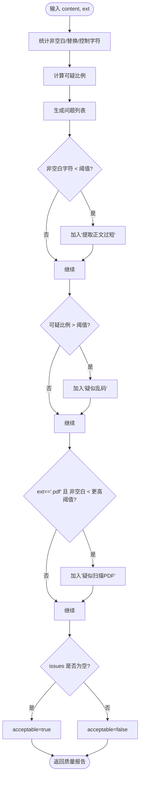
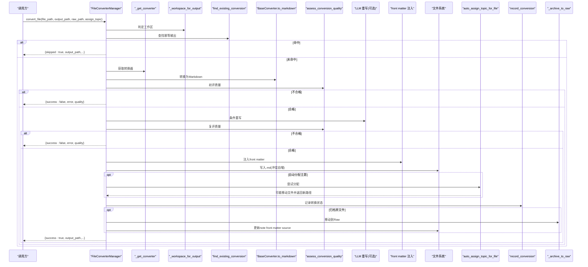
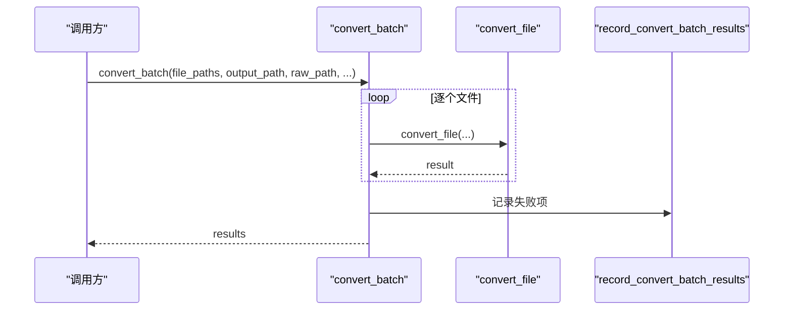
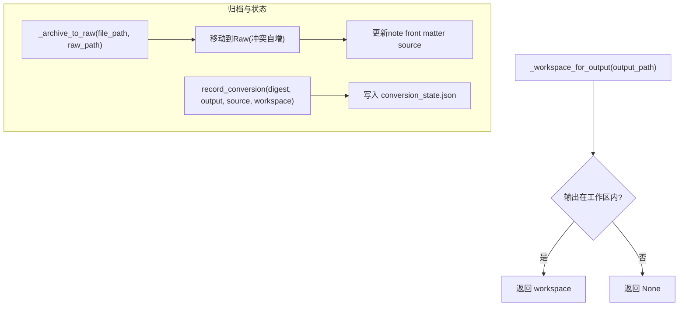
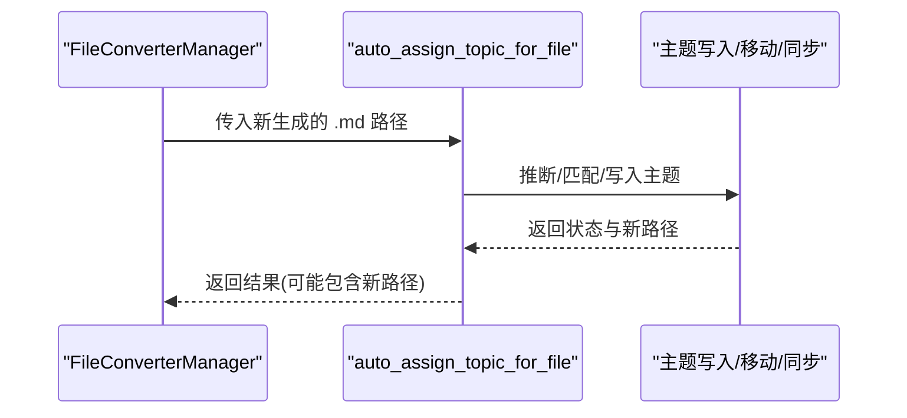
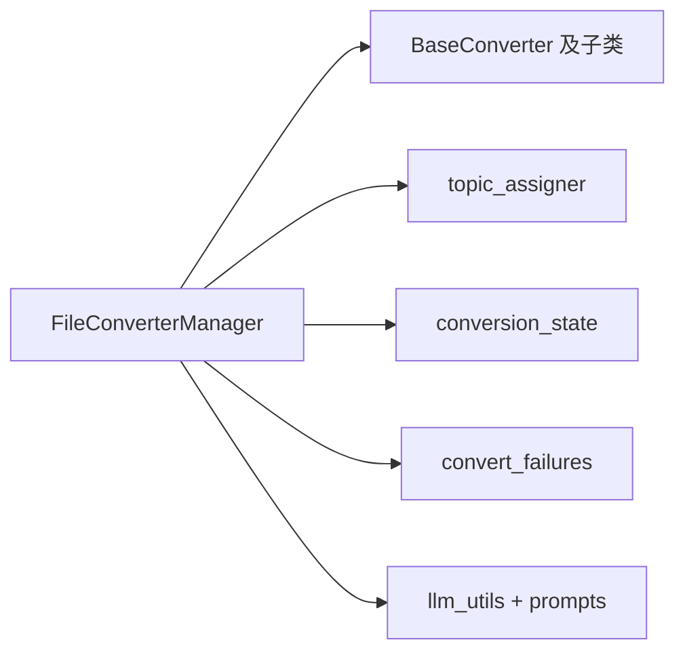

# 转换器管理器

<cite>
**本文引用的文件**
- [modules/file_converter.py](file://modules/file_converter.py)
- [python/sidecar/conversion_state.py](file://python/sidecar/conversion_state.py)
- [python/sidecar/convert_failures.py](file://python/sidecar/convert_failures.py)
- [utils/topic_assigner.py](file://utils/topic_assigner.py)
- [tests/unit/test_file_converter.py](file://tests/unit/test_file_converter.py)
</cite>

## 目录
1. [简介](#简介)
2. [项目结构](#项目结构)
3. [核心组件](#核心组件)
4. [架构总览](#架构总览)
5. [详细组件分析](#详细组件分析)
6. [依赖关系分析](#依赖关系分析)
7. [性能考量](#性能考量)
8. [故障排查指南](#故障排查指南)
9. [结论](#结论)
10. [附录](#附录)

## 简介
本技术文档聚焦于“转换器管理器”的实现与工作机制，围绕 FileConverterManager 的懒加载机制、转换器路由逻辑、格式匹配算法、质量评估（含乱码检测、扫描PDF识别、内容完整性检查）、单文件与批量转换流程（包含 LLM 重写集成、YAML front matter 添加、主题自动分配）、工作区路径验证、源文件归档、转换状态记录与幂等性、以及批量转换的性能优化与错误恢复策略进行系统性说明。

## 项目结构
与转换器管理器直接相关的代码主要分布在以下模块：
- 转换器基类与各格式转换器实现、管理器主类：modules/file_converter.py
- 转换状态与幂等性记录：python/sidecar/conversion_state.py
- 批量转换失败结果持久化：python/sidecar/convert_failures.py
- 主题自动分配：utils/topic_assigner.py
- 单元测试覆盖关键行为：tests/unit/test_file_converter.py

图表来源
- [modules/file_converter.py:407-507](file://modules/file_converter.py#L407-L507)
- [python/sidecar/conversion_state.py:65-109](file://python/sidecar/conversion_state.py#L65-L109)
- [python/sidecar/convert_failures.py:83-100](file://python/sidecar/convert_failures.py#L83-L100)
- [utils/topic_assigner.py:318-327](file://utils/topic_assigner.py#L318-L327)
- [tests/unit/test_file_converter.py:35-98](file://tests/unit/test_file_converter.py#L35-L98)

章节来源
- [modules/file_converter.py:407-507](file://modules/file_converter.py#L407-L507)
- [python/sidecar/conversion_state.py:65-109](file://python/sidecar/conversion_state.py#L65-L109)
- [python/sidecar/convert_failures.py:83-100](file://python/sidecar/convert_failures.py#L83-L100)
- [utils/topic_assigner.py:318-327](file://utils/topic_assigner.py#L318-L327)
- [tests/unit/test_file_converter.py:35-98](file://tests/unit/test_file_converter.py#L35-L98)

## 核心组件
- BaseConverter 模板方法：统一日志、异常处理、文本清理与图片移除；子类仅实现 _extract_text。
- 各格式转换器：PDF/TXT/DOCX/PPT/Legacy DOC/Legacy PPT/HTML，分别封装具体提取逻辑。
- FileConverterManager：
  - 懒加载属性：按需实例化具体转换器，避免不必要的依赖导入与初始化开销。
  - 路由与匹配：_get_converter 基于扩展名选择对应转换器。
  - 质量评估：assess_conversion_quality 对提取内容进行质量判定。
  - 单文件转换：convert_file 串联路由、质量评估、可选 LLM 重写、front matter 注入、保存、主题分配、归档与状态记录。
  - 批量转换：convert_batch 顺序执行并记录失败项。
  - 文件夹转换：convert_folder 递归收集可转换文件后委托 convert_batch。

章节来源
- [modules/file_converter.py:27-70](file://modules/file_converter.py#L27-L70)
- [modules/file_converter.py:72-405](file://modules/file_converter.py#L72-L405)
- [modules/file_converter.py:407-507](file://modules/file_converter.py#L407-L507)
- [modules/file_converter.py:509-534](file://modules/file_converter.py#L509-L534)
- [modules/file_converter.py:569-730](file://modules/file_converter.py#L569-L730)
- [modules/file_converter.py:732-770](file://modules/file_converter.py#L732-L770)
- [modules/file_converter.py:812-848](file://modules/file_converter.py#L812-L848)

## 架构总览
下图展示了从调用入口到最终落盘与记录的端到端流程，包括幂等去重、质量门控、LLM 重写、front matter 注入、主题分配与原始文件归档。

图表来源
- [modules/file_converter.py:569-730](file://modules/file_converter.py#L569-L730)
- [python/sidecar/conversion_state.py:65-109](file://python/sidecar/conversion_state.py#L65-L109)
- [python/sidecar/convert_failures.py:83-100](file://python/sidecar/convert_failures.py#L83-L100)
- [utils/topic_assigner.py:318-327](file://utils/topic_assigner.py#L318-L327)

## 详细组件分析

### 懒加载机制与转换器路由
- 懒加载：管理器以属性形式暴露各转换器实例，首次访问时创建对象，后续复用，降低启动成本与依赖耦合。
- 路由匹配：_get_converter 根据小写扩展名在预定义集合中匹配，返回对应转换器或 None。

图表来源
- [modules/file_converter.py:407-507](file://modules/file_converter.py#L407-L507)
- [modules/file_converter.py:27-70](file://modules/file_converter.py#L27-L70)
- [modules/file_converter.py:72-405](file://modules/file_converter.py#L72-L405)

章节来源
- [modules/file_converter.py:407-507](file://modules/file_converter.py#L407-L507)

### 格式匹配算法与转换器选择策略
- 输入规范化：将扩展名转为小写。
- 精确匹配：按优先级依次判断是否属于 PDF/DOCX/旧版DOC/PPT/旧版PPT/HTML/TXT 集合。
- 未匹配：返回 None，上层将报告“不支持的文件格式”。

图表来源
- [modules/file_converter.py:490-507](file://modules/file_converter.py#L490-L507)

章节来源
- [modules/file_converter.py:490-507](file://modules/file_converter.py#L490-L507)

### 质量评估算法 assess_conversion_quality
该静态方法对提取后的 Markdown 文本进行保守的质量判定，用于决定是否允许进入知识库。

- 指标计算
  - 非空白字符计数
  - 替换字符（U+FFFD）计数
  - 控制字符计数（排除换行/回车/制表符）
  - 可疑比例 = (替换字符 + 控制字符) / max(非空白字符, 1)
- 问题清单
  - 正文过短：非空白字符少于阈值
  - 疑似乱码：可疑比例超过阈值
  - 疑似扫描 PDF：扩展名为 .pdf 且非空白字符低于更高阈值
- 决策
  - acceptable = not issues

图表来源
- [modules/file_converter.py:509-534](file://modules/file_converter.py#L509-L534)

章节来源
- [modules/file_converter.py:509-534](file://modules/file_converter.py#L509-L534)

### 单文件转换流程 convert_file
整体流程要点：
- 路径与存在性校验
- 扩展名解析与转换器路由
- 工作区判定与幂等去重（find_existing_conversion）
- 调用转换器 to_markdown
- 初次质量评估，不通过则直接拒绝
- 条件触发 LLM 重写（长度限制、API 可用性），再次质量评估
- 注入 YAML front matter（tags、source、source_sha256）
- 安全落盘（冲突文件名自增后缀）
- 可选自动主题分配（auto_assign_topic_for_file），若移动则更新输出路径
- 记录转换状态（record_conversion）
- 可选归档原文件到 Raw，并更新笔记 front matter 中的 source 字段
- 返回结构化结果（成功/跳过/失败、输出路径、标签、摘要、归档路径等）

图表来源
- [modules/file_converter.py:569-730](file://modules/file_converter.py#L569-L730)
- [python/sidecar/conversion_state.py:65-109](file://python/sidecar/conversion_state.py#L65-L109)
- [utils/topic_assigner.py:318-327](file://utils/topic_assigner.py#L318-L327)

章节来源
- [modules/file_converter.py:569-730](file://modules/file_converter.py#L569-L730)
- [python/sidecar/conversion_state.py:65-109](file://python/sidecar/conversion_state.py#L65-L109)
- [utils/topic_assigner.py:318-327](file://utils/topic_assigner.py#L318-L327)

### 批量转换流程 convert_batch
- 顺序遍历文件，逐项调用 convert_file
- 支持进度回调（progress_callback）
- 结束后汇总成功数并回调完成
- 将结果列表写入失败队列（record_convert_batch_results），便于重试与审计

图表来源
- [modules/file_converter.py:732-770](file://modules/file_converter.py#L732-L770)
- [python/sidecar/convert_failures.py:83-100](file://python/sidecar/convert_failures.py#L83-L100)

章节来源
- [modules/file_converter.py:732-770](file://modules/file_converter.py#L732-L770)
- [python/sidecar/convert_failures.py:83-100](file://python/sidecar/convert_failures.py#L83-L100)

### 工作区路径验证、源文件归档与转换状态记录
- 工作区验证：_workspace_for_output 确保输出位于配置的工作区内，否则返回 None，影响后续相对路径处理。
- 幂等记录：conversion_state 维护 source_sha256 -> output 映射，重复源可直接复用已有输出，避免重复转换。
- 源文件归档：_archive_to_raw 将原文件移动到 Raw 目录（避免重复移动、冲突命名），并在笔记 front matter 中更新 source 字段为归档路径。
- 状态落盘：record_conversion 原子写入 JSON 状态文件，保证并发安全。

图表来源
- [modules/file_converter.py:536-548](file://modules/file_converter.py#L536-L548)
- [modules/file_converter.py:772-810](file://modules/file_converter.py#L772-L810)
- [python/sidecar/conversion_state.py:65-109](file://python/sidecar/conversion_state.py#L65-L109)

章节来源
- [modules/file_converter.py:536-548](file://modules/file_converter.py#L536-L548)
- [modules/file_converter.py:772-810](file://modules/file_converter.py#L772-L810)
- [python/sidecar/conversion_state.py:65-109](file://python/sidecar/conversion_state.py#L65-L109)

### 主题自动分配
- 入口：auto_assign_topic_for_file
- 策略：优先从 Notes 子目录推断主题；若文件位于 Inbox 孤儿路径，则结合标题、标签、候选主题与 LLM 建议进行匹配；满足阈值则自动写入主题并移动文件至目标目录；否则进入待处理队列。
- 集成点：convert_file 在保存后调用，若返回移动结果则更新输出路径。

图表来源
- [utils/topic_assigner.py:318-327](file://utils/topic_assigner.py#L318-L327)
- [modules/file_converter.py:692-704](file://modules/file_converter.py#L692-L704)

章节来源
- [utils/topic_assigner.py:318-327](file://utils/topic_assigner.py#L318-L327)
- [modules/file_converter.py:692-704](file://modules/file_converter.py#L692-L704)

## 依赖关系分析
- 内部依赖
  - FileConverterManager 依赖 BaseConverter 及其子类完成具体格式转换。
  - 依赖 utils.topic_assigner 进行主题自动分配。
  - 依赖 sidecar.conversion_state 进行幂等记录与查找。
  - 依赖 sidecar.convert_failures 在批量场景记录失败项。
- 外部依赖
  - 各转换器依赖第三方库（如 PyMuPDF、mammoth、pptx、olefile、html2text 等）。
  - LLM 重写依赖 utils.llm_utils 与 prompts 模块。

图表来源
- [modules/file_converter.py:407-507](file://modules/file_converter.py#L407-L507)
- [utils/topic_assigner.py:318-327](file://utils/topic_assigner.py#L318-L327)
- [python/sidecar/conversion_state.py:65-109](file://python/sidecar/conversion_state.py#L65-L109)
- [python/sidecar/convert_failures.py:83-100](file://python/sidecar/convert_failures.py#L83-L100)

章节来源
- [modules/file_converter.py:407-507](file://modules/file_converter.py#L407-L507)
- [utils/topic_assigner.py:318-327](file://utils/topic_assigner.py#L318-L327)
- [python/sidecar/conversion_state.py:65-109](file://python/sidecar/conversion_state.py#L65-L109)
- [python/sidecar/convert_failures.py:83-100](file://python/sidecar/convert_failures.py#L83-L100)

## 性能考量
- 懒加载：仅在首次使用时实例化具体转换器，减少启动时间与依赖导入成本。
- 幂等去重：基于 source_sha256 的转换状态记录，避免重复转换与重复 IO。
- 质量前置：先做轻量质量评估，快速拒绝低质内容，减少后续 LLM 调用与 IO。
- 条件 LLM 重写：仅在内容较短或缺乏段落/标点时触发，并对长度做上限限制，降低大模型调用成本。
- 批量顺序执行：convert_batch 串行处理，简化资源竞争与状态一致性；可通过外部并发调度器并行多个批次。
- 失败队列：convert_failures 持久化失败项，支持离线重试与审计，提高系统鲁棒性。

[本节为通用指导，无需源码引用]

## 故障排查指南
- 常见错误与定位
  - 不支持的文件格式：检查扩展名是否在支持集合内，确认 _get_converter 返回值。
  - 质量不通过：查看 quality 字段中的 issues，关注“提取正文过短”“疑似乱码”“疑似扫描 PDF”。
  - LLM 重写失败：保留原始转换结果，检查 API 配置与网络连通性。
  - 主题分配失败：查看 topic_assigner 返回的状态与消息，必要时手动调整主题或等待待处理队列。
  - 归档失败：检查 Raw 目录权限与磁盘空间，确认 _archive_to_raw 是否抛出异常。
  - 幂等状态不一致：核对 conversion_state.json 内容与 Notes 目录下文件的 front matter 中 source_sha256。
- 调试建议
  - 启用日志：关注转换开始/结束、签名移除、归档移动、主题分配等关键日志。
  - 使用单元测试：参考 test_file_converter 中对并发写保护、跳过重复转换、扫描 PDF 拒绝等用例进行回归验证。

章节来源
- [modules/file_converter.py:569-730](file://modules/file_converter.py#L569-L730)
- [modules/file_converter.py:732-770](file://modules/file_converter.py#L732-L770)
- [python/sidecar/conversion_state.py:65-109](file://python/sidecar/conversion_state.py#L65-L109)
- [python/sidecar/convert_failures.py:83-100](file://python/sidecar/convert_failures.py#L83-L100)
- [tests/unit/test_file_converter.py:135-175](file://tests/unit/test_file_converter.py#L135-L175)

## 结论
FileConverterManager 通过懒加载与清晰的路由策略，实现了多格式文件的统一转换入口；借助质量评估与可选 LLM 重写，提升了产出内容的可读性与可用性；配合工作区验证、幂等状态记录、源文件归档与主题自动分配，构建了稳健的入库流水线；批量转换辅以失败队列，兼顾了效率与可恢复性。整体设计遵循模块化与可扩展原则，便于新增格式转换器与增强质量门控。

[本节为总结性内容，无需源码引用]

## 附录
- 支持的格式集合可通过 get_supported_formats 获取，涵盖 PDF、DOCX、旧版 DOC、PPTX、旧版 PPT、HTML、TXT。
- 批量转换接口 convert_batch 返回每个文件的详细结果，便于前端展示与重试操作。
- 单元测试覆盖了并发写保护、跳过重复转换、扫描 PDF 拒绝、延迟主题分配等关键行为，可作为集成测试参考。

章节来源
- [modules/file_converter.py:850-861](file://modules/file_converter.py#L850-L861)
- [modules/file_converter.py:732-770](file://modules/file_converter.py#L732-L770)
- [tests/unit/test_file_converter.py:65-98](file://tests/unit/test_file_converter.py#L65-L98)
- [tests/unit/test_file_converter.py:154-175](file://tests/unit/test_file_converter.py#L154-L175)