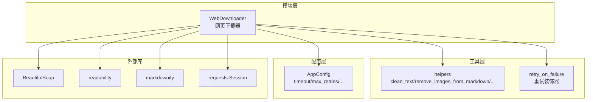
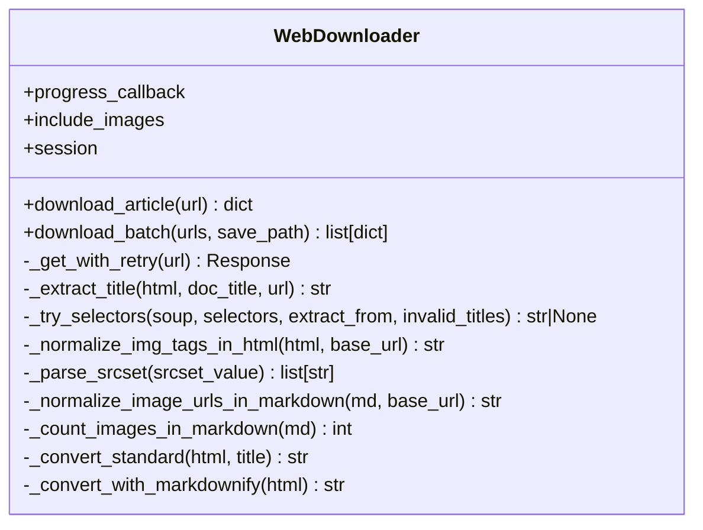
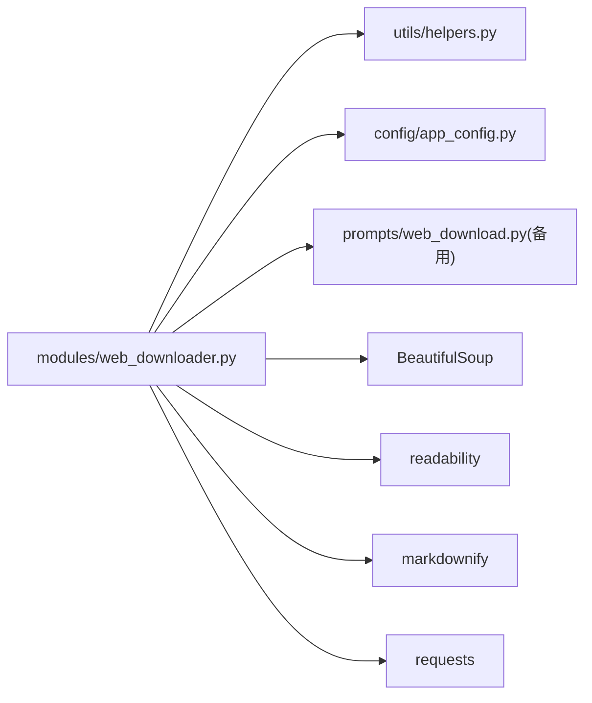

# 网页下载器

<cite>
**本文引用的文件**
- [modules/web_downloader.py](file://modules/web_downloader.py)
- [utils/helpers.py](file://utils/helpers.py)
- [config/app_config.py](file://config/app_config.py)
- [prompts/web_download.py](file://prompts/web_download.py)
</cite>

## 目录
1. [简介](#简介)
2. [项目结构](#项目结构)
3. [核心组件](#核心组件)
4. [架构总览](#架构总览)
5. [详细组件分析](#详细组件分析)
6. [依赖关系分析](#依赖关系分析)
7. [性能与优化建议](#性能与优化建议)
8. [故障排除指南](#故障排除指南)
9. [结论](#结论)
10. [附录：使用示例与配置项](#附录使用示例与配置项)

## 简介
本模块提供网页内容抓取、反爬虫策略、内容提取算法、HTML 解析、文本清理与格式优化的完整流程，支持代理设置、请求头管理、重试机制等工程化能力。其目标是将任意网页稳定地转换为结构化 Markdown，并可选保留图片链接或移除图片，最终输出到工作区目录中，便于后续索引与检索。

## 项目结构
与网页下载器相关的代码主要分布在以下位置：
- 核心实现：modules/web_downloader.py
- 通用工具：utils/helpers.py（URL 校验、SSRF 防护、文本清理、重试装饰器等）
- 全局配置：config/app_config.py（超时、批量大小、是否包含图片等）
- 提示词模板：prompts/web_download.py（备用 LLM 转换提示词，实际默认走规则转换）



图表来源
- [modules/web_downloader.py:29-44](file://modules/web_downloader.py#L29-L44)
- [utils/helpers.py:26-48](file://utils/helpers.py#L26-L48)
- [utils/helpers.py:331-353](file://utils/helpers.py#L331-L353)
- [config/app_config.py:49-55](file://config/app_config.py#L49-L55)

章节来源
- [modules/web_downloader.py:1-538](file://modules/web_downloader.py#L1-L538)
- [utils/helpers.py:1-516](file://utils/helpers.py#L1-L516)
- [config/app_config.py:1-396](file://config/app_config.py#L1-L396)

## 核心组件
- WebDownloader：对外暴露的网页下载与处理入口，负责网络请求、HTML 预处理、标题提取、正文抽取、Markdown 转换、图片处理、保存与批处理。
- helpers.clean_text / remove_images_from_markdown：文本清洗与图片移除工具。
- helpers.retry_on_failure：通用重试装饰器，用于网络请求失败时的指数退避重试。
- AppConfig：集中式配置，包括 timeout、max_retries、web_include_images 等。

章节来源
- [modules/web_downloader.py:29-44](file://modules/web_downloader.py#L29-L44)
- [utils/helpers.py:26-48](file://utils/helpers.py#L26-L48)
- [utils/helpers.py:331-353](file://utils/helpers.py#L331-L353)
- [config/app_config.py:49-74](file://config/app_config.py#L49-L74)

## 架构总览
下图展示了从 URL 输入到 Markdown 输出的端到端流程，以及关键分支（图片保留/移除、HTML 预处理、标题提取、重试）。

```mermaid
sequenceDiagram
participant U as "调用方"
participant WD as "WebDownloader"
participant S as "requests.Session"
participant R as "readability.Document"
participant B as "BeautifulSoup"
participant M as "markdownify"
participant H as "helpers"
U->>WD : download_article(url, include_images?)
WD->>H : is_valid_url(url)
alt 无效URL
WD-->>U : {success : false, error}
else 有效URL
WD->>S : GET(url, timeout=config.timeout)<br/>@retry_on_failure(max_retries=3,delay=1.0)
S-->>WD : Response
WD->>WD : response.encoding = apparent_encoding or utf-8
opt include_images=True
WD->>B : 解析HTML并规范化img标签<br/>data-src/data-original/srcset -> src
WD-->>WD : 返回标准化HTML
end
WD->>R : Document(html).summary()
WD->>WD : _extract_title(html, doc.title, url)
WD->>M : markdownify(summary_html, heading_style="ATX")
WD->>H : clean_text(markdown)
opt include_images=True
WD->>WD : 将相对图片URL转为绝对URL
else include_images=False
WD->>H : remove_images_from_markdown(markdown)
end
WD-->>U : {success : true, title, content, html_content}
end
```

图表来源
- [modules/web_downloader.py:356-425](file://modules/web_downloader.py#L356-L425)
- [modules/web_downloader.py:441-444](file://modules/web_downloader.py#L441-L444)
- [modules/web_downloader.py:203-281](file://modules/web_downloader.py#L203-L281)
- [modules/web_downloader.py:316-347](file://modules/web_downloader.py#L316-L347)
- [utils/helpers.py:26-48](file://utils/helpers.py#L26-L48)
- [utils/helpers.py:331-353](file://utils/helpers.py#L331-L353)

## 详细组件分析

### 类与职责概览


图表来源
- [modules/web_downloader.py:29-538](file://modules/web_downloader.py#L29-L538)

章节来源
- [modules/web_downloader.py:29-538](file://modules/web_downloader.py#L29-L538)

### 网页内容抓取与反爬虫策略
- 会话与请求头：使用 requests.Session 复用连接，并设置浏览器级 User-Agent，降低被识别为爬虫的概率。
- SSRF 防护：在发起请求前通过 is_valid_url 进行域名/IP 合法性检查，阻止访问私有地址与回环地址。
- 编码自适应：根据响应 apparent_encoding 自动设置编码，减少乱码。
- 重试机制：对网络请求使用 @retry_on_failure 装饰器，最大重试次数与延迟可配置，采用指数退避。

章节来源
- [modules/web_downloader.py:42-44](file://modules/web_downloader.py#L42-L44)
- [modules/web_downloader.py:356-377](file://modules/web_downloader.py#L356-L377)
- [utils/helpers.py:235-277](file://utils/helpers.py#L235-L277)
- [utils/helpers.py:331-353](file://utils/helpers.py#L331-L353)
- [config/app_config.py:49-55](file://config/app_config.py#L49-L55)

### HTML 解析与正文抽取
- 标题提取：综合多种 meta 属性、页面 title、h1/h2/h3、平台特定选择器（微信、小红书、知乎等），按优先级尝试获取标题。
- 正文抽取：使用 readability 的 summary 方法提取正文 HTML，再经 markdownify 转换为 ATX 风格 Markdown。
- 标题补全：若转换后无标题行，则自动在开头插入一级标题。

章节来源
- [modules/web_downloader.py:45-175](file://modules/web_downloader.py#L45-L175)
- [modules/web_downloader.py:385-391](file://modules/web_downloader.py#L385-L391)
- [modules/web_downloader.py:427-439](file://modules/web_downloader.py#L427-L439)

### 图片处理与链接规范化
- HTML 阶段：遍历所有 img 标签，优先读取 data-src、data-original、srcset 等懒加载属性，解析 srcset 列表并取首图，统一写入 src 并删除冗余属性；同时把相对路径转为绝对 URL。
- Markdown 阶段：若开启“保留图片”，则将 Markdown 中的相对图片链接也转为绝对 URL；否则直接移除所有图片语法与引用定义。

章节来源
- [modules/web_downloader.py:203-281](file://modules/web_downloader.py#L203-L281)
- [modules/web_downloader.py:283-314](file://modules/web_downloader.py#L283-L314)
- [modules/web_downloader.py:316-347](file://modules/web_downloader.py#L316-L347)
- [utils/helpers.py:41-48](file://utils/helpers.py#L41-L48)

### 文本清理与格式优化
- 文本清理：去除控制字符、零宽字符、多余空白与连续空行，确保段落间距合理。
- 格式优化：保证标题层级规范、列表样式一致、代码块不被破坏；若无 H1 则自动添加。

章节来源
- [utils/helpers.py:26-38](file://utils/helpers.py#L26-L38)
- [utils/helpers.py:448-492](file://utils/helpers.py#L448-L492)
- [modules/web_downloader.py:396-409](file://modules/web_downloader.py#L396-L409)

### 代理设置与请求头管理
- 当前实现未内置代理参数注入。如需启用代理，可在 Session 级别设置 proxies 或在调用处传入。
- 请求头管理：已设置通用 User-Agent，可按需扩展更多头部（如 Referer、Accept-Language 等）。

章节来源
- [modules/web_downloader.py:42-44](file://modules/web_downloader.py#L42-L44)
- [modules/web_downloader.py:441-444](file://modules/web_downloader.py#L441-L444)

### 重试机制与错误处理
- 重试装饰器：基于 time.sleep 的指数退避，捕获异常并在达到最大重试次数后抛出最后一次异常。
- 异常分类：网络异常归类为 RequestException，其他异常归为处理异常，均记录日志并返回错误信息。

章节来源
- [utils/helpers.py:331-353](file://utils/helpers.py#L331-L353)
- [modules/web_downloader.py:417-424](file://modules/web_downloader.py#L417-L424)

### 批量下载与持久化
- 批量下载：逐条下载文章，支持进度回调；成功时生成带 YAML frontmatter 的 Markdown 文件，并将原始 HTML 保存到 Raw 目录。
- 标签同步：完成后尝试更新 tags.md（取决于工作区配置）。

章节来源
- [modules/web_downloader.py:446-533](file://modules/web_downloader.py#L446-L533)

## 依赖关系分析


图表来源
- [modules/web_downloader.py:1-27](file://modules/web_downloader.py#L1-L27)
- [modules/web_downloader.py:29-538](file://modules/web_downloader.py#L29-L538)

章节来源
- [modules/web_downloader.py:1-27](file://modules/web_downloader.py#L1-L27)

## 性能与优化建议
- 并发抓取：当前为串行下载，可通过线程池或异步 aiohttp 提升吞吐。注意遵守站点速率限制与反爬策略。
- 连接复用：已使用 Session，保持长连接可降低握手开销。
- 图片处理成本：大量图片会显著增加 CPU 与 I/O 开销，建议在不需要图片时关闭 include_images。
- 文本长度控制：结合 AppConfig 的 max_content_length 与 max_html_length 限制，避免超大页面导致内存压力。
- 重试退避：适当增大 delay 与 max_retries 以应对不稳定网络，但需权衡整体耗时。

[本节为通用建议，不直接分析具体文件]

## 故障排除指南
- 无法访问内网或本地地址：is_valid_url 会拒绝 localhost、私有 IP 与链路本地地址，属安全设计。请确认目标为公网可达地址。
- 频繁超时或 4xx/5xx：检查 config.timeout 与网络状况；必要时提高 max_retries 与 delay。
- 标题缺失或错误：检查页面是否包含标准 meta/title/h1；必要时扩展 _extract_title 的选择器集合。
- 图片丢失或链接失效：确认 include_images 开关；检查原站是否使用 CDN 或防盗链；必要时在 HTML 阶段补充 Referer 等头。
- 保存失败：检查工作区路径权限与磁盘空间；查看日志定位具体错误。

章节来源
- [utils/helpers.py:235-277](file://utils/helpers.py#L235-L277)
- [modules/web_downloader.py:417-424](file://modules/web_downloader.py#L417-L424)
- [config/app_config.py:49-55](file://config/app_config.py#L49-L55)

## 结论
该网页下载器以稳定性与可读性为核心目标，通过多策略标题提取、readability 正文抽取、严格的文本清理与图片处理，实现了从复杂网页到高质量 Markdown 的可靠转换。配合 SSRF 防护、重试与日志记录，具备生产可用性与可扩展性。

[本节为总结性内容，不直接分析具体文件]

## 附录：使用示例与配置项

### 基本用法
- 单页抓取：调用 download_article(url)，返回包含 success、title、content、html_content 等的字典。
- 批量抓取：调用 download_batch(urls, save_path)，结果写入 Notes 目录，并可选保存原始 HTML 到 Raw 目录。

章节来源
- [modules/web_downloader.py:356-425](file://modules/web_downloader.py#L356-L425)
- [modules/web_downloader.py:446-533](file://modules/web_downloader.py#L446-L533)

### 关键配置项
- timeout：网络请求超时秒数，默认 30。
- max_retries：重试次数，默认 3。
- web_include_images：是否在 Markdown 中保留图片链接，默认 False。
- web_save_path：批量保存根路径。
- download_mode：下载模式（standard 等）。

章节来源
- [config/app_config.py:49-74](file://config/app_config.py#L49-L74)

### 反爬虫最佳实践
- 设置合理的 User-Agent 与必要请求头。
- 控制请求频率，加入随机延时。
- 遇到 403/429 时触发重试与退避。
- 谨慎处理动态渲染页面，必要时引入 JS 执行环境（当前实现未内置）。

[本节为通用建议，不直接分析具体文件]