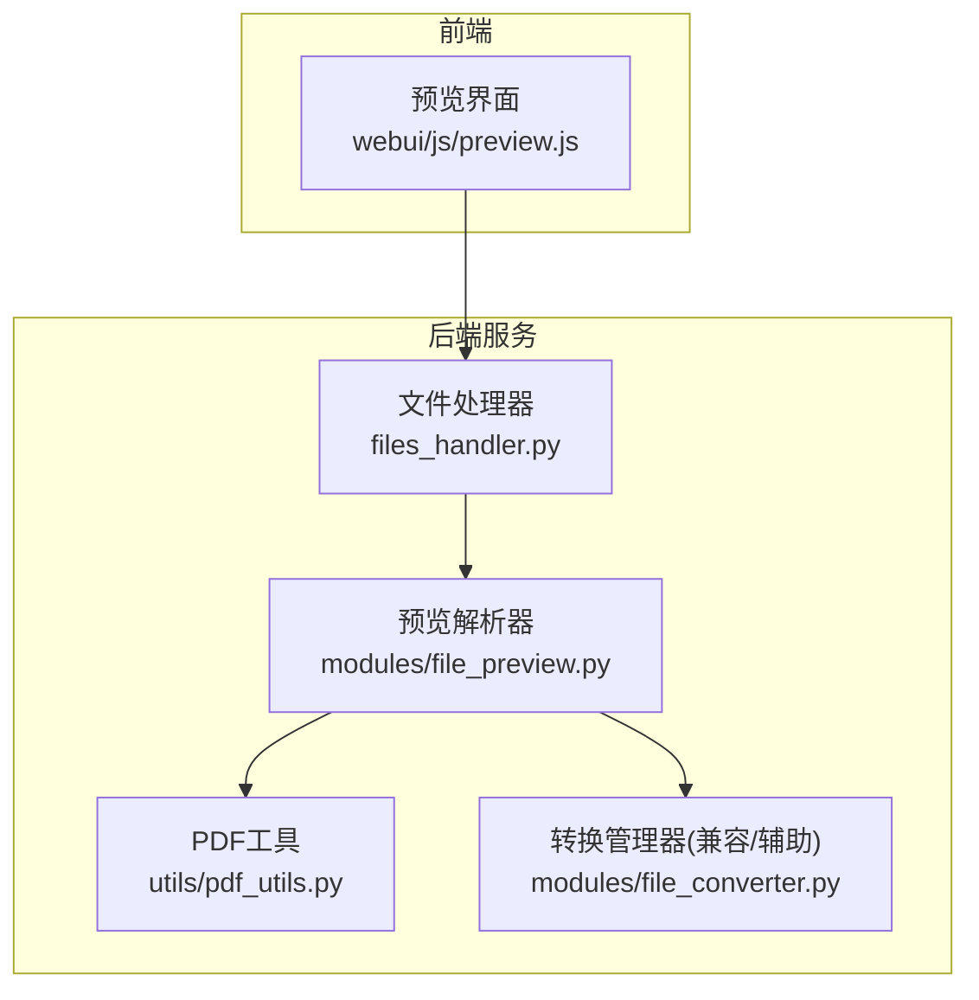
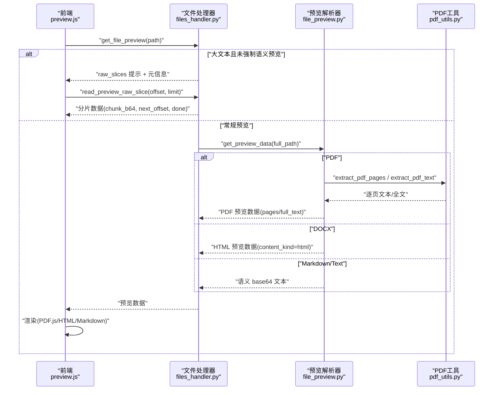
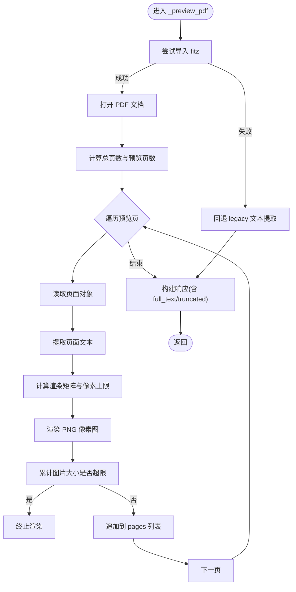
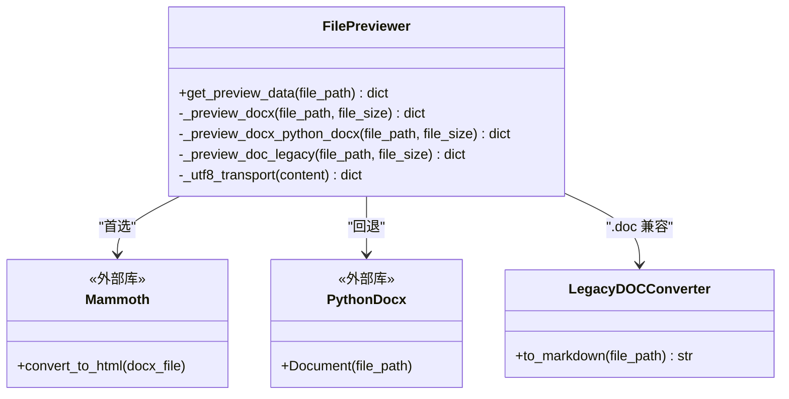
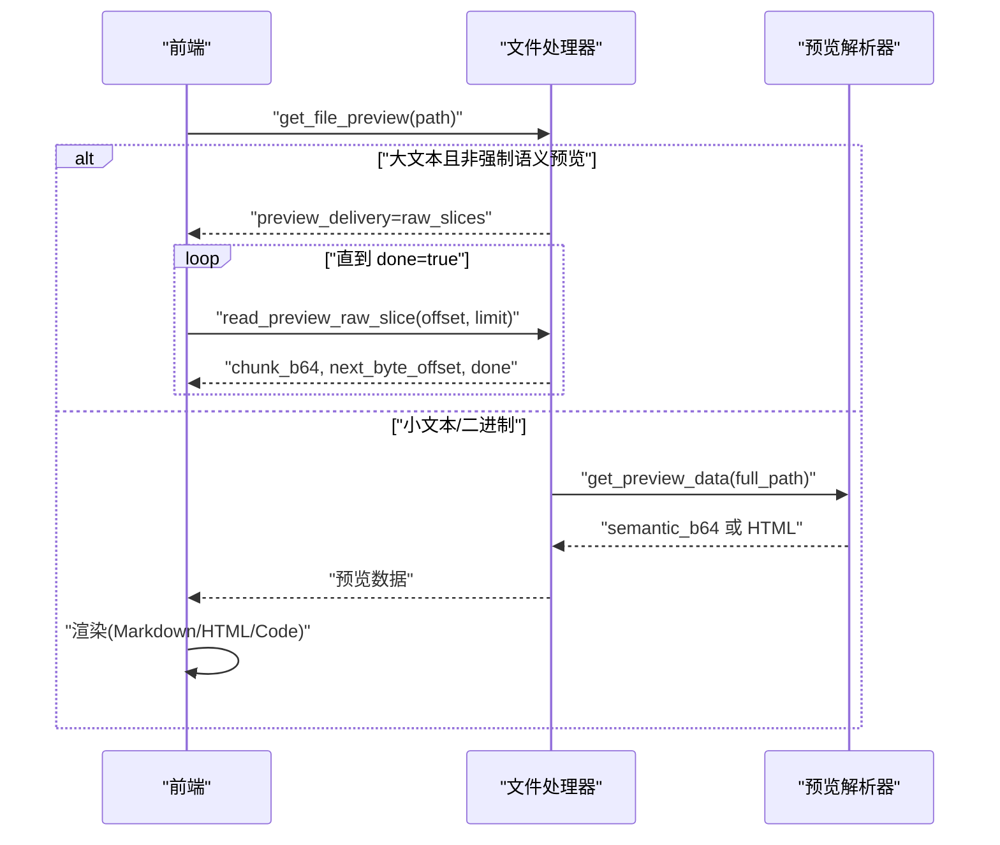
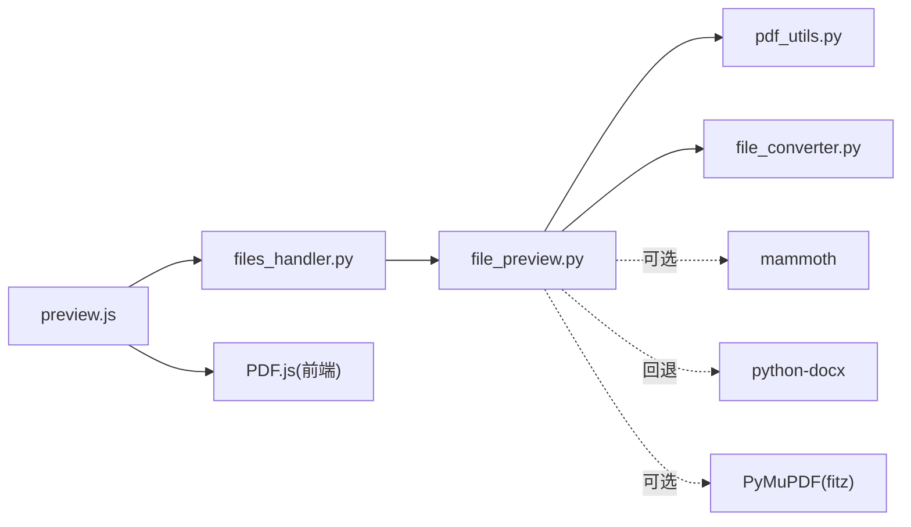

# 预览生成器

<cite>
**本文引用的文件**   
- [modules/file_preview.py](file://modules/file_preview.py)
- [webui/js/preview.js](file://webui/js/preview.js)
- [python/sidecar/handlers/files_handler.py](file://python/sidecar/handlers/files_handler.py)
- [utils/pdf_utils.py](file://utils/pdf_utils.py)
- [modules/file_converter.py](file://modules/file_converter.py)
- [utils/ttl_cache.py](file://utils/ttl_cache.py)
- [tests/unit/test_file_preview_docx.py](file://tests/unit/test_file_preview_docx.py)
</cite>

## 目录
1. [简介](#简介)
2. [项目结构](#项目结构)
3. [核心组件](#核心组件)
4. [架构总览](#架构总览)
5. [详细组件分析](#详细组件分析)
6. [依赖关系分析](#依赖关系分析)
7. [性能与内存管理](#性能与内存管理)
8. [故障排查指南](#故障排查指南)
9. [结论](#结论)
10. [附录：集成示例与调试方法](#附录集成示例与调试方法)

## 简介
本技术文档聚焦“预览生成器”模块，覆盖 PDF 分页渲染、DOCX 排版预览、HTML 内容预览的实现细节；阐述预览缓存机制、异步生成、内存管理等优化策略；说明不同格式的预览算法、渲染引擎选择与兼容性处理；并提供预览质量配置、自定义渲染规则、扩展开发接口、集成示例与调试方法。

## 项目结构
预览功能由后端处理器、预览解析器、前端渲染器三部分协作完成：
- 后端处理器负责路径解析、大小限制、原始流切片与调用预览器
- 预览解析器按文件类型执行具体解析（PDF/DOCX/TXT/Markdown）
- 前端根据返回的 payload 进行差异化渲染（PDF 使用 PDF.js，DOCX 以 HTML 渲染，文本类走 Markdown/纯文本）

图表来源
- [webui/js/preview.js:85-229](file://webui/js/preview.js#L85-L229)
- [python/sidecar/handlers/files_handler.py:42-67](file://python/sidecar/handlers/files_handler.py#L42-L67)
- [modules/file_preview.py:19-44](file://modules/file_preview.py#L19-L44)
- [utils/pdf_utils.py:25-39](file://utils/pdf_utils.py#L25-L39)
- [modules/file_converter.py:168-181](file://modules/file_converter.py#L168-L181)

章节来源
- [webui/js/preview.js:85-229](file://webui/js/preview.js#L85-L229)
- [python/sidecar/handlers/files_handler.py:42-67](file://python/sidecar/handlers/files_handler.py#L42-L67)
- [modules/file_preview.py:19-44](file://modules/file_preview.py#L19-L44)
- [utils/pdf_utils.py:25-39](file://utils/pdf_utils.py#L25-L39)
- [modules/file_converter.py:168-181](file://modules/file_converter.py#L168-L181)

## 核心组件
- 文件处理器（FilesHandler）
  - 职责：统一入口，解析路径、校验大小、对大文本采用 raw_slices 分片传输，其余交由 FilePreviewer 处理
  - 关键能力：get_file_preview、read_preview_raw_slice、can_preview_file、read_file_raw
- 预览解析器（FilePreviewer）
  - 职责：按扩展名分发到具体预览实现（Markdown/Text/PDF/DOCX/旧版 DOC）
  - 关键能力：get_preview_data、_preview_pdf、_preview_docx、_preview_doc_legacy、_utf8_transport
- PDF 工具（pdf_utils）
  - 职责：基于 PyMuPDF 提取 PDF 文本（逐页或全文）
- 转换管理器（FileConverterManager）
  - 职责：提供格式转换与质量评估（用于笔记入库等场景），为预览提供兼容与参考
- TTL 缓存（TTLCache）
  - 职责：线程安全的带过期与容量限制的字典缓存，可用于未来扩展的预览结果缓存

章节来源
- [python/sidecar/handlers/files_handler.py:42-106](file://python/sidecar/handlers/files_handler.py#L42-L106)
- [modules/file_preview.py:9-44](file://modules/file_preview.py#L9-L44)
- [utils/pdf_utils.py:25-39](file://utils/pdf_utils.py#L25-L39)
- [modules/file_converter.py:407-534](file://modules/file_converter.py#L407-L534)
- [utils/ttl_cache.py:8-72](file://utils/ttl_cache.py#L8-L72)

## 架构总览
以下序列图展示一次完整的“获取文件预览”流程，包括大文本分片与 PDF 直读两种分支。

图表来源
- [webui/js/preview.js:85-229](file://webui/js/preview.js#L85-L229)
- [python/sidecar/handlers/files_handler.py:42-106](file://python/sidecar/handlers/files_handler.py#L42-L106)
- [modules/file_preview.py:79-169](file://modules/file_preview.py#L79-L169)
- [utils/pdf_utils.py:25-39](file://utils/pdf_utils.py#L25-L39)

## 详细组件分析

### PDF 分页渲染
- 渲染引擎
  - 首选：PyMuPDF（fitz）将页面渲染为 PNG 像素图，并附带每页文本；若不可用则回退至 legacy 模式仅提取文本
  - 前端：PDF.js 在 Canvas 上渲染当前页，支持缩放与键盘翻页
- 分页与质量
  - 最大预览页数限制、单页像素上限、总图片字节数上限，防止超大页面导致内存溢出
  - 当页面尺寸过大时自动降低渲染比例
- 数据结构
  - pages 数组包含 page_number、text、image(base64)、width、height
  - full_text 为所有页面文本拼接
  - truncated 表示是否因页数限制被截断

图表来源
- [modules/file_preview.py:79-169](file://modules/file_preview.py#L79-L169)
- [utils/pdf_utils.py:25-39](file://utils/pdf_utils.py#L25-L39)

章节来源
- [modules/file_preview.py:79-169](file://modules/file_preview.py#L79-L169)
- [utils/pdf_utils.py:25-39](file://utils/pdf_utils.py#L25-L39)
- [webui/js/preview.js:231-379](file://webui/js/preview.js#L231-L379)

### DOCX 排版预览
- 渲染引擎
  - 首选：mammoth 将 DOCX 转为 HTML，保留标题层级与表格等基础结构
  - 回退：python-docx 手动构造 HTML（段落、标题、表格）
- 输出形式
  - content_kind = "html"，content 通过 base64_utf8 传输，前端使用 DOMPurify 净化后直接渲染
- 兼容性
  - 若 mammoth 缺失或转换结果为空，自动回退 python-docx 路径
  - 旧版 .doc 通过 LegacyDOCConverter 转 Markdown 再预览

图表来源
- [modules/file_preview.py:171-264](file://modules/file_preview.py#L171-L264)
- [modules/file_converter.py:183-251](file://modules/file_converter.py#L183-L251)

章节来源
- [modules/file_preview.py:171-264](file://modules/file_preview.py#L171-L264)
- [modules/file_converter.py:183-251](file://modules/file_converter.py#L183-L251)
- [tests/unit/test_file_preview_docx.py:36-49](file://tests/unit/test_file_preview_docx.py#L36-L49)

### HTML 内容预览
- 文本类（Markdown/Text）
  - 后端以 base64_utf8 传输，前端优先使用编辑器模块渲染 Markdown，否则回退为纯文本
- 代码/JSON/XML/HTML
  - 前端使用语法高亮库进行着色显示
- 大文本分片
  - 对于大体积 UTF-8 文本，后端返回 raw_slices 提示，前端循环读取分片拼接

图表来源
- [python/sidecar/handlers/files_handler.py:42-106](file://python/sidecar/handlers/files_handler.py#L42-L106)
- [modules/file_preview.py:55-77](file://modules/file_preview.py#L55-L77)
- [webui/js/preview.js:419-496](file://webui/js/preview.js#L419-L496)

章节来源
- [python/sidecar/handlers/files_handler.py:42-106](file://python/sidecar/handlers/files_handler.py#L42-L106)
- [modules/file_preview.py:55-77](file://modules/file_preview.py#L55-L77)
- [webui/js/preview.js:419-496](file://webui/js/preview.js#L419-L496)

## 依赖关系分析
- 内部依赖
  - files_handler.py → file_preview.py（预览主逻辑）
  - file_preview.py → pdf_utils.py（PDF 文本提取）
  - file_preview.py → file_converter.py（旧版 .doc 兼容）
- 外部依赖
  - PDF：PyMuPDF（fitz）、PDF.js（前端）
  - DOCX：mammoth、python-docx
  - 文本：chardet/编码探测（通过 helpers.read_file_with_encoding）
- 测试依赖
  - test_file_preview_docx.py 验证 DOCX 预览返回 HTML 与 transport 协议

图表来源
- [python/sidecar/handlers/files_handler.py:42-67](file://python/sidecar/handlers/files_handler.py#L42-L67)
- [modules/file_preview.py:79-264](file://modules/file_preview.py#L79-L264)
- [utils/pdf_utils.py:25-39](file://utils/pdf_utils.py#L25-L39)
- [modules/file_converter.py:183-251](file://modules/file_converter.py#L183-L251)
- [webui/js/preview.js:231-379](file://webui/js/preview.js#L231-L379)

章节来源
- [python/sidecar/handlers/files_handler.py:42-67](file://python/sidecar/handlers/files_handler.py#L42-L67)
- [modules/file_preview.py:79-264](file://modules/file_preview.py#L79-L264)
- [utils/pdf_utils.py:25-39](file://utils/pdf_utils.py#L25-L39)
- [modules/file_converter.py:183-251](file://modules/file_converter.py#L183-L251)
- [webui/js/preview.js:231-379](file://webui/js/preview.js#L231-L379)

## 性能与内存管理
- 内存保护
  - PDF 渲染：单页像素上限、总图片字节上限、最大预览页数，避免 OOM
  - 大文本：raw_slices 分片传输，避免一次性加载大文件
- 渲染效率
  - PDF 按需渲染当前页，关闭/切换时销毁 PDF 实例与事件监听
  - DOCX 优先使用 mammoth 生成结构化 HTML，减少前端二次加工成本
- 可扩展缓存
  - 提供 TTLCache（线程安全、LRU 淘汰、可配 TTL 与容量），可作为未来预览结果缓存的基础设施
- 建议
  - 对高频访问的 PDF/DOCX 可引入基于文件哈希的 TTL 缓存，结合前端请求去重（当前已有 requestId 防竞态）

章节来源
- [modules/file_preview.py:85-148](file://modules/file_preview.py#L85-L148)
- [python/sidecar/handlers/files_handler.py:42-106](file://python/sidecar/handlers/files_handler.py#L42-L106)
- [webui/js/preview.js:511-564](file://webui/js/preview.js#L511-L564)
- [utils/ttl_cache.py:8-72](file://utils/ttl_cache.py#L8-L72)

## 故障排查指南
- PDF 预览失败
  - 检查 PyMuPDF 是否可用；若不可用会回退 legacy 文本提取
  - 关注日志中的错误信息，确认是否触发像素/大小限制
- DOCX 预览失败
  - 若 mammoth 缺失或转换结果为空，将回退 python-docx；查看 warnings 字段
  - 旧版 .doc 需要系统工具（textutil/antiword/catdoc）之一
- 大文本无法完整预览
  - 使用 read_preview_raw_slice 拉取分片，确保 offset 与 limit 正确
- 前端渲染异常
  - PDF.js worker 路径是否正确；DOMPurify 是否可用；编辑器模块是否就绪

章节来源
- [modules/file_preview.py:150-169](file://modules/file_preview.py#L150-L169)
- [modules/file_preview.py:171-264](file://modules/file_preview.py#L171-L264)
- [python/sidecar/handlers/files_handler.py:42-106](file://python/sidecar/handlers/files_handler.py#L42-L106)
- [webui/js/preview.js:231-379](file://webui/js/preview.js#L231-L379)

## 结论
预览生成器在后端通过统一的处理器与解析器，针对不同格式选择合适的渲染引擎与回退策略；在前端实现差异化的渲染与交互。整体设计兼顾了性能与稳定性，具备清晰的扩展点与良好的容错性。

## 附录：集成示例与调试方法
- 集成示例
  - 前端调用 get_file_preview 获取预览数据；若是 raw_slices，则循环调用 read_preview_raw_slice 直至 done=true
  - PDF 使用 read_file_raw 获取二进制，再由 PDF.js 渲染
- 调试方法
  - 观察后端日志定位解析失败原因
  - 前端控制台查看网络响应结构与错误信息
  - 针对 DOCX，检查返回的 warnings 字段定位转换问题
  - 针对 PDF，检查 total_pages、truncated、pages 长度是否符合预期

章节来源
- [webui/js/preview.js:85-229](file://webui/js/preview.js#L85-229)
- [python/sidecar/handlers/files_handler.py:156-173](file://python/sidecar/handlers/files_handler.py#L156-L173)
- [modules/file_preview.py:171-264](file://modules/file_preview.py#L171-L264)