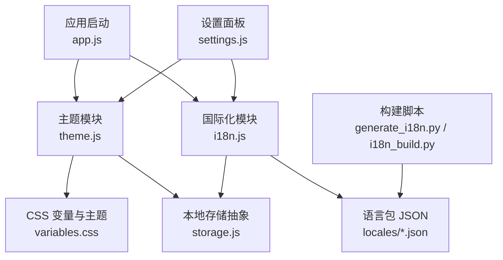
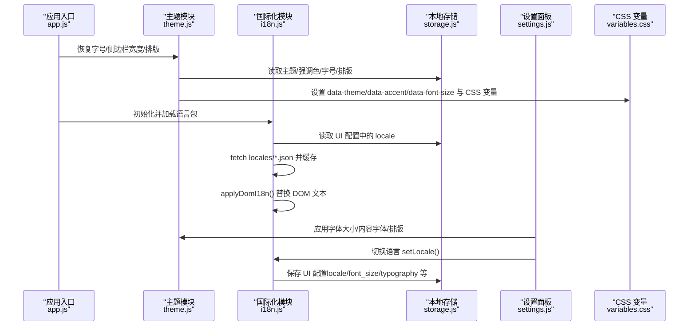
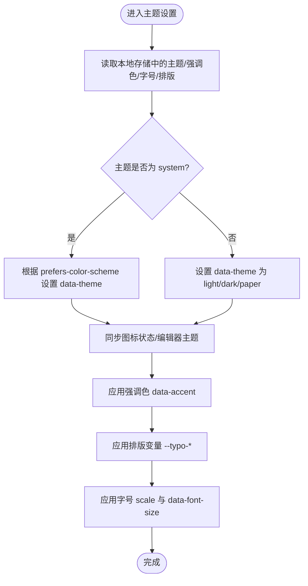
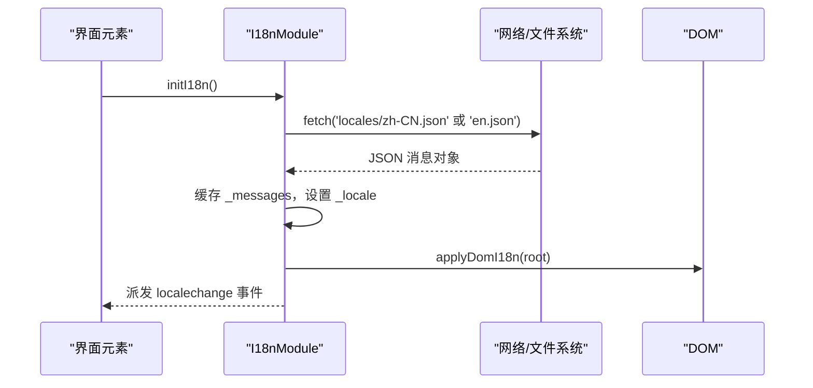
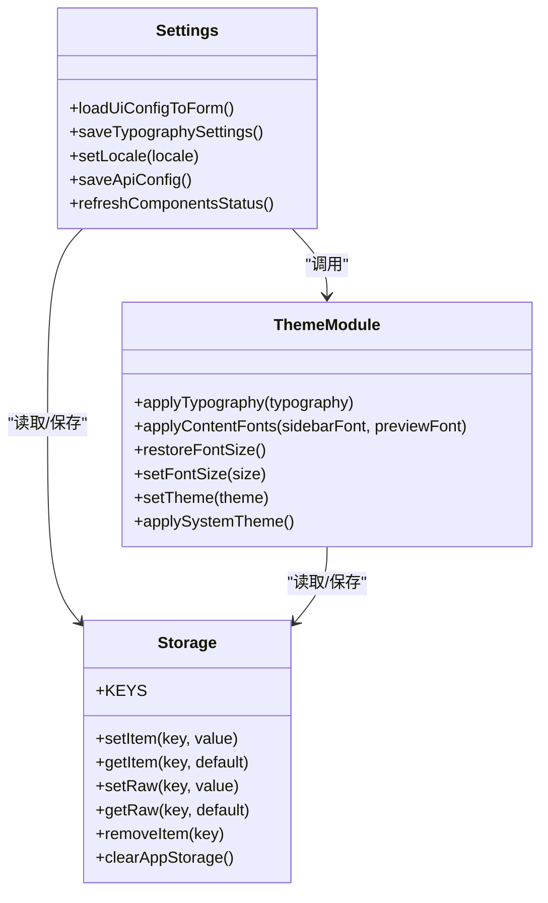
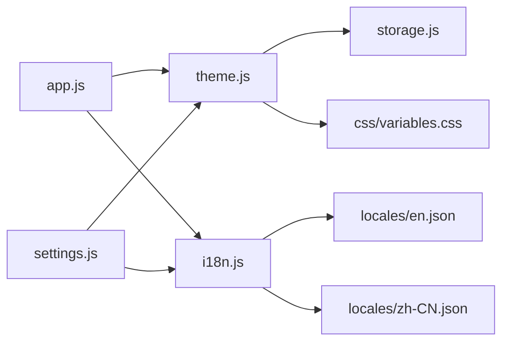

# 主题与国际化

<cite>
**本文引用的文件**   
- [webui/js/theme.js](file://webui/js/theme.js)
- [webui/css/variables.css](file://webui/css/variables.css)
- [webui/js/i18n.js](file://webui/js/i18n.js)
- [webui/locales/en.json](file://webui/locales/en.json)
- [webui/locales/zh-CN.json](file://webui/locales/zh-CN.json)
- [webui/js/settings.js](file://webui/js/settings.js)
- [webui/js/storage.js](file://webui/js/storage.js)
- [webui/js/app.js](file://webui/js/app.js)
- [scripts/generate_i18n.py](file://scripts/generate_i18n.py)
- [scripts/i18n_build.py](file://scripts/i18n_build.py)
</cite>

## 目录
1. [简介](#简介)
2. [项目结构](#项目结构)
3. [核心组件](#核心组件)
4. [架构总览](#架构总览)
5. [详细组件分析](#详细组件分析)
6. [依赖关系分析](#依赖关系分析)
7. [性能考虑](#性能考虑)
8. [故障排查指南](#故障排查指南)
9. [结论](#结论)
10. [附录](#附录)

## 简介
本技术文档围绕“主题与国际化系统”的实现进行深入解析，涵盖：
- 主题切换机制：深色/浅色/纸质模式、强调色、跟随系统主题检测、字体大小与排版定制。
- CSS 变量管理：变量命名规范、作用域、动态注入与覆盖策略。
- 动态样式加载：运行时通过属性选择器与变量更新实现无刷新换肤。
- 国际化框架集成：多语言 JSON 文件结构、翻译键值管理、DOM 自动替换与运行时切换。
- 用户偏好设置：持久化到本地存储并与后端 UI 配置同步。
- 最佳实践与开发指南：主题扩展方法、CSS 变量规范、翻译文件维护流程与示例。

## 项目结构
前端主题与国际化相关的关键位置如下：
- 主题逻辑：webui/js/theme.js
- 样式变量与主题定义：webui/css/variables.css
- 国际化运行时：webui/js/i18n.js
- 多语言资源：webui/locales/*.json
- 设置面板与偏好保存：webui/js/settings.js
- 本地存储抽象层：webui/js/storage.js
- 应用初始化入口（调用主题恢复等）：webui/js/app.js
- 构建脚本（生成/构建 i18n）：scripts/generate_i18n.py、scripts/i18n_build.py

图表来源
- [webui/js/app.js:1-200](file://webui/js/app.js#L1-L200)
- [webui/js/theme.js:1-458](file://webui/js/theme.js#L1-L458)
- [webui/js/i18n.js:1-126](file://webui/js/i18n.js#L1-L126)
- [webui/css/variables.css:1-379](file://webui/css/variables.css#L1-L379)
- [webui/js/storage.js:1-159](file://webui/js/storage.js#L1-L159)
- [webui/js/settings.js:1-800](file://webui/js/settings.js#L1-L800)
- [scripts/generate_i18n.py:1-152](file://scripts/generate_i18n.py#L1-L152)
- [scripts/i18n_build.py:1-200](file://scripts/i18n_build.py#L1-L200)

章节来源
- [webui/js/app.js:1-200](file://webui/js/app.js#L1-L200)
- [webui/js/theme.js:1-458](file://webui/js/theme.js#L1-L458)
- [webui/js/i18n.js:1-126](file://webui/js/i18n.js#L1-L126)
- [webui/css/variables.css:1-379](file://webui/css/variables.css#L1-L379)
- [webui/js/storage.js:1-159](file://webui/js/storage.js#L1-L159)
- [webui/js/settings.js:1-800](file://webui/js/settings.js#L1-L800)
- [scripts/generate_i18n.py:1-152](file://scripts/generate_i18n.py#L1-L152)
- [scripts/i18n_build.py:1-200](file://scripts/i18n_build.py#L1-L200)

## 核心组件
- 主题模块（ThemeModule）
  - 负责主题切换（light/dark/system/paper）、强调色、字号缩放、侧边栏宽度、内容字体与排版角色（h1/h2/h3/body/quote）的运行时控制。
  - 通过 documentElement 的属性 data-theme、data-accent、data-font-size 以及 CSS 变量 --font-scale、--sidebar-font-family、--preview-font-family、--typo-*-font-* 驱动样式。
  - 监听系统主题变化并同步编辑器主题。
- 国际化模块（I18nModule）
  - 提供 window.t(key, params) 接口，支持嵌套键路径与参数替换。
  - 支持 DOM 数据属性批量替换：data-i18n、data-i18n-placeholder、data-i18n-title、data-i18n-aria、data-i18n-html。
  - 从 locales 目录按需加载 en.json 或 zh-CN.json，并在切换后触发 localechange 事件。
- 设置面板（Settings）
  - 读取/保存 UI 配置（包括语言、字体大小、内容字体、排版、RAG 与 CLI Agent 等）。
  - 与 ThemeModule 协作，将用户偏好应用到页面并持久化。
- 本地存储抽象（Storage）
  - 统一封装 localStorage 操作，提供 setItem/getItem/setRaw/getRaw/removeItem/clearAppStorage 等方法，集中管理键名常量。
- 构建脚本（i18n 工具链）
  - generate_i18n.py：扫描 JS 中的中文文本，自动生成 zh-CN.json 与占位 en.json。
  - i18n_build.py：基于 catalog 构建语义化 JSON，并可对 HTML/JS 进行补丁（当前仓库中已产出完整 JSON 文件）。

章节来源
- [webui/js/theme.js:1-458](file://webui/js/theme.js#L1-L458)
- [webui/js/i18n.js:1-126](file://webui/js/i18n.js#L1-L126)
- [webui/js/settings.js:1-800](file://webui/js/settings.js#L1-L800)
- [webui/js/storage.js:1-159](file://webui/js/storage.js#L1-L159)
- [scripts/generate_i18n.py:1-152](file://scripts/generate_i18n.py#L1-L152)
- [scripts/i18n_build.py:1-200](file://scripts/i18n_build.py#L1-L200)

## 架构总览
主题与国际化在运行时的交互关系如下：

图表来源
- [webui/js/app.js:1-200](file://webui/js/app.js#L1-L200)
- [webui/js/theme.js:1-458](file://webui/js/theme.js#L1-L458)
- [webui/js/i18n.js:1-126](file://webui/js/i18n.js#L1-L126)
- [webui/js/settings.js:1-800](file://webui/js/settings.js#L1-L800)
- [webui/js/storage.js:1-159](file://webui/js/storage.js#L1-L159)
- [webui/css/variables.css:1-379](file://webui/css/variables.css#L1-L379)

## 详细组件分析

### 主题模块（ThemeModule）
- 主题切换
  - 支持 light、dark、system、paper 四种主题；system 模式下监听 prefers-color-scheme 变化并同步。
  - 通过设置 documentElement 的 data-theme 属性驱动 CSS 变量覆盖。
- 强调色（Accent）
  - 支持 theme、blue、rust、teal、plum 五种强调色；通过 data-accent 属性覆盖主色及相关交互色。
- 字号与排版
  - 字号 scale：small/medium/large，映射为 --font-scale 与 html[data-font-size] 规则。
  - 内容字体：侧边栏与预览区可分别指定 system/sans/serif/mono。
  - 排版角色：h1/h2/h3/body/quote 可独立设置 family 与 style（normal/bold/italic/bold-italic），写入 CSS 变量 --typo-*-font-*。
- 侧边栏宽度与拖拽
  - 记录并恢复侧边栏宽度，限制最小/最大范围。
- 编辑器主题联动
  - 切换主题时通知 EditorModule.updateEditorTheme 以同步编辑器外观。

图表来源
- [webui/js/theme.js:1-458](file://webui/js/theme.js#L1-L458)
- [webui/css/variables.css:1-379](file://webui/css/variables.css#L1-L379)

章节来源
- [webui/js/theme.js:1-458](file://webui/js/theme.js#L1-L458)
- [webui/css/variables.css:1-379](file://webui/css/variables.css#L1-L379)

### 国际化模块（I18nModule）
- 键值解析
  - t(key, params) 支持点号分隔的嵌套键与 {param} 占位符替换。
- 语言包加载
  - 默认 zh-CN，若传入 en 则加载 en.json；失败时回退为原始 key。
- DOM 替换
  - 支持 data-i18n、data-i18n-placeholder、data-i18n-title、data-i18n-aria、data-i18n-html 等属性批量替换。
- 事件与就绪
  - 加载完成后派发 localechange 事件；whenReady(fn) 保证回调在语言就绪后执行。
- 与设置面板集成
  - setLocale(locale) 会保存 UI 配置中的 locale，并重新渲染界面。

图表来源
- [webui/js/i18n.js:1-126](file://webui/js/i18n.js#L1-L126)
- [webui/locales/zh-CN.json:1-800](file://webui/locales/zh-CN.json#L1-L800)
- [webui/locales/en.json:1-800](file://webui/locales/en.json#L1-L800)

章节来源
- [webui/js/i18n.js:1-126](file://webui/js/i18n.js#L1-L126)
- [webui/locales/zh-CN.json:1-800](file://webui/locales/zh-CN.json#L1-L800)
- [webui/locales/en.json:1-800](file://webui/locales/en.json#L1-L800)

### 设置面板与偏好持久化（Settings + Storage）
- 偏好项
  - 语言（locale）、字体大小（font_size）、内容字体（sidebar_font_family、preview_font_family）、排版（typography）、RAG/CLI Agent 等。
- 持久化
  - 通过 window.api.saveUiConfig 保存至后端；同时使用 Storage 本地缓存部分关键值（如主题、强调色、字号、侧边栏宽度）。
- 表单与实时应用
  - 修改后立即调用 ThemeModule.applyTypography/applyContentFonts/setFontSize 等，确保即时生效。

图表来源
- [webui/js/settings.js:1-800](file://webui/js/settings.js#L1-L800)
- [webui/js/theme.js:1-458](file://webui/js/theme.js#L1-L458)
- [webui/js/storage.js:1-159](file://webui/js/storage.js#L1-L159)

章节来源
- [webui/js/settings.js:1-800](file://webui/js/settings.js#L1-L800)
- [webui/js/storage.js:1-159](file://webui/js/storage.js#L1-L159)

### 构建脚本与翻译文件维护
- generate_i18n.py
  - 扫描 webui/js 下 JS 源文件中的中文文本，按模块前缀生成 zh-CN.json，并生成英文占位（[EN] ...）以便人工校对。
  - 跳过 i18n.js、marked.min.js、highlight.min.js 等第三方或自身工具文件。
- i18n_build.py
  - 基于预定义的 catalog 列表构建最终 JSON，并对 HTML/JS 进行补丁（当前仓库已直接产出完整 JSON）。
- 建议流程
  - 新增/修改文案 → 运行 generate_i18n.py 提取新键 → 人工完善 en.json → 提交变更。

章节来源
- [scripts/generate_i18n.py:1-152](file://scripts/generate_i18n.py#L1-L152)
- [scripts/i18n_build.py:1-200](file://scripts/i18n_build.py#L1-L200)

## 依赖关系分析
- 模块耦合
  - app.js 作为入口，协调 ThemeModule 与 I18nModule 的初始化顺序。
  - settings.js 强依赖 ThemeModule 与 I18nModule 的 API，用于即时应用与持久化。
  - theme.js 依赖 storage.js 进行本地偏好读写，并通过 CSS 变量影响全局样式。
  - i18n.js 依赖网络请求加载 locales/*.json，并通过 DOM 属性批量替换文本。
- 外部依赖
  - CSS 变量由 variables.css 集中定义，主题与强调色通过属性选择器覆盖。
  - 构建脚本与 locales 目录构成 i18n 的数据源。

图表来源
- [webui/js/app.js:1-200](file://webui/js/app.js#L1-L200)
- [webui/js/theme.js:1-458](file://webui/js/theme.js#L1-L458)
- [webui/js/i18n.js:1-126](file://webui/js/i18n.js#L1-L126)
- [webui/js/settings.js:1-800](file://webui/js/settings.js#L1-L800)
- [webui/js/storage.js:1-159](file://webui/js/storage.js#L1-L159)
- [webui/css/variables.css:1-379](file://webui/css/variables.css#L1-L379)
- [webui/locales/en.json:1-800](file://webui/locales/en.json#L1-L800)
- [webui/locales/zh-CN.json:1-800](file://webui/locales/zh-CN.json#L1-L800)

章节来源
- [webui/js/app.js:1-200](file://webui/js/app.js#L1-L200)
- [webui/js/theme.js:1-458](file://webui/js/theme.js#L1-L458)
- [webui/js/i18n.js:1-126](file://webui/js/i18n.js#L1-L126)
- [webui/js/settings.js:1-800](file://webui/js/settings.js#L1-L800)
- [webui/js/storage.js:1-159](file://webui/js/storage.js#L1-L159)
- [webui/css/variables.css:1-379](file://webui/css/variables.css#L1-L379)
- [webui/locales/en.json:1-800](file://webui/locales/en.json#L1-L800)
- [webui/locales/zh-CN.json:1-800](file://webui/locales/zh-CN.json#L1-L800)

## 性能考虑
- 主题切换
  - 仅通过属性选择器与 CSS 变量更新，避免重绘大量节点；编辑器主题通过单一函数更新，减少重复计算。
- 国际化加载
  - 语言包按需加载一次并缓存；DOM 替换采用批量查询与一次性赋值，降低布局抖动。
- 本地存储
  - 使用统一的 Storage 抽象层，静默失败避免阻塞主流程；关键偏好优先从本地读取，再与后端同步。
- 字号缩放
  - 使用 --font-scale 与 html[data-font-size] 组合，避免 transform:scale 导致的清晰度问题。

## 故障排查指南
- 主题未生效
  - 检查 documentElement 的 data-theme 与 data-accent 是否正确设置。
  - 确认 CSS 变量是否被覆盖（浏览器开发者工具查看 computed styles）。
- 系统主题不同步
  - 确认 matchMedia 监听是否注册，且当前偏好为 system。
- 国际化文本未替换
  - 检查元素是否包含正确的 data-i18n* 属性。
  - 确认 locales/*.json 是否成功加载（网络请求与 JSON 格式）。
  - 使用 whenReady(fn) 确保在语言就绪后再访问 window.t。
- 设置保存失败
  - 检查 window.api.saveUiConfig 返回结果与错误信息。
  - 确认 Storage 写入是否成功（localStorage 配额与权限）。

章节来源
- [webui/js/theme.js:1-458](file://webui/js/theme.js#L1-L458)
- [webui/js/i18n.js:1-126](file://webui/js/i18n.js#L1-L126)
- [webui/js/settings.js:1-800](file://webui/js/settings.js#L1-L800)
- [webui/js/storage.js:1-159](file://webui/js/storage.js#L1-L159)

## 结论
本项目实现了轻量而强大的主题与国际化体系：
- 主题系统通过 CSS 变量与属性选择器实现零侵入式换肤，支持深色/浅色/纸质/强调色/系统跟随与排版定制。
- 国际化系统以 JSON 为中心，结合 DOM 数据属性与 window.t 接口，提供灵活的运行时切换与批量替换能力。
- 设置面板与本地存储协同，确保用户偏好跨会话一致，并与后端 UI 配置保持同步。
- 构建脚本简化了翻译文件的生成与维护流程，提升团队协作效率。

## 附录

### 主题开发指南
- 新增主题
  - 在 variables.css 中新增 [data-theme="your-theme"] 块，定义所有必要变量（背景、文本、边框、强调色等）。
  - 在 theme.js 中允许该主题值，并确保 setTheme/applyTheme 能正确设置 data-theme。
- 新增强调色
  - 在 variables.css 中新增 [data-accent="your-accent"] 覆盖主色与交互色。
  - 在 theme.js 的 ACCENT_VALUES 中添加新值，并更新 normalizeAccentColor。
- 排版角色扩展
  - 如需新增角色，需在 theme.js 的 TYPOGRAPHY_ROLES 与 DEFAULT_TYPOGRAPHY 中扩展，并在 CSS 中定义对应变量。

章节来源
- [webui/css/variables.css:1-379](file://webui/css/variables.css#L1-L379)
- [webui/js/theme.js:1-458](file://webui/js/theme.js#L1-L458)

### 国际化最佳实践
- 键值组织
  - 使用模块前缀（如 common、settings、assistant）+ 描述性子键，避免冲突。
- 占位符
  - 使用 {key} 占位符传递动态参数，确保模板字符串安全替换。
- 构建流程
  - 新增中文文案后运行 generate_i18n.py 提取键，人工完善 en.json，提交变更。
- 运行时切换
  - 使用 I18nModule.setLocale 切换语言，并在回调中刷新需要动态更新的区域。

章节来源
- [webui/js/i18n.js:1-126](file://webui/js/i18n.js#L1-L126)
- [scripts/generate_i18n.py:1-152](file://scripts/generate_i18n.py#L1-L152)
- [scripts/i18n_build.py:1-200](file://scripts/i18n_build.py#L1-L200)

### 用户体验优化建议
- 主题切换动画
  - 可在 CSS 中对常用变量添加过渡效果，提升视觉连贯性。
- 语言切换反馈
  - 切换语言后显示短暂提示，告知用户语言已更新。
- 字号与可读性
  - 提供 medium/large 字号选项，适配不同屏幕与视力需求。
- 首屏体验
  - 优先从本地存储恢复主题与语言，减少等待时间。