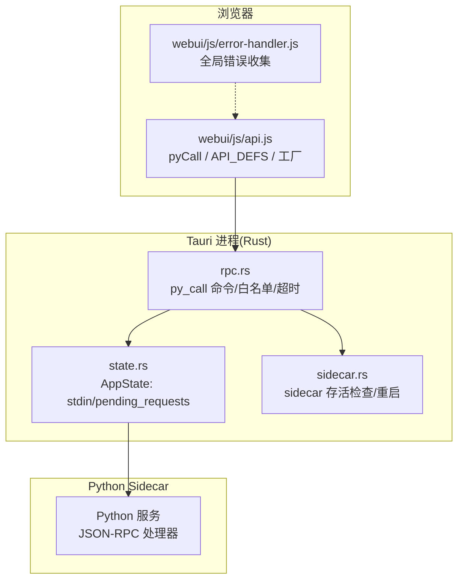
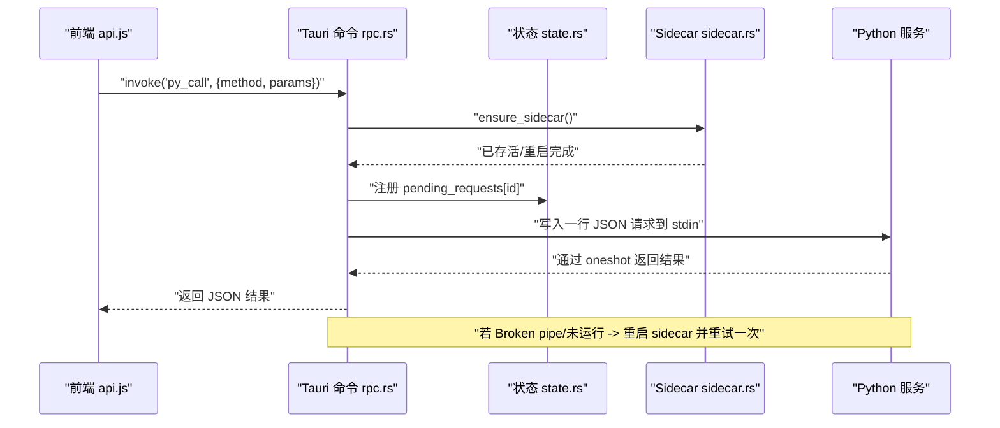
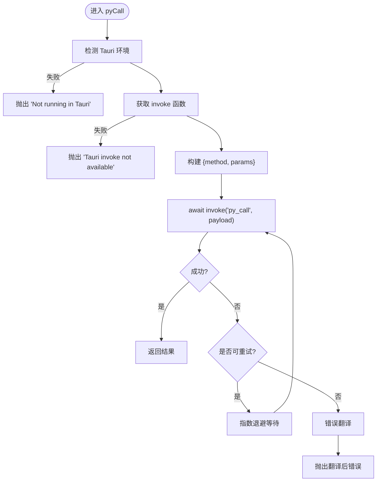
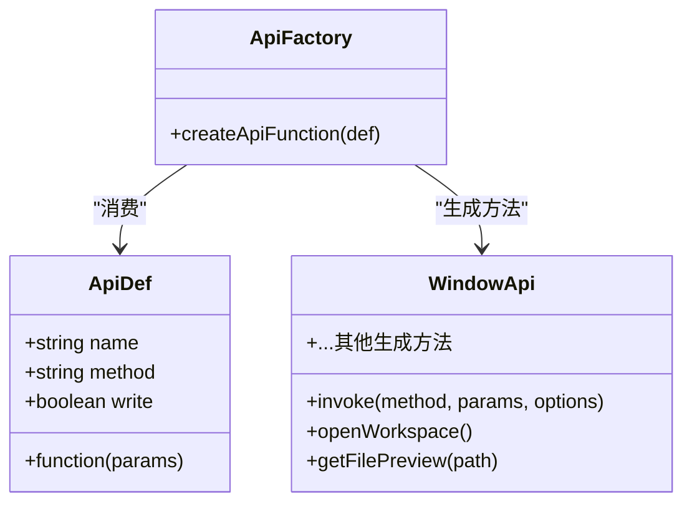
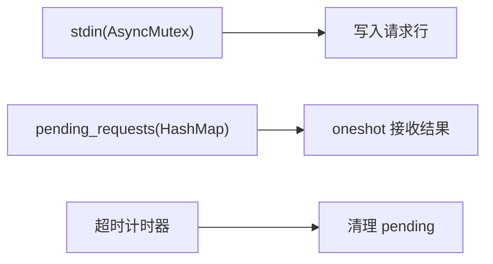
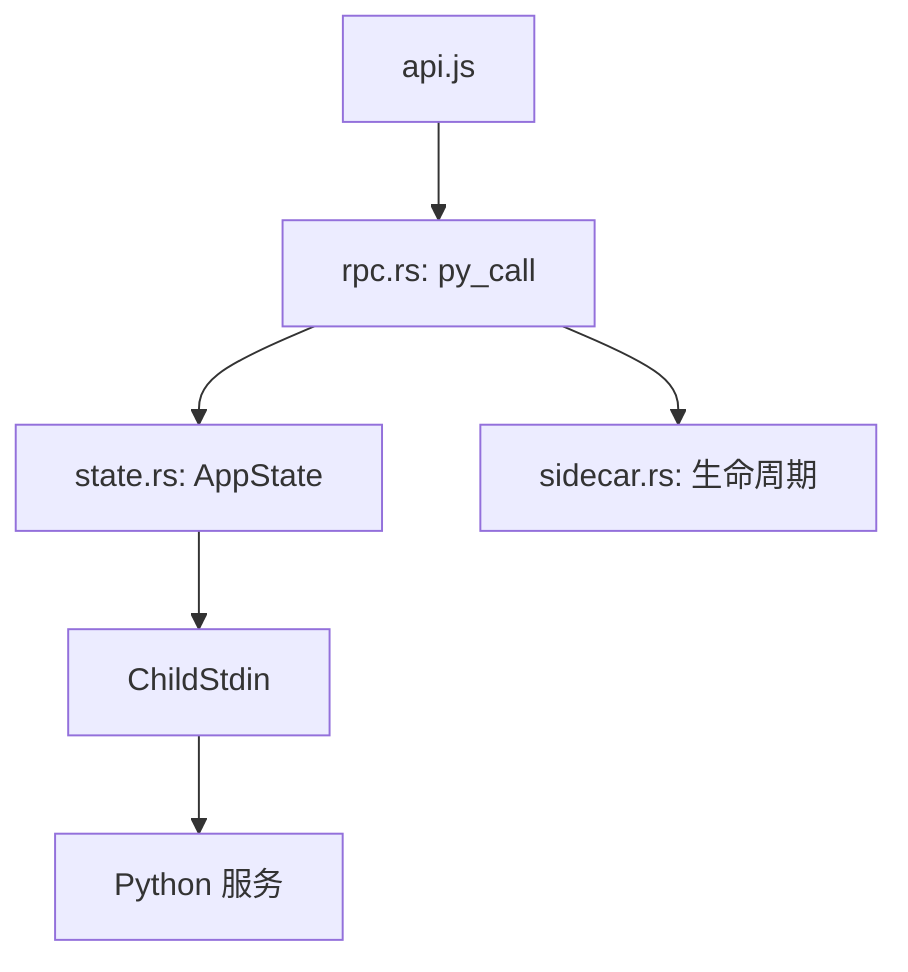

# JSON-RPC 客户端封装

<cite>
**本文引用的文件**
- [webui/js/api.js](file://webui/js/api.js)
- [src-tauri/src/rpc.rs](file://src-tauri/src/rpc.rs)
- [src-tauri/src/state.rs](file://src-tauri/src/state.rs)
- [src-tauri/src/sidecar.rs](file://src-tauri/src/sidecar.rs)
- [webui/js/error-handler.js](file://webui/js/error-handler.js)
</cite>

## 目录
1. [简介](#简介)
2. [项目结构](#项目结构)
3. [核心组件](#核心组件)
4. [架构总览](#架构总览)
5. [详细组件分析](#详细组件分析)
6. [依赖关系分析](#依赖关系分析)
7. [性能与并发](#性能与并发)
8. [故障排查指南](#故障排查指南)
9. [结论](#结论)
10. [附录：API 配置化注册与调用示例](#附录api-配置化注册与调用示例)

## 简介
本文件面向前端开发者，系统化梳理 NoteAI 的 JSON-RPC 客户端封装。重点包括：
- pyCall 函数的实现原理：Tauri invoke 探测、请求参数序列化、响应处理、错误翻译与重试。
- API 配置化注册机制：API_DEFS 数组结构与 createApiFunction 工厂模式。
- 错误处理策略：可重试判定、错误翻译、超时处理。
- 异步请求处理、并发控制与连接池管理方案（基于 Tauri + Python sidecar）。
- 实际 API 调用示例与集成指南，包含错误处理与调试方法。

## 项目结构
该 JSON-RPC 客户端由两部分组成：
- 前端侧：webui/js/api.js，负责环境检测、Tauri invoke 适配、pyCall 封装、API 配置化注册与特殊业务函数。
- 后端侧：src-tauri/src/rpc.rs 与 state.rs、sidecar.rs，负责白名单校验、Python sidecar 生命周期管理、请求/响应通道、超时与重启恢复。

图表来源
- [webui/js/api.js:60-90](file://webui/js/api.js#L60-L90)
- [src-tauri/src/rpc.rs:273-283](file://src-tauri/src/rpc.rs#L273-L283)
- [src-tauri/src/state.rs:9-27](file://src-tauri/src/state.rs#L9-L27)
- [src-tauri/src/sidecar.rs:29-65](file://src-tauri/src/sidecar.rs#L29-L65)

章节来源
- [webui/js/api.js:1-492](file://webui/js/api.js#L1-L492)
- [src-tauri/src/rpc.rs:1-284](file://src-tauri/src/rpc.rs#L1-L284)
- [src-tauri/src/state.rs:1-48](file://src-tauri/src/state.rs#L1-L48)
- [src-tauri/src/sidecar.rs:1-320](file://src-tauri/src/sidecar.rs#L1-L320)
- [webui/js/error-handler.js:1-45](file://webui/js/error-handler.js#L1-L45)

## 核心组件
- pyCall：统一入口，封装 Tauri invoke 调用、重试、错误翻译。
- createApiFunction：工厂函数，将 API_DEFS 中的声明式定义转换为 window.api.* 方法。
- API_DEFS：集中声明所有可调用的 RPC 方法名、前端方法名、参数映射与是否写操作。
- 特殊 API：openWorkspace/getFilePreview 等涉及原生对话框或分页预览的复杂流程。
- 窗口控制：直接调用 Tauri 窗口 API，不走 pyCall。
- 错误处理：_isRetryableError/_translateError 提供可重试判定与用户友好错误信息。

章节来源
- [webui/js/api.js:60-90](file://webui/js/api.js#L60-L90)
- [webui/js/api.js:323-329](file://webui/js/api.js#L323-L329)
- [webui/js/api.js:331-460](file://webui/js/api.js#L331-L460)
- [webui/js/api.js:170-248](file://webui/js/api.js#L170-L248)
- [webui/js/api.js:254-313](file://webui/js/api.js#L254-L313)
- [webui/js/api.js:35-59](file://webui/js/api.js#L35-L59)

## 架构总览
下图展示一次典型 API 调用的端到端流程：前端通过 pyCall 调用 Tauri 命令，Rust 侧校验白名单并写入 Python 子进程 stdin，等待 oneshot 通道返回结果；若管道损坏或进程不可用，Rust 侧自动重启 sidecar 并重试一次。

图表来源
- [webui/js/api.js:60-90](file://webui/js/api.js#L60-L90)
- [src-tauri/src/rpc.rs:247-283](file://src-tauri/src/rpc.rs#L247-L283)
- [src-tauri/src/state.rs:9-27](file://src-tauri/src/state.rs#L9-L27)
- [src-tauri/src/sidecar.rs:173-188](file://src-tauri/src/sidecar.rs#L173-L188)

## 详细组件分析

### pyCall 函数实现原理
- 环境检测：优先使用 window.__TAURI__ 或 __TAURI_INTERNALS__ 的 invoke 能力，兼容新旧版本。
- 参数序列化：将 method 与 params 打包为 JSON 对象传入 invoke。
- 重试机制：默认最多重试 2 次，指数退避延迟（300ms * (attempt+1)），仅对“可重试错误”生效。
- 错误翻译：将底层错误信息翻译为用户可读中文提示，如“未在 Tauri 环境运行”、“Tauri 调用接口不可用”、“请求超时”、“后端服务暂时不可用”。
- 返回值：透传 Python 侧返回的 JSON 对象；上层可按 success/message/result 等字段判断。

图表来源
- [webui/js/api.js:60-90](file://webui/js/api.js#L60-L90)
- [webui/js/api.js:35-59](file://webui/js/api.js#L35-L59)

章节来源
- [webui/js/api.js:60-90](file://webui/js/api.js#L60-L90)
- [webui/js/api.js:35-59](file://webui/js/api.js#L35-L59)

### API 配置化注册机制
- API_DEFS：集中声明所有 API，每项包含 name（前端方法名）、method（Python 侧 RPC 方法名）、可选 params（入参映射函数）、可选 write（标记写操作以禁用重试）。
- createApiFunction：工厂函数，接收 def，返回一个异步函数，内部执行 pyCall(def.method, params, { noRetry: !!def.write })。
- 生成 window.api：遍历 API_DEFS，将每个 def 转为 window.api[name]，同时挂载 invoke 与特殊 API。

图表来源
- [webui/js/api.js:323-329](file://webui/js/api.js#L323-L329)
- [webui/js/api.js:331-460](file://webui/js/api.js#L331-L460)
- [webui/js/api.js:462-485](file://webui/js/api.js#L462-L485)

章节来源
- [webui/js/api.js:323-329](file://webui/js/api.js#L323-L329)
- [webui/js/api.js:331-460](file://webui/js/api.js#L331-L460)
- [webui/js/api.js:462-485](file://webui/js/api.js#L462-L485)

### 错误处理策略
- 可重试判定：根据错误消息关键字（如 aborted/cancelled/invoke/sidecar）决定是否需要重试。
- 错误翻译：将常见错误场景翻译为中文提示，便于用户理解与反馈。
- 超时处理：Rust 侧按方法设置不同超时时间（例如 rag_chat 60s，ingest 相关 120s），超时报错并清理 pending 请求。
- 连接恢复：检测到 Broken pipe 或未运行时，自动重启 Python sidecar 并重试一次。

章节来源
- [webui/js/api.js:35-59](file://webui/js/api.js#L35-L59)
- [src-tauri/src/rpc.rs:159-167](file://src-tauri/src/rpc.rs#L159-L167)
- [src-tauri/src/rpc.rs:247-283](file://src-tauri/src/rpc.rs#L247-L283)
- [src-tauri/src/rpc.rs:169-171](file://src-tauri/src/rpc.rs#L169-L171)

### 异步请求处理、并发控制与连接池管理
- 异步模型：前端使用 async/await 串行调用；Rust 侧使用 tokio 异步 I/O 与 oneshot 通道进行请求-响应匹配。
- 并发控制：pending_requests 使用 HashMap 存储每个请求的发送端，避免重复挂起；stdin 使用 AsyncMutex 保护，保证同一时刻只有一个写入者。
- 连接池：当前实现采用单连接（stdin）复用，无显式连接池；通过 ensure_sidecar 保障连接可用，异常时自动重启。
- 资源清理：超时或异常路径会移除 pending 请求，防止泄漏。

图表来源
- [src-tauri/src/state.rs:9-27](file://src-tauri/src/state.rs#L9-L27)
- [src-tauri/src/rpc.rs:190-245](file://src-tauri/src/rpc.rs#L190-L245)

章节来源
- [src-tauri/src/state.rs:9-27](file://src-tauri/src/state.rs#L9-L27)
- [src-tauri/src/rpc.rs:190-245](file://src-tauri/src/rpc.rs#L190-L245)

### 特殊 API 与窗口控制
- openWorkspace：先打开系统文件夹选择框，再调用 set_workspace_path，最后同步到 Tauri 状态。
- getFilePreview：支持 raw_slices 分片读取与语义 b64 回退，自动拼接二进制片段并解码为 UTF-8。
- 窗口控制：moveWindow/minimize/maximize/close/openFileInNewWindow 直接调用 Tauri 窗口 API，不经过 pyCall。

章节来源
- [webui/js/api.js:170-248](file://webui/js/api.js#L170-L248)
- [webui/js/api.js:254-313](file://webui/js/api.js#L254-L313)

## 依赖关系分析
- 前端依赖：window.__TAURI__ 或 __TAURI_INTERNALS__ 提供的 invoke/event/window 能力。
- Rust 依赖：tokio 异步运行时、std::sync 与 tokio::sync 用于并发安全；serde_json 用于序列化。
- Python 依赖：通过标准输入输出协议交互，遵循 PyRequest/PyResponse 结构。

图表来源
- [webui/js/api.js:60-90](file://webui/js/api.js#L60-L90)
- [src-tauri/src/rpc.rs:273-283](file://src-tauri/src/rpc.rs#L273-L283)
- [src-tauri/src/state.rs:9-27](file://src-tauri/src/state.rs#L9-L27)
- [src-tauri/src/sidecar.rs:29-65](file://src-tauri/src/sidecar.rs#L29-L65)

章节来源
- [webui/js/api.js:60-90](file://webui/js/api.js#L60-L90)
- [src-tauri/src/rpc.rs:273-283](file://src-tauri/src/rpc.rs#L273-L283)
- [src-tauri/src/state.rs:9-27](file://src-tauri/src/state.rs#L9-L27)
- [src-tauri/src/sidecar.rs:29-65](file://src-tauri/src/sidecar.rs#L29-L65)

## 性能与并发
- 单次请求开销：JSON 序列化/反序列化与一行协议传输，开销较低。
- 并发瓶颈：stdin 写入互斥，天然限制并发写入；适合大多数 UI 场景。
- 长耗时任务：通过超时与事件流（如 RAG chat、ingest）分离即时响应与进度上报。
- 优化建议：
  - 批量操作合并：减少多次小请求，降低握手与序列化成本。
  - 预取与缓存：对热点数据（如主题树、标签列表）做短期缓存。
  - 分片读取：大文件预览已实现 raw_slices 分片，避免一次性加载。

[本节为通用指导，无需源码引用]

## 故障排查指南
- 前端错误面板：error-handler.js 收集 window.onerror 与 unhandledrejection，便于定位问题。
- 日志观察：pyCall 在重试与错误时会输出控制台日志，结合网络/进程状态排查。
- 常见错误与处理：
  - “未在 Tauri 环境中运行”：确认在桌面应用内运行而非浏览器。
  - “Tauri 调用接口不可用”：重启应用或检查 Tauri 初始化。
  - “请求超时”：检查后端负载与超时阈值，必要时调整。
  - “后端服务暂时不可用”：Rust 侧会自动重启 sidecar，若仍失败请检查 Python 进程。

章节来源
- [webui/js/error-handler.js:1-45](file://webui/js/error-handler.js#L1-L45)
- [webui/js/api.js:35-59](file://webui/js/api.js#L35-L59)
- [webui/js/api.js:80-88](file://webui/js/api.js#L80-L88)

## 结论
该 JSON-RPC 客户端封装以 pyCall 为核心，结合配置化的 API_DEFS 与工厂模式，实现了简洁一致的调用体验。错误处理与重试策略提升了鲁棒性，Rust 侧的超时与自动重启保障了稳定性。对于高并发与大规模数据传输，可通过批量化、缓存与分片读取进一步优化。

[本节为总结，无需源码引用]

## 附录：API 配置化注册与调用示例

- 新增 API 步骤：
  - 在 API_DEFS 中添加一项，指定 name、method，必要时提供 params 映射与 write 标志。
  - 重新构建前端，即可在 window.api 上获得对应方法。

- 调用示例（概念性说明）：
  - 读取工作区树：调用 window.api.getWorkspaceTree()，返回 JSON 对象，检查 success 与 data。
  - 创建笔记：调用 window.api.createNote(title, topic)，write=true 表示不进行重试。
  - 获取文件预览：调用 window.api.getFilePreview(path)，内部可能触发分片读取与回退逻辑。

- 集成与调试：
  - 在浏览器控制台查看 [API] 前缀的日志，关注重试与错误信息。
  - 使用 error-handler.js 的错误面板捕获未处理异常。
  - 若出现“后端服务暂时不可用”，等待 Rust 侧自动重启后再试。

章节来源
- [webui/js/api.js:331-460](file://webui/js/api.js#L331-L460)
- [webui/js/api.js:462-485](file://webui/js/api.js#L462-L485)
- [webui/js/error-handler.js:1-45](file://webui/js/error-handler.js#L1-L45)