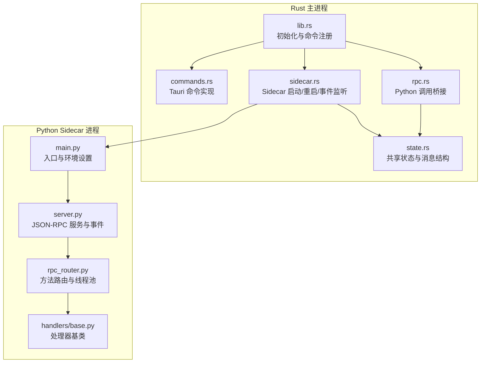
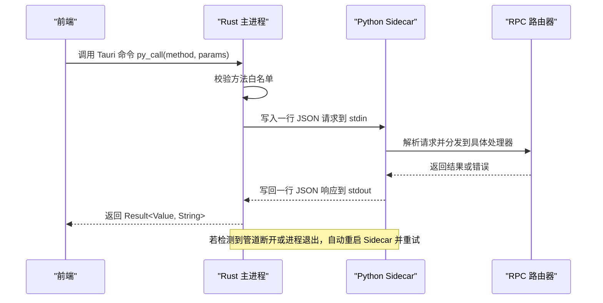
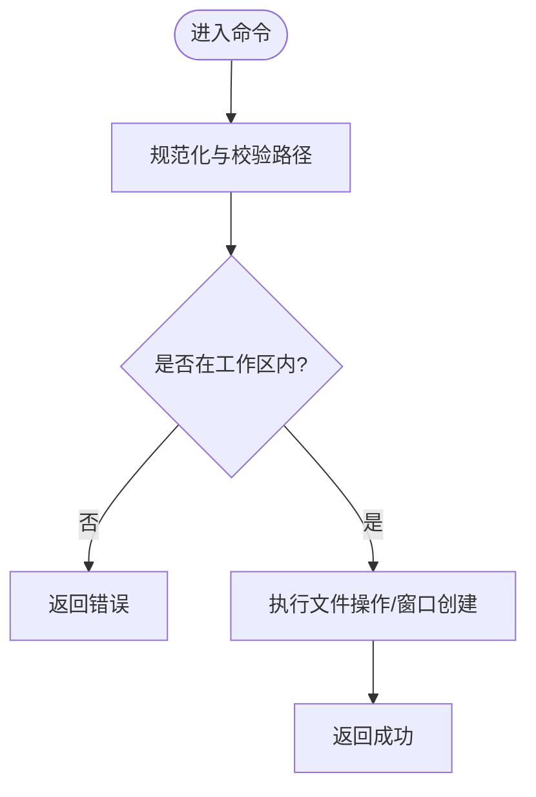
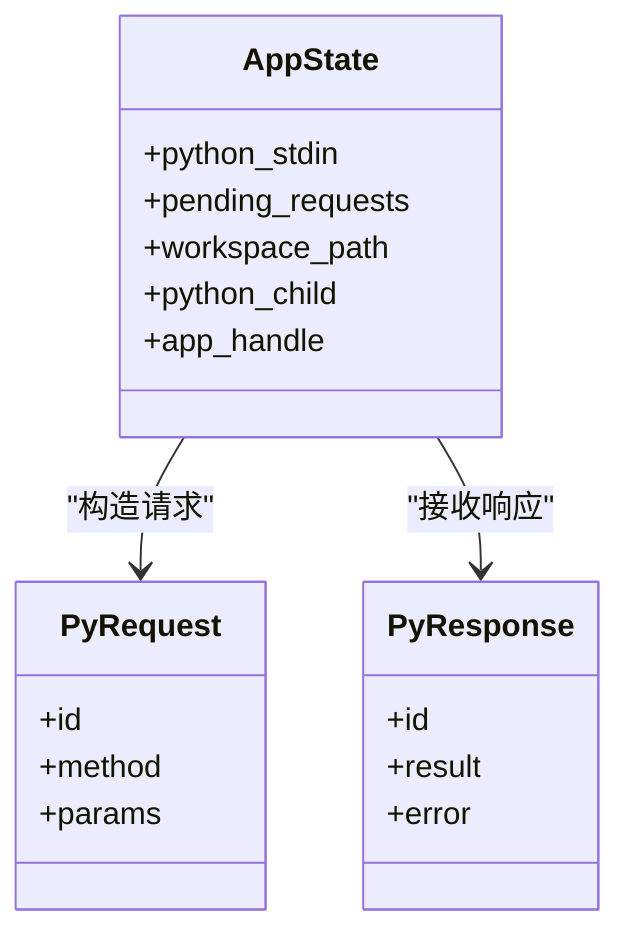
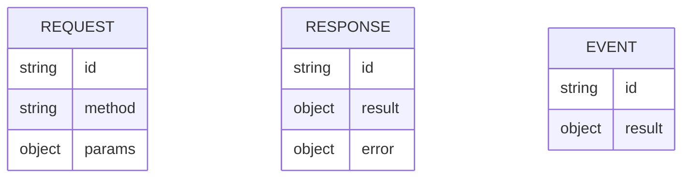
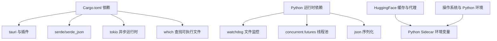

# Tauri IPC 通信协议

<cite>
**本文引用的文件**
- [src-tauri/src/main.rs](file://src-tauri/src/main.rs)
- [src-tauri/src/lib.rs](file://src-tauri/src/lib.rs)
- [src-tauri/src/commands.rs](file://src-tauri/src/commands.rs)
- [src-tauri/src/rpc.rs](file://src-tauri/src/rpc.rs)
- [src-tauri/src/sidecar.rs](file://src-tauri/src/sidecar.rs)
- [src-tauri/src/state.rs](file://src-tauri/src/state.rs)
- [python/main.py](file://python/main.py)
- [python/sidecar/server.py](file://python/sidecar/server.py)
- [python/sidecar/rpc_router.py](file://python/sidecar/rpc_router.py)
- [python/sidecar/handlers/base.py](file://python/sidecar/handlers/base.py)
- [config/security.py](file://config/security.py)
- [src-tauri/tauri.conf.json](file://src-tauri/tauri.conf.json)
- [src-tauri/capabilities/default.json](file://src-tauri/capabilities/default.json)
- [src-tauri/Cargo.toml](file://src-tauri/Cargo.toml)
</cite>

## 目录
1. [简介](#简介)
2. [项目结构](#项目结构)
3. [核心组件](#核心组件)
4. [架构总览](#架构总览)
5. [详细组件分析](#详细组件分析)
6. [依赖关系分析](#依赖关系分析)
7. [性能考虑](#性能考虑)
8. [故障排查指南](#故障排查指南)
9. [结论](#结论)
10. [附录](#附录)

## 简介
本技术文档围绕 NoteAI 的 Tauri IPC 通信协议展开，重点解释 Rust 后端的命令注册机制、Python Sidecar 的启动与进程间通信（IPC）数据格式与序列化方式、安全模型与权限控制、跨平台兼容性考量，以及 IPC 调用的性能优化与调试方法。目标是帮助开发者快速理解并高效扩展该系统的 IPC 能力。

## 项目结构
NoteAI 采用“Rust 前端 + Python Sidecar”的双进程架构：
- Rust 侧负责 UI 窗口管理、系统级能力调用（对话框、Shell）、Sidecar 生命周期管理与请求路由。
- Python 侧提供业务逻辑与数据处理能力，通过标准输入输出进行 JSON-RPC 风格的消息交换。

图表来源
- [src-tauri/src/lib.rs:10-49](file://src-tauri/src/lib.rs#L10-L49)
- [src-tauri/src/commands.rs:107-246](file://src-tauri/src/commands.rs#L107-L246)
- [src-tauri/src/rpc.rs:273-284](file://src-tauri/src/rpc.rs#L273-L284)
- [src-tauri/src/sidecar.rs:215-311](file://src-tauri/src/sidecar.rs#L215-L311)
- [src-tauri/src/state.rs:9-47](file://src-tauri/src/state.rs#L9-L47)
- [python/main.py:1-21](file://python/main.py#L1-L21)
- [python/sidecar/server.py:570-595](file://python/sidecar/server.py#L570-L595)
- [python/sidecar/rpc_router.py:43-106](file://python/sidecar/rpc_router.py#L43-L106)
- [python/sidecar/handlers/base.py:4-106](file://python/sidecar/handlers/base.py#L4-L106)

章节来源
- [src-tauri/src/lib.rs:10-49](file://src-tauri/src/lib.rs#L10-L49)
- [src-tauri/src/commands.rs:107-246](file://src-tauri/src/commands.rs#L107-L246)
- [src-tauri/src/rpc.rs:273-284](file://src-tauri/src/rpc.rs#L273-L284)
- [src-tauri/src/sidecar.rs:215-311](file://src-tauri/src/sidecar.rs#L215-L311)
- [src-tauri/src/state.rs:9-47](file://src-tauri/src/state.rs#L9-L47)
- [python/main.py:1-21](file://python/main.py#L1-L21)
- [python/sidecar/server.py:570-595](file://python/sidecar/server.py#L570-L595)
- [python/sidecar/rpc_router.py:43-106](file://python/sidecar/rpc_router.py#L43-L106)
- [python/sidecar/handlers/base.py:4-106](file://python/sidecar/handlers/base.py#L4-L106)

## 核心组件
- Tauri 应用初始化与命令注册：在应用构建阶段注册插件、注入全局状态、设置 invoke_handler 暴露给前端的命令集合。
- Python Sidecar 管理：查找 Python 可执行文件、解析打包资源中的 main.py、启动子进程、读写 stdin/stdout/stderr、处理异常退出与自动恢复。
- RPC 桥接层：维护请求 ID 与响应通道映射、超时控制、管道断开检测与重试、白名单校验。
- Python 端 JSON-RPC 路由：基于线程池并发处理同步/异步处理器，统一错误封装与进度事件推送。
- 共享状态与数据结构：AppState 持有子进程句柄、stdin 写入器、待处理请求映射、工作区路径等；PyRequest/PyResponse 定义 IPC 消息结构。

章节来源
- [src-tauri/src/lib.rs:10-49](file://src-tauri/src/lib.rs#L10-L49)
- [src-tauri/src/sidecar.rs:109-213](file://src-tauri/src/sidecar.rs#L109-L213)
- [src-tauri/src/rpc.rs:159-284](file://src-tauri/src/rpc.rs#L159-L284)
- [python/sidecar/server.py:126-183](file://python/sidecar/server.py#L126-L183)
- [python/sidecar/rpc_router.py:43-106](file://python/sidecar/rpc_router.py#L43-L106)
- [src-tauri/src/state.rs:9-47](file://src-tauri/src/state.rs#L9-L47)

## 架构总览
下图展示了从前端到 Rust 命令、再到 Python Sidecar 的完整调用链路，包括事件回推与异常恢复流程。

图表来源
- [src-tauri/src/rpc.rs:273-284](file://src-tauri/src/rpc.rs#L273-L284)
- [src-tauri/src/rpc.rs:190-245](file://src-tauri/src/rpc.rs#L190-L245)
- [src-tauri/src/sidecar.rs:260-301](file://src-tauri/src/sidecar.rs#L260-L301)
- [python/sidecar/server.py:570-595](file://python/sidecar/server.py#L570-L595)
- [python/sidecar/rpc_router.py:54-83](file://python/sidecar/rpc_router.py#L54-L83)

## 详细组件分析

### Rust 后端命令注册机制
- #[tauri::command] 装饰器用于将函数暴露为 Tauri 命令，支持异步与同步两种模式。参数绑定通过类型推导完成，返回值使用 Result<T, E> 表达成功与失败分支。
- 当前注册的命令包括：
  - 文件系统与工作区操作：open_folder_dialog、open_file_dialog、get_workspace_path、set_workspace_path、read_file、write_file、list_dir、open_file_in_new_window
  - Python 调用桥接：py_call
- 参数验证与安全：
  - 工作区路径规范化与边界检查，防止路径穿越。
  - 打开新窗口时仅允许预览工作区内文件。
- 平台差异：
  - macOS 下对标题栏样式与交通灯位置进行适配。

图表来源
- [src-tauri/src/commands.rs:78-105](file://src-tauri/src/commands.rs#L78-L105)
- [src-tauri/src/commands.rs:148-205](file://src-tauri/src/commands.rs#L148-L205)
- [src-tauri/src/commands.rs:207-246](file://src-tauri/src/commands.rs#L207-L246)

章节来源
- [src-tauri/src/lib.rs:39-49](file://src-tauri/src/lib.rs#L39-L49)
- [src-tauri/src/commands.rs:107-246](file://src-tauri/src/commands.rs#L107-L246)

### Python Sidecar 启动与管理
- 启动流程：
  - 查找 Python 可执行文件（环境变量优先、打包资源、开发环境、系统 PATH）。
  - 解析 main.py 脚本路径（打包资源或相对路径）。
  - 设置必要的环境变量（HF_ENDPOINT、NO_PROXY、HF_HOME、PYTHONIOENCODING、OMP_NUM_THREADS 等）。
  - 启动子进程并捕获 stdin/stdout/stderr。
- 生命周期与健壮性：
  - 后台读取 stdout 行，解析 PyResponse，按 id 投递到对应 oneshot 通道。
  - 当检测到管道错误或进程意外退出时，清理句柄并通过事件通知前端，支持自动重启。
  - 提供显式重启接口，避免重复重启冲突。
- 事件机制：
  - 特殊 id="event" 的消息作为事件直接转发到前端，用于进度、状态变更等。

图表来源
- [src-tauri/src/state.rs:9-47](file://src-tauri/src/state.rs#L9-L47)
- [src-tauri/src/sidecar.rs:215-311](file://src-tauri/src/sidecar.rs#L215-L311)
- [src-tauri/src/rpc.rs:190-245](file://src-tauri/src/rpc.rs#L190-L245)

章节来源
- [src-tauri/src/sidecar.rs:109-213](file://src-tauri/src/sidecar.rs#L109-L213)
- [src-tauri/src/sidecar.rs:215-311](file://src-tauri/src/sidecar.rs#L215-L311)
- [src-tauri/src/rpc.rs:159-245](file://src-tauri/src/rpc.rs#L159-L245)

### 进程间通信的数据格式与序列化
- 传输格式：每行一个 JSON 对象，以换行分隔。
- 请求结构：包含唯一 id、方法名 method、参数 params。
- 响应结构：包含 id、result 或 error 字段。
- 事件结构：id="event" 且 result 携带事件载荷，用于非请求-响应的异步通知。
- 序列化库：Rust 使用 serde_json，Python 使用 json 模块。

图表来源
- [src-tauri/src/state.rs:35-47](file://src-tauri/src/state.rs#L35-L47)
- [python/sidecar/server.py:126-143](file://python/sidecar/server.py#L126-L143)
- [python/sidecar/server.py:570-595](file://python/sidecar/server.py#L570-L595)

章节来源
- [src-tauri/src/state.rs:35-47](file://src-tauri/src/state.rs#L35-L47)
- [python/sidecar/server.py:126-143](file://python/sidecar/server.py#L126-L143)
- [python/sidecar/server.py:570-595](file://python/sidecar/server.py#L570-L595)

### 安全模型与权限控制
- 命令白名单：
  - Rust 侧维护 ALLOWED_PYTHON_METHODS 列表，未列入的方法将被拒绝。
- 参数验证：
  - 工作区路径规范化与边界检查，禁止访问工作区外路径。
  - 打开新窗口时仅允许预览工作区内文件。
- 异常处理：
  - Rust 侧对管道错误、超时、通道关闭等情况进行区分处理，必要时触发 Sidecar 重启。
  - Python 侧统一错误封装，屏蔽敏感路径信息，返回结构化错误码与消息。
- 权限配置：
  - tauri.conf.json 中 CSP 限制资源加载与连接源。
  - capabilities/default.json 声明窗口、对话框、Shell 等能力权限。

章节来源
- [src-tauri/src/rpc.rs:4-157](file://src-tauri/src/rpc.rs#L4-L157)
- [src-tauri/src/commands.rs:78-105](file://src-tauri/src/commands.rs#L78-L105)
- [src-tauri/src/commands.rs:207-246](file://src-tauri/src/commands.rs#L207-L246)
- [python/sidecar/rpc_router.py:14-32](file://python/sidecar/rpc_router.py#L14-L32)
- [src-tauri/tauri.conf.json:23-25](file://src-tauri/tauri.conf.json#L23-L25)
- [src-tauri/capabilities/default.json:1-50](file://src-tauri/capabilities/default.json#L1-L50)

### 跨平台兼容性考虑
- Python 可执行文件查找策略：
  - 支持环境变量 NOTEAI_PYTHON 指定。
  - 优先使用打包资源中的 sidecar-python/bin/python3 或 python。
  - 开发模式下支持 CARGO_MANIFEST_DIR/resources/sidecar-python/bin。
  - 遍历 .venv 与系统 PATH 中的 python3/python。
- 资源定位：
  - 通过 AppHandle.path().resolve("python/main.py", BaseDirectory::Resource) 获取打包资源。
  - 回退到 exe 目录及其父目录的多级候选路径。
- 平台差异：
  - macOS 下窗口标题栏样式与交通灯位置的特殊处理。
  - 环境变量 KMP_DUPLICATE_LIB_OK 与 OMP_NUM_THREADS 解决 macOS 上多线程库冲突。

章节来源
- [src-tauri/src/sidecar.rs:109-213](file://src-tauri/src/sidecar.rs#L109-L213)
- [src-tauri/src/commands.rs:229-235](file://src-tauri/src/commands.rs#L229-L235)
- [python/main.py:6-8](file://python/main.py#L6-L8)

### IPC 调用性能优化建议
- 超时控制：
  - 针对长耗时方法（如 rag_chat、ingest、索引重建）设置更长超时时间，避免阻塞。
- 并发与线程池：
  - Python 侧使用 ThreadPoolExecutor 并行处理处理器，避免阻塞 stdin 读取循环。
- 缓存与失效：
  - 文件变更时失效 RPC 与全文检索缓存，减少重复计算。
- 批量与去抖：
  - 工作区变更事件去抖合并，降低频繁事件带来的开销。
- 资源预热：
  - 启动时预加载模型，缩短首次交互延迟。

章节来源
- [src-tauri/src/rpc.rs:159-167](file://src-tauri/src/rpc.rs#L159-L167)
- [python/sidecar/rpc_router.py:43-50](file://python/sidecar/rpc_router.py#L43-L50)
- [python/sidecar/server.py:340-356](file://python/sidecar/server.py#L340-L356)
- [python/sidecar/server.py:513-539](file://python/sidecar/server.py#L513-L539)
- [python/sidecar/server.py:570-576](file://python/sidecar/server.py#L570-L576)

### 调试工具使用方法
- 日志输出：
  - Rust 侧打印 Python stderr 行，便于定位 Python 端异常。
  - Python 侧记录任务开始、完成、失败等事件，便于追踪。
- 事件订阅：
  - 前端订阅 "python-event" 事件，观察 sidecar_ready、sidecar_died、progress、workspace_files_changed 等事件。
- 开发工具：
  - Cargo 启用 devtools 特性，便于在浏览器 DevTools 中调试。
- 断点与诊断：
  - 在 Rust 侧对 is_sidecar_alive、ensure_sidecar、call_python_once 等方法添加日志。
  - 在 Python 侧 RpcRouter.handle 与 _send_response 处增加详细日志。

章节来源
- [src-tauri/src/sidecar.rs:295-301](file://src-tauri/src/sidecar.rs#L295-L301)
- [src-tauri/src/lib.rs:26-34](file://src-tauri/src/lib.rs#L26-L34)
- [python/sidecar/server.py:145-183](file://python/sidecar/server.py#L145-L183)
- [src-tauri/Cargo.toml:20-22](file://src-tauri/Cargo.toml#L20-L22)

## 依赖关系分析
- Rust 依赖：
  - tauri、tauri-plugin-dialog、tauri-plugin-shell、serde、serde_json、tokio、which、uuid。
- Python 依赖：
  - watchdog（文件系统监控）、concurrent.futures（线程池）、json（序列化）。
- 外部集成：
  - HuggingFace Hub 缓存目录与代理设置。
  - 系统 Python 环境与虚拟环境发现。

图表来源
- [src-tauri/Cargo.toml:9-18](file://src-tauri/Cargo.toml#L9-L18)
- [python/sidecar/server.py:8-16](file://python/sidecar/server.py#L8-L16)
- [src-tauri/src/sidecar.rs:224-242](file://src-tauri/src/sidecar.rs#L224-L242)

章节来源
- [src-tauri/Cargo.toml:9-18](file://src-tauri/Cargo.toml#L9-L18)
- [python/sidecar/server.py:8-16](file://python/sidecar/server.py#L8-L16)
- [src-tauri/src/sidecar.rs:224-242](file://src-tauri/src/sidecar.rs#L224-L242)

## 性能考虑
- 合理设置超时：根据方法特征调整 rpc_timeout_secs，避免长时间阻塞。
- 利用线程池：确保 Python 处理器不阻塞 stdin 读取循环。
- 缓存与去抖：文件变更时及时失效缓存，合并事件以减少冗余处理。
- 资源预热：启动时预热模型，降低首请求延迟。
- 最小化序列化开销：尽量传递轻量参数，避免大对象频繁往返。

[本节为通用指导，无需特定文件引用]

## 故障排查指南
- 常见错误与定位：
  - Python 未找到：检查 NOTEAI_PYTHON 环境变量、打包资源、.venv 与系统 PATH。
  - 管道断开：检测 "Broken pipe" 或 "os error 32"，触发自动重启。
  - 请求超时：确认方法是否属于长耗时类别，适当提高超时阈值。
  - 方法不在白名单：核对 ALLOWED_PYTHON_METHODS 列表。
- 日志与事件：
  - 关注 Rust 侧 "[Python]" 日志与 "python-event" 事件。
  - 查看 Python 侧任务状态与错误堆栈。
- 权限与路径：
  - 检查工作区路径是否有效，是否存在越界访问。
  - 确认 capabilities 与 CSP 配置是否符合预期。

章节来源
- [src-tauri/src/sidecar.rs:109-175](file://src-tauri/src/sidecar.rs#L109-L175)
- [src-tauri/src/rpc.rs:169-171](file://src-tauri/src/rpc.rs#L169-L171)
- [src-tauri/src/rpc.rs:247-271](file://src-tauri/src/rpc.rs#L247-L271)
- [src-tauri/src/lib.rs:26-34](file://src-tauri/src/lib.rs#L26-L34)
- [python/sidecar/server.py:570-595](file://python/sidecar/server.py#L570-L595)
- [src-tauri/tauri.conf.json:23-25](file://src-tauri/tauri.conf.json#L23-L25)
- [src-tauri/capabilities/default.json:1-50](file://src-tauri/capabilities/default.json#L1-L50)

## 结论
NoteAI 的 Tauri IPC 通信协议通过 Rust 命令注册与 Python Sidecar 的 JSON-RPC 模式实现了前后端解耦与高内聚的业务处理能力。其安全模型通过白名单、路径校验与权限配置保障系统稳定运行；跨平台兼容策略确保在不同环境下均可正确启动与通信；性能优化手段则提升了整体响应速度与用户体验。建议在新增功能时遵循现有模式，完善白名单与参数校验，合理使用事件与缓存，以提升系统的可靠性与可维护性。

[本节为总结，无需特定文件引用]

## 附录
- 关键配置项说明：
  - NOTEAI_PYTHON：指定 Python 可执行文件路径。
  - HF_ENDPOINT/NO_PROXY/HF_HOME：配置 HuggingFace 镜像与缓存目录。
  - KMP_DUPLICATE_LIB_OK/OMP_NUM_THREADS：解决 macOS 多线程库冲突与线程数限制。
- 安全增强建议：
  - 引入更细粒度的权限控制，针对不同用户角色限制可调用方法。
  - 对敏感参数进行严格校验与脱敏，避免泄露路径与密钥。
  - 定期审计白名单与方法实现，确保最小权限原则。

章节来源
- [src-tauri/src/sidecar.rs:224-242](file://src-tauri/src/sidecar.rs#L224-L242)
- [python/main.py:6-8](file://python/main.py#L6-L8)
- [config/security.py:6-12](file://config/security.py#L6-L12)