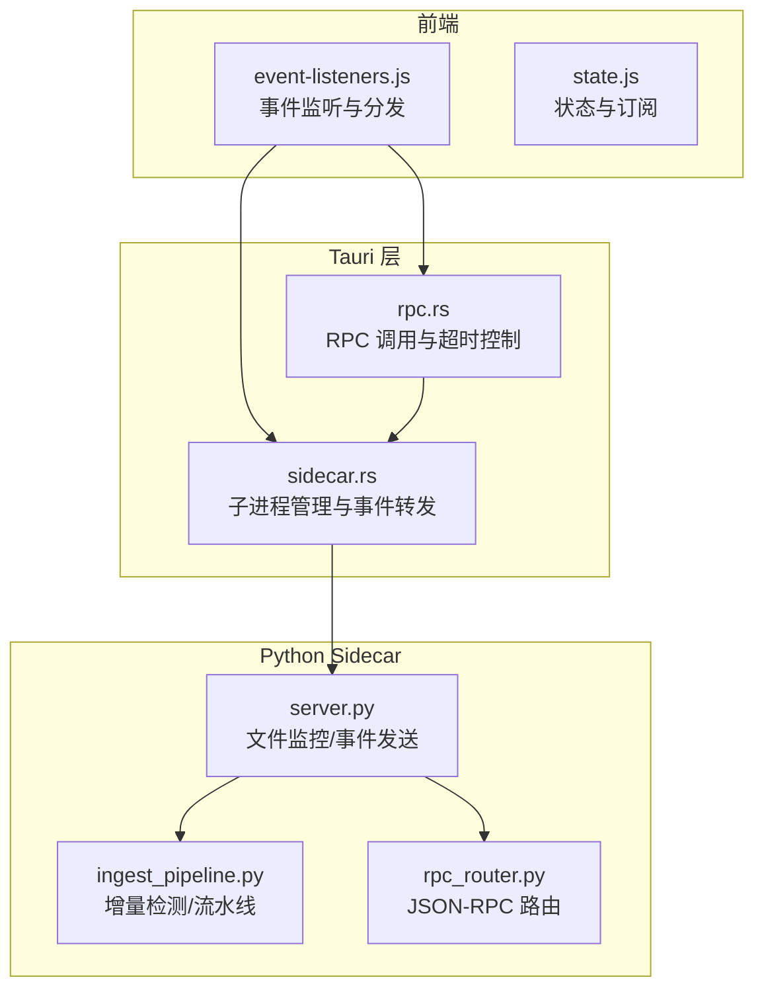
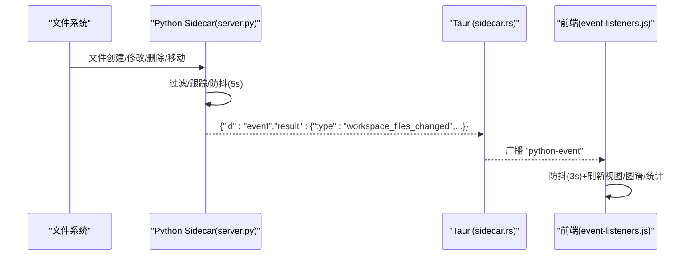
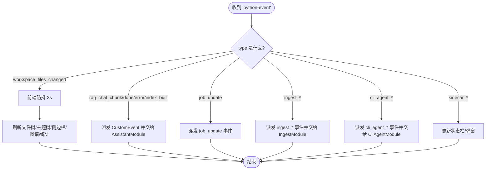
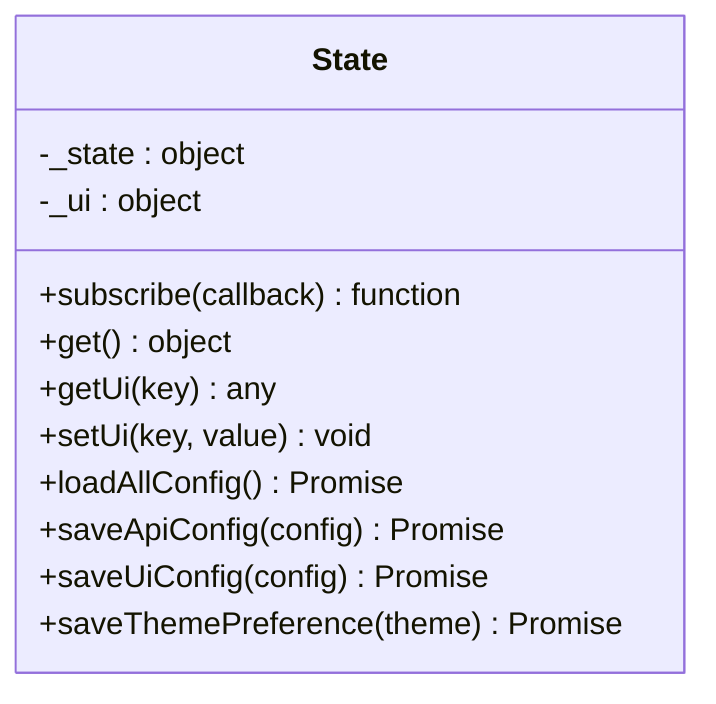
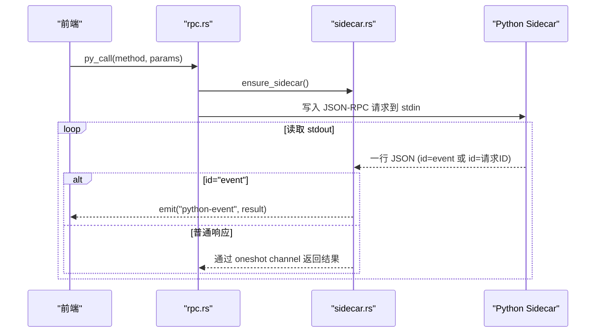
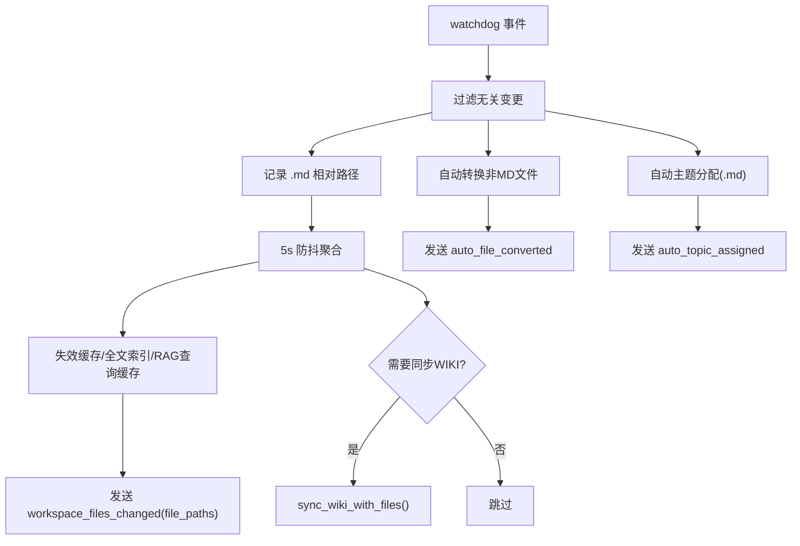
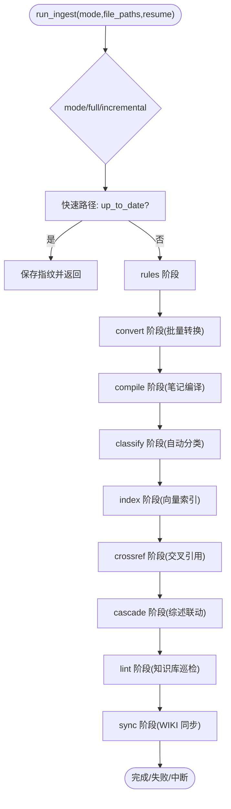
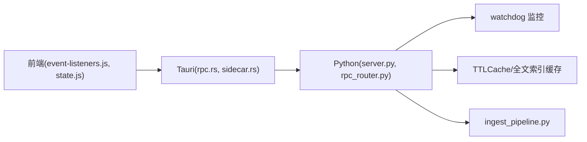

# 事件驱动系统

<cite>
**本文引用的文件**
- [webui/js/event-listeners.js](file://webui/js/event-listeners.js)
- [python/sidecar/server.py](file://python/sidecar/server.py)
- [python/sidecar/ingest_pipeline.py](file://python/sidecar/ingest_pipeline.py)
- [src-tauri/src/rpc.rs](file://src-tauri/src/rpc.rs)
- [src-tauri/src/sidecar.rs](file://src-tauri/src/sidecar.rs)
- [python/sidecar/rpc_router.py](file://python/sidecar/rpc_router.py)
- [webui/js/state.js](file://webui/js/state.js)
</cite>

## 目录
1. [简介](#简介)
2. [项目结构](#项目结构)
3. [核心组件](#核心组件)
4. [架构总览](#架构总览)
5. [详细组件分析](#详细组件分析)
6. [依赖关系分析](#依赖关系分析)
7. [性能考虑](#性能考虑)
8. [故障排查指南](#故障排查指南)
9. [结论](#结论)
10. [附录](#附录)

## 简介
本技术文档围绕事件驱动系统展开，聚焦以下目标：
- 前端事件监听器的实现：文件变更监听、状态更新事件、用户交互事件的捕获与处理。
- 事件订阅机制的设计与发布-订阅模式实现细节。
- 前后端事件同步方案：事件类型、增量同步策略、冲突解决思路。
- 实时状态更新的性能优化：去重、批量处理、防抖节流等。
- 扩展指南与最佳实践。

该系统采用 Tauri + Python Sidecar 的架构：前端通过 Tauri 事件通道接收后端推送的事件；Python 侧基于文件系统监控与流水线任务，将工作区变更、索引进度、RAG 聊天流式输出等以统一事件格式推送到前端；前端对事件进行分发、去重与渲染。

## 项目结构
事件相关的关键路径与职责：
- 前端事件监听与分发：webui/js/event-listeners.js
- 前端全局状态与订阅：webui/js/state.js
- Tauri RPC 与进程管理：src-tauri/src/rpc.rs、src-tauri/src/sidecar.rs
- Python Sidecar 事件发送与文件监控：python/sidecar/server.py
- 摄取（Ingest）流水线与增量判断：python/sidecar/ingest_pipeline.py
- JSON-RPC 路由与线程池执行：python/sidecar/rpc_router.py

图表来源
- [webui/js/event-listeners.js:1-259](file://webui/js/event-listeners.js#L1-L259)
- [webui/js/state.js:1-199](file://webui/js/state.js#L1-L199)
- [src-tauri/src/rpc.rs:1-284](file://src-tauri/src/rpc.rs#L1-L284)
- [src-tauri/src/sidecar.rs:1-312](file://src-tauri/src/sidecar.rs#L1-L312)
- [python/sidecar/server.py:1-595](file://python/sidecar/server.py#L1-L595)
- [python/sidecar/ingest_pipeline.py:1-800](file://python/sidecar/ingest_pipeline.py#L1-L800)
- [python/sidecar/rpc_router.py:1-106](file://python/sidecar/rpc_router.py#L1-L106)

章节来源
- [webui/js/event-listeners.js:1-259](file://webui/js/event-listeners.js#L1-L259)
- [webui/js/state.js:1-199](file://webui/js/state.js#L1-L199)
- [src-tauri/src/rpc.rs:1-284](file://src-tauri/src/rpc.rs#L1-L284)
- [src-tauri/src/sidecar.rs:1-312](file://src-tauri/src/sidecar.rs#L1-L312)
- [python/sidecar/server.py:1-595](file://python/sidecar/server.py#L1-L595)
- [python/sidecar/ingest_pipeline.py:1-800](file://python/sidecar/ingest_pipeline.py#L1-L800)
- [python/sidecar/rpc_router.py:1-106](file://python/sidecar/rpc_router.py#L1-L106)

## 核心组件
- 前端事件监听器（event-listeners.js）
  - 监听来自 Tauri 的 python-event 事件，按 type 分派到不同处理器（如 workspace_files_changed、rag_chat_chunk、job_update 等）。
  - 对高频事件（如文件变更）做前端防抖，避免频繁刷新视图。
  - 触发 UI 刷新：树视图、标签视图、知识图谱、统计信息等。
- 前端状态与订阅（state.js）
  - 提供 subscribe/notify 机制，支持订阅者模式，UI 组件可订阅状态变化并自动更新。
- Tauri RPC 与进程管理（rpc.rs、sidecar.rs）
  - rpc.rs 负责方法白名单、请求 ID、超时控制、管道异常恢复。
  - sidecar.rs 负责启动/重启 Python 子进程、读取 stdout/stderr、将 Python 事件转发为 Tauri 事件。
- Python Sidecar（server.py、rpc_router.py）
  - server.py 使用 watchdog 监控工作区文件变更，聚合变更并发送 workspace_files_changed 事件；同时发送 RAG 进度、作业状态等事件。
  - rpc_router.py 提供 JSON-RPC 路由与线程池执行，保证主循环不被阻塞。
- 摄取流水线（ingest_pipeline.py）
  - 提供增量判断（fingerprint）、阶段化执行、取消与续跑、索引完整性修复等能力。

章节来源
- [webui/js/event-listeners.js:1-259](file://webui/js/event-listeners.js#L1-L259)
- [webui/js/state.js:1-199](file://webui/js/state.js#L1-L199)
- [src-tauri/src/rpc.rs:1-284](file://src-tauri/src/rpc.rs#L1-L284)
- [src-tauri/src/sidecar.rs:1-312](file://src-tauri/src/sidecar.rs#L1-L312)
- [python/sidecar/server.py:1-595](file://python/sidecar/server.py#L1-L595)
- [python/sidecar/rpc_router.py:1-106](file://python/sidecar/rpc_router.py#L1-L106)
- [python/sidecar/ingest_pipeline.py:1-800](file://python/sidecar/ingest_pipeline.py#L1-L800)

## 架构总览
整体事件链路：
- 文件变更 → Python 侧 watchdog 收集 → 防抖聚合 → 发送 workspace_files_changed 事件 → Tauri 转发 → 前端监听并刷新视图。
- 长任务（RAG 聊天、索引构建、摄取流水线）→ Python 侧周期性发送 progress/job_update 事件 → Tauri 转发 → 前端更新进度条或状态栏。
- 错误与生命周期事件（sidecar_died、sidecar_ready、sidecar_error）→ 前端提示与恢复流程。

图表来源
- [python/sidecar/server.py:298-539](file://python/sidecar/server.py#L298-L539)
- [src-tauri/src/sidecar.rs:261-293](file://src-tauri/src/sidecar.rs#L261-L293)
- [webui/js/event-listeners.js:15-46](file://webui/js/event-listeners.js#L15-L46)

## 详细组件分析

### 前端事件监听器（event-listeners.js）
- 监听入口：通过 getTauriEventAPI().listen('python-event', handler) 注册事件监听。
- 事件类型与处理：
  - workspace_files_changed：触发前端防抖后刷新文件树、主题树、当前侧边栏视图、知识图谱与首页统计。
  - auto_topic_assigned / auto_file_moved：更新待办按钮状态与视图。
  - sidecar_died / sidecar_ready / sidecar_error：状态栏提示与弹窗。
  - rag_chat_chunk / rag_chat_done / rag_error / rag_index_built：转发给 AssistantModule 并派发 CustomEvent。
  - job_update：派发自定义事件供 JobCenter 消费。
  - ingest_progress / ingest_complete / cascade_*：转发给 IngestModule 或更新状态栏。
  - cli_agent_*：转发给 CliAgentModule。
- 防抖策略：针对 workspace_files_changed 设置 3 秒前端防抖，合并多次变更，减少 UI 抖动。

图表来源
- [webui/js/event-listeners.js:15-245](file://webui/js/event-listeners.js#L15-L245)

章节来源
- [webui/js/event-listeners.js:1-259](file://webui/js/event-listeners.js#L1-259)

### 前端状态与订阅（state.js）
- 订阅模型：subscribe(callback) 返回取消订阅函数；setUi/getUi 修改 UI 状态时触发 notify()，通知所有订阅者。
- 配置加载：loadApiConfig/loadUiConfig/loadThemePreference 异步加载配置并通知订阅者。
- 代理对象：window.AppState 作为 Proxy，拦截属性赋值并触发 notify，便于组件直接绑定状态。

图表来源
- [webui/js/state.js:1-199](file://webui/js/state.js#L1-L199)

章节来源
- [webui/js/state.js:1-199](file://webui/js/state.js#L1-L199)

### Tauri RPC 与进程管理（rpc.rs、sidecar.rs）
- rpc.rs
  - 方法白名单：ALLOWED_PYTHON_METHODS 限制可调用的 Python 方法。
  - 超时控制：rpc_timeout_secs 针对不同方法设置超时时间。
  - 管道异常恢复：检测到 Broken pipe 或进程未运行时，尝试重启 Sidecar 并重试。
- sidecar.rs
  - 子进程管理：start_python_sidecar 启动 Python 进程，分离 stdin/stdout/stderr。
  - 事件转发：读取 stdout 行，若 id="event" 则通过 app.emit("python-event", result) 广播；否则匹配 pending_requests 完成 RPC 响应。
  - 生命周期事件：意外退出时广播 sidecar_died；重启成功广播 sidecar_ready。

图表来源
- [src-tauri/src/rpc.rs:190-284](file://src-tauri/src/rpc.rs#L190-L284)
- [src-tauri/src/sidecar.rs:215-312](file://src-tauri/src/sidecar.rs#L215-L312)

章节来源
- [src-tauri/src/rpc.rs:1-284](file://src-tauri/src/rpc.rs#L1-L284)
- [src-tauri/src/sidecar.rs:1-312](file://src-tauri/src/sidecar.rs#L1-L312)

### Python Sidecar 事件发送与文件监控（server.py）
- 文件监控：
  - 使用 watchdog Observer 递归监听工作区目录。
  - 过滤规则：忽略隐藏目录、wiki 目录、非关注后缀的文件；仅对 .md/.pdf/.docx 等后缀敏感。
  - 变更追踪：记录 .md 相对路径集合，用于后续增量处理。
- 防抖与聚合：
  - 使用 Timer 5 秒防抖，合并多次变更，避免频繁触发。
  - 每次防抖到期时失效缓存、可选同步 WIKI.md、发送 workspace_files_changed 事件（包含 file_paths）。
- 自动转换与自动分类：
  - 新文件或移动文件时，根据配置自动转换非 Markdown 文件为 Markdown，并发送 auto_file_converted 事件。
  - 新 .md 文件触发自动主题分配流程，发送 auto_topic_assigned 事件。
- 作业与进度：
  - _send_job_update/_send_progress 统一封装作业状态与进度事件，供前端 JobCenter 与状态栏消费。

图表来源
- [python/sidecar/server.py:298-539](file://python/sidecar/server.py#L298-L539)

章节来源
- [python/sidecar/server.py:1-595](file://python/sidecar/server.py#L1-L595)

### 摄取流水线与增量策略（ingest_pipeline.py）
- 增量判断：
  - fingerprint：遍历工作区文件，记录 path -> [mtime, size]，与上次指纹对比快速判定是否有变更。
  - 扫描各阶段待处理项：convert_pending、classify_pending、index_pending。
- 阶段化执行：
  - STAGES = ("rules", "convert", "compile", "classify", "index", "crossref", "cascade", "lint", "sync")
  - 支持 resume 续跑与 force_full_next 强制全量。
- 索引完整性：
  - 比较 expected_chunks 与 actual_chunks，不一致时修复全部 Notes 的索引。
- 取消与续跑：
  - 使用 cancel_generation 与 is_cancelled 控制流水线中断；normalize_ingest_state 标记上次未完成的 interrupted 状态。

图表来源
- [python/sidecar/ingest_pipeline.py:480-800](file://python/sidecar/ingest_pipeline.py#L480-L800)

章节来源
- [python/sidecar/ingest_pipeline.py:1-800](file://python/sidecar/ingest_pipeline.py#L1-L800)

### JSON-RPC 路由（rpc_router.py）
- 路由注册：各 Handler 在 SidecarServer 初始化时注册到 RpcRouter。
- 线程池执行：所有处理器提交至 ThreadPoolExecutor，避免阻塞 stdin 读取循环。
- 错误处理：统一包装 NoteAIError 与通用异常，屏蔽绝对路径信息，返回标准化错误结构。

章节来源
- [python/sidecar/rpc_router.py:1-106](file://python/sidecar/rpc_router.py#L1-L106)

## 依赖关系分析
- 前端依赖 Tauri 事件通道接收后端事件，并通过 state.js 的订阅机制驱动 UI 更新。
- Tauri 层负责进程生命周期管理、RPC 超时与异常恢复、事件转发。
- Python 侧依赖 watchdog 监控文件系统，结合 TTLCache 与全文索引缓存提升性能。
- 摄取流水线依赖 RAG 索引状态与 manifest，确保增量与一致性。

图表来源
- [webui/js/event-listeners.js:1-259](file://webui/js/event-listeners.js#L1-L259)
- [webui/js/state.js:1-199](file://webui/js/state.js#L1-L199)
- [src-tauri/src/rpc.rs:1-284](file://src-tauri/src/rpc.rs#L1-L284)
- [src-tauri/src/sidecar.rs:1-312](file://src-tauri/src/sidecar.rs#L1-L312)
- [python/sidecar/server.py:1-595](file://python/sidecar/server.py#L1-L595)
- [python/sidecar/rpc_router.py:1-106](file://python/sidecar/rpc_router.py#L1-L106)
- [python/sidecar/ingest_pipeline.py:1-800](file://python/sidecar/ingest_pipeline.py#L1-L800)

章节来源
- [webui/js/event-listeners.js:1-259](file://webui/js/event-listeners.js#L1-L259)
- [webui/js/state.js:1-199](file://webui/js/state.js#L1-L199)
- [src-tauri/src/rpc.rs:1-284](file://src-tauri/src/rpc.rs#L1-L284)
- [src-tauri/src/sidecar.rs:1-312](file://src-tauri/src/sidecar.rs#L1-L312)
- [python/sidecar/server.py:1-595](file://python/sidecar/server.py#L1-L595)
- [python/sidecar/rpc_router.py:1-106](file://python/sidecar/rpc_router.py#L1-L106)
- [python/sidecar/ingest_pipeline.py:1-800](file://python/sidecar/ingest_pipeline.py#L1-L800)

## 性能考虑
- 防抖与节流
  - Python 侧：文件变更 5 秒防抖，合并变更路径，减少重复计算与 I/O。
  - 前端侧：workspace_files_changed 3 秒防抖，降低 UI 刷新频率。
- 增量同步
  - 指纹对比（mtime+size）快速判断是否需重新处理。
  - 仅对有改动的文件执行索引与交叉引用，避免全量重建。
- 批量处理
  - 批量转换、批量索引、批量分类，减少上下文切换与开销。
- 缓存与失效
  - TTLCache 缓存 RPC 结果；全文索引与 RAG 查询缓存随文件变更失效。
- 并发与锁
  - 运行任务集与标准输出写锁防止竞态；RAG 索引操作互斥，避免多实例冲突。
- 幂等与去重
  - 自动转换使用 in-flight 集合去重；索引阶段检查 expected vs actual chunks 修复一致性。

[本节为通用性能建议，不直接分析具体文件]

## 故障排查指南
- 后端意外退出
  - 现象：前端收到 sidecar_died 事件，状态栏提示“后端已退出”。
  - 处理：Tauri 自动重启 Sidecar，成功后广播 sidecar_ready；必要时手动重试操作。
- 管道断开
  - 现象：RPC 报错“Broken pipe”或“not running”。
  - 处理：rpc.rs 自动重启 Sidecar 并重试请求；确认 Python 环境可用。
- 索引不一致
  - 现象：expected_chunks 与 actual_chunks 不匹配。
  - 处理：流水线自动修复全部 Notes 索引；检查磁盘权限与存储路径。
- 长时间任务无响应
  - 现象：RAG 聊天或索引构建超时。
  - 处理：rpc.rs 按方法设置超时；前端显示进度与错误消息；必要时取消并重启任务。

章节来源
- [src-tauri/src/sidecar.rs:57-107](file://src-tauri/src/sidecar.rs#L57-L107)
- [src-tauri/src/rpc.rs:169-271](file://src-tauri/src/rpc.rs#L169-L271)
- [python/sidecar/ingest_pipeline.py:370-461](file://python/sidecar/ingest_pipeline.py#L370-L461)

## 结论
该事件驱动系统通过 Tauri 与 Python Sidecar 的协作，实现了高效的前后端事件同步。前端通过统一的 python-event 通道接收各类业务事件，并结合防抖与订阅机制实现低延迟、低抖动的 UI 更新。Python 侧利用文件系统监控、增量指纹与阶段化流水线，保障大规模工作区的稳定与性能。未来可在事件序列号、冲突解决与断线重放方面进一步增强，以提升跨设备与离线场景的一致性。

[本节为总结性内容，不直接分析具体文件]

## 附录

### 事件类型与语义（示例）
- workspace_files_changed：工作区文件变更，附带 file_paths 列表。
- auto_topic_assigned：自动主题分配完成，附带 topic。
- auto_file_converted：自动转换完成，附带 source 与 markdown 输出路径。
- rag_chat_chunk / rag_chat_done / rag_error / rag_index_built：RAG 聊天与索引构建事件。
- job_update：作业状态更新，附带 job 详情。
- ingest_progress / ingest_complete / cascade_survey_chunk / cascade_done：摄取与级联更新事件。
- sidecar_died / sidecar_ready / sidecar_error：Sidecar 生命周期事件。

章节来源
- [webui/js/event-listeners.js:15-245](file://webui/js/event-listeners.js#L15-L245)
- [python/sidecar/server.py:126-182](file://python/sidecar/server.py#L126-L182)
- [python/sidecar/server.py:241-266](file://python/sidecar/server.py#L241-L266)
- [python/sidecar/server.py:531-539](file://python/sidecar/server.py#L531-L539)

### 扩展指南与最佳实践
- 新增事件类型
  - 在 Python 侧定义事件结构并通过 _send_response 发送；在前端 event-listeners.js 中增加分支处理与 UI 更新逻辑。
- 事件去重与合并
  - 使用生成号（generation）与 in-flight 集合避免重复处理；对高频事件实施防抖。
- 增量与幂等
  - 使用指纹与 mtime/size 快速判断变更；对索引与转换操作实现幂等与断点续跑。
- 错误与日志
  - 统一错误码与消息清洗；记录关键路径与异常堆栈，便于定位问题。
- 性能调优
  - 合理设置防抖时长与批量大小；利用缓存与索引状态减少重复计算。

[本节为通用指导，不直接分析具体文件]