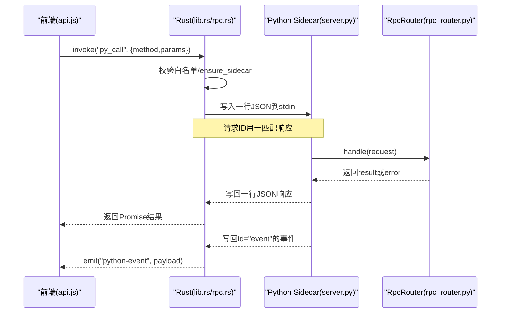
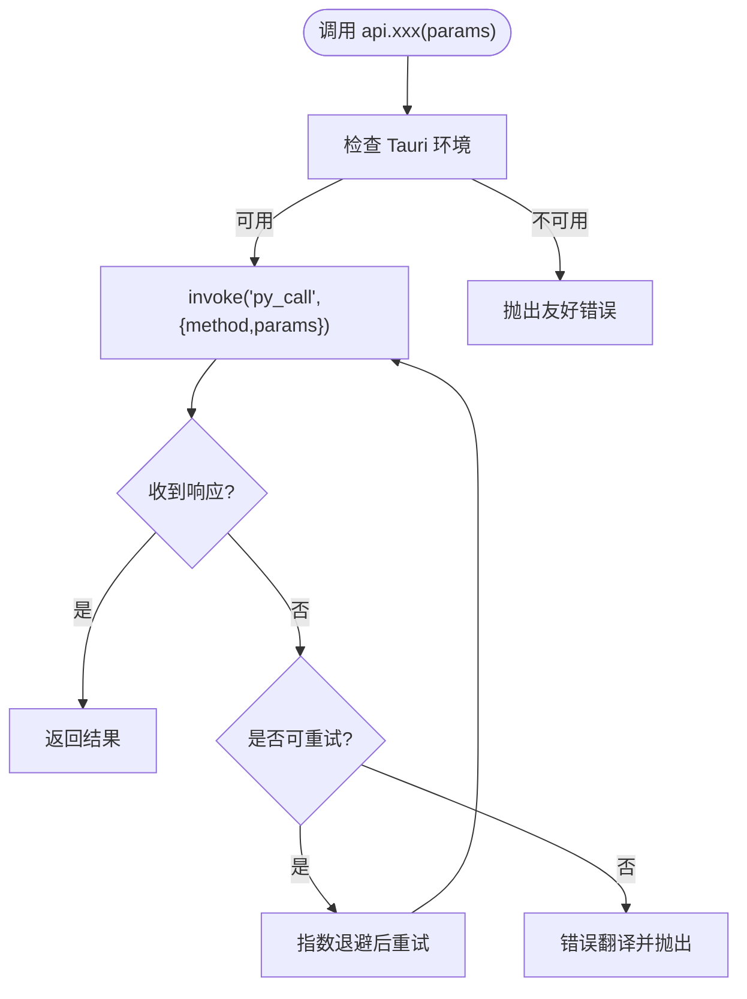
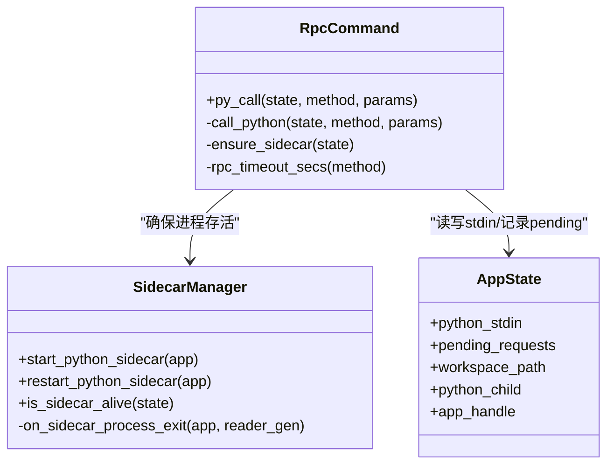
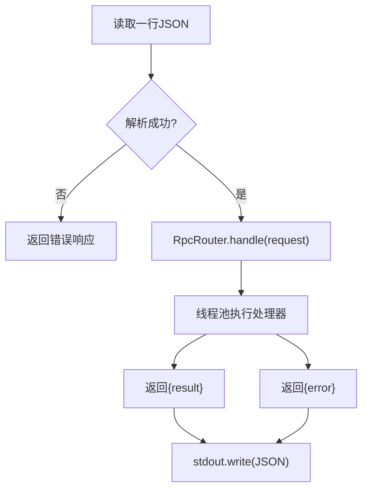
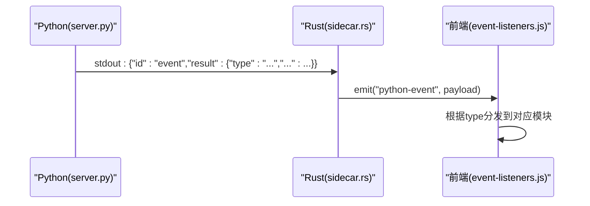
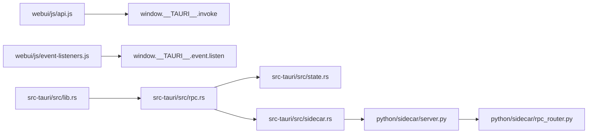

# 前后端通信机制

<cite>
**本文引用的文件**
- [src-tauri/src/rpc.rs](file://src-tauri/src/rpc.rs)
- [src-tauri/src/sidecar.rs](file://src-tauri/src/sidecar.rs)
- [src-tauri/src/lib.rs](file://src-tauri/src/lib.rs)
- [src-tauri/src/state.rs](file://src-tauri/src/state.rs)
- [python/sidecar/server.py](file://python/sidecar/server.py)
- [python/sidecar/rpc_router.py](file://python/sidecar/rpc_router.py)
- [webui/js/api.js](file://webui/js/api.js)
- [webui/js/event-listeners.js](file://webui/js/event-listeners.js)
</cite>

## 目录
1. [简介](#简介)
2. [项目结构](#项目结构)
3. [核心组件](#核心组件)
4. [架构总览](#架构总览)
5. [详细组件分析](#详细组件分析)
6. [依赖关系分析](#依赖关系分析)
7. [性能与并发](#性能与并发)
8. [故障排查与调试](#故障排查与调试)
9. [结论](#结论)
10. [附录：API 调用示例与集成指南](#附录api-调用示例与集成指南)

## 简介
本文件面向前后端通信机制，系统性说明基于 Tauri 的 JSON-RPC 客户端封装、请求路由、错误处理与重试策略；事件驱动架构的工作原理（实时状态同步、消息传递、事件订阅）；Tauri IPC 协议与 Python Sidecar 服务接口的调用方式；异步请求处理、并发控制与连接管理策略；并提供性能优化建议、调试方法与常见问题排查。文末包含实际 API 调用示例与集成指南，帮助开发者快速上手。

## 项目结构
前后端通信涉及三层：
- 前端 WebUI：通过 window.__TAURI__ 暴露的 invoke 接口调用 Rust 命令，统一封装为 pyCall 并对外暴露 api.* 方法。
- Rust 侧（Tauri）：注册命令 py_call，负责启动/维护 Python Sidecar 进程、读写 stdin/stdout、转发事件到前端。
- Python Sidecar：以 JSON 行协议在 stdin/stdout 上接收请求，经 RpcRouter 分发到具体 Handler，结果写回 stdout；同时通过 event 通道推送进度、工作区变更等实时事件。

```mermaid
graph TB
subgraph "前端 WebUI"
A["api.js<br/>pyCall + 配置化 API"]
B["event-listeners.js<br/>监听 python-event"]
end
subgraph "Rust (Tauri)"
C["lib.rs<br/>注册命令与生命周期"]
D["rpc.rs<br/>py_call 命令实现"]
E["sidecar.rs<br/>Sidecar 进程管理"]
F["state.rs<br/>共享状态与请求映射"]
end
subgraph "Python Sidecar"
G["server.py<br/>主循环与事件发送"]
H["rpc_router.py<br/>JSON-RPC 路由与线程池"]
end
A --> |invoke('py_call')| C
C --> D
D --> E
E --> |stdin/stdout 行式 JSON| G
G --> |stdout 响应/事件| E
E --> |emit 'python-event'| B
```

图表来源
- [src-tauri/src/lib.rs:10-49](file://src-tauri/src/lib.rs#L10-L49)
- [src-tauri/src/rpc.rs:273-284](file://src-tauri/src/rpc.rs#L273-L284)
- [src-tauri/src/sidecar.rs:215-311](file://src-tauri/src/sidecar.rs#L215-L311)
- [python/sidecar/server.py:570-595](file://python/sidecar/server.py#L570-L595)
- [python/sidecar/rpc_router.py:43-106](file://python/sidecar/rpc_router.py#L43-L106)
- [webui/js/api.js:61-90](file://webui/js/api.js#L61-L90)
- [webui/js/event-listeners.js:148-246](file://webui/js/event-listeners.js#L148-L246)

章节来源
- [src-tauri/src/lib.rs:10-49](file://src-tauri/src/lib.rs#L10-L49)
- [src-tauri/src/rpc.rs:273-284](file://src-tauri/src/rpc.rs#L273-L284)
- [src-tauri/src/sidecar.rs:215-311](file://src-tauri/src/sidecar.rs#L215-L311)
- [python/sidecar/server.py:570-595](file://python/sidecar/server.py#L570-L595)
- [python/sidecar/rpc_router.py:43-106](file://python/sidecar/rpc_router.py#L43-L106)
- [webui/js/api.js:61-90](file://webui/js/api.js#L61-L90)
- [webui/js/event-listeners.js:148-246](file://webui/js/event-listeners.js#L148-L246)

## 核心组件
- 前端 JSON-RPC 客户端封装
  - 统一入口 pyCall(method, params, options)，内部通过 Tauri invoke('py_call', ...) 发起请求，内置可重试逻辑与错误翻译。
  - 提供配置化 API 生成器 createApiFunction，将业务方法名映射到后端 RPC method，减少样板代码。
- Rust 命令与 Sidecar 管理
  - 命令 py_call：校验白名单、确保 Sidecar 存活、写入请求行、等待 oneshot 响应或超时。
  - Sidecar 管理：查找 Python 解释器、启动子进程、读取 stdout/stderr、解析响应与事件、异常退出时通知 UI。
- Python Sidecar 服务端
  - 主循环从 stdin 逐行读取 JSON 请求，交由 RpcRouter 分发执行，结果通过 _send_response 写回 stdout。
  - 事件系统：通过相同 stdout 通道发送 id="event" 的消息，Rust 将其转为 Tauri 事件 python-event 推送给前端。
  - 任务与进度：统一的 job_status 与 _send_progress/_send_job_update 支持长任务进度上报。
- 路由与错误处理
  - RpcRouter 使用线程池执行处理器，捕获业务异常与通用异常，输出结构化错误对象。
  - 错误信息脱敏，避免泄露绝对路径与用户目录。

章节来源
- [webui/js/api.js:61-90](file://webui/js/api.js#L61-L90)
- [webui/js/api.js:324-329](file://webui/js/api.js#L324-L329)
- [src-tauri/src/rpc.rs:247-284](file://src-tauri/src/rpc.rs#L247-L284)
- [src-tauri/src/sidecar.rs:215-311](file://src-tauri/src/sidecar.rs#L215-L311)
- [python/sidecar/server.py:126-183](file://python/sidecar/server.py#L126-L183)
- [python/sidecar/rpc_router.py:43-106](file://python/sidecar/rpc_router.py#L43-L106)

## 架构总览
下图展示了端到端的请求与事件流：



图表来源
- [webui/js/api.js:61-90](file://webui/js/api.js#L61-L90)
- [src-tauri/src/rpc.rs:247-284](file://src-tauri/src/rpc.rs#L247-L284)
- [src-tauri/src/sidecar.rs:261-293](file://src-tauri/src/sidecar.rs#L261-L293)
- [python/sidecar/server.py:570-595](file://python/sidecar/server.py#L570-L595)
- [python/sidecar/rpc_router.py:54-83](file://python/sidecar/rpc_router.py#L54-L83)

## 详细组件分析

### 前端 JSON-RPC 客户端封装
- 环境检测与 Tauri 适配
  - 自动探测 window.__TAURI__ 或 __TAURI_INTERNALS__，兼容不同版本 Tauri 的 invoke/event 入口。
- 重试与退避
  - 默认最多重试 2 次，指数退避延迟（300ms 起），对“aborted/cancelled/invoke/sidecar”等错误判定为可重试。
- 错误翻译
  - 将底层错误转换为友好中文提示，如“未在 Tauri 环境中运行”、“请求超时”、“后端服务暂时不可用”。
- 配置化 API 生成
  - 通过 API_DEFS 列表声明式定义前端方法名、后端 method 名与参数映射，自动生成 window.api.* 方法。
- 特殊 API
  - openWorkspace/getWorkspaceStatus/importFilesToWorkspace/openFileInNewWindow 等直接调用原生窗口/对话框能力。
  - getFilePreview 支持 raw_slices 分页预览与语义 b64 回退。



图表来源
- [webui/js/api.js:61-90](file://webui/js/api.js#L61-L90)
- [webui/js/api.js:324-329](file://webui/js/api.js#L324-L329)
- [webui/js/api.js:224-248](file://webui/js/api.js#L224-L248)

章节来源
- [webui/js/api.js:61-90](file://webui/js/api.js#L61-L90)
- [webui/js/api.js:324-329](file://webui/js/api.js#L324-L329)
- [webui/js/api.js:224-248](file://webui/js/api.js#L224-L248)

### Rust 命令与 Sidecar 管理
- 命令注册与生命周期
  - lib.rs 注册 py_call 及若干文件系统命令；应用启动时尝试启动 Python Sidecar；窗口关闭时清理子进程与 pending 请求。
- 请求处理流程
  - rpc.rs 中 py_call 先校验白名单，再 ensure_sidecar 保证进程存活；构造 PyRequest 写入 stdin，注册 oneshot 等待响应；按方法设置超时时间。
- Sidecar 进程管理
  - sidecar.rs 负责查找 Python 解释器、启动子进程、分离 stdout/stderr 读取；当 stdout 出现 id="event" 的消息则作为事件广播；非事件消息根据 id 投递到 pending_requests。
- 健壮性
  - 检测到管道断开或进程意外退出时，触发重启流程并向前端广播 sidecar_died/sidecar_ready 事件。



图表来源
- [src-tauri/src/state.rs:9-48](file://src-tauri/src/state.rs#L9-L48)
- [src-tauri/src/rpc.rs:159-284](file://src-tauri/src/rpc.rs#L159-L284)
- [src-tauri/src/sidecar.rs:26-107](file://src-tauri/src/sidecar.rs#L26-L107)
- [src-tauri/src/sidecar.rs:215-311](file://src-tauri/src/sidecar.rs#L215-L311)
- [src-tauri/src/lib.rs:10-49](file://src-tauri/src/lib.rs#L10-L49)

章节来源
- [src-tauri/src/lib.rs:10-49](file://src-tauri/src/lib.rs#L10-L49)
- [src-tauri/src/rpc.rs:159-284](file://src-tauri/src/rpc.rs#L159-L284)
- [src-tauri/src/sidecar.rs:26-107](file://src-tauri/src/sidecar.rs#L26-L107)
- [src-tauri/src/sidecar.rs:215-311](file://src-tauri/src/sidecar.rs#L215-L311)
- [src-tauri/src/state.rs:9-48](file://src-tauri/src/state.rs#L9-L48)

### Python Sidecar 服务端与路由
- 主循环与协议
  - server.py main() 逐行读取 stdin，解析 JSON 后交给 server.handle_request -> router.handle。
  - 成功响应格式 {"id": req_id, "result": ...}；错误响应格式 {"id": req_id, "error": {...}}。
- 路由与并发
  - rpc_router.RpcRouter 维护方法到处理器的映射，所有处理器提交至 ThreadPoolExecutor 执行，避免阻塞 stdin 读循环。
  - 支持 async_mode 标记（当前未使用），便于未来扩展。
- 错误处理与脱敏
  - 捕获业务异常 NoteAIError 与通用 Exception，统一包装为结构化错误；错误消息进行路径脱敏，避免泄露敏感信息。
- 事件与进度
  - 通过 _send_response 发送 id="event" 的消息，Rust 层将其转为 Tauri 事件；_send_progress/_send_job_update 配合 job_status 管理长任务进度与状态。



图表来源
- [python/sidecar/server.py:570-595](file://python/sidecar/server.py#L570-L595)
- [python/sidecar/rpc_router.py:54-83](file://python/sidecar/rpc_router.py#L54-L83)
- [python/sidecar/rpc_router.py:84-95](file://python/sidecar/rpc_router.py#L84-L95)
- [python/sidecar/server.py:126-183](file://python/sidecar/server.py#L126-L183)

章节来源
- [python/sidecar/server.py:570-595](file://python/sidecar/server.py#L570-L595)
- [python/sidecar/rpc_router.py:54-83](file://python/sidecar/rpc_router.py#L54-L83)
- [python/sidecar/rpc_router.py:84-95](file://python/sidecar/rpc_router.py#L84-L95)
- [python/sidecar/server.py:126-183](file://python/sidecar/server.py#L126-L183)

### 事件驱动架构与实时状态同步
- 事件通道
  - Python 通过 stdout 发送 id="event" 的消息体，Rust 识别后通过 app.emit("python-event", payload) 广播。
- 前端订阅
  - event-listeners.js 监听 python-event，根据 type 分发到各模块：工作区变更、RAG 进度、CLI Agent 事件、批量分配进度等。
- 典型事件类型
  - workspace_files_changed：工作区文件变化，前端刷新树视图、标签、图谱等。
  - progress/job_update：通用进度与任务更新，用于 RAG 索引构建、组件安装等。
  - rag_chat_chunk/rag_chat_done/rag_error/rag_index_built：RAG 对话与索引构建事件。
  - auto_topic_assigned/auto_file_moved：自动主题分配与文件移动事件。
  - sidecar_died/sidecar_ready/sidecar_error：Sidecar 生命周期事件。



图表来源
- [src-tauri/src/sidecar.rs:261-293](file://src-tauri/src/sidecar.rs#L261-L293)
- [webui/js/event-listeners.js:148-246](file://webui/js/event-listeners.js#L148-L246)
- [python/sidecar/server.py:126-183](file://python/sidecar/server.py#L126-L183)

章节来源
- [src-tauri/src/sidecar.rs:261-293](file://src-tauri/src/sidecar.rs#L261-L293)
- [webui/js/event-listeners.js:148-246](file://webui/js/event-listeners.js#L148-L246)
- [python/sidecar/server.py:126-183](file://python/sidecar/server.py#L126-L183)

## 依赖关系分析
- 前端依赖
  - webui/js/api.js 依赖 Tauri 运行时提供的 invoke/event 能力；event-listeners.js 依赖 window.getTauriEventAPI。
- Rust 依赖
  - src-tauri/src/lib.rs 注册命令与插件；rpc.rs 依赖 state.rs 的共享状态；sidecar.rs 负责进程管理与事件转发。
- Python 依赖
  - server.py 组合多个 Handler，并通过 rpc_router.py 进行路由；job_status 与 TTLCache 等工具类支撑任务与缓存。



图表来源
- [webui/js/api.js:61-90](file://webui/js/api.js#L61-L90)
- [webui/js/event-listeners.js:148-246](file://webui/js/event-listeners.js#L148-L246)
- [src-tauri/src/lib.rs:10-49](file://src-tauri/src/lib.rs#L10-L49)
- [src-tauri/src/rpc.rs:247-284](file://src-tauri/src/rpc.rs#L247-L284)
- [src-tauri/src/state.rs:9-48](file://src-tauri/src/state.rs#L9-L48)
- [src-tauri/src/sidecar.rs:215-311](file://src-tauri/src/sidecar.rs#L215-L311)
- [python/sidecar/server.py:570-595](file://python/sidecar/server.py#L570-L595)
- [python/sidecar/rpc_router.py:43-106](file://python/sidecar/rpc_router.py#L43-L106)

章节来源
- [webui/js/api.js:61-90](file://webui/js/api.js#L61-L90)
- [webui/js/event-listeners.js:148-246](file://webui/js/event-listeners.js#L148-L246)
- [src-tauri/src/lib.rs:10-49](file://src-tauri/src/lib.rs#L10-L49)
- [src-tauri/src/rpc.rs:247-284](file://src-tauri/src/rpc.rs#L247-L284)
- [src-tauri/src/state.rs:9-48](file://src-tauri/src/state.rs#L9-L48)
- [src-tauri/src/sidecar.rs:215-311](file://src-tauri/src/sidecar.rs#L215-L311)
- [python/sidecar/server.py:570-595](file://python/sidecar/server.py#L570-L595)
- [python/sidecar/rpc_router.py:43-106](file://python/sidecar/rpc_router.py#L43-L106)

## 性能与并发
- 异步请求处理
  - Rust 使用 tokio 异步 I/O 与 oneshot channel 实现请求-响应匹配；Python 使用线程池执行处理器，避免阻塞 stdin 读循环。
- 超时与重试
  - Rust 侧按方法设置超时（例如 rag_chat 60s，ingest 相关 120s）；前端默认最多重试 2 次，指数退避。
- 连接管理
  - 单进程 Sidecar 模式，通过 stdin/stdout 行式 JSON 通信；Rust 维护唯一 ChildStdin 句柄，避免多连接竞争。
- 缓存与去抖
  - Python 侧使用 TTLCache 与文件变更去抖，降低频繁 IO 与重复计算；Rust 侧无连接池，但通过 ensure_sidecar 保障可用性。
- 优化建议
  - 对于高频只读查询，可在 Python 侧增加更细粒度的缓存键与失效策略；对大文件预览采用 raw_slices 分段传输已有效降低内存峰值。
  - 合理调整前端重试次数与退避间隔，避免雪崩；对长任务优先使用事件进度而非轮询。

[本节为通用指导，不直接分析具体文件]

## 故障排查与调试
- 常见错误定位
  - “Python 后端未运行/已重启失败”：检查 Rust 侧 find_python 与 resolve_sidecar_script 是否能找到 Python 与 main.py；查看 sidecar.rs 中的 stderr 日志。
  - “Broken pipe/os error 32”：通常因 Sidecar 异常退出导致，Rust 会触发重启；关注 Python 侧异常堆栈。
  - “Method not allowed”：确认方法是否在 ALLOWED_PYTHON_METHODS 白名单内。
  - “请求超时”：检查后端耗时操作是否过长，必要时调整 rpc_timeout_secs 或改用事件进度。
- 调试手段
  - 前端：控制台查看 [API] pyCall retry/error 日志；打开 Tauri DevTools 观察 python-event 事件。
  - Rust：stderr 打印 Python 输出；Rust 自身 eprintln 输出关键节点。
  - Python：标准输出每行一个 JSON，可通过外部工具重定向到文件进行分析；注意错误消息已被脱敏。
- 恢复策略
  - 前端遇到可重试错误会自动重试；Rust 检测到管道损坏或进程退出会尝试重启 Sidecar 并广播 sidecar_ready。

章节来源
- [src-tauri/src/rpc.rs:169-188](file://src-tauri/src/rpc.rs#L169-L188)
- [src-tauri/src/rpc.rs:247-284](file://src-tauri/src/rpc.rs#L247-L284)
- [src-tauri/src/sidecar.rs:57-107](file://src-tauri/src/sidecar.rs#L57-L107)
- [webui/js/api.js:35-59](file://webui/js/api.js#L35-L59)
- [webui/js/event-listeners.js:110-146](file://webui/js/event-listeners.js#L110-L146)

## 结论
本项目采用“前端配置化 JSON-RPC 客户端 + Rust Tauri 命令 + Python Sidecar 服务”的分层架构，通过 stdin/stdout 行式 JSON 协议实现稳定可靠的跨进程通信。Rust 负责进程生命周期与事件桥接，Python 负责业务逻辑与事件推送，前端通过事件订阅实现实时状态同步。整体设计具备较好的可扩展性与健壮性，适合复杂桌面应用的场景。

[本节为总结性内容，不直接分析具体文件]

## 附录：API 调用示例与集成指南

- 基本调用
  - 获取工作区状态：调用 window.api.getWorkspaceStatus()，内部会通过 pyCall 调用 get_workspace_status。
  - 打开文件夹选择框并设置工作区：调用 window.api.openWorkspace()，成功后自动同步本地与后端路径。
- 文件预览
  - 调用 window.api.getFilePreview(path)，若后端返回 raw_slices，前端会分段拉取并拼接为 UTF-8 文本；否则直接使用语义 b64 内容。
- 长任务与进度
  - 调用 rag_rebuild_index 或 start_ingest 等写操作时，前端通过 noRetry=true 禁用重试；后端通过 job_update/progress 事件推送进度，前端在 event-listeners.js 中统一处理。
- 自定义 API 接入
  - 在 API_DEFS 中添加一项，指定 name、method 与可选的 params 映射函数，即可自动生成 window.api.xxx 方法。
- 事件订阅
  - 使用 window.getTauriEventAPI().listen('python-event', handler) 订阅事件，根据 data.type 分发到相应模块。

章节来源
- [webui/js/api.js:186-194](file://webui/js/api.js#L186-194)
- [webui/js/api.js:170-184](file://webui/js/api.js#L170-184)
- [webui/js/api.js:224-248](file://webui/js/api.js#L224-L248)
- [webui/js/api.js:324-329](file://webui/js/api.js#L324-L329)
- [webui/js/event-listeners.js:148-246](file://webui/js/event-listeners.js#L148-L246)