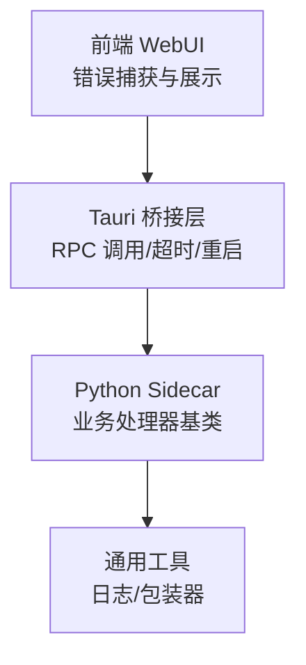
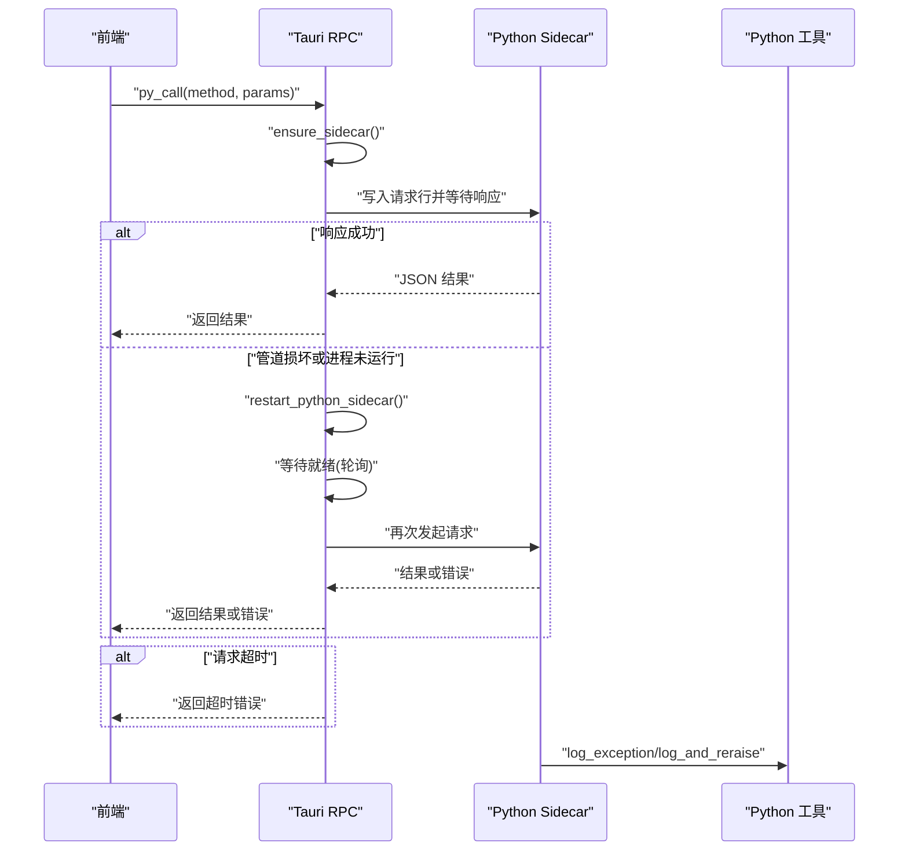
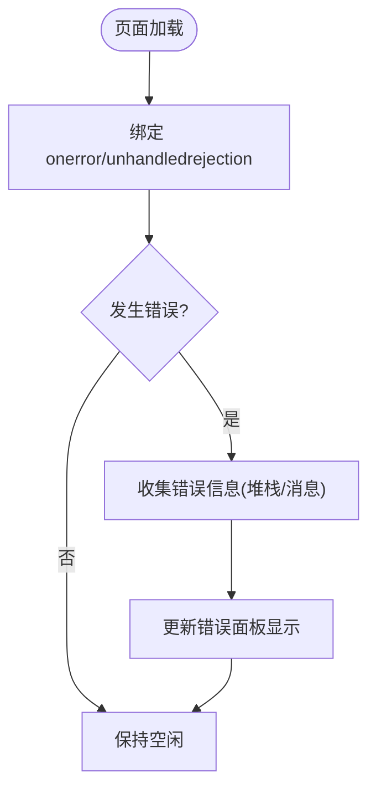
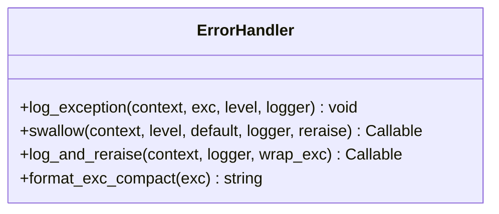
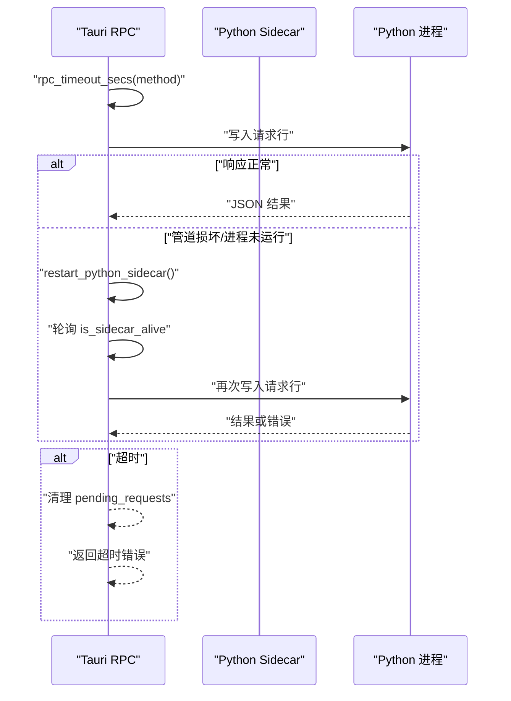
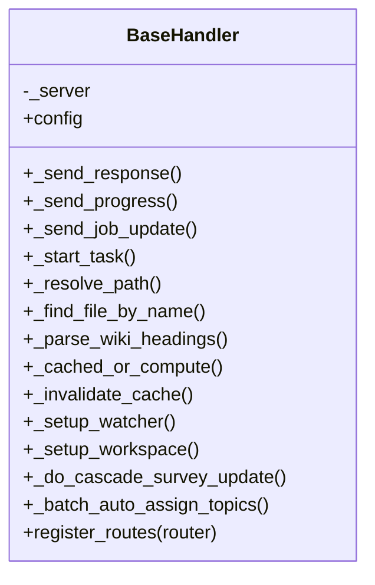

# 错误处理与重试机制

<cite>
**本文引用的文件**
- [webui/js/error-handler.js](file://webui/js/error-handler.js)
- [utils/error_handler.py](file://utils/error_handler.py)
- [src-tauri/src/rpc.rs](file://src-tauri/src/rpc.rs)
- [python/sidecar/handlers/base.py](file://python/sidecar/handlers/base.py)
</cite>

## 目录
1. [简介](#简介)
2. [项目结构](#项目结构)
3. [核心组件](#核心组件)
4. [架构总览](#架构总览)
5. [详细组件分析](#详细组件分析)
6. [依赖关系分析](#依赖关系分析)
7. [性能考量](#性能考量)
8. [故障排查指南](#故障排查指南)
9. [结论](#结论)
10. [附录](#附录)

## 简介
本文件聚焦于前端与后端的错误分类、翻译策略、重试算法、错误上报与监控、日志记录、用户友好提示、故障恢复策略，以及分布式环境下的错误传播与一致性保证。文档同时提供配置项与自定义扩展方法，帮助开发者在 NoteAI 项目中构建健壮的错误处理体系。

## 项目结构
本项目采用前后端分离的桌面应用架构：
- 前端（WebUI）负责用户交互、错误收集与展示。
- Tauri 层作为桥接，负责调用 Python 侧边进程并管理生命周期与超时。
- Python Sidecar 承载业务逻辑，通过统一处理器基类访问上下文与服务。

[无图表来源，因为该图为概念性结构示意]

## 核心组件
- 前端错误捕获与展示：集中捕获全局异常与未处理的 Promise 拒绝，聚合到面板显示，并提供可定制的确认对话框。
- Python 通用错误工具：提供统一的异常日志记录、吞异常装饰器、记录并重抛装饰器、紧凑错误摘要格式化。
- Tauri RPC 与侧边进程管理：包含方法白名单、请求超时控制、管道损坏检测、自动重启与重试一次策略。
- Python 处理器基类：为各功能模块提供统一的上下文、响应发送、任务调度等能力，便于上层实现一致的错误处理风格。

章节来源
- [webui/js/error-handler.js:1-45](file://webui/js/error-handler.js#L1-L45)
- [utils/error_handler.py:1-120](file://utils/error_handler.py#L1-L120)
- [src-tauri/src/rpc.rs:1-284](file://src-tauri/src/rpc.rs#L1-L284)
- [python/sidecar/handlers/base.py:1-106](file://python/sidecar/handlers/base.py#L1-L106)

## 架构总览
下图展示了从前端发起调用到后端执行、错误返回与重试的整体流程，包括超时、管道损坏、自动重启与二次尝试。

图表来源
- [src-tauri/src/rpc.rs:160-188](file://src-tauri/src/rpc.rs#L160-L188)
- [src-tauri/src/rpc.rs:190-271](file://src-tauri/src/rpc.rs#L190-L271)
- [utils/error_handler.py:24-120](file://utils/error_handler.py#L24-L120)

## 详细组件分析

### 前端错误捕获与展示
- 全局异常捕获：监听 window.onerror，将堆栈或消息拼接入错误列表并渲染。
- 未处理 Promise 拒绝：监听 unhandledrejection，将原因或堆栈加入列表并渲染。
- 错误面板：当存在错误时显示面板，并以分隔符连接多条错误信息。
- 自定义确认框：提供 _customConfirm 以支持可定制的用户确认交互。

章节来源
- [webui/js/error-handler.js:11-20](file://webui/js/error-handler.js#L11-L20)
- [webui/js/error-handler.js:6-10](file://webui/js/error-handler.js#L6-L10)
- [webui/js/error-handler.js:22-43](file://webui/js/error-handler.js#L22-L43)

### Python 通用错误工具
- log_exception：在 except 块中记录上下文与异常，支持不同日志级别与自定义 logger。
- swallow：装饰器捕获异常，按级别记录日志并返回默认值；可选择对特定异常类型重新抛出。
- log_and_reraise：装饰器记录异常后重抛，可选择包装为新异常类型。
- format_exc_compact：生成紧凑错误摘要（异常类型+消息+最后帧）。

图表来源
- [utils/error_handler.py:24-120](file://utils/error_handler.py#L24-L120)

章节来源
- [utils/error_handler.py:24-51](file://utils/error_handler.py#L24-L51)
- [utils/error_handler.py:53-82](file://utils/error_handler.py#L53-L82)
- [utils/error_handler.py:85-112](file://utils/error_handler.py#L85-L112)
- [utils/error_handler.py:115-120](file://utils/error_handler.py#L115-L120)

### Tauri RPC 与侧边进程管理
- 方法白名单：仅允许预定义的方法名被调用，防止任意函数暴露。
- 超时控制：根据方法名设置不同的超时秒数，避免长时间阻塞。
- 管道损坏检测：识别“Broken pipe”或系统错误码，触发侧边进程重启。
- 自动重启与重试：检测到管道损坏或未运行时，重启 Python 侧边进程并轮询就绪，然后重试一次请求。
- 错误返回：将错误信息以字符串形式返回给前端，便于统一展示。

图表来源
- [src-tauri/src/rpc.rs:160-167](file://src-tauri/src/rpc.rs#L160-L167)
- [src-tauri/src/rpc.rs:169-188](file://src-tauri/src/rpc.rs#L169-L188)
- [src-tauri/src/rpc.rs:190-271](file://src-tauri/src/rpc.rs#L190-L271)

章节来源
- [src-tauri/src/rpc.rs:4-157](file://src-tauri/src/rpc.rs#L4-L157)
- [src-tauri/src/rpc.rs:160-167](file://src-tauri/src/rpc.rs#L160-L167)
- [src-tauri/src/rpc.rs:169-188](file://src-tauri/src/rpc.rs#L169-L188)
- [src-tauri/src/rpc.rs:190-271](file://src-tauri/src/rpc.rs#L190-L271)
- [src-tauri/src/rpc.rs:273-284](file://src-tauri/src/rpc.rs#L273-L284)

### Python 处理器基类
- 提供对服务器上下文、配置、响应发送、进度推送、任务启动、路径解析、缓存失效、工作区初始化、级联更新、批量分配等能力的统一访问。
- 为具体业务处理器提供一致的接口，便于在上层实现中复用错误处理模式（如使用通用工具进行日志记录与异常包装）。

图表来源
- [python/sidecar/handlers/base.py:4-106](file://python/sidecar/handlers/base.py#L4-L106)

章节来源
- [python/sidecar/handlers/base.py:1-106](file://python/sidecar/handlers/base.py#L1-L106)

## 依赖关系分析
- 前端依赖浏览器事件模型进行错误捕获，不直接依赖后端。
- Tauri 层依赖 Python 子进程通信，具备超时与重启逻辑。
- Python 侧使用通用错误工具进行日志与异常包装，处理器基类提供统一服务访问。

图表来源
- [webui/js/error-handler.js:11-20](file://webui/js/error-handler.js#L11-L20)
- [src-tauri/src/rpc.rs:160-188](file://src-tauri/src/rpc.rs#L160-L188)
- [python/sidecar/handlers/base.py:4-106](file://python/sidecar/handlers/base.py#L4-L106)
- [utils/error_handler.py:24-120](file://utils/error_handler.py#L24-L120)

章节来源
- [webui/js/error-handler.js:11-20](file://webui/js/error-handler.js#L11-L20)
- [src-tauri/src/rpc.rs:160-188](file://src-tauri/src/rpc.rs#L160-L188)
- [python/sidecar/handlers/base.py:4-106](file://python/sidecar/handlers/base.py#L4-L106)
- [utils/error_handler.py:24-120](file://utils/error_handler.py#L24-L120)

## 性能考量
- 超时策略：针对不同方法设置合理超时，避免长任务阻塞前端。
- 重启开销：侧边进程重启需要轮询就绪，应尽量减少不必要的重启。
- 日志级别：在生产环境中建议降低调试日志输出，减少 I/O 压力。
- 错误聚合：前端错误面板应避免频繁重绘，仅在必要时更新。

[本节为通用指导，不涉及具体文件分析]

## 故障排查指南
- 前端错误面板为空但仍有问题：检查是否触发了未处理的 Promise 拒绝，确认错误收集逻辑已绑定。
- Tauri 返回“Python 后端未运行”或“Python 后端重启失败”：查看侧边进程状态与重启轮询逻辑，确认进程健康检查是否生效。
- 请求超时：核对方法对应的超时秒数设置，评估是否需要调整或改为异步流式返回。
- 管道损坏：关注“Broken pipe”或系统错误码，定位网络或进程间通信异常点。
- Python 侧异常未记录：确保在 except 块中使用 log_exception 或相关装饰器进行记录。

章节来源
- [webui/js/error-handler.js:11-20](file://webui/js/error-handler.js#L11-L20)
- [src-tauri/src/rpc.rs:169-188](file://src-tauri/src/rpc.rs#L169-L188)
- [src-tauri/src/rpc.rs:232-244](file://src-tauri/src/rpc.rs#L232-L244)
- [utils/error_handler.py:24-51](file://utils/error_handler.py#L24-L51)

## 结论
通过前端集中错误捕获、Tauri 层的超时与自动重启、Python 侧的统一日志与异常包装，NoteAI 构建了较为完善的错误处理与故障恢复体系。建议在后续迭代中引入更细粒度的错误分类与可重试判断，结合指数退避与最大重试次数，进一步提升系统的鲁棒性与用户体验。

[本节为总结性内容，不涉及具体文件分析]

## 附录

### 错误分类与翻译策略（建议）
- 网络错误：区分 DNS 解析失败、连接超时、HTTP 状态码错误，映射为用户友好的提示文案。
- 服务不可用：检测后端进程存活状态，提示“服务正在重启，请稍后再试”。
- 超时错误：根据方法特性给出差异化提示，并提供重试入口。
- 数据校验错误：返回结构化错误信息，前端高亮对应字段。

[本节为概念性说明，不涉及具体文件分析]

### 重试算法（建议）
- 指数退避：首次重试间隔为基础时间，每次翻倍，上限为最大间隔。
- 最大重试次数：限制重试次数，避免无限重试导致资源耗尽。
- 可重试错误判断：仅对瞬态错误（如网络抖动、服务暂时不可用）进行重试，持久错误直接失败。

[本节为概念性说明，不涉及具体文件分析]

### 错误上报与监控（建议）
- 本地日志：使用统一日志工具记录上下文与异常摘要，便于离线排查。
- 远程上报：在用户授权前提下，将脱敏后的错误摘要上报至监控系统。
- 指标采集：统计错误率、重试成功率、平均恢复时间等关键指标。

[本节为概念性说明，不涉及具体文件分析]

### 分布式环境下的错误传播与一致性（建议）
- 幂等设计：对写操作提供幂等键，避免重复提交导致数据不一致。
- 补偿机制：对失败的任务提供补偿接口，支持人工或自动修复。
- 最终一致性：通过事件驱动与重试队列，保证跨服务的最终一致性。

[本节为概念性说明，不涉及具体文件分析]

### 配置选项与自定义扩展（建议）
- 超时配置：按方法维度配置超时秒数。
- 重试策略：配置基础间隔、最大间隔、最大重试次数。
- 日志级别：支持动态调整日志级别。
- 自定义错误处理器：通过装饰器或中间件注入自定义错误处理逻辑。

[本节为概念性说明，不涉及具体文件分析]