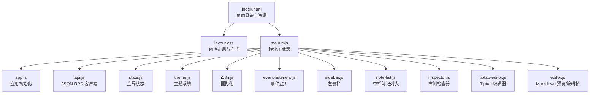
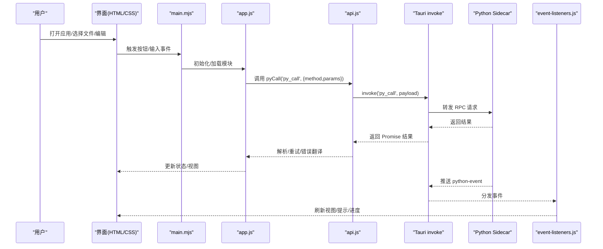
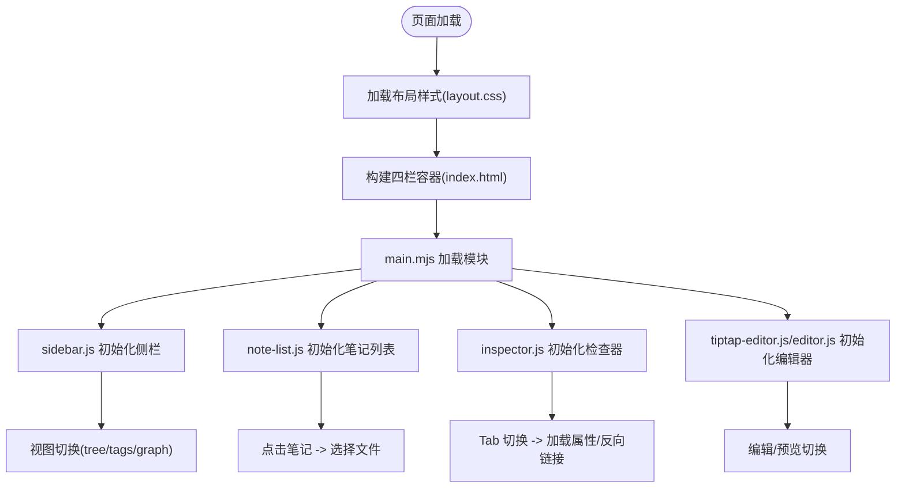
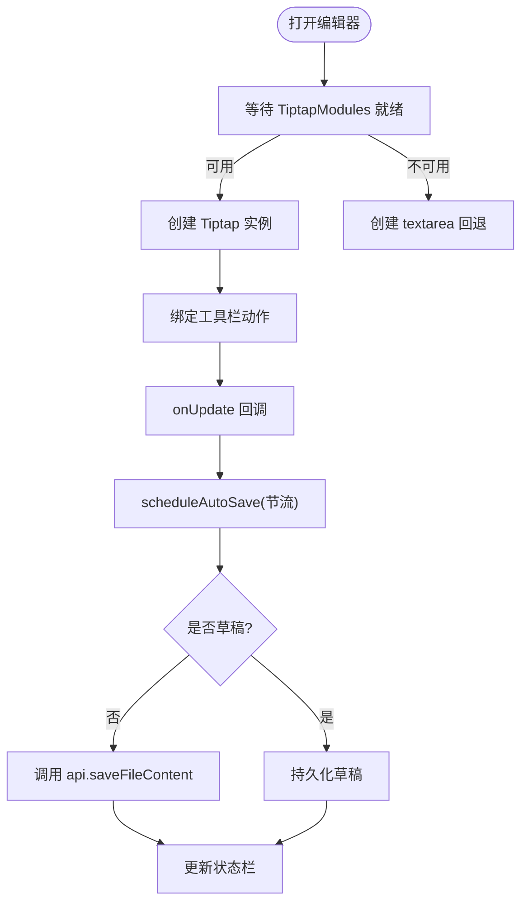
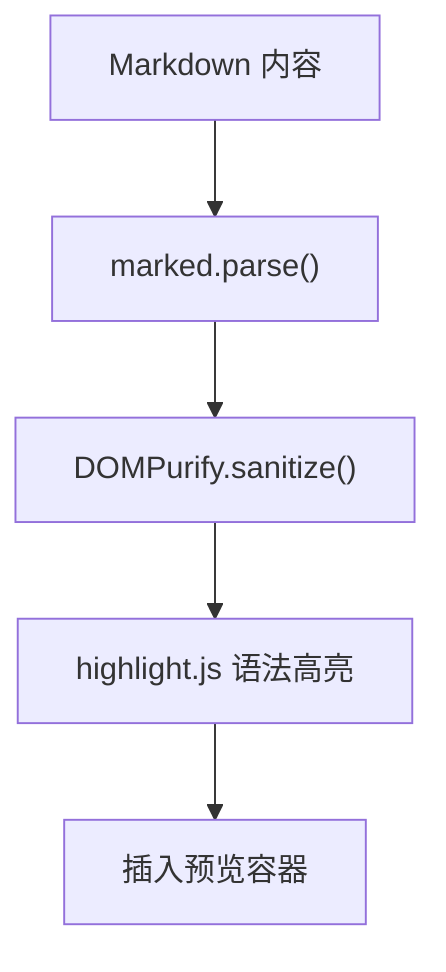
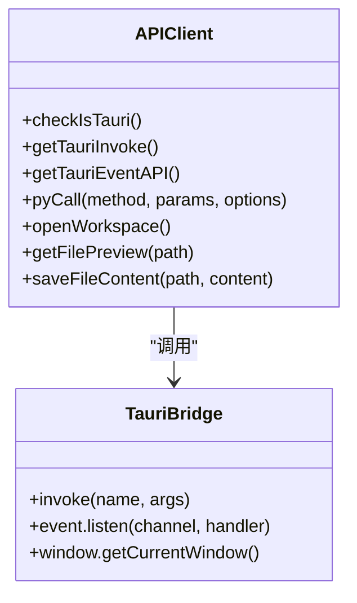
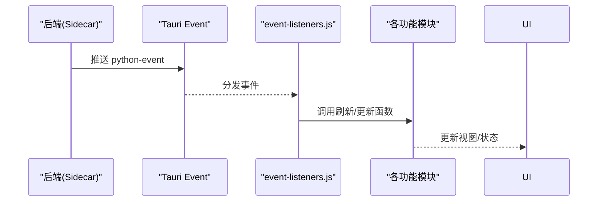
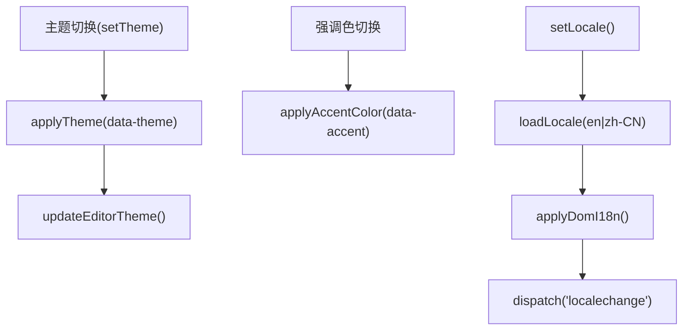
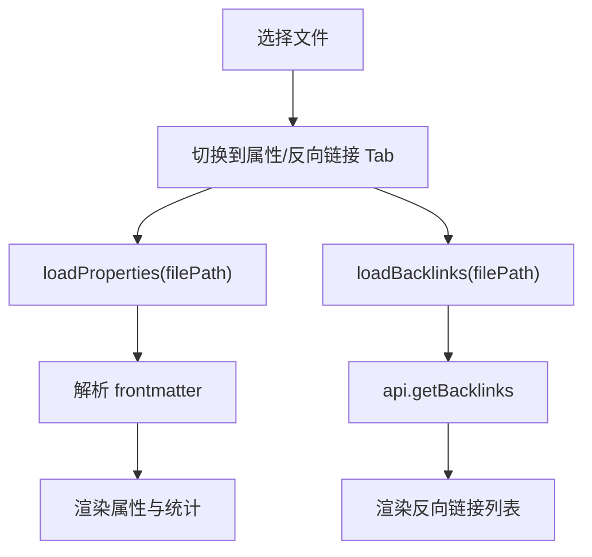
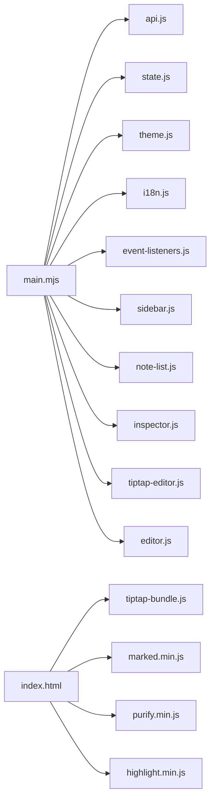

# 前端架构

<cite>
**本文引用的文件**   
- [index.html](file://webui/index.html)
- [layout.css](file://webui/css/layout.css)
- [main.mjs](file://webui/js/main.mjs)
- [app.js](file://webui/js/app.js)
- [api.js](file://webui/js/api.js)
- [state.js](file://webui/js/state.js)
- [theme.js](file://webui/js/theme.js)
- [i18n.js](file://webui/js/i18n.js)
- [event-listeners.js](file://webui/js/event-listeners.js)
- [sidebar.js](file://webui/js/sidebar.js)
- [note-list.js](file://webui/js/note-list.js)
- [inspector.js](file://webui/js/inspector.js)
- [tiptap-editor.js](file://webui/js/tiptap-editor.js)
- [editor.js](file://webui/js/editor.js)
</cite>

## 目录
1. [简介](#简介)
2. [项目结构](#项目结构)
3. [核心组件](#核心组件)
4. [架构总览](#架构总览)
5. [详细组件分析](#详细组件分析)
6. [依赖关系分析](#依赖关系分析)
7. [性能考虑](#性能考虑)
8. [故障排查指南](#故障排查指南)
9. [结论](#结论)
10. [附录](#附录)

## 简介
本文件面向前端开发者，系统性阐述 NoteAI 的前端架构与实现细节。重点覆盖：
- Tolaria 式四栏布局（文件夹侧栏、笔记列表、编辑器/预览、检查器）的布局与交互
- Tiptap 编辑器集成（Markdown WYSIWYG、自动保存、草稿模式）
- Markdown 渲染与高亮、前后端通信（JSON-RPC 封装）、事件驱动与实时状态同步
- 响应式设计、主题切换、国际化支持
- UI 组件开发规范、样式定制指南、性能优化策略
- 实际开发示例与调试技巧

## 项目结构
前端采用“HTML + CSS + 模块化 JS”的轻量架构，通过 main.mjs 按依赖顺序动态加载模块，应用初始化由 app.js 编排。关键入口与职责：
- index.html：页面骨架、资源引入、Tauri 窗口区域、四栏容器
- layout.css：全局变量、四栏布局、标题栏、状态栏、拖拽调整尺寸等
- main.mjs：模块加载器，按序导入并挂载到 window 命名空间
- app.js：应用启动流程、拖放导入、工作区初始化、默认视图展示
- api.js：JSON-RPC 客户端封装、Tauri 调用适配、分页预览拼装
- state.js：全局状态与订阅机制（UI 状态、配置、主题偏好）
- theme.js：主题系统（light/dark/system）、强调色、字体排版、字号缩放
- i18n.js：多语言加载与 DOM 注入
- event-listeners.js：事件总线（python-event），统一分发后端事件
- sidebar.js / note-list.js / inspector.js：三栏面板控制与数据刷新
- tiptap-editor.js / editor.js：WYSIWYG 编辑器与 Markdown 预览/编辑桥接

**图表来源**
- [index.html:1-800](file://webui/index.html#L1-L800)
- [layout.css:1-800](file://webui/css/layout.css#L1-L800)
- [main.mjs:1-201](file://webui/js/main.mjs#L1-L201)
- [app.js:1-376](file://webui/js/app.js#L1-L376)
- [api.js:1-492](file://webui/js/api.js#L1-L492)
- [state.js:1-199](file://webui/js/state.js#L1-L199)
- [theme.js:1-458](file://webui/js/theme.js#L1-L458)
- [i18n.js:1-126](file://webui/js/i18n.js#L1-L126)
- [event-listeners.js:1-259](file://webui/js/event-listeners.js#L1-L259)
- [sidebar.js:1-257](file://webui/js/sidebar.js#L1-L257)
- [note-list.js:1-352](file://webui/js/note-list.js#L1-L352)
- [inspector.js:1-319](file://webui/js/inspector.js#L1-L319)
- [tiptap-editor.js:1-670](file://webui/js/tiptap-editor.js#L1-L670)
- [editor.js:1-540](file://webui/js/editor.js#L1-L540)

**章节来源**
- [index.html:1-800](file://webui/index.html#L1-L800)
- [layout.css:1-800](file://webui/css/layout.css#L1-L800)
- [main.mjs:1-201](file://webui/js/main.mjs#L1-L201)
- [app.js:1-376](file://webui/js/app.js#L1-L376)

## 核心组件
- 四栏布局与可调整尺寸
  - 使用 Flexbox 构建左右两栏（侧栏、内容区）与中间笔记列表；右侧为预览/编辑器与检查器面板
  - 提供 resizer 拖拽条，支持侧栏宽度持久化与预览面板宽度调整
- 侧栏（文件夹树/标签/图谱）
  - 支持视图切换（tree/tags/graph），联动知识图谱过滤与统计更新
- 笔记列表（中栏）
  - 根据选中主题文件夹列出笔记，支持点击跳转与新建笔记
- 编辑器/预览（右区）
  - 优先使用 Tiptap 进行 Markdown WYSIWYG 编辑，失败回退至 CodeMirror/textarea
  - 支持自动保存、草稿模式、Frontmatter 编辑面板
- 检查器（右侧多 Tab）
  - AI 聊天、属性（frontmatter 解析）、反向链接（backlinks）

**章节来源**
- [layout.css:1-800](file://webui/css/layout.css#L1-L800)
- [sidebar.js:1-257](file://webui/js/sidebar.js#L1-L257)
- [note-list.js:1-352](file://webui/js/note-list.js#L1-L352)
- [tiptap-editor.js:1-670](file://webui/js/tiptap-editor.js#L1-L670)
- [editor.js:1-540](file://webui/js/editor.js#L1-L540)
- [inspector.js:1-319](file://webui/js/inspector.js#L1-L319)

## 架构总览
前端以事件驱动为核心，通过 Tauri 事件通道接收后端通知，统一分发到各模块；API 层将 JSON-RPC 方法映射到 window.api，屏蔽底层差异并提供重试与错误翻译。

**图表来源**
- [main.mjs:1-201](file://webui/js/main.mjs#L1-L201)
- [app.js:1-376](file://webui/js/app.js#L1-L376)
- [api.js:1-492](file://webui/js/api.js#L1-L492)
- [event-listeners.js:1-259](file://webui/js/event-listeners.js#L1-L259)

## 详细组件分析

### Tolaria 式四栏布局
- 布局结构
  - 顶部自定义标题栏（可拖拽区域、操作按钮、文件名显示）
  - 左侧侧栏（文件夹树/标签/图谱），可折叠与展开
  - 中间笔记列表（可拖拽调整宽度）
  - 右侧主内容区（首页仪表盘、待处理视图、内容面板、知识图谱面板、预览/编辑器、检查器）
- 交互逻辑
  - 侧栏视图切换联动图谱过滤与统计
  - 笔记列表点击触发文件选择与预览/编辑器打开
  - 预览/编辑器切换按钮控制显示隐藏
  - 检查器多 Tab 切换，按需加载数据

**图表来源**
- [index.html:1-800](file://webui/index.html#L1-L800)
- [layout.css:1-800](file://webui/css/layout.css#L1-L800)
- [sidebar.js:1-257](file://webui/js/sidebar.js#L1-L257)
- [note-list.js:1-352](file://webui/js/note-list.js#L1-L352)
- [inspector.js:1-319](file://webui/js/inspector.js#L1-L319)
- [tiptap-editor.js:1-670](file://webui/js/tiptap-editor.js#L1-L670)
- [editor.js:1-540](file://webui/js/editor.js#L1-L540)

**章节来源**
- [index.html:1-800](file://webui/index.html#L1-L800)
- [layout.css:1-800](file://webui/css/layout.css#L1-L800)
- [sidebar.js:1-257](file://webui/js/sidebar.js#L1-L257)
- [note-list.js:1-352](file://webui/js/note-list.js#L1-L352)
- [inspector.js:1-319](file://webui/js/inspector.js#L1-L319)

### Tiptap 编辑器集成与自动保存
- 模块加载与降级
  - 等待 tiptap-bundle.js 暴露 window.TiptapModules，若不可用则创建 textarea 回退
- 大文档延迟解析
  - 超过阈值时通过 requestIdleCallback 或 setTimeout 异步 setContent，避免阻塞首屏
- 自动保存与草稿
  - 用户编辑后节流 1s 触发保存；草稿模式下写入本地草稿存储
- Frontmatter 面板
  - 解析并展示 YAML frontmatter，编辑后合并全文并触发保存
- 工具栏与状态
  - 绑定 toolbar 动作，更新活跃态；状态栏显示保存状态、光标位置

**图表来源**
- [tiptap-editor.js:1-670](file://webui/js/tiptap-editor.js#L1-L670)
- [editor.js:1-540](file://webui/js/editor.js#L1-L540)
- [api.js:1-492](file://webui/js/api.js#L1-L492)

**章节来源**
- [tiptap-editor.js:1-670](file://webui/js/tiptap-editor.js#L1-L670)
- [editor.js:1-540](file://webui/js/editor.js#L1-L540)

### Markdown 渲染与高亮
- 使用 marked 解析 Markdown，结合 highlight.js 进行代码高亮
- 安全过滤：DOMPurify 清理 HTML，防止 XSS
- 主题联动：根据 data-theme 切换 hljs 主题样式

**图表来源**
- [editor.js:1-540](file://webui/js/editor.js#L1-L540)

**章节来源**
- [editor.js:1-540](file://webui/js/editor.js#L1-L540)

### 前后端通信机制（JSON-RPC 客户端）
- 环境检测：判断是否在 Tauri 环境，获取 invoke/event API
- 统一调用：pyCall(method, params) 包装 invoke('py_call', ...)
- 重试与错误翻译：对特定错误进行重试与友好消息转换
- 特殊 API：文件对话框、窗口控制、分页预览拼装（raw_slices/base64_utf8）
- 配置化注册：API_DEFS 批量生成 window.api.* 方法

**图表来源**
- [api.js:1-492](file://webui/js/api.js#L1-L492)

**章节来源**
- [api.js:1-492](file://webui/js/api.js#L1-L492)

### 事件驱动架构与实时状态同步
- 事件源：后端通过 Tauri 事件通道推送 python-event
- 统一监听：event-listeners.js 订阅并分发各类事件（workspace_files_changed、sidecar_*、rag_*、ingest_*、cli_agent_*）
- 视图刷新：根据事件类型调用对应模块刷新（TreeModule、LinksModule、IngestModule、AssistantModule 等）
- 初始 Ingest：应用启动后尝试 ensure_ingest，避免重复扫描

**图表来源**
- [event-listeners.js:1-259](file://webui/js/event-listeners.js#L1-L259)
- [app.js:1-376](file://webui/js/app.js#L1-L376)

**章节来源**
- [event-listeners.js:1-259](file://webui/js/event-listeners.js#L1-L259)
- [app.js:1-376](file://webui/js/app.js#L1-L376)

### 响应式设计、主题切换、国际化
- 响应式
  - 基于 CSS 变量与 Flexbox，侧栏/笔记列表/预览面板均可拖拽调整宽度
  - 小屏下可通过按钮收起/展开面板
- 主题
  - 支持 light/dark/system 三种模式，跟随系统偏好
  - 强调色（accent）与字体排版（typography）可配置，持久化到本地与后端
- 国际化
  - 通过 i18n.js 加载 locales/*.json，支持 data-i18n 属性注入文本与占位符
  - 切换语言后触发 localechange 事件，刷新相关视图

**图表来源**
- [theme.js:1-458](file://webui/js/theme.js#L1-L458)
- [i18n.js:1-126](file://webui/js/i18n.js#L1-L126)

**章节来源**
- [theme.js:1-458](file://webui/js/theme.js#L1-L458)
- [i18n.js:1-126](file://webui/js/i18n.js#L1-L126)

### 检查器（Inspector）组件
- 三个 Tab：AI 聊天、属性（frontmatter 解析）、反向链接（backlinks）
- 属性 Tab：读取原始文件内容，解析 YAML frontmatter，渲染键值与统计信息
- 反向链接 Tab：调用 getBacklinks，渲染引用当前文件的笔记列表，点击可跳转

**图表来源**
- [inspector.js:1-319](file://webui/js/inspector.js#L1-L319)
- [api.js:1-492](file://webui/js/api.js#L1-L492)

**章节来源**
- [inspector.js:1-319](file://webui/js/inspector.js#L1-L319)

## 依赖关系分析
- 模块加载顺序
  - main.mjs 依次导入 utils/window/api/state/i18n/assistant/theme/icons/toast/settings/cloud-sync/workspace/tree/note-list/inspector/cli-tool-summary/cli-agent/statusbar/sidebar/tiptap-editor/preview/selection-tools/editor/converter/downloader/integrator/topic/search/pending/tabs/workspace-rules/ingest/job-center/home/note-draft/quick-create/event-listeners/app
- 运行时依赖
  - marked、DOMPurify、highlight.js、pdfjs、tiptap-bundle 在 index.html 中预加载
  - Tauri invoke/event API 在 api.js 中探测并使用

**图表来源**
- [main.mjs:1-201](file://webui/js/main.mjs#L1-L201)
- [index.html:1-800](file://webui/index.html#L1-L800)

**章节来源**
- [main.mjs:1-201](file://webui/js/main.mjs#L1-L201)
- [index.html:1-800](file://webui/index.html#L1-L800)

## 性能考虑
- 大文档懒加载与空闲调度
  - 当内容长度或行数超过阈值时，使用 requestIdleCallback 或 setTimeout 延迟 setContent，降低首屏阻塞
- 自动保存节流
  - 编辑事件节流 1s，避免频繁 IO；草稿模式直接落盘本地
- 预览内容分片传输
  - 对于超大文件，后端返回 raw_slices，前端循环读取并拼接 UTF-8 文本，再回退到语义预览
- 主题与字体
  - 主题切换仅修改 CSS 变量与类名，避免重建 DOM；字体排版通过 CSS 变量生效
- 事件去抖
  - workspace_files_changed 事件 3s 去抖刷新，减少频繁重绘

[本节为通用指导，不直接分析具体文件]

## 故障排查指南
- Tauri 环境检测失败
  - 现象：抛出“Not running in Tauri”或“Tauri invoke not available”
  - 排查：确认运行环境，检查 __TAURI__ 或 __TAURI_INTERNALS__ 是否存在
- 后端服务不可用
  - 现象：sidecar 错误、超时、重启提示
  - 排查：查看 sidecar 日志，重启应用；关注 event-listeners.js 中的 sidecar_* 事件
- 编辑器未加载
  - 现象：显示“编辑器未加载，请重启应用”，进入 textarea 回退模式
  - 排查：确认 tiptap-bundle.js 已加载且 window.TiptapModules 存在；必要时重启应用
- 自动保存失败
  - 现象：状态栏显示“保存失败”
  - 排查：检查 api.saveFileContent 返回值与网络/文件系统权限；查看 performSave 的错误分支
- 预览解析错误
  - 现象：Marked 解析报错或 XSS 警告
  - 排查：确认 DOMPurify 可用；检查 marked 配置与 highlight.js 语言支持

**章节来源**
- [api.js:1-492](file://webui/js/api.js#L1-L492)
- [event-listeners.js:1-259](file://webui/js/event-listeners.js#L1-L259)
- [tiptap-editor.js:1-670](file://webui/js/tiptap-editor.js#L1-L670)
- [editor.js:1-540](file://webui/js/editor.js#L1-L540)

## 结论
NoteAI 前端采用清晰的分层与模块化设计，围绕 Tauri 事件驱动与 JSON-RPC 通信，实现了高效的四栏布局与丰富的笔记编辑体验。Tiptap 编辑器提供稳定的 WYSIWYG 能力，配合自动保存与草稿模式提升可用性。主题系统与国际化支持完善，便于扩展与定制。整体架构具备良好的可维护性与可扩展性。

[本节为总结，不直接分析具体文件]

## 附录

### UI 组件开发规范
- 命名与组织
  - 模块文件以功能命名（如 sidebar.js、note-list.js），统一挂载到 window 命名空间
  - 对外接口以 Module 对象形式暴露，内部函数保持私有
- 事件与状态
  - 使用 event-listeners.js 统一分发后端事件；UI 变更通过 state.js 的 subscribe/notify 机制同步
- 样式与主题
  - 遵循 layout.css 的 CSS 变量体系；新增组件尽量复用现有类名与变量
- 国际化
  - 使用 data-i18n/data-i18n-placeholder/data-i18n-title 等属性；通过 i18n.js 注入文本

### 样式定制指南
- 主题变量
  - 通过 --bg、--text、--primary 等变量定义颜色与背景
- 强调色与字体
  - 使用 setAccentColor 与 applyTypography 设置强调色与角色字体
- 字号缩放
  - 通过 setFontSize 设置 --font-scale，影响全局字号

### 性能优化策略
- 延迟初始化重型模块（如 Tiptap）
- 大文档使用空闲调度与虚拟滚动提示
- 事件去抖与节流
- 预览内容分片传输与回退策略

### 实际开发示例与调试技巧
- 打开编辑器
  - 调用 TiptapEditorModule.openMarkdownInEditor(content, path, draftMeta)
- 切换编辑/预览
  - 调用 toggleEditMode()，观察 titlebar-split-btn 状态
- 监听后端事件
  - 在 event-listeners.js 中添加新事件类型处理，刷新对应模块
- 调试 JSON-RPC
  - 在 api.js 的 pyCall 中打印 method 与 params，确认后端路由与方法名一致
- 调试主题与国际化
  - 在浏览器控制台执行 setTheme/setLocale，观察 CSS 变量与 DOM 文本变化

**章节来源**
- [tiptap-editor.js:1-670](file://webui/js/tiptap-editor.js#L1-L670)
- [editor.js:1-540](file://webui/js/editor.js#L1-L540)
- [event-listeners.js:1-259](file://webui/js/event-listeners.js#L1-L259)
- [api.js:1-492](file://webui/js/api.js#L1-L492)
- [theme.js:1-458](file://webui/js/theme.js#L1-L458)
- [i18n.js:1-126](file://webui/js/i18n.js#L1-L126)