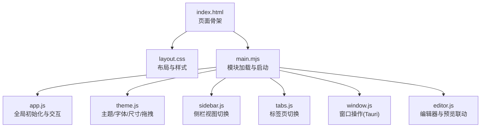
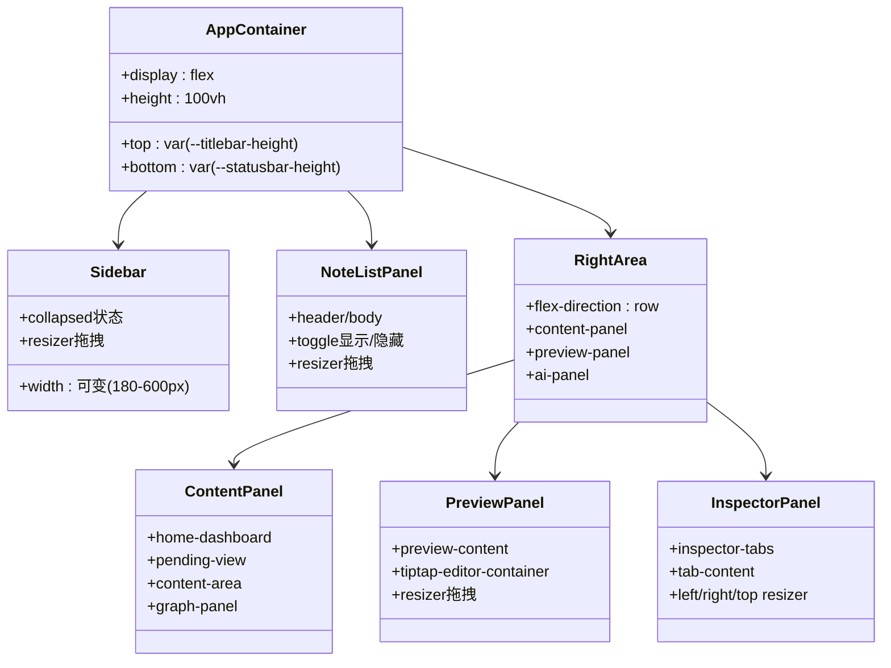
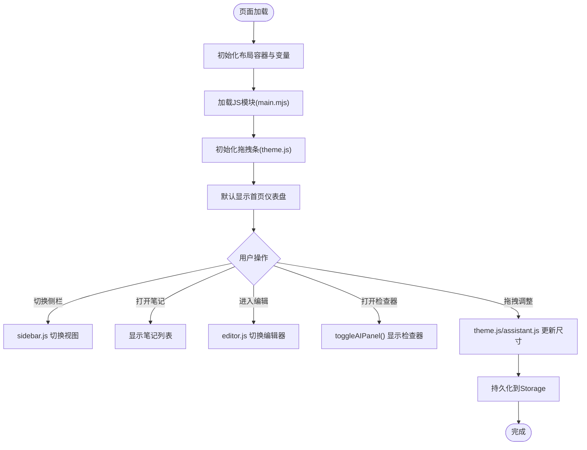
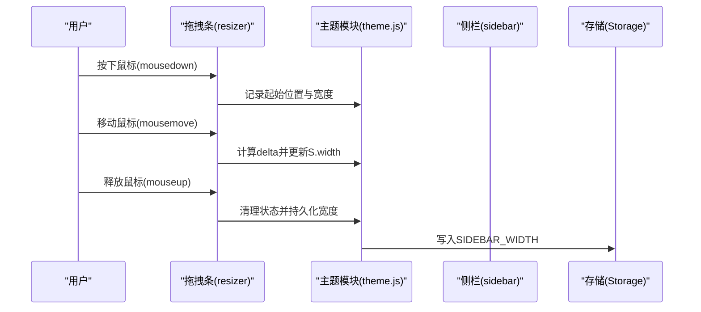
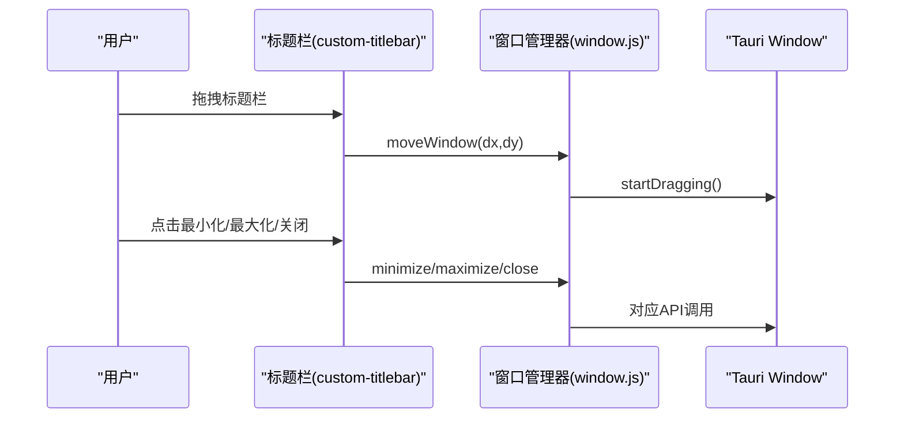
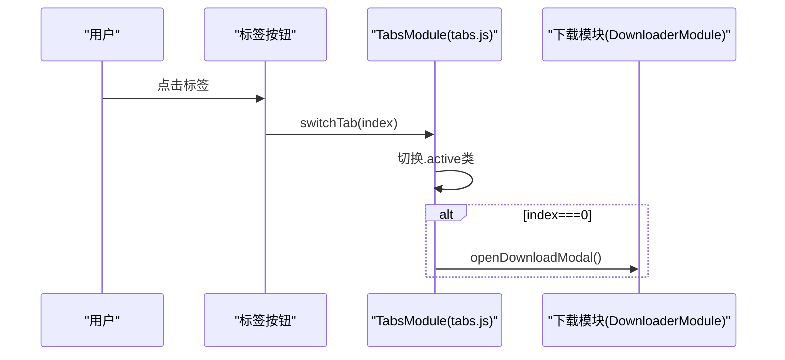
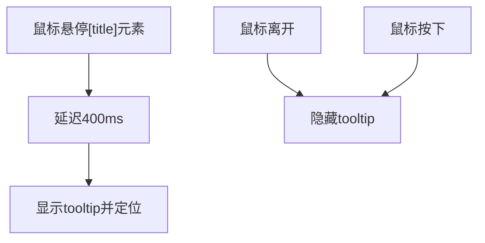
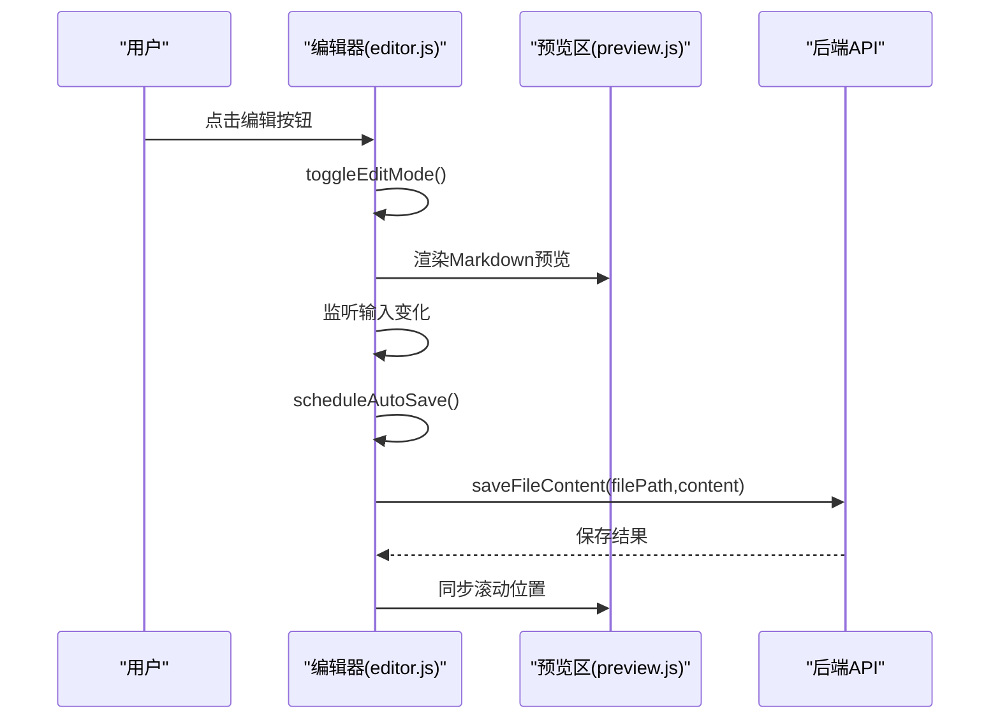
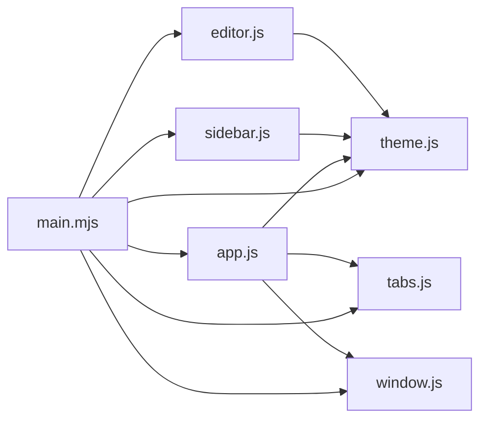

# 界面布局系统

<cite>
**本文引用的文件**   
- [index.html](file://webui/index.html)
- [layout.css](file://webui/css/layout.css)
- [main.mjs](file://webui/js/main.mjs)
- [app.js](file://webui/js/app.js)
- [tabs.js](file://webui/js/tabs.js)
- [sidebar.js](file://webui/js/sidebar.js)
- [theme.js](file://webui/js/theme.js)
- [window.js](file://webui/js/window.js)
- [editor.js](file://webui/js/editor.js)
</cite>

## 目录
1. [简介](#简介)
2. [项目结构](#项目结构)
3. [核心组件](#核心组件)
4. [架构总览](#架构总览)
5. [详细组件分析](#详细组件分析)
6. [依赖关系分析](#依赖关系分析)
7. [性能考量](#性能考量)
8. [故障排查指南](#故障排查指南)
9. [结论](#结论)
10. [附录](#附录)

## 简介
本技术文档聚焦于 NoteAI 前端界面的“Tolaria 式四栏布局”实现，涵盖：
- 区域划分：文件夹侧栏、笔记列表、编辑器/预览区、检查器（AI 面板）
- 布局策略：CSS Grid 与 Flexbox 的组合使用
- 交互能力：面板拖拽调整大小、窗口拖拽、标签页切换、自定义工具提示
- 定制与优化：布局定制指南与性能优化建议
- 实战示例与调试技巧

该布局以响应式为目标，通过 CSS 变量控制主题与尺寸，结合 JS 模块化的事件处理与状态管理，提供稳定且可扩展的桌面端体验。

## 项目结构
前端资源位于 webui 目录，关键文件如下：
- HTML 入口：定义标题栏、主容器、四栏区域与右侧检查器的 DOM 骨架
- CSS 样式：集中定义布局、面板、拖拽条、主题变量等
- JS 模块：按功能拆分，包括初始化、主题、窗口管理、侧栏、标签页、编辑器等

图表来源
- [index.html:1-120](file://webui/index.html#L1-L120)
- [layout.css:1-120](file://webui/css/layout.css#L1-L120)
- [main.mjs:1-60](file://webui/js/main.mjs#L1-L60)

章节来源
- [index.html:1-120](file://webui/index.html#L1-L120)
- [layout.css:1-120](file://webui/css/layout.css#L1-L120)
- [main.mjs:1-60](file://webui/js/main.mjs#L1-L60)

## 核心组件
- 应用容器与状态栏
  - 顶部自定义标题栏支持拖拽区域与窗口控件
  - 底部状态栏显示当前文件、保存状态、待办计数等
- 四栏布局
  - 左侧：文件夹侧栏（可折叠/展开，宽度可调）
  - 中左：笔记列表（可隐藏/显示，宽度可调）
  - 中间：内容面板（首页仪表盘/工作区内容/知识图谱）
  - 右侧：预览/编辑器与 AI 检查器（可并排或独立显示）
- 拖拽调整
  - 侧栏与笔记列表之间、预览区与内容区之间均有拖拽条
  - AI 检查器支持左右与上下方向调整
- 交互功能
  - 标签页切换（下载/导入等）
  - 自定义工具提示（延迟显示、边界自适应）
  - 窗口拖拽与最小化/最大化/关闭（Tauri 环境）

章节来源
- [index.html:33-140](file://webui/index.html#L33-L140)
- [layout.css:24-120](file://webui/css/layout.css#L24-L120)
- [layout.css:317-450](file://webui/css/layout.css#L317-L450)
- [layout.css:662-740](file://webui/css/layout.css#L662-L740)
- [layout.css:954-1010](file://webui/css/layout.css#L954-L1010)
- [layout.css:1098-1170](file://webui/css/layout.css#L1098-L1170)
- [app.js:1-60](file://webui/js/app.js#L1-L60)
- [tabs.js:1-22](file://webui/js/tabs.js#L1-L22)
- [window.js:1-99](file://webui/js/window.js#L1-L99)

## 架构总览
整体采用“Flexbox 为主、Grid 为辅”的策略：
- 外层容器 app-container 使用 Flex 纵向排列，固定高度覆盖视口
- 主区域 right-area 使用 Flex 横向排列，承载内容面板、预览区与 AI 检查器
- 侧栏 sidebar 与笔记列表 note-list-panel 作为独立 Flex 子项，配合 resizer 实现水平分割
- AI 检查器内部使用 Grid 将头部、消息区、输入区三行布局

图表来源
- [layout.css:24-40](file://webui/css/layout.css#L24-L40)
- [layout.css:662-740](file://webui/css/layout.css#L662-L740)
- [layout.css:954-1010](file://webui/css/layout.css#L954-L1010)
- [layout.css:972-1004](file://webui/css/layout.css#L972-L1004)
- [layout.css:1098-1170](file://webui/css/layout.css#L1098-L1170)
- [index.html:135-633](file://webui/index.html#L135-L633)

## 详细组件分析

### 四栏布局与响应式设计
- 布局容器
  - app-container 使用 flex 纵向填充，固定 top/bottom 偏移以适配自定义标题栏与状态栏
  - body 设置 100vh 与 overflow:hidden，确保无滚动溢出
- 侧栏
  - sidebar 默认宽度 240px，支持 180-600px 范围拖拽；collapsed 类用于极窄展示
  - 通过 CSS 变量 --column-header-height 统一各列头部高度
- 笔记列表
  - note-list-panel 与 content-panel 并列在 right-area 内，可通过按钮切换显示/隐藏
  - 拖拽条 #note-list-resizer 控制其宽度
- 内容面板
  - content-panel 包含 home-dashboard、pending-view、content-area、graph-panel 等多个视图
  - 根据用户选择动态显示不同视图
- 预览/编辑器
  - preview-panel 与 content-panel 同属 right-area，支持拖拽调整宽度
  - tiptap-editor-container 在编辑模式下显示，与预览内容联动
- AI 检查器
  - inspector-panel 在 right-area 内以 flex 并排显示，支持左右与上下拖拽
  - 内部使用 grid-template-rows: auto minmax(0, 1fr) auto 实现头/体/尾三段式布局

图表来源
- [main.mjs:1-60](file://webui/js/main.mjs#L1-L60)
- [theme.js:278-322](file://webui/js/theme.js#L278-L322)
- [sidebar.js:143-222](file://webui/js/sidebar.js#L143-L222)
- [editor.js:469-502](file://webui/js/editor.js#L469-L502)
- [app.js:1-60](file://webui/js/app.js#L1-L60)

章节来源
- [layout.css:24-40](file://webui/css/layout.css#L24-L40)
- [layout.css:662-740](file://webui/css/layout.css#L662-L740)
- [layout.css:954-1010](file://webui/css/layout.css#L954-L1010)
- [layout.css:972-1004](file://webui/css/layout.css#L972-L1004)
- [layout.css:1098-1170](file://webui/css/layout.css#L1098-L1170)
- [index.html:135-633](file://webui/index.html#L135-L633)

### 拖拽调整大小机制
- 侧栏拖拽
  - 监听 mousedown/mousemove/mouseup，计算 delta 更新 width/min-width
  - 拖拽期间禁用用户选择与图谱重绘，提升流畅度
  - 完成后将宽度写入 Storage 以便恢复
- 笔记列表拖拽
  - 类似逻辑，控制 note-list-panel 的宽度
- 预览区拖拽
  - 基于 preview-panel 的 getBoundingClientRect 计算新宽度
- AI 检查器拖拽
  - 左右与上下方向分别处理，限制最小/最大尺寸
  - 激活态添加 ai-resizer-active 类高亮拖拽条

图表来源
- [theme.js:278-322](file://webui/js/theme.js#L278-L322)
- [theme.js:324-357](file://webui/js/theme.js#L324-L357)
- [assistant.js:152-248](file://webui/js/assistant.js#L152-L248)

章节来源
- [theme.js:278-322](file://webui/js/theme.js#L278-L322)
- [theme.js:324-357](file://webui/js/theme.js#L324-L357)
- [assistant.js:152-248](file://webui/js/assistant.js#L152-L248)

### 窗口拖拽与系统集成
- 自定义标题栏标记为拖拽区域，支持原生拖动
- Tauri 环境下调用 window.startDragging()/minimize()/toggleMaximize()/close()
- 在非 Tauri 环境降级处理，避免报错

图表来源
- [index.html:37-134](file://webui/index.html#L37-L134)
- [window.js:46-74](file://webui/js/window.js#L46-L74)

章节来源
- [index.html:37-134](file://webui/index.html#L37-L134)
- [window.js:1-99](file://webui/js/window.js#L1-L99)

### 标签页切换
- 通过 switchTab(tabIndex) 切换 .tab-content 的 active 类
- 第一个标签页触发下载模态框初始化

图表来源
- [tabs.js:1-22](file://webui/js/tabs.js#L1-L22)
- [index.html:39-52](file://webui/index.html#L39-L52)

章节来源
- [tabs.js:1-22](file://webui/js/tabs.js#L1-L22)
- [index.html:39-52](file://webui/index.html#L39-L52)

### 自定义工具提示
- 监听 mouseover/mouseout/mousedown，延迟 400ms 显示 tooltip
- 自动计算位置，防止超出视口边界
- 点击任意位置隐藏 tooltip

图表来源
- [app.js:312-353](file://webui/js/app.js#L312-L353)

章节来源
- [app.js:312-353](file://webui/js/app.js#L312-L353)

### 编辑器与预览联动
- 编辑器模式切换：进入/退出 tiptap 编辑器，同时更新工具栏与按钮状态
- 滚动同步：编辑器与预览区双向滚动比例同步
- 自动保存：输入变化后延时保存，避免频繁 IO

图表来源
- [editor.js:469-502](file://webui/js/editor.js#L469-L502)
- [editor.js:320-376](file://webui/js/editor.js#L320-L376)
- [editor.js:380-437](file://webui/js/editor.js#L380-L437)

章节来源
- [editor.js:469-502](file://webui/js/editor.js#L469-L502)
- [editor.js:320-376](file://webui/js/editor.js#L320-L376)
- [editor.js:380-437](file://webui/js/editor.js#L380-L437)

## 依赖关系分析
- 模块加载顺序由 main.mjs 控制，确保依赖先于消费者加载
- 主题与拖拽初始化在 app.js 中统一调用
- 侧栏视图切换与统计更新由 sidebar.js 负责
- 编辑器与预览联动由 editor.js 与 preview.js 协作完成

图表来源
- [main.mjs:1-60](file://webui/js/main.mjs#L1-L60)
- [app.js:1-60](file://webui/js/app.js#L1-L60)

章节来源
- [main.mjs:1-60](file://webui/js/main.mjs#L1-L60)
- [app.js:1-60](file://webui/js/app.js#L1-L60)

## 性能考量
- 拖拽期间暂停图谱重绘，减少重排重绘开销
- 自动保存使用定时器合并多次写入，降低 IO 压力
- 使用 CSS 变量统一管理主题与尺寸，避免频繁样式计算
- 大文本预览时启用懒加载与增量渲染（如需要）

[本节为通用指导，不直接分析具体文件]

## 故障排查指南
- 侧栏无法拖拽
  - 检查 resizer 是否存在与是否被其他元素遮挡
  - 确认 theme.js 的 initResizer 已执行
- 预览区宽度异常
  - 查看 preview-resizer 的事件绑定与边界校验
- 编辑器无法保存
  - 检查 performSave 的错误分支与 API 返回状态
- 工具提示不显示
  - 确认元素带有 title 属性且未被 preventDefault 阻止

章节来源
- [theme.js:278-322](file://webui/js/theme.js#L278-L322)
- [theme.js:324-357](file://webui/js/theme.js#L324-L357)
- [editor.js:320-376](file://webui/js/editor.js#L320-L376)
- [app.js:312-353](file://webui/js/app.js#L312-L353)

## 结论
本布局系统通过清晰的 Flex/Grid 组合、模块化 JS 与 CSS 变量体系，实现了稳定、可扩展的四栏布局。拖拽调整、窗口集成、标签页切换与自定义工具提示等功能完善，满足复杂桌面应用的交互需求。建议在后续迭代中继续优化大图谱渲染与大数据量预览的性能表现。

[本节为总结性内容，不直接分析具体文件]

## 附录
- 布局定制要点
  - 修改 CSS 变量以调整头部高度、边框颜色与背景
  - 扩展 sidebar-pane 以新增侧栏视图
  - 在 right-area 中添加新的面板需遵循 flex 布局规则
- 调试技巧
  - 使用浏览器开发者工具检查 resizer 的 mousedown/mousemove/mouseup 事件
  - 在 console 中调用 ThemeModule.initResizer() 重新初始化拖拽
  - 通过 Storage 查看 SIDEBAR_WIDTH 与 FONT_SIZE 等键值

[本节为补充信息，不直接分析具体文件]