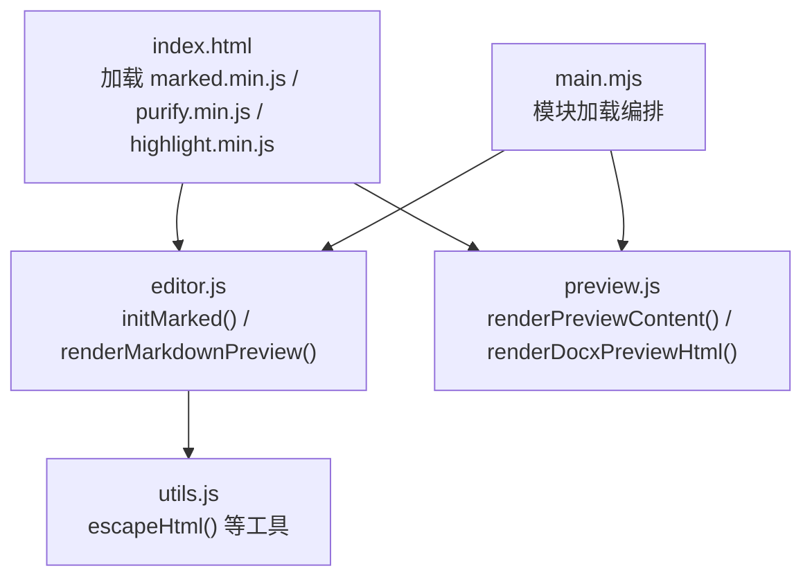
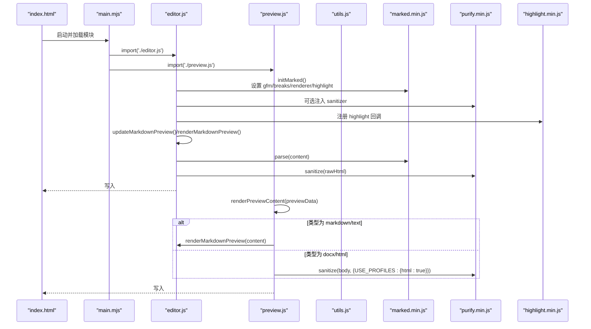
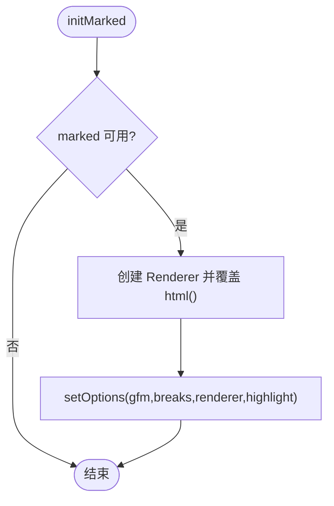
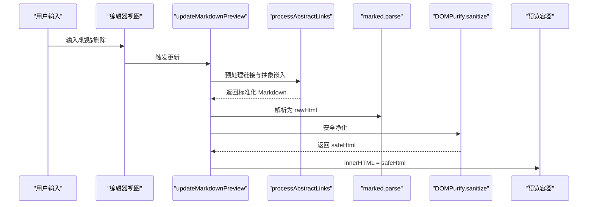
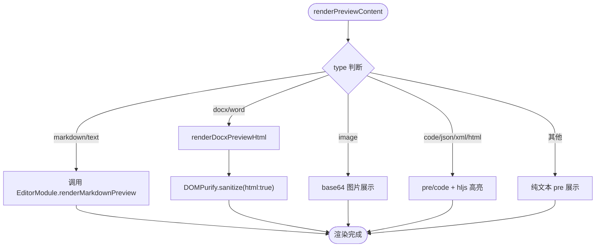
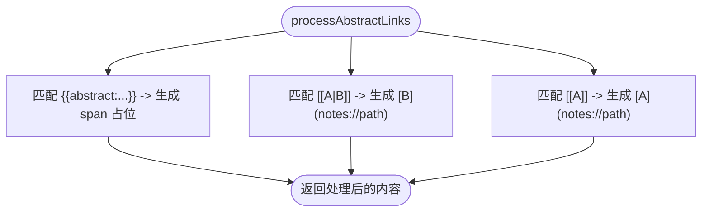
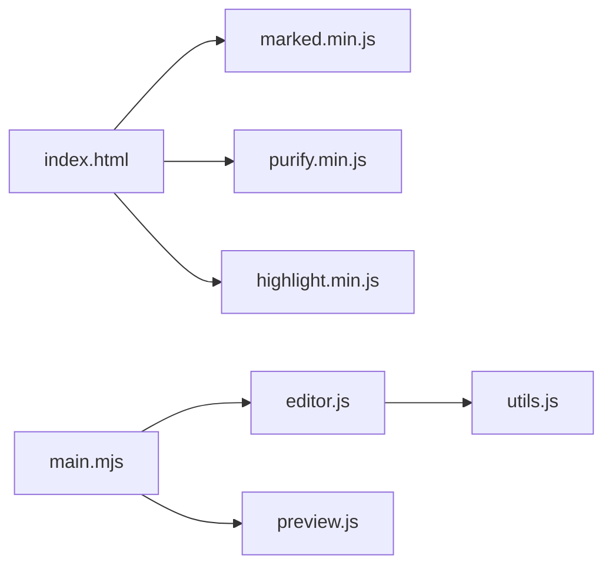

# Markdown 渲染引擎

<cite>
**本文引用的文件**   
- [index.html](file://webui/index.html)
- [editor.js](file://webui/js/editor.js)
- [preview.js](file://webui/js/preview.js)
- [utils.js](file://webui/js/utils.js)
- [main.mjs](file://webui/js/main.mjs)
</cite>

## 目录
1. [简介](#简介)
2. [项目结构](#项目结构)
3. [核心组件](#核心组件)
4. [架构总览](#架构总览)
5. [详细组件分析](#详细组件分析)
6. [依赖关系分析](#依赖关系分析)
7. [性能考虑](#性能考虑)
8. [故障排查指南](#故障排查指南)
9. [结论](#结论)
10. [附录](#附录)

## 简介
本技术文档围绕前端 Markdown 渲染子系统，系统性梳理基于 Marked.js 的解析与渲染流程、GFM 支持、代码高亮集成、安全过滤策略（DOMPurify）、自定义渲染器扩展、语法解析规则定制、链接处理系统（内部笔记链接、外部链接、抽象链接）以及渲染性能优化与错误处理最佳实践。该子系统由 HTML 入口加载第三方库，通过编辑器模块初始化 Marked 配置，在编辑与预览两个路径中完成内容渲染与安全净化，并在预览页面对 Docx/HTML 内容进行二次净化展示。

## 项目结构
Markdown 渲染相关的前端资源集中在 webui 目录：
- 资源入口 index.html 负责加载 Marked、DOMPurify、Highlight.js 等关键库
- editor.js 实现 Marked 初始化、渲染管线、链接预处理、主题联动与自动保存
- preview.js 负责预览面板的内容渲染与类型分发，并对 Docx/HTML 进行 DOMPurify 净化
- utils.js 提供基础工具函数（如 escapeHtml），作为安全兜底
- main.mjs 按顺序加载各模块，确保依赖就绪后再启用渲染能力

图表来源
- [index.html:19-26](file://webui/index.html#L19-L26)
- [editor.js:14-43](file://webui/js/editor.js#L14-L43)
- [preview.js:419-496](file://webui/js/preview.js#L419-L496)
- [utils.js:3-13](file://webui/js/utils.js#L3-L13)
- [main.mjs:103-104](file://webui/js/main.mjs#L103-L104)

章节来源
- [index.html:19-26](file://webui/index.html#L19-L26)
- [editor.js:14-43](file://webui/js/editor.js#L14-L43)
- [preview.js:419-496](file://webui/js/preview.js#L419-L496)
- [utils.js:3-13](file://webui/js/utils.js#L3-L13)
- [main.mjs:103-104](file://webui/js/main.mjs#L103-L104)

## 核心组件
- Marked 初始化与配置
  - 启用 GFM 与换行保留
  - 注入自定义 renderer.html 以结合 DOMPurify 做白名单过滤
  - 注册 highlight 回调，优先按语言高亮，否则自动识别
- 渲染管线
  - 编辑器实时预览：parse → sanitize → 写入 DOM
  - 独立预览面板：根据类型分支渲染，对 HTML 内容使用 DOMPurify 净化
- 链接预处理
  - 将自定义双括号链接转换为标准 Markdown 链接
  - 将抽象嵌入语法转为可交互占位节点
- 安全过滤
  - 全局使用 DOMPurify.sanitize；未加载时回退到标签白名单正则过滤
  - 文本输入统一使用 escapeHtml 兜底
- 主题与高亮
  - 根据系统或用户主题切换高亮样式表
  - 动态更新已渲染代码块的高亮

章节来源
- [editor.js:14-43](file://webui/js/editor.js#L14-L43)
- [editor.js:251-280](file://webui/js/editor.js#L251-L280)
- [editor.js:282-318](file://webui/js/editor.js#L282-L318)
- [preview.js:419-496](file://webui/js/preview.js#L419-L496)
- [utils.js:3-13](file://webui/js/utils.js#L3-L13)

## 架构总览
下图展示了从页面加载到渲染输出的端到端流程，包括库加载、模块初始化、渲染调用链与安全净化点。

图表来源
- [index.html:19-26](file://webui/index.html#L19-L26)
- [main.mjs:103-104](file://webui/js/main.mjs#L103-L104)
- [editor.js:14-43](file://webui/js/editor.js#L14-L43)
- [editor.js:251-280](file://webui/js/editor.js#L251-L280)
- [preview.js:419-496](file://webui/js/preview.js#L419-L496)

## 详细组件分析

### Marked 初始化与配置（editor.js）
- 功能要点
  - 创建 Renderer 并重写 html 钩子，优先使用 DOMPurify 进行白名单过滤，未加载时回退为正则白名单
  - 设置 gfm=true、breaks=true，提升兼容性与可读性
  - 注册 highlight 回调，优先按语言高亮，失败则自动识别
- 复杂度与影响
  - 每次渲染均执行一次 parse + sanitize，时间复杂度近似 O(n)，n 为内容长度
  - 高亮回调仅在代码块命中时触发，避免无谓开销
- 可扩展点
  - 可在 Renderer 上继续覆盖其他节点渲染方法以实现自定义标签/元素输出
  - 可通过 setOptions 进一步调整解析行为（例如关闭某些特性以提升性能）

图表来源
- [editor.js:14-43](file://webui/js/editor.js#L14-L43)

章节来源
- [editor.js:14-43](file://webui/js/editor.js#L14-L43)

### 编辑器实时预览（editor.js）
- 功能要点
  - 监听编辑器变更，调用 updateMarkdownPreview 进行增量渲染
  - 渲染流程：processAbstractLinks → marked.parse → DOMPurify.sanitize → 写入 DOM
  - 异常捕获并显示友好提示
- 链接预处理
  - 将 {{abstract:主题名}} 替换为带数据的 span 占位
  - 将 [[主题|显示]] 与 [[主题]] 分别转换为标准链接，目标协议 notes:// 并编码路径
  - buildAbstractPath 支持“层级 > 末级”格式映射到 wiki/... 路径
- 性能建议
  - 大文档建议开启防抖/节流（当前实现已在保存路径使用定时器，渲染路径可按需引入）
  - 仅对可见区域渲染（虚拟滚动）可显著降低首屏压力

图表来源
- [editor.js:251-280](file://webui/js/editor.js#L251-L280)
- [editor.js:282-318](file://webui/js/editor.js#L282-L318)

章节来源
- [editor.js:251-280](file://webui/js/editor.js#L251-L280)
- [editor.js:282-318](file://webui/js/editor.js#L282-L318)

### 预览面板渲染（preview.js）
- 功能要点
  - 根据文件类型分支渲染：markdown/text、docx/word、image、code/json/xml/html 等
  - 对 HTML 内容（含 Docx 转出的 HTML）使用 DOMPurify.sanitize({ USE_PROFILES: { html: true } }) 净化
  - 对非 HTML 类型采用预格式化展示，必要时调用 hljs.highlightElement 进行高亮
- 与编辑器协作
  - 当 Tiptap 不可用时，回退到 read-only 模式并使用 EditorModule.renderMarkdownPreview 渲染

图表来源
- [preview.js:419-496](file://webui/js/preview.js#L419-L496)

章节来源
- [preview.js:419-496](file://webui/js/preview.js#L419-L496)

### 安全过滤机制（DOMPurify 与回退）
- 策略说明
  - 主路径：DOMPurify.sanitize(rawHtml) 默认净化所有危险属性与脚本
  - 编辑器 Renderer.html：限定白名单标签集合，用于更精细控制
  - Docx/HTML 预览：使用 USE_PROFILES: { html: true } 允许常见 HTML 结构
  - 回退路径：若 DOMPurify 未加载，使用正则剔除非法标签，或使用 escapeHtml 全量转义
- 风险与缓解
  - 白名单过宽可能引入风险，建议定期审计 ALLOWED_TAGS
  - 对富文本来源（如 Docx 导出）务必启用严格净化

章节来源
- [editor.js:14-43](file://webui/js/editor.js#L14-L43)
- [preview.js:481-496](file://webui/js/preview.js#L481-L496)
- [utils.js:3-13](file://webui/js/utils.js#L3-L13)

### 链接处理系统（内部/外部/抽象）
- 内部笔记链接
  - 将 [[主题|显示]] 与 [[主题]] 转换为标准链接，目标协议 notes:// 并编码路径
  - 路径构建支持“层级 > 末级”格式，映射到 wiki/... 结构
- 抽象链接嵌入
  - {{abstract:主题名}} 被替换为带 data-topic/data-path 的 span 占位，便于后续交互或索引
- 外部链接
  - 标准 Markdown 链接语法直接交由浏览器处理；如需拦截跳转，可在渲染后遍历 a 标签添加事件

图表来源
- [editor.js:282-318](file://webui/js/editor.js#L282-L318)

章节来源
- [editor.js:282-318](file://webui/js/editor.js#L282-L318)

### 代码高亮集成（Highlight.js）
- 集成方式
  - Marked 的 highlight 回调优先按语言高亮，失败则自动识别
  - 预览面板中对 code 块调用 hljs.highlightElement 完成最终着色
- 主题切换
  - 根据系统或用户主题切换 hljs-light/dark 样式表

章节来源
- [editor.js:14-43](file://webui/js/editor.js#L14-L43)
- [preview.js:474-478](file://webui/js/preview.js#L474-L478)
- [index.html:23-25](file://webui/index.html#L23-L25)

### 自定义渲染器扩展与语法解析定制
- 自定义渲染器
  - 通过重写 Renderer.html 实现对任意 HTML 片段的净化策略
  - 可进一步覆盖其他节点渲染方法（如 heading、listitem、table 等）以定制输出
- 解析规则定制
  - 通过 setOptions 调整 gfm、breaks、smartLists 等开关
  - 在渲染前通过 processAbstractLinks 对特定语法进行预处理，达到“语法扩展”的效果

章节来源
- [editor.js:14-43](file://webui/js/editor.js#L14-L43)
- [editor.js:282-318](file://webui/js/editor.js#L282-L318)

## 依赖关系分析
- 模块加载顺序
  - main.mjs 依次导入 utils、window、api、state、i18n、theme、icons、toast、settings、cloud-sync、workspace、tree、note-list、inspector、cli-tool-summary、cli-agent、statusbar、sidebar、tiptap-editor、preview、selection-tools、editor、converter、downloader、integrator、topic、search、pending、tabs、workspace-rules、ingest、job-center、home、note-draft、quick-create、event-listeners、app
  - 其中 editor 与 preview 的导入顺序保证渲染能力可用
- 运行时依赖
  - marked.min.js、purify.min.js、highlight.min.js 在 index.html 中提前加载
  - utils.js 提供 escapeHtml 等工具，供多处复用

图表来源
- [index.html:19-26](file://webui/index.html#L19-L26)
- [main.mjs:103-104](file://webui/js/main.mjs#L103-L104)
- [editor.js:14-43](file://webui/js/editor.js#L14-L43)
- [preview.js:419-496](file://webui/js/preview.js#L419-L496)
- [utils.js:3-13](file://webui/js/utils.js#L3-L13)

章节来源
- [main.mjs:103-104](file://webui/js/main.mjs#L103-L104)
- [index.html:19-26](file://webui/index.html#L19-L26)

## 性能考虑
- 渲染路径优化
  - 编辑器实时预览建议引入防抖/节流，避免频繁重排重绘
  - 对超长文档可采用分块渲染或虚拟列表
- 高亮性能
  - 仅在可见区域或按需触发 hljs.highlightElement
  - 预加载常用语言包以减少自动识别开销
- 安全净化成本
  - DOMPurify 在高复杂度 HTML 下有一定开销，建议在服务端或离线转换阶段尽量简化富文本
- 主题切换
  - 切换高亮主题时仅切换样式表，避免重新解析与高亮

[本节为通用指导，不直接分析具体文件]

## 故障排查指南
- 常见问题
  - 预览空白或乱码：检查 marked/purify/hljs 是否成功加载；确认 DOMPurify 可用
  - 链接无法跳转：确认 notes:// 协议是否被应用层处理；外部链接需浏览器放行
  - 代码块未高亮：确认 language 类名正确且对应语言已加载；预览模式下需调用 highlightElement
  - 富文本 XSS 告警：检查 DOMPurify 配置与白名单，避免放宽至危险标签
- 定位步骤
  - 打开控制台查看是否有解析错误或净化警告
  - 在渲染前后打印 rawHtml/safeHtml 对比差异
  - 针对链接问题，检查 processAbstractLinks 的输出是否符合预期

章节来源
- [editor.js:251-280](file://webui/js/editor.js#L251-L280)
- [preview.js:419-496](file://webui/js/preview.js#L419-L496)

## 结论
本项目在前端实现了基于 Marked.js 的完整 Markdown 渲染链路，结合 DOMPurify 的安全净化与 Highlight.js 的代码高亮，提供了良好的编辑与预览体验。通过自定义渲染器与预处理逻辑，系统支持内部笔记链接、外部链接与抽象链接的灵活处理。建议在生产环境中持续审计安全白名单，并根据文档规模引入防抖/虚拟滚动等性能优化手段。

[本节为总结性内容，不直接分析具体文件]

## 附录
- 术语
  - GFM：GitHub Flavored Markdown
  - DOMPurify：HTML 安全净化库
  - HLJS：Highlight.js 代码高亮库
- 参考入口
  - 资源加载：index.html
  - 渲染初始化：editor.js
  - 预览渲染：preview.js
  - 工具函数：utils.js
  - 模块编排：main.mjs

[本节为补充信息，不直接分析具体文件]