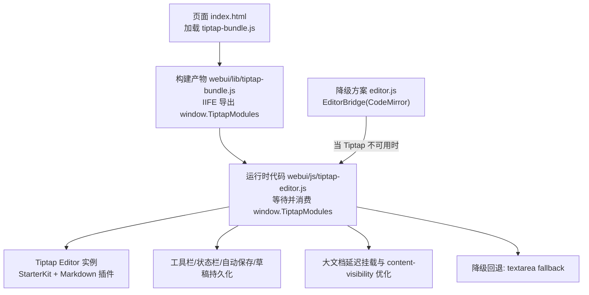
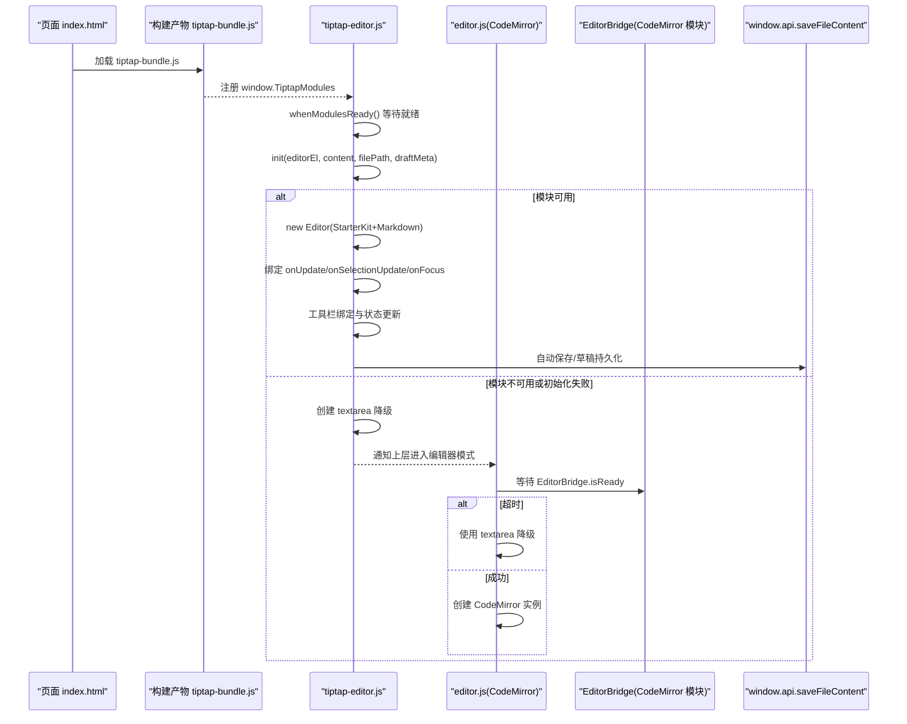
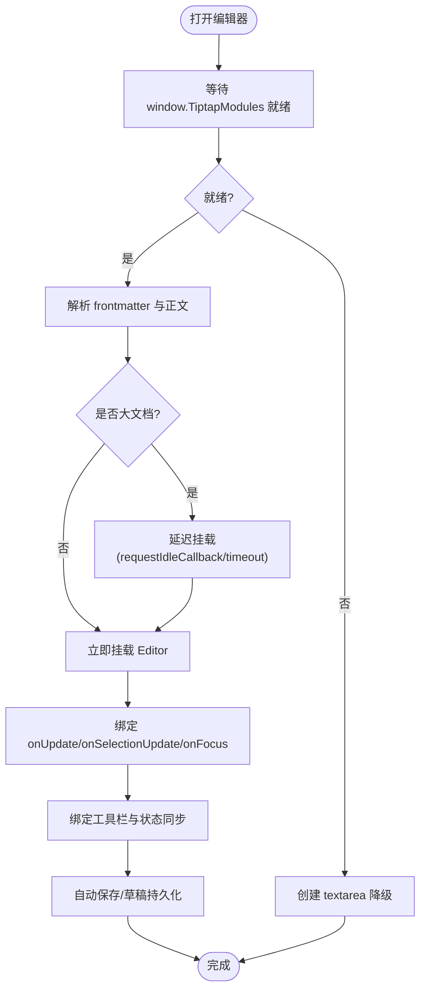
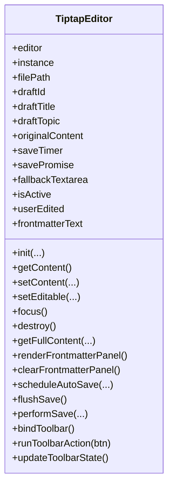
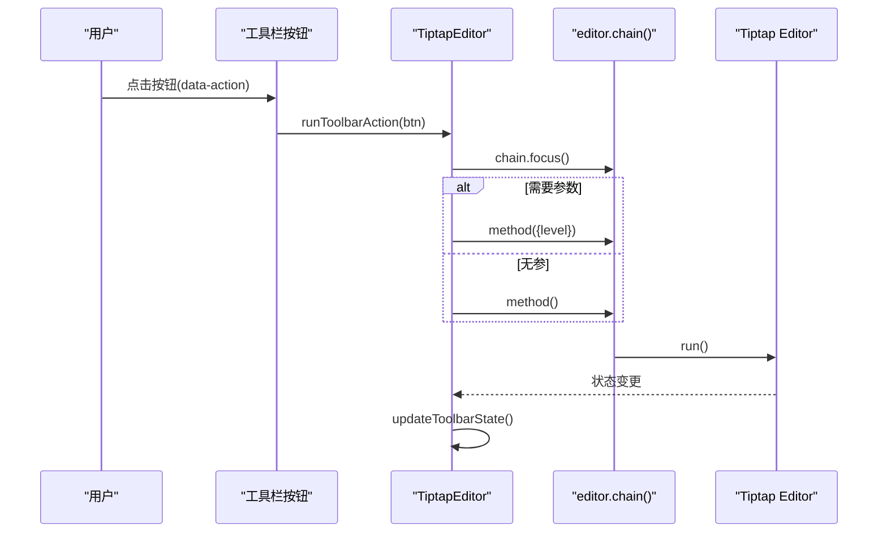
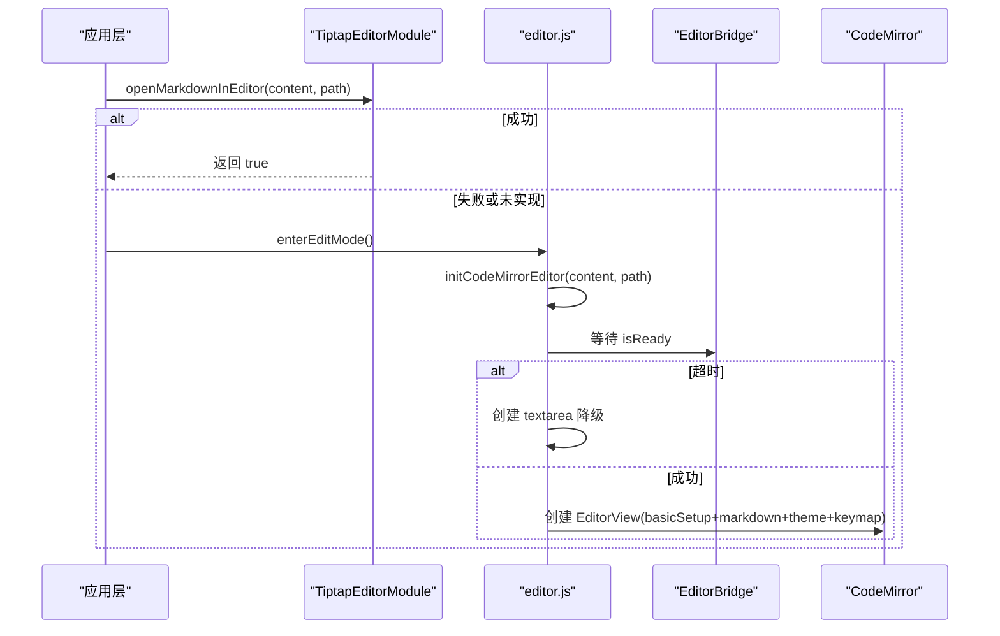
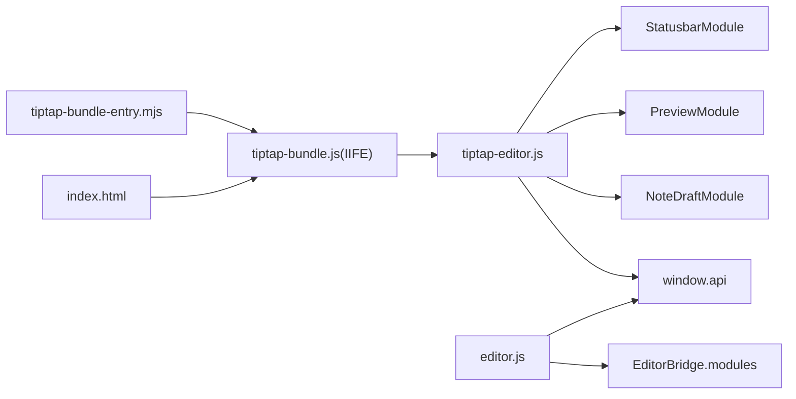

# Tiptap 编辑器集成

<cite>
**本文引用的文件**   
- [webui/js/tiptap-editor.js](file://webui/js/tiptap-editor.js)
- [webui/js/tiptap-bundle-entry.mjs](file://webui/js/tiptap-bundle-entry.mjs)
- [scripts/build-tiptap-bundle.mjs](file://scripts/build-tiptap-bundle.mjs)
- [webui/js/editor.js](file://webui/js/editor.js)
- [webui/css/editor.css](file://webui/css/editor.css)
- [webui/index.html](file://webui/index.html)
- [webui/js/app.js](file://webui/js/app.js)
</cite>

## 目录
1. [简介](#简介)
2. [项目结构](#项目结构)
3. [核心组件](#核心组件)
4. [架构总览](#架构总览)
5. [详细组件分析](#详细组件分析)
6. [依赖关系分析](#依赖关系分析)
7. [性能考虑](#性能考虑)
8. [故障排查指南](#故障排查指南)
9. [结论](#结论)
10. [附录](#附录)

## 简介
本文件面向在 NoteAI 项目中集成与扩展 Tiptap 编辑器的开发者，系统性说明：
- Tiptap 编辑器的初始化流程、模块加载与降级策略
- 编辑器状态管理、事件处理与命令系统的使用方式
- 与 CodeMirror 的降级切换逻辑（EditorBridge 通信协议与模块加载）
- 主题切换、快捷键配置、自定义工具栏的实现方法
- 编辑器扩展开发示例与性能优化技巧
- 常见问题排查与解决方案

## 项目结构
Tiptap 编辑器在前端通过构建脚本打包为 IIFE 全局对象，再由页面加载并初始化。整体涉及以下关键文件：
- 构建入口与打包脚本：tiptap-bundle-entry.mjs、build-tiptap-bundle.mjs
- 运行时主逻辑：tiptap-editor.js
- 降级方案（CodeMirror）：editor.js
- 样式与 UI：editor.css
- 应用启动与预加载：app.js
- 页面引入：index.html

图表来源
- [webui/index.html:28](file://webui/index.html#L28)
- [scripts/build-tiptap-bundle.mjs:1-40](file://scripts/build-tiptap-bundle.mjs#L1-L40)
- [webui/js/tiptap-bundle-entry.mjs:1-10](file://webui/js/tiptap-bundle-entry.mjs#L1-L10)
- [webui/js/tiptap-editor.js:125-157](file://webui/js/tiptap-editor.js#L125-L157)
- [webui/js/editor.js:84-108](file://webui/js/editor.js#L84-L108)

章节来源
- [webui/index.html:28](file://webui/index.html#L28)
- [scripts/build-tiptap-bundle.mjs:1-40](file://scripts/build-tiptap-bundle.mjs#L1-L40)
- [webui/js/tiptap-bundle-entry.mjs:1-10](file://webui/js/tiptap-bundle-entry.mjs#L1-L10)
- [webui/js/tiptap-editor.js:125-157](file://webui/js/tiptap-editor.js#L125-L157)
- [webui/js/editor.js:84-108](file://webui/js/editor.js#L84-L108)

## 核心组件
- 模块打包与全局暴露
  - 构建脚本将 @tiptap/core、@tiptap/starter-kit、tiptap-markdown 打包为 IIFE，输出到 webui/lib/tiptap-bundle.js，并在页面中直接以 script 标签引入。
  - 打包入口 tiptap-bundle-entry.mjs 将核心能力挂到 window.TiptapModules，供运行时使用。
- 运行时编辑器封装
  - tiptap-editor.js 提供 TiptapEditor 与 TiptapEditorModule，负责：
    - 等待并获取 window.TiptapModules
    - 解析 frontmatter 与正文内容
    - 初始化 Tiptap Editor（StarterKit + Markdown），绑定 onUpdate/onSelectionUpdate/onFocus
    - 工具栏动作映射与状态同步
    - 自动保存与草稿模式持久化
    - 大文档延迟挂载与 content-visibility 提示
    - 降级回退到 textarea
- 降级方案（CodeMirror）
  - editor.js 在 Tiptap 不可用或初始化失败时，尝试通过 EditorBridge 加载 CodeMirror 模块；若超时则回退到 textarea。
  - 支持主题切换、滚动同步、Markdown 预览等。

章节来源
- [webui/js/tiptap-bundle-entry.mjs:1-10](file://webui/js/tiptap-bundle-entry.mjs#L1-L10)
- [scripts/build-tiptap-bundle.mjs:1-40](file://scripts/build-tiptap-bundle.mjs#L1-L40)
- [webui/js/tiptap-editor.js:125-157](file://webui/js/tiptap-editor.js#L125-L157)
- [webui/js/editor.js:84-108](file://webui/js/editor.js#L84-L108)

## 架构总览
下图展示了从页面加载到编辑器初始化的完整链路，以及 Tiptap 与 CodeMirror 的降级切换路径。

图表来源
- [webui/index.html:28](file://webui/index.html#L28)
- [webui/js/tiptap-bundle-entry.mjs:1-10](file://webui/js/tiptap-bundle-entry.mjs#L1-L10)
- [webui/js/tiptap-editor.js:159-313](file://webui/js/tiptap-editor.js#L159-L313)
- [webui/js/editor.js:84-108](file://webui/js/editor.js#L84-L108)

## 详细组件分析

### 模块加载与初始化流程
- 构建阶段
  - 使用 esbuild 将入口 tiptap-bundle-entry.mjs 打包为 IIFE，输出到 webui/lib/tiptap-bundle.js，目标环境 ES2020，最小化。
  - 入口将 Editor、StarterKit、Markdown 挂到 window.TiptapModules。
- 运行阶段
  - 页面 index.html 引入 tiptap-bundle.js。
  - app.js 在 DOMContentLoaded 后调用 TiptapEditorModule.preloadModules() 预加载。
  - 打开编辑器时，TiptapEditorModule.openMarkdownInEditor() 会等待模块就绪，再调用 TiptapEditor.init()。
  - init() 内部：
    - 解析 frontmatter 与正文
    - 根据内容大小决定是否延迟挂载（requestIdleCallback 或 setTimeout）
    - 创建 Editor 实例，配置 StarterKit 与 Markdown 插件
    - 绑定事件回调，更新状态栏与预览数据
    - 绑定工具栏按钮，驱动命令链执行
    - 若模块缺失或初始化异常，创建 textarea 降级

图表来源
- [webui/js/tiptap-editor.js:125-157](file://webui/js/tiptap-editor.js#L125-L157)
- [webui/js/tiptap-editor.js:159-313](file://webui/js/tiptap-editor.js#L159-L313)
- [webui/js/tiptap-editor.js:315-341](file://webui/js/tiptap-editor.js#L315-L341)
- [webui/js/tiptap-editor.js:551-610](file://webui/js/tiptap-editor.js#L551-L610)
- [webui/js/tiptap-editor.js:439-455](file://webui/js/tiptap-editor.js#L439-L455)

章节来源
- [scripts/build-tiptap-bundle.mjs:1-40](file://scripts/build-tiptap-bundle.mjs#L1-L40)
- [webui/js/tiptap-bundle-entry.mjs:1-10](file://webui/js/tiptap-bundle-entry.mjs#L1-L10)
- [webui/index.html:28](file://webui/index.html#L28)
- [webui/js/app.js:53-55](file://webui/js/app.js#L53-L55)
- [webui/js/tiptap-editor.js:125-157](file://webui/js/tiptap-editor.js#L125-L157)
- [webui/js/tiptap-editor.js:159-313](file://webui/js/tiptap-editor.js#L159-L313)
- [webui/js/tiptap-editor.js:551-610](file://webui/js/tiptap-editor.js#L551-L610)
- [webui/js/tiptap-editor.js:439-455](file://webui/js/tiptap-editor.js#L439-L455)

### 编辑器状态管理与事件处理
- 状态字段
  - 文件路径、草稿 ID/标题/主题、原始内容、frontmatter 文本、用户编辑标记、活跃标志等。
- 事件处理
  - onUpdate：生成 Markdown 内容，触发自动保存，刷新状态栏与预览数据。
  - onSelectionUpdate：计算光标行/列，更新状态栏。
  - onFocus：刷新工具栏激活态。
  - DOM 事件（beforeinput/paste/drop/cut）：标记 userEdited 为 true，确保后续保存生效。
- 自动保存与草稿
  - 非草稿：节流保存，调用 window.api.saveFileContent 写入文件。
  - 草稿：定时持久化到 NoteDraftModule，并刷新 Chrome 显示。
  - flushSave：销毁前强制落盘未保存更改。

图表来源
- [webui/js/tiptap-editor.js:58-124](file://webui/js/tiptap-editor.js#L58-L124)
- [webui/js/tiptap-editor.js:159-313](file://webui/js/tiptap-editor.js#L159-L313)
- [webui/js/tiptap-editor.js:315-341](file://webui/js/tiptap-editor.js#L315-L341)
- [webui/js/tiptap-editor.js:359-386](file://webui/js/tiptap-editor.js#L359-L386)
- [webui/js/tiptap-editor.js:388-437](file://webui/js/tiptap-editor.js#L388-L437)
- [webui/js/tiptap-editor.js:467-549](file://webui/js/tiptap-editor.js#L467-L549)
- [webui/js/tiptap-editor.js:551-610](file://webui/js/tiptap-editor.js#L551-L610)

章节来源
- [webui/js/tiptap-editor.js:58-124](file://webui/js/tiptap-editor.js#L58-L124)
- [webui/js/tiptap-editor.js:159-313](file://webui/js/tiptap-editor.js#L159-L313)
- [webui/js/tiptap-editor.js:315-341](file://webui/js/tiptap-editor.js#L315-L341)
- [webui/js/tiptap-editor.js:359-386](file://webui/js/tiptap-editor.js#L359-L386)
- [webui/js/tiptap-editor.js:388-437](file://webui/js/tiptap-editor.js#L388-L437)
- [webui/js/tiptap-editor.js:467-549](file://webui/js/tiptap-editor.js#L467-L549)
- [webui/js/tiptap-editor.js:551-610](file://webui/js/tiptap-editor.js#L551-L610)

### 命令系统与工具栏
- 工具栏动作映射
  - toolbarActions 定义 action -> { method, hasParams, paramKey, defaultParam } 的映射。
  - runToolbarAction 通过 chain[method].run() 执行命令，支持带参（如 heading level）。
- 工具栏状态同步
  - updateToolbarState 基于 editor.isActive(...) 更新按钮 active/disabled 状态。
- 扩展点
  - 可通过新增 toolbarActions 条目扩展更多命令。
  - 可在 onUpdate 中监听命令结果，联动其他 UI。

图表来源
- [webui/js/tiptap-editor.js:76-89](file://webui/js/tiptap-editor.js#L76-L89)
- [webui/js/tiptap-editor.js:564-589](file://webui/js/tiptap-editor.js#L564-L589)
- [webui/js/tiptap-editor.js:591-610](file://webui/js/tiptap-editor.js#L591-L610)

章节来源
- [webui/js/tiptap-editor.js:76-89](file://webui/js/tiptap-editor.js#L76-L89)
- [webui/js/tiptap-editor.js:564-589](file://webui/js/tiptap-editor.js#L564-L589)
- [webui/js/tiptap-editor.js:591-610](file://webui/js/tiptap-editor.js#L591-L610)

### 与 CodeMirror 的降级方案切换逻辑
- 切换入口
  - toggleEditMode 优先尝试 TiptapEditorModule.openMarkdownInEditor；若返回失败或未实现，则进入 CodeMirror 降级。
- EditorBridge 通信协议
  - editor.js 检查 window.EditorBridge.isReady，轮询等待直到可用或超时。
  - 成功后通过 window.EditorBridge.modules 获取 CodeMirror 相关模块（basicSetup、markdown、oneDark/oneLight、keymap 等）。
- 模块加载机制
  - 若 EditorBridge 未就绪或初始化失败，回退到 textarea。
  - 主题切换时重建 EditorView 并替换主题。

图表来源
- [webui/js/editor.js:469-502](file://webui/js/editor.js#L469-L502)
- [webui/js/editor.js:84-108](file://webui/js/editor.js#L84-L108)
- [webui/js/editor.js:110-161](file://webui/js/editor.js#L110-L161)
- [webui/js/editor.js:202-249](file://webui/js/editor.js#L202-L249)

章节来源
- [webui/js/editor.js:469-502](file://webui/js/editor.js#L469-L502)
- [webui/js/editor.js:84-108](file://webui/js/editor.js#L84-L108)
- [webui/js/editor.js:110-161](file://webui/js/editor.js#L110-L161)
- [webui/js/editor.js:202-249](file://webui/js/editor.js#L202-L249)

### 主题切换、快捷键与自定义工具栏
- 主题切换
  - CodeMirror：根据 data-theme 选择 oneDark/oneLight，重建视图并更新高亮主题。
  - Tiptap：通过 CSS 变量与类名控制 ProseMirror 外观，无需重建实例。
- 快捷键
  - CodeMirror：通过 keymap.of([...]) 组合基础键位（缩进、括号闭合、默认、历史、补全、校验）。
  - Tiptap：通过 StarterKit 内置命令与键盘快捷方式；工具栏按钮也可触发对应命令。
- 自定义工具栏
  - 在 toolbarActions 中添加新条目，即可扩展新的命令按钮。
  - 在 updateToolbarState 中补充 isActive 判断，保持按钮状态一致。

章节来源
- [webui/js/editor.js:130-144](file://webui/js/editor.js#L130-L144)
- [webui/js/editor.js:202-249](file://webui/js/editor.js#L202-L249)
- [webui/js/tiptap-editor.js:76-89](file://webui/js/tiptap-editor.js#L76-L89)
- [webui/js/tiptap-editor.js:591-610](file://webui/js/tiptap-editor.js#L591-L610)
- [webui/css/editor.css:211-281](file://webui/css/editor.css#L211-L281)
- [webui/css/editor.css:283-424](file://webui/css/editor.css#L283-L424)

### 编辑器扩展开发示例
- 扩展 StarterKit 配置
  - 例如修改 codeBlock 的 HTMLAttributes，使其默认语言类为 javascript。
- 启用 Markdown 插件
  - 配置 html: true，允许渲染 HTML 片段。
- 自定义命令
  - 在 toolbarActions 中新增 action 映射，指向 chain 上的方法，必要时传入参数（如 heading level）。
- 监听与副作用
  - 在 onUpdate 中读取 storage.markdown.getMarkdown()，进行外部同步（如预览、索引、统计）。
- 注意事项
  - 避免在高频事件中做重计算，必要时使用 requestIdleCallback 或节流。
  - 对大文档采用延迟挂载与 content-visibility 提示，降低首屏开销。

章节来源
- [webui/js/tiptap-editor.js:214-225](file://webui/js/tiptap-editor.js#L214-L225)
- [webui/js/tiptap-editor.js:239-254](file://webui/js/tiptap-editor.js#L239-L254)
- [webui/js/tiptap-editor.js:564-589](file://webui/js/tiptap-editor.js#L564-L589)
- [webui/js/tiptap-editor.js:315-329](file://webui/js/tiptap-editor.js#L315-L329)
- [webui/js/tiptap-editor.js:102-123](file://webui/js/tiptap-editor.js#L102-L123)
- [webui/css/editor.css:402-424](file://webui/css/editor.css#L402-L424)

## 依赖关系分析
- 构建期依赖
  - esbuild 将 tiptap-bundle-entry.mjs 打包为 IIFE，输出到 webui/lib/tiptap-bundle.js。
- 运行期依赖
  - 页面 index.html 引入 tiptap-bundle.js，使 window.TiptapModules 可用。
  - tiptap-editor.js 依赖 window.TiptapModules 与 window.StatusbarModule、window.PreviewModule、window.NoteDraftModule、window.api。
  - editor.js 依赖 window.EditorBridge.modules 与 window.api。

图表来源
- [scripts/build-tiptap-bundle.mjs:1-40](file://scripts/build-tiptap-bundle.mjs#L1-L40)
- [webui/index.html:28](file://webui/index.html#L28)
- [webui/js/tiptap-editor.js:125-157](file://webui/js/tiptap-editor.js#L125-L157)
- [webui/js/editor.js:110-161](file://webui/js/editor.js#L110-L161)

章节来源
- [scripts/build-tiptap-bundle.mjs:1-40](file://scripts/build-tiptap-bundle.mjs#L1-L40)
- [webui/index.html:28](file://webui/index.html#L28)
- [webui/js/tiptap-editor.js:125-157](file://webui/js/tiptap-editor.js#L125-L157)
- [webui/js/editor.js:110-161](file://webui/js/editor.js#L110-L161)

## 性能考虑
- 大文档延迟挂载
  - 超过阈值（字符数/行数）时，使用 requestIdleCallback 或 setTimeout 延迟创建 Editor，避免阻塞首帧。
- content-visibility 提示
  - 对大型文档的块级节点添加 content-visibility: auto 与 contain-intrinsic-size，减少布局与绘制成本。
- 自动保存节流
  - 统一 SAVE_DELAY_MS 节流，避免频繁 IO。
- 草稿模式优化
  - 草稿仅持久化到内存/本地存储，不写磁盘，提升交互响应。
- 工具栏与状态更新
  - 仅在必要时机（onUpdate/onSelectionUpdate/onFocus）更新 UI，避免重复计算。

章节来源
- [webui/js/tiptap-editor.js:10-15](file://webui/js/tiptap-editor.js#L10-L15)
- [webui/js/tiptap-editor.js:102-123](file://webui/js/tiptap-editor.js#L102-L123)
- [webui/js/tiptap-editor.js:204-206](file://webui/js/tiptap-editor.js#L204-L206)
- [webui/js/tiptap-editor.js:467-485](file://webui/js/tiptap-editor.js#L467-L485)
- [webui/css/editor.css:402-424](file://webui/css/editor.css#L402-L424)

## 故障排查指南
- 模块未加载
  - 现象：控制台报错“Failed to load modules: TiptapModules not found”，编辑器回退到 textarea。
  - 排查：确认 index.html 已引入 tiptap-bundle.js；检查构建产物是否存在；确认 whenModulesReady 超时。
- 初始化异常
  - 现象：Init error 日志，随后回退到 textarea。
  - 排查：检查元素容器是否存在；查看浏览器控制台错误堆栈；确认 StarterKit/Markdown 版本兼容。
- 自动保存失败
  - 现象：保存状态变为 error。
  - 排查：检查 window.api.saveFileContent 返回值；确认 filePath 有效；观察网络/权限问题。
- CodeMirror 降级
  - 现象：EditorBridge not ready 或 timeout，最终使用 textarea。
  - 排查：确认 EditorBridge 模块已正确加载；检查 isReady 轮询逻辑；验证 basicSetup/markdown/keymap 可用性。
- 主题不生效
  - 现象：CodeMirror 主题未切换。
  - 排查：确认 getEffectiveTheme 返回值；检查 oneDark/oneLight 模块是否可用；重建 EditorView 后是否更新高亮主题。

章节来源
- [webui/js/tiptap-editor.js:195-200](file://webui/js/tiptap-editor.js#L195-L200)
- [webui/js/tiptap-editor.js:285-289](file://webui/js/tiptap-editor.js#L285-L289)
- [webui/js/tiptap-editor.js:531-546](file://webui/js/tiptap-editor.js#L531-L546)
- [webui/js/editor.js:84-108](file://webui/js/editor.js#L84-L108)
- [webui/js/editor.js:202-249](file://webui/js/editor.js#L202-L249)

## 结论
本项目通过构建脚本将 Tiptap 核心能力打包为全局模块，由运行时封装为易用的编辑器接口，并提供完善的自动保存、草稿持久化、工具栏与状态同步。在 Tiptap 不可用时，优雅降级至 CodeMirror，并通过 EditorBridge 协议动态加载模块，保证用户体验稳定。针对大文档场景，采用延迟挂载与 content-visibility 优化，显著提升性能。开发者可基于现有扩展点快速定制工具栏与命令，满足多样化需求。

## 附录
- 构建命令
  - 参考 scripts/build-tiptap-bundle.mjs，使用 esbuild 将入口打包为 IIFE。
- 页面引入
  - 参考 webui/index.html，确保 tiptap-bundle.js 在应用逻辑之前加载。
- 样式覆盖
  - 参考 webui/css/editor.css，按需调整 ProseMirror 与工具栏样式。

章节来源
- [scripts/build-tiptap-bundle.mjs:1-40](file://scripts/build-tiptap-bundle.mjs#L1-L40)
- [webui/index.html:28](file://webui/index.html#L28)
- [webui/css/editor.css:211-281](file://webui/css/editor.css#L211-L281)
- [webui/css/editor.css:283-424](file://webui/css/editor.css#L283-L424)