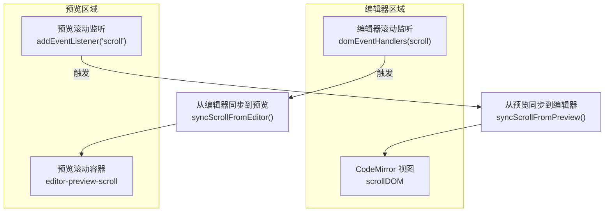
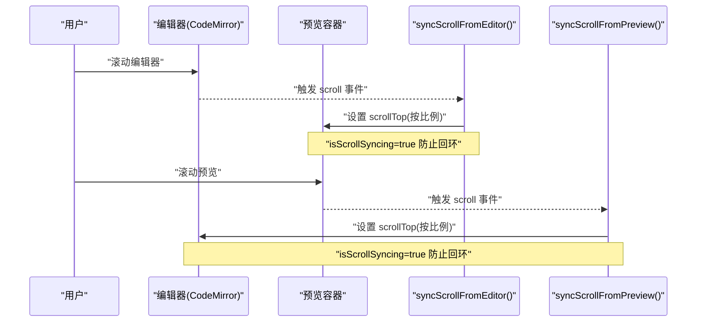
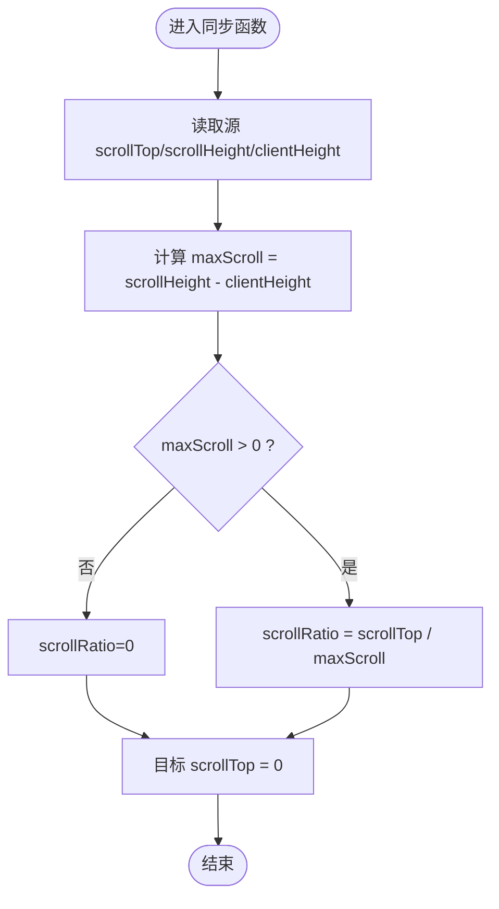
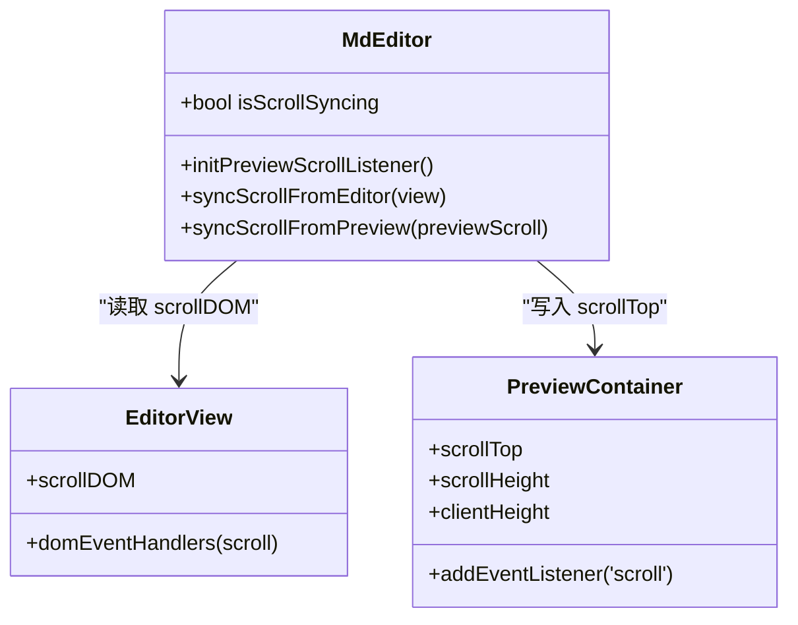
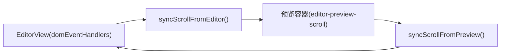

# 滚动同步机制

<cite>
**本文引用的文件**   
- [webui/js/editor.js](file://webui/js/editor.js)
- [webui/css/editor.css](file://webui/css/editor.css)
- [webui/css/preview.css](file://webui/css/preview.css)
</cite>

## 目录
1. [简介](#简介)
2. [项目结构](#项目结构)
3. [核心组件](#核心组件)
4. [架构总览](#架构总览)
5. [详细组件分析](#详细组件分析)
6. [依赖关系分析](#依赖关系分析)
7. [性能考量](#性能考量)
8. [故障排查指南](#故障排查指南)
9. [结论](#结论)
10. [附录](#附录)

## 简介
本技术文档聚焦于编辑器与预览区域的“滚动同步”机制，围绕以下目标展开：
- 解释滚动比例计算、边界处理与精度控制策略
- 说明双向滚动监听、事件节流与防抖的实现细节
- 描述不同内容长度下的同步精度与异步更新机制
- 阐述滚动状态管理、循环依赖避免与内存泄漏防护
- 提供配置选项与性能监控指标的设置方法
- 给出复杂场景的处理方案与调试技巧

## 项目结构
滚动同步相关的前端实现位于 webui 模块中，主要涉及：
- 编辑器侧：基于 CodeMirror（EditorBridge）的 Markdown 编辑器，负责监听自身滚动并驱动预览滚动
- 预览侧：HTML 渲染容器，负责监听自身滚动并驱动编辑器滚动
- 样式层：定义可滚动容器的布局与滚动条样式，确保滚动行为一致

图表来源
- [webui/js/editor.js:123-128](file://webui/js/editor.js#L123-L128)
- [webui/js/editor.js:380-389](file://webui/js/editor.js#L380-L389)
- [webui/js/editor.js:391-437](file://webui/js/editor.js#L391-L437)

章节来源
- [webui/js/editor.js:123-128](file://webui/js/editor.js#L123-L128)
- [webui/js/editor.js:380-389](file://webui/js/editor.js#L380-L389)
- [webui/js/editor.js:391-437](file://webui/js/editor.js#L391-L437)
- [webui/css/editor.css:173-203](file://webui/css/editor.css#L173-L203)
- [webui/css/preview.css:164-189](file://webui/css/preview.css#L164-L189)

## 核心组件
- 滚动状态标志位
  - isScrollSyncing：用于防止双向滚动互相触发导致的循环同步
- 编辑器滚动监听
  - 通过 domEventHandlers 注册 scroll 事件，进入 syncScrollFromEditor
- 预览滚动监听
  - 通过 addEventListener('scroll') 注册 scroll 事件，进入 syncScrollFromPreview
- 同步算法
  - 基于“最大可滚动距离”的比例换算，将源滚动位置映射到目标滚动位置
- 初始化与销毁
  - initPreviewScrollListener：仅绑定一次预览滚动监听
  - destroyCodeMirrorEditor：清理定时器、释放视图实例、重置滚动标志位

章节来源
- [webui/js/editor.js:6-12](file://webui/js/editor.js#L6-L12)
- [webui/js/editor.js:123-128](file://webui/js/editor.js#L123-L128)
- [webui/js/editor.js:378-389](file://webui/js/editor.js#L378-L389)
- [webui/js/editor.js:391-437](file://webui/js/editor.js#L391-L437)
- [webui/js/editor.js:182-200](file://webui/js/editor.js#L182-L200)

## 架构总览
下图展示了编辑器与预览之间的双向滚动同步流程，包括事件入口、同步函数与目标 DOM 操作。

图表来源
- [webui/js/editor.js:123-128](file://webui/js/editor.js#L123-L128)
- [webui/js/editor.js:380-389](file://webui/js/editor.js#L380-L389)
- [webui/js/editor.js:391-437](file://webui/js/editor.js#L391-L437)

## 详细组件分析

### 滚动比例计算与边界处理
- 比例计算
  - 计算源容器的最大可滚动距离 maxScroll = scrollHeight - clientHeight
  - 若 maxScroll > 0，则 scrollRatio = scrollTop / maxScroll；否则为 0
  - 目标 scrollTop = scrollRatio * (目标 scrollHeight - 目标 clientHeight)
- 边界保护
  - 当 maxScroll <= 0 时，直接返回 0，避免 NaN 或负值
  - 使用 setTimeout 延迟复位 isScrollSyncing，降低同一帧内多次触发的风险
- 精度控制
  - 以百分比比例进行映射，对长文档保持相对一致的视觉对齐
  - 在极短内容（不可滚动）情况下，不会强制设置 scrollTop，避免抖动

图表来源
- [webui/js/editor.js:391-413](file://webui/js/editor.js#L391-L413)
- [webui/js/editor.js:415-437](file://webui/js/editor.js#L415-L437)

章节来源
- [webui/js/editor.js:391-413](file://webui/js/editor.js#L391-L413)
- [webui/js/editor.js:415-437](file://webui/js/editor.js#L415-L437)

### 双向滚动监听与循环依赖避免
- 编辑器侧监听
  - 使用 EditorView.domEventHandlers 注册 scroll 事件，调用 syncScrollFromEditor
- 预览侧监听
  - 使用 addEventListener('scroll') 注册 scroll 事件，调用 syncScrollFromPreview
- 循环依赖避免
  - 全局标志位 isScrollSyncing 在同步开始时置 true，并在 50ms 后复位
  - 监听器入口处检查该标志位，若为真则直接返回，避免相互触发

图表来源
- [webui/js/editor.js:6-12](file://webui/js/editor.js#L6-L12)
- [webui/js/editor.js:123-128](file://webui/js/editor.js#L123-L128)
- [webui/js/editor.js:380-389](file://webui/js/editor.js#L380-L389)
- [webui/js/editor.js:391-437](file://webui/js/editor.js#L391-L437)

章节来源
- [webui/js/editor.js:123-128](file://webui/js/editor.js#L123-L128)
- [webui/js/editor.js:380-389](file://webui/js/editor.js#L380-L389)
- [webui/js/editor.js:391-437](file://webui/js/editor.js#L391-L437)

### 事件节流与防抖策略
- 当前实现
  - 未使用显式的节流或防抖函数
  - 通过 isScrollSyncing 标志位与 50ms 延时复位，起到“去重+缓冲”的效果
- 建议增强
  - 引入 requestAnimationFrame 包裹同步逻辑，减少不必要的布局抖动
  - 针对高频滚动场景，增加时间窗口节流（例如 16ms），进一步降低主线程压力

章节来源
- [webui/js/editor.js:391-437](file://webui/js/editor.js#L391-L437)

### 不同内容长度下的同步精度控制
- 短内容（不可滚动）
  - maxScroll <= 0 时，scrollRatio 设为 0，目标 scrollTop 不改变，避免误触发
- 中等内容
  - 比例映射稳定，视觉对齐良好
- 超长文档
  - 比例映射保持一致性；如需更高精度，可在渲染完成后进行一次“微调校正”，但需权衡性能

章节来源
- [webui/js/editor.js:391-413](file://webui/js/editor.js#L391-L413)
- [webui/js/editor.js:415-437](file://webui/js/editor.js#L415-L437)

### 异步更新机制
- 保存与渲染
  - 编辑器变更会触发预览渲染与自动保存（非滚动同步部分，但与整体交互相关）
- 滚动同步
  - 同步逻辑为同步赋值，但通过 50ms 延时复位标志位，避免同帧重复执行

章节来源
- [webui/js/editor.js:115-121](file://webui/js/editor.js#L115-L121)
- [webui/js/editor.js:320-376](file://webui/js/editor.js#L320-L376)
- [webui/js/editor.js:391-437](file://webui/js/editor.js#L391-L437)

### 滚动状态管理与生命周期
- 初始化
  - createCodeMirrorInstance 创建编辑器后，调用 initPreviewScrollListener 绑定预览滚动监听
- 销毁
  - destroyCodeMirrorEditor 清理保存定时器、释放编辑器视图、重置 isScrollSyncing 等状态

章节来源
- [webui/js/editor.js:156-159](file://webui/js/editor.js#L156-L159)
- [webui/js/editor.js:182-200](file://webui/js/editor.js#L182-L200)

### 内存泄漏防护措施
- 事件监听
  - 预览滚动监听仅在首次初始化时绑定一次（_previewScrollBound 标记）
- 资源释放
  - 销毁编辑器时释放 view 实例与定时器，避免残留引用
- PDF 预览（独立模块）
  - 关闭预览时销毁 pdfDoc 并移除键盘事件监听（虽不属于滚动同步，但体现通用防护思路）

章节来源
- [webui/js/editor.js:378-389](file://webui/js/editor.js#L378-L389)
- [webui/js/editor.js:182-200](file://webui/js/editor.js#L182-L200)

## 依赖关系分析
- 编辑器依赖
  - EditorBridge.modules.EditorView：提供 domEventHandlers 与 scrollDOM
- 预览依赖
  - DOM 元素 editor-preview-scroll：作为预览滚动容器
- 样式依赖
  - .cm-scroller、.editor-preview-scroll、.preview-content：决定滚动容器与滚动条外观

图表来源
- [webui/js/editor.js:123-128](file://webui/js/editor.js#L123-L128)
- [webui/js/editor.js:380-389](file://webui/js/editor.js#L380-L389)
- [webui/js/editor.js:391-437](file://webui/js/editor.js#L391-L437)
- [webui/css/editor.css:173-203](file://webui/css/editor.css#L173-L203)
- [webui/css/preview.css:164-189](file://webui/css/preview.css#L164-L189)

章节来源
- [webui/js/editor.js:123-128](file://webui/js/editor.js#L123-L128)
- [webui/js/editor.js:380-389](file://webui/js/editor.js#L380-L389)
- [webui/js/editor.js:391-437](file://webui/js/editor.js#L391-L437)
- [webui/css/editor.css:173-203](file://webui/css/editor.css#L173-L203)
- [webui/css/preview.css:164-189](file://webui/css/preview.css#L164-L189)

## 性能考量
- 当前优化点
  - 使用 isScrollSyncing 与 50ms 延时复位，避免同帧重复同步
  - 仅对可滚动内容进行比例映射，短内容不触发无效操作
- 潜在瓶颈
  - 高频滚动仍可能引发频繁布局测量（scrollHeight/clientHeight）
- 建议优化
  - 使用 requestAnimationFrame 包裹同步逻辑，合并多次滚动更新
  - 引入节流（如 16ms）降低主线程负载
  - 缓存最近一次的 scrollHeight/clientHeight，仅在内容变化时重新计算
  - 对超大文档启用 content-visibility 与 contain-intrinsic-size（已在 CSS 中对 TiPTAP 内容生效，可作为参考）

[本节为通用性能指导，无需具体文件来源]

## 故障排查指南
- 现象：滚动不同步或卡顿
  - 检查 isScrollSyncing 是否被正确复位（50ms 延时）
  - 确认预览容器是否存在且可滚动（overflow-y: auto）
- 现象：循环滚动导致抖动
  - 验证监听器入口是否检查 isScrollSyncing
  - 考虑引入 requestAnimationFrame 与节流
- 现象：内存占用增长
  - 确认销毁流程是否释放 view 实例与定时器
  - 检查是否有额外的事件监听未移除

章节来源
- [webui/js/editor.js:391-437](file://webui/js/editor.js#L391-L437)
- [webui/js/editor.js:182-200](file://webui/js/editor.js#L182-L200)
- [webui/css/editor.css:173-203](file://webui/css/editor.css#L173-L203)
- [webui/css/preview.css:164-189](file://webui/css/preview.css#L164-L189)

## 结论
当前滚动同步机制通过“比例映射 + 标志位去重”的方式实现了编辑器与预览的双向同步，具备简洁、稳定的特点。对于大规模文档与高频滚动场景，建议引入 requestAnimationFrame 与节流策略，并结合内容可见性优化，进一步提升流畅度与性能。

[本节为总结性内容，无需具体文件来源]

## 附录

### 配置选项与监控指标
- 配置项（建议）
  - scrollSyncThrottleMs：滚动节流时间窗口（默认 16ms）
  - scrollSyncDebounceMs：滚动停止后的最终同步延迟（默认 50ms）
  - scrollSyncUseRAF：是否使用 requestAnimationFrame 包裹同步逻辑（默认 true）
  - scrollSyncPrecision：比例计算精度（小数位数，默认 6）
- 监控指标（建议）
  - 同步触发次数/秒
  - 平均同步耗时（微秒）
  - 布局重排次数/秒
  - 滚动卡顿帧占比（>16ms 的帧）

[本节为概念性配置与指标建议，无需具体文件来源]

### 复杂场景处理方案
- 动态内容加载（图片懒加载、代码块高亮）
  - 在内容渲染完成后进行一次“校正同步”，根据新的 scrollHeight 调整目标 scrollTop
- 多面板/分栏布局
  - 确保每个面板的滚动容器独立，避免父容器滚动干扰
- 主题切换与字体缩放
  - 监听主题或字体变化事件，重新计算比例并触发一次同步校正

[本节为概念性方案，无需具体文件来源]