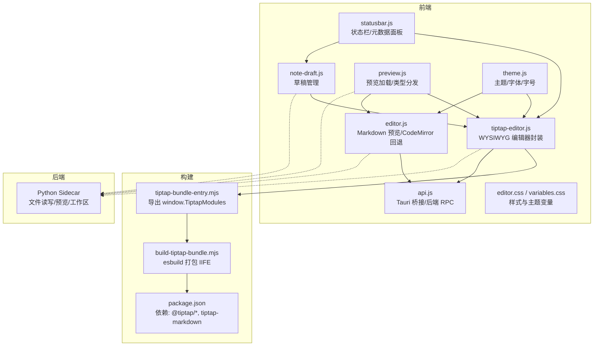
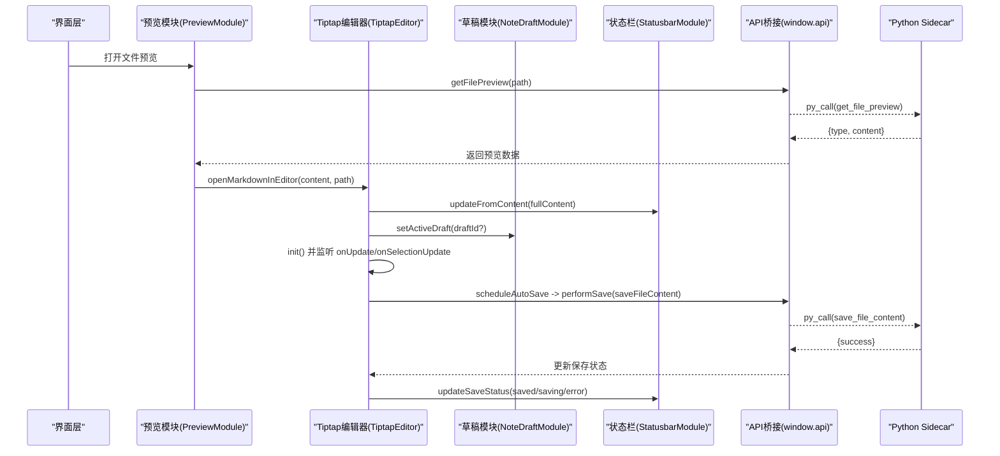
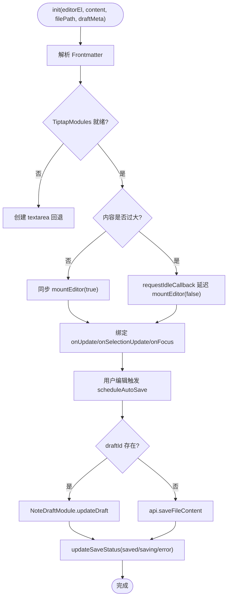
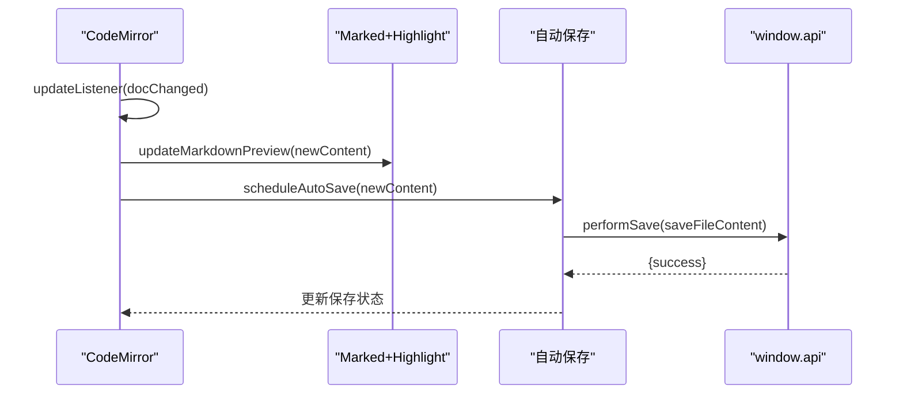
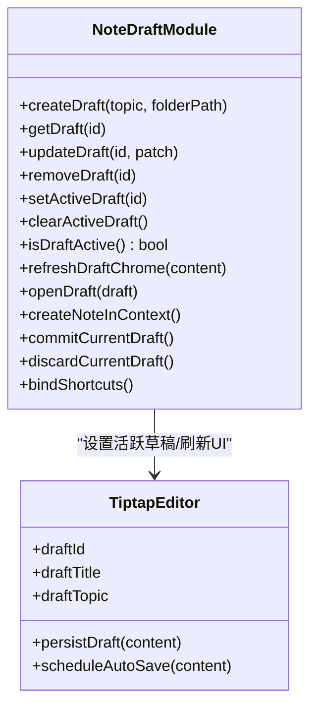
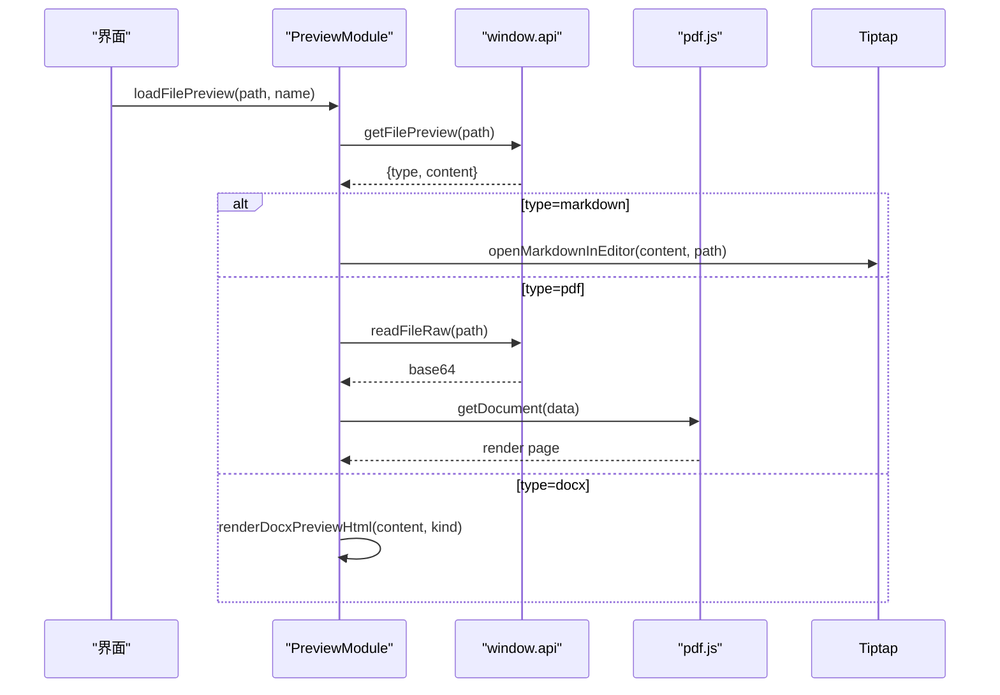
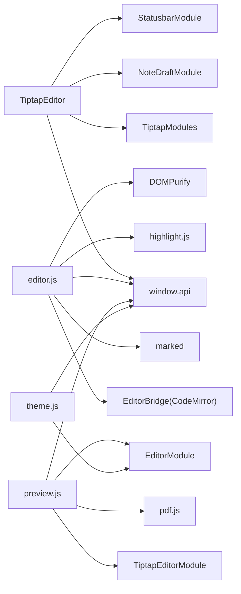

# 编辑器系统

<cite>
**本文引用的文件**   
- [tiptap-editor.js](file://webui/js/tiptap-editor.js)
- [editor.js](file://webui/js/editor.js)
- [note-draft.js](file://webui/js/note-draft.js)
- [preview.js](file://webui/js/preview.js)
- [statusbar.js](file://webui/js/statusbar.js)
- [theme.js](file://webui/js/theme.js)
- [variables.css](file://webui/css/variables.css)
- [editor.css](file://webui/css/editor.css)
- [api.js](file://webui/js/api.js)
- [build-tiptap-bundle.mjs](file://scripts/build-tiptap-bundle.mjs)
- [tiptap-bundle-entry.mjs](file://webui/js/tiptap-bundle-entry.mjs)
- [package.json](file://package.json)
</cite>

## 目录
1. [简介](#简介)
2. [项目结构](#项目结构)
3. [核心组件](#核心组件)
4. [架构总览](#架构总览)
5. [详细组件分析](#详细组件分析)
6. [依赖关系分析](#依赖关系分析)
7. [性能考虑](#性能考虑)
8. [故障排除指南](#故障排除指南)
9. [结论](#结论)
10. [附录](#附录)

## 简介
本技术文档围绕编辑器子系统，系统性阐述以下能力与实现：
- Tiptap 编辑器的集成方案与 Markdown 渲染引擎配置优化
- WYSIWYG 编辑模式、自动保存机制、实时预览的实现细节
- 编辑器扩展开发、自定义插件集成、快捷键配置方法
- 草稿管理、版本控制、协作编辑的技术方案（当前为本地草稿）
- 主题定制、样式覆盖、性能调优最佳实践
- 实际开发示例与常见问题排查

## 项目结构
编辑器子系统主要位于 webui 前端资源中，关键文件组织如下：
- 编辑器核心逻辑：Tiptap 编辑器封装、Markdown 预览、CodeMirror 回退
- 草稿与状态栏：草稿持久化、元数据面板、字数统计与光标位置
- 主题与变量：全局 CSS 变量、主题切换、字体排版
- API 桥接：通过 Tauri 调用后端 Python Sidecar
- 构建脚本：将 Tiptap 相关依赖打包为 IIFE 供页面使用

图表来源
- [tiptap-editor.js:1-670](file://webui/js/tiptap-editor.js#L1-L670)
- [editor.js:1-540](file://webui/js/editor.js#L1-L540)
- [note-draft.js:1-392](file://webui/js/note-draft.js#L1-L392)
- [preview.js:1-608](file://webui/js/preview.js#L1-L608)
- [statusbar.js:1-283](file://webui/js/statusbar.js#L1-L283)
- [theme.js:1-458](file://webui/js/theme.js#L1-L458)
- [api.js:1-492](file://webui/js/api.js#L1-L492)
- [build-tiptap-bundle.mjs:1-40](file://scripts/build-tiptap-bundle.mjs#L1-L40)
- [tiptap-bundle-entry.mjs:1-10](file://webui/js/tiptap-bundle-entry.mjs#L1-L10)
- [package.json:1-28](file://package.json#L1-L28)

章节来源
- [tiptap-editor.js:1-670](file://webui/js/tiptap-editor.js#L1-L670)
- [editor.js:1-540](file://webui/js/editor.js#L1-L540)
- [note-draft.js:1-392](file://webui/js/note-draft.js#L1-L392)
- [preview.js:1-608](file://webui/js/preview.js#L1-L608)
- [statusbar.js:1-283](file://webui/js/statusbar.js#L1-L283)
- [theme.js:1-458](file://webui/js/theme.js#L1-L458)
- [api.js:1-492](file://webui/js/api.js#L1-L492)
- [build-tiptap-bundle.mjs:1-40](file://scripts/build-tiptap-bundle.mjs#L1-L40)
- [tiptap-bundle-entry.mjs:1-10](file://webui/js/tiptap-bundle-entry.mjs#L1-L10)
- [package.json:1-28](file://package.json#L1-L28)

## 核心组件
- Tiptap 编辑器封装：提供 WYSIWYG 编辑、工具栏、自动保存、Frontmatter 面板、大文档延迟挂载与内容可见性优化。
- Markdown 预览与 CodeMirror 回退：基于 marked + highlight.js 的纯文本预览；当 Tiptap 不可用时降级到 CodeMirror 或 textarea。
- 草稿管理：基于 localStorage 的草稿持久化、标题提取、上下文创建、提交与丢弃。
- 预览模块：统一加载文件预览，按类型分发（Markdown/PDF/Docx/图片/代码），并与编辑器联动。
- 状态栏：解析 Frontmatter 展示主题/标签、字数统计、光标位置、保存状态、草稿操作按钮。
- 主题与字体：支持 light/dark/paper 主题、强调色、字体族与字重/斜体角色化、字号缩放。
- API 桥接：通过 Tauri invoke 调用 Python Sidecar，封装 saveFileContent、getFilePreview、readFileRaw 等。

章节来源
- [tiptap-editor.js:1-670](file://webui/js/tiptap-editor.js#L1-L670)
- [editor.js:1-540](file://webui/js/editor.js#L1-L540)
- [note-draft.js:1-392](file://webui/js/note-draft.js#L1-L392)
- [preview.js:1-608](file://webui/js/preview.js#L1-L608)
- [statusbar.js:1-283](file://webui/js/statusbar.js#L1-L283)
- [theme.js:1-458](file://webui/js/theme.js#L1-L458)
- [api.js:1-492](file://webui/js/api.js#L1-L492)

## 架构总览
编辑器子系统采用“模块化 + 事件驱动”的前端架构，以 Tiptap 为主编辑器，marked 为 Markdown 渲染器，Tauri 作为前后端通信桥梁。

图表来源
- [preview.js:85-229](file://webui/js/preview.js#L85-L229)
- [tiptap-editor.js:159-313](file://webui/js/tiptap-editor.js#L159-L313)
- [tiptap-editor.js:467-549](file://webui/js/tiptap-editor.js#L467-L549)
- [note-draft.js:168-208](file://webui/js/note-draft.js#L168-L208)
- [statusbar.js:76-115](file://webui/js/statusbar.js#L76-L115)
- [api.js:224-248](file://webui/js/api.js#L224-L248)
- [api.js:386](file://webui/js/api.js#L386)

## 详细组件分析

### Tiptap 编辑器封装
- 初始化流程：等待 TiptapModules 就绪，解析 Frontmatter，根据内容大小决定是否延迟挂载；若失败则回退到 textarea。
- 工具栏与命令：通过 toolbarActions 映射 action 到 chain 方法，支持加粗、斜体、删除线、代码块、列表、引用、撤销重做等。
- 自动保存：onUpdate 触发节流保存；草稿模式下写入 NoteDraftModule，普通模式调用 api.saveFileContent。
- 大文档优化：超过阈值时延迟 setContent，并为区块节点添加 content-visibility 提示以降低布局开销。
- 光标与状态：onSelectionUpdate 计算行列号，更新状态栏；onFocus 刷新工具栏高亮。
- 销毁与清理：flushSave 确保未保存内容落盘，清理定时器与 DOM。

图表来源
- [tiptap-editor.js:159-313](file://webui/js/tiptap-editor.js#L159-L313)
- [tiptap-editor.js:467-549](file://webui/js/tiptap-editor.js#L467-L549)
- [tiptap-editor.js:551-610](file://webui/js/tiptap-editor.js#L551-L610)
- [tiptap-editor.js:315-341](file://webui/js/tiptap-editor.js#L315-L341)

章节来源
- [tiptap-editor.js:1-670](file://webui/js/tiptap-editor.js#L1-L670)

### Markdown 渲染与 CodeMirror 回退
- 渲染引擎：marked 启用 GFM 与换行，DOMPurify 过滤 HTML，highlight.js 进行语法高亮。
- 实时预览：CodeMirror 的 updateListener 在 docChanged 时调用 updateMarkdownPreview，并触发自动保存。
- 滚动同步：编辑器与预览双向滚动比例同步，避免抖动。
- 回退策略：当 EditorBridge 不可用或初始化失败时，创建 textarea 回退，保持基本编辑体验。

图表来源
- [editor.js:110-161](file://webui/js/editor.js#L110-L161)
- [editor.js:251-280](file://webui/js/editor.js#L251-L280)
- [editor.js:320-376](file://webui/js/editor.js#L320-L376)
- [editor.js:378-437](file://webui/js/editor.js#L378-L437)

章节来源
- [editor.js:1-540](file://webui/js/editor.js#L1-L540)

### 草稿管理
- 存储：localStorage 键 noteai.noteDrafts.v1，维护 id、title、topic、content、时间戳等字段。
- 生命周期：createDraft → openDraft → 自动保存(updateDraft) → commitCurrentDraft → removeDraft。
- 交互：状态栏显示草稿动作按钮；Ctrl/Cmd+S 快捷提交；作废前检测是否为空内容并二次确认。
- 与编辑器联动：openDraft 传入 draftMeta，编辑器进入草稿模式，persistDraft 仅写本地。

图表来源
- [note-draft.js:63-117](file://webui/js/note-draft.js#L63-L117)
- [note-draft.js:168-208](file://webui/js/note-draft.js#L168-L208)
- [note-draft.js:230-314](file://webui/js/note-draft.js#L230-L314)
- [tiptap-editor.js:457-485](file://webui/js/tiptap-editor.js#L457-L485)

章节来源
- [note-draft.js:1-392](file://webui/js/note-draft.js#L1-L392)
- [tiptap-editor.js:457-485](file://webui/js/tiptap-editor.js#L457-L485)

### 预览模块与 PDF/Docx 处理
- 文件类型识别：根据后缀与后端返回 type 判断 markdown/pdf/docx/image/code。
- Markdown：优先尝试 Tiptap 编辑器；不可用时回退到只读预览。
- PDF：使用 pdf.js 渲染 canvas，支持翻页与缩放，键盘导航。
- Docx：后端可能返回 HTML 或 Markdown，经 DOMPurify 或 Marked 渲染。

图表来源
- [preview.js:85-229](file://webui/js/preview.js#L85-L229)
- [preview.js:231-379](file://webui/js/preview.js#L231-L379)
- [preview.js:419-496](file://webui/js/preview.js#L419-L496)

章节来源
- [preview.js:1-608](file://webui/js/preview.js#L1-L608)

### 状态栏与元数据面板
- 解析 Frontmatter：提取 topic/tags，计算字符/词/行数。
- 光标位置：从编辑器 selection.from 计算行号列号。
- 保存状态：saving/saved/error 三类状态，配合草稿按钮显隐。
- 元数据面板：可折叠的 frontmatter 文本域，修改后触发自动保存。

章节来源
- [statusbar.js:1-283](file://webui/js/statusbar.js#L1-L283)
- [tiptap-editor.js:392-437](file://webui/js/tiptap-editor.js#L392-L437)

### 主题与字体
- 主题：light/dark/paper，支持跟随系统偏好，持久化至 Storage 与后端。
- 强调色：blue/rust/teal/plum，仅覆盖主色与交互元素。
- 字体排版：h1/h2/h3/body/quote 角色化字体族与样式，持久化并应用 CSS 变量。
- 字号缩放：small/medium/large 对应 --font-scale，影响编辑器与预览间距。

章节来源
- [theme.js:1-458](file://webui/js/theme.js#L1-L458)
- [variables.css:1-379](file://webui/css/variables.css#L1-L379)
- [editor.css:1-742](file://webui/css/editor.css#L1-L742)

### API 桥接与后端交互
- Tauri 检测：__TAURI__/__TAURI_INTERNALS__ 兼容多版本。
- pyCall：统一封装 invoke('py_call', {method, params})，带重试与错误翻译。
- 特殊接口：openWorkspace/addFiles/getFilePreview/readFileRaw 等直接调用原生窗口或分片读取。
- 生成式注册：API_DEFS 批量生成 window.api.* 方法，saveFileContent 用于编辑器保存。

章节来源
- [api.js:1-492](file://webui/js/api.js#L1-L492)

### 构建与依赖
- 入口：tiptap-bundle-entry.mjs 导出 Editor/StarterKit/Markdown 到 window.TiptapModules。
- 打包：esbuild 生成 IIFE 输出 webui/lib/tiptap-bundle.js，增量构建依据 entry 与 package-lock 时间戳。
- 依赖：@tiptap/core、@tiptap/starter-kit、tiptap-markdown。

章节来源
- [tiptap-bundle-entry.mjs:1-10](file://webui/js/tiptap-bundle-entry.mjs#L1-L10)
- [build-tiptap-bundle.mjs:1-40](file://scripts/build-tiptap-bundle.mjs#L1-L40)
- [package.json:1-28](file://package.json#L1-L28)

## 依赖关系分析
- 模块耦合：
  - TiptapEditor 依赖 TiptapModules、NoteDraftModule、StatusbarModule、window.api。
  - editor.js 依赖 EditorBridge(CodeMirror)、marked、hljs、DOMPurify、window.api。
  - preview.js 依赖 TiptapEditorModule、EditorModule、pdf.js、window.api。
  - statusbar.js 依赖 NoteDraftModule、window.api。
  - theme.js 依赖 Storage、EditorModule、window.api。
- 外部依赖：
  - Tauri 运行时（invoke/event/window）。
  - Python Sidecar（py_call RPC）。
  - 第三方库：marked、highlight.js、DOMPurify、pdf.js、Tiptap。

图表来源
- [tiptap-editor.js:1-670](file://webui/js/tiptap-editor.js#L1-L670)
- [editor.js:1-540](file://webui/js/editor.js#L1-L540)
- [preview.js:1-608](file://webui/js/preview.js#L1-L608)
- [statusbar.js:1-283](file://webui/js/statusbar.js#L1-L283)
- [theme.js:1-458](file://webui/js/theme.js#L1-L458)
- [api.js:1-492](file://webui/js/api.js#L1-L492)

## 性能考虑
- 大文档延迟挂载：对超长内容使用 requestIdleCallback 延迟 setContent，降低首屏阻塞。
- 内容可见性优化：对长文档区块节点启用 content-visibility: auto，减少非可视区域布局与绘制成本。
- 自动保存节流：统一 1 秒节流，避免频繁 IO；草稿模式仅本地持久化，更快响应。
- 预览渲染优化：marked 与 hljs 按需高亮，PDF 分页渲染与清理，避免内存泄漏。
- 主题切换重建：CodeMirror 主题切换时销毁重建视图，保证样式一致性。

[本节为通用性能建议，不直接分析具体文件]

## 故障排除指南
- Tiptap 模块未加载
  - 现象：编辑器回退到 textarea，状态栏显示“编辑器未加载”。
  - 排查：检查 tiptap-bundle.js 是否成功构建；确认 window.TiptapModules 已定义。
  - 参考路径：[tiptap-editor.js:195-200](file://webui/js/tiptap-editor.js#L195-L200), [tiptap-editor.js:439-455](file://webui/js/tiptap-editor.js#L439-L455)
- 自动保存失败
  - 现象：状态栏显示“保存失败”，无网络错误但后端不可用。
  - 排查：确认 Tauri 环境可用；检查 api.saveFileContent 返回值；查看 pyCall 重试日志。
  - 参考路径：[tiptap-editor.js:516-549](file://webui/js/tiptap-editor.js#L516-L549), [api.js:61-90](file://webui/js/api.js#L61-L90)
- Markdown 预览解析错误
  - 现象：预览显示“解析失败”或空白。
  - 排查：检查 marked 配置与 DOMPurify 白名单；确认输入内容格式。
  - 参考路径：[editor.js:251-280](file://webui/js/editor.js#L251-L280)
- PDF 无法加载
  - 现象：提示缺少 pdf.js 或加载失败。
  - 排查：确认 pdfjs-legacy.min.js 与 worker 资源存在；检查二进制解码与分页逻辑。
  - 参考路径：[preview.js:231-379](file://webui/js/preview.js#L231-L379)
- 主题切换无效
  - 现象：编辑器主题未随系统或设置变化。
  - 排查：确认 setTheme/updateEditorTheme 被调用；检查 CSS 变量与 data-theme 属性。
  - 参考路径：[theme.js:153-175](file://webui/js/theme.js#L153-L175), [editor.js:202-249](file://webui/js/editor.js#L202-L249)

章节来源
- [tiptap-editor.js:195-200](file://webui/js/tiptap-editor.js#L195-L200)
- [tiptap-editor.js:439-455](file://webui/js/tiptap-editor.js#L439-L455)
- [tiptap-editor.js:516-549](file://webui/js/tiptap-editor.js#L516-L549)
- [api.js:61-90](file://webui/js/api.js#L61-L90)
- [editor.js:251-280](file://webui/js/editor.js#L251-L280)
- [preview.js:231-379](file://webui/js/preview.js#L231-L379)
- [theme.js:153-175](file://webui/js/theme.js#L153-L175)
- [editor.js:202-249](file://webui/js/editor.js#L202-L249)

## 结论
本编辑器系统以 Tiptap 为核心，结合 marked 与 CodeMirror 回退，提供了稳定的 WYSIWYG 编辑体验与高效的 Markdown 预览。通过自动保存、草稿管理与状态栏反馈，形成完整的编辑闭环。主题与字体系统支持高度定制，性能优化针对大文档与复杂预览场景进行了专项处理。未来可在扩展点（Tiptap 扩展、工具栏动作、快捷键）上进一步丰富功能，并在后端引入版本控制与协作编辑能力。

[本节为总结性内容，不直接分析具体文件]

## 附录

### 编辑器扩展开发与自定义插件集成
- 扩展点
  - Tiptap 扩展：通过 StarterKit 与 Markdown 扩展组合，可在 extensions 数组中添加自定义扩展。
  - 工具栏动作：toolbarActions 映射 action 到 chain 方法，支持参数注入（如 heading level）。
  - 快捷键：CodeMirror 侧通过 keymap 组合默认键位；Tiptap 可通过 commands 与链式调用扩展。
- 集成步骤
  - 在 tiptap-bundle-entry.mjs 中导入并导出所需模块。
  - 在 build-tiptap-bundle.mjs 中执行 esbuild 打包。
  - 在 tiptap-editor.js 的 extensions 中注册新扩展，并在工具栏添加对应按钮。
- 参考路径
  - [tiptap-bundle-entry.mjs:1-10](file://webui/js/tiptap-bundle-entry.mjs#L1-L10)
  - [build-tiptap-bundle.mjs:28-37](file://scripts/build-tiptap-bundle.mjs#L28-L37)
  - [tiptap-editor.js:214-225](file://webui/js/tiptap-editor.js#L214-L225)
  - [tiptap-editor.js:76-89](file://webui/js/tiptap-editor.js#L76-L89)

### 快捷键配置方法
- CodeMirror：通过 M.keymap.of([...]) 组合基础键位与历史、补全、校验键位。
- Tiptap：通过 editor.commands 与 chain 调用执行动作；可在 runToolbarAction 中扩展更多行为。
- 参考路径
  - [editor.js:130-144](file://webui/js/editor.js#L130-L144)
  - [tiptap-editor.js:564-589](file://webui/js/tiptap-editor.js#L564-L589)

### 草稿管理与版本控制
- 当前实现：本地草稿（localStorage），支持标题提取、主题关联、提交到工作区。
- 扩展方向：对接后端版本接口，记录变更历史，支持分支与合并。
- 参考路径
  - [note-draft.js:63-117](file://webui/js/note-draft.js#L63-L117)
  - [note-draft.js:230-314](file://webui/js/note-draft.js#L230-L314)

### 协作编辑技术方案（规划）
- 思路：基于 OT/CRDT 的协同算法，结合 WebSocket 推送差异；编辑器侧维护本地状态与远程冲突解决。
- 集成点：Tiptap 扩展层接入协作协议；状态栏显示协作者与冲突提示。
- 参考路径（概念性说明，不涉及具体文件）

### 主题定制与样式覆盖最佳实践
- 使用 CSS 变量集中管理颜色、字体、尺寸，通过 data-theme 与 data-accent 切换。
- 编辑器内容样式集中在 editor.css，利用 --font-scale 控制整体缩放。
- 参考路径
  - [variables.css:1-379](file://webui/css/variables.css#L1-L379)
  - [editor.css:283-424](file://webui/css/editor.css#L283-L424)

### 性能调优清单
- 大文档：延迟挂载 + content-visibility 提示。
- 自动保存：节流与草稿模式优化。
- 预览渲染：按需高亮、PDF 分页渲染与清理。
- 主题切换：最小化重建范围。
- 参考路径
  - [tiptap-editor.js:102-123](file://webui/js/tiptap-editor.js#L102-L123)
  - [tiptap-editor.js:406-424](file://webui/js/editor.css#L406-L424)
  - [editor.js:202-249](file://webui/js/editor.js#L202-L249)