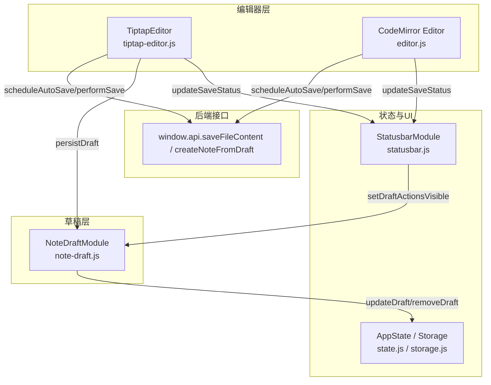
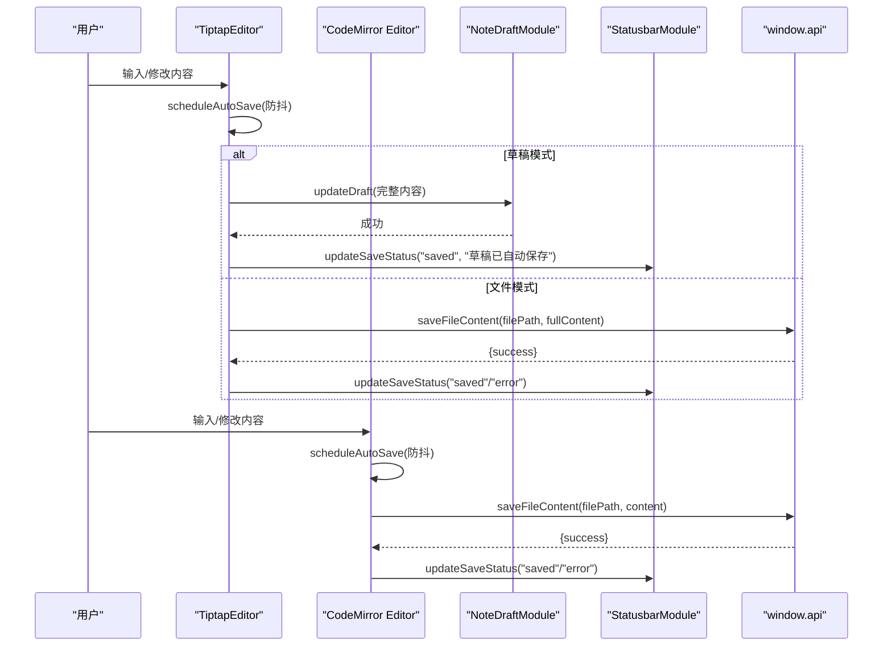
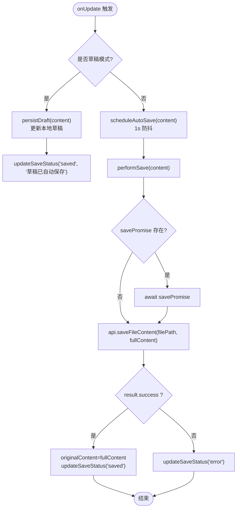
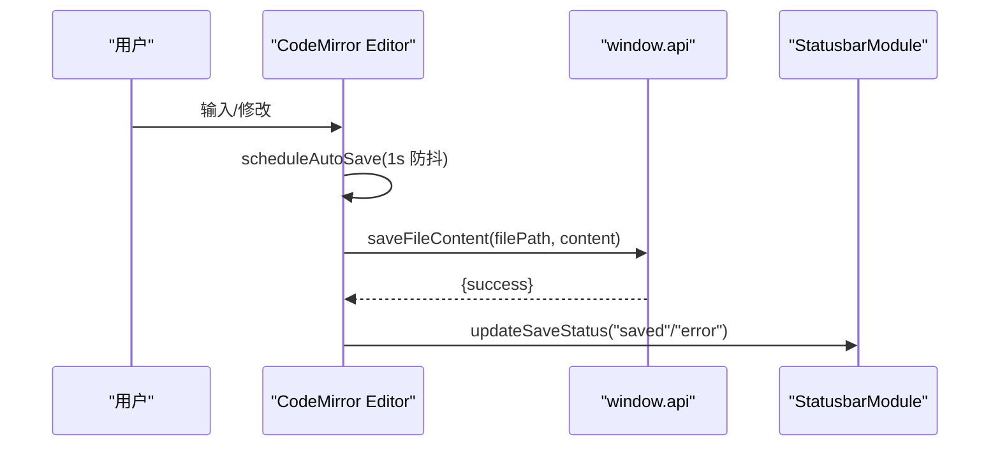
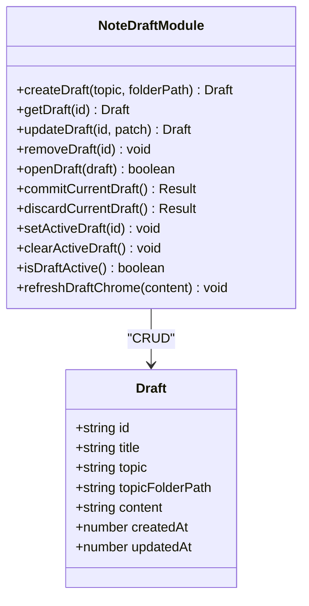
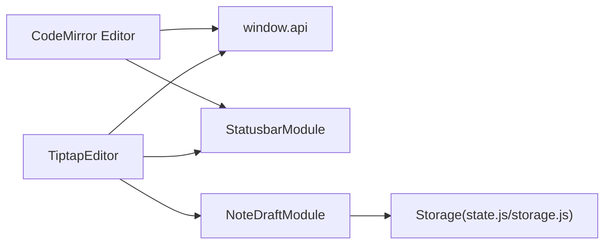

# 自动保存系统

<cite>
**本文引用的文件**   
- [webui/js/tiptap-editor.js](file://webui/js/tiptap-editor.js)
- [webui/js/editor.js](file://webui/js/editor.js)
- [webui/js/note-draft.js](file://webui/js/note-draft.js)
- [webui/js/statusbar.js](file://webui/js/statusbar.js)
- [webui/js/state.js](file://webui/js/state.js)
- [webui/js/storage.js](file://webui/js/storage.js)
</cite>

## 目录
1. [简介](#简介)
2. [项目结构](#项目结构)
3. [核心组件](#核心组件)
4. [架构总览](#架构总览)
5. [详细组件分析](#详细组件分析)
6. [依赖关系分析](#依赖关系分析)
7. [性能考虑](#性能考虑)
8. [故障排除指南](#故障排除指南)
9. [结论](#结论)
10. [附录](#附录)

## 简介
本技术文档围绕“自动保存系统”的实现与使用，系统性阐述以下能力：
- 防抖保存机制：在用户编辑过程中合并多次变更，降低 I/O 压力。
- 保存队列管理与并发控制：避免重复写入、保证顺序与幂等。
- 保存状态跟踪与进度反馈：通过状态栏实时展示保存状态。
- 错误处理与异常恢复：失败提示、降级策略与清理流程。
- 草稿管理：本地缓存、版本历史（基于时间戳）、冲突解决（以最后一次提交为准）。
- 配置与调优：可调节的保存延迟、大文档解析与渲染优化策略。
- 实际使用场景与排障建议。

说明：
- 当前仓库未实现服务端断点续传；前端具备“草稿持久化到本地存储”的能力，可作为“断点续写”的基础。
- 未实现显式的“重试队列”，但提供了失败提示与降级回退路径。

## 项目结构
自动保存相关的前端模块主要位于 webui/js 下，按职责划分如下：
- tiptap-editor.js：WYSIWYG 编辑器封装，负责内容获取、防抖调度、草稿/文件保存、UI 联动。
- editor.js：CodeMirror 编辑器封装，提供轻量级 Markdown 编辑与自动保存。
- note-draft.js：草稿生命周期管理（创建、更新、打开、提交、丢弃），以及本地持久化。
- statusbar.js：底部状态栏，统一显示保存状态、消息、字数统计等。
- state.js：全局应用状态与订阅通知。
- storage.js：localStorage 的统一抽象层。

图表来源
- [webui/js/tiptap-editor.js:467-549](file://webui/js/tiptap-editor.js#L467-L549)
- [webui/js/editor.js:320-376](file://webui/js/editor.js#L320-L376)
- [webui/js/note-draft.js:94-128](file://webui/js/note-draft.js#L94-L128)
- [webui/js/statusbar.js:110-134](file://webui/js/statusbar.js#L110-L134)
- [webui/js/state.js:155-168](file://webui/js/state.js#L155-L168)
- [webui/js/storage.js:31-67](file://webui/js/storage.js#L31-L67)

章节来源
- [webui/js/tiptap-editor.js:1-670](file://webui/js/tiptap-editor.js#L1-L670)
- [webui/js/editor.js:1-540](file://webui/js/editor.js#L1-L540)
- [webui/js/note-draft.js:1-392](file://webui/js/note-draft.js#L1-L392)
- [webui/js/statusbar.js:1-283](file://webui/js/statusbar.js#L1-L283)
- [webui/js/state.js:1-199](file://webui/js/state.js#L1-L199)
- [webui/js/storage.js:1-159](file://webui/js/storage.js#L1-L159)

## 核心组件
- TiptapEditor（tiptap-editor.js）
  - 功能：Markdown WYSIWYG 编辑器封装；支持 frontmatter 面板、工具栏、光标位置、大文档懒加载与空闲回调。
  - 自动保存：基于 SAVE_DELAY_MS（默认 1000ms）的防抖；区分草稿模式与文件模式；并发通过 savePromise 串行化。
  - 草稿持久化：调用 NoteDraftModule.updateDraft 将完整内容落盘 localStorage。
- CodeMirror Editor（editor.js）
  - 功能：轻量 Markdown 编辑器；同样采用 1s 防抖与 Promise 串行保存。
  - 降级：当 EditorBridge 不可用时回退为 textarea。
- NoteDraftModule（note-draft.js）
  - 功能：草稿 CRUD、激活态管理、标题提取、本地持久化、快捷键触发保存。
  - 提交：createNoteFromDraft 完成后清理草稿并刷新 UI。
- StatusbarModule（statusbar.js）
  - 功能：统一更新保存状态、消息、字数统计、光标位置、草稿操作按钮可见性。
- AppState / Storage（state.js / storage.js）
  - 功能：全局状态订阅、主题偏好与 UI 配置持久化；Storage 提供健壮的 JSON 读写封装。

章节来源
- [webui/js/tiptap-editor.js:467-549](file://webui/js/tiptap-editor.js#L467-L549)
- [webui/js/editor.js:320-376](file://webui/js/editor.js#L320-L376)
- [webui/js/note-draft.js:63-128](file://webui/js/note-draft.js#L63-L128)
- [webui/js/statusbar.js:110-134](file://webui/js/statusbar.js#L110-L134)
- [webui/js/state.js:155-168](file://webui/js/state.js#L155-L168)
- [webui/js/storage.js:31-67](file://webui/js/storage.js#L31-L67)

## 架构总览
自动保存系统在前端侧完成“编辑—防抖—持久化/提交—状态反馈”的闭环。整体数据流如下：

图表来源
- [webui/js/tiptap-editor.js:467-549](file://webui/js/tiptap-editor.js#L467-L549)
- [webui/js/editor.js:320-376](file://webui/js/editor.js#L320-L376)
- [webui/js/note-draft.js:94-128](file://webui/js/note-draft.js#L94-L128)
- [webui/js/statusbar.js:110-134](file://webui/js/statusbar.js#L110-L134)

## 详细组件分析

### TiptapEditor 自动保存与草稿机制
- 防抖策略
  - 常量 SAVE_DELAY_MS=1000ms，每次内容变化重置定时器，达到“合并高频变更”的目的。
  - 草稿模式下仅持久化到本地（updateDraft），不发起网络请求。
- 并发控制
  - 使用 savePromise 串行化 performSave，避免并发写入导致覆盖或竞态。
- 大文档优化
  - 超过阈值时延迟解析与渲染，利用 requestIdleCallback 或 setTimeout 进行空闲任务调度。
- 状态反馈
  - 通过 updateSaveStatus 同步状态栏文本与样式类名。
- 退出与清理
  - destroy/flushSave 确保关闭前完成待保存内容或草稿持久化。

图表来源
- [webui/js/tiptap-editor.js:467-549](file://webui/js/tiptap-editor.js#L467-L549)

章节来源
- [webui/js/tiptap-editor.js:1-670](file://webui/js/tiptap-editor.js#L1-L670)

### CodeMirror Editor 自动保存
- 防抖策略
  - 1s 防抖，与 TiptapEditor 一致。
- 并发控制
  - 使用 _savePromise 串行化 performSave。
- 降级策略
  - 当 EditorBridge 不可用或初始化失败时，回退为 textarea，仍保持自动保存能力。

图表来源
- [webui/js/editor.js:320-376](file://webui/js/editor.js#L320-L376)
- [webui/js/statusbar.js:110-134](file://webui/js/statusbar.js#L110-L134)

章节来源
- [webui/js/editor.js:1-540](file://webui/js/editor.js#L1-L540)

### 草稿管理（本地缓存、版本历史、冲突解决）
- 本地缓存
  - 使用 localStorage 键 noteai.noteDrafts.v1 存储所有草稿对象集合。
  - 每个草稿包含 id、title、topic、topicFolderPath、content、createdAt、updatedAt。
- 版本历史
  - 通过 updatedAt 字段体现最近一次更新时间，作为简单版本标识。
- 冲突解决
  - 同一草稿 ID 的更新会覆盖旧值，遵循“最后写入优先”的策略。
- 交互与快捷
  - 支持 Ctrl/Cmd+S 触发提交；状态栏显示“草稿模式”、“未保存到工作区”等提示。
- 提交到工作区
  - commitCurrentDraft 调用 api.createNoteFromDraft，成功后删除草稿并刷新视图。

图表来源
- [webui/js/note-draft.js:63-128](file://webui/js/note-draft.js#L63-L128)
- [webui/js/note-draft.js:230-314](file://webui/js/note-draft.js#L230-L314)

章节来源
- [webui/js/note-draft.js:1-392](file://webui/js/note-draft.js#L1-L392)

### 保存状态跟踪与用户提示
- 状态栏
  - updateSaveStatus(status, text) 统一设置保存状态文本与样式类名。
  - setDraftActionsVisible(visible) 控制“保存/作废”按钮可见性。
  - updateMessage(text, options) 用于临时消息展示与自动消失。
- 编辑器集成
  - TiptapEditor 与 CodeMirror Editor 均通过 updateSaveStatus 同步状态。
- 元数据面板
  - frontmatter 面板的输入也会触发自动保存与状态更新。

章节来源
- [webui/js/statusbar.js:110-134](file://webui/js/statusbar.js#L110-L134)
- [webui/js/statusbar.js:163-180](file://webui/js/statusbar.js#L163-L180)
- [webui/js/tiptap-editor.js:17-26](file://webui/js/tiptap-editor.js#L17-L26)
- [webui/js/editor.js:62-71](file://webui/js/editor.js#L62-L71)

### 错误处理与异常恢复
- 保存失败
  - 捕获异常后更新状态为 error，并给出用户提示。
- 编辑器不可用
  - TiptapEditor 在模块未就绪时回退为 textarea；CodeMirror 在 EditorBridge 不可用时也回退为 textarea。
- 清理与一致性
  - destroy/flushSave 确保关闭前完成必要保存，避免丢失。

章节来源
- [webui/js/tiptap-editor.js:439-455](file://webui/js/tiptap-editor.js#L439-L455)
- [webui/js/editor.js:85-108](file://webui/js/editor.js#L85-L108)
- [webui/js/tiptap-editor.js:359-386](file://webui/js/tiptap-editor.js#L359-L386)
- [webui/js/editor.js:182-200](file://webui/js/editor.js#L182-L200)

### 断点续传与重试机制现状
- 断点续传
  - 当前未实现服务端分片与断点续传。
  - 可通过草稿本地持久化（note-draft.js）实现“断点续写”的基础能力。
- 重试机制
  - 当前未实现显式重试队列；可在 performSave 中扩展指数退避重试逻辑。

章节来源
- [webui/js/note-draft.js:94-128](file://webui/js/note-draft.js#L94-L128)
- [webui/js/tiptap-editor.js:516-549](file://webui/js/tiptap-editor.js#L516-L549)
- [webui/js/editor.js:349-376](file://webui/js/editor.js#L349-L376)

## 依赖关系分析
- 模块耦合
  - TiptapEditor 与 CodeMirror Editor 都依赖 window.api 进行持久化，并通过 StatusbarModule 反馈状态。
  - TiptapEditor 在草稿模式下依赖 NoteDraftModule 进行本地持久化。
  - NoteDraftModule 依赖 Storage 抽象层进行本地读写。
- 外部依赖
  - marked/DOMPurify 用于预览渲染（非保存链路核心）。
  - EditorBridge 用于 CodeMirror 实例化。

图表来源
- [webui/js/tiptap-editor.js:467-549](file://webui/js/tiptap-editor.js#L467-L549)
- [webui/js/editor.js:320-376](file://webui/js/editor.js#L320-L376)
- [webui/js/note-draft.js:94-128](file://webui/js/note-draft.js#L94-L128)
- [webui/js/statusbar.js:110-134](file://webui/js/statusbar.js#L110-L134)
- [webui/js/state.js:155-168](file://webui/js/state.js#L155-L168)
- [webui/js/storage.js:31-67](file://webui/js/storage.js#L31-L67)

章节来源
- [webui/js/tiptap-editor.js:1-670](file://webui/js/tiptap-editor.js#L1-L670)
- [webui/js/editor.js:1-540](file://webui/js/editor.js#L1-L540)
- [webui/js/note-draft.js:1-392](file://webui/js/note-draft.js#L1-L392)
- [webui/js/statusbar.js:1-283](file://webui/js/statusbar.js#L1-L283)
- [webui/js/state.js:1-199](file://webui/js/state.js#L1-L199)
- [webui/js/storage.js:1-159](file://webui/js/storage.js#L1-L159)

## 性能考虑
- 防抖间隔
  - 默认 1000ms，可根据设备性能与网络状况调整 SAVE_DELAY_MS。
- 大文档优化
  - 超过 DEFER_EDITOR_PARSE_CHARS/DEFER_EDITOR_PARSE_LINES 时延迟解析与渲染，使用 requestIdleCallback 或 setTimeout 执行。
  - 对超长文档启用 CSS content-visibility 提示以提升滚动性能。
- 并发控制
  - 通过 Promise 串行化保存，避免重复 I/O。
- 降级策略
  - 编辑器不可用时回退为 textarea，保障基本可用性。

[本节为通用指导，无需具体文件引用]

## 故障排除指南
- 保存无响应
  - 检查 StatusbarModule 是否正确接收 updateSaveStatus 调用。
  - 确认 window.api.saveFileContent 可用且返回 success。
- 草稿未持久化
  - 检查 NoteDraftModule.updateDraft 是否被调用，localStorage 是否可用。
- 编辑器无法启动
  - TiptapEditor 等待 TiptapModules 就绪；若超时则回退 textarea。
  - CodeMirror 等待 EditorBridge；若不可用则回退 textarea。
- 状态栏不更新
  - 确认 DOM 元素 id 存在（如 statusbar-save-status）。
  - 检查 updateSaveStatus 的 className 与 textContent 赋值逻辑。

章节来源
- [webui/js/statusbar.js:110-134](file://webui/js/statusbar.js#L110-L134)
- [webui/js/tiptap-editor.js:136-157](file://webui/js/tiptap-editor.js#L136-L157)
- [webui/js/editor.js:85-108](file://webui/js/editor.js#L85-L108)
- [webui/js/note-draft.js:94-128](file://webui/js/note-draft.js#L94-L128)

## 结论
本自动保存系统通过“防抖+串行化”在前端实现了稳定可靠的保存体验，结合草稿本地持久化与状态栏反馈，兼顾了用户体验与鲁棒性。未来可扩展方向包括：
- 服务端断点续传与分片上传。
- 带退避的重试队列与离线队列。
- 更细粒度的保存策略配置（不同文件类型/大小采用不同策略）。

[本节为总结，无需具体文件引用]

## 附录

### 保存策略配置与调优参数
- 保存延迟
  - TiptapEditor：SAVE_DELAY_MS（默认 1000ms）
  - CodeMirror Editor：固定 1000ms（可通过修改 editor.js 中的 scheduleAutoSave 调整）
- 大文档阈值
  - DEFER_EDITOR_PARSE_CHARS、DEFER_EDITOR_PARSE_LINES（延迟解析）
  - VIRT_SCROLL_CHARS、VIRT_SCROLL_LINES（虚拟滚动提示）
- 草稿键名
  - noteai.noteDrafts.v1（localStorage）
- 状态栏元素
  - statusbar-save-status、statusbar-message、statusbar-filename 等

章节来源
- [webui/js/tiptap-editor.js:9-15](file://webui/js/tiptap-editor.js#L9-L15)
- [webui/js/editor.js:320-328](file://webui/js/editor.js#L320-L328)
- [webui/js/note-draft.js:3](file://webui/js/note-draft.js#L3)
- [webui/js/statusbar.js:110-134](file://webui/js/statusbar.js#L110-L134)

### 使用场景示例
- 快速新建笔记
  - 使用 NoteDraftModule.createDraft 创建草稿，打开编辑器编辑，Ctrl/Cmd+S 提交到工作区。
- 在线编辑 Markdown
  - 使用 TiptapEditor.openMarkdownInEditor 打开文件，自动保存至原路径。
- 离线写作
  - 在草稿模式下持续编辑，内容自动持久化到 localStorage，重启后可继续编辑。

章节来源
- [webui/js/note-draft.js:63-86](file://webui/js/note-draft.js#L63-L86)
- [webui/js/note-draft.js:168-208](file://webui/js/note-draft.js#L168-L208)
- [webui/js/tiptap-editor.js:614-642](file://webui/js/tiptap-editor.js#L614-L642)