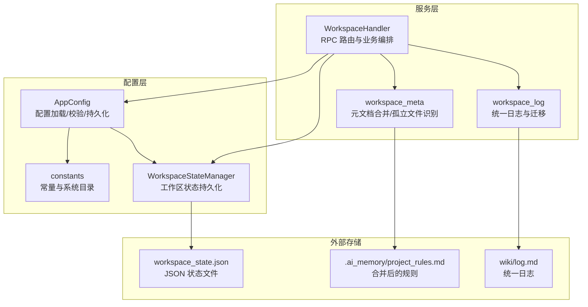
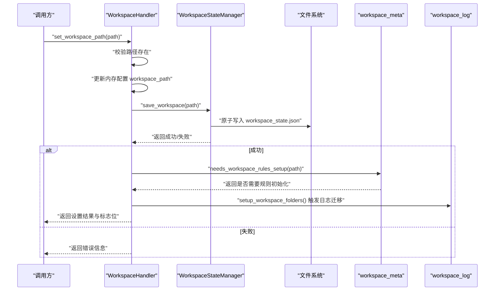
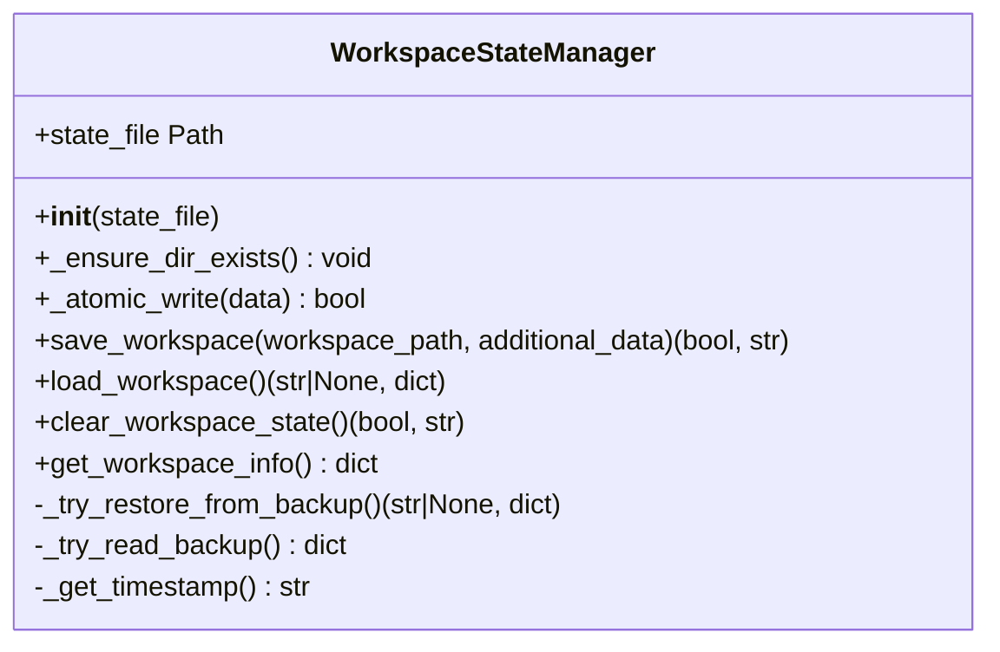
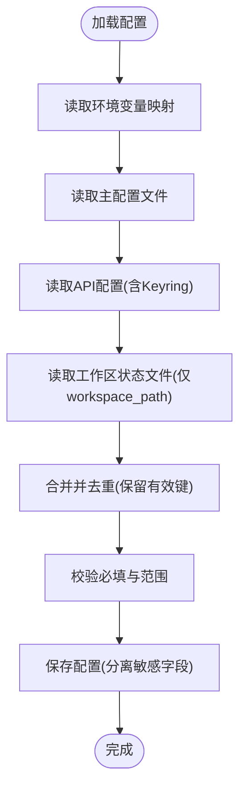
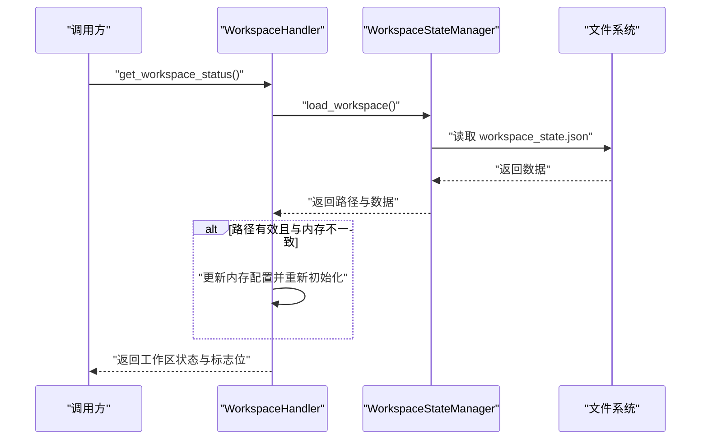
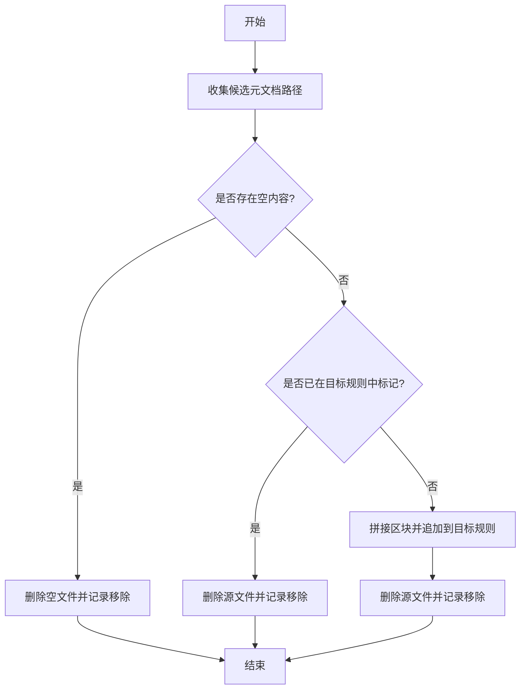
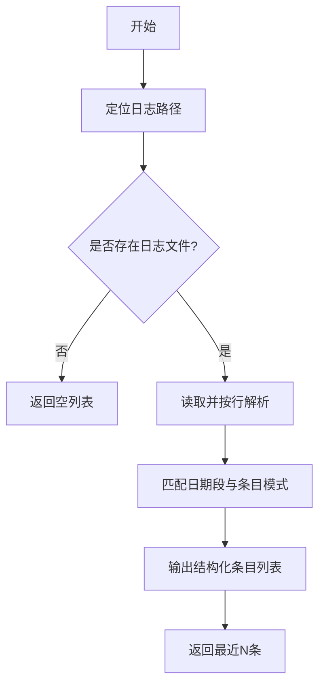
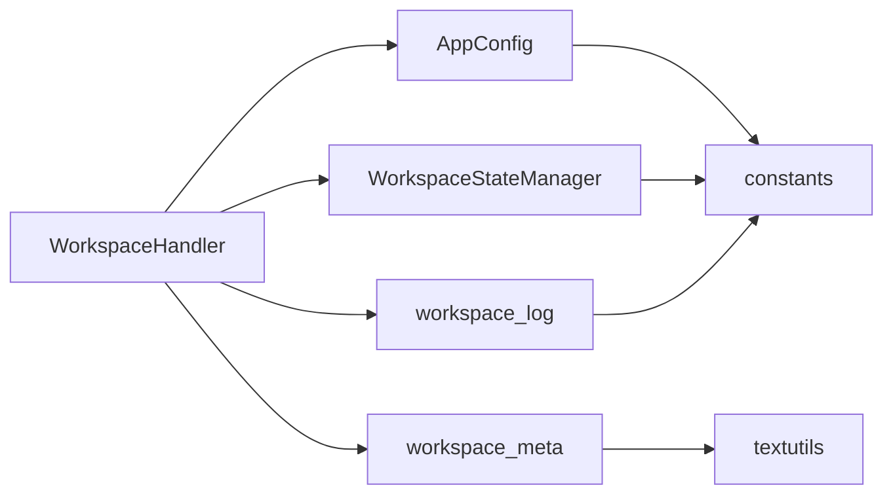

# 工作区元数据管理

<cite>
**本文引用的文件**   
- [config/workspace_state.py](file://config/workspace_state.py)
- [config/constants.py](file://config/constants.py)
- [config/app_config.py](file://config/app_config.py)
- [python/sidecar/handlers/workspace_handler.py](file://python/sidecar/handlers/workspace_handler.py)
- [python/sidecar/workspace_meta.py](file://python/sidecar/workspace_meta.py)
- [utils/workspace_log.py](file://utils/workspace_log.py)
- [tests/unit/test_workspace_meta.py](file://tests/unit/test_workspace_meta.py)
</cite>

## 目录
1. [简介](#简介)
2. [项目结构](#项目结构)
3. [核心组件](#核心组件)
4. [架构总览](#架构总览)
5. [详细组件分析](#详细组件分析)
6. [依赖关系分析](#依赖关系分析)
7. [性能考虑](#性能考虑)
8. [故障排查指南](#故障排查指南)
9. [结论](#结论)
10. [附录：常见用例与操作示例](#附录常见用例与操作示例)

## 简介
本技术文档围绕“工作区元数据管理系统”展开，重点说明以下方面：
- 工作区路径存储、状态跟踪、版本管理等核心能力
- 元数据的序列化格式（JSON）与持久化机制（原子写入、备份恢复）
- 工作区生命周期管理：初始化、加载、保存、清理等
- 工作区配置项的定义、验证与默认值处理
- 工作区元数据操作的常见用法：查询、更新、迁移等

注意：代码库中未提供名为 WorkspaceMeta 的类。与“工作区元数据”相关的实现主要分布在以下模块：
- 工作区状态管理器：负责工作区路径、打开时间、版本等元数据的持久化
- 应用配置器：负责工作区路径等运行时配置的加载、校验与持久化
- 工作区处理器：对外暴露工作区相关 RPC 接口，协调状态与文件系统
- 工作区规则/元文档合并：将 AGENTS/CLAUDE/GEMINI 等元文档合并到统一规则文件
- 工作区日志：统一变更日志的追加与迁移

## 项目结构
下图展示了与工作区元数据相关的核心模块及其交互关系。

图表来源
- [config/app_config.py:1-396](file://config/app_config.py#L1-L396)
- [config/constants.py:1-52](file://config/constants.py#L1-L52)
- [config/workspace_state.py:1-198](file://config/workspace_state.py#L1-L198)
- [python/sidecar/handlers/workspace_handler.py:1-260](file://python/sidecar/handlers/workspace_handler.py#L1-L260)
- [python/sidecar/workspace_meta.py:1-121](file://python/sidecar/workspace_meta.py#L1-L121)
- [utils/workspace_log.py:1-254](file://utils/workspace_log.py#L1-L254)

章节来源
- [config/app_config.py:1-396](file://config/app_config.py#L1-L396)
- [config/constants.py:1-52](file://config/constants.py#L1-L52)
- [config/workspace_state.py:1-198](file://config/workspace_state.py#L1-L198)
- [python/sidecar/handlers/workspace_handler.py:1-260](file://python/sidecar/handlers/workspace_handler.py#L1-L260)
- [python/sidecar/workspace_meta.py:1-121](file://python/sidecar/workspace_meta.py#L1-L121)
- [utils/workspace_log.py:1-254](file://utils/workspace_log.py#L1-L254)

## 核心组件
本节聚焦于工作区元数据管理的核心实现要点。

- 工作区状态管理器（WorkspaceStateManager）
  - 职责：维护工作区路径、最近打开时间、版本等元数据；提供原子写入、备份恢复、状态读取与清理能力
  - 关键方法：save_workspace、load_workspace、clear_workspace_state、get_workspace_info
  - 持久化：JSON 格式，位于系统应用数据目录下的 workspace_state.json；支持 .json.bak 备份

- 应用配置器（AppConfig）
  - 职责：集中定义工作区相关配置项（如 NOTES_FOLDER、RAW_FOLDER、WORKSPACE_APP_FOLDER 等），并提供加载、校验、持久化
  - 工作区路径来源优先级：环境变量 > 工作区状态文件 > 配置文件默认值
  - 工作区初始化：setup_workspace_folders 创建必要目录并执行日志迁移

- 工作区处理器（WorkspaceHandler）
  - 职责：注册 RPC 路由，协调工作区设置、状态检查、树构建、文件选择等
  - 典型流程：设置工作区路径时，更新内存配置、启动监听、调用状态管理器保存、计算是否需要规则/Schema 初始化

- 工作区元文档合并（workspace_meta）
  - 职责：识别 AGENTS/CLAUDE/GEMINI 等元文档，将其内容合并至 .ai_memory/project_rules.md，并删除源文件
  - 辅助：is_inbox_orphan_path 用于识别 Inbox 孤儿文件（根或 Notes 顶层无主题文件夹的 Markdown）

- 工作区日志（workspace_log）
  - 职责：统一变更日志写入 wiki/log.md，按日分组；提供旧日志迁移工具

章节来源
- [config/workspace_state.py:1-198](file://config/workspace_state.py#L1-L198)
- [config/app_config.py:1-396](file://config/app_config.py#L1-L396)
- [python/sidecar/handlers/workspace_handler.py:1-260](file://python/sidecar/handlers/workspace_handler.py#L1-L260)
- [python/sidecar/workspace_meta.py:1-121](file://python/sidecar/workspace_meta.py#L1-L121)
- [utils/workspace_log.py:1-254](file://utils/workspace_log.py#L1-L254)

## 架构总览
下图展示一次“设置工作区路径”的完整调用链，包括状态持久化与后续初始化动作。

图表来源
- [python/sidecar/handlers/workspace_handler.py:85-105](file://python/sidecar/handlers/workspace_handler.py#L85-L105)
- [config/workspace_state.py:62-86](file://config/workspace_state.py#L62-L86)
- [config/app_config.py:146-175](file://config/app_config.py#L146-L175)

## 详细组件分析

### 工作区状态管理器（WorkspaceStateManager）
- 设计要点
  - 原子写入：通过临时文件 + fsync + 移动的方式保证写入一致性
  - 备份恢复：写入前复制为 .json.bak；加载失败时尝试从备份恢复
  - 版本字段：状态中包含 version 字段，便于未来扩展
- 数据结构（JSON）
  - workspace_path: 字符串，工作区绝对路径
  - last_opened_at: ISO 时间戳
  - version: 字符串，当前状态格式版本
  - additional_data: 可选字典，由调用方附加额外元数据
- 复杂度与性能
  - 读写均为 I/O 密集，使用原子写入避免损坏；备份复制带来少量额外开销
- 错误处理
  - 权限不足、磁盘异常均抛出 WorkspaceStateError，上层可捕获并提示用户

图表来源
- [config/workspace_state.py:15-198](file://config/workspace_state.py#L15-L198)

章节来源
- [config/workspace_state.py:1-198](file://config/workspace_state.py#L1-L198)

### 应用配置器（AppConfig）
- 设计要点
  - 集中定义工作区相关常量与默认值（如 NOTES_FOLDER、RAW_FOLDER、WORKSPACE_APP_FOLDER 等）
  - 加载顺序：环境变量 > API 配置 > 主配置文件 > 工作区状态文件（仅 workspace_path）
  - 校验：validate_api_config、validate_context_config 等
  - 持久化：save_to_file 分离敏感字段与非敏感字段，API Key 优先写入系统安全存储
- 工作区初始化
  - setup_workspace_folders 确保 Notes/wiki/Raw/.noteai 等目录存在，并触发日志迁移

图表来源
- [config/app_config.py:212-311](file://config/app_config.py#L212-L311)
- [config/app_config.py:313-383](file://config/app_config.py#L313-L383)

章节来源
- [config/app_config.py:1-396](file://config/app_config.py#L1-L396)

### 工作区处理器（WorkspaceHandler）
- 职责
  - 注册工作区相关 RPC 路由：获取状态、校验路径、清除已保存工作区、设置路径、获取树、文件选择、刷新日志、知识库健康检查
  - 编排工作区设置流程：更新内存配置、启动监听、保存状态、计算规则/Schema 初始化标志
- 工作区树构建
  - 忽略特定目录与隐藏文件，限制递归深度，统计文件数量

图表来源
- [python/sidecar/handlers/workspace_handler.py:50-70](file://python/sidecar/handlers/workspace_handler.py#L50-L70)
- [config/workspace_state.py:87-106](file://config/workspace_state.py#L87-L106)

章节来源
- [python/sidecar/handlers/workspace_handler.py:1-260](file://python/sidecar/handlers/workspace_handler.py#L1-L260)

### 工作区元文档合并（workspace_meta）
- 功能
  - 识别 AGENTS/CLAUDE/GEMINI 元文档（支持工作区根与 Notes 顶层）
  - 剥离 frontmatter 后合并至 .ai_memory/project_rules.md，并删除源文件
  - 若目标已有对应标记则跳过合并
- 孤儿文件识别
  - is_inbox_orphan_path 判断是否为根或 Notes 顶层的孤立 Markdown（排除 README 与元文档）

图表来源
- [python/sidecar/workspace_meta.py:46-98](file://python/sidecar/workspace_meta.py#L46-L98)

章节来源
- [python/sidecar/workspace_meta.py:1-121](file://python/sidecar/workspace_meta.py#L1-L121)

### 工作区日志（workspace_log）
- 功能
  - 统一日志写入 wiki/log.md，按日期分组，限制每日条目数
  - 解析旧格式日志（JSON/MD）并迁移至新格式
- 迁移
  - migrate_legacy_logs 将 .noteai/activity_log.json 与 .noteai/log.md 迁移到 wiki/log.md

图表来源
- [utils/workspace_log.py:82-115](file://utils/workspace_log.py#L82-L115)

章节来源
- [utils/workspace_log.py:1-254](file://utils/workspace_log.py#L1-L254)

## 依赖关系分析
- 组件耦合
  - WorkspaceHandler 依赖 AppConfig 与 WorkspaceStateManager，间接依赖 constants 提供的路径常量
  - workspace_meta 依赖 textutils 的 frontmatter 解析与 logger
  - workspace_log 依赖 config 与 constants，提供日志迁移
- 外部依赖
  - JSON 序列化/反序列化
  - 文件系统 I/O（含权限控制）
  - 系统应用数据目录（跨平台）

图表来源
- [python/sidecar/handlers/workspace_handler.py:1-260](file://python/sidecar/handlers/workspace_handler.py#L1-L260)
- [config/app_config.py:1-396](file://config/app_config.py#L1-L396)
- [config/workspace_state.py:1-198](file://config/workspace_state.py#L1-L198)
- [python/sidecar/workspace_meta.py:1-121](file://python/sidecar/workspace_meta.py#L1-L121)
- [utils/workspace_log.py:1-254](file://utils/workspace_log.py#L1-L254)

章节来源
- [python/sidecar/handlers/workspace_handler.py:1-260](file://python/sidecar/handlers/workspace_handler.py#L1-L260)
- [config/app_config.py:1-396](file://config/app_config.py#L1-L396)
- [config/workspace_state.py:1-198](file://config/workspace_state.py#L1-L198)
- [python/sidecar/workspace_meta.py:1-121](file://python/sidecar/workspace_meta.py#L1-L121)
- [utils/workspace_log.py:1-254](file://utils/workspace_log.py#L1-L254)

## 性能考虑
- 原子写入与备份复制会带来额外 I/O 开销，但能显著提升可靠性
- 工作区树构建限制递归深度，避免在大型工作区上阻塞
- 日志写入采用线程锁保护，避免并发竞争；每日条目上限防止单文件过大
- 建议：对超大工作区可考虑增量扫描与缓存策略

## 故障排查指南
- 无法创建应用数据目录
  - 现象：保存状态时报错“无法创建应用数据目录”
  - 原因：权限不足或路径不可写
  - 处理：检查系统应用数据目录权限，确保进程有写入权限
- 保存工作区状态失败
  - 现象：保存失败提示“没有写入权限”或具体 OS 错误
  - 处理：确认磁盘空间与权限；必要时以管理员身份运行
- 加载工作区状态出错
  - 现象：JSON 解析错误或 IO 异常
  - 处理：自动尝试从 .json.bak 恢复；若仍失败，清空状态并重新设置
- 工作区路径无效
  - 现象：设置路径后提示“路径无效”
  - 处理：确认路径存在且可读；检查符号链接与挂载点

章节来源
- [config/workspace_state.py:20-61](file://config/workspace_state.py#L20-L61)
- [config/workspace_state.py:87-126](file://config/workspace_state.py#L87-L126)
- [python/sidecar/handlers/workspace_handler.py:72-105](file://python/sidecar/handlers/workspace_handler.py#L72-L105)

## 结论
本系统通过清晰的分层设计与稳健的持久化机制，实现了工作区元数据的全生命周期管理。工作区状态管理器保障元数据的一致性与可恢复性；应用配置器提供灵活的配置来源与严格的校验；工作区处理器作为编排层，串联各组件完成常见任务；元文档合并与日志迁移提升了用户体验与可维护性。整体方案兼顾可靠性与可扩展性，适合在生产环境中稳定运行。

## 附录：常见用例与操作示例
以下为常见操作的路径参考（不直接展示代码内容）：
- 查询工作区状态
  - 参考：[python/sidecar/handlers/workspace_handler.py:50-70](file://python/sidecar/handlers/workspace_handler.py#L50-L70)
- 设置工作区路径
  - 参考：[python/sidecar/handlers/workspace_handler.py:85-105](file://python/sidecar/handlers/workspace_handler.py#L85-L105)
- 清除已保存的工作区
  - 参考：[python/sidecar/handlers/workspace_handler.py:78-84](file://python/sidecar/handlers/workspace_handler.py#L78-L84)
- 保存工作区状态（原子写入）
  - 参考：[config/workspace_state.py:62-86](file://config/workspace_state.py#L62-L86)
- 加载工作区状态（含备份恢复）
  - 参考：[config/workspace_state.py:87-126](file://config/workspace_state.py#L87-L126)
- 获取工作区信息摘要
  - 参考：[config/workspace_state.py:140-178](file://config/workspace_state.py#L140-L178)
- 合并元文档到项目规则
  - 参考：[python/sidecar/workspace_meta.py:46-98](file://python/sidecar/workspace_meta.py#L46-L98)
- 识别 Inbox 孤儿文件
  - 参考：[python/sidecar/workspace_meta.py:101-121](file://python/sidecar/workspace_meta.py#L101-L121)
- 迁移旧日志到新格式
  - 参考：[utils/workspace_log.py:229-254](file://utils/workspace_log.py#L229-L254)
- 单元测试覆盖（元文档合并与孤儿识别）
  - 参考：[tests/unit/test_workspace_meta.py:30-47](file://tests/unit/test_workspace_meta.py#L30-L47)