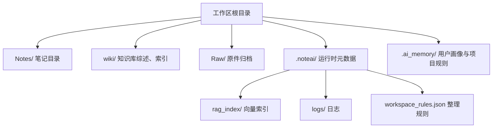
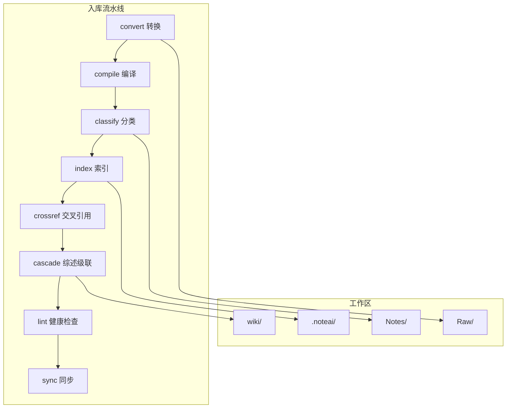
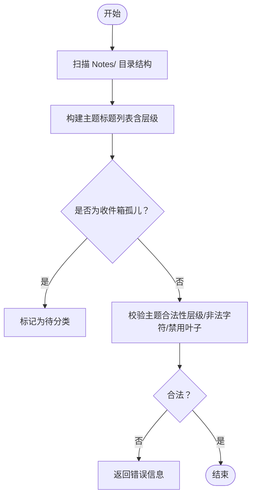
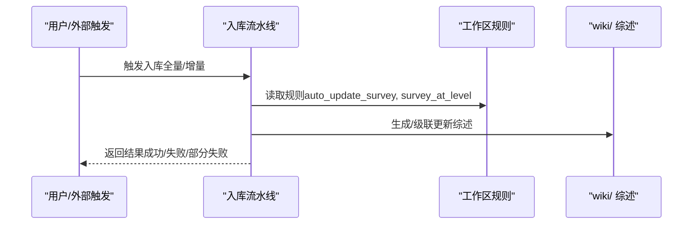
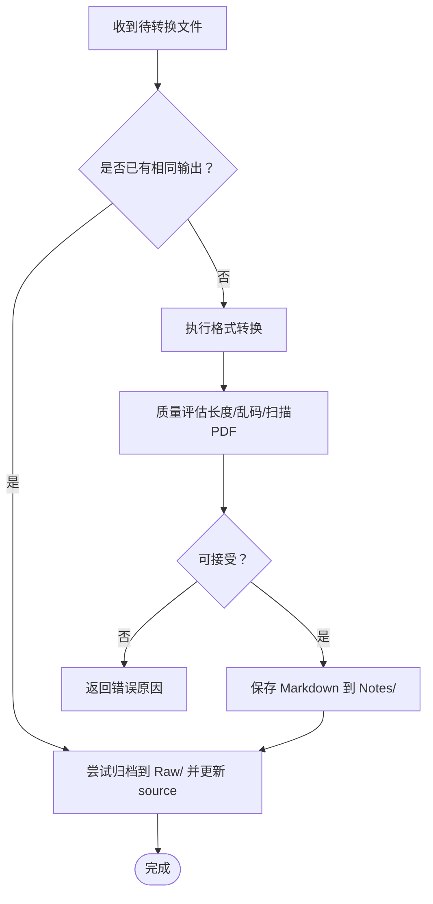
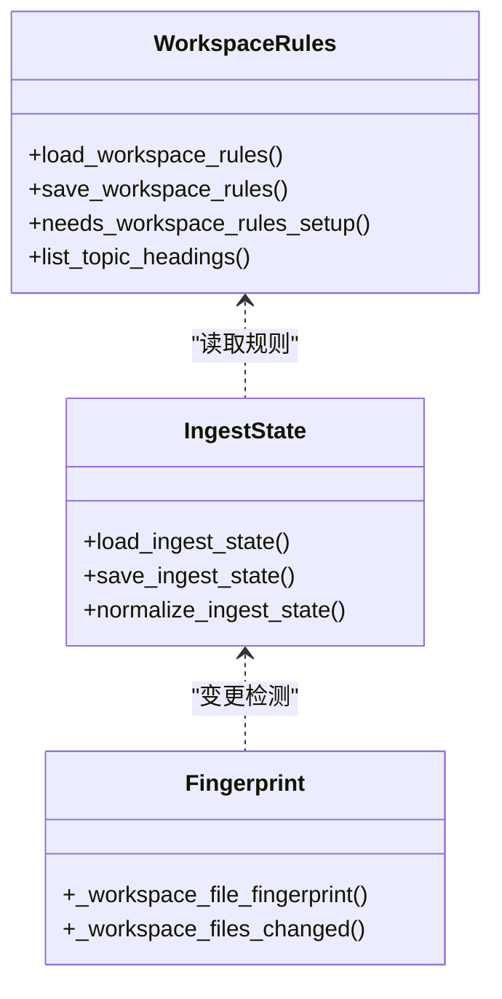
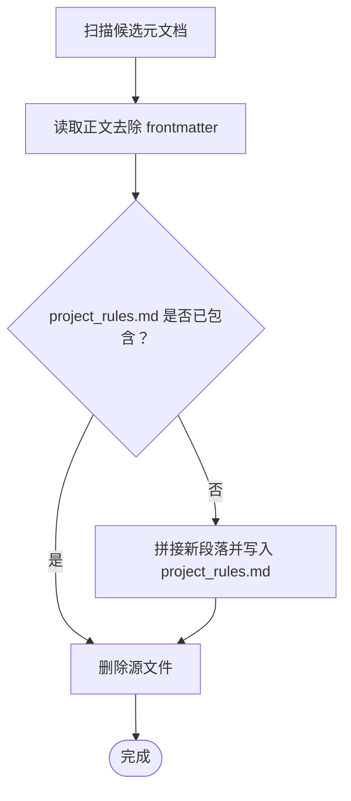
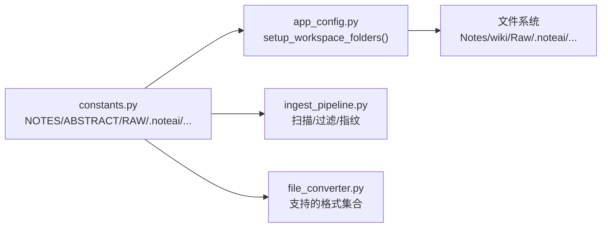

# 工作区文件结构

<cite>
**本文引用的文件**   
- [README.md](file://README.md)
- [constants.py](file://config/constants.py)
- [app_config.py](file://config/app_config.py)
- [workspace_state.py](file://config/workspace_state.py)
- [workspace_rules.py](file://python/sidecar/workspace_rules.py)
- [workspace_meta.py](file://python/sidecar/workspace_meta.py)
- [ingest_pipeline.py](file://python/sidecar/ingest_pipeline.py)
- [file_converter.py](file://modules/file_converter.py)
</cite>

## 目录
1. [简介](#简介)
2. [项目结构](#项目结构)
3. [核心组件](#核心组件)
4. [架构总览](#架构总览)
5. [详细组件分析](#详细组件分析)
6. [依赖关系分析](#依赖关系分析)
7. [性能与扩展性](#性能与扩展性)
8. [故障排查指南](#故障排查指南)
9. [结论](#结论)
10. [附录：初始化与工作区组织示例](#附录初始化与工作区组织示例)

## 简介
本文件面向 NoteAI 工作区的标准目录结构与组织规范，聚焦以下目标：
- 解释 Notes/（笔记）、wiki/（知识库）、Raw/（原始文件）、.noteai/（系统元数据）等核心目录的职责与用途
- 明确各目录的文件命名规范、组织原则与最佳实践
- 说明支持的文件类型与过滤规则
- 描述隐藏文件与忽略目录的处理机制
- 提供工作区初始化与文件组织的实操指引（以路径与流程为主，不直接粘贴代码）

## 项目结构
NoteAI 的工作区位于用户选择的任意本地文件夹。应用会在该目录下维护一套约定式目录与元数据，便于采集、编译、索引与检索。

图示来源
- [README.md:141-151](file://README.md#L141-L151)
- [app_config.py:146-174](file://config/app_config.py#L146-L174)
- [constants.py:26-31](file://config/constants.py#L26-L31)

章节来源
- [README.md:141-151](file://README.md#L141-L151)
- [app_config.py:146-174](file://config/app_config.py#L146-L174)
- [constants.py:26-31](file://config/constants.py#L26-L31)

## 核心组件
本节从“目录职责 + 命名规范 + 组织原则”三个维度，给出工作区核心目录的详细说明。

- Notes/（笔记目录）
  - 作用：存放 Markdown 笔记；按三级主题组织为 Notes/L1/L2/L3/*.md
  - 命名规范：文件名建议语义化、避免特殊字符；主题层级通过目录体现，也可在 frontmatter 中补充 tags、topic 等字段
  - 组织原则：尽量遵循 L1 > L2 > L3 的树形结构；根级或 Notes/ 根下的孤立 .md 会被视为“收件箱孤儿”，进入待分类流程
  - 相关实现参考：
    - 主题目录扫描与层级计算：[list_topic_headings:99-126](file://python/sidecar/workspace_rules.py#L99-L126)
    - “收件箱孤儿”判定（根或 Notes/ 根下无主题派生路径）：[is_inbox_orphan_path:101-121](file://python/sidecar/workspace_meta.py#L101-L121)

- wiki/（知识库）
  - 作用：由系统自动维护的知识层，包含 WIKI.md、主题综述、健康检查日志等
  - 命名规范：WIKI.md 固定名称；主题综述通常以 {主题}_survey.md 形式存在
  - 组织原则：用户一般无需手动编辑；由入库流水线在 classify/cascade/lint 阶段更新
  - 相关实现参考：
    - 工作区规则中的 wiki 可写开关与综述级别控制：[load_workspace_rules/save_workspace_rules:59-92](file://python/sidecar/workspace_rules.py#L59-L92)
    - 入库阶段的综述联动与同步：[run_ingest 阶段编排:480-800](file://python/sidecar/ingest_pipeline.py#L480-L800)

- Raw/（原始文件）
  - 作用：归档被转换的原始文件（PDF、DOCX、PPTX、HTML 等），保留溯源
  - 命名规范：保持原文件名；若冲突则追加序号后缀
  - 组织原则：仅作为归档，不参与检索与主题组织；转换产物写入 Notes/
  - 相关实现参考：
    - 转换后归档到 Raw/ 并更新 source 字段：[_archive_to_raw / _update_note_source:772-800](file://modules/file_converter.py#L772-L800)

- .noteai/（系统元数据）
  - 作用：运行时状态与配置，包括 rag_index/、ingest 状态、日志、工作区规则等
  - 关键子项：
    - rag_index/：RAG 向量索引与清单
    - ingest_state.json：入库流水线进度与统计
    - workspace_rules.json：整理规则（最大深度、是否自动更新综述、AI 可写范围等）
  - 相关实现参考：
    - 工作区应用目录常量与默认创建：[WORKSPACE_APP_FOLDER/RAG_INDEX_FOLDER:26-31](file://config/constants.py#L26-31)、[setup_workspace_folders:146-174](file://config/app_config.py#L146-L174)
    - 工作区规则加载/保存/迁移：[workspace_rules.*:1-92](file://python/sidecar/workspace_rules.py#L1-L92)
    - 入库状态持久化与续跑：[ingest_state.*:107-177](file://python/sidecar/ingest_pipeline.py#L107-L177)

- .ai_memory/（用户画像与项目规则）
  - 作用：合并 AGENTS.md / CLAUDE.md / GEMINI.md 等元文档，生成 project_rules.md，并从工作区隐藏这些源文件
  - 相关实现参考：
    - 元文档发现、合并与删除：[merge_meta_docs_into_project_rules:46-98](file://python/sidecar/workspace_meta.py#L46-L98)

章节来源
- [workspace_rules.py:99-126](file://python/sidecar/workspace_rules.py#L99-L126)
- [workspace_meta.py:101-121](file://python/sidecar/workspace_meta.py#L101-L121)
- [workspace_rules.py:59-92](file://python/sidecar/workspace_rules.py#L59-L92)
- [ingest_pipeline.py:480-800](file://python/sidecar/ingest_pipeline.py#L480-L800)
- [file_converter.py:772-800](file://modules/file_converter.py#L772-L800)
- [constants.py:26-31](file://config/constants.py#L26-L31)
- [app_config.py:146-174](file://config/app_config.py#L146-L174)
- [workspace_meta.py:46-98](file://python/sidecar/workspace_meta.py#L46-L98)

## 架构总览
NoteAI 将“采集 → 整理 → 研究 → 问答”统一在工作区内完成。工作区目录是事实真相来源，所有自动化流程围绕 Notes/、wiki/、Raw/、.noteai/ 展开。

图示来源
- [ingest_pipeline.py:480-800](file://python/sidecar/ingest_pipeline.py#L480-L800)
- [file_converter.py:569-730](file://modules/file_converter.py#L569-L730)
- [workspace_rules.py:59-92](file://python/sidecar/workspace_rules.py#L59-L92)

## 详细组件分析

### 目录与规则：Notes/ 与主题体系
- 主题层级：最多三级（可通过规则调整）
- 目录即主题：Notes/L1/L2/L3 对应主题路径
- 孤儿检测：根或 Notes/ 根下的 .md 若无主题派生路径，将被标记为待分类
- 规则校验：禁止使用“其他/杂项/未分类”等叶子名；非法路径字符拦截

图示来源
- [workspace_rules.py:99-126](file://python/sidecar/workspace_rules.py#L99-L126)
- [workspace_meta.py:101-121](file://python/sidecar/workspace_meta.py#L101-L121)
- [workspace_rules_validator.py:29-52](file://python/sidecar/workspace_rules_validator.py#L29-L52)

章节来源
- [workspace_rules.py:99-126](file://python/sidecar/workspace_rules.py#L99-L126)
- [workspace_meta.py:101-121](file://python/sidecar/workspace_meta.py#L101-L121)
- [workspace_rules_validator.py:29-52](file://python/sidecar/workspace_rules_validator.py#L29-L52)

### 目录与规则：wiki/ 与综述
- 综述生成与级联更新受工作区规则控制（如是否在二级自动生成综述）
- AI 对 wiki 的可写权限可由规则关闭
- 入库阶段在 cascade 步骤更新综述，并在 lint 阶段进行健康检查

图示来源
- [workspace_rules.py:59-92](file://python/sidecar/workspace_rules.py#L59-L92)
- [ingest_pipeline.py:480-800](file://python/sidecar/ingest_pipeline.py#L480-L800)

章节来源
- [workspace_rules.py:59-92](file://python/sidecar/workspace_rules.py#L59-L92)
- [ingest_pipeline.py:480-800](file://python/sidecar/ingest_pipeline.py#L480-L800)

### 目录与规则：Raw/ 与原件归档
- 转换成功后，原始文件移动到 Raw/，并在笔记 frontmatter 中记录 source 字段
- 若已存在同名输出，会跳过重复转换并尝试归档源文件

图示来源
- [file_converter.py:569-730](file://modules/file_converter.py#L569-L730)
- [file_converter.py:772-800](file://modules/file_converter.py#L772-L800)

章节来源
- [file_converter.py:569-730](file://modules/file_converter.py#L569-L730)
- [file_converter.py:772-800](file://modules/file_converter.py#L772-L800)

### 目录与规则：.noteai/ 与运行态
- 工作区规则：max_topic_depth、auto_update_survey、survey_at_level、ai_may_edit_wiki、ai_may_edit_notes
- 入库状态：记录 stage、progress、stats、completed_stages，支持断点续跑
- 指纹缓存：记录工作区文件 mtime+size，快速判断是否需要重新扫描

图示来源
- [workspace_rules.py:59-92](file://python/sidecar/workspace_rules.py#L59-L92)
- [ingest_pipeline.py:107-177](file://python/sidecar/ingest_pipeline.py#L107-L177)
- [ingest_pipeline.py:65-104](file://python/sidecar/ingest_pipeline.py#L65-L104)

章节来源
- [workspace_rules.py:59-92](file://python/sidecar/workspace_rules.py#L59-L92)
- [ingest_pipeline.py:107-177](file://python/sidecar/ingest_pipeline.py#L107-L177)
- [ingest_pipeline.py:65-104](file://python/sidecar/ingest_pipeline.py#L65-L104)

### 目录与规则：.ai_memory/ 与元文档合并
- 自动发现 AGENTS.md / CLAUDE.md / GEMINI.md（可在工作区根或 Notes/ 根）
- 合并至 .ai_memory/project_rules.md，并移除源文件以避免重复

图示来源
- [workspace_meta.py:46-98](file://python/sidecar/workspace_meta.py#L46-L98)

章节来源
- [workspace_meta.py:46-98](file://python/sidecar/workspace_meta.py#L46-L98)

## 依赖关系分析
- 常量与路径
  - NOTES_FOLDER、ABSTRACT_FOLDER（wiki）、RAW_FOLDER、WORKSPACE_APP_FOLDER、RAG_INDEX_FOLDER 等常量集中定义
  - 工作区应用目录默认创建时包含 logs/ 与 rag_index/
- 工作区状态
  - 最近打开的工作区路径保存在系统目录的 workspace_state.json，启动时优先恢复
- 忽略目录
  - IGNORED_DIRS 用于过滤无关目录（如 .noteai、wiki 等变体）
- 文件类型支持
  - FileConverterManager 聚合 PDF/DOCX/PPTX/HTML/TXT 等转换器，并提供 get_supported_formats()

图示来源
- [constants.py:26-52](file://config/constants.py#L26-L52)
- [app_config.py:146-174](file://config/app_config.py#L146-L174)
- [ingest_pipeline.py:65-104](file://python/sidecar/ingest_pipeline.py#L65-L104)
- [file_converter.py:407-507](file://modules/file_converter.py#L407-L507)

章节来源
- [constants.py:26-52](file://config/constants.py#L26-L52)
- [app_config.py:146-174](file://config/app_config.py#L146-L174)
- [ingest_pipeline.py:65-104](file://python/sidecar/ingest_pipeline.py#L65-L104)
- [file_converter.py:407-507](file://modules/file_converter.py#L407-L507)

## 性能与扩展性
- 快速变更检测：基于 mtime+size 的指纹对比，避免全量哈希带来的开销
- 增量入库：仅在检测到变更或首次未完成时触发相应阶段
- 索引修复：当索引条目数量不一致时，自动回退到全量重建
- 可扩展性：新增格式只需在 FileConverterManager 中添加转换器与映射

章节来源
- [ingest_pipeline.py:65-104](file://python/sidecar/ingest_pipeline.py#L65-L104)
- [ingest_pipeline.py:364-461](file://python/sidecar/ingest_pipeline.py#L364-L461)
- [file_converter.py:407-507](file://modules/file_converter.py#L407-L507)

## 故障排查指南
- 工作区未设置或未就绪
  - 现象：入库提示需要工作区规则配置
  - 处理：先完成“设置 → 整理规则”的配置
  - 参考：[prepare_auto_ingest:202-267](file://python/sidecar/ingest_pipeline.py#L202-L267)
- 转换失败
  - 现象：返回错误原因（如“提取正文过短”“疑似乱码”“疑似扫描 PDF”）
  - 处理：检查源文件格式与内容质量；必要时手动修正或更换源文件
  - 参考：[assess_conversion_quality:509-534](file://modules/file_converter.py#L509-L534)
- 索引不可用或被占用
  - 现象：提示“RAG 索引正在由另一个任务更新”
  - 处理：关闭其他 NoteAI 实例后重试
  - 参考：[index_operation 互斥:350-361](file://python/sidecar/ingest_pipeline.py#L350-L361)
- 工作区状态损坏
  - 现象：无法加载工作区状态
  - 处理：系统会自动尝试从备份恢复
  - 参考：[WorkspaceStateManager._try_restore_from_backup:108-126](file://config/workspace_state.py#L108-L126)

章节来源
- [ingest_pipeline.py:202-267](file://python/sidecar/ingest_pipeline.py#L202-L267)
- [file_converter.py:509-534](file://modules/file_converter.py#L509-L534)
- [ingest_pipeline.py:350-361](file://python/sidecar/ingest_pipeline.py#L350-L361)
- [workspace_state.py:108-126](file://config/workspace_state.py#L108-L126)

## 结论
NoteAI 的工作区以 Notes/、wiki/、Raw/、.noteai/ 为核心，配合 .ai_memory/ 的用户与项目规则，形成“采集—整理—索引—问答”的闭环。通过工作区规则与入库流水线的协同，既保证了知识结构的稳定性，又提供了良好的自动化体验。

## 附录：初始化与工作区组织示例
以下为实际操作的步骤指引（不含具体代码片段）：

- 初始化工作区
  - 选择任意本地文件夹作为工作区
  - 调用“设置工作区”逻辑，确保自动创建 Notes/、wiki/、Raw/、.noteai/{logs, rag_index}
  - 参考：[AppConfig.setup_workspace_folders:146-174](file://config/app_config.py#L146-L174)

- 导入资料
  - 将 PDF/DOCX/PPTX/HTML/TXT 放入工作区（非 Raw/ 与 .noteai/）
  - 触发入库或等待自动入库；系统将转换为 Markdown 并归档原件到 Raw/
  - 参考：
    - [FileConverterManager.convert_batch:732-770](file://modules/file_converter.py#L732-L770)
    - [_archive_to_raw:772-800](file://modules/file_converter.py#L772-L800)

- 主题与标签
  - 将生成的 .md 放入 Notes/L1/L2/L3 目录，或在 frontmatter 中补充 tags/topic
  - 系统会根据目录结构推断主题，并对孤儿文件进行待分类标记
  - 参考：
    - [list_topic_headings:99-126](file://python/sidecar/workspace_rules.py#L99-L126)
    - [is_inbox_orphan_path:101-121](file://python/sidecar/workspace_meta.py#L101-L121)

- 知识库与综述
  - 根据工作区规则，系统自动生成/级联更新 wiki/ 中的综述
  - 参考：[workspace_rules.*:59-92](file://python/sidecar/workspace_rules.py#L59-L92)

- 元文档合并
  - 在工作区根或 Notes/ 根放置 AGENTS.md / CLAUDE.md / GEMINI.md
  - 系统将其合并到 .ai_memory/project_rules.md 并移除源文件
  - 参考：[merge_meta_docs_into_project_rules:46-98](file://python/sidecar/workspace_meta.py#L46-L98)

- 忽略目录与隐藏文件
  - 扫描时会忽略以 . 开头的目录与文件，以及 IGNORED_DIRS 中的目录
  - 参考：
    - [is_ignored_dir:48-52](file://config/constants.py#L48-L52)
    - [ingest 扫描过滤:65-104](file://python/sidecar/ingest_pipeline.py#L65-L104)

章节来源
- [app_config.py:146-174](file://config/app_config.py#L146-L174)
- [file_converter.py:732-770](file://modules/file_converter.py#L732-L770)
- [file_converter.py:772-800](file://modules/file_converter.py#L772-L800)
- [workspace_rules.py:99-126](file://python/sidecar/workspace_rules.py#L99-L126)
- [workspace_meta.py:101-121](file://python/sidecar/workspace_meta.py#L101-L121)
- [workspace_rules.py:59-92](file://python/sidecar/workspace_rules.py#L59-L92)
- [workspace_meta.py:46-98](file://python/sidecar/workspace_meta.py#L46-L98)
- [constants.py:48-52](file://config/constants.py#L48-L52)
- [ingest_pipeline.py:65-104](file://python/sidecar/ingest_pipeline.py#L65-L104)