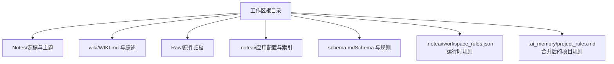
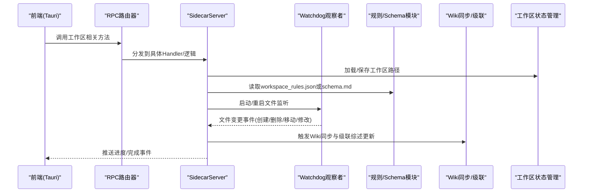
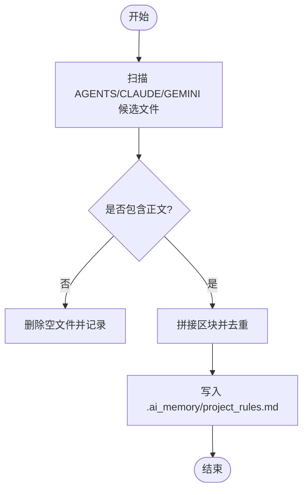
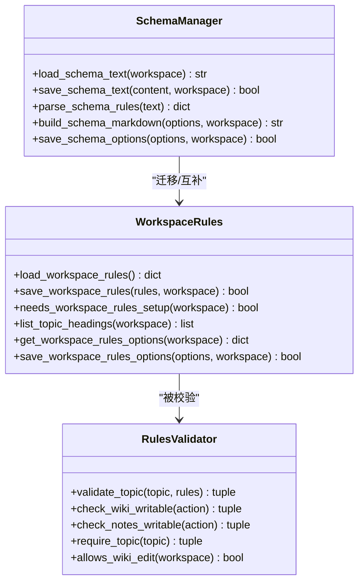
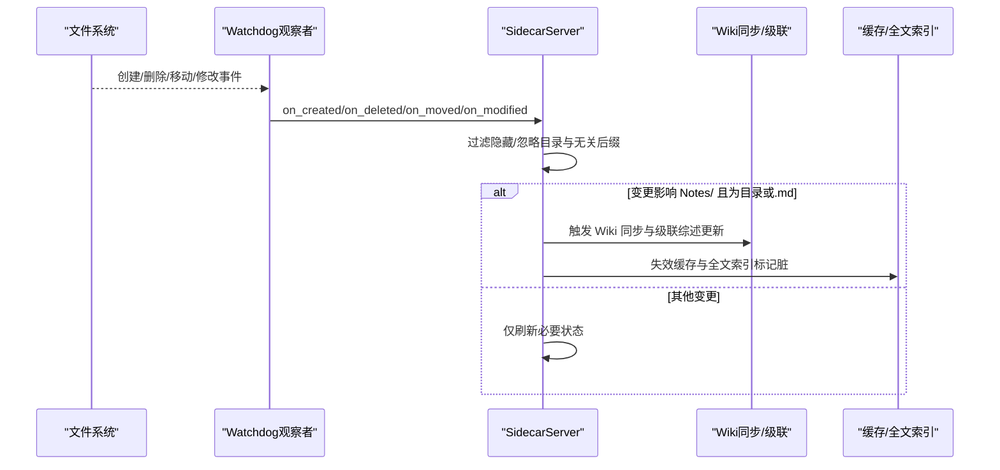
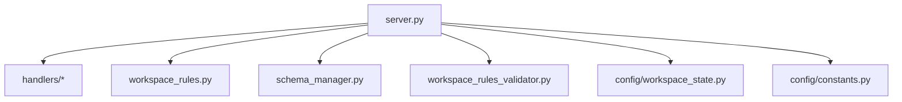

# 工作区管理系统

<cite>
**本文引用的文件**   
- [python/sidecar/server.py](file://python/sidecar/server.py)
- [python/sidecar/workspace_meta.py](file://python/sidecar/workspace_meta.py)
- [python/sidecar/workspace_rules.py](file://python/sidecar/workspace_rules.py)
- [python/sidecar/schema_manager.py](file://python/sidecar/schema_manager.py)
- [python/sidecar/schema_validator.py](file://python/sidecar/schema_validator.py)
- [python/sidecar/workspace_rules_validator.py](file://python/sidecar/workspace_rules_validator.py)
- [config/constants.py](file://config/constants.py)
- [config/settings.py](file://config/settings.py)
- [config/workspace_state.py](file://config/workspace_state.py)
- [python/sidecar/handlers/workspace_handler.py](file://python/sidecar/handlers/workspace_handler.py)
</cite>

## 目录
1. [简介](#简介)
2. [项目结构](#项目结构)
3. [核心组件](#核心组件)
4. [架构总览](#架构总览)
5. [详细组件分析](#详细组件分析)
6. [依赖关系分析](#依赖关系分析)
7. [性能与扩展性](#性能与扩展性)
8. [故障排查指南](#故障排查指南)
9. [结论](#结论)
10. [附录：初始化、配置与状态检查示例](#附录初始化配置与状态检查示例)

## 简介
本技术文档面向工作区管理子系统，系统性阐述以下方面：
- 工作区文件结构设计（Notes/、wiki/、Raw/、.noteai/ 等目录职责）
- 工作区元数据与规则管理（WorkspaceMeta 合并策略、schema.md 与 workspace_rules.json 的迁移与校验）
- 文件监控与同步机制（watchdog 监听器、变更检测算法、Wiki 同步与级联综述更新）
- 权限控制、备份恢复、迁移升级
- 工作区初始化、配置管理与状态检查的实际调用路径与流程

## 项目结构
工作区根目录约定如下：
- Notes/：源稿 Markdown 与主题文件夹（事实来源），按主题层级组织
- wiki/：WIKI.md、{主题}_综述.md、log.md 等知识库产物
- Raw/：原件归档（PDF/DOCX 等），不重复转换
- .noteai/：RAG、memory、日志与应用侧配置
- schema.md：工作区 Schema 说明与 AI 可写范围声明（向后兼容迁移到 JSON 规则）
- .ai_memory/project_rules.md：由 AGENTS/CLAUDE/GEMINI 等元文档合并生成的项目规则

图表来源
- [config/constants.py:26-33](file://config/constants.py#L26-L33)
- [python/sidecar/schema_manager.py:224-228](file://python/sidecar/schema_manager.py#L224-L228)
- [python/sidecar/workspace_meta.py:46-98](file://python/sidecar/workspace_meta.py#L46-L98)

章节来源
- [config/constants.py:26-33](file://config/constants.py#L26-L33)
- [python/sidecar/schema_manager.py:224-228](file://python/sidecar/schema_manager.py#L224-L228)

## 核心组件
- 工作区状态管理：持久化最近打开的工作区路径与版本信息，提供原子写入与备份恢复能力
- 工作区规则系统：支持从 legacy schema.md 迁移至 .noteai/workspace_rules.json，并提供运行时校验
- Schema 管理：维护 schema.md 模板、版本标记、配置项解析与生成
- 文件监控与同步：基于 watchdog 监听工作区变更，触发 Wiki 同步、级联综述更新与 RAG 索引重建提示
- 工作区处理器：暴露 RPC 路由，负责工作区树构建、健康检查、路径设置与清理

章节来源
- [config/workspace_state.py:15-198](file://config/workspace_state.py#L15-L198)
- [python/sidecar/workspace_rules.py:15-92](file://python/sidecar/workspace_rules.py#L15-L92)
- [python/sidecar/schema_manager.py:108-123](file://python/sidecar/schema_manager.py#L108-L123)
- [python/sidecar/server.py:298-400](file://python/sidecar/server.py#L298-L400)
- [python/sidecar/handlers/workspace_handler.py:34-106](file://python/sidecar/handlers/workspace_handler.py#L34-L106)

## 架构总览
整体采用“Tauri + Python Sidecar”模式。Sidecar 通过 JSON-RPC 响应前端请求，内部使用 watchdog 监听文件系统事件，驱动 Wiki 同步、级联综述更新与索引重建。

图表来源
- [python/sidecar/server.py:97-125](file://python/sidecar/server.py#L97-L125)
- [python/sidecar/server.py:298-400](file://python/sidecar/server.py#L298-L400)
- [python/sidecar/handlers/workspace_handler.py:34-106](file://python/sidecar/handlers/workspace_handler.py#L34-L106)
- [config/workspace_state.py:62-106](file://config/workspace_state.py#L62-L106)

## 详细组件分析

### 工作区文件结构与命名约定
- 目录职责
  - Notes/：Markdown 源稿与主题目录，作为“事实来源”，与 wiki/ 保持一致
  - wiki/：WIKI.md、{主题}_综述.md、log.md 等
  - Raw/：原件归档，避免重复转换
  - .noteai/：应用配置、RAG 索引、日志等
  - schema.md：工作区 Schema 与 AI 可写范围声明
  - .ai_memory/project_rules.md：由 AGENTS/CLAUDE/GEMINI 合并生成的项目规则
- 忽略目录与隐藏文件
  - 忽略 .noteai、.NoteAI、wiki、ai_wiki 等目录；以点开头的隐藏目录不参与处理

章节来源
- [config/constants.py:26-52](file://config/constants.py#L26-L52)
- [python/sidecar/schema_manager.py:224-228](file://python/sidecar/schema_manager.py#L224-L228)
- [python/sidecar/workspace_meta.py:46-98](file://python/sidecar/workspace_meta.py#L46-L98)

### 工作区元数据与规则管理（WorkspaceMeta 与 Schema）
- WorkspaceMeta 合并策略
  - 扫描工作区根与 Notes/ 下的 AGENTS.md、CLAUDE.md、GEMINI.md
  - 剥离 frontmatter 后，将内容合并入 .ai_memory/project_rules.md，并移除源文件
  - 若已存在对应区块则跳过，避免重复合并
- Schema 管理
  - 提供模板加载、版本标记注入、配置项解析与生成
  - 向后兼容：当检测到旧版 schema.md 时自动升级并追加标记
  - 导出 L1 主题列表、构建项目规则摘要供 LLM 使用
- 规则迁移
  - 首次加载时若存在 schema.md，则将其中的关键开关迁移为 .noteai/workspace_rules.json
  - 默认值与边界约束在保存时进行归一化（如深度限制、布尔类型）

图表来源
- [python/sidecar/workspace_meta.py:46-98](file://python/sidecar/workspace_meta.py#L46-L98)

章节来源
- [python/sidecar/workspace_meta.py:15-121](file://python/sidecar/workspace_meta.py#L15-L121)
- [python/sidecar/schema_manager.py:108-123](file://python/sidecar/schema_manager.py#L108-L123)
- [python/sidecar/schema_manager.py:207-285](file://python/sidecar/schema_manager.py#L207-L285)
- [python/sidecar/workspace_rules.py:32-92](file://python/sidecar/workspace_rules.py#L32-L92)

### 工作区规则系统（schema.md 与 workspace_rules.json）
- 配置语法与字段
  - ai_may_edit_wiki：是否允许 AI 编辑 wiki
  - ai_may_edit_notes：是否允许 AI 编辑 Notes 正文
  - max_topic_depth：最大主题层级（上限 3）
  - auto_update_survey：是否自动更新综述
  - survey_at_level：综述粒度（一级或二级）
- 验证机制
  - 主题合法性：禁止非法字符、越界层级、禁用叶子节点名称（其他/杂项/未分类等）
  - 可写性检查：根据规则判断是否允许对 wiki/notes 执行写入
  - 就绪性检查：确保已完成工作区规则配置

图表来源
- [python/sidecar/workspace_rules.py:59-92](file://python/sidecar/workspace_rules.py#L59-L92)
- [python/sidecar/schema_manager.py:144-177](file://python/sidecar/schema_manager.py#L144-L177)
- [python/sidecar/workspace_rules_validator.py:29-94](file://python/sidecar/workspace_rules_validator.py#L29-L94)

章节来源
- [python/sidecar/workspace_rules.py:15-92](file://python/sidecar/workspace_rules.py#L15-L92)
- [python/sidecar/workspace_rules_validator.py:21-94](file://python/sidecar/workspace_rules_validator.py#L21-L94)
- [python/sidecar/schema_manager.py:144-177](file://python/sidecar/schema_manager.py#L144-L177)

### 文件监控与同步机制
- 监听器
  - 使用 watchdog.Observer 递归监听工作区根目录
  - 过滤隐藏目录与忽略目录，仅关注 Notes/ 下 .md 等受控后缀
- 变更检测算法
  - 相对路径计算与忽略判定
  - 区分目录与文件变更，仅对 Notes/ 下的目录/Markdown 变更触发 Wiki 同步
- 同步与冲突解决
  - 启动阶段：合并元文档、同步主题、修复坏链、按需同步 WIKI.md
  - 运行期：变更事件触发 Wiki 同步与级联综述更新，必要时提示 RAG 索引需重建
  - 冲突策略：优先以 Notes/ 为事实来源，保持 wiki/ 与其一致；对重复合并内容进行去重

图表来源
- [python/sidecar/server.py:298-400](file://python/sidecar/server.py#L298-L400)
- [python/sidecar/server.py:340-356](file://python/sidecar/server.py#L340-L356)

章节来源
- [python/sidecar/server.py:298-400](file://python/sidecar/server.py#L298-L400)
- [python/sidecar/server.py:340-356](file://python/sidecar/server.py#L340-L356)

### 权限控制、备份恢复与迁移升级
- 权限控制
  - 通过规则系统控制 AI 对 wiki/notes 的可写范围
  - 主题校验拒绝非法路径字符与越界层级，禁止“其他/杂项/未分类”类叶子节点
- 备份恢复
  - 工作区状态文件采用原子写入：先写临时文件，再 fsync，最后 move 覆盖
  - 失败时回退到 .json.bak 备份；清除状态时也保留备份
- 迁移升级
  - 首次加载时从 schema.md 迁移到 workspace_rules.json
  - schema.md 版本标记与“已配置”标记自动补全

章节来源
- [python/sidecar/workspace_rules_validator.py:29-94](file://python/sidecar/workspace_rules_validator.py#L29-L94)
- [config/workspace_state.py:26-61](file://config/workspace_state.py#L26-L61)
- [config/workspace_state.py:108-126](file://config/workspace_state.py#L108-L126)
- [python/sidecar/workspace_rules.py:32-76](file://python/sidecar/workspace_rules.py#L32-L76)
- [python/sidecar/schema_manager.py:85-92](file://python/sidecar/schema_manager.py#L85-L92)

### 工作区处理器（RPC 路由）
- 主要接口
  - get_workspace_status：返回当前工作区状态、是否需要规则配置
  - check_workspace_path_valid：校验路径有效性
  - clear_saved_workspace：清除已保存的工作区状态
  - set_workspace_path：设置工作区路径并持久化
  - get_workspace_tree：构建工作区树（扁平/递归两种模式）
  - on_file_selected：解析用户选择的路径
  - refresh_log / get_kb_health：刷新日志与健康检查

章节来源
- [python/sidecar/handlers/workspace_handler.py:34-106](file://python/sidecar/handlers/workspace_handler.py#L34-L106)
- [python/sidecar/handlers/workspace_handler.py:107-260](file://python/sidecar/handlers/workspace_handler.py#L107-L260)

## 依赖关系分析
- 模块耦合
  - server.py 聚合各 Handler 与工具模块，并通过 RpcRouter 注册路由
  - workspace_rules.py 与 schema_manager.py 共同维护规则与 Schema，前者承担运行时校验与迁移
  - workspace_rules_validator.py 提供运行时强校验（主题、可写性）
  - config.workspace_state.py 提供跨进程的状态持久化与恢复
- 外部依赖
  - watchdog：文件系统事件监听
  - json：规则与状态序列化
  - pathlib：路径操作与相对路径计算

图表来源
- [python/sidecar/server.py:97-125](file://python/sidecar/server.py#L97-L125)
- [python/sidecar/handlers/workspace_handler.py:34-106](file://python/sidecar/handlers/workspace_handler.py#L34-L106)
- [python/sidecar/workspace_rules.py:59-92](file://python/sidecar/workspace_rules.py#L59-L92)
- [python/sidecar/schema_manager.py:108-123](file://python/sidecar/schema_manager.py#L108-L123)
- [python/sidecar/workspace_rules_validator.py:29-94](file://python/sidecar/workspace_rules_validator.py#L29-L94)
- [config/workspace_state.py:62-106](file://config/workspace_state.py#L62-L106)
- [config/constants.py:26-52](file://config/constants.py#L26-L52)

章节来源
- [python/sidecar/server.py:97-125](file://python/sidecar/server.py#L97-L125)
- [python/sidecar/handlers/workspace_handler.py:34-106](file://python/sidecar/handlers/workspace_handler.py#L34-L106)
- [python/sidecar/workspace_rules.py:59-92](file://python/sidecar/workspace_rules.py#L59-L92)
- [python/sidecar/schema_manager.py:108-123](file://python/sidecar/schema_manager.py#L108-L123)
- [python/sidecar/workspace_rules_validator.py:29-94](file://python/sidecar/workspace_rules_validator.py#L29-L94)
- [config/workspace_state.py:62-106](file://config/workspace_state.py#L62-L106)
- [config/constants.py:26-52](file://config/constants.py#L26-L52)

## 性能与扩展性
- 变更节流与缓存
  - 使用 TTL 缓存与全局缓存失效策略，减少重复计算
  - 全文索引与 RAG 查询缓存随文件变更标记脏或清空
- 递归深度限制
  - 工作区树构建限制最大深度，避免大工作区阻塞
- 后台任务
  - 启动巡检、RAG 索引重建等异步任务，避免阻塞主线程
- 可扩展点
  - 新增监听后缀或忽略目录可在常量与过滤器中集中配置
  - 规则系统可通过 workspace_rules.json 灵活调整行为

[本节为通用指导，无需源码引用]

## 故障排查指南
- 工作区状态异常
  - 现象：无法加载上次工作区或路径无效
  - 处理：检查 .json.bak 是否存在并尝试恢复；确认工作区路径有效
- 规则未配置
  - 现象：提示需要完成工作区规则配置
  - 处理：通过设置向导完成 schema.md 或 workspace_rules.json 配置
- 权限问题
  - 现象：保存状态失败或无写入权限
  - 处理：检查工作区与应用数据目录的读写权限
- 文件监听失效
  - 现象：文件变更未触发同步
  - 处理：确认未被忽略目录或隐藏目录；检查 Notes/ 下是否为受控后缀

章节来源
- [config/workspace_state.py:87-126](file://config/workspace_state.py#L87-L126)
- [python/sidecar/server.py:298-339](file://python/sidecar/server.py#L298-L339)
- [python/sidecar/handlers/workspace_handler.py:72-106](file://python/sidecar/handlers/workspace_handler.py#L72-L106)

## 结论
本工作区管理系统以 Notes/ 为事实来源，结合 schema.md 与 workspace_rules.json 实现灵活的规则与权限控制；通过 watchdog 监听与级联同步机制，保障 wiki/ 与 Notes/ 的一致性；配合原子写入与备份恢复，提升可靠性与可维护性。

[本节为总结，无需源码引用]

## 附录：初始化、配置与状态检查示例
以下为实际调用路径与流程说明（不包含代码片段，仅提供路径参考）：

- 初始化工作区
  - 设置工作区路径并持久化：[set_workspace_path:85-106](file://python/sidecar/handlers/workspace_handler.py#L85-L106)
  - 启动文件监听与启动同步：[start/_startup_sync:97-125](file://python/sidecar/server.py#L97-L125), [startup_sync:221-255](file://python/sidecar/server.py#L221-L255)
- 配置管理
  - 读取/保存工作区规则：[load_workspace_rules/save_workspace_rules:59-92](file://python/sidecar/workspace_rules.py#L59-L92)
  - 读取/保存 Schema 文本与选项：[load_schema_text/save_schema_text:108-123](file://python/sidecar/schema_manager.py#L108-L123), [save_schema_options:275-285](file://python/sidecar/schema_manager.py#L275-L285)
- 状态检查
  - 获取工作区状态与树：[get_workspace_status/get_workspace_tree:50-108](file://python/sidecar/handlers/workspace_handler.py#L50-L108)
  - 校验工作区路径有效性：[check_workspace_path_valid:72-76](file://python/sidecar/handlers/workspace_handler.py#L72-L76)
  - 清理已保存工作区：[clear_saved_workspace:78-84](file://python/sidecar/handlers/workspace_handler.py#L78-L84)
- 权限与规则校验
  - 主题校验与可写性检查：[validate_topic/check_wiki_writable/check_notes_writable:29-94](file://python/sidecar/workspace_rules_validator.py#L29-L94)
  - 规则就绪性检查：[needs_workspace_rules_setup:95-96](file://python/sidecar/workspace_rules.py#L95-L96)

章节来源
- [python/sidecar/handlers/workspace_handler.py:50-106](file://python/sidecar/handlers/workspace_handler.py#L50-L106)
- [python/sidecar/server.py:97-125](file://python/sidecar/server.py#L97-L125)
- [python/sidecar/server.py:221-255](file://python/sidecar/server.py#L221-L255)
- [python/sidecar/workspace_rules.py:59-96](file://python/sidecar/workspace_rules.py#L59-L96)
- [python/sidecar/schema_manager.py:108-123](file://python/sidecar/schema_manager.py#L108-L123)
- [python/sidecar/schema_manager.py:275-285](file://python/sidecar/schema_manager.py#L275-L285)
- [python/sidecar/workspace_rules_validator.py:29-94](file://python/sidecar/workspace_rules_validator.py#L29-L94)