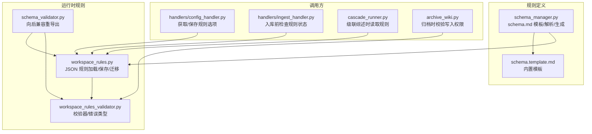
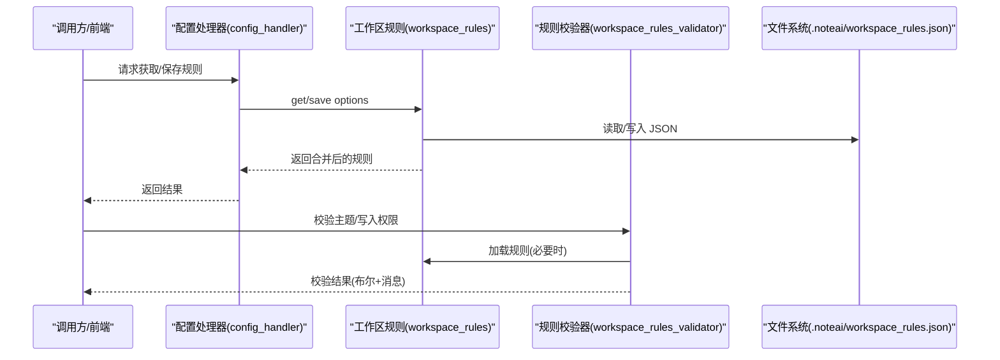
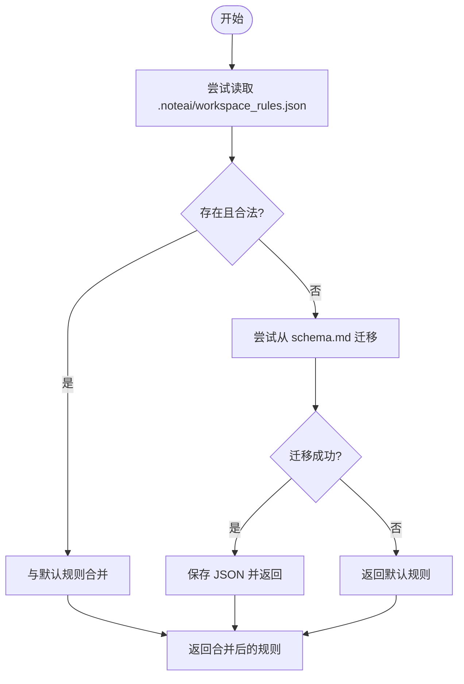
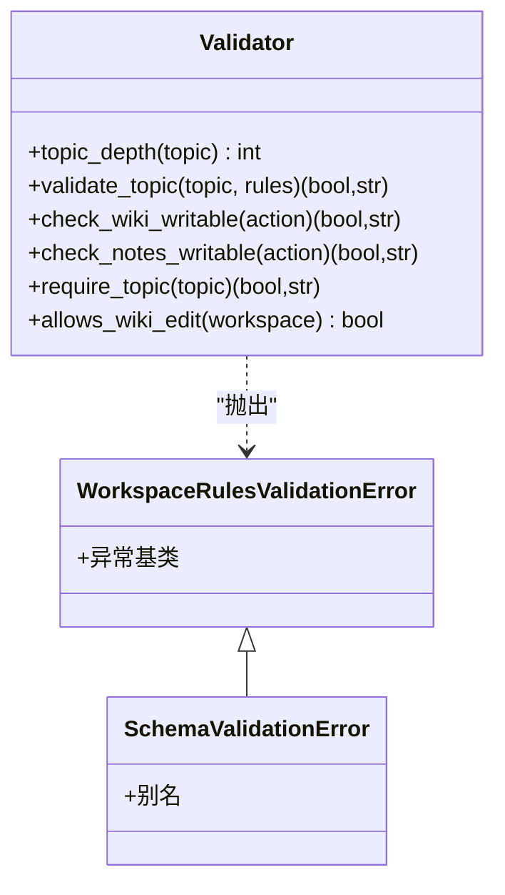
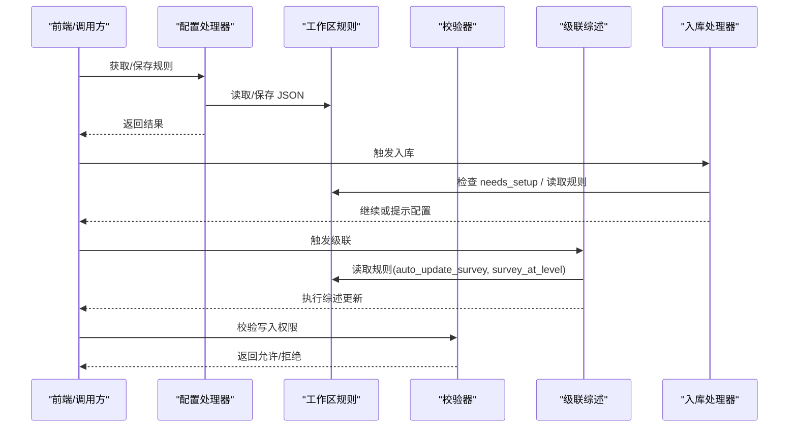
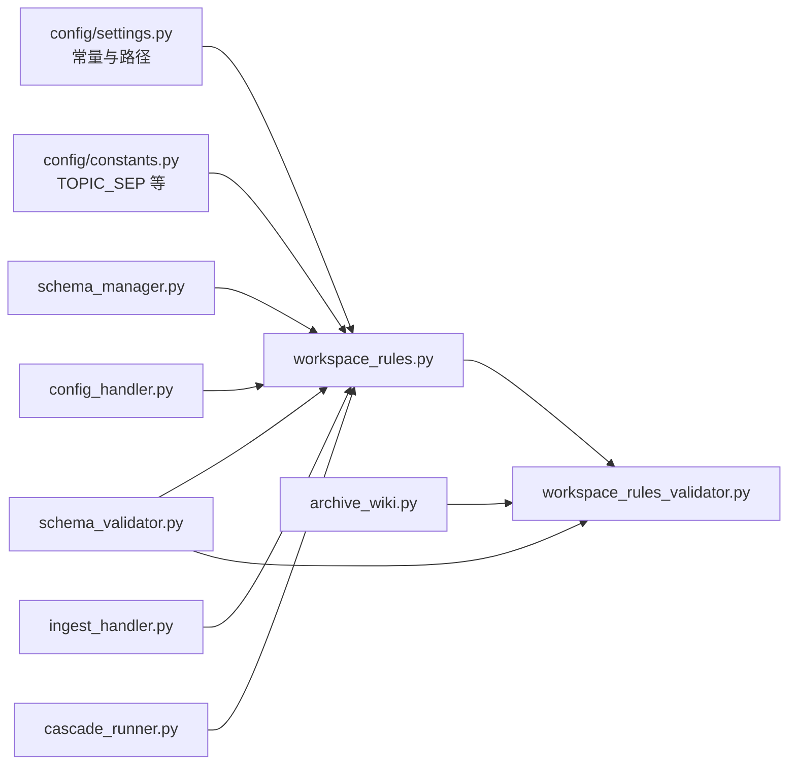

# 工作区规则系统

<cite>
**本文引用的文件**
- [schema_manager.py](file://python/sidecar/schema_manager.py)
- [workspace_rules.py](file://python/sidecar/workspace_rules.py)
- [workspace_rules_validator.py](file://python/sidecar/workspace_rules_validator.py)
- [schema_validator.py](file://python/sidecar/schema_validator.py)
- [config_handler.py](file://python/sidecar/handlers/config_handler.py)
- [ingest_handler.py](file://python/sidecar/handlers/ingest_handler.py)
- [cascade_runner.py](file://python/sidecar/cascade_runner.py)
- [archive_wiki.py](file://python/sidecar/archive_wiki.py)
- [settings.py](file://config/settings.py)
- [schema.template.md](file://docs/schema.template.md)
- [test_workspace_rules.py](file://tests/unit/test_workspace_rules.py)
- [test_schema_validator.py](file://tests/unit/test_schema_validator.py)
- [workspace_rules_helpers.py](file://tests/workspace_rules_helpers.py)
</cite>

## 目录
1. [简介](#简介)
2. [项目结构](#项目结构)
3. [核心组件](#核心组件)
4. [架构总览](#架构总览)
5. [详细组件分析](#详细组件分析)
6. [依赖关系分析](#依赖关系分析)
7. [性能与缓存](#性能与缓存)
8. [故障排查指南](#故障排查指南)
9. [结论](#结论)
10. [附录：配置示例与最佳实践](#附录配置示例与最佳实践)

## 简介
本技术文档围绕“工作区规则系统”展开，聚焦以下目标：
- 解释 schema.md 的配置语法与语法规则（字段、验证、默认值）
- 说明规则验证器的实现机制（语法检查、语义验证、错误报告）
- 描述规则的加载、迁移、保存与热重载路径
- 提供自定义规则与扩展点的开发方法
- 给出完整的配置示例与最佳实践
- 汇总常见配置错误的诊断与解决方法

该系统由两部分组成：
- 面向人类可读的“工作区宪法”：schema.md（Markdown），定义目录结构、主题体系、AI 可写范围等
- 面向机器可读的“运行时规则”：.noteai/workspace_rules.json（JSON），承载校验与行为开关

两者通过迁移与合并策略保持一致，并在入库、级联综述、归档等关键流程中执行校验。

## 项目结构
下图展示与工作区规则相关的核心模块与交互关系。

图表来源
- [schema_manager.py:1-307](file://python/sidecar/schema_manager.py#L1-L307)
- [workspace_rules.py:1-200](file://python/sidecar/workspace_rules.py#L1-L200)
- [workspace_rules_validator.py:1-94](file://python/sidecar/workspace_rules_validator.py#L1-L94)
- [schema_validator.py:1-15](file://python/sidecar/schema_validator.py#L1-L15)
- [config_handler.py:260-286](file://python/sidecar/handlers/config_handler.py#L260-L286)
- [ingest_handler.py:22-26](file://python/sidecar/handlers/ingest_handler.py#L22-L26)
- [cascade_runner.py:19-20](file://python/sidecar/cascade_runner.py#L19-L20)
- [archive_wiki.py:11](file://python/sidecar/archive_wiki.py#L11)

章节来源
- [schema_manager.py:1-307](file://python/sidecar/schema_manager.py#L1-L307)
- [workspace_rules.py:1-200](file://python/sidecar/workspace_rules.py#L1-L200)
- [workspace_rules_validator.py:1-94](file://python/sidecar/workspace_rules_validator.py#L1-L94)
- [schema_validator.py:1-15](file://python/sidecar/schema_validator.py#L1-L15)
- [config_handler.py:260-286](file://python/sidecar/handlers/config_handler.py#L260-L286)
- [ingest_handler.py:22-26](file://python/sidecar/handlers/ingest_handler.py#L22-L26)
- [cascade_runner.py:19-20](file://python/sidecar/cascade_runner.py#L19-L20)
- [archive_wiki.py:11](file://python/sidecar/archive_wiki.py#L11)

## 核心组件
- schema.md 管理（schema_manager.py）
  - 负责内置模板加载、版本标记注入、是否需要初始化、文本保存、从 schema.md 提取轻量规则、构建 Markdown 文档片段等
- 运行时规则（workspace_rules.py）
  - 负责 .noteai/workspace_rules.json 的加载、保存、默认值合并、从旧 schema.md 的一次性迁移、一级主题列表、综述粒度计算等
- 规则校验器（workspace_rules_validator.py）
  - 提供主题深度、非法字符、禁止叶子节点、Wiki/Notes 写入权限等运行时校验
- 向后兼容层（schema_validator.py）
  - 将旧的 schema_validator 接口重导出到新的 workspace_rules 与 workspace_rules_validator，保证历史调用不变
- 处理器集成（config_handler.py, ingest_handler.py, cascade_runner.py, archive_wiki.py）
  - 在 UI 设置、入库流水线、级联综述、归档等入口处读取/保存规则并执行校验

章节来源
- [schema_manager.py:1-307](file://python/sidecar/schema_manager.py#L1-L307)
- [workspace_rules.py:1-200](file://python/sidecar/workspace_rules.py#L1-L200)
- [workspace_rules_validator.py:1-94](file://python/sidecar/workspace_rules_validator.py#L1-L94)
- [schema_validator.py:1-15](file://python/sidecar/schema_validator.py#L1-L15)
- [config_handler.py:260-286](file://python/sidecar/handlers/config_handler.py#L260-L286)
- [ingest_handler.py:22-26](file://python/sidecar/handlers/ingest_handler.py#L22-L26)
- [cascade_runner.py:19-20](file://python/sidecar/cascade_runner.py#L19-L20)
- [archive_wiki.py:11](file://python/sidecar/archive_wiki.py#L11)

## 架构总览
下图展示了“用户/外部调用者 → 处理器 → 规则加载/校验 → 文件系统”的端到端流程。

图表来源
- [config_handler.py:260-286](file://python/sidecar/handlers/config_handler.py#L260-L286)
- [workspace_rules.py:59-96](file://python/sidecar/workspace_rules.py#L59-L96)
- [workspace_rules_validator.py:34-94](file://python/sidecar/workspace_rules_validator.py#L34-L94)

## 详细组件分析

### schema.md 配置语法与语法规则
- 文件位置与命名
  - 工作区根目录下的 schema.md；若不存在或未完成配置，系统会提示初始化或使用内置模板
- 版本与配置标记
  - 版本标记用于检测是否需要升级模板
  - 配置完成标记用于判断是否已完成工作区规则设置
- 机器可读字段（YAML 块）
  - ai_may_edit_wiki：允许 AI 编辑 wiki 综述与索引
  - ai_may_edit_notes：允许 AI 修改 Notes 正文
  - max_topic_depth：最大主题层级（1～3）
  - auto_update_survey：是否自动更新综述
  - survey_at_level：综述聚合层级（1 或 2）
- 解析与默认值
  - 使用正则匹配上述字段，缺失时采用默认值
  - 对数值型字段进行边界钳制（如 max_topic_depth 限制在 1～3）
- 生成与持久化
  - 支持根据选项生成完整 Markdown 内容，并追加版本/配置标记
  - 同时生成 .ai_memory/project_rules.md 以同步一级主题

章节来源
- [schema_manager.py:144-177](file://python/sidecar/schema_manager.py#L144-L177)
- [schema_manager.py:207-286](file://python/sidecar/schema_manager.py#L207-L286)
- [schema.template.md:152-168](file://docs/schema.template.md#L152-L168)

### 运行时规则（JSON）加载、迁移与保存
- 存储位置
  - 工作区应用目录 .noteai/workspace_rules.json
- 默认值与合并策略
  - 加载时与默认规则合并，确保所有键存在且类型正确
- 从旧 schema.md 的一次性迁移
  - 若发现旧 schema.md，则按相同字段解析并迁移为 JSON，随后删除旧源（可选）
- 保存时的规范化
  - 对数值与布尔字段进行规范化与边界约束
- 配置就绪判定
  - configured 标志位决定是否需要引导用户完成设置

图表来源
- [workspace_rules.py:59-96](file://python/sidecar/workspace_rules.py#L59-L96)
- [workspace_rules.py:32-56](file://python/sidecar/workspace_rules.py#L32-L56)
- [workspace_rules.py:79-92](file://python/sidecar/workspace_rules.py#L79-L92)

章节来源
- [workspace_rules.py:15-22](file://python/sidecar/workspace_rules.py#L15-L22)
- [workspace_rules.py:59-96](file://python/sidecar/workspace_rules.py#L59-L96)
- [workspace_rules.py:79-92](file://python/sidecar/workspace_rules.py#L79-L92)

### 规则验证器（语法与语义校验）
- 主题合法性
  - 非空检查
  - 非法路径字符检查（包含点号、反斜杠、控制字符等）
  - 层级深度不超过 max_topic_depth
  - 禁止叶子节点为“其他/杂项/未分类”等
- 写入权限
  - check_wiki_writable：依据 ai_may_edit_wiki 决定是否允许改写 wiki
  - check_notes_writable：依据 ai_may_edit_notes 决定是否允许改写 Notes 正文
- 组合校验
  - require_topic：先检查是否已配置规则，再校验主题
- 错误类型
  - WorkspaceRulesValidationError 及其别名 SchemaValidationError

图表来源
- [workspace_rules_validator.py:21-27](file://python/sidecar/workspace_rules_validator.py#L21-L27)
- [workspace_rules_validator.py:29-94](file://python/sidecar/workspace_rules_validator.py#L29-L94)

章节来源
- [workspace_rules_validator.py:21-94](file://python/sidecar/workspace_rules_validator.py#L21-L94)

### 向后兼容层（schema_validator）
- 作用
  - 将旧的 schema_validator 接口重导出到新实现，保持历史调用稳定
- 映射关系
  - load_workspace_rules → parse_schema_rules
  - needs_workspace_rules_setup → needs_schema_setup
  - 校验函数与异常类型均指向新实现

章节来源
- [schema_validator.py:1-15](file://python/sidecar/schema_validator.py#L1-L15)

### 处理器集成与调用链
- 配置处理器（config_handler.py）
  - 暴露获取/保存工作区规则选项的 RPC 接口
  - 保存时将 configured 置为 True
- 入库处理器（ingest_handler.py）
  - 在入库前检查是否需要完成规则设置
  - 读取当前规则与选项，驱动后续流程
- 级联综述（cascade_runner.py）
  - 读取规则以确定是否自动更新综述及综述粒度
- 归档（archive_wiki.py）
  - 在执行归档操作前校验 Wiki/Notes 写入权限

图表来源
- [config_handler.py:260-286](file://python/sidecar/handlers/config_handler.py#L260-L286)
- [ingest_handler.py:108-118](file://python/sidecar/handlers/ingest_handler.py#L108-L118)
- [cascade_runner.py:82](file://python/sidecar/cascade_runner.py#L82)
- [archive_wiki.py:11](file://python/sidecar/archive_wiki.py#L11)

章节来源
- [config_handler.py:260-286](file://python/sidecar/handlers/config_handler.py#L260-L286)
- [ingest_handler.py:108-118](file://python/sidecar/handlers/ingest_handler.py#L108-L118)
- [cascade_runner.py:82](file://python/sidecar/cascade_runner.py#L82)
- [archive_wiki.py:11](file://python/sidecar/archive_wiki.py#L11)

## 依赖关系分析
- 模块耦合
  - schema_manager 与 workspace_rules 解耦：前者处理 schema.md 文本与模板，后者处理 JSON 规则与迁移
  - workspace_rules_validator 仅依赖 workspace_rules 的加载能力，不直接读写文件
  - 处理器通过导入相应模块访问规则与校验能力
- 外部依赖
  - config.settings 提供工作区路径与应用目录常量
  - config.constants 提供主题分隔符等常量

图表来源
- [settings.py:1-41](file://config/settings.py#L1-L41)
- [workspace_rules.py:1-200](file://python/sidecar/workspace_rules.py#L1-L200)
- [workspace_rules_validator.py:1-94](file://python/sidecar/workspace_rules_validator.py#L1-L94)
- [schema_manager.py:1-307](file://python/sidecar/schema_manager.py#L1-L307)
- [schema_validator.py:1-15](file://python/sidecar/schema_validator.py#L1-L15)
- [config_handler.py:260-286](file://python/sidecar/handlers/config_handler.py#L260-L286)
- [ingest_handler.py:22-26](file://python/sidecar/handlers/ingest_handler.py#L22-L26)
- [cascade_runner.py:19-20](file://python/sidecar/cascade_runner.py#L19-L20)
- [archive_wiki.py:11](file://python/sidecar/archive_wiki.py#L11)

章节来源
- [settings.py:1-41](file://config/settings.py#L1-L41)
- [workspace_rules.py:1-200](file://python/sidecar/workspace_rules.py#L1-L200)
- [workspace_rules_validator.py:1-94](file://python/sidecar/workspace_rules_validator.py#L1-L94)
- [schema_manager.py:1-307](file://python/sidecar/schema_manager.py#L1-L307)
- [schema_validator.py:1-15](file://python/sidecar/schema_validator.py#L1-L15)
- [config_handler.py:260-286](file://python/sidecar/handlers/config_handler.py#L260-L286)
- [ingest_handler.py:22-26](file://python/sidecar/handlers/ingest_handler.py#L22-L26)
- [cascade_runner.py:19-20](file://python/sidecar/cascade_runner.py#L19-L20)
- [archive_wiki.py:11](file://python/sidecar/archive_wiki.py#L11)

## 性能与缓存
- 磁盘 I/O
  - 规则加载/保存均为本地 JSON 读写，开销较小
  - schema.md 解析基于正则，文本规模有限，性能影响可忽略
- 缓存建议
  - 可在上层服务中对规则对象进行进程内缓存（例如 TTL 缓存），减少频繁磁盘访问
  - 当检测到工作区变更事件时，主动失效缓存并重新加载
- 迁移成本
  - 从 schema.md 迁移仅在首次发现旧文件时发生，之后不再重复

[本节为通用指导，无需列出具体文件来源]

## 故障排查指南
- 常见问题与定位
  - 未配置工作区规则
    - 现象：需要设置提示
    - 定位：needs_workspace_rules_setup 返回 True
    - 解决：通过配置处理器保存规则选项，确保 configured=True
  - 主题层级超限
    - 现象：validate_topic 返回失败，提示超过最大层级
    - 定位：max_topic_depth 过小或主题过深
    - 解决：调整 max_topic_depth 或精简主题路径
  - 禁止叶子节点
    - 现象：叶子节点为“其他/杂项/未分类”等被拒绝
    - 解决：更换为更具体的主题名
  - 非法路径字符
    - 现象：主题名称包含非法字符
    - 解决：移除非法字符，避免使用路径分隔符与控制字符
  - 写入权限不足
    - 现象：check_wiki_writable/check_notes_writable 返回拒绝
    - 定位：ai_may_edit_wiki 或 ai_may_edit_notes 为 False
    - 解决：在规则中开启对应权限或人工确认后再执行

- 测试辅助
  - 单元测试覆盖规则加载、保存、迁移、主题校验、写入权限等场景
  - 测试工具提供便捷写入 workspace_rules.json 的方法

章节来源
- [test_workspace_rules.py:44-90](file://tests/unit/test_workspace_rules.py#L44-L90)
- [test_schema_validator.py:10-64](file://tests/unit/test_schema_validator.py#L10-L64)
- [workspace_rules_helpers.py:13-27](file://tests/workspace_rules_helpers.py#L13-L27)

## 结论
工作区规则系统通过“人类可读的 schema.md + 机器可读的 workspace_rules.json”双轨设计，既保证了可维护性与可解释性，又提供了严格的运行时校验与可扩展的集成点。迁移机制确保了平滑过渡，处理器集成使规则贯穿入库、级联、归档等关键环节。遵循本文的最佳实践与排障指引，可有效降低配置错误风险，提升知识库组织的一致性与自动化效率。

[本节为总结性内容，无需列出具体文件来源]

## 附录：配置示例与最佳实践

### schema.md 字段速查
- ai_may_edit_wiki：true/false
- ai_may_edit_notes：true/false
- max_topic_depth：1～3
- auto_update_survey：true/false
- survey_at_level：1～2

章节来源
- [schema_manager.py:144-177](file://python/sidecar/schema_manager.py#L144-L177)
- [schema.template.md:152-168](file://docs/schema.template.md#L152-L168)

### workspace_rules.json 字段速查
- max_topic_depth：1～3
- auto_update_survey：true/false
- survey_at_level：1～2
- ai_may_edit_wiki：true/false
- ai_may_edit_notes：true/false
- configured：true/false

章节来源
- [workspace_rules.py:15-22](file://python/sidecar/workspace_rules.py#L15-L22)
- [workspace_rules.py:79-92](file://python/sidecar/workspace_rules.py#L79-L92)

### 最佳实践
- 优先使用 Notes/ 文件夹作为主题事实来源，保持 WIKI 与文件夹一致
- 谨慎开启 ai_may_edit_notes，默认关闭更安全
- 合理设置 max_topic_depth，避免过深导致检索与维护困难
- 使用 survey_at_level=2 以二级主题为综述粒度，兼顾覆盖面与增量更新效率
- 定期审查 project_rules.md，补充领域细则与禁止清单

[本节为通用指导，无需列出具体文件来源]