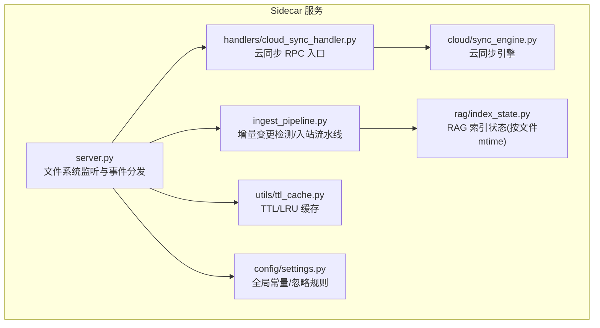
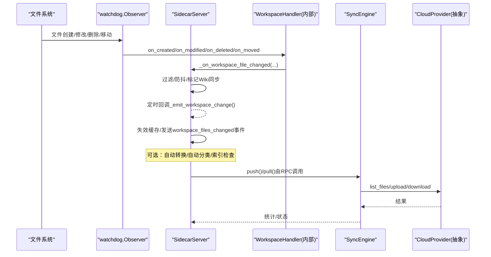
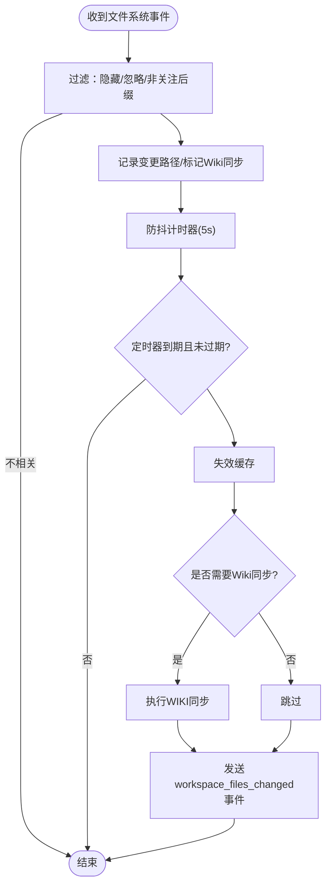
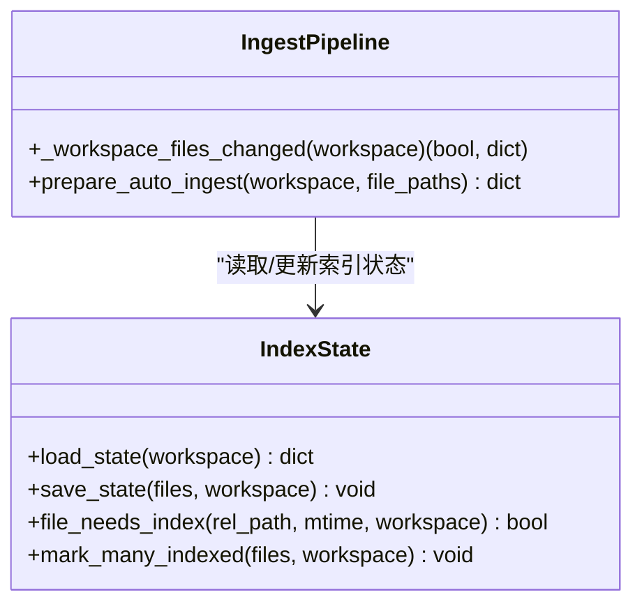
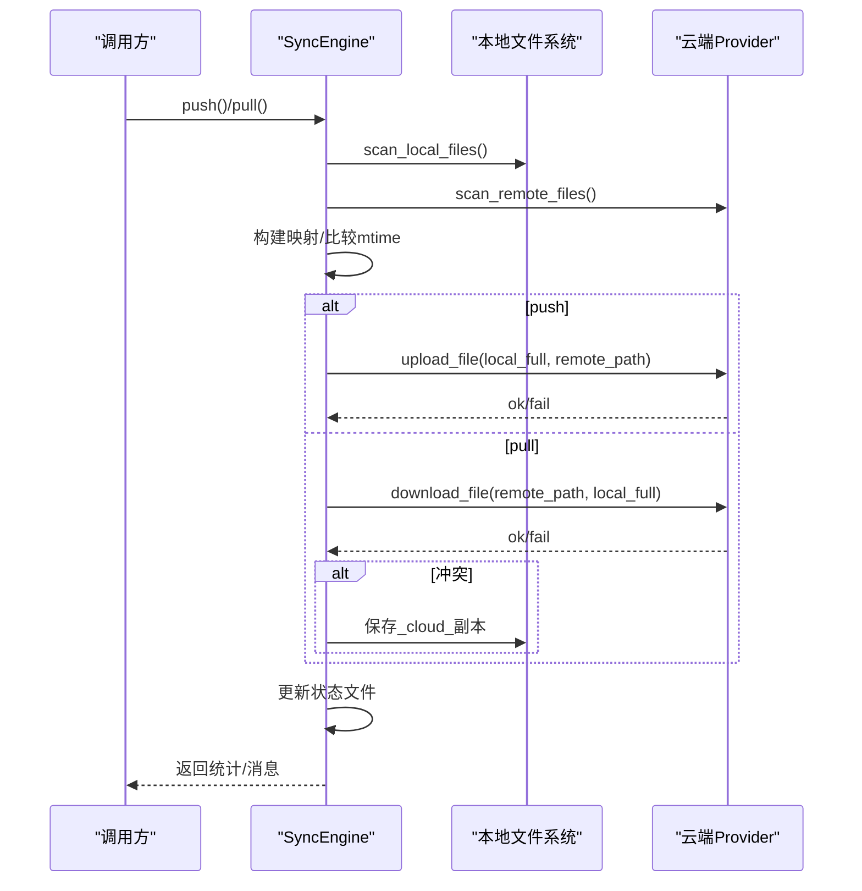
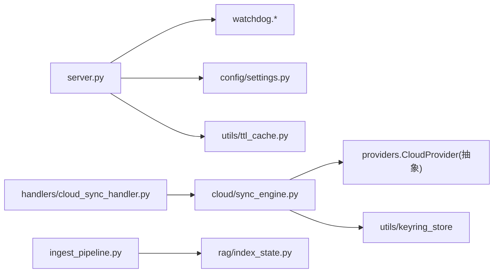

# 文件监控与同步

<cite>
**本文引用的文件**   
- [server.py](file://python/sidecar/server.py)
- [cloud_sync_handler.py](file://python/sidecar/handlers/cloud_sync_handler.py)
- [sync_engine.py](file://python/sidecar/cloud/sync_engine.py)
- [ingest_pipeline.py](file://python/sidecar/ingest_pipeline.py)
- [index_state.py](file://python/sidecar/rag/index_state.py)
- [ttl_cache.py](file://utils/ttl_cache.py)
- [settings.py](file://config/settings.py)
</cite>

## 目录
1. [简介](#简介)
2. [项目结构](#项目结构)
3. [核心组件](#核心组件)
4. [架构总览](#架构总览)
5. [详细组件分析](#详细组件分析)
6. [依赖关系分析](#依赖关系分析)
7. [性能考量](#性能考量)
8. [故障排查指南](#故障排查指南)
9. [结论](#结论)
10. [附录：配置与调优示例](#附录配置与调优示例)

## 简介
本技术文档聚焦于工作区文件监控与同步系统，围绕基于 watchdog 的文件系统监听器实现、事件捕获与过滤分发机制、变更检测算法（增量同步、冲突识别、版本比较）、同步策略（双向/单向/选择性）以及性能优化（批量处理、去重、内存管理）进行系统化说明。同时提供监控配置与同步调优的实际示例路径，并给出常见问题排查建议。

## 项目结构
与“文件监控与同步”相关的核心代码主要分布在 sidecar 服务进程内，包括：
- 文件系统监听与事件分发：sidecar.server
- 云同步入口与引擎：handlers.cloud_sync_handler、cloud.sync_engine
- 增量变更检测与索引状态：sidecar.ingest_pipeline、sidecar.rag.index_state
- 通用缓存与设置常量：utils.ttl_cache、config.settings

图示来源
- [server.py:298-339](file://python/sidecar/server.py#L298-L339)
- [cloud_sync_handler.py:12-22](file://python/sidecar/handlers/cloud_sync_handler.py#L12-L22)
- [sync_engine.py:37-163](file://python/sidecar/cloud/sync_engine.py#L37-L163)
- [ingest_pipeline.py:93-104](file://python/sidecar/ingest_pipeline.py#L93-L104)
- [index_state.py:75-91](file://python/sidecar/rag/index_state.py#L75-L91)
- [ttl_cache.py:8-46](file://utils/ttl_cache.py#L8-L46)
- [settings.py:1-41](file://config/settings.py#L1-L41)

章节来源
- [server.py:298-339](file://python/sidecar/server.py#L298-L339)
- [cloud_sync_handler.py:12-22](file://python/sidecar/handlers/cloud_sync_handler.py#L12-L22)
- [sync_engine.py:37-163](file://python/sidecar/cloud/sync_engine.py#L37-L163)
- [ingest_pipeline.py:93-104](file://python/sidecar/ingest_pipeline.py#L93-L104)
- [index_state.py:75-91](file://python/sidecar/rag/index_state.py#L75-L91)
- [ttl_cache.py:8-46](file://utils/ttl_cache.py#L8-L46)
- [settings.py:1-41](file://config/settings.py#L1-L41)

## 核心组件
- 文件系统监听器（watchdog）
  - 通过 Observer 注册工作区根目录的递归监听，内部定义 WorkspaceHandler 捕获创建、删除、移动、修改等事件，并进行过滤与防抖后统一派发。
- 事件过滤与分发
  - 过滤隐藏目录、忽略目录、wiki 目录及非关注后缀；对目录变更直接放行；对 .md 与非 Markdown 文件分别触发自动分类/转换流程。
- 增量变更检测
  - 使用 mtime+size 指纹快速判断是否变化；RAG 索引维护 per-file mtime 状态，避免重复索引。
- 云同步引擎
  - 支持扫描本地/云端文件、上传/下载、冲突保留为 _cloud_ 副本、持久化状态与敏感配置安全存储。
- 缓存与内存管理
  - TTLCache 提供带过期与 LRU 淘汰的线程安全缓存，降低重复计算与 I/O 压力。

章节来源
- [server.py:302-339](file://python/sidecar/server.py#L302-L339)
- [server.py:376-458](file://python/sidecar/server.py#L376-L458)
- [ingest_pipeline.py:93-104](file://python/sidecar/ingest_pipeline.py#L93-L104)
- [index_state.py:75-91](file://python/sidecar/rag/index_state.py#L75-L91)
- [sync_engine.py:62-163](file://python/sidecar/cloud/sync_engine.py#L62-L163)
- [ttl_cache.py:8-46](file://utils/ttl_cache.py#L8-L46)

## 架构总览
整体采用“事件驱动 + 增量检测 + 可插拔同步”的架构：
- 前端/Tauri 通过 JSON-RPC 与 Sidecar 通信
- Sidecar 启动时初始化各 Handler 与后台任务
- 文件系统事件经 watchdog 捕获，过滤与防抖后触发级联动作（如 Wiki 同步、自动转换、索引重建提示）
- 云同步作为独立模块，通过 Provider 抽象对接不同后端

图示来源
- [server.py:298-339](file://python/sidecar/server.py#L298-L339)
- [server.py:416-539](file://python/sidecar/server.py#L416-L539)
- [sync_engine.py:119-163](file://python/sidecar/cloud/sync_engine.py#L119-L163)
- [sync_engine.py:216-256](file://python/sidecar/cloud/sync_engine.py#L216-L256)

## 详细组件分析

### 文件系统监听器与事件分发（watchdog）
- 监听范围：工作区根目录递归监听
- 事件类型：created/deleted/moved/modified
- 过滤规则：
  - 隐藏目录或忽略目录（以 "." 开头或匹配 IGNORED_DIRS）
  - wiki 目录不参与主流程
  - 仅关注特定后缀（.md/.txt/.pdf/.docx/.pptx/.html/.doc/.ppt），目录变更直接放行
- 防抖机制：
  - 使用 Timer 延迟 5s 合并多次变更，避免频繁触发
  - 通过 generation 序号丢弃过时回调
- 级联动作：
  - 自动将新 .md 文件纳入主题分配流程
  - 自动将常见非 Markdown 文件转换为 Markdown
  - 标记需要与 WIKI.md 同步
  - 失效缓存（RPC/全文检索/RAG查询缓存）

图示来源
- [server.py:302-339](file://python/sidecar/server.py#L302-L339)
- [server.py:376-458](file://python/sidecar/server.py#L376-L458)
- [server.py:513-539](file://python/sidecar/server.py#L513-L539)

章节来源
- [server.py:302-339](file://python/sidecar/server.py#L302-L339)
- [server.py:376-458](file://python/sidecar/server.py#L376-L458)
- [server.py:513-539](file://python/sidecar/server.py#L513-L539)

### 增量变更检测与索引状态
- 快速变更信号：
  - 使用 mtime+size 指纹对比上次快照，若一致则判定无变更
- RAG 索引状态：
  - 维护 per-file mtime 映射，mtime 差异超过阈值（约 0.5s）才重新索引
  - 原子写入状态文件，失败回退到普通写入
- 入站流水线决策：
  - 根据状态与变更情况决定 full/incremental 模式，必要时恢复中断任务

图示来源
- [ingest_pipeline.py:93-104](file://python/sidecar/ingest_pipeline.py#L93-L104)
- [index_state.py:22-91](file://python/sidecar/rag/index_state.py#L22-L91)

章节来源
- [ingest_pipeline.py:93-104](file://python/sidecar/ingest_pipeline.py#L93-L104)
- [index_state.py:22-91](file://python/sidecar/rag/index_state.py#L22-L91)

### 云同步引擎（单向/双向/选择性）
- 扫描与比较：
  - 本地扫描 Notes/wiki 目录，收集 relative_path/mtime/size
  - 远程递归列出文件，构建 remote_map
- 推送策略（本地→云端）：
  - 若远端不存在或本地 mtime 更晚（容差 1s），则上传
- 拉取策略（云端→本地）：
  - 若本地不存在或远端 mtime 更晚（容差 1s），则下载
  - 冲突处理：当本地存在且远端更新时，将云端版本保存为 _cloud_<时间戳> 副本，避免覆盖用户本地编辑
- 安全性与持久化：
  - 路径校验防止越界写入
  - 状态文件记录最近一次 push/pull 时间与提供者
  - 敏感配置项加密存储至系统钥匙串，JSON 中仅保留占位符

图示来源
- [sync_engine.py:62-163](file://python/sidecar/cloud/sync_engine.py#L62-L163)
- [sync_engine.py:165-256](file://python/sidecar/cloud/sync_engine.py#L165-L256)
- [sync_engine.py:258-342](file://python/sidecar/cloud/sync_engine.py#L258-L342)

章节来源
- [sync_engine.py:62-163](file://python/sidecar/cloud/sync_engine.py#L62-L163)
- [sync_engine.py:165-256](file://python/sidecar/cloud/sync_engine.py#L165-L256)
- [sync_engine.py:258-342](file://python/sidecar/cloud/sync_engine.py#L258-L342)

### 云同步入口（RPC 层）
- 当前处于实验占位阶段，所有写操作接口均返回“暂未开放”，仅保留 providers 列表能力
- 便于后续接入真实 Provider 与冲突解决 UI

章节来源
- [cloud_sync_handler.py:12-33](file://python/sidecar/handlers/cloud_sync_handler.py#L12-L33)

## 依赖关系分析
- 监听器依赖：
  - watchdog.events.FileSystemEventHandler、watchdog.observers.Observer
  - 配置常量（NOTES_FOLDER、IGNORED_DIRS 等）
- 同步引擎依赖：
  - CloudProvider 抽象（list_files/upload/download/create_folder/is_authenticated）
  - 密钥存储工具（keyring_store）
- 索引状态依赖：
  - 工作区应用目录与 RAG 索引目录常量
- 缓存依赖：
  - TTLCache 用于 RPC/检索/查询缓存

图示来源
- [server.py:7-12](file://python/sidecar/server.py#L7-L12)
- [server.py:48-76](file://python/sidecar/server.py#L48-L76)
- [cloud_sync_handler.py:12-22](file://python/sidecar/handlers/cloud_sync_handler.py#L12-L22)
- [sync_engine.py:8-16](file://python/sidecar/cloud/sync_engine.py#L8-L16)
- [ingest_pipeline.py:93-104](file://python/sidecar/ingest_pipeline.py#L93-L104)
- [index_state.py:8-19](file://python/sidecar/rag/index_state.py#L8-L19)

章节来源
- [server.py:7-12](file://python/sidecar/server.py#L7-L12)
- [server.py:48-76](file://python/sidecar/server.py#L48-L76)
- [cloud_sync_handler.py:12-22](file://python/sidecar/handlers/cloud_sync_handler.py#L12-L22)
- [sync_engine.py:8-16](file://python/sidecar/cloud/sync_engine.py#L8-L16)
- [ingest_pipeline.py:93-104](file://python/sidecar/ingest_pipeline.py#L93-L104)
- [index_state.py:8-19](file://python/sidecar/rag/index_state.py#L8-L19)

## 性能考量
- 事件合并与防抖
  - 5s 防抖窗口减少高频事件带来的级联开销
- 增量检测
  - mtime+size 指纹快速判断，避免全量哈希
  - RAG 索引按文件粒度跳过未变更条目
- 缓存
  - TTLCache 控制最大容量与过期时间，降低重复计算与 I/O
- 并发与锁
  - 关键路径使用锁保护（防抖、自动转换队列、运行任务集合）
- 磁盘写入
  - 状态文件采用临时文件+原子替换，避免损坏

[本节为通用指导，无需具体文件引用]

## 故障排查指南
- 监听器未生效
  - 检查工作区路径是否存在、Observer 是否成功 start
  - 确认过滤规则是否误拦截（隐藏目录、忽略目录、非关注后缀）
- 事件风暴导致卡顿
  - 检查防抖计时器是否被反复取消重启
  - 观察 _emit_workspace_change 是否因 generation 不一致被丢弃
- 自动转换失败
  - 查看自动转换线程异常日志，确认输出目录权限
- 云同步报错
  - 检查 Provider 认证与网络连通性
  - 核对路径合法性与安全校验（越界/非法字符）
  - 查看状态文件与密钥存储是否正常读写
- 索引未更新
  - 检查 per-file mtime 状态文件是否可读/可写
  - 确认 file_needs_index 阈值与 mtime 精度

章节来源
- [server.py:302-339](file://python/sidecar/server.py#L302-L339)
- [server.py:513-539](file://python/sidecar/server.py#L513-L539)
- [sync_engine.py:181-214](file://python/sidecar/cloud/sync_engine.py#L181-L214)
- [index_state.py:52-91](file://python/sidecar/rag/index_state.py#L52-L91)

## 结论
本系统通过 watchdog 实现高效的事件采集，结合过滤与防抖机制，显著降低无效处理开销；在增量检测层面，利用 mtime+size 与 per-file 索引状态，确保大规模工作区的实时性与稳定性；云同步引擎提供基础的双向同步能力与冲突保留策略，并通过安全存储保障配置机密性。配合 TTL 缓存与原子写入，系统在性能与可靠性之间取得良好平衡。

[本节为总结性内容，无需具体文件引用]

## 附录：配置与调优示例
以下示例均为“路径参考”，请根据实际仓库位置调整：

- 启用/关闭自动入站与 RAG 索引
  - 参考：[ingest_pipeline.py:202-267](file://python/sidecar/ingest_pipeline.py#L202-L267)
- 调整监听后缀与忽略规则
  - 参考：[server.py:51](file://python/sidecar/server.py#L51)、[settings.py:1-41](file://config/settings.py#L1-L41)
- 调整防抖时长与缓存 TTL
  - 参考：[server.py:457](file://python/sidecar/server.py#L457)、[ttl_cache.py:17-24](file://utils/ttl_cache.py#L17-L24)
- 云同步开关与 Provider 配置
  - 参考：[cloud_sync_handler.py:12-33](file://python/sidecar/handlers/cloud_sync_handler.py#L12-L33)、[sync_engine.py:271-342](file://python/sidecar/cloud/sync_engine.py#L271-L342)
- 手动触发增量/全量入站
  - 参考：[ingest_pipeline.py:270-275](file://python/sidecar/ingest_pipeline.py#L270-L275)

[本节为配置指引，无需具体文件引用]