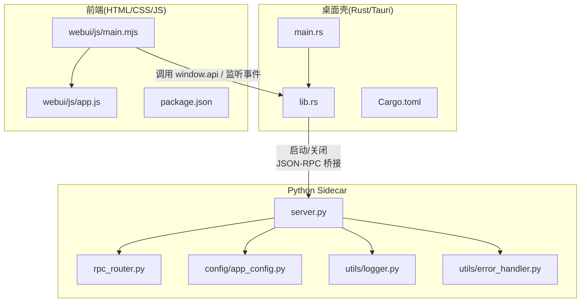
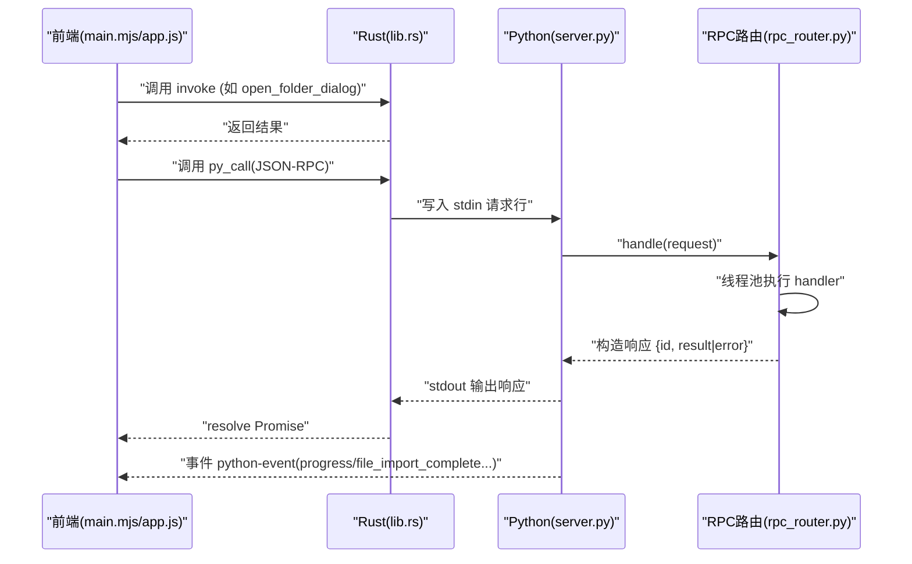
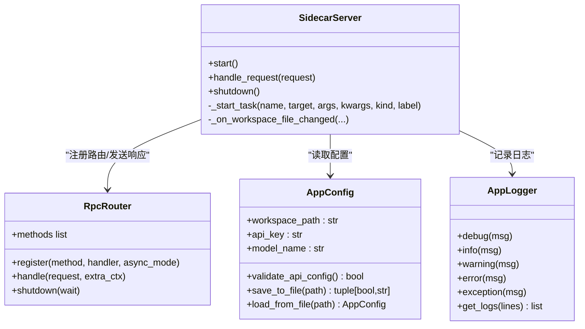
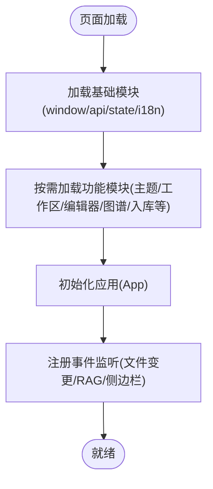
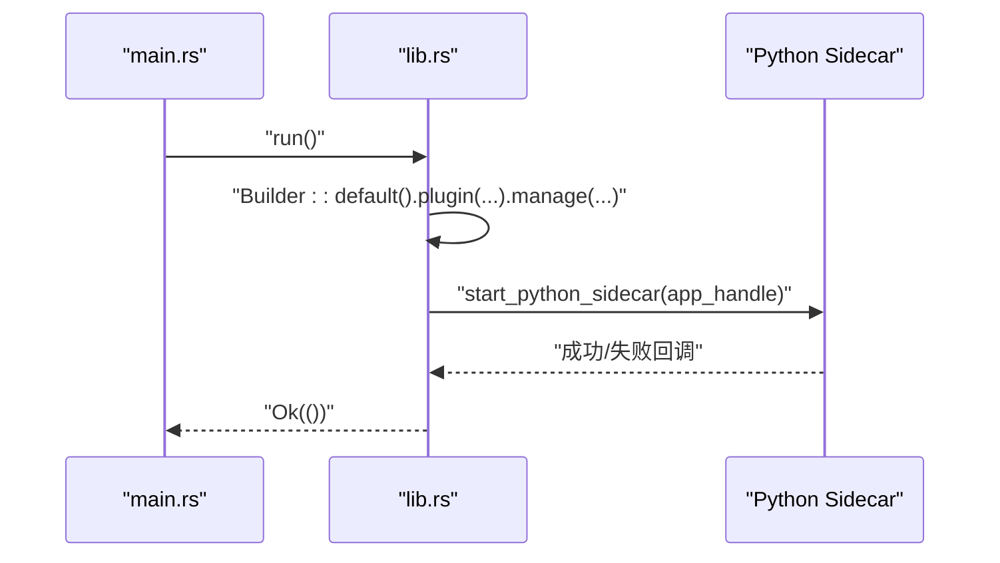
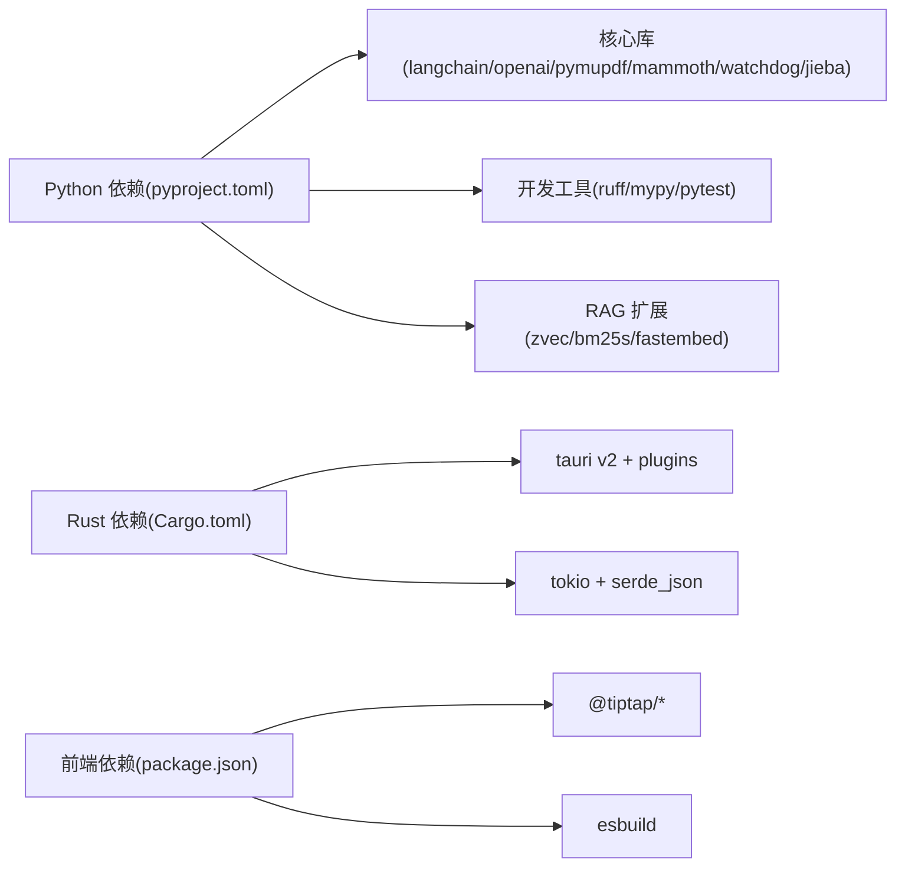

# 代码规范与结构

<cite>
**本文引用的文件**   
- [README.md](file://README.md)
- [CONTRIBUTING.md](file://CONTRIBUTING.md)
- [pyproject.toml](file://pyproject.toml)
- [package.json](file://package.json)
- [src-tauri/Cargo.toml](file://src-tauri/Cargo.toml)
- [python/sidecar/server.py](file://python/sidecar/server.py)
- [python/sidecar/rpc_router.py](file://python/sidecar/rpc_router.py)
- [config/app_config.py](file://config/app_config.py)
- [config/settings.py](file://config/settings.py)
- [utils/error_handler.py](file://utils/error_handler.py)
- [utils/logger.py](file://utils/logger.py)
- [src-tauri/src/main.rs](file://src-tauri/src/main.rs)
- [src-tauri/src/lib.rs](file://src-tauri/src/lib.rs)
- [webui/js/main.mjs](file://webui/js/main.mjs)
- [webui/js/app.js](file://webui/js/app.js)
</cite>

## 目录
1. [引言](#引言)
2. [项目结构](#项目结构)
3. [核心组件](#核心组件)
4. [架构总览](#架构总览)
5. [详细组件分析](#详细组件分析)
6. [依赖分析](#依赖分析)
7. [性能考虑](#性能考虑)
8. [故障排查指南](#故障排查指南)
9. [结论](#结论)
10. [附录](#附录)

## 引言
本文件为 NoteAI 项目的“代码规范与组织结构标准”，覆盖 Python 后端、JavaScript 前端、Rust Tauri 三端的命名约定、注释标准、错误处理模式、模块化组织、状态管理、IPC 通信，以及目录结构设计原则、模块划分策略、文件命名约定。同时提供代码审查清单、静态检查工具配置与 IDE 开发环境推荐设置，帮助团队在统一规范下高效协作。

## 项目结构
NoteAI 采用“Tauri v2 + Python sidecar + 原生前端”的三层架构：
- Rust Tauri 作为桌面壳，负责进程管理、文件系统访问、事件分发与 JSON-RPC 桥接。
- Python sidecar 通过 stdin/stdout 接收 JSON-RPC 请求，承载业务逻辑（入库流水线、RAG、云同步、CLI Agent 桥接等）。
- 前端使用 HTML/CSS/原生 JS（ES6+），按功能模块拆分并通过动态 import 加载。

图示来源
- [src-tauri/src/main.rs:1-4](file://src-tauri/src/main.rs#L1-L4)
- [src-tauri/src/lib.rs:10-82](file://src-tauri/src/lib.rs#L10-L82)
- [python/sidecar/server.py:54-125](file://python/sidecar/server.py#L54-L125)
- [python/sidecar/rpc_router.py:43-106](file://python/sidecar/rpc_router.py#L43-L106)
- [config/app_config.py:28-110](file://config/app_config.py#L28-L110)
- [utils/logger.py:13-60](file://utils/logger.py#L13-L60)
- [utils/error_handler.py:24-82](file://utils/error_handler.py#L24-L82)
- [webui/js/main.mjs:1-40](file://webui/js/main.mjs#L1-L40)
- [webui/js/app.js:1-40](file://webui/js/app.js#L1-L40)

章节来源
- [README.md:155-203](file://README.md#L155-L203)
- [README.md:420-433](file://README.md#L420-L433)

## 核心组件
- Python Sidecar 服务
  - 职责：JSON-RPC 路由、工作区文件监听、自动转换与入库、任务进度与事件推送、线程池执行器。
  - 关键类/函数：SidecarServer、RpcRouter、_start_task、_on_workspace_file_changed、handle_request。
- 配置与日志
  - AppConfig：集中式配置数据类，支持环境变量、持久化、安全存储 API Key。
  - AppLogger：线程安全单例日志器，滚动文件输出与清理。
  - 错误处理：log_exception、swallow、log_and_reraise、format_exc_compact。
- Rust Tauri
  - 职责：应用生命周期、Python sidecar 进程管理、窗口关闭时清理、invoke 处理器注册。
- 前端
  - main.mjs：按功能模块动态导入并挂载到 window.*Module。
  - app.js：应用初始化、拖拽导入、事件监听、状态更新。

章节来源
- [python/sidecar/server.py:54-125](file://python/sidecar/server.py#L54-L125)
- [python/sidecar/rpc_router.py:43-106](file://python/sidecar/rpc_router.py#L43-L106)
- [config/app_config.py:28-110](file://config/app_config.py#L28-L110)
- [utils/logger.py:13-60](file://utils/logger.py#L13-L60)
- [utils/error_handler.py:24-82](file://utils/error_handler.py#L24-L82)
- [src-tauri/src/lib.rs:10-82](file://src-tauri/src/lib.rs#L10-L82)
- [webui/js/main.mjs:1-40](file://webui/js/main.mjs#L1-L40)
- [webui/js/app.js:1-40](file://webui/js/app.js#L1-L40)

## 架构总览
下图展示从前端到 Rust 再到 Python sidecar 的完整调用链与事件回传路径。

图示来源
- [src-tauri/src/lib.rs:39-79](file://src-tauri/src/lib.rs#L39-L79)
- [python/sidecar/server.py:540-595](file://python/sidecar/server.py#L540-L595)
- [python/sidecar/rpc_router.py:54-95](file://python/sidecar/rpc_router.py#L54-L95)
- [webui/js/app.js:219-267](file://webui/js/app.js#L219-L267)

## 详细组件分析

### Python 后端代码规范
- 命名约定
  - 模块与包：小写下划线分隔；顶层包名遵循现有（sidecar、config、utils、modules、prompts）。
  - 类与方法：PascalCase 类名，snake_case 方法名；私有成员以单下划线前缀。
  - 常量：大写蛇形（如 NOTES_FOLDER、RAW_FOLDER）。
- 注释标准
  - 模块级 docstring 说明职责与入口；函数/方法首行简要描述用途；复杂逻辑补充参数与返回值说明。
  - 对外暴露的接口需保持稳定的方法签名与错误码语义。
- 错误处理模式
  - 统一使用 utils.error_handler 提供的装饰器与工具函数记录异常与上下文。
  - RPC 层将业务异常转换为结构化错误对象，避免泄露敏感路径信息。
- 异步与并发
  - 使用 ThreadPoolExecutor 执行耗时 handler，避免阻塞 stdin 读取循环。
  - 后台任务通过 _start_task 包装，统一进度与完成/失败事件上报。
- 配置与日志
  - 所有配置通过 config.app_config.AppConfig 加载与保存，优先从系统钥匙串读取 API Key。
  - 日志通过 utils.logger.AppLogger 单例输出，支持滚动与过期清理。

图示来源
- [config/app_config.py:28-110](file://config/app_config.py#L28-L110)
- [utils/logger.py:13-60](file://utils/logger.py#L13-L60)
- [python/sidecar/rpc_router.py:43-106](file://python/sidecar/rpc_router.py#L43-L106)
- [python/sidecar/server.py:54-125](file://python/sidecar/server.py#L54-L125)

章节来源
- [python/sidecar/server.py:54-125](file://python/sidecar/server.py#L54-L125)
- [python/sidecar/rpc_router.py:43-106](file://python/sidecar/rpc_router.py#L43-L106)
- [config/app_config.py:28-110](file://config/app_config.py#L28-L110)
- [utils/logger.py:13-60](file://utils/logger.py#L13-L60)
- [utils/error_handler.py:24-82](file://utils/error_handler.py#L24-L82)

### JavaScript 前端代码规范
- ES6+ 语法
  - 使用 const/let、箭头函数、解构、模板字符串、可选链等现代语法。
  - 使用动态 import 按需加载模块，减少初始加载体积。
- 模块化组织
  - 每个功能域一个模块文件，导出命名空间挂载至 window.*Module。
  - main.mjs 作为入口，顺序加载基础能力（window/api/state/i18n）后加载业务模块。
- 状态管理
  - 全局状态通过 window.AppState 或各 Module 内部状态维护；跨模块通过 window 暴露的方法交互。
- 事件与 IPC
  - 通过 window.api 调用 Tauri invoke；通过 getTauriEventAPI().listen('python-event') 订阅后端事件。
- 错误处理
  - 对异步调用进行 try/catch，统一提示用户；对不可恢复错误记录控制台日志。

图示来源
- [webui/js/main.mjs:1-40](file://webui/js/main.mjs#L1-L40)
- [webui/js/app.js:1-40](file://webui/js/app.js#L1-L40)

章节来源
- [webui/js/main.mjs:1-40](file://webui/js/main.mjs#L1-L40)
- [webui/js/app.js:1-40](file://webui/js/app.js#L1-L40)

### Rust Tauri 代码规范
- 异步编程
  - 使用 tokio 运行时；在 setup 中 block_on 启动 Python sidecar，确保主流程清晰。
- 内存安全
  - 利用 Rust 所有权模型管理子进程句柄与 stdin 管道；窗口关闭时显式释放资源。
- IPC 通信
  - 通过 generate_handler! 注册 invoke 处理器；通过 Emitter 向前端推送事件。
- 错误处理
  - 启动失败时向窗口发出 python-event 错误事件，便于前端提示。

图示来源
- [src-tauri/src/main.rs:1-4](file://src-tauri/src/main.rs#L1-L4)
- [src-tauri/src/lib.rs:10-38](file://src-tauri/src/lib.rs#L10-L38)

章节来源
- [src-tauri/src/lib.rs:10-82](file://src-tauri/src/lib.rs#L10-L82)
- [src-tauri/src/main.rs:1-4](file://src-tauri/src/main.rs#L1-L4)

## 依赖分析
- Python 依赖
  - 核心依赖：langchain-openai、PyMuPDF、mammoth、markdownify、watchdog、jieba、PyYAML 等。
  - 可选依赖：dev（pytest、ruff、mypy）、rag（FlagEmbedding、bm25s、zvec、fastembed）、cloud_*。
- Rust 依赖
  - tauri v2、tauri-plugin-dialog/shell、serde/serde_json、tokio、which、uuid。
- 前端依赖
  - @tiptap/*、esbuild（构建脚本）、punycode。

图示来源
- [pyproject.toml:10-58](file://pyproject.toml#L10-L58)
- [src-tauri/Cargo.toml:9-18](file://src-tauri/Cargo.toml#L9-L18)
- [package.json:18-26](file://package.json#L18-L26)

章节来源
- [pyproject.toml:10-58](file://pyproject.toml#L10-L58)
- [src-tauri/Cargo.toml:9-18](file://src-tauri/Cargo.toml#L9-L18)
- [package.json:18-26](file://package.json#L18-L26)

## 性能考虑
- Python 侧
  - 使用线程池执行 RPC handler，避免阻塞 stdin 读取循环。
  - 文件变更去抖合并，批量触发 WIKI 同步与索引重建。
  - 缓存 TTLCache 与查询缓存降低重复计算。
- Rust 侧
  - 子进程管理与事件派发尽量轻量，避免在主线程做重 IO。
- 前端侧
  - 动态 import 按需加载模块，减少首屏体积。
  - 长任务通过事件驱动更新 UI，避免阻塞渲染。

## 故障排查指南
- Python 侧
  - 使用 utils.error_handler.log_exception 记录上下文与堆栈；RPC 层会屏蔽绝对路径等敏感信息。
  - 通过 AppLogger.get_logs 获取最近日志定位问题。
- Rust 侧
  - 关注窗口关闭时的清理逻辑，确保子进程被正确终止。
- 前端侧
  - 监听 python-event 事件，捕获 sidecar_error、import_progress、file_import_complete 等类型。

章节来源
- [utils/error_handler.py:24-82](file://utils/error_handler.py#L24-L82)
- [utils/logger.py:110-126](file://utils/logger.py#L110-L126)
- [src-tauri/src/lib.rs:50-79](file://src-tauri/src/lib.rs#L50-L79)
- [webui/js/app.js:219-267](file://webui/js/app.js#L219-L267)

## 结论
本规范明确了 NoteAI 在多语言混合工程中的统一实践：Python 侧强调结构化错误处理与线程安全、Rust 侧注重进程与资源管理、前端侧倡导模块化与事件驱动。配合统一的静态检查与 IDE 配置，可显著提升代码质量与团队协作效率。

## 附录

### 目录结构与模块划分原则
- 顶层目录
  - src-tauri：Rust 应用与插件、构建配置。
  - webui：前端资源与模块。
  - python/sidecar：JSON-RPC 服务、handlers、RAG、入库流水线、CLI Agent 桥接。
  - modules：下载、转换、预览等独立能力。
  - utils：通用工具（LLM、主题、链接、日志、错误处理）。
  - prompts：提示词模板与加载器。
  - config：应用配置、常量、工作区状态。
  - tests：单元与集成测试。
- 模块划分策略
  - 按领域分层：基础设施（config/utils）、业务能力（modules/sidecar/handlers）、编排（ingest/cascade）。
  - 文件命名：模块文件使用 snake_case，测试文件以 test_ 前缀。

章节来源
- [README.md:190-203](file://README.md#L190-L203)
- [README.md:420-433](file://README.md#L420-L433)

### 静态检查与格式化配置
- Python
  - ruff：lint 启用 pycodestyle/pyflakes/isort/flake8-bugbear/comprehensions/pyupgrade/simplify/return 规则；忽略部分与 formatter 冲突的规则。
  - mypy：开启 check_untyped_defs，忽略缺失导入。
  - pytest：指定测试路径与过滤 langsmith 插件。
- Rust
  - cargo clippy + rustfmt（贡献指南要求）。
- JavaScript
  - 当前未配置 ESLint；建议后续引入并启用严格模式与 IIFE 兼容规则。

章节来源
- [pyproject.toml:75-133](file://pyproject.toml#L75-L133)
- [CONTRIBUTING.md:49-65](file://CONTRIBUTING.md#L49-L65)

### 代码审查清单
- 通用
  - 提交信息符合 Conventional Commits。
  - 新增/修改均附带相应测试用例。
  - 无硬编码路径/密钥；敏感信息通过配置或钥匙串管理。
- Python
  - 使用 ruff 检查通过；类型注解齐全；异常处理使用统一工具。
  - 长时间运行逻辑放入线程池；避免阻塞 stdin 读取。
- Rust
  - 通过 clippy 与 rustfmt；子进程生命周期管理完善；事件派发不阻塞主线程。
- JavaScript
  - 模块按需加载；全局状态仅通过 window.*Module 暴露；错误有用户提示与控制台日志。

章节来源
- [CONTRIBUTING.md:22-47](file://CONTRIBUTING.md#L22-L47)
- [CONTRIBUTING.md:49-65](file://CONTRIBUTING.md#L49-L65)

### IDE 开发环境推荐设置
- VS Code
  - Python：安装 ruff、mypy、pytest 扩展；设置默认格式化器为 ruff。
  - Rust：安装 rust-analyzer；启用 clippy 与 rustfmt。
  - JavaScript：安装 ESLint（待配置）；启用 Prettier 与自动修复。
  - 终端：使用 uv 管理 Python 环境；npm ci 安装前端依赖。
- 其他
  - 使用 run.py 一键启动开发环境（含 Tauri dev 与 Python sidecar）。

章节来源
- [CONTRIBUTING.md:5-18](file://CONTRIBUTING.md#L5-L18)
- [README.md:44-55](file://README.md#L44-L55)