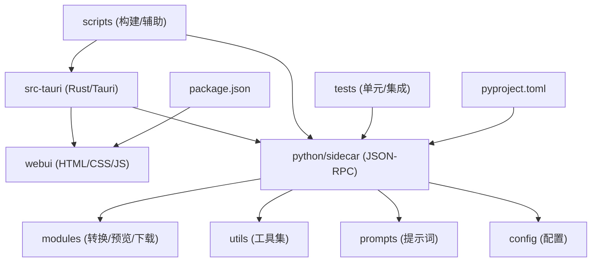
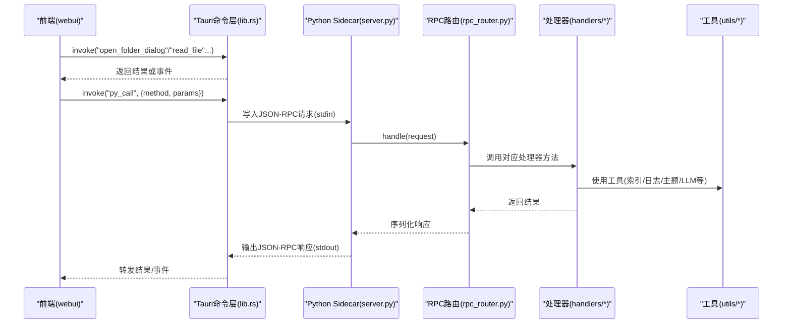
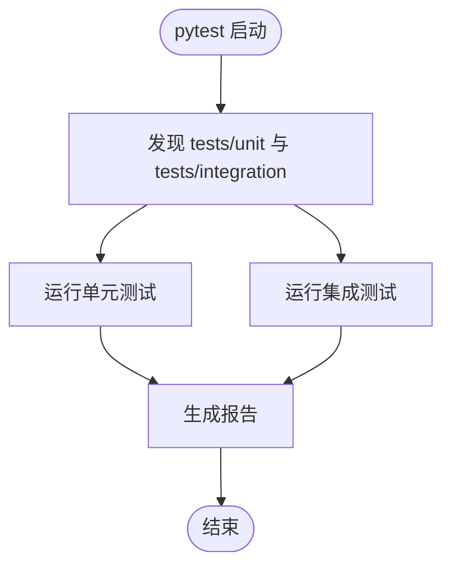
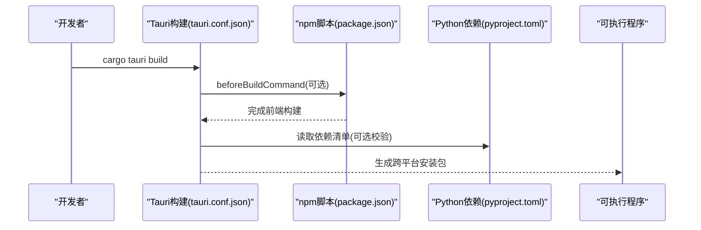
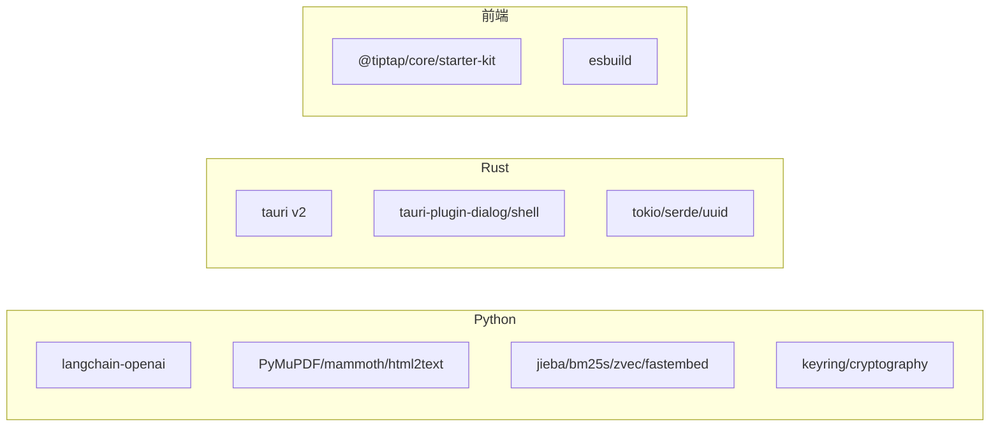

# 开发指南

<cite>
**本文引用的文件**   
- [README.md](file://README.md)
- [CONTRIBUTING.md](file://CONTRIBUTING.md)
- [pyproject.toml](file://pyproject.toml)
- [package.json](file://package.json)
- [Cargo.toml](file://src-tauri/Cargo.toml)
- [tauri.conf.json](file://src-tauri/tauri.conf.json)
- [run.py](file://run.py)
- [start.sh](file://start.sh)
- [main.rs](file://src-tauri/src/main.rs)
- [lib.rs](file://src-tauri/src/lib.rs)
- [server.py](file://python/sidecar/server.py)
- [rpc_router.py](file://python/sidecar/rpc_router.py)
- [index.html](file://webui/index.html)
- [test_server_startup_boundaries.py](file://tests/unit/test_server_startup_boundaries.py)
- [test_sidecar_contracts.py](file://tests/integration/test_sidecar_contracts.py)
</cite>

## 目录
1. [简介](#简介)
2. [项目结构](#项目结构)
3. [核心组件](#核心组件)
4. [架构总览](#架构总览)
5. [详细组件分析](#详细组件分析)
6. [依赖分析](#依赖分析)
7. [性能考虑](#性能考虑)
8. [故障排查指南](#故障排查指南)
9. [结论](#结论)
10. [附录](#附录)

## 简介
NoteAI 是一款 AI 原生的个人知识库桌面应用，采用 Tauri v2（Rust）作为外壳，前端为原生 HTML/CSS/JS + Tiptap，后端通过 Python sidecar 提供 JSON-RPC 服务。应用支持采集、整理、检索与问答，内置 RAG 助手与入库流水线，面向本地工作区，数据完全由用户掌控。

## 项目结构
仓库采用分层与按功能域结合的布局：
- src-tauri：Tauri 应用壳、命令与侧车进程管理
- webui：前端资源与页面入口
- python/sidecar：JSON-RPC 路由、处理器、RAG、入库、云同步等
- modules：下载、转换、预览等能力模块
- utils：通用工具（LLM、主题、链接、日志、缓存等）
- prompts：提示词模板与加载器
- config：配置、常量与安全策略
- tests：单元测试与集成测试
- scripts：构建与辅助脚本
- package.json：前端构建脚本与依赖
- pyproject.toml：Python 依赖与工具链配置
- run.py / start.sh：开发与一键启动脚本

图表来源
- [tauri.conf.json:1-47](file://src-tauri/tauri.conf.json#L1-L47)
- [pyproject.toml:1-133](file://pyproject.toml#L1-L133)
- [package.json:1-28](file://package.json#L1-L28)

章节来源
- [README.md:190-203](file://README.md#L190-L203)
- [README.md:420-433](file://README.md#L420-L433)

## 核心组件
- Rust 外壳与命令层：负责窗口、文件系统访问、事件派发与 Python sidecar 生命周期管理
- Python sidecar：基于 stdin/stdout 的 JSON-RPC 服务，包含路由、处理器、RAG、入库流水线、云同步等
- 前端 UI：四栏布局、编辑器、图谱、设置面板、AI 对话与 CLI Agent 桥接
- 构建与打包：Tauri 构建流程、Tiptap 预构建、Python 依赖与可选 RAG 组件

章节来源
- [lib.rs:10-49](file://src-tauri/src/lib.rs#L10-L49)
- [server.py:54-125](file://python/sidecar/server.py#L54-L125)
- [index.html:1-32](file://webui/index.html#L1-L32)

## 架构总览
NoteAI 采用“前端 + Rust 壳 + Python 后端”的三层架构。Rust 负责系统级能力与进程管理；Python 承载业务逻辑与重型计算；前端专注交互与渲染。

图表来源
- [lib.rs:39-49](file://src-tauri/src/lib.rs#L39-L49)
- [server.py:570-595](file://python/sidecar/server.py#L570-L595)
- [rpc_router.py:54-82](file://python/sidecar/rpc_router.py#L54-L82)

## 详细组件分析

### 开发环境搭建
- 前置要求
  - Python 3.10+
  - Rust 工具链（cargo）
  - Tauri CLI v2（可通过 cargo 或 npm 安装）
  - 推荐使用 uv 进行 Python 依赖管理
- 克隆与初始化
  - 克隆仓库后进入项目根目录
  - 使用 uv 安装依赖（含 dev 与 rag 可选集）
  - 运行开发启动脚本，自动检查依赖并启动 Tauri 开发模式
- 关键说明
  - run.py 会解析 pyproject.toml 中的依赖列表并进行缺失检测
  - 首次构建会执行前端 Tiptap 打包
  - start.sh 提供一键启动（dev/build），内部复用 run.py 的依赖检查逻辑

章节来源
- [README.md:44-55](file://README.md#L44-L55)
- [README.md:273-284](file://README.md#L273-L284)
- [run.py:44-122](file://run.py#L44-L122)
- [start.sh:19-73](file://start.sh#L19-L73)
- [tauri.conf.json:6-10](file://src-tauri/tauri.conf.json#L6-L10)

### 代码组织与命名规范
- 目录划分
  - 按职责分层：sidecar（服务）、handlers（接口实现）、rag（检索）、mixins（公共行为）、cloud（云同步）
  - 工具与模块分离：utils（通用工具）、modules（领域能力）
- 命名约定
  - Python：模块与包名小写下划线，类名大驼峰，函数与方法小写下划线
  - Rust：遵循 rustfmt 与 clippy 建议
  - JS：保持 IIFE 模块风格，全局状态通过 window.AppState
- 注释标准
  - 模块级 docstring 描述职责与边界
  - 关键函数添加行内注释说明输入/输出与副作用
  - 错误路径需记录上下文信息，避免泄露敏感路径

章节来源
- [CONTRIBUTING.md:49-65](file://CONTRIBUTING.md#L49-L65)
- [server.py:1-10](file://python/sidecar/server.py#L1-L10)

### 测试编写与运行
- 测试类型
  - 单元测试：覆盖 sidecar 启动边界、自动转换去重、任务调度等
  - 集成测试：验证 RPC 契约、路径解析、工作区树、预览管道、Wiki 同步等
- 组织结构
  - tests/unit：针对具体模块与类的细粒度用例
  - tests/integration：跨模块端到端契约与流程验证
- 运行方式
  - 使用 pytest 运行全部或指定目录
  - 在 CI 中禁用 langsmith 插件以避免无 API Key 时报错

图表来源
- [pyproject.toml:116-124](file://pyproject.toml#L116-L124)

章节来源
- [test_server_startup_boundaries.py:1-123](file://tests/unit/test_server_startup_boundaries.py#L1-L123)
- [test_sidecar_contracts.py:1-639](file://tests/integration/test_sidecar_contracts.py#L1-L639)
- [pyproject.toml:116-124](file://pyproject.toml#L116-L124)

### 构建与打包流程
- 前端资源
  - 首次构建会执行 Tiptap 打包脚本，产物被 Tauri 打包时嵌入
- Python 依赖
  - 通过 pyproject.toml 声明基础与可选依赖（dev、rag、云存储扩展）
  - 启动前自动校验依赖完整性，缺失则提示安装
- 跨平台发布
  - 使用 cargo tauri build 触发多目标打包
  - tauri.conf.json 配置图标、资源与 CSP 安全策略
  - 打包时将 python/** 资源一并纳入

图表来源
- [tauri.conf.json:6-10](file://src-tauri/tauri.conf.json#L6-L10)
- [tauri.conf.json:27-40](file://src-tauri/tauri.conf.json#L27-L40)
- [package.json:10-13](file://package.json#L10-L13)
- [pyproject.toml:38-58](file://pyproject.toml#L38-L58)

章节来源
- [README.md:55-56](file://README.md#L55-L56)
- [tauri.conf.json:1-47](file://src-tauri/tauri.conf.json#L1-L47)
- [package.json:10-13](file://package.json#L10-L13)
- [pyproject.toml:38-58](file://pyproject.toml#L38-L58)

### 调试技巧与性能分析
- Rust 调试
  - 启用 devtools 特性以打开浏览器开发者工具
  - 使用 cargo clippy 与 rustfmt 提升代码质量
- Python 调试
  - 通过 stdout 输出 JSON-RPC 请求/响应，结合日志定位问题
  - 使用线程池与后台任务观察阻塞点
- 前端调试
  - 利用 Tauri devtools 查看网络与 DOM
  - 关注 CSP 策略对资源加载的影响
- 性能优化
  - 减少不必要的文件扫描与重复转换
  - 合理使用 TTL 缓存与惰性加载
  - 控制并发度，避免 IO 热点

章节来源
- [Cargo.toml:20-22](file://src-tauri/Cargo.toml#L20-L22)
- [CONTRIBUTING.md:62-65](file://CONTRIBUTING.md#L62-L65)
- [server.py:184-214](file://python/sidecar/server.py#L184-L214)
- [tauri.conf.json:23-25](file://src-tauri/tauri.conf.json#L23-L25)

### 贡献流程与 Pull Request 规范
- 分支策略
  - main：稳定版本
  - feat/*、fix/*、refactor/*：功能、修复与重构分支
- 提交信息
  - 采用 Conventional Commits 格式，明确变更范围与影响
- PR 流程
  - 从 main 创建分支，提交变更并确保 CI 通过
  - 填写 PR 模板，等待 Review 后合并
- 代码审查标准
  - Python：ruff 检查与格式化、类型注解、行长限制
  - JavaScript：ESLint（即将配置）、IIFE 模块风格
  - Rust：clippy 与 rustfmt 合规

章节来源
- [CONTRIBUTING.md:20-80](file://CONTRIBUTING.md#L20-L80)

## 依赖分析
- Python 依赖
  - 基础依赖涵盖 LLM 客户端、文档处理、中文分词、加密与密钥管理等
  - 可选依赖包括 RAG（向量检索与重排序）、云存储 SDK
- Rust 依赖
  - Tauri v2 及其插件（dialog、shell）
  - serde/serde_json、tokio、which、uuid 等
- 前端依赖
  - Tiptap 套件与 esbuild 构建工具

图表来源
- [pyproject.toml:10-58](file://pyproject.toml#L10-L58)
- [Cargo.toml:9-18](file://src-tauri/Cargo.toml#L9-L18)
- [package.json:18-26](file://package.json#L18-L26)

章节来源
- [pyproject.toml:10-58](file://pyproject.toml#L10-L58)
- [Cargo.toml:9-18](file://src-tauri/Cargo.toml#L9-L18)
- [package.json:18-26](file://package.json#L18-L26)

## 性能考虑
- 文件监听与防抖
  - 使用 watchdog 监听工作区变更，5 秒防抖聚合事件，避免频繁刷新
- 异步与线程池
  - RPC 处理器通过线程池执行，避免阻塞 stdin 读取循环
- 缓存策略
  - TTL 缓存与查询缓存结合，降低重复计算与 IO 开销
- 索引重建
  - 启动时智能判断是否需要重建 RAG 索引，避免昂贵操作

章节来源
- [server.py:216-255](file://python/sidecar/server.py#L216-L255)
- [server.py:298-339](file://python/sidecar/server.py#L298-L339)
- [server.py:340-356](file://python/sidecar/server.py#L340-L356)
- [rpc_router.py:43-50](file://python/sidecar/rpc_router.py#L43-L50)

## 故障排查指南
- 启动失败
  - 检查 Python 依赖是否完整，参考 run.py 的依赖检查输出
  - 确认 Tauri CLI 可用（cargo tauri 或 npx tauri）
- 侧车进程异常
  - 查看 Rust 侧 stderr 与事件派发日志
  - 检查 JSON-RPC 请求/响应格式与错误码
- 文件预览失败
  - 确认路径在工作区内且存在
  - 对于大文件，使用切片预览接口避免内存压力
- Wiki 不同步
  - 检查工作区 Notes 目录变更是否触发 wiki 同步
  - 手动触发一次 WIKI 同步以恢复一致性

章节来源
- [run.py:125-143](file://run.py#L125-L143)
- [lib.rs:20-35](file://src-tauri/src/lib.rs#L20-L35)
- [rpc_router.py:14-32](file://python/sidecar/rpc_router.py#L14-L32)
- [test_sidecar_contracts.py:359-430](file://tests/integration/test_sidecar_contracts.py#L359-L430)

## 结论
NoteAI 通过清晰的层次化结构与稳健的进程间通信机制，实现了高效的本地知识管理与 AI 问答体验。完善的测试与构建流程保障了可维护性与跨平台发布能力。遵循本指南将有助于快速上手与持续贡献。

## 附录
- 快速开始命令
  - 克隆仓库并安装依赖
  - 运行开发启动脚本
- 常用命令
  - 运行测试：pytest
  - 构建应用：cargo tauri build
  - 一键启动：./start.sh 或 ./start.sh --release

章节来源
- [README.md:44-55](file://README.md#L44-L55)
- [README.md:273-284](file://README.md#L273-L284)
- [start.sh:75-81](file://start.sh#L75-L81)