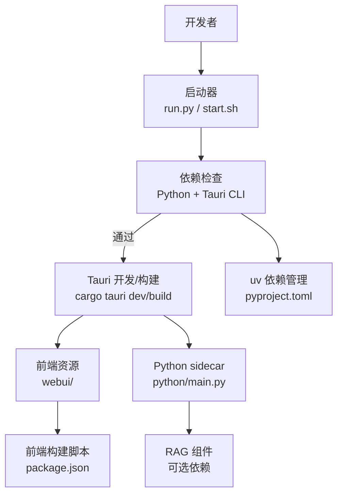

# 开发环境搭建

<cite>
**本文引用的文件**
- [README.md](file://README.md)
- [pyproject.toml](file://pyproject.toml)
- [package.json](file://package.json)
- [run.py](file://run.py)
- [start.sh](file://start.sh)
- [src-tauri/Cargo.toml](file://src-tauri/Cargo.toml)
- [src-tauri/tauri.conf.json](file://src-tauri/tauri.conf.json)
- [utils/deps_sync.py](file://utils/deps_sync.py)
- [python/sidecar/rag/rag_config.py](file://python/sidecar/rag/rag_config.py)
</cite>

## 目录
1. [简介](#简介)
2. [系统要求](#系统要求)
3. [依赖安装步骤](#依赖安装步骤)
4. [Python 虚拟环境与 uv 配置](#python-虚拟环境与-uv-配置)
5. [RAG 组件可选依赖](#rag-组件可选依赖)
6. [Rust 与 Tauri 编译环境](#rust-与-tauri-编译环境)
7. [一键启动脚本使用说明](#一键启动脚本使用说明)
8. [常见问题排查](#常见问题排查)
9. [架构概览（与环境相关）](#架构概览与环境相关)
10. [结论](#结论)

## 简介
本指南面向首次在本仓库进行本地开发的开发者，聚焦于“如何把 NoteAI 跑起来”。内容覆盖：
- 系统要求（Python、Rust、Node.js）
- 依赖安装（uv、Tauri CLI、前端依赖）
- Python 虚拟环境与 uv 工作流
- RAG 可选依赖的启用与关闭
- Rust/Tauri 构建流程
- 一键启动脚本的使用与模式差异
- 常见环境问题与解决方案（权限、代理、跨平台）

## 系统要求
- Python 3.10+
- Rust 工具链（用于 Tauri v2 构建）
- Node.js（用于前端构建脚本）
- uv 包管理器（推荐）
- Tauri CLI v2（可通过 cargo 或 npm 全局安装）

说明：
- README 明确列出所需环境为 Python 3.10+、Rust、Tauri CLI v2，并推荐使用 uv。
- pyproject.toml 声明 requires-python >= 3.10。
- package.json 包含前端构建脚本，需要 Node.js。
- src-tauri/Cargo.toml 使用 Tauri v2 及对应插件。

章节来源
- [README.md:44-56](file://README.md#L44-L56)
- [pyproject.toml:1-6](file://pyproject.toml#L1-L6)
- [package.json:10-12](file://package.json#L10-L12)
- [src-tauri/Cargo.toml:1-11](file://src-tauri/Cargo.toml#L1-L11)

## 依赖安装步骤
建议顺序如下：

1) 安装 uv
- 参考官方文档安装 uv。
- 若未安装，启动脚本会提示安装命令。

2) 同步 Python 依赖（含 dev 与 rag）
- 在项目根目录执行：uv sync --extra dev --extra rag
- 该命令会读取 pyproject.toml 中的 dependencies 与 optional-dependencies，自动创建/复用 .venv 并安装所有必要包。

3) 安装 Tauri CLI v2
- 方式一（cargo）：cargo install tauri-cli
- 方式二（npm）：npm install -g @tauri-apps/cli
- run.py 会尝试通过 cargo 和 npx 两种方式检测 Tauri CLI。

4) 安装前端依赖并构建编辑器
- 项目首次构建前会执行 npm 脚本构建 Tiptap 编辑器。
- 确保已安装 Node.js，并在项目根目录执行一次构建脚本（由 Tauri 在开发/构建时触发）。

章节来源
- [README.md:44-56](file://README.md#L44-L56)
- [pyproject.toml:38-58](file://pyproject.toml#L38-L58)
- [run.py:125-143](file://run.py#L125-L143)
- [src-tauri/tauri.conf.json:6-10](file://src-tauri/tauri.conf.json#L6-L10)
- [package.json:10-12](file://package.json#L10-L12)

## Python 虚拟环境与 uv 配置
- uv 会自动管理 .venv 与依赖锁定；无需手动创建虚拟环境。
- 默认 extras：dev 与 rag（除非用户在设置中移除 RAG 组件）。
- 当检测到缺失依赖时，run.py 会打印推荐的 uv 同步命令。
- utils/deps_sync.py 提供统一的 uv 同步参数生成与执行逻辑，供脚本与运行时复用。

要点：
- 首次运行建议使用 uv sync --extra dev --extra rag，确保开发与 RAG 依赖齐全。
- 若不需要向量检索，可在设置中移除 RAG 组件，后续同步将不再包含 rag extra。

章节来源
- [pyproject.toml:38-58](file://pyproject.toml#L38-L58)
- [run.py:44-122](file://run.py#L44-L122)
- [utils/deps_sync.py:1-55](file://utils/deps_sync.py#L1-L55)

## RAG 组件可选依赖
RAG 依赖属于可选集合，默认随开发环境一起安装，但可被用户显式移除。

- 可选依赖组 rag 包含：FlagEmbedding、bm25s、zvec、fastembed。
- 运行时会根据配置决定是否启用重排序等子功能。
- 若缺少这些模块，启动时会提示补齐或引导关闭 RAG。

章节来源
- [pyproject.toml:44-49](file://pyproject.toml#L44-L49)
- [run.py:18-33](file://run.py#L18-L33)
- [python/sidecar/rag/rag_config.py:43-46](file://python/sidecar/rag/rag_config.py#L43-L46)

## Rust 与 Tauri 编译环境
NoteAI 使用 Tauri v2，Rust 工程位于 src-tauri。

- Cargo 清单定义了 Tauri 及其插件依赖，以及构建产物类型。
- Tauri 配置文件指定了前端资源路径、开发前置命令（构建 Tiptap）、打包资源与图标等。
- 开发模式下，Tauri 会调用 beforeDevCommand 构建前端资源。

章节来源
- [src-tauri/Cargo.toml:1-27](file://src-tauri/Cargo.toml#L1-L27)
- [src-tauri/tauri.conf.json:1-47](file://src-tauri/tauri.conf.json#L1-L47)

## 一键启动脚本使用说明
项目提供 start.sh 作为一键启动入口，支持两种模式：
- 开发模式（默认）：cargo tauri dev
- 发布模式：cargo tauri build

用法：
- 直接运行：./start.sh
- 发布构建：./start.sh --release

行为说明：
- 自动检查 uv 是否存在，不存在则提示安装。
- 若未找到 .venv，自动执行 uv sync（包含 dev 与 rag），失败则给出手动命令。
- 再次检查 RAG 依赖是否可用，如缺失则尝试补齐。
- 最后根据参数选择 dev 或 build 模式。

注意：
- 该脚本仅适用于类 Unix 系统（macOS/Linux）。Windows 可使用 run.py 或直接执行 cargo tauri dev/build。

章节来源
- [start.sh:1-82](file://start.sh#L1-L82)

## 常见问题排查
以下问题按类别整理，便于快速定位与解决。

1) 权限问题
- 现象：无法写入 .venv 或项目目录；构建阶段报错权限不足。
- 处理：
  - 确认当前用户对项目目录具有读写权限。
  - 避免使用 sudo 运行 uv/cargo；如需提升权限，请调整目录权限或使用合适的用户上下文。
  - macOS 上如遇沙箱限制，请在“系统设置 → 隐私与安全性”中放行终端与编译器。

2) 网络代理与镜像源
- 现象：uv sync 或 pip 下载超时/失败；npm 安装缓慢。
- 处理：
  - 配置系统级代理环境变量（例如 http_proxy/https_proxy），使 uv 与 npm 生效。
  - 使用国内镜像源加速下载（如 uv 的索引配置、npm registry 切换）。
  - 若在企业内网，确保 DNS 解析与出站白名单允许访问 PyPI/npm 源。

3) 依赖缺失与版本不匹配
- 现象：启动时报缺少依赖；提示运行 uv sync。
- 处理：
  - 在项目根目录执行：uv sync --extra dev --extra rag
  - 若不需要 RAG，可在设置中移除 RAG 组件后再次同步。
  - 若仍失败，查看 uv 输出尾部错误信息，必要时清理缓存后重试。

4) Tauri CLI 未找到
- 现象：提示未找到 Tauri CLI。
- 处理：
  - 使用 cargo 安装：cargo install tauri-cli
  - 或使用 npm 安装：npm install -g @tauri-apps/cli
  - 安装完成后重启终端，确保 PATH 生效。

5) Node.js 与前端构建
- 现象：首次构建卡住或报错。
- 处理：
  - 确认已安装 Node.js。
  - 进入项目根目录执行一次前端构建脚本（Tauri 会在开发/构建时自动触发）。
  - 若网络受限，配置 npm 镜像源。

6) 跨平台兼容性
- Windows：
  - 建议使用 run.py 启动，或直接在 PowerShell/CMD 中执行 cargo tauri dev/build。
  - 确保 Rust 与 Python 均已加入 PATH。
- macOS：
  - 首次运行可能需要授予终端对磁盘与外部程序的访问权限。
- Linux：
  - 某些发行版需额外安装系统库（如 PDF/图像解码相关依赖），根据报错提示安装对应包。

7) RAG 组件异常
- 现象：缺少 bm25s/fastembed/zvec/FlagEmbedding 等模块。
- 处理：
  - 重新执行 uv sync --extra rag。
  - 若确实不需要 RAG，可在设置中移除 RAG 组件，避免加载相关依赖。

章节来源
- [run.py:125-143](file://run.py#L125-L143)
- [start.sh:19-71](file://start.sh#L19-L71)
- [python/sidecar/rag/rag_config.py:43-46](file://python/sidecar/rag/rag_config.py#L43-L46)

## 架构概览（与环境相关）
下图展示与开发环境相关的核心组件关系：启动器、Tauri、Python sidecar、前端资源与依赖管理。

图表来源
- [run.py:146-175](file://run.py#L146-L175)
- [start.sh:75-82](file://start.sh#L75-L82)
- [src-tauri/tauri.conf.json:6-10](file://src-tauri/tauri.conf.json#L6-L10)
- [pyproject.toml:1-6](file://pyproject.toml#L1-L6)
- [package.json:10-12](file://package.json#L10-L12)

## 结论
按照本指南完成系统要求准备、依赖安装与启动流程后，即可在本地运行 NoteAI 的开发版本。建议在首次启动时使用一键脚本或 run.py，它们会协助完成依赖校验与必要的同步操作。遇到网络或权限问题时，优先检查代理与镜像源配置，并确保对项目的写入权限正常。若不需要 RAG 能力，可在设置中移除 RAG 组件以减少依赖体积与潜在冲突。