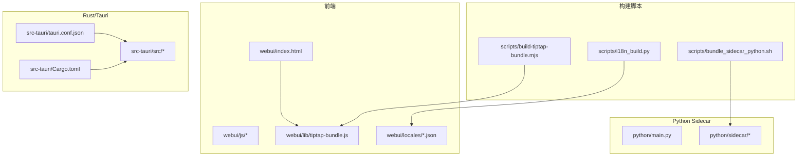
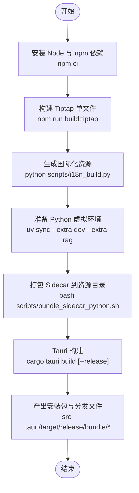
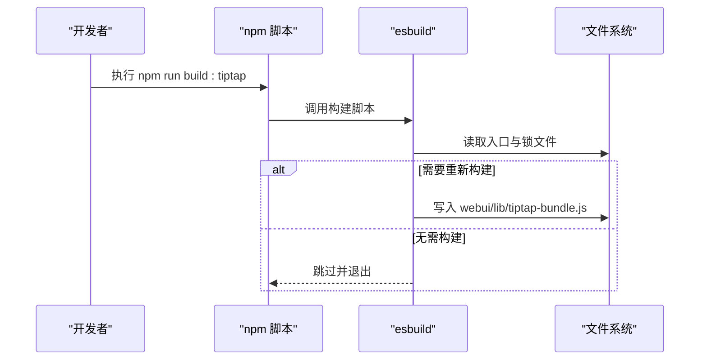
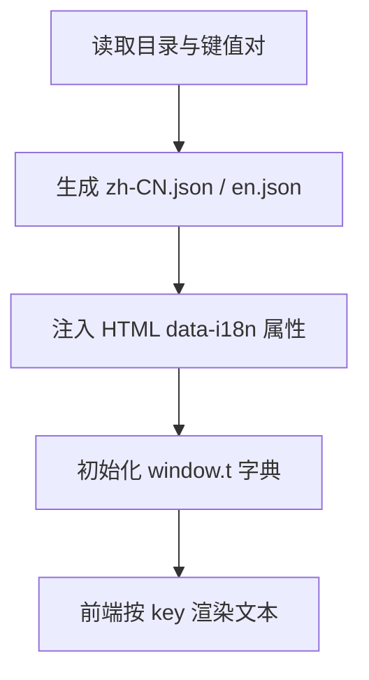
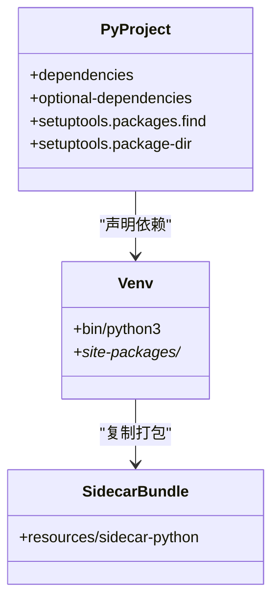
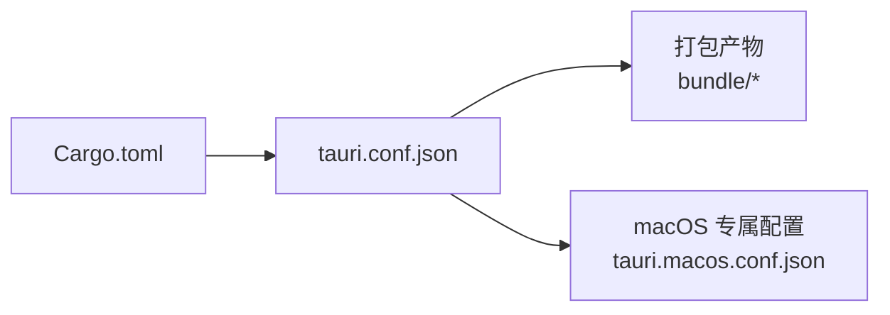
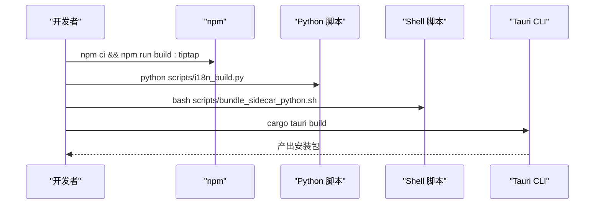
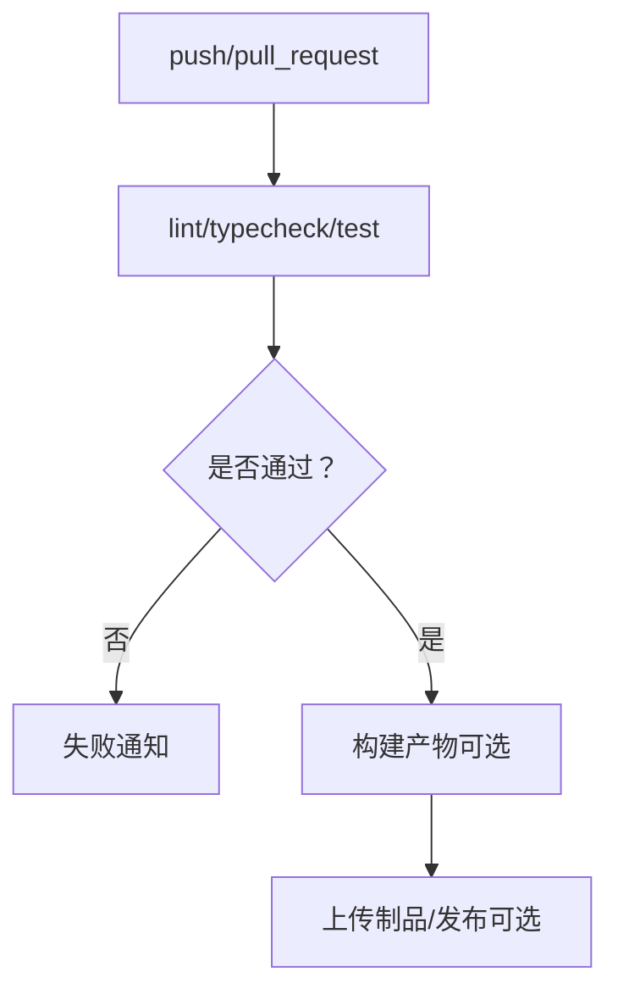
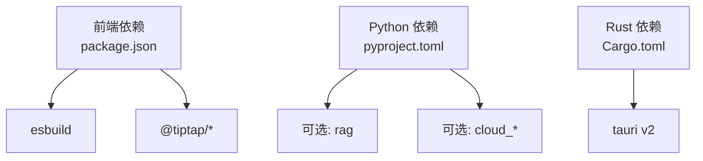

# 构建与部署

<cite>
**本文引用的文件**
- [package.json](file://package.json)
- [scripts/build-tiptap-bundle.mjs](file://scripts/build-tiptap-bundle.mjs)
- [webui/js/tiptap-bundle-entry.mjs](file://webui/js/tiptap-bundle-entry.mjs)
- [pyproject.toml](file://pyproject.toml)
- [src-tauri/Cargo.toml](file://src-tauri/Cargo.toml)
- [src-tauri/tauri.conf.json](file://src-tauri/tauri.conf.json)
- [src-tauri/tauri.macos.conf.json](file://src-tauri/tauri.macos.conf.json)
- [scripts/bundle_sidecar_python.sh](file://scripts/bundle_sidecar_python.sh)
- [scripts/i18n_build.py](file://scripts/i18n_build.py)
- [.github/workflows/ci.yml](file://.github/workflows/ci.yml)
- [start.sh](file://start.sh)
- [run.py](file://run.py)
</cite>

## 目录
1. [简介](#简介)
2. [项目结构](#项目结构)
3. [核心组件](#核心组件)
4. [架构总览](#架构总览)
5. [详细组件分析](#详细组件分析)
6. [依赖关系分析](#依赖关系分析)
7. [性能考虑](#性能考虑)
8. [故障排查指南](#故障排查指南)
9. [结论](#结论)
10. [附录](#附录)

## 简介
本文件面向开发者与维护者，系统化说明 NoteAI 的构建与部署流程，覆盖：
- 前端资源打包：Tiptap 编辑器构建、静态资源优化、国际化资源处理
- Python 依赖管理：基于 pyproject.toml 的依赖声明与 uv 虚拟环境打包
- Rust/Tauri 应用编译：Tauri 配置、平台特定优化
- 跨平台发布流程：Windows、macOS、Linux 安装包制作与版本管理策略
- CI/CD 流水线：自动化检查、构建与发布建议（含回滚机制）

## 项目结构
NoteAI 采用多语言混合架构：
- 前端：原生 HTML/CSS/JS + Tiptap 编辑器（通过 esbuild 打包为单文件 IIFE）
- 后端：Python Sidecar（由 Tauri 进程内启动，提供 JSON-RPC 服务）
- 桌面壳：Rust + Tauri v2，负责窗口、安全策略、打包与分发

图表来源
- [package.json:1-28](file://package.json#L1-L28)
- [scripts/build-tiptap-bundle.mjs:1-40](file://scripts/build-tiptap-bundle.mjs#L1-L40)
- [webui/js/tiptap-bundle-entry.mjs:1-10](file://webui/js/tiptap-bundle-entry.mjs#L1-L10)
- [scripts/i18n_build.py:1-800](file://scripts/i18n_build.py#L1-L800)
- [scripts/bundle_sidecar_python.sh:1-20](file://scripts/bundle_sidecar_python.sh#L1-L20)
- [src-tauri/tauri.conf.json:1-47](file://src-tauri/tauri.conf.json#L1-L47)
- [src-tauri/Cargo.toml:1-27](file://src-tauri/Cargo.toml#L1-L27)

章节来源
- [package.json:1-28](file://package.json#L1-L28)
- [src-tauri/tauri.conf.json:1-47](file://src-tauri/tauri.conf.json#L1-L47)

## 核心组件
- 前端构建入口与产物
  - 入口：webui/js/tiptap-bundle-entry.mjs
  - 构建脚本：scripts/build-tiptap-bundle.mjs（esbuild）
  - 产物：webui/lib/tiptap-bundle.js（IIFE，供 index.html 直接加载）
- 国际化资源
  - 源数据：scripts/i18n_build.py（集中目录与生成逻辑）
  - 输出：webui/locales/*.json（被前端 i18n 模块消费）
- Python 依赖与环境
  - 依赖声明：pyproject.toml（含可选依赖 dev/rag/cloud_*）
  - 打包侧车：scripts/bundle_sidecar_python.sh（将 .venv 复制到 resources/sidecar-python）
- Rust/Tauri 应用
  - 包元信息：src-tauri/Cargo.toml
  - 应用配置：src-tauri/tauri.conf.json（前端路径、CSP、打包资源等）
  - macOS 专属：src-tauri/tauri.macos.conf.json（标题栏样式等）

章节来源
- [webui/js/tiptap-bundle-entry.mjs:1-10](file://webui/js/tiptap-bundle-entry.mjs#L1-L10)
- [scripts/build-tiptap-bundle.mjs:1-40](file://scripts/build-tiptap-bundle.mjs#L1-L40)
- [scripts/i18n_build.py:1-800](file://scripts/i18n_build.py#L1-L800)
- [pyproject.toml:1-133](file://pyproject.toml#L1-L133)
- [scripts/bundle_sidecar_python.sh:1-20](file://scripts/bundle_sidecar_python.sh#L1-L20)
- [src-tauri/Cargo.toml:1-27](file://src-tauri/Cargo.toml#L1-L27)
- [src-tauri/tauri.conf.json:1-47](file://src-tauri/tauri.conf.json#L1-L47)
- [src-tauri/tauri.macos.conf.json:1-13](file://src-tauri/tauri.macos.conf.json#L1-L13)

## 架构总览
下图展示了从源码到可分发包的关键步骤与产物位置。

图表来源
- [package.json:10-13](file://package.json#L10-L13)
- [scripts/build-tiptap-bundle.mjs:1-40](file://scripts/build-tiptap-bundle.mjs#L1-L40)
- [scripts/i18n_build.py:1-800](file://scripts/i18n_build.py#L1-L800)
- [scripts/bundle_sidecar_python.sh:1-20](file://scripts/bundle_sidecar_python.sh#L1-L20)
- [src-tauri/tauri.conf.json:27-40](file://src-tauri/tauri.conf.json#L27-L40)

## 详细组件分析

### 前端资源打包（Tiptap 编辑器构建与静态资源优化）
- 构建目标
  - 将 @tiptap/core、@tiptap/starter-kit、tiptap-markdown 打包为单一 IIFE 文件，避免运行时动态加载，提升离线与内嵌场景稳定性。
- 增量构建
  - 通过比较入口文件与 package-lock.json 的时间戳决定是否跳过构建，减少重复打包时间。
- 产物与使用
  - 产物位于 webui/lib/tiptap-bundle.js，index.html 可直接以 <script> 引入；全局暴露 window.TiptapModules。
- 优化点
  - 启用 minify、指定 target=es2020，关闭 sourcemap 以降低体积。
  - 若需调试，可在开发阶段临时开启 sourcemap。

图表来源
- [package.json:10-13](file://package.json#L10-L13)
- [scripts/build-tiptap-bundle.mjs:1-40](file://scripts/build-tiptap-bundle.mjs#L1-L40)
- [webui/js/tiptap-bundle-entry.mjs:1-10](file://webui/js/tiptap-bundle-entry.mjs#L1-L10)

章节来源
- [package.json:10-13](file://package.json#L10-L13)
- [scripts/build-tiptap-bundle.mjs:1-40](file://scripts/build-tiptap-bundle.mjs#L1-L40)
- [webui/js/tiptap-bundle-entry.mjs:1-10](file://webui/js/tiptap-bundle-entry.mjs#L1-L10)

### 国际化资源处理
- 数据来源
  - 集中式目录与键值对定义在构建脚本中，便于统一维护与校验。
- 生成流程
  - 根据目录与 JS 模板，生成 webui/locales/*.json，并在 HTML/JS 中注入 data-i18n 或 window.t 映射。
- 最佳实践
  - 新增文案时优先更新构建脚本中的目录，确保中英文对照一致。
  - 发布前运行生成脚本，保证 locales 与代码同步。

图表来源
- [scripts/i18n_build.py:1-800](file://scripts/i18n_build.py#L1-L800)

章节来源
- [scripts/i18n_build.py:1-800](file://scripts/i18n_build.py#L1-L800)

### Python 依赖管理与 Sidecar 打包
- 依赖声明
  - pyproject.toml 定义主依赖与可选依赖（dev、rag、cloud_tencent、cloud_baidu、all）。
  - 通过 tool.setuptools.packages.find 与 package-dir 将 python/sidecar 映射为 sidecar 包名，便于 Tauri 打包。
- 虚拟环境
  - 推荐使用 uv 进行依赖解析与安装；CI 与本地脚本均基于 uv。
- Sidecar 打包
  - bundle_sidecar_python.sh 将 .venv 完整拷贝至 src-tauri/resources/sidecar-python，作为 Tauri 打包资源的一部分。
- 运行时发现
  - Tauri 配置将 ../python/**/* 加入 resources，确保运行时能访问 Python 代码与依赖。

图表来源
- [pyproject.toml:1-133](file://pyproject.toml#L1-L133)
- [scripts/bundle_sidecar_python.sh:1-20](file://scripts/bundle_sidecar_python.sh#L1-L20)
- [src-tauri/tauri.conf.json:37-40](file://src-tauri/tauri.conf.json#L37-L40)

章节来源
- [pyproject.toml:1-133](file://pyproject.toml#L1-L133)
- [scripts/bundle_sidecar_python.sh:1-20](file://scripts/bundle_sidecar_python.sh#L1-L20)
- [src-tauri/tauri.conf.json:37-40](file://src-tauri/tauri.conf.json#L37-L40)

### Rust 应用编译与 Tauri 配置
- 包与特性
  - Cargo.toml 定义 crate 名称、版本、edition 与依赖（tauri、插件、serde、tokio 等），默认启用 devtools 特性。
- 应用配置
  - tauri.conf.json 指定产品名称、版本号、标识符、前端资源目录、安全策略（CSP）、打包图标与资源。
  - beforeDevCommand 自动执行前端 Tiptap 构建，确保开发体验连贯。
- 平台特定优化
  - tauri.macos.conf.json 针对 macOS 设置标题栏样式、隐藏标题、首鼠标接受与交通灯位置。

图表来源
- [src-tauri/Cargo.toml:1-27](file://src-tauri/Cargo.toml#L1-L27)
- [src-tauri/tauri.conf.json:1-47](file://src-tauri/tauri.conf.json#L1-L47)
- [src-tauri/tauri.macos.conf.json:1-13](file://src-tauri/tauri.macos.conf.json#L1-L13)

章节来源
- [src-tauri/Cargo.toml:1-27](file://src-tauri/Cargo.toml#L1-L27)
- [src-tauri/tauri.conf.json:1-47](file://src-tauri/tauri.conf.json#L1-L47)
- [src-tauri/tauri.macos.conf.json:1-13](file://src-tauri/tauri.macos.conf.json#L1-L13)

### 跨平台发布流程与安装包制作
- 前置条件
  - 安装 Node.js、Rust Toolchain、Tauri CLI（cargo tauri 或 npx tauri）。
  - 使用 uv 创建并补齐 Python 依赖（包含 dev 与 rag 可选集）。
- 构建步骤
  - 前端：npm ci → npm run build:tiptap
  - 国际化：python scripts/i18n_build.py
  - 打包 Sidecar：bash scripts/bundle_sidecar_python.sh
  - Tauri 构建：cargo tauri build（开发模式 cargo tauri dev）
- 产物位置
  - 默认位于 src-tauri/target/release/bundle（各平台对应格式，如 Windows 安装包、macOS DMG/APP、Linux AppImage/Deb/Rpm 等）。
- 版本管理策略
  - 应用层版本：src-tauri/Cargo.toml 与 src-tauri/tauri.conf.json 中的 version 字段保持一致。
  - 前端包版本：package.json 中的 version（用于前端生态识别）。
  - 建议在发布前统一同步版本，并通过 Git Tag 标记。

图表来源
- [package.json:10-13](file://package.json#L10-L13)
- [scripts/i18n_build.py:1-800](file://scripts/i18n_build.py#L1-L800)
- [scripts/bundle_sidecar_python.sh:1-20](file://scripts/bundle_sidecar_python.sh#L1-L20)
- [src-tauri/tauri.conf.json:6-10](file://src-tauri/tauri.conf.json#L6-L10)

章节来源
- [package.json:10-13](file://package.json#L10-L13)
- [scripts/i18n_build.py:1-800](file://scripts/i18n_build.py#L1-L800)
- [scripts/bundle_sidecar_python.sh:1-20](file://scripts/bundle_sidecar_python.sh#L1-L20)
- [src-tauri/tauri.conf.json:6-10](file://src-tauri/tauri.conf.json#L6-L10)

### CI/CD 流水线配置与自动化发布
- 当前流水线（GitHub Actions）
  - Python 质量：ruff check/format、mypy 类型检查、pytest 测试
  - 前端：npm ci、构建 Tiptap 包
  - Rust：cargo fmt/clippy/test，缓存 cargo registry
- 建议扩展
  - 增加构建任务：在 Linux/macOS/Windows Runner 上执行完整构建（含 i18n 与 sidecar 打包）
  - 上传制品：将安装包上传至 GitHub Releases 或对象存储
  - 触发策略：tag 推送触发 release 构建，分支推送仅做检查与预览构建
- 回滚机制
  - 通过保留历史 Release 与签名校验实现快速回滚
  - 在发布后自动验证关键功能（冒烟测试）与下载可用性

图表来源
- [.github/workflows/ci.yml:1-157](file://.github/workflows/ci.yml#L1-L157)

章节来源
- [.github/workflows/ci.yml:1-157](file://.github/workflows/ci.yml#L1-L157)

## 依赖关系分析
- 前端依赖
  - 构建期：esbuild（devDependencies）
  - 运行期：Tiptap 相关库（打包进 tiptap-bundle.js）
- Python 依赖
  - 主依赖：langchain-openai、tiktoken、PyMuPDF、docx/pptx 转换、jieba、watchdog 等
  - 可选依赖：rag（FlagEmbedding、bm25s、zvec、fastembed）、云厂商 SDK
- Rust 依赖
  - tauri v2 及插件（dialog、shell）、serde/serde_json、tokio、which、uuid

图表来源
- [package.json:18-26](file://package.json#L18-L26)
- [pyproject.toml:10-58](file://pyproject.toml#L10-L58)
- [src-tauri/Cargo.toml:9-18](file://src-tauri/Cargo.toml#L9-L18)

章节来源
- [package.json:18-26](file://package.json#L18-L26)
- [pyproject.toml:10-58](file://pyproject.toml#L10-L58)
- [src-tauri/Cargo.toml:9-18](file://src-tauri/Cargo.toml#L9-L18)

## 性能考虑
- 前端构建
  - 使用增量构建判断，避免不必要的重打包
  - 关闭 sourcemap 减小产物体积；必要时按需开启
- Python 依赖
  - 使用 uv 加速依赖解析与安装；CI 中缓存 Python 解释器与依赖
  - 按需启用可选依赖（如 rag），减少安装包体积
- Rust/Tauri
  - 启用 release 构建以获得更好的运行时性能
  - 合理裁剪 features 与插件，降低二进制大小

[本节为通用指导，不直接分析具体文件]

## 故障排查指南
- 未找到 uv 或 Python 依赖缺失
  - 现象：启动时报错提示安装 uv 或补齐依赖
  - 解决：按提示执行 uv sync --extra dev --extra rag
- Tauri CLI 不可用
  - 现象：提示未找到 Tauri CLI
  - 解决：安装 cargo tauri 或 npx tauri
- 前端构建失败
  - 现象：构建 Tiptap 报错
  - 解决：确认 Node 版本与 npm 依赖已安装，清理 node_modules 后重试
- 国际化资源不同步
  - 现象：界面文案缺失或错位
  - 解决：运行 i18n 构建脚本，确保 locales 与代码一致
- Sidecar 打包问题
  - 现象：运行时找不到 Python 环境
  - 解决：确认 .venv 存在且已执行 bundle_sidecar_python.sh

章节来源
- [start.sh:1-82](file://start.sh#L1-L82)
- [run.py:125-175](file://run.py#L125-L175)
- [scripts/i18n_build.py:1-800](file://scripts/i18n_build.py#L1-L800)
- [scripts/bundle_sidecar_python.sh:1-20](file://scripts/bundle_sidecar_python.sh#L1-L20)

## 结论
NoteAI 的构建与部署围绕“前端轻量打包 + Python 侧车 + Rust/Tauri 桌面壳”展开。通过 esbuild 将 Tiptap 打包为单文件、集中化 i18n 构建、uv 管理 Python 依赖、Tauri 统一打包资源与产物，形成稳定高效的跨平台发布流程。结合 CI 的质量门禁与制品管理，可实现持续集成与可靠发布。

[本节为总结性内容，不直接分析具体文件]

## 附录
- 本地一键启动
  - 开发模式：./start.sh
  - 发布构建：./start.sh --release
- 版本同步建议
  - 同步 Cargo.toml、tauri.conf.json、package.json 的版本号
  - 使用 Git Tag 标记发布版本，并在 CI 中触发 release 构建

章节来源
- [start.sh:1-82](file://start.sh#L1-L82)
- [src-tauri/Cargo.toml:1-27](file://src-tauri/Cargo.toml#L1-L27)
- [src-tauri/tauri.conf.json:1-10](file://src-tauri/tauri.conf.json#L1-L10)
- [package.json:1-10](file://package.json#L1-L10)