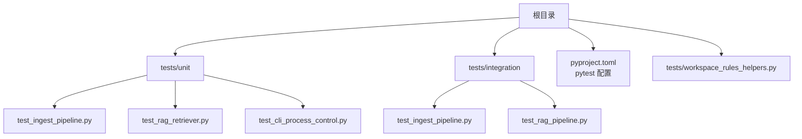
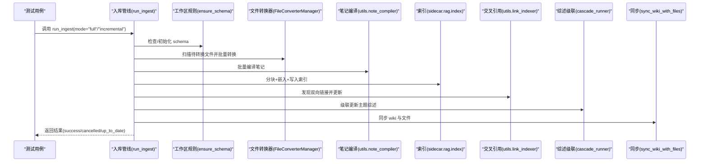
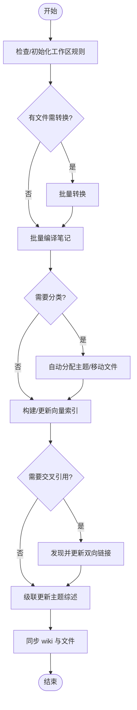
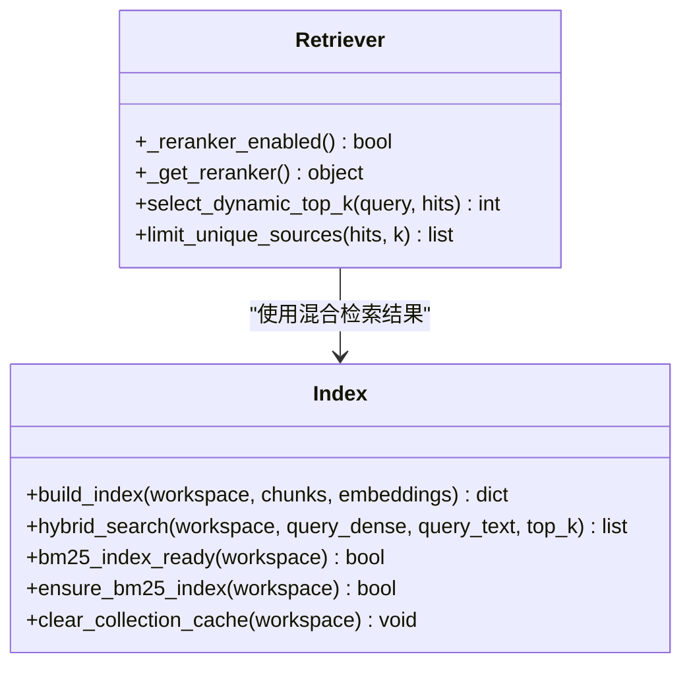
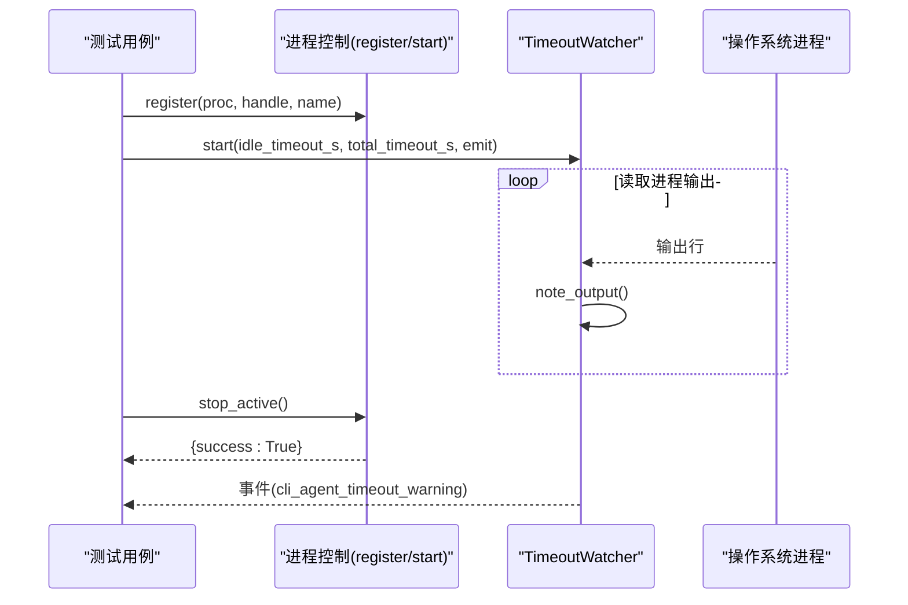
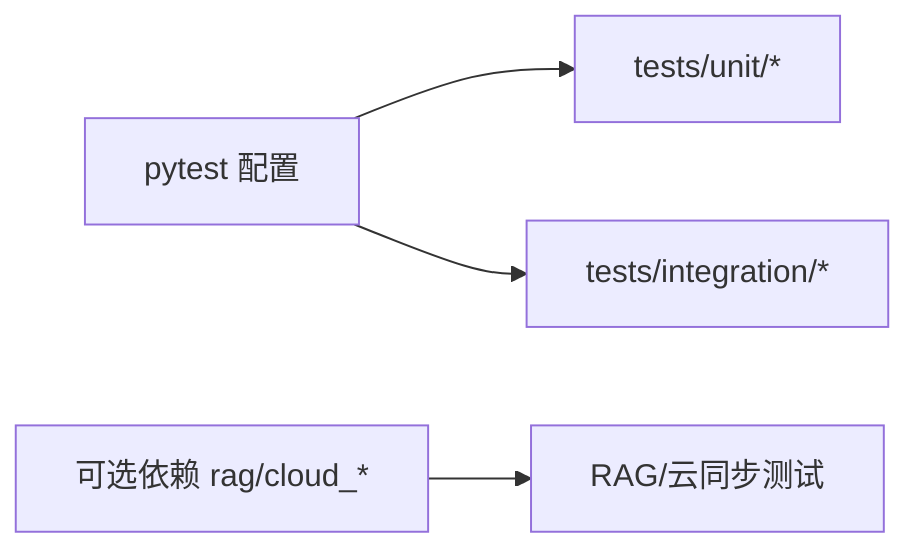

# 测试指南

<cite>
**本文引用的文件**   
- [README.md](file://README.md)
- [pyproject.toml](file://pyproject.toml)
- [tests/unit/test_ingest_pipeline.py](file://tests/unit/test_ingest_pipeline.py)
- [tests/integration/test_ingest_pipeline.py](file://tests/integration/test_ingest_pipeline.py)
- [tests/integration/test_rag_pipeline.py](file://tests/integration/test_rag_pipeline.py)
- [tests/unit/test_rag_retriever.py](file://tests/unit/test_rag_retriever.py)
- [tests/unit/test_cli_process_control.py](file://tests/unit/test_cli_process_control.py)
- [tests/workspace_rules_helpers.py](file://tests/workspace_rules_helpers.py)
</cite>

## 目录
1. [简介](#简介)
2. [项目结构](#项目结构)
3. [核心组件](#核心组件)
4. [架构总览](#架构总览)
5. [详细组件分析](#详细组件分析)
6. [依赖分析](#依赖分析)
7. [性能与压力测试](#性能与压力测试)
8. [故障排查指南](#故障排查指南)
9. [结论](#结论)
10. [附录](#附录)

## 简介
本指南面向 NoteAI 项目的测试实践，覆盖单元测试、集成测试、异步与并发相关测试、测试数据与环境隔离、覆盖率统计、持续集成与自动化执行、报告生成等。内容基于仓库现有测试代码与配置进行归纳总结，帮助读者快速上手并建立稳定的测试体系。

## 项目结构
NoteAI 的 Python 测试位于 tests 目录，按功能域划分为 unit 与 integration 两个子目录；pytest 通过 pyproject.toml 统一配置入口路径与插件开关。

图示来源
- [pyproject.toml:116-124](file://pyproject.toml#L116-L124)
- [tests/unit/test_ingest_pipeline.py:1-20](file://tests/unit/test_ingest_pipeline.py#L1-L20)
- [tests/integration/test_ingest_pipeline.py:1-26](file://tests/integration/test_ingest_pipeline.py#L1-L26)
- [tests/integration/test_rag_pipeline.py:1-34](file://tests/integration/test_rag_pipeline.py#L1-L34)
- [tests/unit/test_rag_retriever.py:1-20](file://tests/unit/test_rag_retriever.py#L1-L20)
- [tests/unit/test_cli_process_control.py:1-10](file://tests/unit/test_cli_process_control.py#L1-L10)
- [tests/workspace_rules_helpers.py:1-27](file://tests/workspace_rules_helpers.py#L1-L27)

章节来源
- [README.md:435-442](file://README.md#L435-L442)
- [pyproject.toml:116-124](file://pyproject.toml#L116-L124)

## 核心组件
本节聚焦测试基础设施与常用模式：工作区夹具、规则写入辅助、Mock/补丁策略、状态与取消控制、RAG 检索器开关与动态 TopK 等。

- 工作区夹具与隔离
  - 使用 pytest 的 tmp_path 创建临时工作区，并在 fixture 中设置 config.workspace_path，确保各用例互不干扰。
  - 参考路径：[tests/unit/test_ingest_pipeline.py:18-24](file://tests/unit/test_ingest_pipeline.py#L18-L24)、[tests/integration/test_ingest_pipeline.py:17-25](file://tests/integration/test_ingest_pipeline.py#L17-L25)、[tests/integration/test_rag_pipeline.py:26-33](file://tests/integration/test_rag_pipeline.py#L26-L33)。

- 工作区规则（schema）辅助
  - workspace_rules_helpers.write_workspace_rules 用于在 .noteai 下写入默认规则，避免每次手动准备。
  - 参考路径：[tests/workspace_rules_helpers.py:13-26](file://tests/workspace_rules_helpers.py#L13-L26)。

- Mock 与补丁
  - 大量使用 unittest.mock.patch 对 IO、外部模型、索引写入等进行打桩，保证单元与集成测试的可重复性与稳定性。
  - 参考路径：[tests/unit/test_ingest_pipeline.py:38-42](file://tests/unit/test_ingest_pipeline.py#L38-L42)、[tests/unit/test_ingest_pipeline.py:112-116](file://tests/unit/test_ingest_pipeline.py#L112-L116)。

- 状态与取消控制
  - ingest 流程支持运行状态持久化、中断恢复与取消信号；测试覆盖了正常完成、取消、增量“已是最新”、失败回滚等分支。
  - 参考路径：[tests/unit/test_ingest_pipeline.py:52-74](file://tests/unit/test_ingest_pipeline.py#L52-L74)、[tests/integration/test_ingest_pipeline.py:56-66](file://tests/integration/test_ingest_pipeline.py#L56-L66)。

- RAG 检索器开关与动态 TopK
  - 通过环境变量控制重排序器启用/禁用，并提供缓存与失败降级；动态 TopK 根据查询意图调整引用数量。
  - 参考路径：[tests/unit/test_rag_retriever.py:31-70](file://tests/unit/test_rag_retriever.py#L31-L70)、[tests/unit/test_rag_retriever.py:146-184](file://tests/unit/test_rag_retriever.py#L146-L184)。

章节来源
- [tests/unit/test_ingest_pipeline.py:18-24](file://tests/unit/test_ingest_pipeline.py#L18-L24)
- [tests/integration/test_ingest_pipeline.py:17-25](file://tests/integration/test_ingest_pipeline.py#L17-L25)
- [tests/integration/test_rag_pipeline.py:26-33](file://tests/integration/test_rag_pipeline.py#L26-L33)
- [tests/workspace_rules_helpers.py:13-26](file://tests/workspace_rules_helpers.py#L13-L26)
- [tests/unit/test_rag_retriever.py:31-70](file://tests/unit/test_rag_retriever.py#L31-L70)
- [tests/unit/test_rag_retriever.py:146-184](file://tests/unit/test_rag_retriever.py#L146-L184)

## 架构总览
下图展示入库流水线（Ingest）在测试中的关键交互：从规则检查、转换、编译、分类、索引、交叉引用、综述到同步，以及错误处理与恢复。

图示来源
- [tests/unit/test_ingest_pipeline.py:27-49](file://tests/unit/test_ingest_pipeline.py#L27-L49)
- [tests/integration/test_ingest_pipeline.py:184-214](file://tests/integration/test_ingest_pipeline.py#L184-L214)
- [tests/integration/test_rag_pipeline.py:98-163](file://tests/integration/test_rag_pipeline.py#L98-L163)

## 详细组件分析

### 入库管线（Ingest Pipeline）测试
- 目标
  - 验证全量与增量模式下的阶段推进、进度回调契约、取消与恢复、失败回滚、完整性修复等。
- 关键断言点
  - 成功完成时包含 rules/sync 阶段，事件中包含 ingest_complete，状态为 complete。
  - 取消后状态为 cancelled，且可被 clear_cancel 重置。
  - 增量模式下若工作区无变更，直接返回 up_to_date。
  - 空笔记会删除旧分块并标记已索引；索引写入失败不会提交索引状态。
  - 元数据不一致时触发整批重建；转换/分类失败仅回滚对应阶段。
  - resume 模式能恢复 pending_crossref_paths 与 affected_topics。
- 参考路径
  - [tests/unit/test_ingest_pipeline.py:27-49](file://tests/unit/test_ingest_pipeline.py#L27-L49)
  - [tests/unit/test_ingest_pipeline.py:52-74](file://tests/unit/test_ingest_pipeline.py#L52-L74)
  - [tests/unit/test_ingest_pipeline.py:76-96](file://tests/unit/test_ingest_pipeline.py#L76-L96)
  - [tests/unit/test_ingest_pipeline.py:107-141](file://tests/unit/test_ingest_pipeline.py#L107-L141)
  - [tests/unit/test_ingest_pipeline.py:144-171](file://tests/unit/test_ingest_pipeline.py#L144-L171)
  - [tests/unit/test_ingest_pipeline.py:173-212](file://tests/unit/test_ingest_pipeline.py#L173-L212)
  - [tests/unit/test_ingest_pipeline.py:214-236](file://tests/unit/test_ingest_pipeline.py#L214-L236)
  - [tests/unit/test_ingest_pipeline.py:238-286](file://tests/unit/test_ingest_pipeline.py#L238-L286)
  - [tests/unit/test_ingest_pipeline.py:288-294](file://tests/unit/test_ingest_pipeline.py#L288-L294)
  - [tests/integration/test_ingest_pipeline.py:28-66](file://tests/integration/test_ingest_pipeline.py#L28-L66)

图示来源
- [tests/unit/test_ingest_pipeline.py:27-49](file://tests/unit/test_ingest_pipeline.py#L27-L49)
- [tests/unit/test_ingest_pipeline.py:173-212](file://tests/unit/test_ingest_pipeline.py#L173-L212)

章节来源
- [tests/unit/test_ingest_pipeline.py:27-49](file://tests/unit/test_ingest_pipeline.py#L27-L49)
- [tests/unit/test_ingest_pipeline.py:173-212](file://tests/unit/test_ingest_pipeline.py#L173-L212)
- [tests/integration/test_ingest_pipeline.py:28-66](file://tests/integration/test_ingest_pipeline.py#L28-L66)

### RAG 检索器与索引测试
- 目标
  - 验证重排序器开关逻辑、缓存与失败降级、动态 TopK 选择、BM25 就绪性、集合缓存与锁重试、批量写入限制等。
- 关键点
  - 环境变量 NOTEAI_DISABLE_RERANKER / NOTEAI_ENABLE_RERANKER 控制行为，disable 优先于 enable。
  - 导入或初始化失败时设置禁用时间窗口，避免频繁重试。
  - select_dynamic_top_k 依据查询语义与证据强度自适应调整引用数；limit_unique_sources 控制唯一来源上限。
  - BM25 索引缺失时 ensure_bm25_index 可重建；zvec 集合打开失败会重试并清理陈旧锁。
- 参考路径
  - [tests/unit/test_rag_retriever.py:31-70](file://tests/unit/test_rag_retriever.py#L31-L70)
  - [tests/unit/test_rag_retriever.py:86-144](file://tests/unit/test_rag_retriever.py#L86-L144)
  - [tests/unit/test_rag_retriever.py:146-184](file://tests/unit/test_rag_retriever.py#L146-L184)
  - [tests/unit/test_rag_index.py:122-262](file://tests/unit/test_rag_index.py#L122-L262)
  - [tests/unit/test_rag_index.py:264-399](file://tests/unit/test_rag_index.py#L264-L399)
  - [tests/integration/test_rag_pipeline.py:98-163](file://tests/integration/test_rag_pipeline.py#L98-L163)

图示来源
- [tests/unit/test_rag_retriever.py:31-70](file://tests/unit/test_rag_retriever.py#L31-L70)
- [tests/unit/test_rag_retriever.py:146-184](file://tests/unit/test_rag_retriever.py#L146-L184)
- [tests/unit/test_rag_index.py:122-262](file://tests/unit/test_rag_index.py#L122-L262)

章节来源
- [tests/unit/test_rag_retriever.py:31-70](file://tests/unit/test_rag_retriever.py#L31-L70)
- [tests/unit/test_rag_retriever.py:146-184](file://tests/unit/test_rag_retriever.py#L146-L184)
- [tests/unit/test_rag_index.py:122-262](file://tests/unit/test_rag_index.py#L122-L262)
- [tests/integration/test_rag_pipeline.py:98-163](file://tests/integration/test_rag_pipeline.py#L98-L163)

### CLI Agent 进程控制测试
- 目标
  - 验证超时告警不终止进程、stop_active 能终止活跃进程、事件输出类型正确。
- 关键点
  - TimeoutWatcher 记录 idle/total 超时并产生 cli_agent_timeout_warning 事件。
  - stop_active 返回 success 并设置 stop_event。
- 参考路径
  - [tests/unit/test_cli_process_control.py:11-33](file://tests/unit/test_cli_process_control.py#L11-L33)
  - [tests/unit/test_cli_process_control.py:36-53](file://tests/unit/test_cli_process_control.py#L36-L53)

图示来源
- [tests/unit/test_cli_process_control.py:11-33](file://tests/unit/test_cli_process_control.py#L11-L33)
- [tests/unit/test_cli_process_control.py:36-53](file://tests/unit/test_cli_process_control.py#L36-L53)

章节来源
- [tests/unit/test_cli_process_control.py:11-33](file://tests/unit/test_cli_process_control.py#L11-L33)
- [tests/unit/test_cli_process_control.py:36-53](file://tests/unit/test_cli_process_control.py#L36-L53)

### 集成测试设计要点
- 端到端流程
  - 以真实工作区为边界，组合多个子系统（规则、转换、索引、检索），验证整体契约。
  - 参考路径：[tests/integration/test_ingest_pipeline.py:184-214](file://tests/integration/test_ingest_pipeline.py#L184-L214)、[tests/integration/test_rag_pipeline.py:190-212](file://tests/integration/test_rag_pipeline.py#L190-L212)。
- 数据库/索引测试
  - 针对 zvec/bm25s 的索引存在性、构建、删除、重建与搜索进行断言。
  - 参考路径：[tests/integration/test_rag_pipeline.py:98-163](file://tests/integration/test_rag_pipeline.py#L98-L163)、[tests/unit/test_rag_index.py:122-262](file://tests/unit/test_rag_index.py#L122-L262)。
- 文件系统测试
  - 利用 tmp_path 构造 Notes/wiki/Raw 目录，断言产物与状态文件。
  - 参考路径：[tests/integration/test_ingest_pipeline.py:17-25](file://tests/integration/test_ingest_pipeline.py#L17-L25)、[tests/integration/test_rag_pipeline.py:26-33](file://tests/integration/test_rag_pipeline.py#L26-L33)。

章节来源
- [tests/integration/test_ingest_pipeline.py:184-214](file://tests/integration/test_ingest_pipeline.py#L184-L214)
- [tests/integration/test_rag_pipeline.py:98-163](file://tests/integration/test_rag_pipeline.py#L98-L163)
- [tests/integration/test_rag_pipeline.py:190-212](file://tests/integration/test_rag_pipeline.py#L190-L212)

## 依赖分析
- 测试框架与插件
  - pytest 作为主框架，pythonpath 指向 "." 与 "python"，测试路径包含 unit 与 integration。
  - 关闭 langsmith_plugin 以避免 CI 缺少 API Key 导致异常。
- 可选依赖
  - rag 额外依赖用于向量化与检索；cloud_* 扩展按需安装。
- 参考路径
  - [pyproject.toml:116-124](file://pyproject.toml#L116-L124)
  - [pyproject.toml:38-58](file://pyproject.toml#L38-L58)

图示来源
- [pyproject.toml:116-124](file://pyproject.toml#L116-L124)
- [pyproject.toml:38-58](file://pyproject.toml#L38-L58)

章节来源
- [pyproject.toml:116-124](file://pyproject.toml#L116-L124)
- [pyproject.toml:38-58](file://pyproject.toml#L38-L58)

## 性能与压力测试
- 建议方法
  - 基准测试：对索引构建、混合检索、BM25 重建等热点路径编写耗时断言，结合 pytest-benchmark 或 timeit 进行回归监控。
  - 压力测试：批量写入大文档集合并评估索引吞吐与内存峰值；模拟并发打开/关闭 zvec 集合，验证锁竞争与重试机制。
  - 资源隔离：使用独立 tmp_path 与独立的 .noteai 目录，避免共享状态影响结果。
- 参考实现思路
  - 复用现有索引与检索测试结构，将数据规模放大并增加断言阈值。
  - 参考路径：[tests/unit/test_rag_index.py:264-399](file://tests/unit/test_rag_index.py#L264-L399)、[tests/integration/test_rag_pipeline.py:98-163](file://tests/integration/test_rag_pipeline.py#L98-L163)。

[本节为通用指导，不直接分析具体文件]

## 故障排查指南
- 常见问题定位
  - 索引写入失败：确认 replace_file_chunks 是否抛出异常，并确保 mark_many_indexed 未被调用（未提交）。
    - 参考路径：[tests/unit/test_ingest_pipeline.py:126-141](file://tests/unit/test_ingest_pipeline.py#L126-L141)
  - 取消信号泄漏：确保 request_cancel 后 is_cancelled 为真，clear_cancel 后为假。
    - 参考路径：[tests/integration/test_ingest_pipeline.py:56-66](file://tests/integration/test_ingest_pipeline.py#L56-L66)
  - 重排序器不可用：检查环境变量与禁用时间窗口，确认 _get_reranker 返回 None。
    - 参考路径：[tests/unit/test_rag_retriever.py:86-144](file://tests/unit/test_rag_retriever.py#L86-L144)
  - 进程超时告警：确认事件类型为 cli_agent_timeout_warning，且 stop_active 能终止进程。
    - 参考路径：[tests/unit/test_cli_process_control.py:11-33](file://tests/unit/test_cli_process_control.py#L11-L33)

章节来源
- [tests/unit/test_ingest_pipeline.py:126-141](file://tests/unit/test_ingest_pipeline.py#L126-L141)
- [tests/integration/test_ingest_pipeline.py:56-66](file://tests/integration/test_ingest_pipeline.py#L56-L66)
- [tests/unit/test_rag_retriever.py:86-144](file://tests/unit/test_rag_retriever.py#L86-L144)
- [tests/unit/test_cli_process_control.py:11-33](file://tests/unit/test_cli_process_control.py#L11-L33)

## 结论
NoteAI 的测试体系围绕 pytest 组织，采用临时工作区与丰富的 Mock/补丁策略，覆盖入库流水线、RAG 检索与索引、CLI 进程控制等核心能力。建议在后续迭代中补充覆盖率统计与性能回归测试，并将自动化执行纳入 CI，形成稳定可靠的反馈闭环。

[本节为总结性内容，不直接分析具体文件]

## 附录
- 运行方式
  - 本地运行：参考 README 提供的命令，先安装开发依赖再执行 pytest。
    - 参考路径：[README.md:435-442](file://README.md#L435-L442)
- 测试环境隔离
  - 所有涉及工作区的测试均使用 tmp_path 与独立的 .noteai 目录，避免相互污染。
    - 参考路径：[tests/unit/test_ingest_pipeline.py:18-24](file://tests/unit/test_ingest_pipeline.py#L18-L24)、[tests/integration/test_ingest_pipeline.py:17-25](file://tests/integration/test_ingest_pipeline.py#L17-L25)
- 测试数据管理
  - 使用 write_workspace_rules 快速生成规则文件；在测试内创建 Notes/wiki/Raw 目录与示例 Markdown。
    - 参考路径：[tests/workspace_rules_helpers.py:13-26](file://tests/workspace_rules_helpers.py#L13-L26)
- 覆盖率与报告（建议）
  - 可在 pyproject.toml 的 pytest addopts 中加入 --cov 与 --cov-report 参数，生成 HTML/XML 报告，便于 CI 归档与质量门禁。
  - 参考路径：[pyproject.toml:116-124](file://pyproject.toml#L116-L124)

章节来源
- [README.md:435-442](file://README.md#L435-L442)
- [tests/unit/test_ingest_pipeline.py:18-24](file://tests/unit/test_ingest_pipeline.py#L18-L24)
- [tests/integration/test_ingest_pipeline.py:17-25](file://tests/integration/test_ingest_pipeline.py#L17-L25)
- [tests/workspace_rules_helpers.py:13-26](file://tests/workspace_rules_helpers.py#L13-L26)
- [pyproject.toml:116-124](file://pyproject.toml#L116-L124)