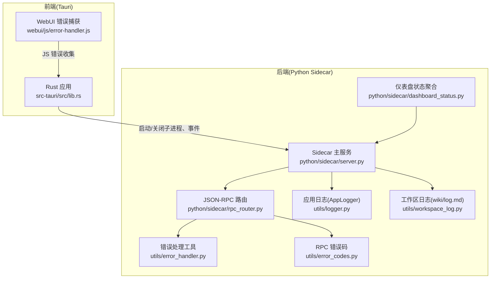
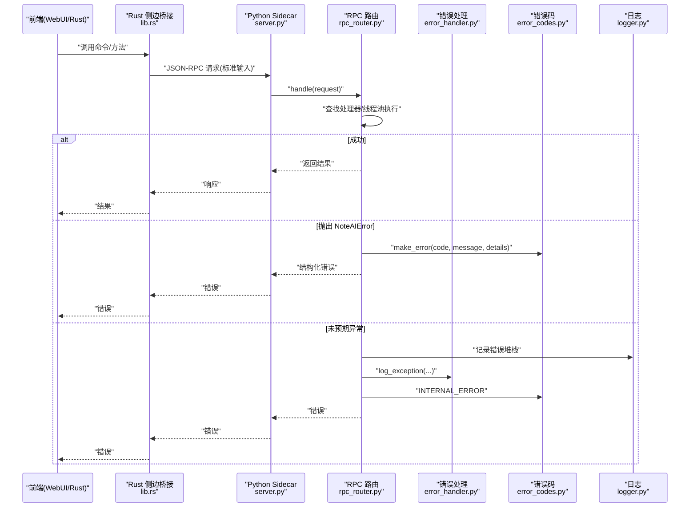
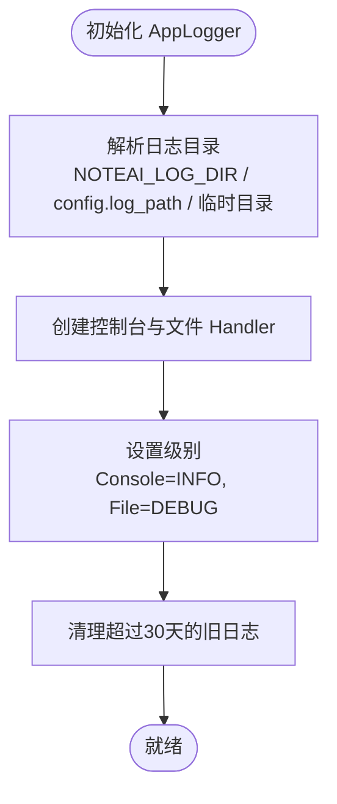
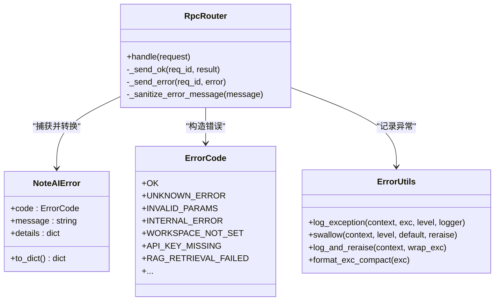
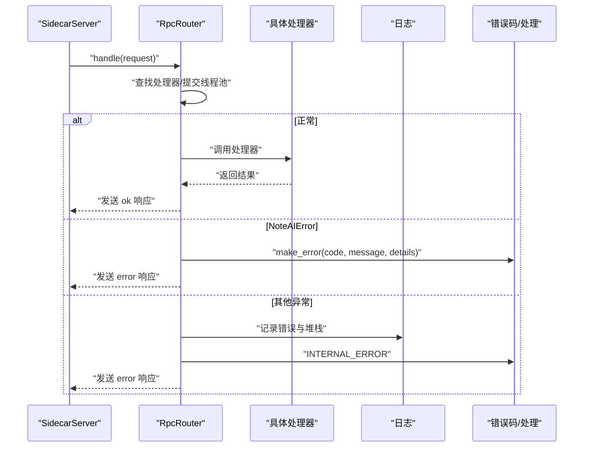
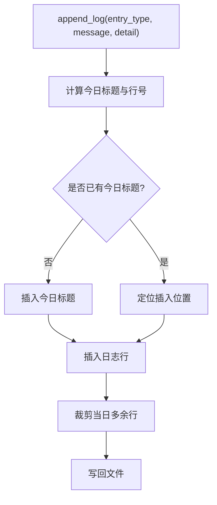
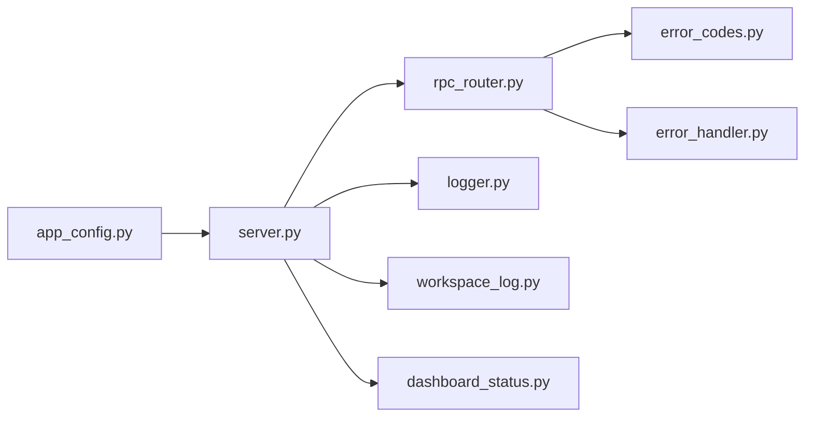

# 调试与故障排除

<cite>
**本文引用的文件**   
- [utils/logger.py](file://utils/logger.py)
- [utils/error_handler.py](file://utils/error_handler.py)
- [utils/error_codes.py](file://utils/error_codes.py)
- [config/app_config.py](file://config/app_config.py)
- [python/sidecar/server.py](file://python/sidecar/server.py)
- [python/sidecar/rpc_router.py](file://python/sidecar/rpc_router.py)
- [webui/js/error-handler.js](file://webui/js/error-handler.js)
- [src-tauri/src/lib.rs](file://src-tauri/src/lib.rs)
- [utils/workspace_log.py](file://utils/workspace_log.py)
- [python/sidecar/dashboard_status.py](file://python/sidecar/dashboard_status.py)
</cite>

## 目录
1. [简介](#简介)
2. [项目结构](#项目结构)
3. [核心组件](#核心组件)
4. [架构总览](#架构总览)
5. [详细组件分析](#详细组件分析)
6. [依赖关系分析](#依赖关系分析)
7. [性能考虑](#性能考虑)
8. [故障排除指南](#故障排除指南)
9. [结论](#结论)
10. [附录](#附录)

## 简介
本指南面向 NoteAI 的开发者与运维人员，聚焦于调试与故障排除。内容覆盖：
- 日志系统使用（级别、输出位置、结构化日志、日志分析）
- 前后端调试技巧（浏览器开发者工具、Python 调试器、Rust 调试器）
- 性能分析与优化建议
- 常见问题诊断（启动失败、内存泄漏、性能瓶颈）
- 错误码参考与恢复策略
- 监控告警配置思路与生产环境问题排查流程

## 项目结构
NoteAI 采用 Tauri + Python Sidecar 的混合架构：
- Rust 前端（Tauri）负责 UI 与进程管理
- Python Sidecar 通过 JSON-RPC 提供业务能力（工作区、RAG、任务、云同步等）
- 统一日志与错误处理贯穿前后端

图表来源
- [src-tauri/src/lib.rs:10-82](file://src-tauri/src/lib.rs#L10-L82)
- [python/sidecar/server.py:54-125](file://python/sidecar/server.py#L54-L125)
- [python/sidecar/rpc_router.py:43-106](file://python/sidecar/rpc_router.py#L43-L106)
- [utils/logger.py:13-60](file://utils/logger.py#L13-L60)
- [utils/error_handler.py:24-120](file://utils/error_handler.py#L24-L120)
- [utils/error_codes.py:14-120](file://utils/error_codes.py#L14-L120)
- [utils/workspace_log.py:21-80](file://utils/workspace_log.py#L21-L80)
- [python/sidecar/dashboard_status.py:112-124](file://python/sidecar/dashboard_status.py#L112-L124)

章节来源
- [src-tauri/src/lib.rs:10-82](file://src-tauri/src/lib.rs#L10-L82)
- [python/sidecar/server.py:54-125](file://python/sidecar/server.py#L54-L125)
- [python/sidecar/rpc_router.py:43-106](file://python/sidecar/rpc_router.py#L43-L106)
- [utils/logger.py:13-60](file://utils/logger.py#L13-L60)
- [utils/error_handler.py:24-120](file://utils/error_handler.py#L24-L120)
- [utils/error_codes.py:14-120](file://utils/error_codes.py#L14-L120)
- [utils/workspace_log.py:21-80](file://utils/workspace_log.py#L21-L80)
- [python/sidecar/dashboard_status.py:112-124](file://python/sidecar/dashboard_status.py#L112-L124)

## 核心组件
- 应用日志管理器 AppLogger：线程安全单例，支持控制台与轮转文件输出，自动清理旧日志，并提供最近日志读取接口。
- RPC 错误处理：统一的错误码枚举、结构化错误构造、异常包装与重抛装饰器。
- JSON-RPC 路由：线程池执行处理器，统一捕获并格式化错误，屏蔽敏感路径信息。
- 工作区日志 wiki/log.md：按日分组的变更日志，便于 grep 与分析。
- 仪表盘状态聚合：汇总待办、索引、入库、任务等运行态指标。

章节来源
- [utils/logger.py:13-126](file://utils/logger.py#L13-L126)
- [utils/error_handler.py:24-120](file://utils/error_handler.py#L24-L120)
- [utils/error_codes.py:14-120](file://utils/error_codes.py#L14-L120)
- [python/sidecar/rpc_router.py:43-106](file://python/sidecar/rpc_router.py#L43-L106)
- [utils/workspace_log.py:21-80](file://utils/workspace_log.py#L21-L80)
- [python/sidecar/dashboard_status.py:112-124](file://python/sidecar/dashboard_status.py#L112-L124)

## 架构总览
下图展示一次 RPC 请求从前端到后端的完整调用链及错误处理路径。

图表来源
- [src-tauri/src/lib.rs:10-82](file://src-tauri/src/lib.rs#L10-L82)
- [python/sidecar/server.py:540-595](file://python/sidecar/server.py#L540-L595)
- [python/sidecar/rpc_router.py:54-106](file://python/sidecar/rpc_router.py#L54-L106)
- [utils/error_handler.py:24-120](file://utils/error_handler.py#L24-L120)
- [utils/error_codes.py:82-120](file://utils/error_codes.py#L82-L120)
- [utils/logger.py:92-126](file://utils/logger.py#L92-L126)

## 详细组件分析

### 日志系统（AppLogger）
- 日志级别与输出
  - 默认 logger 级别为 DEBUG；控制台 handler 默认 INFO；文件 handler 为 DEBUG。
  - 文件输出采用轮转（大小与保留份数），并自动清理超过 30 天的日志。
- 日志目录解析优先级
  - 环境变量 NOTEAI_LOG_DIR > 配置项 log_path > 临时目录下的 NoteAI/logs。
- 运行时读取最近日志
  - 提供 get_logs(lines) 接口用于快速查看尾部日志。

图表来源
- [utils/logger.py:28-91](file://utils/logger.py#L28-L91)

章节来源
- [utils/logger.py:13-126](file://utils/logger.py#L13-L126)

### 错误处理与错误码
- 结构化错误码
  - ErrorCode 枚举覆盖通用、工作区、认证、RAG、特性可用性、模式验证、云同步、UI/Tauri 等场景。
  - make_error 构造标准错误负载；NoteAIError 作为领域异常携带 code/message/details。
- 统一异常记录
  - log_exception 在 except 块中替代裸 pass，支持自定义级别与 logger。
  - swallow 装饰器捕获异常并返回默认值；log_and_reraise 记录后重新抛出或包装。
- RPC 层错误净化
  - _sanitize_error_message 移除绝对路径与家目录提示，避免泄露敏感信息。

图表来源
- [utils/error_codes.py:14-120](file://utils/error_codes.py#L14-L120)
- [utils/error_handler.py:24-120](file://utils/error_handler.py#L24-L120)
- [python/sidecar/rpc_router.py:14-106](file://python/sidecar/rpc_router.py#L14-L106)

章节来源
- [utils/error_codes.py:14-120](file://utils/error_codes.py#L14-L120)
- [utils/error_handler.py:24-120](file://utils/error_handler.py#L24-L120)
- [python/sidecar/rpc_router.py:14-106](file://python/sidecar/rpc_router.py#L14-L106)

### JSON-RPC 路由与线程池
- 路由注册与分发
  - SidecarServer 在构造时注册各模块处理器到 RpcRouter。
- 线程池执行
  - 所有处理器提交至线程池，避免阻塞 stdin 读取循环。
- 错误收敛
  - 捕获 NoteAIError 与普通 Exception，分别走结构化错误与内部错误路径，并记录堆栈。

图表来源
- [python/sidecar/server.py:107-124](file://python/sidecar/server.py#L107-L124)
- [python/sidecar/rpc_router.py:54-106](file://python/sidecar/rpc_router.py#L54-L106)

章节来源
- [python/sidecar/server.py:107-124](file://python/sidecar/server.py#L107-L124)
- [python/sidecar/rpc_router.py:54-106](file://python/sidecar/rpc_router.py#L54-L106)

### 工作区日志（wiki/log.md）
- 统一写入格式：按日期分组，时间戳+类型+消息，便于 grep 与统计。
- 迁移兼容：自动合并历史 activity_log.json 与旧 log.md 到新格式。
- 限制：每日最多保留固定行数，防止无限增长。

图表来源
- [utils/workspace_log.py:36-80](file://utils/workspace_log.py#L36-L80)

章节来源
- [utils/workspace_log.py:21-80](file://utils/workspace_log.py#L21-L80)
- [utils/workspace_log.py:229-254](file://utils/workspace_log.py#L229-L254)

### 仪表盘状态聚合
- 聚合工作区统计、待办摘要、RAG 索引状态、入库状态、任务列表等，便于快速定位问题。

章节来源
- [python/sidecar/dashboard_status.py:20-124](file://python/sidecar/dashboard_status.py#L20-L124)

## 依赖关系分析
- 组件耦合
  - server.py 依赖 rpc_router、handlers、logger、workspace_log、job_status 等。
  - rpc_router.py 依赖 error_codes、error_handler、logger。
  - app_config.py 提供全局配置，影响日志路径、RAG 开关、自动入库等。
- 外部依赖
  - Tauri 进程管理与事件通道
  - watchdog 文件系统监听（在 sidecar 中启用）

图表来源
- [config/app_config.py:28-100](file://config/app_config.py#L28-L100)
- [python/sidecar/server.py:54-125](file://python/sidecar/server.py#L54-L125)
- [python/sidecar/rpc_router.py:43-106](file://python/sidecar/rpc_router.py#L43-L106)
- [utils/logger.py:13-60](file://utils/logger.py#L13-L60)
- [utils/workspace_log.py:21-80](file://utils/workspace_log.py#L21-L80)
- [python/sidecar/dashboard_status.py:112-124](file://python/sidecar/dashboard_status.py#L112-L124)

章节来源
- [config/app_config.py:28-100](file://config/app_config.py#L28-L100)
- [python/sidecar/server.py:54-125](file://python/sidecar/server.py#L54-L125)
- [python/sidecar/rpc_router.py:43-106](file://python/sidecar/rpc_router.py#L43-L106)
- [utils/logger.py:13-60](file://utils/logger.py#L13-L60)
- [utils/workspace_log.py:21-80](file://utils/workspace_log.py#L21-L80)
- [python/sidecar/dashboard_status.py:112-124](file://python/sidecar/dashboard_status.py#L112-L124)

## 性能考虑
- 线程池与并发
  - RPC 处理器通过线程池执行，避免阻塞 I/O；注意合理设置最大工作线程数，避免过度竞争。
- 缓存与失效
  - Sidecar 维护 TTL 缓存并在文件变更时失效；RAG 查询缓存独立管理，避免锁冲突。
- 日志开销
  - 文件日志采用轮转与定期清理；控制台仅输出 INFO 及以上，降低开发期开销。
- 资源释放
  - shutdown 阶段显式关闭 LLM 执行器、检索执行器与集合缓存，避免僵尸线程与句柄泄漏。

[本节为通用指导，不直接分析具体文件]

## 故障排除指南

### 日志系统使用方法
- 日志级别配置
  - 全局 logger 级别为 DEBUG；控制台 handler 默认 INFO；文件 handler 为 DEBUG。可通过调整 handler 级别控制输出量。
- 日志输出位置
  - 优先使用环境变量 NOTEAI_LOG_DIR；否则使用配置的 log_path；最后回退到临时目录。
- 结构化日志输出
  - 使用 utils.error_handler.log_exception 在异常分支记录上下文与级别；RPC 层将异常转换为结构化错误码。
- 日志分析工具
  - 终端 grep：搜索 noteai.log 中的 ERROR/WARNING 关键字。
  - 工作区日志：查看 wiki/log.md，按天分组，便于追踪变更与流水线事件。
  - 最近日志：通过 AppLogger.get_logs(lines) 获取尾部 N 行。

章节来源
- [utils/logger.py:37-91](file://utils/logger.py#L37-L91)
- [utils/logger.py:110-126](file://utils/logger.py#L110-L126)
- [utils/error_handler.py:24-120](file://utils/error_handler.py#L24-L120)
- [utils/workspace_log.py:21-80](file://utils/workspace_log.py#L21-L80)

### 前后端调试技巧
- 浏览器开发者工具
  - WebUI 内置错误面板：window.onerror 与 unhandledrejection 会收集错误并显示在页面错误面板中。
- Python 调试器
  - 在 Sidecar 入口 main() 处附加调试器，观察 JSON-RPC 请求/响应与异常路径。
- Rust 调试器
  - 在 lib.rs 的 run() 中设置断点，跟踪 Python Sidecar 启动、事件派发与窗口关闭时的清理逻辑。

章节来源
- [webui/js/error-handler.js:11-20](file://webui/js/error-handler.js#L11-L20)
- [python/sidecar/server.py:570-595](file://python/sidecar/server.py#L570-L595)
- [src-tauri/src/lib.rs:10-82](file://src-tauri/src/lib.rs#L10-L82)

### 性能分析工具使用
- Python
  - 使用 cProfile 对热点函数进行采样；结合线程池与缓存失效点进行定位。
- Rust
  - 使用 cargo flamegraph 生成火焰图，定位 CPU 热点；配合 tokio-console 观察异步任务。
- 前端
  - Chrome Performance 面板录制关键交互，关注长任务与布局抖动。

[本节为通用指导，不直接分析具体文件]

### 常见问题诊断方法
- 启动失败
  - 检查 Rust 侧是否成功启动 Python Sidecar；若失败，查看 Rust 控制台输出与事件“sidecar_error”。
  - 确认工作区路径存在且可写；必要时检查权限与磁盘空间。
- 内存泄漏
  - 关注 Sidecar shutdown 阶段是否关闭执行器与缓存；长时间运行的任务需确保线程退出与句柄释放。
- 性能瓶颈
  - 观察 RPC 线程池队列长度与处理器耗时；检查 RAG 索引构建与全文检索缓存命中情况。

章节来源
- [src-tauri/src/lib.rs:20-35](file://src-tauri/src/lib.rs#L20-L35)
- [python/sidecar/server.py:544-568](file://python/sidecar/server.py#L544-L568)
- [python/sidecar/rpc_router.py:43-106](file://python/sidecar/rpc_router.py#L43-L106)

### 错误码参考
- 通用错误
  - UNKNOWN_ERROR、INVALID_PARAMS、INTERNAL_ERROR、NOT_IMPLEMENTED、METHOD_NOT_FOUND、OPERATION_CANCELLED、TIMEOUT
- 工作区/路径
  - WORKSPACE_NOT_SET、WORKSPACE_NOT_FOUND、PATH_OUTSIDE_WORKSPACE、PATH_INVALID、PATH_CONTAINS_ILLEGAL_CHARS、FILE_NOT_FOUND、FILE_TOO_LARGE、FILE_READ_ONLY、DIRECTORY_PROTECTED
- 认证/凭据
  - API_KEY_MISSING、API_KEY_INVALID、API_CONNECTION_FAILED、CLOUD_AUTH_FAILED、CLOUD_NOT_CONNECTED
- RAG/索引
  - RAG_NOT_ENABLED、RAG_INDEX_EMPTY、RAG_INDEX_BUILDING、RAG_RETRIEVAL_FAILED、RAG_LLM_CALL_FAILED、RAG_RERANKER_UNAVAILABLE
- 特性可用性
  - FEATURE_NOT_INSTALLED、DEPENDENCY_MISSING、CLI_AGENT_NOT_FOUND、CLI_AGENT_EXEC_FAILED
- Schema/入库
  - SCHEMA_NOT_SETUP、SCHEMA_INVALID、INGEST_IN_PROGRESS、INGEST_FAILED、CONVERSION_FAILED
- 校验
  - PROMPT_EMPTY、PROMPT_TOO_LONG、PROMPT_INVALID、TOPIC_NOT_FOUND、TAG_INVALID
- 云同步
  - CLOUD_PROVIDER_UNKNOWN、CLOUD_SYNC_IN_PROGRESS、CLOUD_SYNC_FAILED
- UI/Tauri
  - NOT_RUNNING_IN_TAURI、WINDOW_OPERATION_FAILED

章节来源
- [utils/error_codes.py:14-80](file://utils/error_codes.py#L14-L80)

### 恢复策略
- 参数错误
  - 根据 INVALID_PARAMS 提示修正请求参数；前端依据 code 进行 i18n 提示。
- 工作区未设置/不存在
  - 设置有效 workspace_path 并确保目录存在；必要时触发 setup_workspace_folders。
- RAG 索引缺失/不一致
  - 触发重建索引；若 busy 或 needs_rebuild，等待或手动重建。
- 云同步失败
  - 检查认证与连接状态；重试前确认 provider 可用性与网络连通性。
- 任务失败/取消
  - 查看 job_status 详情；对于可重试状态，调用相应接口重试。

章节来源
- [config/app_config.py:146-175](file://config/app_config.py#L146-L175)
- [python/sidecar/dashboard_status.py:62-95](file://python/sidecar/dashboard_status.py#L62-L95)
- [python/sidecar/server.py:145-182](file://python/sidecar/server.py#L145-L182)

### 监控告警配置
- 指标采集
  - 使用 dashboard_status 聚合指标：待办数量、RAG 索引状态、入库进度、任务列表。
- 告警规则
  - 当 RAG 索引 needs_rebuild 持续较长时间、入库状态长期 failed/interrupted、任务队列积压时触发告警。
- 日志告警
  - 基于 noteai.log 与 wiki/log.md 的关键字（ERROR、FAILED、TIMEOUT）建立告警规则。

章节来源
- [python/sidecar/dashboard_status.py:112-124](file://python/sidecar/dashboard_status.py#L112-L124)
- [utils/logger.py:81-91](file://utils/logger.py#L81-L91)
- [utils/workspace_log.py:21-80](file://utils/workspace_log.py#L21-L80)

### 生产环境问题排查流程
- 快速定位
  - 查看 Rust 控制台与事件“sidecar_error”；确认 Python Sidecar 是否存活。
  - 检查 noteai.log 尾部与 wiki/log.md 最新条目。
- 深入分析
  - 抓取 RPC 错误码与详细信息；核对工作区路径与权限。
  - 评估 RAG 索引状态与入库流水线状态。
- 恢复与验证
  - 执行必要的修复操作（重建索引、重试任务、修正配置）；观察仪表盘状态与日志变化。

章节来源
- [src-tauri/src/lib.rs:20-35](file://src-tauri/src/lib.rs#L20-L35)
- [python/sidecar/server.py:570-595](file://python/sidecar/server.py#L570-L595)
- [python/sidecar/dashboard_status.py:112-124](file://python/sidecar/dashboard_status.py#L112-L124)
- [utils/logger.py:110-126](file://utils/logger.py#L110-L126)
- [utils/workspace_log.py:21-80](file://utils/workspace_log.py#L21-L80)

## 结论
NoteAI 的调试与排障体系围绕“统一日志、结构化错误、集中路由、工作区日志与仪表盘状态”展开。通过合理的日志级别、错误码规范与前后端协同，能够快速定位问题并采取恢复措施。在生产环境中，建议结合指标采集与日志告警，形成闭环的监控与排障流程。

## 附录
- 常用命令与环境变量
  - NOTEAI_LOG_DIR：指定日志目录
  - NOTEAI_API_KEY、NOTEAI_API_BASE、NOTEAI_MODEL_NAME、NOTEAI_TEMPERATURE、NOTEAI_MAX_TOKENS、NOTEAI_MAX_CONTEXT、NOTEAI_WORKSPACE_PATH：配置覆盖
- 关键路径
  - 应用日志：noteai.log（轮转与清理）
  - 工作区日志：wiki/log.md（按日分组）
  - 仪表盘状态：通过聚合接口获取

章节来源
- [config/app_config.py:261-311](file://config/app_config.py#L261-L311)
- [utils/logger.py:61-91](file://utils/logger.py#L61-L91)
- [utils/workspace_log.py:21-80](file://utils/workspace_log.py#L21-L80)
- [python/sidecar/dashboard_status.py:112-124](file://python/sidecar/dashboard_status.py#L112-L124)