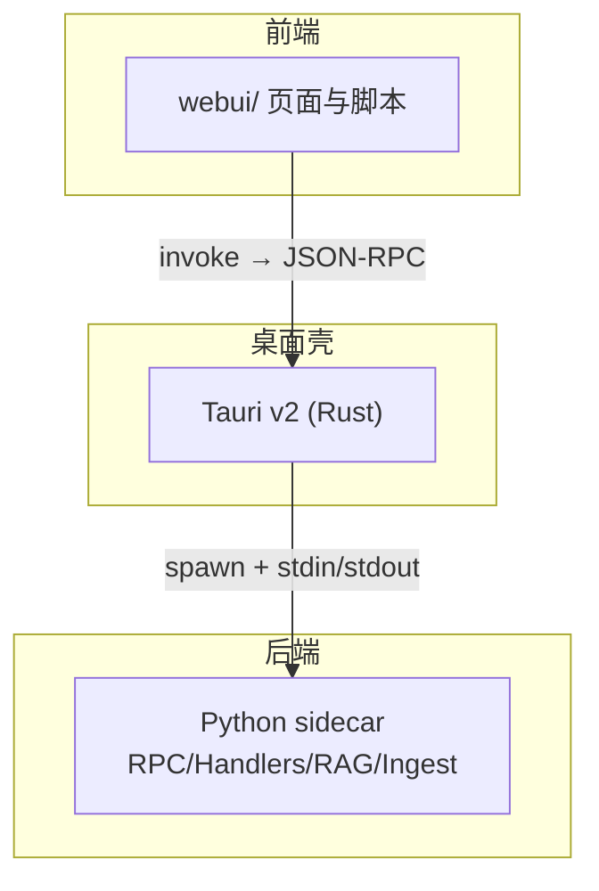
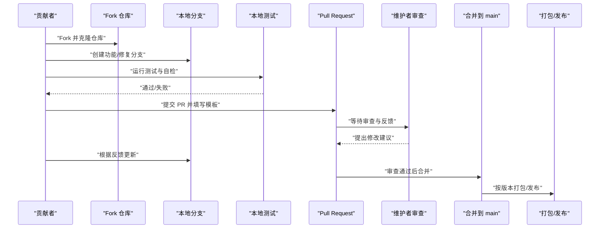
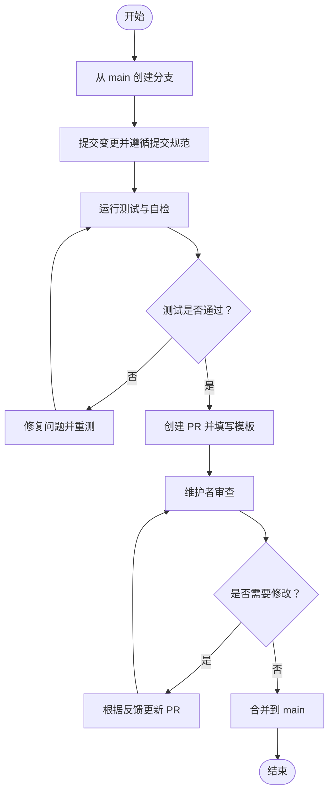
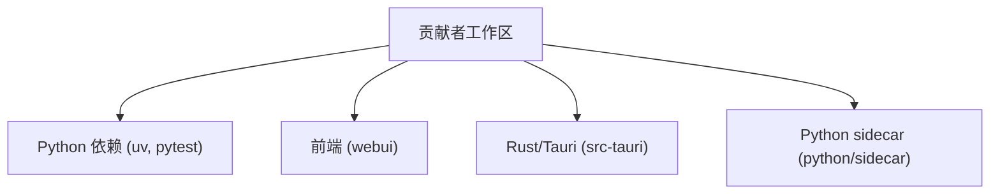

# 贡献指南

<cite>
**本文引用的文件**   
- [CONTRIBUTING.md](file://CONTRIBUTING.md)
- [SECURITY.md](file://SECURITY.md)
- [README.md](file://README.md)
- [PULL_REQUEST_TEMPLATE.md](file://.github/PULL_REQUEST_TEMPLATE.md)
- [bug_report.md](file://.github/ISSUE_TEMPLATE/bug_report.md)
- [feature_request.md](file://.github/ISSUE_TEMPLATE/feature_request.md)
- [question.md](file://.github/ISSUE_TEMPLATE/question.md)
- [AGENTS.md](file://AGENTS.md)
</cite>

## 目录
1. [简介](#简介)
2. [项目结构](#项目结构)
3. [核心组件](#核心组件)
4. [架构总览](#架构总览)
5. [详细组件分析](#详细组件分析)
6. [依赖分析](#依赖分析)
7. [性能考虑](#性能考虑)
8. [故障排查指南](#故障排查指南)
9. [结论](#结论)
10. [附录](#附录)

## 简介
本指南面向所有希望参与 NoteAI 项目的贡献者，涵盖从入门到提交代码、文档与翻译的完整流程。内容基于仓库现有规范整理，确保你以一致的方式参与协作，提升评审效率与发布质量。

## 项目结构
NoteAI 采用“前端 + Rust 桌面壳 + Python sidecar”的分层架构：
- 前端（webui）：HTML/CSS/原生 JS，通过 Tauri invoke 调用后端能力
- Rust 壳（src-tauri）：承载前端页面并桥接 JSON-RPC 到 Python sidecar
- Python sidecar（python/sidecar）：实现 RPC 路由、业务处理器、RAG、入库流水线等

图表来源
- [README.md:155-170](file://README.md#L155-L170)
- [AGENTS.md:18-26](file://AGENTS.md#L18-L26)

章节来源
- [README.md:190-203](file://README.md#L190-L203)
- [AGENTS.md:18-26](file://AGENTS.md#L18-L26)

## 核心组件
本节聚焦贡献相关的关键入口与模板：
- 贡献总则与开发规范：见贡献指南
- Issue 模板：Bug、功能请求、问题咨询
- Pull Request 模板：变更说明、测试、检查清单
- 安全策略：漏洞报告渠道与披露流程

章节来源
- [CONTRIBUTING.md:1-108](file://CONTRIBUTING.md#L1-L108)
- [bug_report.md:1-41](file://.github/ISSUE_TEMPLATE/bug_report.md#L1-L41)
- [feature_request.md:1-20](file://.github/ISSUE_TEMPLATE/feature_request.md#L1-L20)
- [question.md:1-21](file://.github/ISSUE_TEMPLATE/question.md#L1-L21)
- [PULL_REQUEST_TEMPLATE.md:1-37](file://.github/PULL_REQUEST_TEMPLATE.md#L1-L37)
- [SECURITY.md:1-40](file://SECURITY.md#L1-L40)

## 架构总览
下图展示贡献者在本地完成开发、测试、提交流程的整体路径，以及 CI 审查与合并后的发布阶段。

[此图为概念性流程图，无需图表来源]

## 详细组件分析

### 代码贡献流程
- 环境准备
  - 使用 uv 安装开发依赖（含 RAG 可选）
  - 启动开发模式（包含 Python sidecar）
- 分支管理
  - main：稳定版本
  - feat/*：新功能
  - fix/*：修复
  - refactor/*：重构
- 提交规范
  - 遵循 Conventional Commits 格式
  - 类型包括：feat、fix、docs、style、refactor、test、chore
- 本地自检
  - Python：ruff 格式化与检查
  - JavaScript：ESLint（即将配置）
  - Rust：cargo clippy 与 rustfmt
- 提交前检查
  - 确保单元测试通过
  - 更新必要文档与注释

章节来源
- [CONTRIBUTING.md:6-18](file://CONTRIBUTING.md#L6-L18)
- [CONTRIBUTING.md:20-65](file://CONTRIBUTING.md#L20-L65)
- [CONTRIBUTING.md:66-72](file://CONTRIBUTING.md#L66-L72)
- [CONTRIBUTING.md:73-79](file://CONTRIBUTING.md#L73-L79)

### Pull Request 创建与审查流程
- 从 main 拉取最新代码，创建分支并提交变更
- 在 PR 中填写模板：变更说明、变更类型、测试步骤、截图（如有）、关联 Issue
- 维护者进行代码审查，可能要求补充测试或调整风格
- 审查通过后合并至 main；必要时打标签与记录变更日志

[此图为概念性流程图，无需图表来源]

章节来源
- [PULL_REQUEST_TEMPLATE.md:1-37](file://.github/PULL_REQUEST_TEMPLATE.md#L1-L37)
- [CONTRIBUTING.md:73-79](file://CONTRIBUTING.md#L73-L79)

### Issue 报告规范
- Bug 报告
  - 提供操作系统与版本、NoteAI 版本、复现步骤、期望行为与实际行为、截图与日志
- 功能请求
  - 描述需求背景、期望解决方案、替代方案与附加信息
- 问题咨询
  - 清晰描述问题、已尝试的解决步骤与环境信息

章节来源
- [bug_report.md:1-41](file://.github/ISSUE_TEMPLATE/bug_report.md#L1-L41)
- [feature_request.md:1-20](file://.github/ISSUE_TEMPLATE/feature_request.md#L1-L20)
- [question.md:1-21](file://.github/ISSUE_TEMPLATE/question.md#L1-L21)
- [CONTRIBUTING.md:81-96](file://CONTRIBUTING.md#L81-L96)

### 安全问题报告渠道
- 请勿通过公开 Issue 报告安全问题
- 通过邮件联系安全团队，承诺尽快处理并发布补丁
- 披露流程包括确认问题、审计相似问题、为受支持版本准备修复、发布新版本与安全公告
- 适用范围：NoteAI 桌面应用与 Python sidecar；第三方依赖与 LLM API 不在范围内

章节来源
- [SECURITY.md:1-40](file://SECURITY.md#L1-L40)

### 社区行为准则
- 仓库未提供独立的社区行为准则文件
- 建议在 Discussions 中友好沟通，尊重他人意见，避免人身攻击与歧视性言论
- 若发现不当行为，请联系维护者进行处理

[本节为通用指导，不直接分析具体文件，故无章节来源]

### 沟通方式
- 讨论与建议：GitHub Discussions
- 问题与缺陷：Issue Tracker
- 安全相关问题：邮件（参见安全策略）

章节来源
- [CONTRIBUTING.md:105-108](file://CONTRIBUTING.md#L105-L108)
- [SECURITY.md:37-40](file://SECURITY.md#L37-L40)

### 维护者职责
- 仓库未提供独立维护者职责文档
- 通常包括：审查 PR、管理 Issue 与标签、协调发布、制定路线图与优先级
- 建议与维护者保持透明沟通，及时响应反馈

[本节为通用指导，不直接分析具体文件，故无章节来源]

### 新贡献者入门指导
- 快速开始
  - 克隆仓库、安装依赖、启动开发环境
- 推荐任务
  - 查看 Good First Issues 标签的任务，适合新手上手
- 常见问题
  - 在 Discussions 提问，或在 Issue 中附上环境与日志

章节来源
- [CONTRIBUTING.md:6-18](file://CONTRIBUTING.md#L6-L18)
- [CONTRIBUTING.md:97-100](file://CONTRIBUTING.md#L97-L100)
- [CONTRIBUTING.md:105-108](file://CONTRIBUTING.md#L105-L108)

### 文档贡献方式
- 文档位于 docs/ 与 README 等根级文件
- 更新文档时请遵循提交规范，并在 PR 中说明变更范围
- 如需新增文档，请在 PR 模板中勾选“文档更新”并附简要说明

章节来源
- [PULL_REQUEST_TEMPLATE.md:5-12](file://.github/PULL_REQUEST_TEMPLATE.md#L5-L12)
- [CONTRIBUTING.md:20-47](file://CONTRIBUTING.md#L20-L47)

### 翻译贡献流程
- 多语言资源位于 webui/locales/
- 新增或更新翻译时：
  - 遵循现有键值结构与命名约定
  - 在 PR 中说明新增语言或更新范围
  - 运行 i18n 构建脚本（如适用）以确保一致性
- 若涉及批量生成或校验，可参考 scripts/ 下的 i18n 相关脚本

章节来源
- [AGENTS.md:62-64](file://AGENTS.md#L62-L64)
- [CONTRIBUTING.md:20-47](file://CONTRIBUTING.md#L20-L47)

## 依赖分析
贡献相关的依赖与工具链：
- Python 依赖：uv 管理，pyproject.toml 配置
- 前端：原生 JS 模块，无打包器
- Rust：Tauri v2 与 cargo 工具链
- 测试：pytest 与集成测试

[此图为概念性依赖图，无需图表来源]

章节来源
- [AGENTS.md:5-16](file://AGENTS.md#L5-L16)
- [AGENTS.md:59-64](file://AGENTS.md#L59-L64)

## 性能考虑
- 提交前务必运行测试与自检，避免引入回归
- 对大文件或频繁 I/O 的操作，注意缓存与去重策略
- 关注并发限制（如 LLM 调用信号量），避免阻塞主线程

[本节为通用指导，不直接分析具体文件，故无章节来源]

## 故障排查指南
- 常见环境问题
  - 依赖缺失：使用 uv sync --extra dev --extra rag 重新安装
  - 端口占用：停止已有进程后重试
  - 模型下载失败：检查网络代理与缓存路径
- 日志定位
  - 查看工作区 .noteai/ 下的日志与状态文件
  - 在 Issue 中附上关键日志片段与环境信息
- 测试失败
  - 缩小范围到单个模块，逐步定位问题
  - 增加断言与日志辅助调试

章节来源
- [AGENTS.md:5-16](file://AGENTS.md#L5-L16)
- [AGENTS.md:134-148](file://AGENTS.md#L134-L148)

## 结论
通过遵循本指南，你可以高效地参与 NoteAI 的贡献：从环境搭建、分支与提交规范，到 PR 审查与安全报告，再到文档与翻译贡献。良好的协作习惯将显著提升项目质量与发布节奏。

[本节为总结性内容，不直接分析具体文件，故无章节来源]

## 附录
- 快速命令参考
  - 安装依赖：uv sync --extra dev --extra rag
  - 运行测试：pytest
  - 启动开发：uv run python run.py
- 常用路径
  - 前端：webui/
  - Rust 壳：src-tauri/
  - Python sidecar：python/sidecar/
  - 测试：tests/

章节来源
- [AGENTS.md:5-16](file://AGENTS.md#L5-L16)
- [README.md:190-203](file://README.md#L190-L203)