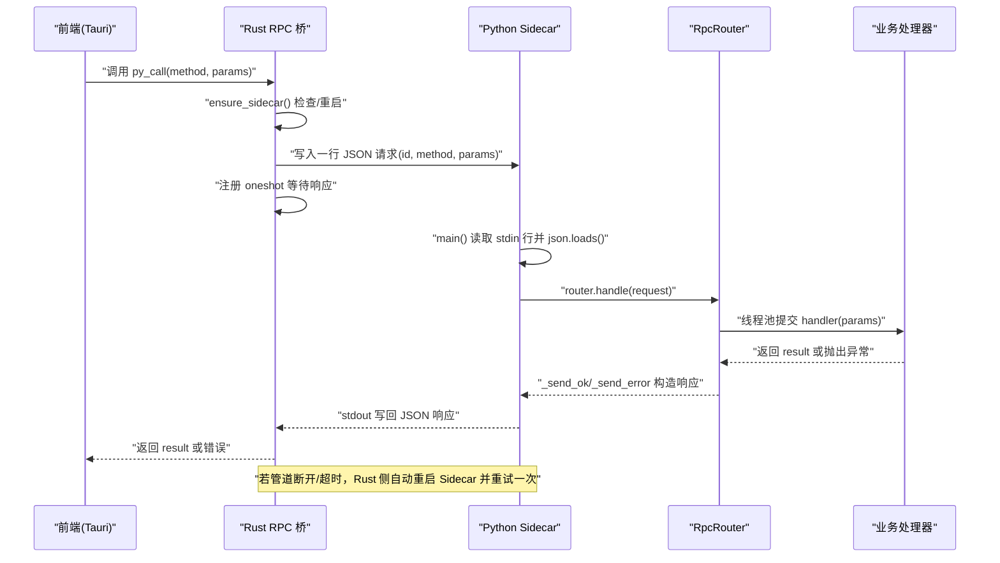
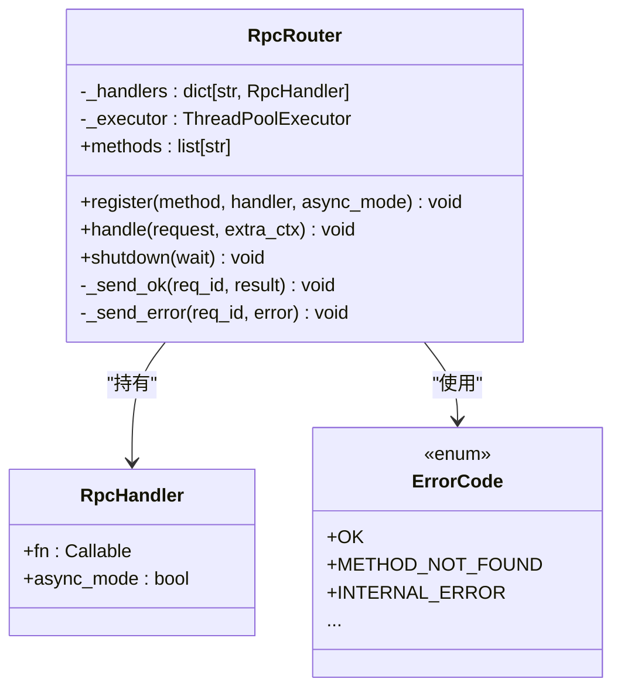
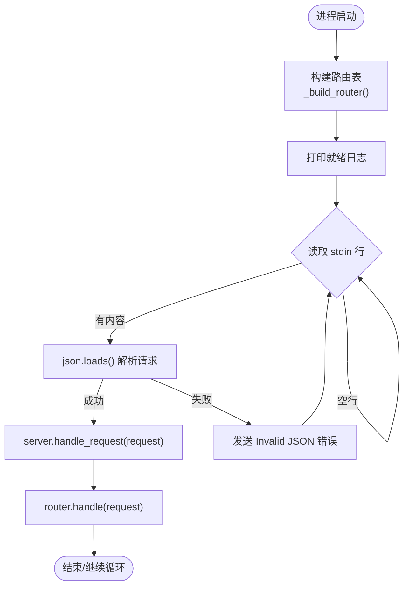
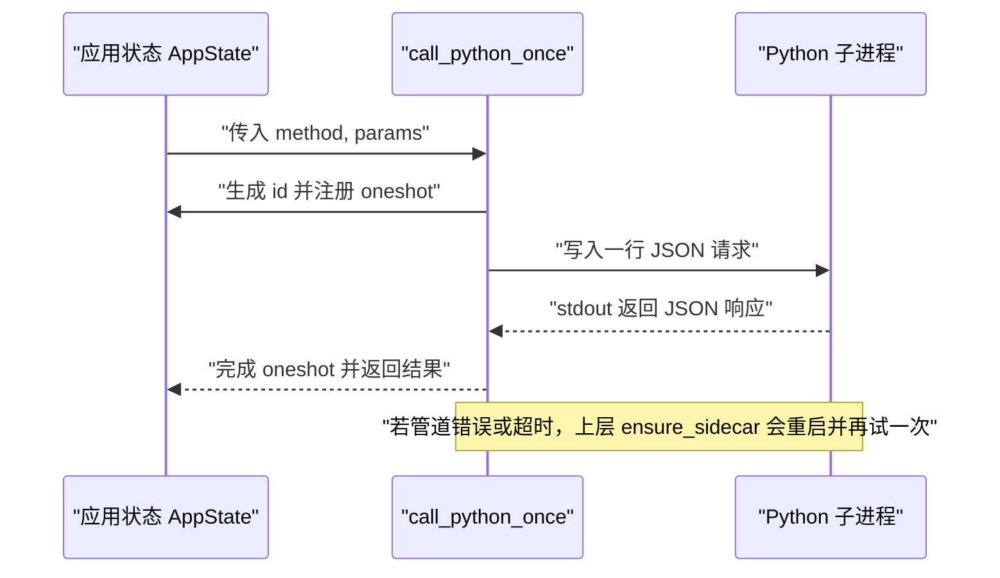
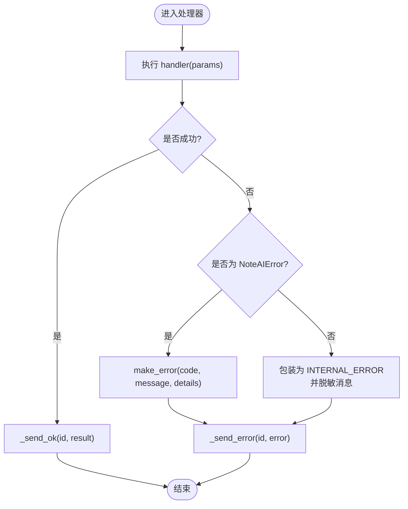
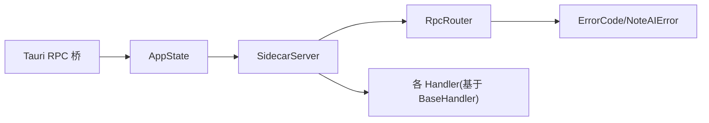

# JSON-RPC 协议实现

<cite>
**本文引用的文件**   
- [rpc_router.py](file://python/sidecar/rpc_router.py)
- [server.py](file://python/sidecar/server.py)
- [rpc.rs](file://src-tauri/src/rpc.rs)
- [state.rs](file://src-tauri/src/state.rs)
- [error_codes.py](file://utils/error_codes.py)
- [error_handler.py](file://utils/error_handler.py)
- [base.py](file://python/sidecar/handlers/base.py)
- [config_handler.py](file://python/sidecar/handlers/config_handler.py)
- [files_handler.py](file://python/sidecar/handlers/files_handler.py)
- [test_rpc_router.py](file://tests/unit/test_rpc_router.py)
</cite>

## 目录
1. [简介](#简介)
2. [项目结构](#项目结构)
3. [核心组件](#核心组件)
4. [架构总览](#架构总览)
5. [详细组件分析](#详细组件分析)
6. [依赖关系分析](#依赖关系分析)
7. [性能考量](#性能考量)
8. [故障排查指南](#故障排查指南)
9. [结论](#结论)
10. [附录](#附录)

## 简介
本技术文档围绕 NoteAI 的 JSON-RPC 子进程通信实现，系统性阐述从 Tauri 前端到 Python Sidecar 的请求处理全链路：请求解析、参数校验、方法路由与调用、响应序列化、错误处理策略、异步并发模型以及与前端的连接管理。重点剖析 RpcRouter 的动态路由发现与方法绑定机制，并给出 RPC 调用序列图、错误处理流程图及性能优化建议。

## 项目结构
本项目采用“Tauri 前端 + Python Sidecar”的双进程架构：
- Tauri（Rust）通过标准输入/输出与 Python 子进程进行 JSON-RPC 文本行通信，负责进程生命周期管理、超时控制与重试。
- Python Sidecar 提供轻量级 JSON-RPC 路由器，支持同步与异步处理器，统一错误码与消息脱敏，并通过线程池执行耗时任务。

```mermaid
graph TB
subgraph "前端(Tauri)"
UI["UI 层"]
TauriRPC["Tauri RPC 桥<br/>py_call / call_python"]
State["状态 AppState<br/>stdin/pending_requests"]
end
subgraph "Python Sidecar"
MainLoop["主循环 main()<br/>读取 stdin 行"]
Router["RpcRouter<br/>动态路由/线程池"]
Handlers["业务处理器<br/>ConfigHandler/FilesHandler/..."]
ErrorCodes["错误码/异常<br/>ErrorCode/NoteAIError"]
end
UI --> TauriRPC
TauriRPC --> State
State < --> |"JSON 行(stdin/stdout)"| MainLoop
MainLoop --> Router
Router --> Handlers
Router --> ErrorCodes
```

图表来源
- [rpc.rs:190-284](file://src-tauri/src/rpc.rs#L190-L284)
- [state.rs:9-48](file://src-tauri/src/state.rs#L9-L48)
- [server.py:570-595](file://python/sidecar/server.py#L570-L595)
- [rpc_router.py:43-106](file://python/sidecar/rpc_router.py#L43-L106)

章节来源
- [server.py:570-595](file://python/sidecar/server.py#L570-L595)
- [rpc.rs:190-284](file://src-tauri/src/rpc.rs#L190-L284)
- [state.rs:9-48](file://src-tauri/src/state.rs#L9-L48)

## 核心组件
- RpcRouter：轻量 JSON-RPC 路由器，维护 method→handler 映射，使用线程池执行处理器，统一成功/失败响应格式，并提供方法列表查询与优雅关闭。
- SidecarServer：Sidecar 入口，构建路由表、启动后台任务、监听工作区变更、将响应写入 stdout。
- Tauri RPC 桥：在 Rust 侧维护 Python 子进程 stdin/stdout，构造 PyRequest，等待 oneshot 通道返回结果，按方法设置超时，并在管道断开时自动重启 Sidecar。
- 错误体系：ErrorCode 枚举 + make_error 工厂 + NoteAIError 异常；错误消息在服务端做路径脱敏，避免泄露敏感信息。
- 处理器基类 BaseHandler：为各功能域处理器提供统一的上下文、配置、缓存、事件发送等能力。

章节来源
- [rpc_router.py:43-106](file://python/sidecar/rpc_router.py#L43-L106)
- [server.py:54-125](file://python/sidecar/server.py#L54-L125)
- [rpc.rs:190-284](file://src-tauri/src/rpc.rs#L190-L284)
- [error_codes.py:14-120](file://utils/error_codes.py#L14-L120)
- [base.py:4-106](file://python/sidecar/handlers/base.py#L4-L106)

## 架构总览
下图展示了从前端发起调用到后端响应的完整时序，包括超时、重试与管道断开的自愈流程。



图表来源
- [rpc.rs:190-284](file://src-tauri/src/rpc.rs#L190-L284)
- [server.py:570-595](file://python/sidecar/server.py#L570-L595)
- [rpc_router.py:54-98](file://python/sidecar/rpc_router.py#L54-L98)

## 详细组件分析

### RpcRouter 路由器设计与模式
- 动态路由发现：通过 register(method, handler, async_mode=False) 将方法名与可调用对象绑定；methods 属性暴露已注册方法集合，便于前端/工具扫描。
- 方法绑定与分发：handle(request) 解析 method/params/id，查找处理器；未找到则返回 METHOD_NOT_FOUND。
- 异步与并发：所有处理器均提交至 ThreadPoolExecutor 执行，避免阻塞 stdin 读循环；async_mode 标记用于区分语义（当前实现仍走线程池）。
- 中间件机制：当前版本未内置通用中间件链；可通过封装处理器或在 router.handle 前后扩展实现。
- 错误处理：捕获 NoteAIError 与通用 Exception，前者按 code/message/details 返回，后者包装为 INTERNAL_ERROR；错误消息经 _sanitize_error_message 脱敏。



图表来源
- [rpc_router.py:35-106](file://python/sidecar/rpc_router.py#L35-L106)
- [error_codes.py:14-120](file://utils/error_codes.py#L14-L120)

章节来源
- [rpc_router.py:43-106](file://python/sidecar/rpc_router.py#L43-L106)
- [test_rpc_router.py:34-122](file://tests/unit/test_rpc_router.py#L34-L122)

### SidecarServer 与主循环
- 路由构建：在 _build_router 中集中注册各 Handler 的方法集，形成全局方法表。
- 响应输出：_send_response 以 JSON 单行形式写入 stdout，保证与 Rust 侧逐行解析一致。
- 主循环：main() 逐行读取 stdin，json.loads 后交由 server.handle_request → router.handle 处理；对 JSON 解析异常与未知异常进行兜底处理。
- 优雅关闭：shutdown 停止文件监听、关闭线程池与模块级执行器，清理资源。



图表来源
- [server.py:107-129](file://python/sidecar/server.py#L107-L129)
- [server.py:570-595](file://python/sidecar/server.py#L570-L595)

章节来源
- [server.py:54-125](file://python/sidecar/server.py#L54-L125)
- [server.py:570-595](file://python/sidecar/server.py#L570-L595)

### Tauri 前端通信协议
- 消息格式：PyRequest{id, method, params}；响应为包含 id 与 result 或 error 的 JSON 对象。
- 连接管理：AppState 维护 python_stdin 与 pending_requests；call_python_once 写入请求并等待 oneshot 返回值。
- 超时控制：rpc_timeout_secs 按方法设定不同超时；超时后清理 pending 并返回错误。
- 自愈与重试：检测到 Broken pipe 或进程未运行时，自动重启 Sidecar 并重试一次。



图表来源
- [rpc.rs:190-284](file://src-tauri/src/rpc.rs#L190-L284)
- [state.rs:9-48](file://src-tauri/src/state.rs#L9-L48)

章节来源
- [rpc.rs:190-284](file://src-tauri/src/rpc.rs#L190-L284)
- [state.rs:9-48](file://src-tauri/src/state.rs#L9-L48)

### 错误处理策略
- 结构化错误码：ErrorCode 定义领域错误码；make_error 构造 {code, message, details} 负载。
- 异常传播：处理器抛出 NoteAIError 会被路由捕获并按 code/message/details 返回；其他异常包装为 INTERNAL_ERROR。
- 消息脱敏：_sanitize_error_message 替换工作区与家目录绝对路径，防止敏感信息泄露。
- 统一日志：log_exception/log_and_reraise/format_exc_compact 辅助记录与格式化异常。



图表来源
- [rpc_router.py:54-98](file://python/sidecar/rpc_router.py#L54-L98)
- [error_codes.py:82-120](file://utils/error_codes.py#L82-L120)
- [error_handler.py:24-120](file://utils/error_handler.py#L24-L120)

章节来源
- [rpc_router.py:54-98](file://python/sidecar/rpc_router.py#L54-L98)
- [error_codes.py:14-120](file://utils/error_codes.py#L14-L120)
- [error_handler.py:24-120](file://utils/error_handler.py#L24-L120)

### 处理器示例与中间件模式
- 处理器基类 BaseHandler：提供 _ctx、config、_send_response、_send_progress、_start_task 等能力，减少重复代码。
- 典型处理器：
  - ConfigHandler：注册 API/UI/主题/规则相关方法，演示参数校验、原子保存与缓存刷新。
  - FilesHandler：演示大文件预览切片、安全路径校验与保护目录拒绝写入。
- 中间件模式：当前未内置通用中间件链；可在 router.handle 前后扩展，或将横切逻辑（鉴权、限流、审计）封装为装饰器/包装函数，由处理器显式调用。

章节来源
- [base.py:4-106](file://python/sidecar/handlers/base.py#L4-L106)
- [config_handler.py:16-286](file://python/sidecar/handlers/config_handler.py#L16-L286)
- [files_handler.py:1-200](file://python/sidecar/handlers/files_handler.py#L1-L200)

## 依赖关系分析
- 组件耦合：
  - Server 依赖 RpcRouter 与各 Handler；Router 依赖错误码与日志。
  - Tauri 侧通过 AppState 共享 stdin 与 pending_requests，降低跨组件耦合。
- 外部依赖：
  - Python 侧使用 watchdog 监听工作区变更；Rust 侧使用 tokio 异步 I/O 与 oneshot 通道。
- 潜在环依赖：无直接循环导入；模块间通过接口/回调解耦。



图表来源
- [server.py:54-125](file://python/sidecar/server.py#L54-L125)
- [rpc_router.py:43-106](file://python/sidecar/rpc_router.py#L43-L106)
- [state.rs:9-48](file://src-tauri/src/state.rs#L9-L48)

章节来源
- [server.py:54-125](file://python/sidecar/server.py#L54-L125)
- [rpc_router.py:43-106](file://python/sidecar/rpc_router.py#L43-L106)
- [state.rs:9-48](file://src-tauri/src/state.rs#L9-L48)

## 性能考量
- 并发模型：
  - Python 侧使用固定大小线程池（默认最大 8）执行处理器，避免阻塞 stdin 读循环。
  - Rust 侧使用异步 I/O 与 oneshot 通道，避免阻塞 UI 线程。
- 超时与背压：
  - 针对长耗时方法（如 RAG 聊天、索引重建）设置更长超时；普通方法默认 60s。
  - 管道断开自动重启并重试一次，提升鲁棒性。
- 缓存与去抖：
  - 工作区变更触发缓存失效与 Wiki 同步，采用定时器去抖合并批量事件。
- 资源释放：
  - shutdown 阶段关闭线程池、检索器执行器与集合缓存，避免僵尸资源。

[本节为通用指导，不直接分析具体文件]

## 故障排查指南
- 常见错误码定位：
  - METHOD_NOT_FOUND：确认方法是否在 ALLOWED_PYTHON_METHODS 白名单内且已在 Python 侧注册。
  - INVALID_PARAMS/PATH_*：检查参数类型与路径合法性，注意保护目录限制。
  - RAG_*：确认 RAG 功能开关与索引状态。
- 调试步骤：
  - 查看 Rust 侧日志与 stderr，确认管道状态与重启次数。
  - 在 Python 侧启用 debug 日志，关注路由分发与异常堆栈。
  - 使用 test_rpc_router 用例验证基本路由与错误传播行为。
- 恢复策略：
  - 遇到 Broken pipe 或“进程未运行”，Rust 侧会自动重启 Sidecar 并重试一次。
  - 对于长时间任务，优先使用事件推送（progress/job update），避免阻塞请求。

章节来源
- [rpc.rs:169-188](file://src-tauri/src/rpc.rs#L169-L188)
- [test_rpc_router.py:48-87](file://tests/unit/test_rpc_router.py#L48-L87)

## 结论
该 JSON-RPC 实现以简洁可靠的 stdin/stdout 文本行协议为核心，结合 RpcRouter 的动态路由与线程池并发、统一错误码与消息脱敏、以及 Tauri 侧的超时与自愈机制，形成了稳定高效的跨进程通信方案。建议在后续迭代中引入中间件链（鉴权、限流、审计）、更细粒度的并发控制与指标埋点，进一步提升可观测性与可扩展性。

## 附录

### 关键数据模型
- PyRequest：{id, method, params}
- 响应：{id, result} 或 {id, error: {code, message, details}}

章节来源
- [state.rs:35-48](file://src-tauri/src/state.rs#L35-L48)
- [error_codes.py:82-120](file://utils/error_codes.py#L82-L120)