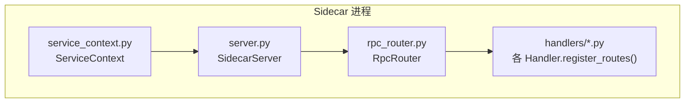
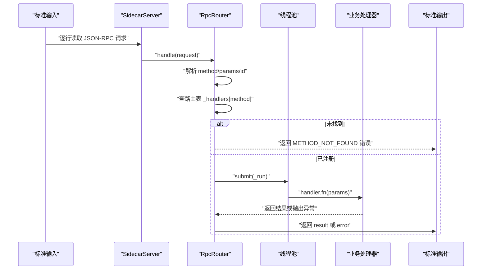
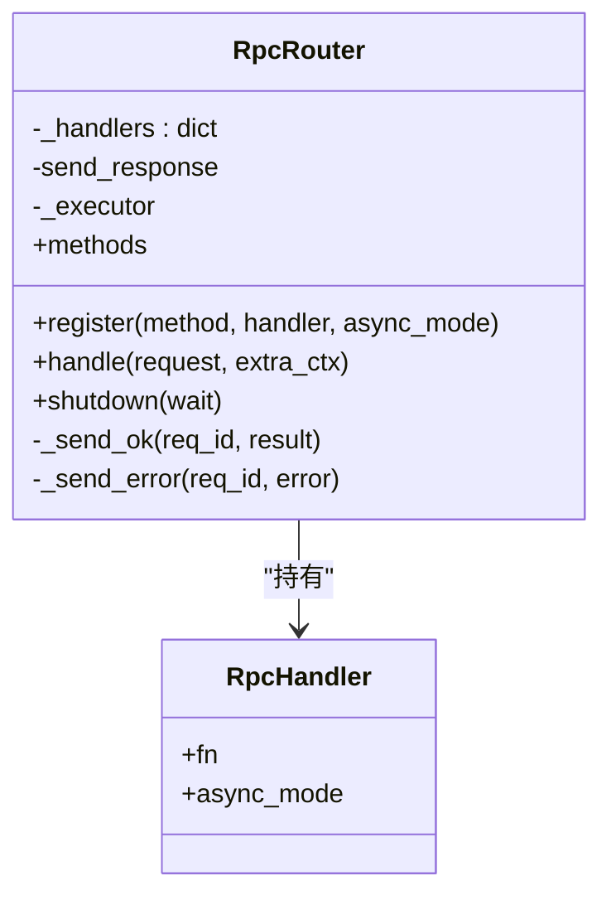
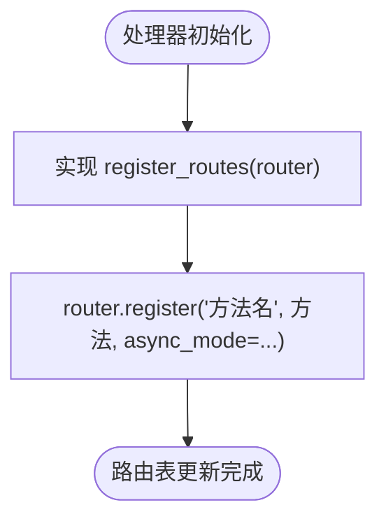
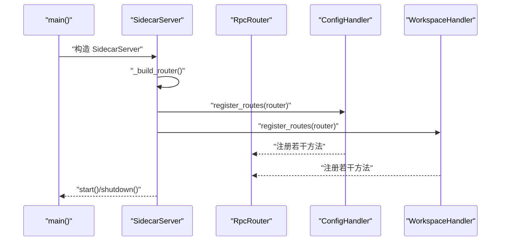
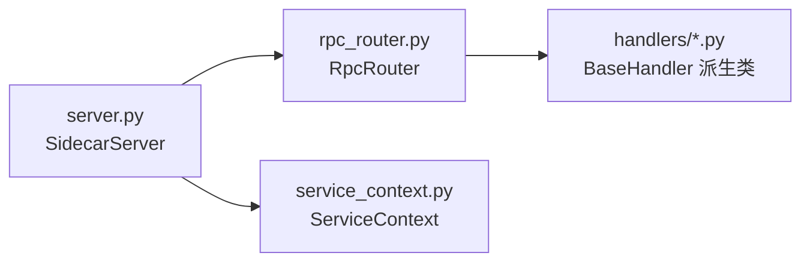

# RPC 处理器注册机制

<cite>
**本文引用的文件**
- [rpc_router.py](file://python/sidecar/rpc_router.py)
- [server.py](file://python/sidecar/server.py)
- [base.py](file://python/sidecar/handlers/base.py)
- [config_handler.py](file://python/sidecar/handlers/config_handler.py)
- [workspace_handler.py](file://python/sidecar/handlers/workspace_handler.py)
- [service_context.py](file://python/sidecar/service_context.py)
</cite>

## 目录
1. [简介](#简介)
2. [项目结构](#项目结构)
3. [核心组件](#核心组件)
4. [架构总览](#架构总览)
5. [详细组件分析](#详细组件分析)
6. [依赖关系分析](#依赖关系分析)
7. [性能考量](#性能考量)
8. [故障排查指南](#故障排查指南)
9. [结论](#结论)
10. [附录](#附录)

## 简介
本文件面向 NoteAI Sidecar 的 RPC 处理器注册机制，系统性阐述 RpcHandler 与 RpcRouter 的设计模式、同步/异步处理差异、方法绑定与路由表更新流程、装饰器式注册简化方式、处理器发现（静态注册）机制、上下文传递与依赖注入、以及最佳实践与常见陷阱。文档以代码级事实为依据，并辅以图示帮助理解。

## 项目结构
RPC 处理器注册相关的关键位置：
- 路由器与处理器包装：python/sidecar/rpc_router.py
- 服务器装配与启动：python/sidecar/server.py
- 处理器基类与统一入口：python/sidecar/handlers/base.py
- 具体处理器示例：python/sidecar/handlers/config_handler.py、python/sidecar/handlers/workspace_handler.py
- 服务上下文（依赖注入容器）：python/sidecar/service_context.py

图表来源
- [server.py:54-125](file://python/sidecar/server.py#L54-L125)
- [rpc_router.py:35-106](file://python/sidecar/rpc_router.py#L35-L106)
- [base.py:4-106](file://python/sidecar/handlers/base.py#L4-L106)
- [service_context.py:6-19](file://python/sidecar/service_context.py#L6-L19)

章节来源
- [server.py:54-125](file://python/sidecar/server.py#L54-L125)
- [rpc_router.py:35-106](file://python/sidecar/rpc_router.py#L35-L106)
- [base.py:4-106](file://python/sidecar/handlers/base.py#L4-L106)
- [service_context.py:6-19](file://python/sidecar/service_context.py#L6-L19)

## 核心组件
- RpcHandler：轻量处理器包装，记录原始函数与是否异步执行标记。
- RpcRouter：JSON-RPC 路由中心，维护方法名到 RpcHandler 的映射，负责参数解析、错误封装、线程池调度与响应发送。
- BaseHandler：所有业务处理器的统一基类，提供对 Server 能力（配置、缓存、任务、路径解析等）的访问，并要求子类实现 register_routes(router)。
- ServiceContext：显式依赖注入容器，将配置与日志对象注入到处理器链中，避免全局耦合。

章节来源
- [rpc_router.py:35-106](file://python/sidecar/rpc_router.py#L35-L106)
- [base.py:4-106](file://python/sidecar/handlers/base.py#L4-L106)
- [service_context.py:6-19](file://python/sidecar/service_context.py#L6-L19)

## 架构总览
整体调用链路从 stdin 读取 JSON-RPC 请求，交由 SidecarServer.handle_request 转发至 RpcRouter.handle，再由 Router 查找对应处理器并在线程池中执行，最终通过 send_response 写回 stdout。

图表来源
- [server.py:541-590](file://python/sidecar/server.py#L541-L590)
- [rpc_router.py:54-98](file://python/sidecar/rpc_router.py#L54-L98)

章节来源
- [server.py:541-590](file://python/sidecar/server.py#L541-L590)
- [rpc_router.py:54-98](file://python/sidecar/rpc_router.py#L54-L98)

## 详细组件分析

### RpcHandler 与 RpcRouter 设计
- 设计要点
  - 最小包装：RpcHandler 仅保存函数引用与 async_mode 标志，不改变函数签名，保持“装饰器式”透明性。
  - 路由表：_handlers 为 dict[str, RpcHandler]，键为方法名，值为处理器包装。
  - 执行模型：所有处理器（无论同步或异步标记）均提交到 ThreadPoolExecutor 执行，避免阻塞主循环；async_mode 用于未来扩展区分执行策略。
  - 错误处理：捕获业务自定义异常与通用异常，统一封装为标准错误格式，并对敏感信息进行脱敏。
  - 生命周期：构造时创建线程池；shutdown 时关闭线程池，支持等待或立即取消。

- register() 行为
  - 参数：method（字符串）、handler（可调用）、async_mode（布尔）。
  - 验证：当前实现未做类型校验，直接写入路由表。建议在上层保证 method 唯一且非空。
  - 包装：将 handler 与 async_mode 封装为 RpcHandler 实例。
  - 路由更新：直接赋值到 _handlers[method]，覆盖同名方法。

- handle() 流程
  - 解析 request.method/params/id。
  - 查找处理器，未命中则返回 METHOD_NOT_FOUND。
  - 在内部闭包中调用 handler.fn(params)，成功则返回 result，失败则根据异常类型返回错误。
  - 使用线程池提交执行，确保主循环不被阻塞。

图表来源
- [rpc_router.py:35-106](file://python/sidecar/rpc_router.py#L35-L106)

章节来源
- [rpc_router.py:35-106](file://python/sidecar/rpc_router.py#L35-L106)

### 处理器基类与装饰器式注册
- BaseHandler 职责
  - 提供对 Server 能力的属性代理（配置、进度、任务、缓存、路径解析等），使处理器无需关心底层细节。
  - 定义抽象接口 register_routes(router)，要求子类实现自身路由注册。
- 装饰器式注册
  - 每个处理器在 register_routes 中集中调用 router.register("方法名", self._xxx, async_mode=...)，形成声明式、易读的路由清单。
  - 该模式等价于“装饰器”，但采用显式注册而非语法装饰器，便于调试与动态控制。

图表来源
- [base.py:104-106](file://python/sidecar/handlers/base.py#L104-L106)
- [config_handler.py:17-30](file://python/sidecar/handlers/config_handler.py#L17-L30)
- [workspace_handler.py:35-44](file://python/sidecar/handlers/workspace_handler.py#L35-L44)

章节来源
- [base.py:4-106](file://python/sidecar/handlers/base.py#L4-L106)
- [config_handler.py:17-30](file://python/sidecar/handlers/config_handler.py#L17-L30)
- [workspace_handler.py:35-44](file://python/sidecar/handlers/workspace_handler.py#L35-L44)

### 处理器发现与装配（静态注册）
- 装配点：SidecarServer.__init__ 中构建各 Handler 实例，随后在 _build_router 中逐一调用其 register_routes(self._router)。
- 发现方式：静态导入与显式装配，无运行时扫描或反射发现。新增处理器需在此处添加导入与注册调用。
- 生命周期：Server.start 启动后台任务；shutdown 关闭 watcher 与线程池等资源。

图表来源
- [server.py:54-125](file://python/sidecar/server.py#L54-L125)
- [config_handler.py:17-30](file://python/sidecar/handlers/config_handler.py#L17-L30)
- [workspace_handler.py:35-44](file://python/sidecar/handlers/workspace_handler.py#L35-L44)

章节来源
- [server.py:54-125](file://python/sidecar/server.py#L54-L125)

### 同步与异步处理器的区别
- 当前实现：所有处理器均提交到线程池执行，避免阻塞主循环。async_mode 字段保留，用于未来差异化执行策略（如协程调度）。
- 建议：若后续引入协程处理器，可在 handle 中根据 async_mode 选择不同执行器或事件循环。

章节来源
- [rpc_router.py:51-82](file://python/sidecar/rpc_router.py#L51-L82)

### 处理器装饰器模式的使用
- 通过 register_routes 集中声明式注册，降低样板代码，提升可读性与可维护性。
- 优点：
  - 清晰的方法清单，便于审计与测试。
  - 易于条件注册或按环境开关。
- 注意：
  - 避免重复注册同名方法（后者会覆盖前者）。
  - 对于耗时操作，优先使用线程池或任务队列，避免阻塞。

章节来源
- [base.py:104-106](file://python/sidecar/handlers/base.py#L104-L106)
- [config_handler.py:17-30](file://python/sidecar/handlers/config_handler.py#L17-L30)

### 处理器依赖注入与上下文传递
- ServiceContext 作为 DI 容器，持有 config 与 logger，供 Server 与处理器共享。
- BaseHandler 通过 server 代理暴露常用能力，处理器无需直接 import 全局模块，降低耦合度。
- 扩展建议：可在 ServiceContext 中增加更多服务（如文件系统、索引、RAG 检索器等），并通过 BaseHandler 暴露给处理器。

章节来源
- [service_context.py:6-19](file://python/sidecar/service_context.py#L6-L19)
- [base.py:4-106](file://python/sidecar/handlers/base.py#L4-L106)

### 处理器注册示例与最佳实践
- 示例路径（不含代码内容）：
  - 配置处理器注册：[config_handler.py:17-30](file://python/sidecar/handlers/config_handler.py#L17-L30)
  - 工作区处理器注册：[workspace_handler.py:35-44](file://python/sidecar/handlers/workspace_handler.py#L35-L44)
- 最佳实践
  - 明确方法命名规范，避免冲突。
  - 对 I/O 密集或 CPU 密集逻辑，尽量放入线程池或独立任务，避免阻塞主循环。
  - 使用 ServiceContext 进行依赖注入，减少全局状态。
  - 对错误进行结构化封装，遵循统一的错误码与消息格式。
  - 对敏感信息（如路径）进行脱敏后再返回。

章节来源
- [config_handler.py:17-30](file://python/sidecar/handlers/config_handler.py#L17-L30)
- [workspace_handler.py:35-44](file://python/sidecar/handlers/workspace_handler.py#L35-L44)
- [rpc_router.py:14-32](file://python/sidecar/rpc_router.py#L14-L32)

### 常见陷阱
- 未注册方法：调用未知 method 将返回 METHOD_NOT_FOUND。
- 重复注册：同名方法会被覆盖，导致前一个处理器不可用。
- 阻塞主循环：未在子线程执行耗时逻辑会导致 stdin 读取阻塞。
- 异常未捕获：未抛出自定义异常的普通 Exception 将被统一封装为 INTERNAL_ERROR。
- 路径泄露：错误消息中包含绝对路径可能泄露隐私，应使用脱敏逻辑。

章节来源
- [rpc_router.py:54-98](file://python/sidecar/rpc_router.py#L54-L98)
- [rpc_router.py:14-32](file://python/sidecar/rpc_router.py#L14-L32)

## 依赖关系分析
- 组件内聚与耦合
  - RpcRouter 低耦合：仅依赖错误工具与日志，职责单一。
  - BaseHandler 高内聚：聚合 Server 能力，屏蔽底层复杂性。
  - Server 作为装配中心，集中管理处理器实例与路由构建。
- 外部依赖
  - 线程池：concurrent.futures.ThreadPoolExecutor。
  - 文件系统观察：watchdog（与 RPC 无关，但与 SidecarServer 生命周期相关）。
  - 错误与日志：utils.error_codes、utils.logger。

图表来源
- [server.py:54-125](file://python/sidecar/server.py#L54-L125)
- [rpc_router.py:35-106](file://python/sidecar/rpc_router.py#L35-L106)
- [base.py:4-106](file://python/sidecar/handlers/base.py#L4-L106)
- [service_context.py:6-19](file://python/sidecar/service_context.py#L6-L19)

章节来源
- [server.py:54-125](file://python/sidecar/server.py#L54-L125)
- [rpc_router.py:35-106](file://python/sidecar/rpc_router.py#L35-L106)
- [base.py:4-106](file://python/sidecar/handlers/base.py#L4-L106)
- [service_context.py:6-19](file://python/sidecar/service_context.py#L6-L19)

## 性能考量
- 线程池大小：默认最大工作线程数为 8，适合 I/O 密集型场景；CPU 密集型任务需评估并发度与资源占用。
- 主循环保护：所有处理器提交到线程池，避免阻塞 stdin 读取。
- 错误快速失败：未知方法立即返回错误，减少无效处理。
- 资源释放：shutdown 时关闭线程池与相关资源，防止泄漏。

章节来源
- [rpc_router.py:44-50](file://python/sidecar/rpc_router.py#L44-L50)
- [rpc_router.py:80-82](file://python/sidecar/rpc_router.py#L80-L82)
- [rpc_router.py:100-106](file://python/sidecar/rpc_router.py#L100-L106)

## 故障排查指南
- 常见问题定位
  - 方法未找到：检查 register_routes 是否正确调用 router.register。
  - 重复注册：确认方法名唯一，避免覆盖。
  - 超时或卡顿：确认耗时逻辑是否在子线程执行。
  - 错误信息泄露：检查异常消息是否包含敏感路径，必要时使用脱敏逻辑。
- 关键断点
  - Router.handle：查看 method 解析与路由命中情况。
  - Router._send_error/_send_ok：确认响应格式是否符合预期。
  - Server.main：确认 stdin 读取与 JSON 解析是否正常。

章节来源
- [rpc_router.py:54-98](file://python/sidecar/rpc_router.py#L54-L98)
- [server.py:570-590](file://python/sidecar/server.py#L570-L590)

## 结论
本机制以 RpcRouter 为核心，结合 BaseHandler 的装饰器式注册与 ServiceContext 的依赖注入，实现了简洁、可扩展、可维护的 RPC 处理器体系。通过线程池隔离执行与统一错误封装，保障了稳定性与安全性。建议在后续演进中逐步引入协程支持与更丰富的上下文传递能力，进一步提升吞吐与可观测性。

## 附录
- 处理器注册参考路径
  - 配置处理器：[config_handler.py:17-30](file://python/sidecar/handlers/config_handler.py#L17-L30)
  - 工作区处理器：[workspace_handler.py:35-44](file://python/sidecar/handlers/workspace_handler.py#L35-L44)
- 路由装配参考路径
  - 服务器装配：[server.py:107-125](file://python/sidecar/server.py#L107-L125)
- 上下文与依赖注入参考路径
  - 服务上下文：[service_context.py:6-19](file://python/sidecar/service_context.py#L6-L19)
  - 处理器基类：[base.py:4-106](file://python/sidecar/handlers/base.py#L4-L106)