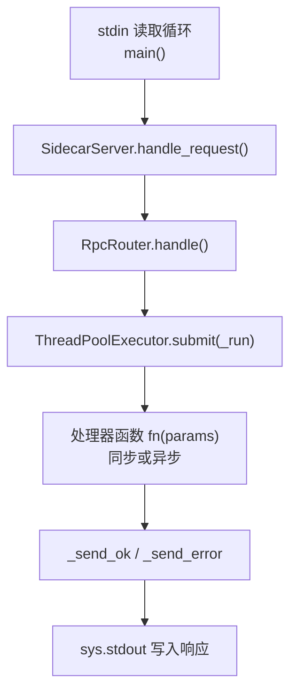
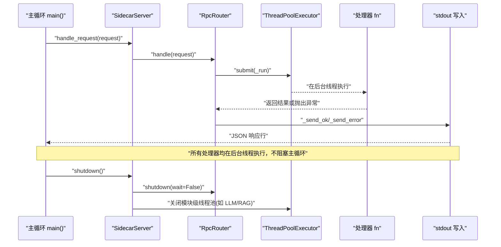
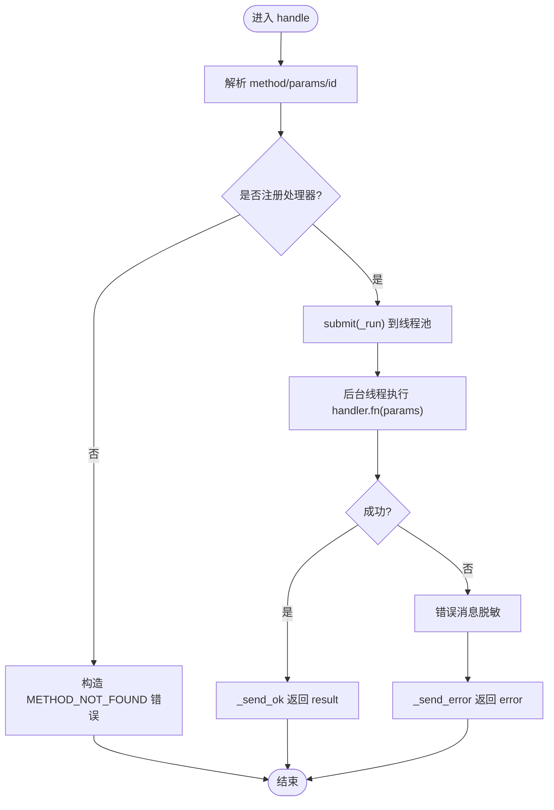
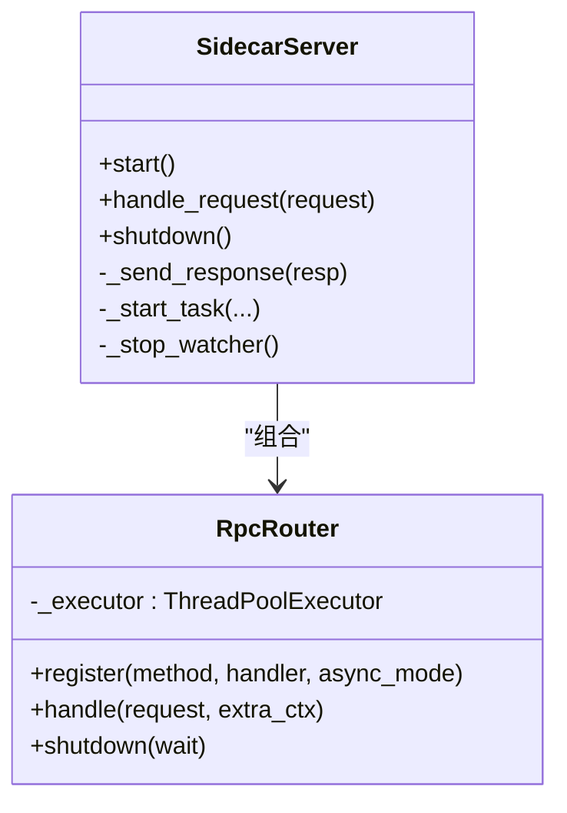
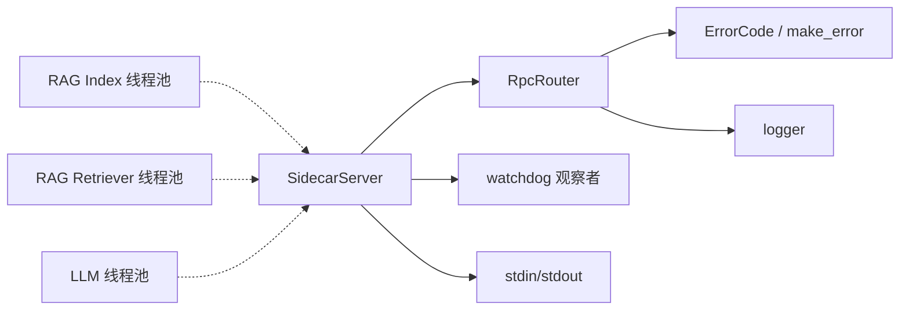

# 并发执行模型

<cite>
**本文引用的文件**   
- [rpc_router.py](file://python/sidecar/rpc_router.py)
- [server.py](file://python/sidecar/server.py)
- [test_rpc_router.py](file://tests/unit/test_rpc_router.py)
- [base.py](file://python/sidecar/handlers/base.py)
- [service_context.py](file://python/sidecar/service_context.py)
- [error_codes.py](file://utils/error_codes.py)
- [index.py](file://python/sidecar/rag/index.py)
- [retriever.py](file://python/sidecar/rag/retriever.py)
- [web_search.py](file://python/sidecar/rag/web_search.py)
- [llm_utils.py](file://utils/llm_utils.py)
</cite>

## 目录
1. [简介](#简介)
2. [项目结构](#项目结构)
3. [核心组件](#核心组件)
4. [架构总览](#架构总览)
5. [详细组件分析](#详细组件分析)
6. [依赖关系分析](#依赖关系分析)
7. [性能考虑与调优](#性能考虑与调优)
8. [故障排查指南](#故障排查指南)
9. [结论](#结论)
10. [附录](#附录)

## 简介
本文件面向 JSON-RPC 侧车（Sidecar）的并发执行模型，系统性阐述线程池配置与管理、同步/异步处理器的统一调度机制、并发安全保证、任务队列管理策略、生命周期管理与优雅关闭，并给出架构图、性能调优指南与死锁预防策略。文档内容严格基于仓库现有实现进行归纳与可视化说明。

## 项目结构
与并发执行相关的核心代码集中在 sidecar 层：
- RPC 路由与线程池：RpcRouter 负责将请求分发到已注册的处理器，并通过 ThreadPoolExecutor 在后台线程中执行，避免阻塞主循环。
- 服务器主循环：SidecarServer 维护 stdin/stdout 的 JSON-RPC 读写循环，并将请求交给 RpcRouter 处理；同时提供进程级资源清理入口 shutdown。
- 领域处理器：各 Handler 通过 BaseHandler 暴露统一的上下文与服务能力，注册到 RpcRouter。
- 模块级线程池：RAG、LLM 等子系统各自持有独立的线程池，用于隔离不同工作负载。

图示来源
- [server.py:570-595](file://python/sidecar/server.py#L570-L595)
- [server.py:541-548](file://python/sidecar/server.py#L541-L548)
- [rpc_router.py:43-83](file://python/sidecar/rpc_router.py#L43-L83)
- [rpc_router.py:84-95](file://python/sidecar/rpc_router.py#L84-L95)

章节来源
- [server.py:570-595](file://python/sidecar/server.py#L570-L595)
- [server.py:541-548](file://python/sidecar/server.py#L541-L548)
- [rpc_router.py:43-83](file://python/sidecar/rpc_router.py#L43-L83)

## 核心组件
- RpcRouter
  - 职责：方法注册、请求解析、错误封装、统一提交至线程池执行、结果回写。
  - 关键特性：
    - 内置最大工作线程数常量，控制并发上限。
    - 所有处理器（无论同步或异步标记）均提交到同一线程池，确保主循环不被阻塞。
    - 支持结构化错误码与消息脱敏，防止泄露敏感路径信息。
- SidecarServer
  - 职责：启动背景任务、构建路由、读写 JSON-RPC、统一输出、优雅关闭。
  - 关键特性：
    - 使用 stdout 互斥锁保证响应序列化与写入的原子性。
    - 提供 shutdown 钩子，协调关闭 RPC 线程池与模块级线程池。
- 模块级线程池
  - RAG 检索器、索引、网络搜索等子系统各自维护独立线程池，按场景限制并发度。
  - LLM 工具层提供全局线程池，供外部调用方复用。

章节来源
- [rpc_router.py:43-106](file://python/sidecar/rpc_router.py#L43-L106)
- [server.py:54-125](file://python/sidecar/server.py#L54-L125)
- [server.py:544-568](file://python/sidecar/server.py#L544-L568)
- [retriever.py:35](file://python/sidecar/rag/retriever.py#L35)
- [index.py:37](file://python/sidecar/rag/index.py#L37)
- [web_search.py:258](file://python/sidecar/rag/web_search.py#L258)
- [llm_utils.py:51](file://utils/llm_utils.py#L51)

## 架构总览
下图展示了从请求进入、路由分发、线程池执行到响应输出的完整流程，以及关闭时的资源回收路径。

图示来源
- [server.py:570-595](file://python/sidecar/server.py#L570-L595)
- [server.py:541-548](file://python/sidecar/server.py#L541-L548)
- [rpc_router.py:43-106](file://python/sidecar/rpc_router.py#L43-L106)

## 详细组件分析

### RpcRouter 与线程池适配
- 线程池配置
  - 最大工作线程数由类常量控制，默认值固定为 8。
  - 所有处理器（含 async_mode=True 的标记）均通过 submit 提交到该线程池，避免在主线程阻塞。
- 统一调度机制
  - handle 方法解析 method/params/id，查找对应处理器；若未找到则返回 METHOD_NOT_FOUND。
  - 内部 _run 包装了 try/except，捕获业务异常与通用异常，分别映射为结构化错误码。
  - 错误消息经过脱敏，替换工作区与家目录路径，避免泄露敏感信息。
- 生命周期
  - shutdown(wait=False) 会立即取消未完成的任务并释放线程池资源。

图示来源
- [rpc_router.py:43-83](file://python/sidecar/rpc_router.py#L43-L83)
- [rpc_router.py:84-95](file://python/sidecar/rpc_router.py#L84-L95)
- [rpc_router.py:14-32](file://python/sidecar/rpc_router.py#L14-L32)

章节来源
- [rpc_router.py:43-106](file://python/sidecar/rpc_router.py#L43-L106)
- [rpc_router.py:14-32](file://python/sidecar/rpc_router.py#L14-L32)
- [test_rpc_router.py:34-87](file://tests/unit/test_rpc_router.py#L34-L87)
- [test_rpc_router.py:89-122](file://tests/unit/test_rpc_router.py#L89-L122)

### SidecarServer 主循环与输出保护
- 主循环
  - 从 stdin 逐行读取 JSON，解析后交由 server.handle_request -> router.handle。
  - 对解析失败与未知异常进行兜底处理，返回错误响应。
- 输出保护
  - 使用 stdout 互斥锁，确保多并发下响应序列化与写入的原子性，避免交错。
- 优雅关闭
  - 停止文件监听器、关闭 RPC 线程池、关闭模块级线程池（LLM、RAG），并清理集合缓存。

图示来源
- [server.py:54-125](file://python/sidecar/server.py#L54-L125)
- [server.py:541-568](file://python/sidecar/server.py#L541-L568)
- [rpc_router.py:43-106](file://python/sidecar/rpc_router.py#L43-L106)

章节来源
- [server.py:570-595](file://python/sidecar/server.py#L570-L595)
- [server.py:544-568](file://python/sidecar/server.py#L544-L568)

### 处理器基类与服务上下文
- BaseHandler
  - 为各功能处理器提供统一的能力访问：配置、日志、进度上报、任务启动、路径解析、缓存失效等。
  - 通过属性代理到 SidecarServer，降低耦合。
- ServiceContext
  - 作为依赖注入容器，集中持有 config 与 logger，替代全局导入模式，便于测试与扩展。

章节来源
- [base.py:1-106](file://python/sidecar/handlers/base.py#L1-L106)
- [service_context.py:1-19](file://python/sidecar/service_context.py#L1-L19)

### 结构化错误与消息脱敏
- ErrorCode 枚举定义了 RPC 层的错误码族，涵盖通用、路径、认证、RAG、特性可用性、验证、云同步、UI 等分类。
- make_error 与 NoteAIError 提供统一的错误构造与转换方式，便于前端根据 code 做国际化与交互决策。
- 错误消息脱敏逻辑会将工作区与家目录路径替换为占位符，避免泄露敏感信息。

章节来源
- [error_codes.py:14-120](file://utils/error_codes.py#L14-L120)
- [rpc_router.py:14-32](file://python/sidecar/rpc_router.py#L14-L32)
- [test_rpc_router.py:89-122](file://tests/unit/test_rpc_router.py#L89-L122)

### 模块级线程池与隔离
- RAG 检索器
  - 维护专用线程池，限制并发度，避免检索阶段抢占其他资源。
- RAG 索引
  - 维护混合索引线程池与工作区级操作锁，串行化跨工作区的索引构建，避免并发冲突。
- 网页搜索
  - 动态创建临时线程池，按页面数量设置 max_workers，完成即销毁。
- LLM 工具
  - 提供全局线程池，供外部调用方复用，减少频繁创建销毁开销。

章节来源
- [retriever.py:35](file://python/sidecar/rag/retriever.py#L35)
- [index.py:37](file://python/sidecar/rag/index.py#L37)
- [index.py:41-71](file://python/sidecar/rag/index.py#L41-L71)
- [web_search.py:258](file://python/sidecar/rag/web_search.py#L258)
- [llm_utils.py:51](file://utils/llm_utils.py#L51)

## 依赖关系分析
- 组件耦合
  - SidecarServer 组合 RpcRouter，并通过属性向处理器暴露服务。
  - RpcRouter 依赖 utils.error_codes 与 utils.logger，负责错误格式化与日志记录。
  - 各子系统（RAG、LLM）通过模块级线程池与锁对象实现内部并发控制。
- 外部依赖
  - watchdog 用于文件系统事件监听。
  - concurrent.futures.ThreadPoolExecutor 提供线程池能力。
  - sys.stdin/stdout 作为 JSON-RPC 通道。

图示来源
- [server.py:54-125](file://python/sidecar/server.py#L54-L125)
- [rpc_router.py:43-106](file://python/sidecar/rpc_router.py#L43-L106)
- [index.py:37](file://python/sidecar/rag/index.py#L37)
- [retriever.py:35](file://python/sidecar/rag/retriever.py#L35)
- [llm_utils.py:51](file://utils/llm_utils.py#L51)

章节来源
- [server.py:54-125](file://python/sidecar/server.py#L54-L125)
- [rpc_router.py:43-106](file://python/sidecar/rpc_router.py#L43-L106)

## 性能考虑与调优
- 线程池大小
  - RpcRouter 默认最大工作线程数为 8，适用于 I/O 密集型与中等 CPU 负载的混合场景。可根据实际 QPS、CPU 核数与后端 API 限流情况调整。
  - RAG 检索与索引使用较小线程池（通常为 2），以降低对系统资源的争用。
  - 网页搜索按页面数量动态设置 max_workers，避免一次性发起过多并发请求。
- 超时与取消
  - 当前 RpcRouter 未实现请求级超时与取消机制。如需引入，可在 submit 前包装 Future 并配合超时检查或信号量限流。
- 优先级
  - 标准线程池不支持任务优先级。可通过自定义队列或分派多个线程池（高/低优先级）实现。
- 内存可见性与共享状态
  - 处理器间共享状态应通过明确加锁（threading.Lock/RLock）或不可变数据结构访问。
  - 输出层使用 stdout 互斥锁保证响应序列化与写入的原子性。
- 背压与限流
  - 建议结合令牌桶或滑动窗口对上游请求进行限流，避免线程池饱和导致延迟飙升。
- 资源隔离
  - 将 CPU 密集与 I/O 密集任务拆分到不同线程池，避免相互影响。
- 监控指标
  - 建议统计线程池活跃线程数、队列长度、拒绝率、平均/分位耗时，以便持续优化。

[本节为通用指导，无需源码引用]

## 故障排查指南
- 常见症状与定位
  - 响应乱序或交错：检查是否存在多处直接写入 stdout 的代码；确认已通过 _send_response 统一输出。
  - 处理器长时间无响应：确认是否被线程池饱和或存在阻塞 I/O；必要时增加线程池容量或引入超时。
  - 错误消息包含敏感路径：确认是否触发了脱敏逻辑；可参考测试用例验证行为。
- 诊断步骤
  - 启用更详细的日志级别，关注 RpcRouter 的错误日志与堆栈。
  - 观察 shutdown 流程是否顺利关闭各模块线程池。
  - 针对特定处理器添加进度上报与中间状态输出，辅助定位瓶颈。
- 相关实现位置
  - 错误码与消息脱敏：见错误定义与脱敏函数。
  - 统一输出与守护线程：见服务器主循环与输出保护。
  - 模块级线程池关闭：见 shutdown 中对 LLM/RAG 线程池的关闭。

章节来源
- [rpc_router.py:14-32](file://python/sidecar/rpc_router.py#L14-L32)
- [rpc_router.py:84-95](file://python/sidecar/rpc_router.py#L84-L95)
- [server.py:544-568](file://python/sidecar/server.py#L544-L568)
- [test_rpc_router.py:34-87](file://tests/unit/test_rpc_router.py#L34-L87)

## 结论
本并发模型以 RpcRouter 为核心，将同步与异步处理器统一纳入线程池执行，既保证了主循环的稳定性，又提供了可扩展的请求处理能力。通过模块级线程池与细粒度锁，系统在 RAG、LLM 等复杂场景中实现了资源隔离与并发安全。建议在后续迭代中按需引入超时、取消与优先级机制，并结合监控指标持续优化线程池规模与背压策略。

[本节为总结性内容，无需源码引用]

## 附录
- 术语
  - 线程池：一组可复用的工作线程，用于执行提交的 Callable。
  - 背压：当生产者快于消费者时，通过限流或排队保护系统稳定性的机制。
  - 优雅关闭：在退出前等待或取消未完成的任务，并释放资源。
- 最佳实践清单
  - 避免在处理器中进行长阻塞操作；必要时拆分为后台任务。
  - 对共享状态访问必须加锁或使用线程安全数据结构。
  - 统一通过 _send_response 输出，避免 stdout 竞争。
  - 合理设置线程池大小，区分 CPU 密集与 I/O 密集任务。
  - 在 shutdown 中确保所有线程池与外部资源被正确释放。

[本节为概念性内容，无需源码引用]