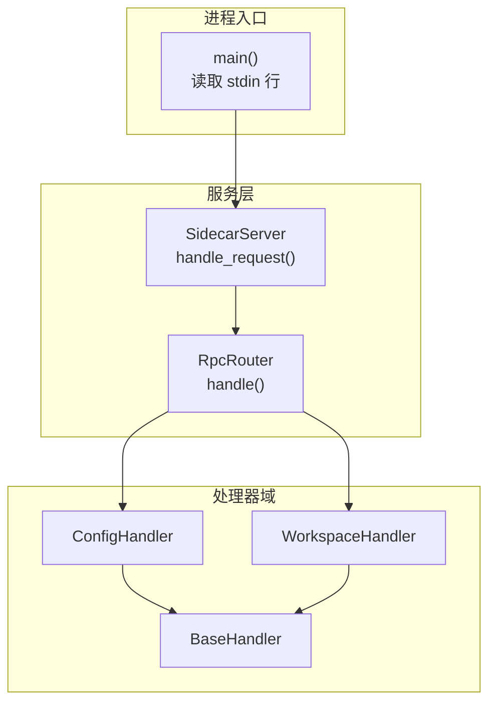
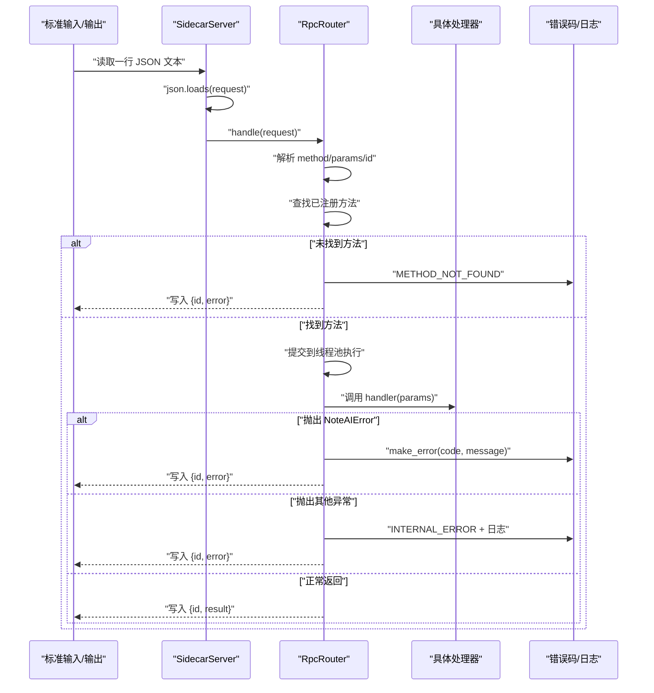
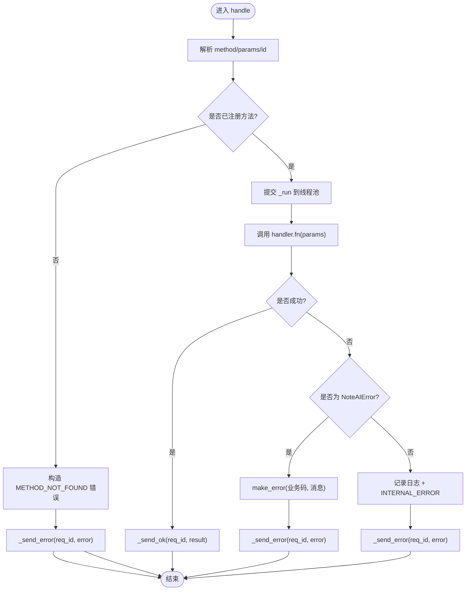
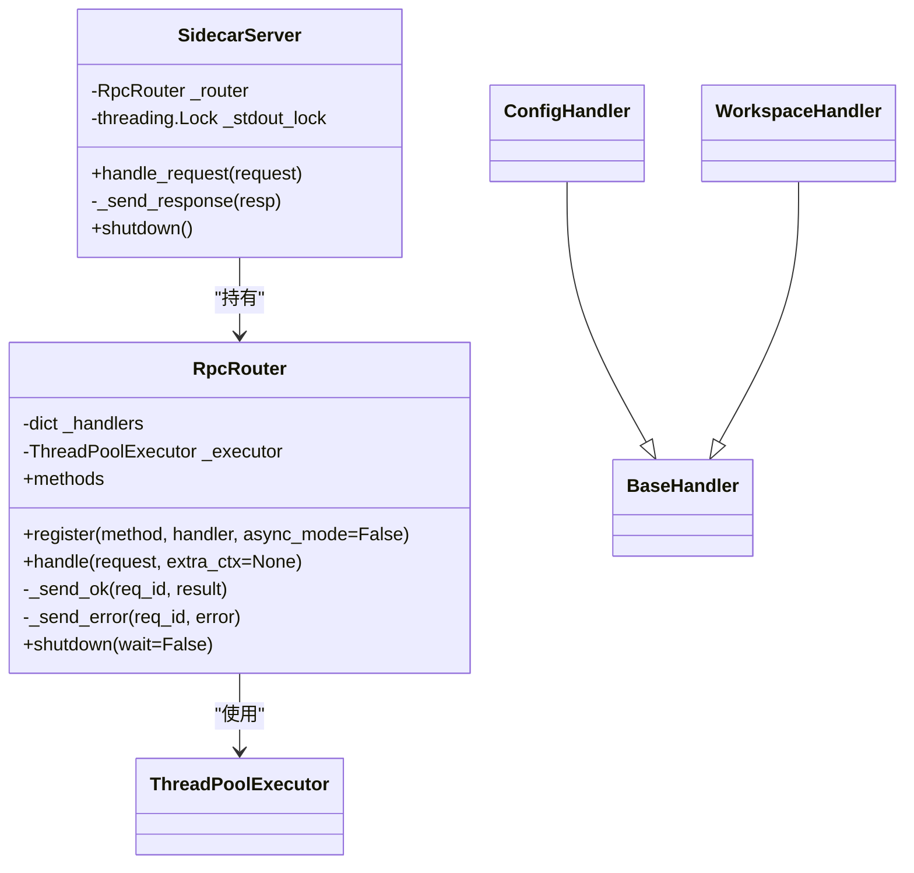
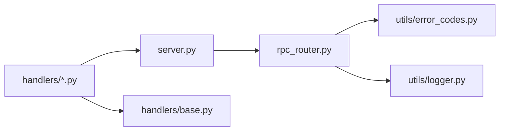

# 请求处理流程

<cite>
**本文引用的文件**
- [rpc_router.py](file://python/sidecar/rpc_router.py)
- [server.py](file://python/sidecar/server.py)
- [base.py](file://python/sidecar/handlers/base.py)
- [config_handler.py](file://python/sidecar/handlers/config_handler.py)
- [workspace_handler.py](file://python/sidecar/handlers/workspace_handler.py)
- [error_codes.py](file://utils/error_codes.py)
- [logger.py](file://utils/logger.py)
- [test_rpc_router.py](file://tests/unit/test_rpc_router.py)
</cite>

## 目录
1. [简介](#简介)
2. [项目结构](#项目结构)
3. [核心组件](#核心组件)
4. [架构总览](#架构总览)
5. [详细组件分析](#详细组件分析)
6. [依赖关系分析](#依赖关系分析)
7. [性能考量](#性能考量)
8. [故障排查指南](#故障排查指南)
9. [结论](#结论)
10. [附录](#附录)

## 简介
本文件面向 JSON-RPC 请求处理流程，聚焦于 handle() 方法的完整执行路径：从请求解析、参数提取、方法查找与处理器调用，到请求验证机制（方法名检查、参数格式校验、权限控制）、线程池调度（任务提交、工作线程分配、结果收集）、请求-响应模式（请求 ID 跟踪、响应序列化），以及并发处理与资源隔离策略。文档同时提供时序图、错误传播机制与性能监控点说明，帮助读者快速理解并定位问题。

## 项目结构
本项目采用“服务层 + 路由层 + 处理器”的分层组织方式：
- 服务层负责 I/O 与生命周期管理（stdin/stdout 读写、事件推送、后台任务）。
- 路由层实现轻量级 JSON-RPC 路由与线程池调度。
- 处理器按功能域划分，通过 BaseHandler 共享服务器能力。

图表来源
- [server.py:570-595](file://python/sidecar/server.py#L570-L595)
- [server.py:541-543](file://python/sidecar/server.py#L541-L543)
- [rpc_router.py:54-82](file://python/sidecar/rpc_router.py#L54-L82)
- [base.py:1-106](file://python/sidecar/handlers/base.py#L1-L106)

章节来源
- [server.py:570-595](file://python/sidecar/server.py#L570-L595)
- [server.py:541-543](file://python/sidecar/server.py#L541-L543)
- [rpc_router.py:54-82](file://python/sidecar/rpc_router.py#L54-L82)
- [base.py:1-106](file://python/sidecar/handlers/base.py#L1-L106)

## 核心组件
- RpcRouter：JSON-RPC 路由与线程池调度，负责方法注册、请求分发、错误封装与响应发送。
- SidecarServer：进程主循环、I/O 锁、事件与任务编排、RPC 路由装配。
- BaseHandler：处理器基类，统一暴露配置、缓存、工作区、进度/任务等能力。
- 具体处理器（如 ConfigHandler、WorkspaceHandler）：实现业务逻辑并通过 register_routes 注册到路由。
- 错误码与日志：统一的错误码枚举、结构化错误构造器与应用日志单例。

章节来源
- [rpc_router.py:35-106](file://python/sidecar/rpc_router.py#L35-L106)
- [server.py:54-125](file://python/sidecar/server.py#L54-L125)
- [base.py:1-106](file://python/sidecar/handlers/base.py#L1-L106)
- [config_handler.py:16-30](file://python/sidecar/handlers/config_handler.py#L16-L30)
- [workspace_handler.py:34-44](file://python/sidecar/handlers/workspace_handler.py#L34-L44)
- [error_codes.py:14-120](file://utils/error_codes.py#L14-L120)
- [logger.py:13-126](file://utils/logger.py#L13-L126)

## 架构总览
下图展示了从 stdin 读取一行 JSON 文本开始，到最终通过 stdout 写出 JSON-RPC 响应的端到端流程。

图表来源
- [server.py:570-595](file://python/sidecar/server.py#L570-L595)
- [server.py:541-543](file://python/sidecar/server.py#L541-L543)
- [rpc_router.py:54-94](file://python/sidecar/rpc_router.py#L54-L94)
- [error_codes.py:82-120](file://utils/error_codes.py#L82-L120)
- [logger.py:92-126](file://utils/logger.py#L92-L126)

## 详细组件分析

### RpcRouter.handle() 执行路径
- 请求解析：从 request 字典中取出 method、params、id。
- 方法查找：在内部映射表 _handlers 中查找 method；未命中则返回 METHOD_NOT_FOUND。
- 处理器调用：将执行包装为闭包 _run，提交至 ThreadPoolExecutor 异步执行，避免阻塞 stdin 读循环。
- 结果与错误：
  - 成功：调用 _send_ok 输出 {"id": req_id, "result": ...}。
  - 业务异常：捕获 NoteAIError，使用 make_error 构造结构化错误，调用 _send_error。
  - 未知异常：记录堆栈日志，构造 INTERNAL_ERROR，调用 _send_error。
- 线程池：默认最大工作线程数为 8，shutdown 时支持等待或取消未完成任务。

图表来源
- [rpc_router.py:54-94](file://python/sidecar/rpc_router.py#L54-L94)
- [error_codes.py:82-120](file://utils/error_codes.py#L82-L120)

章节来源
- [rpc_router.py:43-106](file://python/sidecar/rpc_router.py#L43-L106)

### 请求验证机制
- 方法名检查：由 RpcRouter 在 _handlers 映射中查找，不存在即返回 METHOD_NOT_FOUND。
- 参数格式验证：当前路由层不做强类型校验，交由各处理器自行解析与校验（例如 ConfigHandler 对布尔/浮点/整型进行安全转换）。
- 权限控制：当前代码库未实现基于角色的访问控制；如需扩展，可在 RpcRouter.handle 中增加鉴权中间件或在处理器内校验上下文。

章节来源
- [rpc_router.py:54-63](file://python/sidecar/rpc_router.py#L54-L63)
- [config_handler.py:135-215](file://python/sidecar/handlers/config_handler.py#L135-L215)

### 线程池调度机制
- 任务提交：所有处理器（同步/异步标记）均通过 executor.submit(_run) 提交，确保 stdin 读循环不被阻塞。
- 工作线程分配：ThreadPoolExecutor 内部根据 CPU 与 I/O 特性分配工作线程，最大线程数固定为 8。
- 执行结果收集：处理器执行完成后，通过 send_response 回调写回 stdout；该回调由 SidecarServer 提供，带 stdout 锁保证串行输出。

图表来源
- [rpc_router.py:43-106](file://python/sidecar/rpc_router.py#L43-L106)
- [server.py:54-125](file://python/sidecar/server.py#L54-L125)
- [base.py:1-106](file://python/sidecar/handlers/base.py#L1-L106)
- [config_handler.py:16-30](file://python/sidecar/handlers/config_handler.py#L16-L30)
- [workspace_handler.py:34-44](file://python/sidecar/handlers/workspace_handler.py#L34-L44)

章节来源
- [rpc_router.py:43-106](file://python/sidecar/rpc_router.py#L43-L106)
- [server.py:126-130](file://python/sidecar/server.py#L126-L130)

### 请求-响应模式与请求 ID 跟踪
- 请求 ID：handle 从 request 中提取 id，并在 _send_ok/_send_error 中透传，确保客户端可关联请求与响应。
- 响应序列化：SidecarServer._send_response 使用 json.dumps 并以换行分隔逐行输出，配合 stdout.flush 保证即时可见。
- 事件通道：除标准响应外，服务端还可通过相同通道推送事件（如进度、工作区变更等），其 id 字段约定为 "event"。

章节来源
- [rpc_router.py:84-94](file://python/sidecar/rpc_router.py#L84-L94)
- [server.py:126-143](file://python/sidecar/server.py#L126-L143)

### 错误传播机制
- 结构化错误：通过 ErrorCode 枚举与 make_error 构造包含 code/message/details 的错误体。
- 敏感信息脱敏：错误消息中的工作区路径与用户家目录会被替换为占位符，避免泄露。
- 日志记录：非业务异常会记录完整堆栈，便于排障。

章节来源
- [error_codes.py:14-120](file://utils/error_codes.py#L14-L120)
- [rpc_router.py:14-32](file://python/sidecar/rpc_router.py#L14-L32)
- [rpc_router.py:69-78](file://python/sidecar/rpc_router.py#L69-L78)
- [logger.py:92-126](file://utils/logger.py#L92-L126)

### 处理器示例：配置与工作区
- ConfigHandler：注册 get/save API/UI 配置、主题偏好、项目规则等工作区相关接口，并对参数做安全转换与持久化。
- WorkspaceHandler：管理工作区状态、树形结构构建、文件选择解析等，结合 BaseHandler 提供的缓存与路径工具。

章节来源
- [config_handler.py:16-30](file://python/sidecar/handlers/config_handler.py#L16-L30)
- [config_handler.py:135-215](file://python/sidecar/handlers/config_handler.py#L135-L215)
- [workspace_handler.py:34-44](file://python/sidecar/handlers/workspace_handler.py#L34-L44)
- [workspace_handler.py:107-157](file://python/sidecar/handlers/workspace_handler.py#L107-L157)
- [base.py:1-106](file://python/sidecar/handlers/base.py#L1-L106)

## 依赖关系分析
- 模块耦合：
  - server.py 依赖 rpc_router.py 完成路由与调度。
  - 各处理器继承 base.py，复用服务器能力。
  - rpc_router.py 依赖 utils.error_codes 与 utils.logger。
- 外部依赖：
  - concurrent.futures.ThreadPoolExecutor 用于并发执行。
  - watchdog 用于工作区文件监听（与服务启动后事件相关，非 RPC 主线）。

图表来源
- [server.py:54-125](file://python/sidecar/server.py#L54-L125)
- [rpc_router.py:10-11](file://python/sidecar/rpc_router.py#L10-L11)
- [base.py:1-106](file://python/sidecar/handlers/base.py#L1-L106)

章节来源
- [server.py:54-125](file://python/sidecar/server.py#L54-L125)
- [rpc_router.py:10-11](file://python/sidecar/rpc_router.py#L10-L11)
- [base.py:1-106](file://python/sidecar/handlers/base.py#L1-L106)

## 性能考量
- 并发模型：所有处理器通过线程池异步执行，避免阻塞 stdin 读循环，提升吞吐。
- 线程上限：默认最大工作线程数为 8，适合 I/O 密集型场景；CPU 密集任务建议进一步拆分或引入专用队列。
- 输出串行化：stdout 写操作加锁，避免多写竞争导致数据交错。
- 缓存与失效：工作区变更触发缓存失效与全文索引脏标记，减少重复计算。
- 深度限制：工作区树构建限制递归深度，防止大仓库导致的阻塞。

[本节为通用指导，不直接分析具体文件]

## 故障排查指南
- 常见错误码：
  - METHOD_NOT_FOUND：方法未注册或拼写错误。
  - INVALID_PARAMS：参数缺失或类型不符（由各处理器校验）。
  - INTERNAL_ERROR：未捕获异常或系统错误。
- 定位步骤：
  - 确认方法是否已在对应 Handler 的 register_routes 中注册。
  - 检查 params 结构与类型是否符合处理器预期。
  - 查看应用日志（noteai.log）获取堆栈信息。
  - 若涉及路径泄露，确认错误消息脱敏是否生效。
- 单元测试参考：
  - 已知/未知方法、错误传播、错误消息脱敏等行为均有测试覆盖。

章节来源
- [error_codes.py:14-120](file://utils/error_codes.py#L14-L120)
- [logger.py:110-126](file://utils/logger.py#L110-L126)
- [test_rpc_router.py:34-122](file://tests/unit/test_rpc_router.py#L34-L122)

## 结论
本流程以 RpcRouter.handle() 为核心，实现了轻量、可扩展的 JSON-RPC 请求处理：通过方法注册与查找、线程池异步执行、结构化错误与日志、以及稳定的请求-响应语义，保证了高并发下的稳定性与可观测性。后续可在路由层引入鉴权中间件、参数校验框架与更细粒度的限流/熔断策略，进一步提升安全性与弹性。

[本节为总结性内容，不直接分析具体文件]

## 附录
- 关键路径参考：
  - 请求入口与路由装配：[server.py:570-595](file://python/sidecar/server.py#L570-L595)、[server.py:107-125](file://python/sidecar/server.py#L107-L125)
  - 路由与调度：[rpc_router.py:54-94](file://python/sidecar/rpc_router.py#L54-L94)
  - 错误与日志：[error_codes.py:82-120](file://utils/error_codes.py#L82-L120)、[logger.py:92-126](file://utils/logger.py#L92-L126)
  - 处理器示例：[config_handler.py:16-30](file://python/sidecar/handlers/config_handler.py#L16-L30)、[workspace_handler.py:34-44](file://python/sidecar/handlers/workspace_handler.py#L34-L44)