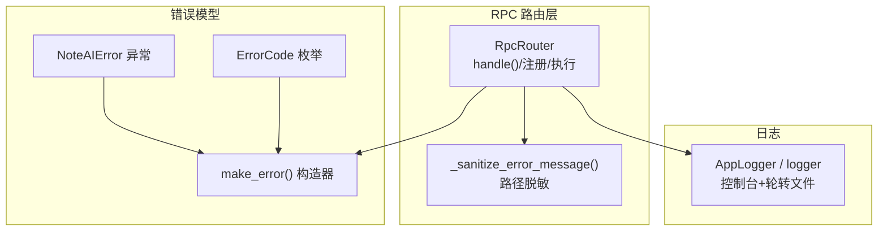
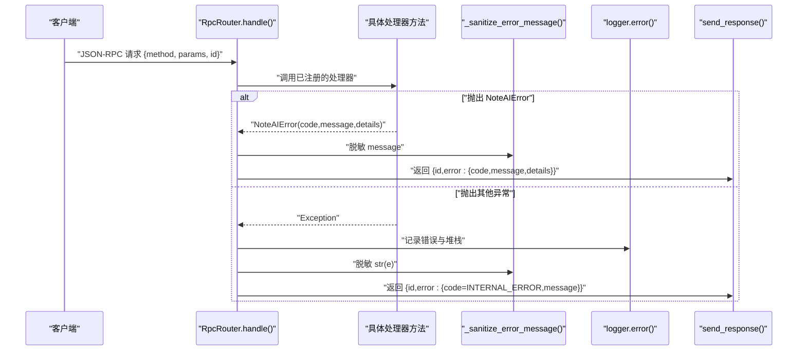
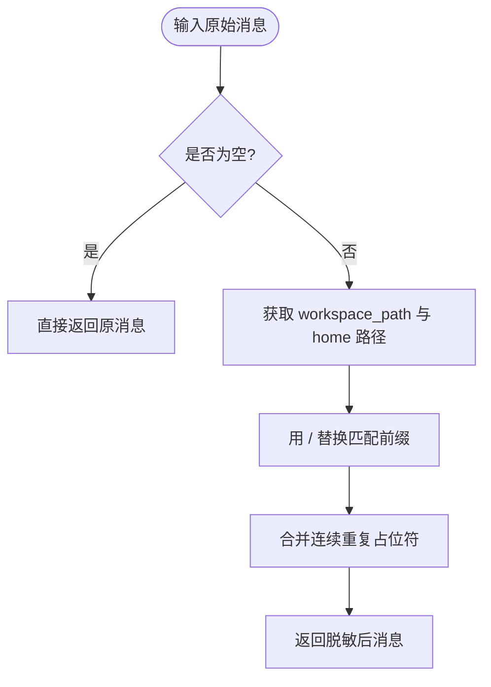
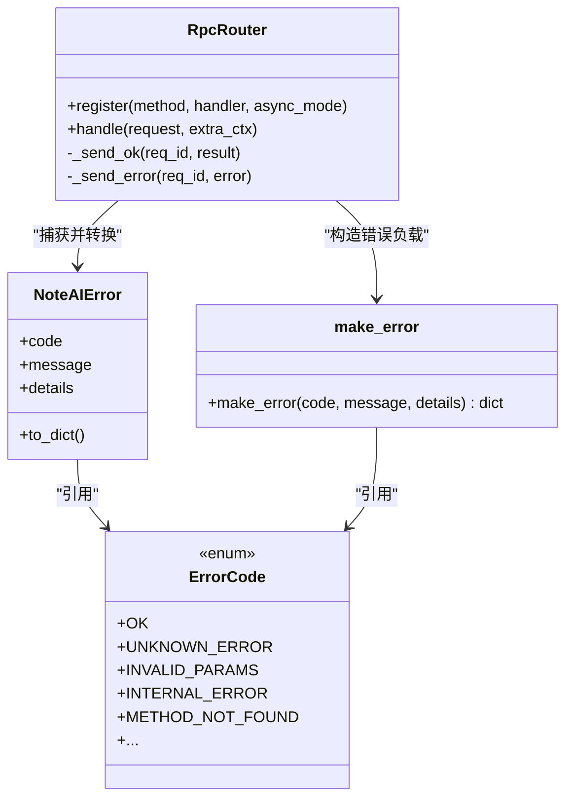
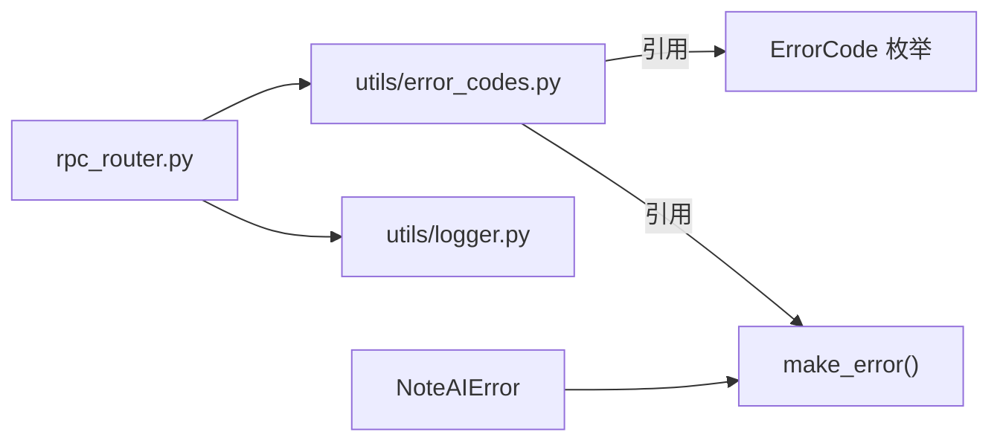

# 错误处理系统

<cite>
**本文引用的文件**   
- [rpc_router.py](file://python/sidecar/rpc_router.py)
- [error_codes.py](file://utils/error_codes.py)
- [logger.py](file://utils/logger.py)
- [test_rpc_router.py](file://tests/unit/test_rpc_router.py)
</cite>

## 目录
1. [简介](#简介)
2. [项目结构](#项目结构)
3. [核心组件](#核心组件)
4. [架构总览](#架构总览)
5. [详细组件分析](#详细组件分析)
6. [依赖关系分析](#依赖关系分析)
7. [性能考量](#性能考量)
8. [故障排查指南](#故障排查指南)
9. [结论](#结论)
10. [附录](#附录)

## 简介
本技术文档聚焦于 NoteAI 的 JSON-RPC 错误处理体系，围绕以下目标展开：
- 错误分类与策略：业务错误、系统错误、网络错误的定义与处理路径
- 安全过滤机制：_sanitize_error_message() 对敏感信息与路径的脱敏
- 错误码规范：ErrorCode 枚举的使用与扩展方式
- 异常捕获层次：NoteAIError 特殊处理与通用异常兜底
- 错误响应格式：面向客户端兼容的错误对象结构
- 流程图、日志记录策略与调试技巧

## 项目结构
与错误处理相关的核心代码位于 sidecar 路由层与 utils 工具层：
- RPC 路由层负责统一捕获、格式化与发送错误响应
- 错误码与结构化错误对象定义在 utils 中，供各处理器复用
- 日志子系统提供线程安全的单例日志器，用于记录内部错误堆栈

图示来源
- [rpc_router.py:1-106](file://python/sidecar/rpc_router.py#L1-L106)
- [error_codes.py:1-120](file://utils/error_codes.py#L1-L120)
- [logger.py:1-126](file://utils/logger.py#L1-L126)

章节来源
- [rpc_router.py:1-106](file://python/sidecar/rpc_router.py#L1-L106)
- [error_codes.py:1-120](file://utils/error_codes.py#L1-L120)
- [logger.py:1-126](file://utils/logger.py#L1-L126)

## 核心组件
- RpcRouter：JSON-RPC 请求分发与错误捕获中心，负责将异常转换为标准错误响应并回写
- ErrorCode：集中化的错误码枚举，覆盖通用、工作区、认证、RAG、特性可用性、模式验证、云同步、UI 等域
- NoteAIError：领域异常，携带 code/message/details，便于上层精确表达业务失败原因
- make_error：构建标准化的错误负载（code/message/details），确保前后端一致的结构
- _sanitize_error_message：对错误消息进行安全过滤，隐藏绝对路径与家目录信息
- AppLogger：应用级日志器，支持控制台输出与按大小轮转的文件日志，便于定位问题

章节来源
- [rpc_router.py:1-106](file://python/sidecar/rpc_router.py#L1-L106)
- [error_codes.py:1-120](file://utils/error_codes.py#L1-L120)
- [logger.py:1-126](file://utils/logger.py#L1-L126)

## 架构总览
下图展示了从请求进入路由到错误响应的完整流程，包括两类异常分支与日志记录点。

图示来源
- [rpc_router.py:54-94](file://python/sidecar/rpc_router.py#L54-L94)
- [error_codes.py:82-120](file://utils/error_codes.py#L82-L120)

## 详细组件分析

### 错误分类与处理策略
- 业务错误（推荐）：由处理器显式抛出 NoteAIError，携带明确的 ErrorCode 与人类可读 message，可选 details 附加上下文。路由层直接将其转为错误响应，不记录堆栈，避免噪音日志。
- 系统错误（兜底）：当处理器抛出非 NoteAIError 的异常时，路由层记录错误与堆栈，并将错误码固定为 INTERNAL_ERROR，同时使用脱敏后的消息返回给客户端。
- 网络错误（外部依赖）：建议封装为 NoteAIError 并使用专用错误码（如 API_CONNECTION_FAILED、CLOUD_AUTH_FAILED 等），以便前端做重试或引导用户配置。

章节来源
- [rpc_router.py:65-78](file://python/sidecar/rpc_router.py#L65-L78)
- [error_codes.py:14-80](file://utils/error_codes.py#L14-L80)

### _sanitize_error_message() 安全过滤机制
- 目标：防止将绝对路径、工作区路径与家目录泄露到客户端
- 行为：
  - 读取当前工作区路径与系统家目录作为替换前缀
  - 将匹配到的前缀替换为占位符 <workspace>/<home>
  - 合并连续重复的占位符，保持消息简洁
- 边界情况：
  - 空消息直接返回
  - 若无法加载配置，忽略工作区路径替换，仅替换家目录
- 测试覆盖：单元测试验证了路径被替换且占位符存在

图示来源
- [rpc_router.py:14-32](file://python/sidecar/rpc_router.py#L14-L32)
- [test_rpc_router.py:115-122](file://tests/unit/test_rpc_router.py#L115-L122)

章节来源
- [rpc_router.py:14-32](file://python/sidecar/rpc_router.py#L14-L32)
- [test_rpc_router.py:89-122](file://tests/unit/test_rpc_router.py#L89-L122)

### 错误码定义规范与扩展
- ErrorCode 枚举：集中管理所有可识别的错误码，涵盖通用、路径/工作区、认证/凭据、RAG/索引、特性可用性、模式/校验、云同步、UI 等类别
- 使用方式：
  - 在处理器中抛出 NoteAIError(ErrorCode.XXX, message, details={...})
  - 或直接返回 make_error(ErrorCode.XXX, message, details={...})
- 扩展建议：
  - 新增错误码应遵循“领域_子域_状态”风格，避免歧义
  - 保持 message 对用户友好，details 保留机器可读上下文
  - 前端通过 code 驱动 i18n 与交互决策（重试、提示安装等）

章节来源
- [error_codes.py:14-80](file://utils/error_codes.py#L14-L80)
- [error_codes.py:82-97](file://utils/error_codes.py#L82-L97)

### 异常捕获层次与 NoteAIError 特殊处理
- 第一层：NoteAIError 分支
  - 路由层捕获后，使用 make_error 构造错误负载，并对 message 执行脱敏
  - 不记录堆栈，避免污染日志
- 第二层：通用 Exception 分支
  - 路由层记录错误与完整堆栈（含 traceback）
  - 将错误码固定为 INTERNAL_ERROR，message 使用脱敏后的字符串
- 未知方法分支
  - 直接构造 METHOD_NOT_FOUND 错误并返回

图示来源
- [rpc_router.py:54-94](file://python/sidecar/rpc_router.py#L54-L94)
- [error_codes.py:100-120](file://utils/error_codes.py#L100-L120)
- [error_codes.py:82-97](file://utils/error_codes.py#L82-L97)

章节来源
- [rpc_router.py:54-94](file://python/sidecar/rpc_router.py#L54-L94)
- [error_codes.py:100-120](file://utils/error_codes.py#L100-L120)

### 错误响应格式与客户端兼容性
- 成功响应：{id, result}
- 错误响应：{id, error: {code, message, details?}}
  - code：来自 ErrorCode 枚举值，前端据此做 i18n 与交互决策
  - message：经过脱敏的人类可读文本
  - details：可选的附加上下文（例如参数名、缺失字段等）
- 兼容性要点：
  - 所有错误均包含 code 与 message，details 可选
  - 内部错误统一使用 INTERNAL_ERROR，避免暴露实现细节
  - 未知方法使用 METHOD_NOT_FOUND，便于前端提示

章节来源
- [rpc_router.py:84-94](file://python/sidecar/rpc_router.py#L84-L94)
- [error_codes.py:82-97](file://utils/error_codes.py#L82-L97)

### 日志记录策略与调试技巧
- 日志位置与级别：
  - 控制台：INFO 及以上
  - 文件：DEBUG 及以上，按大小轮转，保留最近若干份
- 关键记录点：
  - 通用异常分支：记录错误与完整堆栈，便于定位根因
  - 业务异常分支：不记录堆栈，减少噪音
- 调试技巧：
  - 优先检查 INTERNAL_ERROR 对应的日志堆栈
  - 结合 test_rpc_router.py 中的断言思路，验证错误码与消息是否符合预期
  - 使用环境变量 NOTEAI_LOG_DIR 指定日志目录，便于隔离不同环境

章节来源
- [rpc_router.py:72-78](file://python/sidecar/rpc_router.py#L72-L78)
- [logger.py:1-126](file://utils/logger.py#L1-L126)
- [test_rpc_router.py:74-88](file://tests/unit/test_rpc_router.py#L74-L88)

## 依赖关系分析
- RpcRouter 依赖：
  - utils.error_codes：ErrorCode、NoteAIError、make_error
  - utils.logger：全局 logger 实例
  - re/pathlib/config：用于路径解析与正则替换
- 错误模型依赖：
  - ErrorCode 为纯枚举，无运行时依赖
  - NoteAIError 依赖 ErrorCode 与 make_error
  - make_error 仅依赖 ErrorCode

图示来源
- [rpc_router.py:1-12](file://python/sidecar/rpc_router.py#L1-L12)
- [error_codes.py:1-120](file://utils/error_codes.py#L1-L120)
- [logger.py:1-126](file://utils/logger.py#L1-L126)

章节来源
- [rpc_router.py:1-12](file://python/sidecar/rpc_router.py#L1-L12)
- [error_codes.py:1-120](file://utils/error_codes.py#L1-L120)
- [logger.py:1-126](file://utils/logger.py#L1-L126)

## 性能考量
- 路由层将处理器提交至线程池执行，避免阻塞主循环；错误处理逻辑轻量，不影响整体吞吐
- 日志写入采用轮转文件，避免磁盘占用过大；错误堆栈仅在内部异常时记录，降低 IO 开销
- 错误消息脱敏基于字符串替换与正则，复杂度低，适合高频调用

[本节为通用指导，无需特定文件来源]

## 故障排查指南
- 现象：客户端收到 INTERNAL_ERROR
  - 排查步骤：
    - 查看服务器日志，定位对应方法的错误堆栈
    - 确认是否应在处理器中抛出 NoteAIError 以提供更明确的错误码
- 现象：错误消息包含真实路径
  - 排查步骤：
    - 确认是否绕过路由层直接返回消息
    - 检查 _sanitize_error_message 是否被正确调用
- 现象：前端无法区分错误类型
  - 排查步骤：
    - 确认错误响应中包含 code 字段
    - 对照 ErrorCode 枚举，确保使用了合适的错误码
- 现象：日志缺失或过大
  - 排查步骤：
    - 检查 NOTEAI_LOG_DIR 与配置文件中的 log_path
    - 清理旧日志或调整轮转策略

章节来源
- [rpc_router.py:72-78](file://python/sidecar/rpc_router.py#L72-L78)
- [rpc_router.py:14-32](file://python/sidecar/rpc_router.py#L14-L32)
- [logger.py:61-90](file://utils/logger.py#L61-L90)
- [test_rpc_router.py:74-122](file://tests/unit/test_rpc_router.py#L74-L122)

## 结论
该错误处理体系通过统一的错误码、结构化异常与路由层集中捕获，实现了：
- 清晰的错误分类与处理策略
- 严格的安全过滤，避免敏感信息泄露
- 稳定的错误响应格式，提升前端兼容性与用户体验
- 完善的日志记录与调试支撑

建议在后续迭代中持续完善 ErrorCode 覆盖范围，并在业务层尽量抛出 NoteAIError 以提升可观测性。

[本节为总结性内容，无需特定文件来源]

## 附录
- 快速参考：
  - 在处理器中抛出 NoteAIError(ErrorCode.XXX, message, details={...})
  - 需要直接返回错误负载时使用 make_error(ErrorCode.XXX, message, details={...})
  - 遇到外部网络错误，优先使用 API_CONNECTION_FAILED/CLOUD_AUTH_FAILED 等专用码
  - 如需自定义错误码，请在 ErrorCode 中新增并保持命名一致性

[本节为补充说明，无需特定文件来源]